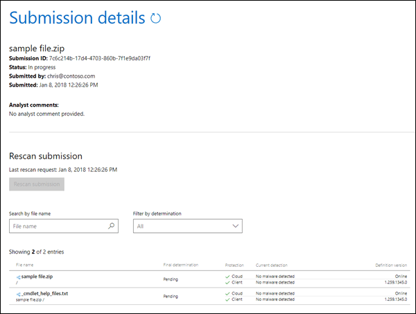

# Inviare malware e non malware a Microsoft per l'analisiSubmit malware and non-malware to Microsoft for analysis

> [!NOTE]
> IIf si è un amministratore in un'organizzazione di Office 365 con le cassette postali di Exchange Online, è consigliabile utilizzare il portale invii nel centro sicurezza & conformità di Office 365.IIf you're an admin in an Office 365 organization with Exchange Online mailboxes, we recommend that you use the Submissions portal in the Office 365 Security & Compliance Center. Per ulteriori informazioni, vedere [utilizzare l'invio di amministratore per inviare messaggi di posta indesiderata, phishing, URL e file a Microsoft](admin-submission.md).For more information, see [Use Admin Submission to submit suspected spam, phish, URLs, and files to Microsoft](admin-submission.md).

La protezione antimalware viene automaticamente inclusa per i clienti di Office 365 con cassette postali in Exchange Online o standalone Exchange Online Protection (EOP) clienti senza cassette postali di Exchange Online.Anti-malware protection is automatically included for Office 365 customers with mailboxes in Exchange Online or standalone Exchange Online Protection (EOP) customers without Exchange Online mailboxes. Per ulteriori informazioni, vedere [anti-malware Protection in Office 365](anti-malware-protection.md).For more information, see [Anti-malware protection in Office 365](anti-malware-protection.md).

È probabile che siano state ascoltate le procedure consigliate seguenti per gli anni:You've probably heard the following best practices for years:

- Evitare di aprire messaggi sospetti.Avoid opening messages that look suspicious.
- Non aprire mai un allegato da un utente che non si conosce.Never open an attachment from someone you don't know.
- Evitare di aprire gli allegati nei messaggi che consentono di aprire o fare clic su di essi.Avoid opening attachments in messages that urge you to open or click them.

Cosa si può fare se si riceve un messaggio con un allegato sospetto?But what can you do if you receive a message with a suspicious attachment? O cosa succede se si sospetta che il computer o il dispositivo sia stato infettato da un allegato di posta elettronica che ha superato i filtri?Or what if you suspect that your computer or device was infected by an email attachment that made it past our filters? In questi casi, è necessario inviare l'allegato antimalware a Microsoft.In these cases, you should submit the malware attachment to Microsoft. Viceversa, se un allegato in un messaggio di posta elettronica è stato erroneamente identificato come malware, è possibile inviare anche questo.Conversely, if an attachment in an email message was incorrectly identified as malware, you can submit that, too.

## Che cosa è necessario sapere prima di iniziareWhat do you need to know before you begin?

- I messaggi con allegati che contengono script o altri eseguibili dannosi sono considerati malware ed è possibile utilizzare le procedure descritte in questo argomento per segnalarli.Messages with attachments that contain scripts or other malicious executables are considered malware, and you can use the procedures in this topic to report them.

- I messaggi con collegamenti a siti dannosi sono considerati come posta indesiderata.Messages with links to malicious sites are considered spam. Per ulteriori informazioni sulla creazione di rapporti di posta indesiderata e non di posta indesiderata, vedere [segnalare messaggi e file a Microsoft](report-junk-email-messages-to-microsoft.md).For more information about reporting spam and non-spam, see [Report messages and files to Microsoft](report-junk-email-messages-to-microsoft.md).

## Inviare file di malware a MicrosoftSubmit malware files to Microsoft

Accedere al sito Web Microsoft Security Intelligence all' <https://www.microsoft.com/wdsi/filesubmission> indirizzo per inviare il file.Go to the Microsoft Security Intelligence website at <https://www.microsoft.com/wdsi/filesubmission> to submit the file. Per ricevere gli aggiornamenti dell'analisi, accedere al sito Web oppure immettere un indirizzo di posta elettronica valido.To receive analysis updates, sign into the website, or enter a valid email address. È consigliabile utilizzare l'account Microsoft Work o School.We recommend that you use your Microsoft work or school account.

Dopo aver caricato il file o i file, tenere presente l' **ID di invio** creato per l'invio di esempio (ad esempio `7c6c214b-17d4-4703-860b-7f1e9da03f7f`,).After you've uploaded the file or files, note the **Submission ID** that's created for your sample submission (for example, `7c6c214b-17d4-4703-860b-7f1e9da03f7f`).

Dopo aver ricevuto il campione, verrà esaminato.After we receive the sample, we'll investigate. Se si determina che il file di esempio è dannoso, verranno intraprese azioni correttive per impedire che il malware venga rilevato.If we determine that the sample file is malicious, we'll take corrective action to prevent the malware from going undetected.

Se si continua a ricevere i messaggi o gli allegati infetti, è consigliabile copiare le intestazioni del messaggio dal messaggio di posta elettronica e contattare il servizio di assistenza clienti Microsoft per ulteriori informazioni.If you continue receiving infected messages or attachments, then you should copy the message headers from the email message, and contact Microsoft Customer Service and Support for further assistance. Assicurarsi di avere anche l' **ID di invio** pronto.Be sure to have your **Submission ID** ready as well.

## Invio di file non antimalware a MicrosoftSubmit non-malware files to Microsoft

È inoltre possibile inviare un file che è stato erroneamente identificato come malware per il sito Web (è sufficiente selezionare **No** per la domanda, **ritieni che questo file contenga malware?**).You can also submit a file that you believe was incorrectly identified as malware to the website (just select **No** for the question, **Do you believe this file contains malware?**).

Dopo aver ricevuto il campione, verrà esaminato.After we receive the sample, we'll investigate. Se si determina che il file di esempio è pulito, verranno intraprese azioni correttive per impedire che il file venga rilevato come malware.If we determine that the sample file is clean, we'll take corrective action to prevent the file from being detected as malware.
