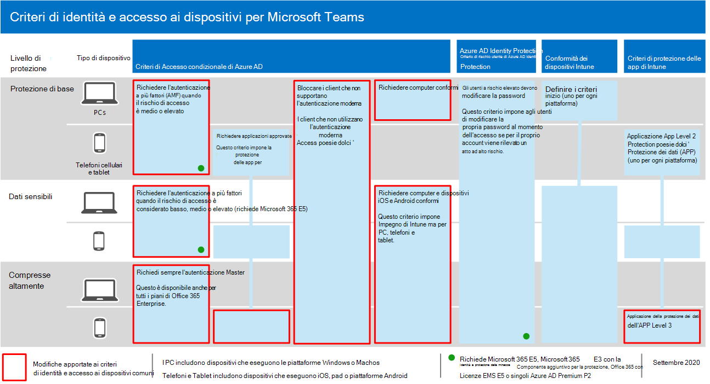
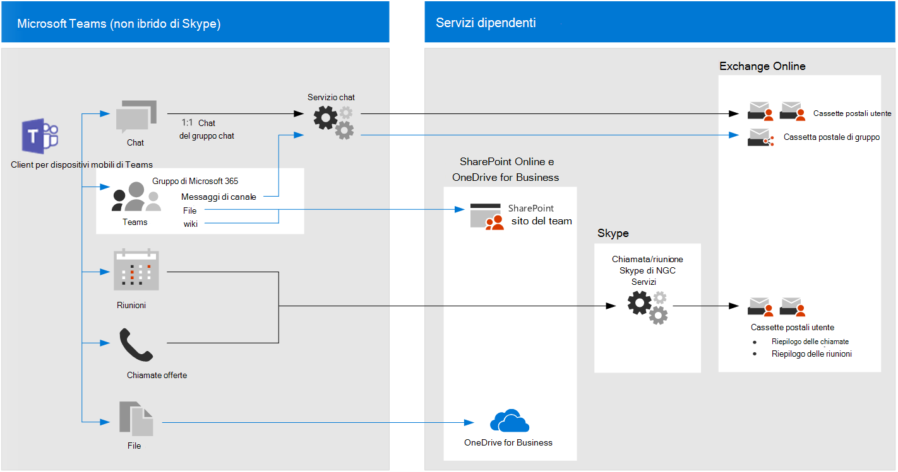

# Suggerimenti sui criteri per la protezione di chat, gruppi e file di TeamPolicy recommendations for securing Teams chats, groups, and files

In questo articolo viene descritto come implementare i criteri di identità e accesso ai dispositivi consigliati per proteggere le chat, i gruppi e i contenuti di Microsoft teams, ad esempio file e calendari.This article describes how to implement the recommended identity and device-access policies to protect Microsoft Teams chats, groups, and content such as files and calendars. Queste linee guida si basano sui [criteri comuni di accesso a identità e dispositivi](identity-access-policies.md), con informazioni aggiuntive specifiche per le squadre.This guidance builds on the [common identity and device access policies](identity-access-policies.md), with additional information that's Teams-specific. Poiché i team si integrano con gli altri prodotti, vedere anche [consigli sui criteri per la protezione di siti e file di SharePoint](sharepoint-file-access-policies.md) e [Suggerimenti per i criteri per la protezione della posta elettronica](secure-email-recommended-policies.md).Because Teams integrates with our other products, also see [Policy recommendations for securing SharePoint sites and files](sharepoint-file-access-policies.md) and [Policy recommendations for securing email](secure-email-recommended-policies.md).

Tali raccomandazioni si basano su tre diversi livelli di sicurezza e protezione per i team che possono essere applicati in base alla granularità delle proprie esigenze: linea di base, sensibile e altamente regolamentata.These recommendations are based on three different tiers of security and protection for Teams that can be applied based on the granularity of your needs: baseline, sensitive, and highly regulated. Per ulteriori informazioni su questi livelli di sicurezza e sui criteri consigliati, fare riferimento a questi suggerimenti nelle [configurazioni di identità e accesso ai dispositivi](microsoft-365-policies-configurations.md).You can learn more about these security tiers and the recommended policies referenced by these recommendations in the [Identity and device access configurations](microsoft-365-policies-configurations.md).

Ulteriori suggerimenti specifici per la distribuzione dei team sono inclusi in questo articolo per coprire specifiche condizioni di autenticazione, ad esempio per gli utenti esterni all'organizzazione.Additional recommendations specific to Teams deployment are included in this article to cover specific authentication circumstances, including for users outside your organization. Sarà necessario seguire queste linee guida per un'esperienza di sicurezza completa.You will need to follow this guidance for a complete security experience.

## Guida introduttiva ai team prima di altri servizi dipendentiGetting started with Teams before other dependent services

Non è necessario abilitare i servizi dipendenti per iniziare a utilizzare Microsoft teams.You don't need to enable dependent services to get started with Microsoft Teams. Questi saranno tutti "solo lavoro".These will all "just work." Tuttavia, è necessario essere pronti a gestire quanto segue:However, you do need to be prepared to manage the following:

- Gruppi di Microsoft 365Microsoft 365 groups
- Siti del team di SharePointSharePoint team sites
- OneDrive for BusinessOneDrive for Business
- Cassette postali di ExchangeExchange mailboxes
- Flussi video e piani di pianificazione (se questi servizi sono abilitati)Stream videos and Planner plans (if these services are enabled)

## Aggiornamento di criteri comuni per l'inclusione di TeamUpdating common policies to include Teams

Per proteggere la chat, i gruppi e il contenuto nei team, nel diagramma seguente vengono illustrati i criteri da aggiornare dai criteri di identità e accesso ai dispositivi comuni.To protect chat, groups and content in Teams, the following diagram illustrates which policies to update from the the common identity and device access policies. Affinché ogni criterio venga aggiornato, assicurarsi che i team e i servizi dipendenti siano inclusi nell'assegnazione delle app cloud.For each policy to update, make sure that Teams and dependent services are included in the assignment of cloud apps.

[Visualizzazione di una versione più grande di questa immagineSee a larger version of this image](https://github.com/MicrosoftDocs/microsoft-365-docs/raw/public/microsoft-365/media/microsoft-365-policies-configurations/identity-access-ruleset-teams.png)

Questi sono i servizi dipendenti da includere nell'assegnazione delle app cloud per i team:These are the dependent services to include in the assignment of cloud apps for Teams:

- Microsoft TeamsMicrosoft Teams
- SharePoint e OneDrive for BusinessSharePoint and OneDrive for Business
- Exchange OnlineExchange Online
- Skype for Business OnlineSkype for Business Online
- Microsoft Stream (registrazioni di riunioni)Microsoft Stream (meeting recordings)
- Microsoft Planner (attività di pianificazione e pianificazione dei dati)Microsoft Planner (Planner tasks and plan data)

In questa tabella sono elencati i criteri che è necessario rivisitare e i collegamenti a ogni criterio nei [criteri di identità e accesso ai dispositivi comuni](identity-access-policies.md), che include il set di criteri più ampio per tutte le applicazioni di Office.This table lists the policies that need to be revisited and links to each policy in the [common identity and device access policies](identity-access-policies.md), which has the wider policy set for all Office applications.

|Livello di protezioneProtection level|CriteriPolicies|Ulteriori informazioni per l'implementazione di TeamsFurther information for Teams implementation|
|---|---|---|
|**Protezione di base****Baseline**|[Richiedere l'AMF quando il rischio di accesso è *medio* o *elevato*Require MFA when sign-in risk is *medium* or *high*](identity-access-policies.md#require-mfa-based-on-sign-in-risk)|Assicurarsi che i team e i servizi dipendenti siano inclusi nell'elenco delle app.Be sure Teams and dependent services are included in the list of apps. I team dispongono di regole di accesso guest e di accesso esterno da prendere in considerazione, per ulteriori informazioni, vedere più avanti in questo articolo.Teams has Guest Access and External Access rules to consider as well, you'll learn more about these later in this article.|
||[Bloccare i client che non supportano l'autenticazione modernaBlock clients that don't support modern authentication](identity-access-policies.md#block-clients-that-dont-support-modern-authentication)|Includere team e servizi dipendenti nell'assegnazione delle app cloud.Include Teams and dependent services in the assignment of cloud apps.|
||[Gli utenti a rischio elevato devono modificare la passwordHigh risk users must change password](identity-access-policies.md#high-risk-users-must-change-password)|Costringe gli utenti dei team a modificare la propria password quando si effettua l'accesso se viene rilevata un'attività ad alto rischio per il proprio account.Forces Teams users to change their password when signing in if high-risk activity is detected for their account. Assicurarsi che i team e i servizi dipendenti siano inclusi nell'elenco delle app.Be sure Teams and dependent services are included in the list of apps.|
||[Applicare i criteri di protezione dei dati dell'APPApply APP data protection policies](identity-access-policies.md#apply-app-data-protection-policies)|Assicurarsi che i team e i servizi dipendenti siano inclusi nell'elenco delle app.Be sure Teams and dependent services are included in the list of apps. Aggiornare i criteri per ogni piattaforma (iOS, Android, Windows).Update the policy for each platform (iOS, Android, Windows).|
||[Definire i criteri di conformità del dispositivoDefine device compliance policies](identity-access-policies.md#define-device-compliance-policies)|Includere team e servizi dipendenti in questo criterio.Include Teams and dependent services in this policy.|
||[Richiedere computer conformiRequire compliant PCs](identity-access-policies.md#require-compliant-pcs-but-not-compliant-phones-and-tablets)|Includere team e servizi dipendenti in questo criterio.Include Teams and dependent services in this policy.|
|**Sensibili****Sensitive**|[Richiedere l'AMF quando il rischio di accesso è *basso*, *medio* o *alto*Require MFA when sign-in risk is *low*, *medium* or *high*](identity-access-policies.md#require-mfa-based-on-sign-in-risk)|I team dispongono di regole di accesso guest e di accesso esterno da prendere in considerazione, per ulteriori informazioni, vedere più avanti in questo articolo.Teams has Guest Access and External Access rules to consider as well, you'll learn more about these later in this article. Includere team e servizi dipendenti in questo criterio.Include Teams and dependent services in this policy.|
||[Richiedere PC conformi *e* dispositivi mobiliRequire compliant PCs *and* mobile devices](identity-access-policies.md#require-compliant-pcs-and-mobile-devices)|Includere team e servizi dipendenti in questo criterio.Include Teams and dependent services in this policy.|
|**Riservatezza elevata****Highly regulated**|[Richiede *sempre* l'autenticazione Master*Always* require MFA](identity-access-policies.md#require-mfa-based-on-sign-in-risk)|Indipendentemente dall'identità dell'utente, l'AMF verrà utilizzata dall'organizzazione.Regardless of user identity, MFA will be used by your organization. Includere team e servizi dipendenti in questo criterio.Include Teams and dependent services in this policy. |
|

## Architettura dei servizi dipendenti dai teamTeams dependent services architecture

Per informazioni di riferimento, nel diagramma seguente vengono illustrati i team di servizi su cui si basa.For reference, the following diagram illustrates the services Teams relies on. Per ulteriori informazioni e altre illustrazioni, vedere [Microsoft Teams and related Productivity Services in microsoft 365 for it Architects](../../solutions/productivity-illustrations.md).For more information and additional illustrations, see [Microsoft Teams and related productivity services in Microsoft 365 for IT architects](../../solutions/productivity-illustrations.md).

[Visualizzazione di una versione più grande di questa immagineSee a larger version of this image](https://github.com/MicrosoftDocs/microsoft-365-docs/raw/public/microsoft-365/media/microsoft-365-policies-configurations/identity-access-logical-architecture-teams.png)

## Guest e accesso esterno per i teamGuest and external access for Teams

Microsoft teams definisce quanto segue:Microsoft Teams defines the following:

- **L'accesso Guest** utilizza un account di Azure ad B2B per un ospite o un utente esterno che può essere aggiunto come membro di un team e dispone di tutti gli accessi autorizzati alla comunicazione e alle risorse del team.**Guest access** uses an Azure AD B2B account for a guest or external user that can be added as a member of a team and have all permissioned access to the communication and resources of the team.

- **L'accesso esterno** è per un utente esterno che non dispone di un account di Azure ad B2B.**External access** is for an external user that does not have an Azure AD B2B account. L'accesso esterno può includere gli inviti e la partecipazione a chiamate, chat e riunioni, ma non include l'appartenenza al team e l'accesso alle risorse del team.External access can include invitations and participation in calls, chats, and meetings, but does not include team membership and access to the resources of the team.

I criteri di accesso condizionale si applicano solo all'accesso guest nei team perché è presente un account di Azure AD B2B corrispondente.Conditional Access policies only apply to guest access in Teams because there is a corresponding Azure AD B2B account.

<!--
In Azure AD, guest and external users are the same. The user type for both of these is Guest. Guest users are B2B users. Microsoft Teams differentiates between guest users and external users in the app. While it's important to understand how each of these are treated in Teams, both types of users are B2B users in Azure AD and the recommended policies for B2B users apply to both.

-->

Per i criteri consigliati per consentire l'accesso per gli utenti guest e esterni con un account di Azure AD B2B, vedere [criteri per consentire l'accesso all'account Guest ed esterno B2B](identity-access-policies-guest-access.md).For recommended policies to allow access for guest and external users with an Azure AD B2B account, see [Policies for allowing guest and external B2B account access](identity-access-policies-guest-access.md).

### Accesso guest in TeamsGuest access in Teams

Oltre ai criteri per gli utenti interni all'azienda o all'organizzazione, gli amministratori possono abilitare l'accesso guest per consentire, a livello di utente, le persone esterne alla propria azienda o all'organizzazione per accedere alle risorse dei team e interagire con gli utenti interni per operazioni quali conversazioni di gruppo, chat e riunioni.In addition to the policies for users who are internal to your business or organization, administrators may enable guest access to allow, on a user-by-user basis, people who are external to your business or organization to access Teams resources and interact with internal people for things like group conversations, chat, and meetings.

Per ulteriori informazioni sull'accesso guest e su come implementarlo, vedere  [Teams Guest Access](https://docs.microsoft.com/microsoftteams/guest-access).For more information about guest access and how to implement it, see  [Teams guest access](https://docs.microsoft.com/microsoftteams/guest-access).

### Accesso esterno in teamsExternal access in Teams

L'accesso esterno a volte è confuso con l'accesso guest, quindi è importante essere chiaro che questi due meccanismi di accesso non interno sono in realtà molto diversi.External access is sometimes confused with guest access, so it's important to be clear that these two non-internal access mechanisms are actually quite different.

L'accesso esterno è un modo per gli utenti di teams provenienti da un intero dominio esterno di trovare, chiamare, chattare e impostare riunioni con gli utenti nei team.External access is a way for Teams users from an entire external domain to find, call, chat, and set up meetings with your users in Teams. Gli amministratori dei team configurano l'accesso esterno a livello di organizzazione.Teams administrators configure external access at the organization level. Per ulteriori informazioni, vedere [gestire l'accesso esterno in Microsoft teams](https://docs.microsoft.com/microsoftteams/manage-external-access).For more information, see [Manage external access in Microsoft Teams](https://docs.microsoft.com/microsoftteams/manage-external-access).

Gli utenti di accessi esterni hanno meno accesso e funzionalità di un utente aggiunto tramite accesso guest.External access users have less access and functionality than an individual who's been added via guest access. Ad esempio, gli utenti di Access esterni possono chattare con gli utenti interni con i team, ma non possono accedere ai canali, ai file o ad altre risorse del team.For example, external access users can chat with your internal users with Teams but cannot access team channels, files, or other resources.

L'accesso esterno non utilizza gli account utente di Azure AD B2B e pertanto non utilizza i criteri di accesso condizionale.External access does not use Azure AD B2B user accounts and therefore does not use Conditional Access policies.

## Criteri per i teamTeams policies

Al di fuori dei criteri comuni sopra elencati, esistono criteri specifici per le squadre che possono e devono essere configurati per gestire diverse funzionalità dei team.Outside of the common policies listed above, there are Teams-specific policies that can and should be configured to manage various Teams functionalities.

### Criteri per team e canaliTeams and channels policies

I team e i canali sono due elementi comunemente utilizzati in Microsoft teams e esistono criteri che è possibile applicare per controllare quali utenti possono o non possono eseguire quando si utilizzano Team e canali.Teams and channels are two commonly used elements in Microsoft Teams, and there are policies you can put in place to control what users can and cannot do when using teams and channels. Anche se è possibile creare un team globale, se l'organizzazione dispone di 5000 utenti o meno, è probabile che sia utile disporre di team e canali di dimensioni ridotte per scopi specifici, in linea con le proprie esigenze organizzative.While you can create a global team, if your organization has 5000 users or less, you are likely to find it helpful to have smaller teams and channels for specific purposes, in-line with your organizational needs.

Se si desidera modificare il criterio predefinito o creare criteri personalizzati, è possibile ottenere ulteriori informazioni sulla gestione dei criteri in questo collegamento: [gestire i criteri per i team in Microsoft teams](https://docs.microsoft.com/microsoftteams/teams-policies).Changing the default policy or creating custom policies would be recommended, and you can learn more about managing your policies at this link: [Manage teams policies in Microsoft Teams](https://docs.microsoft.com/microsoftteams/teams-policies).

### Criteri di messaggisticaMessaging policies

La messaggistica o la chat può anche essere gestita tramite il criterio globale predefinito oppure tramite criteri personalizzati e questo può consentire agli utenti di comunicare tra loro in un modo appropriato per la propria organizzazione.Messaging, or chat, can also be managed through the default global policy, or through custom policies, and this can help your users communicate with one another in a way that's appropriate for your organization. Tali informazioni possono essere esaminate in [Managing Messaging policys in teams](https://docs.microsoft.com/microsoftteams/messaging-policies-in-teams).This information can be reviewed at [Managing messaging policies in Teams](https://docs.microsoft.com/microsoftteams/messaging-policies-in-teams).

### Criteri di riunioneMeeting policies

Nessuna discussione sui team verrebbe completata senza pianificare e implementare i criteri per le riunioni dei team.No discussion of Teams would be complete without planning and implementing policies around Teams meetings. Le riunioni sono un componente essenziale dei team, che consente alle persone di soddisfare e presentare formalmente a numerosi utenti contemporaneamente, nonché di condividere contenuti rilevanti per la riunione.Meetings are an essential component of Teams, allowing people to formally meet and present to many users at once, as well as share content relevant to the meeting. L'impostazione dei criteri corretti per l'organizzazione attorno alle riunioni è essenziale.Setting the right policies for your organization around meetings is essential.

Per ulteriori informazioni, vedere [Manage meeting Policies in teams](https://docs.microsoft.com/microsoftteams/meeting-policies-in-teams) .Please review [Manage meeting policies in Teams](https://docs.microsoft.com/microsoftteams/meeting-policies-in-teams) for more information.

### Criteri di autorizzazione delle appApp permission policies

I team consentono inoltre di utilizzare le app in vari punti, ad esempio i canali o le chat personali.Teams also allows you to use apps in various places, such as channels or personal chats. Disporre di criteri per l'aggiunta e l'utilizzo delle app e in cui è essenziale mantenere un ambiente ricco di contenuti che sia anche sicuro.Having policies around what apps can be added and used, and where, is essential to maintaining a content-rich environment that is also secure.

Per ulteriori informazioni sui criteri di autorizzazione delle app, vedere [gestire i criteri di autorizzazione delle app in Microsoft teams](https://docs.microsoft.com/microsoftteams/teams-app-permission-policies).For more reading about App Permission Policies, check out [Manage app permission policies in Microsoft Teams](https://docs.microsoft.com/microsoftteams/teams-app-permission-policies).

## Passaggi successiviNext steps

Configurare i criteri di accesso condizionale per:Configure Conditional Access policies for:

- [Exchange OnlineExchange Online](secure-email-recommended-policies.md)
- [SharePointSharePoint](sharepoint-file-access-policies.md)
