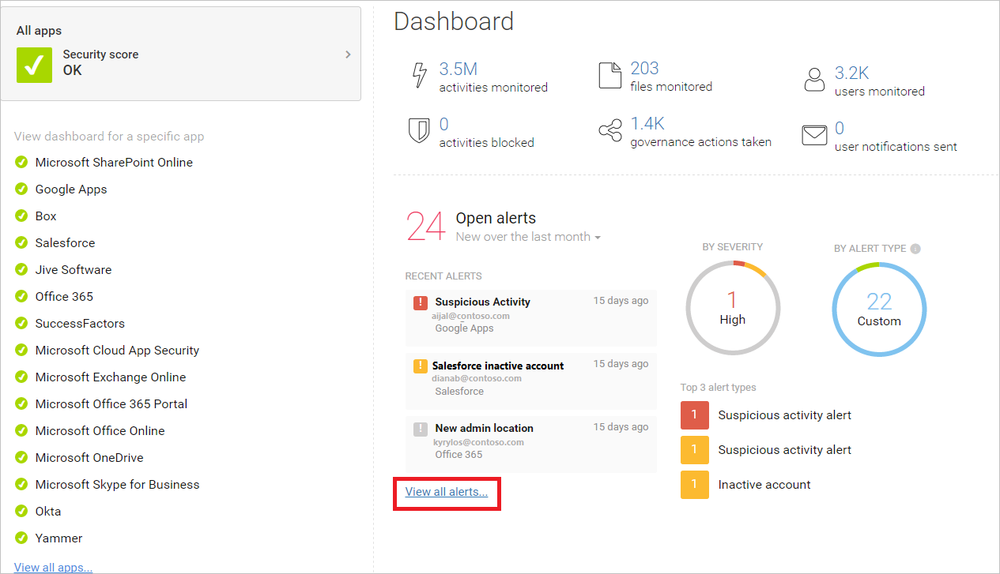

# Configurare il tenant di Microsoft 365 per una maggiore sicurezzaConfigure your Microsoft 365 tenant for increased security

[!INCLUDE [Microsoft 365 Defender rebranding](../includes/microsoft-defender-for-office.md)]

**Si applica a****Applies to**
- [Exchange Online ProtectionExchange Online Protection](exchange-online-protection-overview.md)
- [Microsoft Defender per Office 365 piano 1 e piano 2Microsoft Defender for Office 365 plan 1 and plan 2](defender-for-office-365.md)
- [Microsoft 365 DefenderMicrosoft 365 Defender](../defender/microsoft-365-defender.md)

In questo argomento viene illustrata la configurazione consigliata per le impostazioni a livello di tenant che influiscono sulla sicurezza dell'ambiente Microsoft 365 locale.This topic walks you through recommended configuration for tenant-wide settings that affect the security of your Microsoft 365 environment. Le esigenze di sicurezza potrebbero richiedere una maggiore o minore sicurezza.Your security needs might require more or less security. Usa questi suggerimenti come punto di partenza.Use these recommendations as a starting point.

## Controllare Office 365 punteggio sicuroCheck Office 365 Secure Score

Office 365 Secure Score analizza la sicurezza dell'organizzazione in base alle attività e alle impostazioni di sicurezza regolari e assegna un punteggio.Office 365 Secure Score analyzes your organization's security based on your regular activities and security settings and assigns a score. Per iniziare, prendere nota del punteggio corrente.Begin by taking note of your current score. La regolazione di alcune impostazioni a livello di tenant aumenterà il punteggio.Adjusting some tenant-wide settings will increase your score. L'obiettivo non è raggiungere il punteggio massimo, ma essere consapevoli delle opportunità di protezione dell'ambiente che non influiscono negativamente sulla produttività degli utenti.The goal is not to achieve the max score, but to be aware of opportunities to protect your environment that do not negatively affect productivity for your users. Vedere [Microsoft Secure Score](../defender/microsoft-secure-score.md).See [Microsoft Secure Score](../defender/microsoft-secure-score.md).

## Ottimizzare i criteri di gestione delle minacce nel centro Microsoft 365 sicurezzaTune threat management policies in the Microsoft 365 security center

Il centro Microsoft 365 sicurezza include funzionalità che proteggono l'ambiente.The Microsoft 365 security center includes capabilities that protect your environment. Include inoltre report e dashboard che è possibile utilizzare per monitorare ed eseguire azioni.It also includes reports and dashboards you can use to monitor and take action. Alcune aree sono associate a configurazioni dei criteri predefinite.Some areas come with default policy configurations. Alcune aree non includono criteri o regole predefiniti.Some areas do not include default policies or rules. Visitare questi criteri in Gestione delle minacce per ottimizzare le impostazioni di gestione delle minacce per un ambiente più sicuro.Visit these policies under threat management to tune threat management settings for a more secure environment.

 

****

|AreaArea|Include un criterio predefinitoIncludes a default policy|ConsiglioRecommendation|
|---|---|---|
|**Anti-phishing****Anti-phishing**|SìYes|<ul><li>Protezione della rappresentazione: se si dispone di Defender per Office 365 e di un dominio personalizzato, configurare le impostazioni di protezione della rappresentazione nel criterio anti-phishing predefinito per proteggere gli account di posta elettronica degli utenti più importanti, ad esempio il CEO, e per proteggere il dominio.Impersonation protection — If you have Defender for Office 365 and a custom domain, configure the impersonation protection settings in the default anti-phishing policy to protect the email accounts of your most valuable users, such as your CEO, and to protect your domain. Ulteriori informazioni: [Impostazioni di rappresentazione nei criteri anti-phishing](set-up-anti-phishing-policies.md#impersonation-settings-in-anti-phishing-policies-in-microsoft-defender-for-office-365) e [Informazioni dettagliate sulla rappresentazione](impersonation-insight.md)More information: [Impersonation settings in anti-phishing policies](set-up-anti-phishing-policies.md#impersonation-settings-in-anti-phishing-policies-in-microsoft-defender-for-office-365) and [Impersonation insight](impersonation-insight.md)</li><li>Spoof intelligence: esaminare i mittenti che effettuano lo spoofing del dominio.Spoof intelligence — Review senders who are spoofing your domain. Bloccare o consentire questi mittenti.Block or allow these senders. Ulteriori informazioni: [Spoofing intelligence insight in EOP](learn-about-spoof-intelligence.md) e [Manage the Tenant Allow/Block List](tenant-allow-block-list.md).More information: [Spoof intelligence insight in EOP](learn-about-spoof-intelligence.md) and [Manage the Tenant Allow/Block List](tenant-allow-block-list.md).</li></ul>|
|**Motore antimalware****Anti-Malware Engine**|SìYes|Modificare il criterio predefinito:Edit the default policy: <ul><li>Selezionare **Abilita il filtro allegati comuni**Select **Enable the common attachments filter**</li></ul> 
 È inoltre possibile creare criteri di filtro antimalware personalizzati e applicarli a utenti, gruppi o domini specifici nell'organizzazione.You can also create custom malware filter policies and apply them to specified users, groups, or domains in your organization. 
 Ulteriori informazioni:More information: <ul><li>[Protezione antimalwareAnti-malware protection](anti-malware-protection.md)</li><li>[Configurazione dei criteri anti-malwareConfigure anti-malware policies](configure-anti-malware-policies.md)</li></ul>|
|**Allegati sicuri in Microsoft Defender per Office 365****Safe Attachments in Microsoft Defender for Office 365**|NoNo|Nella pagina principale per Allegati sicuri fare clic su **Impostazioni globali** e attivare questa impostazione:On the main page for Safe Attachments, click **Global settings** and turn on this setting: <ul><li>**Per altre informazioni, vedere Attivare Microsoft Defender per Office 365 per SharePoint, OneDrive e Microsoft Teams.****Turn on Defender for Office 365 for SharePoint, OneDrive, and Microsoft Teams**</li></ul> 
 Creare un criterio Allegati sicuri con queste impostazioni:Create a Safe Attachments policy with these settings: <ul><li> **Blocca**: selezionare **Blocca** come risposta malware sconosciuta.**Block**: Select **Block** as the unknown malware response.</li><li>**Abilita reindirizzamento:** selezionare questa casella e immettere un indirizzo di posta elettronica, ad esempio un account amministratore o di quarantena.**Enable redirect**: Check this box and enter an email address, such as an admin or quarantine account.</li><li>Applica la selezione precedente se si verifica il timeout o l'errore dell'analisi **antimalware** per gli allegati: selezionare questa casella.**Apply the above selection if malware scanning for attachments times out or error occurs**: Check this box.</li><li>\**_Applicato a_*: **Il dominio del destinatario è** il dominio \> selezionato.\**_Applied to_*: **The recipient domain is** \> select your domain.</li></ul> 
 Ulteriori informazioni: [Allegati sicuri per SharePoint, OneDrive e Microsoft Teams](mdo-for-spo-odb-and-teams.md) e Configurare i criteri allegati [sicuri](set-up-safe-attachments-policies.md)More information: [Safe Attachments for SharePoint, OneDrive, and Microsoft Teams](mdo-for-spo-odb-and-teams.md) and [Set up Safe Attachments policies](set-up-safe-attachments-policies.md)|
|**Collegamenti sicuri in Microsoft Defender per Office 365****Safe Links in Microsoft Defender for Office 365**|SìYes|Nella pagina principale per Collegamenti sicuri fare clic su **Impostazioni globali**:On the main page for Safe Links, click **Global settings**: <ul><li>**Usa collegamenti sicuri in: Office 365 applicazioni**: verificare che questa impostazione sia attivata.**Use Safe Links in: Office 365 applications**: Verify this setting is turned on.</li><li>**Non tenere traccia quando gli utenti fanno clic su Collegamenti sicuri**: disattiva questa impostazione per tenere traccia dei clic degli utenti.**Do not track when users click Safe Links**: Turn this setting off to track user clicks.</li></ul> 
 Creare un criterio collegamenti sicuri con queste impostazioni:Create a Safe Links policy with these settings: <ul><li>**Selezionare l'azione per URL sconosciuti potenzialmente dannosi nei messaggi**: verificare che questa impostazione sia **attivata.****Select the action for unknown potentially malicious URLs in messages**: Verify this setting is **On**.</li><li>**Selezionare l'azione per URL sconosciuti** o potenzialmente dannosi all'interno Microsoft Teams : Verificare che questa impostazione sia **attivata.****Select the action for unknown or potentially malicious URLs within Microsoft Teams**: Verify this setting is **On**.</li><li>**Applica l'analisi degli URL** in tempo reale per i collegamenti sospetti e i collegamenti che puntano ai file: seleziona questa casella.**Apply real-time URL scanning for suspicious links and links that point to files**: Check this box.</li><li>**Attendere il completamento dell'analisi degli URL prima di recapitare il** messaggio: selezionare questa casella.**Wait for URL scanning to complete before delivering the message**: Check this box.</li><li>**Applica collegamenti sicuri ai messaggi di posta elettronica inviati all'interno dell'organizzazione**: selezionare questa casella**Apply Safe Links to email messages sent within the organization**: Check this box</li><li>**Non consentire agli utenti di passare all'URL originale**: selezionare questa casella.**Do not allow users to click through to original URL**: Check this box.</li><li>**Applicato a**: **Il dominio del destinatario è** il dominio \> selezionato.**Applied To**: **The recipient domain is** \> select your domain.</li></ul> 
 Ulteriori informazioni: [Set up Safe Links policies](set-up-safe-links-policies.md).More information: [Set up Safe Links policies](set-up-safe-links-policies.md).|
|**Protezione da posta indesiderata (filtro posta)****Anti-Spam (Mail filtering)**|SìYes| Cosa controllare: Troppa posta indesiderata: scegliere le impostazioni personalizzate e modificare il criterio filtro predefinito per la posta indesiderata.What to watch for: Too much spam — Choose the Custom settings and edit the Default spam filter policy. Ulteriori informazioni: [Microsoft 365 protezione da posta indesiderata](anti-spam-protection.md).More information: [Microsoft 365 Email Anti-Spam Protection](anti-spam-protection.md).|
|***Autenticazione posta elettronica******Email Authentication***|SìYes|L'autenticazione della posta elettronica utilizza un DNS (Domain Name System) per aggiungere informazioni verificabili ai messaggi di posta elettronica sul mittente di un messaggio di posta elettronica.Email authentication uses a Domain Name System (DNS) to add verifiable information to email messages about the sender of an email. Microsoft 365 l'autenticazione della posta elettronica per il relativo dominio predefinito (onmicrosoft.com), ma gli Microsoft 365 amministratori possono utilizzare anche l'autenticazione di posta elettronica per i domini personalizzati.Microsoft 365 sets up email authentication for its default domain (onmicrosoft.com), but Microsoft 365 admins can also use email authentication for custom domains. Vengono utilizzati tre metodi di autenticazione:Three authentication methods are used: <ul><li>Sender Policy Framework (o SPF).Sender Policy Framework (or SPF).</li><ul><li>Per la configurazione, vedere [Set up SPF in Microsoft 365 to help prevent spoofing](set-up-spf-in-office-365-to-help-prevent-spoofing.md).For setup, see [Set up SPF in Microsoft 365 to help prevent spoofing](set-up-spf-in-office-365-to-help-prevent-spoofing.md).</li></ul> <li>DomainKeys Identified Mail (DKIM).DomainKeys Identified Mail (DKIM).</li><ul><li>Vedi [Usare DKIM per convalidare la posta elettronica in uscita inviata dal dominio personalizzato.](use-dkim-to-validate-outbound-email.md)See [Use DKIM to validate outbound email sent from your custom domain](use-dkim-to-validate-outbound-email.md).</li><li>Dopo aver configurato DKIM, abilitarlo nel Centro sicurezza.After you've configured DKIM, enable it in the security center.</li></ul><li>DMARC (Domain-based Message Authentication, Reporting, and Conformance).Domain-based Message Authentication, Reporting, and Conformance (DMARC).</li><ul><li>Per la configurazione DMARC [Utilizzare DMARC per convalidare la posta elettronica in Microsoft 365](use-dmarc-to-validate-email.md).For DMARC setup [Use DMARC to validate email in Microsoft 365](use-dmarc-to-validate-email.md).</li></ul></ul>|
|

> [!NOTE]
> Per distribuzioni non standard di SPF, distribuzioni ibride e risoluzione dei problemi: come Microsoft 365 utilizza [Sender Policy Framework (SPF)](how-office-365-uses-spf-to-prevent-spoofing.md)per impedire lo spoofing .For non-standard deployments of SPF, hybrid deployments, and troubleshooting: [How Microsoft 365 uses Sender Policy Framework (SPF) to prevent spoofing](how-office-365-uses-spf-to-prevent-spoofing.md).

## Visualizzare dashboard e report nel Centro sicurezza & conformitàView dashboards and reports in the Security & Compliance Center

Visitare questi report e dashboard per ulteriori informazioni sull'integrità dell'ambiente.Visit these reports and dashboards to learn more about the health of your environment. I dati in questi report diventeranno più ricchi quando l'organizzazione utilizza Office 365 servizi.The data in these reports will become richer as your organization uses Office 365 services. Per il momento, acquisire familiarità con gli elementi che è possibile monitorare ed eseguire.For now, be familiar with what you can monitor and take action on. Per ulteriori informazioni, vedere [Reports in the Security & Compliance Center.](../../compliance/reports-in-security-and-compliance.md)For more information, see [Reports in the Security & Compliance Center](../../compliance/reports-in-security-and-compliance.md).

 

****

|DashboardDashboard|DescrizioneDescription|
|---|---|
|[Dashboard di gestione delle minacceThreat management dashboard](security-dashboard.md)|Nella sezione **Gestione** delle minacce del Centro sicurezza usa questo dashboard per visualizzare le minacce già gestite e come utile strumento per segnalare ai decision maker aziendali quali funzionalità di indagine e risposta alle minacce hanno già fatto per proteggere la tua azienda.In the **Threat management** section of the security center, use this dashboard to see threats that have already been handled, and as a handy tool for reporting out to business decision makers on what threat investigation and response capabilities have already done to secure your business.|
|[Esplora minacce (o rilevamenti in tempo reale)Threat Explorer (or real-time detections)](threat-explorer.md)|Questo è anche nella sezione **Gestione delle** minacce del centro sicurezza.This is also in the **Threat management** section of the security center. Se si sta analizzando o si verifica un attacco al tenant, usare Explorer (o rilevamenti in tempo reale) per analizzare le minacce.If you are investigating or experiencing an attack against your tenant, use Explorer (or real-time detections) to analyze threats. Explorer (e il report sui rilevamenti in tempo reale) mostra il volume di attacchi nel tempo ed è possibile analizzare questi dati in base alle famiglie di minacce, all'infrastruttura degli utenti malintenzionati e altro ancora.Explorer (and the real-time detections report) shows you the volume of attacks over time, and you can analyze this data by threat families, attacker infrastructure, and more. È inoltre possibile contrassegnare qualsiasi messaggio di posta elettronica sospetto per l'elenco Eventi imprevisti.You can also mark any suspicious email for the Incidents list.|
|Report - DashboardReports — Dashboard|Nella sezione **Report** del Centro sicurezza, visualizzare i report di controllo per le organizzazioni SharePoint Online e Exchange Online sicurezza.In the **Reports** section of security center, view audit reports for your SharePoint Online and Exchange Online organizations. È anche possibile accedere Azure Active Directory (Azure AD) ai report di accesso degli utenti, ai report sulle attività degli utenti e al log di controllo di Azure AD dalla **pagina Visualizza report.**You can also access Azure Active Directory (Azure AD) user sign-in reports, user activity reports, and the Azure AD audit log from the **View reports** page.|
|

## Configurare impostazioni Exchange Online a livello di tenantConfigure additional Exchange Online tenant-wide settings

Molti dei controlli per la sicurezza e la protezione nell'Exchange di amministrazione sono inclusi anche nell'interfaccia di sicurezza.Many of the controls for security and protection in the Exchange admin center are also included in the security center. Non è necessario configurarlo in entrambe le posizioni.You do not need to configure these in both places. Ecco un paio di impostazioni aggiuntive consigliate.Here are a couple of additional settings that are recommended.

 

****

|AreaArea|Include un criterio predefinitoIncludes a default policy|ConsiglioRecommendation|
|---|---|---|
|**Mail Flow** (regole del flusso di posta, note anche come regole di trasporto)**Mail Flow** (mail flow rules, also known as transport rules)|NoNo|Aggiungere una regola del flusso di posta per proteggere da ransomware bloccando i tipi di file eseguibili e Office file che contengono macro.Add a mail flow rule to help protect against ransomware by blocking executable file types and Office file types that contain macros. Per ulteriori informazioni, vedere [Use mail flow rules to inspect message attachments in Exchange Online](/exchange/security-and-compliance/mail-flow-rules/inspect-message-attachments).For more information, see [Use mail flow rules to inspect message attachments in Exchange Online](/exchange/security-and-compliance/mail-flow-rules/inspect-message-attachments). 
 Vedi questi argomenti aggiuntivi:See these additional topics: <ul><li>[Proteggere l'ambiente da ransomwareProtect against ransomware](../../admin/security-and-compliance/secure-your-business-data.md#5-protect-against-ransomware)</li><li>[Protezione da malware e ransomware in Microsoft 365Malware and Ransomware Protection in Microsoft 365](/compliance/assurance/assurance-malware-and-ransomware-protection)</li><li>[Ripristino da un attacco ransomware in Office 365Recover from a ransomware attack in Office 365](recover-from-ransomware.md)</li></ul> 
 Creare una regola del flusso di posta per impedire l'inoltro automatico della posta elettronica ai domini esterni.Create a mail flow rule to prevent auto-forwarding of email to external domains. Per ulteriori informazioni, vedere [Mitigating Client External Forwarding Rules with Secure Score.](/archive/blogs/office365security/mitigating-client-external-forwarding-rules-with-secure-score)For more information, see [Mitigating Client External Forwarding Rules with Secure Score](/archive/blogs/office365security/mitigating-client-external-forwarding-rules-with-secure-score). 
 Ulteriori informazioni: [Regole del flusso di posta (regole di trasporto) in Exchange Online](/exchange/security-and-compliance/mail-flow-rules/mail-flow-rules)More information: [Mail flow rules (transport rules) in Exchange Online](/exchange/security-and-compliance/mail-flow-rules/mail-flow-rules)|
|**Abilitare l'autenticazione moderna****Enable modern authentication**|NoNo|L'autenticazione moderna è un prerequisito per l'utilizzo dell'autenticazione a più fattori (MFA).Modern authentication is a prerequisite for using multi-factor authentication (MFA). L'autenticazione a più fattori è consigliata per proteggere l'accesso alle risorse cloud, inclusa la posta elettronica.MFA is recommended for securing access to cloud resources, including email. 
 Vedi questi argomenti:See these topics: <ul><li>[Abilitare o disabilitare l’autenticazione moderna in Exchange OnlineEnable or disable modern authentication in Exchange Online](/Exchange/clients-and-mobile-in-exchange-online/enable-or-disable-modern-authentication-in-exchange-online)</li><li>[Skype for Business Online: abilitare il tenant per l'autenticazione modernaSkype for Business Online: Enable your tenant for modern authentication](https://social.technet.microsoft.com/wiki/contents/articles/34339.skype-for-business-online-enable-your-tenant-for-modern-authentication.aspx)</li></ul> 
 L'autenticazione moderna è abilitata per impostazione Office 2016, SharePoint Online e OneDrive for Business.Modern authentication is enabled by default for Office 2016 clients, SharePoint Online, and OneDrive for Business. 
 Ulteriori informazioni: [Funzionamento dell'autenticazione moderna Office 2013 e Office 2016](../../enterprise/modern-auth-for-office-2013-and-2016.md)More information: [How modern authentication works for Office 2013 and Office 2016 client apps](../../enterprise/modern-auth-for-office-2013-and-2016.md)|
|

## Configurare i criteri di condivisione a livello di tenant nell SharePoint di amministrazioneConfigure tenant-wide sharing policies in SharePoint admin center

Suggerimenti di Microsoft per la configurazione SharePoint siti del team a livelli di protezione crescenti, a partire dalla protezione di base.Microsoft recommendations for configuring SharePoint team sites at increasing levels of protection, starting with baseline protection. Per ulteriori informazioni, vedere [Policy recommendations for securing SharePoint sites and files](sharepoint-file-access-policies.md).For more information, see [Policy recommendations for securing SharePoint sites and files](sharepoint-file-access-policies.md).

SharePoint i siti del team configurati a livello di base consentono la condivisione di file con utenti esterni tramite collegamenti di accesso anonimo.SharePoint team sites configured at the baseline level allow sharing files with external users by using anonymous access links. Questo approccio è consigliato invece di inviare file tramite posta elettronica.This approach is recommended instead of sending files in email.

Per supportare gli obiettivi di protezione di base, configurare i criteri di condivisione a livello di tenant come consigliato qui.To support the goals for baseline protection, configure tenant-wide sharing policies as recommended here. Le impostazioni di condivisione per i singoli siti possono essere più restrittive rispetto a questo criterio a livello di tenant, ma non più permissivo.Sharing settings for individual sites can be more restrictive than this tenant-wide policy, but not more permissive.

 

****

|AreaArea|Include un criterio predefinitoIncludes a default policy|ConsiglioRecommendation|
|---|---|---|
|**Condivisione** (SharePoint Online e OneDrive for Business)**Sharing** (SharePoint Online and OneDrive for Business)|SìYes|La condivisione esterna è abilitata per impostazione predefinita.External sharing is enabled by default. Queste impostazioni sono consigliate:These settings are recommended: <ul><li>Consentire la condivisione a utenti esterni autenticati e l'utilizzo di collegamenti di accesso anonimo (impostazione predefinita).Allow sharing to authenticated external users and using anonymous access links (default setting).</li><li>I collegamenti di accesso anonimo scadono in questo numero di giorni.Anonymous access links expire in this many days. Immettere un numero, se lo si desidera, ad esempio 30 giorni.Enter a number, if desired, such as 30 days.</li><li>Tipo di collegamento predefinito: selezionare Interno (solo utenti dell'organizzazione).Default link type — select Internal (people in the organization only). Gli utenti che desiderano condividere utilizzando collegamenti anonimi devono scegliere questa opzione dal menu di condivisione.Users who wish to share using anonymous links must choose this option from the sharing menu.</li></ul> 
 Ulteriori informazioni: [Panoramica della condivisione esterna](/sharepoint/external-sharing-overview)More information: [External sharing overview](/sharepoint/external-sharing-overview)|
|

SharePoint'interfaccia di amministrazione e OneDrive for Business'interfaccia di amministrazione includono le stesse impostazioni.SharePoint admin center and OneDrive for Business admin center include the same settings. Le impostazioni in entrambe le interfaccia di amministrazione si applicano a entrambi.The settings in either admin center apply to both.

## Configurare le impostazioni in Azure Active DirectoryConfigure settings in Azure Active Directory

Assicurati di visitare queste due aree in Azure Active Directory completare la configurazione a livello di tenant per ambienti più sicuri.Be sure to visit these two areas in Azure Active Directory to complete tenant-wide setup for more secure environments.

### Configurare percorsi denominati (con accesso condizionale)Configure named locations (under conditional access)

Se l'organizzazione include uffici con accesso sicuro alla rete, aggiungere gli intervalli di indirizzi IP attendibili Azure Active Directory come posizioni denominate.If your organization includes offices with secure network access, add the trusted IP address ranges to Azure Active Directory as named locations. Questa funzionalità consente di ridurre il numero di falsi positivi segnalati per gli eventi di rischio di accesso.This feature helps reduce the number of reported false positives for sign-in risk events.

Vedere: [Posizioni denominate in Azure Active Directory](/azure/active-directory/active-directory-named-locations)See: [Named locations in Azure Active Directory](/azure/active-directory/active-directory-named-locations)

### Bloccare le app che non supportano l'autenticazione modernaBlock apps that don't support modern authentication

L'autenticazione a più fattori richiede app che supportano l'autenticazione moderna.Multi-factor authentication requires apps that support modern authentication. Le app che non supportano l'autenticazione moderna non possono essere bloccate utilizzando regole di accesso condizionale.Apps that do not support modern authentication cannot be blocked by using conditional access rules.

Per gli ambienti sicuri, assicurati di disabilitare l'autenticazione per le app che non supportano l'autenticazione moderna.For secure environments, be sure to disable authentication for apps that do not support modern authentication. È possibile eseguire questa operazione in Azure Active Directory con un controllo che sarà disponibile a breve.You can do this in Azure Active Directory with a control that is coming soon.

Nel frattempo, utilizzare uno dei metodi seguenti per ottenere questo risultato SharePoint Online e OneDrive for Business:In the meantime, use one of the following methods to accomplish this for SharePoint Online and OneDrive for Business:

- Usare PowerShell, vedere [Bloccare le app che non usano l'autenticazione moderna (ADAL).](/mem/intune/protect/app-modern-authentication-block)Use PowerShell, see [Block apps that do not use modern authentication (ADAL)](/mem/intune/protect/app-modern-authentication-block).

- Configura questa impostazione nell'SharePoint di amministrazione nella pagina "Accesso al dispositivo", ovvero "Controlla l'accesso da app che non usano l'autenticazione moderna".Configure this in the SharePoint admin center on the "device access' page — "Control access from apps that don't use modern authentication." Scegliere Blocca.Choose Block.

## Introduzione a Cloud App Security o Office 365 Cloud App SecurityGet started with Cloud App Security or Office 365 Cloud App Security

Utilizzare Office 365 Cloud App Security per valutare i rischi, per avvisare le attività sospette e per eseguire automaticamente un'azione.Use Office 365 Cloud App Security to evaluate risk, to alert on suspicious activity, and to automatically take action. Richiede Office 365 piano E5.Requires Office 365 E5 plan.

In caso contrario, Microsoft Cloud App Security per ottenere una visibilità più profonda anche dopo aver concesso l'accesso, controlli completi e una protezione migliorata per tutte le applicazioni cloud, tra cui Office 365.Or, use Microsoft Cloud App Security to obtain deeper visibility even after access is granted, comprehensive controls, and improved protection for all your cloud applications, including Office 365.

Poiché questa soluzione consiglia il piano EMS E5, è consigliabile iniziare con Cloud App Security in modo da poterlo usare con altre applicazioni SaaS nell'ambiente.Because this solution recommends the EMS E5 plan, we recommend you start with Cloud App Security so you can use this with other SaaS applications in your environment. Iniziare con le impostazioni e i criteri predefiniti.Start with default policies and settings.

Ulteriori informazioni:More information:

- [Distribuzione di Cloud App SecurityDeploy Cloud App Security](/cloud-app-security/getting-started-with-cloud-app-security)
- [Ulteriori informazioni su Microsoft Cloud App SecurityMore information about Microsoft Cloud App Security](https://www.microsoft.com/cloud-platform/cloud-app-security)
- [Che cos'è Cloud App Security?What is Cloud App Security?](/cloud-app-security/what-is-cloud-app-security)

## Risorse aggiuntiveAdditional resources

Questi articoli e guide forniscono ulteriori informazioni prescrittive per la protezione dell'Microsoft 365 ambiente:These articles and guides provide additional prescriptive information for securing your Microsoft 365 environment:

- Indicazioni sulla sicurezza Microsoft per campagne [politiche, organizzazioni no profit](microsoft-security-guidance-for-political-campaigns-nonprofits-and-other-agile-o.md) e altre organizzazioni agile (è possibile usare queste indicazioni in qualsiasi ambiente, in particolare in ambienti solo cloud)[Microsoft security guidance for political campaigns, nonprofits, and other agile organizations](microsoft-security-guidance-for-political-campaigns-nonprofits-and-other-agile-o.md) (you can use these recommendation in any environment, especially cloud-only environments)

- [Criteri e configurazioni di sicurezza consigliati per identità e dispositivi](microsoft-365-policies-configurations.md) (questi suggerimenti includono la Guida per gli ambienti AD FS)[Recommended security policies and configurations for identities and devices](microsoft-365-policies-configurations.md) (these recommendations include help for AD FS environments)
