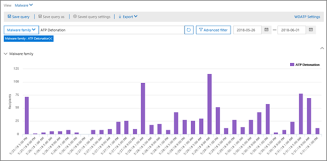

# Visualizzazioni in Esplora minacce e rilevamenti in tempo reale

[!INCLUDE [Microsoft 365 Defender rebranding](../includes/microsoft-defender-for-office.md)]

**Si applica a**
- [Microsoft Defender per Office 365 piano 1 e piano 2](defender-for-office-365.md)
- [Microsoft 365 Defender](../defender/microsoft-365-defender.md)

[Threat Explorer](threat-explorer.md) (e il report sui rilevamenti in tempo reale) è uno strumento potente e quasi in tempo reale per aiutare i team delle operazioni di sicurezza ad analizzare e rispondere alle minacce nel Centro sicurezza & conformità. Explorer (e il report sui rilevamenti in tempo reale) visualizza informazioni su malware e virus sospetti nella posta elettronica e nei file in Office 365, oltre ad altre minacce e rischi per la sicurezza per l'organizzazione.

- Se si dispone [di Microsoft Defender per Office 365](defender-for-office-365.md) Piano 2, si dispone di Explorer.
- Se si dispone di Microsoft Defender per Office 365 Piano 1, si hanno rilevamenti in tempo reale.

Quando apri Explorer per la prima volta (o il report dei rilevamenti in tempo reale), la visualizzazione predefinita mostra i rilevamenti di malware tramite posta elettronica negli ultimi 7 giorni. Questo report può anche mostrare i rilevamenti di Microsoft Defender per Office 365, ad esempio URL dannosi rilevati da Collegamenti sicuri [e](safe-links.md)file dannosi rilevati da [Allegati sicuri.](safe-attachments.md) Questo report può essere modificato per visualizzare i dati degli ultimi 30 giorni (con un abbonamento a pagamento a Microsoft Defender per Office 365 P2). Le sottoscrizioni di valutazione includeranno solo i dati degli ultimi sette giorni.

****

|Abbonamento|Utilità|Giorni di dati|
|---|---|---|
|Versione di valutazione di Microsoft Defender per Office 365 P1|Rilevamenti in tempo reale|7 |
|Microsoft Defender per Office 365 P1 a pagamento|Rilevamenti in tempo reale|30|
|Microsoft Defender for Office 365 P1 paid testing Defender for Office 365 P2 trial|Esplora minacce|7 |
|Versione di valutazione di Microsoft Defender per Office 365 P2|Esplora minacce|7 |
|Microsoft Defender per Office 365 P2 a pagamento|Esplora minacce|30|
|

> [!NOTE]
> Presto estenderemo il limite di conservazione e ricerca dei dati di Explorer (e rilevamento in tempo reale) per i tenant di prova da 7 a 30 giorni. Questa modifica viene monitorata nell'ambito dell'articolo della roadmap n. 70544 ed è attualmente in fase di implementazione.

Utilizzare **il** menu Visualizza per modificare le informazioni visualizzate. Le descrizioni comandi consentono di determinare la visualizzazione da utilizzare.

Dopo aver selezionato una visualizzazione, è possibile applicare filtri e configurare le query per eseguire ulteriori analisi. Le sezioni seguenti forniscono una breve panoramica delle varie visualizzazioni disponibili in Esplora risorse (o rilevamenti in tempo reale).

## Malware > posta elettronica

Per visualizzare questo report, in Esplora risorse (o rilevamenti in tempo reale), scegliere **Visualizza** \> **malware per posta** \> **elettronica.** Questa visualizzazione mostra informazioni sui messaggi di posta elettronica identificati come contenenti malware.

Fare **clic su Mittente** per aprire l'elenco delle opzioni di visualizzazione. Utilizzare questo elenco per visualizzare i dati in base al mittente, ai destinatari, al dominio del mittente, all'oggetto, alla tecnologia di rilevamento, allo stato di protezione e altro ancora.

Ad esempio, per vedere quali azioni sono state eseguite sui messaggi di posta elettronica rilevati, scegliere **Stato protezione** nell'elenco. Selezionare un'opzione e quindi fare clic sul pulsante Aggiorna per applicare il filtro al report.

Sotto il grafico, visualizzare ulteriori dettagli su messaggi specifici. Quando si seleziona un elemento nell'elenco, viene visualizzato un riquadro a comparsa in cui sono disponibili ulteriori informazioni sull'elemento selezionato.

## Email > Phish

Per visualizzare questo report, in Esplora risorse (o rilevamenti in tempo reale), scegliere **Visualizza** \> **e-mail** \> **Phish.** Questa visualizzazione mostra i messaggi di posta elettronica identificati come tentativi di phishing.

Fare **clic su Mittente** per aprire l'elenco delle opzioni di visualizzazione. Utilizzare questo elenco per visualizzare i dati per mittente, destinatari, dominio mittente, IP mittente, dominio URL, fare clic su verdetto e altro ancora.

Ad esempio, per sapere quali azioni sono state eseguite quando gli utenti hanno fatto clic su URL identificati come tentativi di phishing, scegliere Fare clic su **Verdetto** nell'elenco, selezionare una o più opzioni e quindi fare clic sul pulsante Aggiorna.

Sotto il grafico, visualizza altri dettagli su messaggi specifici, clic su URL, URL e origine della posta elettronica.

Quando si seleziona un elemento nell'elenco, ad esempio un URL rilevato, viene visualizzato un riquadro a comparsa, in cui è possibile ottenere ulteriori informazioni sull'elemento selezionato.

## Invii > posta elettronica

Per visualizzare questo report, in Esplora risorse (o rilevamenti in tempo reale), scegliere **Visualizza** \>  \> **invii di posta elettronica**. Questa visualizzazione mostra la posta elettronica segnalata dagli utenti come posta indesiderata, non indesiderata o phishing.

Fare **clic su Mittente** per aprire l'elenco delle opzioni di visualizzazione. Utilizzare questo elenco per visualizzare le informazioni per mittente, destinatari, tipo di report (la determinazione dell'utente che il messaggio di posta elettronica è stato indesiderato, non indesiderato o phish) e altro ancora.

Ad esempio, per visualizzare le informazioni sui messaggi di posta elettronica segnalati come tentativi di phishing, fare clic su **Tipo** di rapporto mittente, selezionare Phish e quindi fare \> clic sul pulsante Aggiorna. 

Sotto il grafico, visualizzare ulteriori dettagli su messaggi di posta elettronica specifici, ad esempio la riga dell'oggetto, l'indirizzo IP del mittente, l'utente che ha segnalato il messaggio come posta indesiderata, non indesiderata o phish e altro ancora.

Selezionare un elemento nell'elenco per visualizzare ulteriori dettagli.

## Posta elettronica > Tutti i messaggi di posta elettronica

Per visualizzare questo report, in Esplora risorse scegliere **Visualizza** \> **posta elettronica** tutti i \> **messaggi.** Questa visualizzazione mostra una visualizzazione dettagliata dell'attività di posta elettronica, inclusa la posta elettronica identificata come dannosa a causa di phishing o malware, nonché tutta la posta non dannosa (posta elettronica normale, posta indesiderata e posta in blocco).

> [!NOTE]
> Se viene visualizzato un errore che legge troppi dati da **visualizzare,** aggiungere un filtro e, se necessario, restringere l'intervallo di date visualizzato.

Per applicare un filtro, scegliere **Mittente,** selezionare un elemento nell'elenco e quindi fare clic sul pulsante Aggiorna. In questo esempio, abbiamo usato **la tecnologia di rilevamento** come filtro (sono disponibili diverse opzioni). Visualizzare le informazioni in base al mittente, al dominio del mittente, ai destinatari, all'oggetto, al nome del file dell'allegato, alla famiglia di malware, allo stato di protezione (azioni intraprese dalle funzionalità e dai criteri di protezione dalle minacce in Office 365), alla tecnologia di rilevamento (come è stato rilevato il malware) e altro ancora.

Sotto il grafico, visualizzare ulteriori dettagli su messaggi di posta elettronica specifici, ad esempio riga dell'oggetto, destinatario, mittente, stato e così via.

## Malware > contenuto

Per visualizzare questo report, in Esplora risorse (o rilevamenti in tempo reale), scegliere **Visualizza** \> **malware contenuto.** \>  Questa visualizzazione mostra i file identificati come dannosi da [Microsoft Defender per Office 365 in SharePoint Online, OneDrive for Business e Microsoft Teams.](mdo-for-spo-odb-and-teams.md)

Visualizzare le informazioni in base alla famiglia di malware, alla tecnologia di rilevamento (come è stato rilevato il malware) e al carico di lavoro (OneDrive, SharePoint o Teams).

Sotto il grafico, visualizzare ulteriori dettagli su file specifici, ad esempio nome file allegato, carico di lavoro, dimensioni del file, chi ha modificato il file e altro ancora.

## Funzionalità di filtro a clic

Con Explorer (e rilevamenti in tempo reale), puoi applicare un filtro in un clic. Fare clic su un elemento nella legenda e tale elemento diventa un filtro per il report. Si supponga, ad esempio, di guardare la visualizzazione Malware in Esplora risorse:

Se **si fa clic su Detonazione ATP** in questo grafico, verrà restituita una visualizzazione simile alla seguente:

In questa visualizzazione vengono ora cercati i dati per i file che sono stati detonati da [Allegati sicuri](safe-attachments.md). Sotto il grafico, è possibile visualizzare i dettagli relativi a messaggi di posta elettronica specifici con allegati rilevati dagli allegati sicuri.

La selezione di una o più voci attiva il **menu** Azioni, che offre diverse opzioni tra cui scegliere per gli elementi selezionati.

La possibilità di filtrare in un clic e passare a dettagli specifici può risparmiare molto tempo nell'analisi delle minacce.

## Query e filtri

Explorer (oltre al report sui rilevamenti in tempo reale) include diversi filtri potenti e funzionalità di query che consentono di analizzare i dettagli, ad esempio gli utenti di destinazione principali, le principali famiglie di malware, la tecnologia di rilevamento e altro ancora. Ogni tipo di report offre diversi modi per visualizzare ed esplorare i dati.

> [!IMPORTANT]
> Non utilizzare caratteri jolly, ad esempio un asterisco o un punto interrogativo, nella barra delle query per Esplora risorse (o rilevamenti in tempo reale). Quando si esegue una ricerca nel campo **Oggetto** per i messaggi di posta elettronica, Explorer (o rilevamenti in tempo reale) esegue una corrispondenza parziale e restituisce risultati simili a una ricerca con caratteri jolly.
