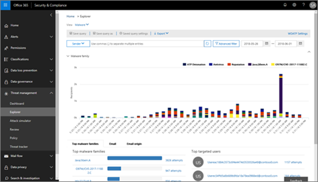

# Esplora minacce e rilevamenti in tempo realeThreat Explorer and real-time detections

Se l'organizzazione dispone di [office 365 Advanced Threat Protection](office-365-atp.md) (Office 365 ATP) ed è necessario disporre [delle autorizzazioni necessarie](#required-licenses-and-permissions), sono disponibili **esplorazioni** o **rilevamenti in tempo reale** (in precedenza i *report in tempo reale* , [vedere What ' s New](#new-features-in-real-time-detections)!).If your organization has [Office 365 Advanced Threat Protection](office-365-atp.md) (Office 365 ATP), and you have the [necessary permissions](#required-licenses-and-permissions), you have either **Explorer** or **real-time detections** (formerly *real-time reports* — [see what's new](#new-features-in-real-time-detections)!). Nel centro sicurezza & conformità, accedere a **gestione minacce**, quindi scegliere **Esplora risorse** o **rilevamenti in tempo reale**.In the Security & Compliance Center, go to **Threat management**, and then choose **Explorer** OR **Real-time detections**. 

|Con ATP piano 2, è possibile vedere:With ATP Plan 2, you see:  |Con ATP piano 1, è possibile visualizzare le informazioni seguenti:With ATP Plan 1, you see:  |
|---------|---------|
|      |         |

Con Esplora risorse (o rilevamenti in tempo reale), si dispone di un report potente che consente al team di operazioni di sicurezza di analizzare e rispondere alle minacce in modo efficace ed efficiente e assomiglia all'immagine seguente:With Explorer (or real-time detections), you have a powerful report that enables your Security Operations team to investigate and respond to threats effectively and efficiently, and it resembles the following image: 

Con questo rapporto, è possibile:With this report, you can:
- [Vedere malware rilevato dalle funzionalità di sicurezza di Office 365See malware detected by Office 365 security features](#see-malware-detected-in-email-by-technology)
- [Visualizzare i dati relativi agli URL di phishing e fare clic su verdettoView data about phishing URLs and click verdict](#view-data-about-phishing-urls-and-click-verdict)
- [Avviare un processo di analisi e risposta automatizzato da una visualizzazione in Explorer](#start-automated-investigation-and-response) (solo ATP piano 2)[Start an automated investigation and response process from a view in Explorer](#start-automated-investigation-and-response) (ATP Plan 2 only)
- ... [Esaminare messaggi di posta elettronica dannosi e altro ancora](#more-ways-to-use-explorer-or-real-time-detections)!... [Investigate malicious email, and more](#more-ways-to-use-explorer-or-real-time-detections)!

## Nuove funzionalità nei rilevamenti in tempo realeNew features in real-time detections

Di seguito sono descritte tre nuove funzionalità aggiunte in Esplora minacce.Three new features added into Threat Explorer are outlined below.

In primo luogo, **l'anteprima dell'intestazione di posta elettronica e il download del corpo della posta elettronica** sono nuove funzionalità disponibili in Esplora minacce.First, **email header preview, and download of the email body** are new features available in Threat Explorer. Gli amministratori saranno in grado di analizzare le intestazioni/i messaggi di posta elettronica scaricati per individuare eventuali minacce.Admins will be able to analyse downloaded headers/emails for threats. Poiché il download dei messaggi di posta elettronica può rischiare l'esposizione delle informazioni, questo processo è controllato dal controllo di accesso basato sui ruoli (RBAC).Because downloading emails can risk the exposure of information, this process is controlled by roles-based access control (RBAC). È necessario aggiungere un nuovo ruolo denominato ' Preview ' in un altro gruppo di ruoli di Office 365, ad esempio nelle operazioni sec o nell'amministratore sec, per garantire la possibilità di scaricare i messaggi di posta elettronica e le intestazioni di anteprima nella visualizzazione all-mail.A new role, called 'Preview' must be added into another Office 365 role group (for example into sec operations, or sec admin) to grant the ability to download mails and preview headers in all-emails view.

Ma Explorer (e rilevamenti in tempo reale) aggiunge anche nuovi campi creati per fornire un'immagine più completa del luogo in cui i messaggi di posta elettronica atterrano.But Explorer (and real-time detections) also adds fresh new fields designed to give you a more complete picture of where your emails land. Parte dell'obiettivo di questa modifica è facilitare la ricerca per gli addetti alle operazioni di sicurezza, ma il risultato finale è la conoscenza del percorso dei messaggi di posta elettronica problematici.Part of the goal of this change is to make hunting easier for Security Ops people, but the net result is knowing the location of problem emails at a glance.

Come è possibile eseguire questa operazione?How is this done? Lo stato di recapito è ora suddiviso in due colonne:Delivery Status is now broken out into two columns:

- **Azione di recapito** -qual è lo stato di questo messaggio di posta elettronica?**Delivery Action** - What is the status of this email?
- **Percorso di recapito** -dove è stato instradato il messaggio di posta elettronica come risultato?**Delivery Location** - Where was this email routed as a result?

Azione di recapito è l'azione intrapresa su un messaggio di posta elettronica a causa di criteri o rilevamenti esistenti.Delivery Action is the action taken on an email due to existing policies or detections. Ecco le possibili azioni che un messaggio di posta elettronica può eseguire:Here are the possible actions an email can take:

|ConsegnatoDelivered  |JunkedJunked  |BloccatiBlocked  |SostituitoReplaced  |
|---------|---------|---------|---------|
|La posta elettronica è stata recapitata alla posta in arrivo o alla cartella di un utente e l'utente può accedervi direttamente.Email was delivered to Inbox or folder of a user and the user can directly access it.    | La posta elettronica è stata inviata alla cartella posta indesiderata o alla cartella eliminata dell'utente e l'utente ha accesso ai messaggi di posta elettronica in tali cartelle.Email was sent to either user’s Junk folder or Deleted folder, and the user has access to emails in those folders.       | Tutti i messaggi di posta elettronica in quarantena, che non sono riusciti o sono stati eliminati.Any emails that are quarantined, that  failed, or were dropped. Questo è completamente inaccessibile dall'utente.This is completely inaccessible by the user!     | Qualsiasi messaggio di posta elettronica in cui gli allegati dannosi vengono sostituiti dai file. txt che lo stato dell'allegato è dannoso.Any email where malicious attachments are replaced by .txt files that state the attachment was malicious.     |

Ecco cosa può essere visualizzato dall'utente e cosa non è possibile:And here is what the user can see, and what they can't:

|Accessibile per gli utenti finaliAccessible to end users  |Inaccessibile per gli utenti finaliInaccessible to end users  |
|---------|---------|
|ConsegnatoDelivered     | BloccatiBlocked        |
|JunkedJunked     | SostituitoReplaced        |

Il percorso di recapito consente di visualizzare i risultati dei criteri e i rilevamenti eseguiti dopo il recapito.Delivery location shows the results of policies and detections that run post-delivery. È collegato a un'azione di recapito.It's linked to a Delivery Action. Questo campo è stato aggiunto per fornire informazioni dettagliate sull'azione intrapresa quando viene trovata una posta elettronica problematica.This field was added to give insight into the action taken when a problem mail is found. Di seguito sono riportati i possibili valori del percorso di recapito:Here are the possible values of delivery location:

1. Posta in arrivo o cartella – la posta elettronica è in posta in arrivo o in una cartella (in base alle regole di posta elettronica).Inbox or folder – The email is in inbox or a folder (according to your email rules).
2. On-Prem o External-la cassetta postale non esiste sul cloud ma è in locale.On-prem or external – The mailbox doesn’t exist on cloud but is on-premises.
3. Cartella posta indesiderata: l'indirizzo di posta elettronica nella cartella posta indesiderata di un utente.Junk folder – The email in in the Junk folder of a user.
4. Cartella Posta eliminata: il messaggio nella cartella elementi eliminati di un utente.Deleted items folder – The email in the Deleted items folder of a user.
5. Quarantine: l'indirizzo di posta elettronica in quarantena e non è incluso nella cassetta postale di un utente.Quarantine – The email in quarantine, and is not in a user’s mailbox.
6. Failed: la posta elettronica non è riuscita a raggiungere la cassetta postale.Failed – The email failed to reach the mailbox.
7. Eliminato: il messaggio di posta elettronica viene perso da qualche parte nel flusso.Dropped – The email gets lost somewhere in the Mailflow.

La **cronologia della posta elettronica** è un'altra funzionalità di Esplora risorse che consente di migliorare l'esperienza di ricerca per gli amministratori.The **Email Timeline** is another new Explorer feature aimed at making the hunting experience better for admins. La randomizzazione viene ridotta perché è necessario meno tempo per controllare posizioni diverse per cercare di comprendere l'evento.It cuts down on randomization because there is less time spent checking different locations to try to understand the event. Quando più eventi si verificano in un messaggio di posta elettronica o vicino allo stesso tempo, gli eventi vengono visualizzati in una visualizzazione sequenza temporale.When multiple events happen at, or close to, the same time on an email, those events will show up in a timeline view. In effetti, alcuni eventi che si verificano dopo il recapito alla posta verranno acquisiti nella colonna ' Special Action '.In fact, some events that happen post-delivery to your mail will be captured in the 'Special action' column. La combinazione delle informazioni dalla sequenza temporale di quella posta con l'azione speciale intrapresa sul post-recapito della posta darà agli amministratori informazioni su come funzionano i propri criteri, in cui la posta è stata definitivamente instradata e, in alcuni casi, qual è stata la valutazione finale.Combining the information from the timeline of that mail with the special action taken on the mail post-delivery will give admins insight into how their policies work, where the mail was finally routed, and, in some cases, what the final assessment was.

Per ulteriori informazioni sull'analisi di messaggi di posta [elettronica dannosi, vedere Find and indagate email dannose che è stato recapitato in Office 365](https://docs.microsoft.com/office365/securitycompliance/investigate-malicious-email-that-was-delivered).For more discussion about investigating malicious emails see [Find and investigate malicious email that was delivered in Office 365](https://docs.microsoft.com/office365/securitycompliance/investigate-malicious-email-that-was-delivered).

È inoltre possibile **esportare i report** in Microsoft Excel per visualizzare sia l'ID del messaggio di rete, sia il loro verdetto di clic, in cui è possibile capire in che modo il traffico è stato creato più facilmente.Also, you will now be able to **Export reports** to Microsoft Excel in order to view both their Network Message ID, and their Click Verdict, making the task of understanding where your traffic originated easier. Ecco come funziona.Here's how it works. A partire da Threat Management sulla barra di avvio veloce di Office 365, fare clic su questa catena:Starting in Threat Management on the Office 365 quick-launch, click through this chain:

**Explorer > View phishing > clic > URL principali****Explorer > View Phish > Clicks > Top URLs**

Quando si fa clic su un URL nell'elenco, verrà visualizzato un nuovo pulsante Esporta nel riquadro di volo.When you click on a URL in the list, you'll see a new Export button on the fly-out panel. Utilizzare questo pulsante per spostare i dati in un foglio di calcolo di Excel per semplificare la creazione di report.Use this button to move data to an Excel spreadsheet for easier reporting.

> [!TIP]
> ID messaggio di rete mappare il clic di nuovo su mail specifiche quando si esegue una ricerca tramite Explorer o gli strumenti di terze parti associati tramite ID messaggio di rete.Network Message ID maps the click back to specific mails when you search through Explorer or associated 3rd party tools via Network Message ID. La ricerca nell'ID messaggio di rete fornirà agli amministratori la posta elettronica specifica associata a un risultato di clic.Searching through the Network Message ID will give admins the specific email associated with a click result. In caso di esportazione, l'identificazione correlata dell'ID messaggio di rete rende l'analisi più rapida e potente.On export having, the correlating identification of Network Message ID makes for quicker and more powerful analysis.

## Vedere malware rilevato in posta elettronica dalla tecnologiaSee malware detected in email by technology

Si supponga di voler vedere il malware rilevato nella posta elettronica, tramite la tecnologia Office 365.Suppose you want to see malware detected in email, by Office 365 technology. A tale scopo, utilizzare la visualizzazione [posta elettronica > malware](threat-explorer-views.md#email--malware) di Esplora risorse (o rilevamenti in tempo reale).To do this, use the [Email > Malware](threat-explorer-views.md#email--malware) view of Explorer (or real-time detections).

1. Nel centro sicurezza &[https://protection.office.com](https://protection.office.com)conformità (), scegliere **gestione** > minacce (o **rilevamenti in tempo reale**).\*\*\*\*In the Security & Compliance Center ([https://protection.office.com](https://protection.office.com)), choose **Threat management** > **Explorer** (or **Real-time detections**). In questo esempio viene utilizzato Esplora.(This example uses Explorer.)

2. Scegliere**malware** **tramite posta elettronica** > dal menu **Visualizza** .In the **View** menu, choose **Email** > **Malware**.  

3. Fare clic su **mittente**e quindi scegliere**tecnologia di rilevamento**di **base** > .Click **Sender**, and then choose **Basic** > **Detection technology**. Le tecnologie di rilevamento sono ora disponibili come filtri per il report.Your detection technologies are now available as filters for the report.   

4. Selezionare un'opzione e quindi fare clic sul pulsante **Aggiorna** per applicare il filtro.Select an option, and then click the **Refresh** button to apply that filter.   

Il rapporto viene aggiornato per visualizzare i risultati rilevati dal malware nella posta elettronica, utilizzando l'opzione di tecnologia selezionata.The report refreshes to show the results malware detected in email, using the technology option you selected. Da qui, è possibile eseguire un'ulteriore analisi.From here, you can conduct further analysis.

## Visualizzare i dati relativi agli URL di phishing e fare clic su verdettoView data about phishing URLs and click verdict

Si supponga di voler visualizzare i tentativi di phishing tramite URL nella posta elettronica, incluso un elenco di URL consentiti, bloccati e ignorati.Suppose that you want to see phishing attempts through URLs in email, including a list of URLs that were allowed, blocked, and overridden. L'identificazione degli URL che sono stati cliccati richiede la configurazione di [collegamenti sicuri ATP](atp-safe-links.md) .Identifying URLs that were clicked requires [ATP Safe links](atp-safe-links.md) to be configured. Assicurarsi di aver configurato i criteri per i [collegamenti sicuri di ATP](set-up-atp-safe-links-policies.md) per la protezione e la registrazione di un clic dei verdetti da ATP Safe Links.Make sure that you have set up [ATP Safe Links policies](set-up-atp-safe-links-policies.md) for time-of-click protection and logging of click verdicts by ATP Safe Links. 

Per esaminare gli URL di phishing nei messaggi e fare clic su URL nei messaggi di phishing, utilizzare la visualizzazione di [posta elettronica > phishing](threat-explorer-views.md#email--phish) di Esplora risorse (o rilevamenti in tempo reale).To review phish URLs in messages and clicks on URLs in phish messages, use the [Email > Phish](threat-explorer-views.md#email--phish) view of Explorer (or real-time detections).

1. Nel centro sicurezza &[https://protection.office.com](https://protection.office.com)conformità (), scegliere **gestione** > minacce (o **rilevamenti in tempo reale**).\*\*\*\*In the Security & Compliance Center ([https://protection.office.com](https://protection.office.com)), choose **Threat management** > **Explorer** (or **Real-time detections**). In questo esempio viene utilizzato Esplora.(This example uses Explorer.)

2. Nel menu **Visualizza** scegliere **posta elettronica** > **phishing**.In the **View** menu, choose **Email** > **Phish**.  

3. Fare clic su **sender**e quindi scegliere **urls** > **.**Click **Sender**, and then choose **URLs** > **Click verdict**.

4. Selezionare una o più opzioni, ad esempio **bloccate** e **bloccate**, e quindi fare clic sul pulsante **Aggiorna** che si trova nella stessa riga delle opzioni per applicare il filtro.Select one or more options, such as **Blocked** and **Block overridden**, and then click the **Refresh** button that is on the same line as the options to apply that filter. (Non aggiornare la finestra del browser.)(Don't refresh your browser window.)  

    Il rapporto viene aggiornato per visualizzare due diverse tabelle URL nella scheda URL del rapporto:The report refreshes to show two different URL tables on the URL tab under the report:

   - Gli URL **principali** sono gli URL contenuti nei messaggi che sono stati filtrati fino a e l'azione di recapito della posta elettronica conta per ogni URL.**Top URLs** are the URLs contained in the messages you have filtered down to, and the email delivery action counts for each URL. Nella visualizzazione posta elettronica di phishing, in genere l'elenco conterrà URL legittimi.In the phish email view, this list typically will contain legitimate URLs. I pirati informatici includono una combinazione di URL buoni e cattivi nei messaggi per cercare di farli recapitare, ma renderà i collegamenti dannosi più interessanti per l'utente da fare clic su.Attackers include a mix of good and bad URLs in their messages to try to get them delivered, but they will make the malicious links more interesting for the user to click. La tabella degli URL è ordinata in base al numero totale di messaggi di posta elettronica (Nota: questa colonna non viene visualizzata per semplificare la visualizzazione).The table of URLs is sorted by total email count (NOTE: This column is not shown to simplify the view).

   - I **clic principali** sono gli URL con collegamenti sicuri che sono stati selezionati, ordinati in base al numero di clic totale (la colonna non viene visualizzata per semplificare la visualizzazione).**Top clicks** are the Safe Links wrapped URLs that were clicked, sorted by total click count (this column is also not shown to simplify the view). Numeri totali per colonna indicano i collegamenti sicuri fare clic su conteggio verdetto per ogni URL selezionato.Total counts by column indicate the Safe Links click verdict count for each clicked URL. Nella visualizzazione posta elettronica di phishing, questi sono più spesso URL sospetti o dannosi, ma possono includere URL puliti presenti nei messaggi di phishing.In the phish email view, these are more often suspicious or malicious URLs, but could include clean URLs that are in phish messages. Gli URL che fanno clic su collegamenti non spostati non verranno visualizzati qui.URL clicks on unwrapped links will not show up here.
   
   Le due tabelle degli URL mostrano gli URL principali nei messaggi di posta elettronica di phishing tramite l'azione e la posizione di recapito e visualizzano gli URL che sono stati bloccati (o sono stati visitati nonostante un avviso), in modo da poter capire quali potenziali collegamenti non validi sono stati ricevuti dagli utenti e interagito con gli utenti.The two URLs tables show top URLs in phishing emails by delivery action and location, and they show URL clicks that were blocked (or visited despite a warning) so that you can understand what potential bad links were received by users and interacted with by users. Da qui, è possibile eseguire un'ulteriore analisi.From here, you can conduct further analysis. Ad esempio, al di sotto del grafico, è possibile visualizzare gli URL principali nei messaggi di posta elettronica bloccati nell'ambiente dell'organizzazione.For example, below the chart, you can see the top URLs in emails that were blocked in your organization's environment.
   
   
   
   Selezionare un URL per visualizzare informazioni più dettagliate.Select a URL to view more detailed information. Si noti che nella finestra di dialogo URL a comparsa, il filtro nei messaggi di posta elettronica viene rimosso per visualizzare la visualizzazione completa dell'esposizione dell'URL nell'ambiente in uso.Note that in the URL flyout dialog, the filtering on emails is removed to show you the full view of the URL's exposure in your environment. In questo modo è possibile filtrare i messaggi di posta elettronica in Esplora risorse a quelli di cui si è preoccupati, individuare URL specifici che sono potenziali minacce e quindi espandere la propria comprensione dell'esposizione all'URL nell'ambiente (tramite la finestra di dialogo Dettagli URL) senza dover aggiungere filtri URL al Visualizzazione di Esplora risorse.This lets you filter down emails in Explorer to ones you are concerned about, find specific URLs that are potential threats, then expand your understanding of the URL exposure in your environment (via the URL details dialog) without having to add URL filters to the Explorer view itself.

## Esaminare i messaggi di posta elettronica segnalati dagli utentiReview email messages reported by users

Si supponga di voler visualizzare i messaggi di posta elettronica che gli utenti dell'organizzazione hanno segnalato come posta indesiderata, non indesiderata o phishing tramite il [componente aggiuntivo per Outlook e Outlook sul Web](enable-the-report-message-add-in.md).Suppose that you want to see email messages that users in your organization have reported as Junk, Not Junk, or Phishing by using the [Report Message add-in for Outlook and Outlook on the web](enable-the-report-message-add-in.md). A tale scopo, utilizzare la visualizzazione [> invii di posta elettronica](threat-explorer-views.md#email--submissions) di Esplora risorse (o rilevamenti in tempo reale).To do this, use the [Email > Submissions](threat-explorer-views.md#email--submissions) view of Explorer (or real-time detections).

1. Nel centro sicurezza &[https://protection.office.com](https://protection.office.com)conformità (), scegliere **gestione** > minacce (o **rilevamenti in tempo reale**).\*\*\*\*In the Security & Compliance Center ([https://protection.office.com](https://protection.office.com)), choose **Threat management** > **Explorer** (or **Real-time detections**). In questo esempio viene utilizzato Esplora.(This example uses Explorer.)

2. Scegliere **invii di posta elettronica** > \*\*\*\* dal menu **Visualizza** .In the **View** menu, choose **Email** > **Submissions**.  

3. Fare clic su **mittente**e quindi scegliere**tipo di report**di **base** > .Click **Sender**, and then choose **Basic** > **Report type**.

4. Selezionare un'opzione, ad esempio **phishing**, e quindi fare clic sul pulsante **Aggiorna** .Select an option, such as **Phish**, and then click the **Refresh** button.    

Il rapporto viene aggiornato per visualizzare i dati relativi ai messaggi di posta elettronica che gli utenti dell'organizzazione hanno segnalato come tentativo di phishing.The report refreshes to show data about email messages that people in your organization have reported as a phishing attempt. È possibile utilizzare queste informazioni per eseguire un'ulteriore analisi e, se necessario, regolare i [criteri di anti-phishing ATP](set-up-anti-phishing-policies.md).You can use this information to conduct further analysis, and if necessary, adjust your [ATP anti-phishing policies](set-up-anti-phishing-policies.md).

## Avviare l'analisi e la risposta automatizzataStart automated investigation and response

> [!NOTE]
> Le funzionalità di risposta agli incidenti automatici sono disponibili in **office 365 ATP piano 2** e **Office 365 E5**.Automated incident response capabilities are available in **Office 365 ATP Plan 2** and **Office 365 E5**.

(Nuovo!) La [risposta agli incidenti automatici](automated-investigation-response-office.md) può salvare il team delle operazioni di sicurezza molto tempo e fatica nell'analisi e nell'attenuazione di attacchi cibernetici.(NEW!) [Automated incident response](automated-investigation-response-office.md) can save your security operations team much time and effort in investigating and mitigating cyberattacks. Oltre a configurare gli avvisi che possono attivare un PlayBook per la sicurezza, è possibile avviare un processo di analisi e risposta automatizzato da una visualizzazione di Esplora risorse.In addition to configuring alerts that can trigger a security playbook, you can start an automated investigation and response process from a view in Explorer. 

Per ulteriori informazioni, vedere [esempio: un amministratore della sicurezza attiva un'analisi da Esplora risorse](automated-investigation-response-office.md#example-a-security-administrator-triggers-an-investigation-from-threat-explorer).For details on this, see [Example: A security administrator triggers an investigation from Explorer](automated-investigation-response-office.md#example-a-security-administrator-triggers-an-investigation-from-threat-explorer).

## Altre modalità di utilizzo di Esplora risorse (o rilevamenti in tempo reale)More ways to use Explorer (or real-time detections)

Oltre agli scenari descritti in questo articolo, sono disponibili molte altre opzioni per la creazione di report con Esplora risorse (o rilevamenti in tempo reale).In addition to the scenarios outlined in this article, you have many more reporting options available with Explorer (or real-time detections). 
- [Identificare e analizzare i messaggi di posta elettronica dannosi recapitatiFind and investigate malicious email that was delivered](investigate-malicious-email-that-was-delivered.md)
- [Visualizzare i file dannosi rilevati in SharePoint Online, OneDrive e Microsoft TeamsView malicious files detected in SharePoint Online, OneDrive, and Microsoft Teams](malicious-files-detected-in-spo-odb-or-teams.md)
- [Ottenere una panoramica delle visualizzazioni in Esplora minacce (e rilevamenti in tempo reale)Get an overview of the views in Threat Explorer (and real-time detections)](threat-explorer-views.md)

## Licenze e autorizzazioni necessarieRequired licenses and permissions

È necessario disporre di [Office 365 ATP](office-365-atp.md) per ottenere rilevamenti di Esplora risorse o in tempo reale.You must have [Office 365 ATP](office-365-atp.md) to get Explorer or real-time detections.
- Explorer è incluso in Office 365 ATP piano 2.Explorer is included in Office 365 ATP Plan 2. 
- Il rapporto sui rilevamenti in tempo reale è incluso in Office 365 ATP Plan 1.The real-time detections report is included in Office 365 ATP Plan 1.
- Pianificare l'assegnazione delle licenze per tutti gli utenti che devono essere protetti da ATP.Plan to assign licenses for all users who should be protected by ATP. (Esplora risorse o rilevamenti in tempo reale mostrerà i dati di rilevamento per gli utenti con licenza).(Explorer or real-time detections will show detection data for licensed users.)

Per visualizzare e utilizzare esplorazioni o rilevamenti in tempo reale, è necessario disporre delle autorizzazioni appropriate, ad esempio quelle concesse a un amministratore della sicurezza o a un lettore di sicurezza.To view and use Explorer or real-time detections, you must have appropriate permissions, such as those granted to a security administrator or security reader. 

- Per il centro &amp; sicurezza e conformità, è necessario che sia assegnato uno dei ruoli seguenti:For the Security &amp; Compliance Center, you must have one of the following roles assigned:
    - Gestione organizzazioneOrganization Management
    - Amministratore della sicurezza (è possibile assegnarlo nell'interfaccia di amministrazione di Azure Active[https://aad.portal.azure.com](https://aad.portal.azure.com)directory ())Security Administrator (this can be assigned in the Azure Active Directory admin center ([https://aad.portal.azure.com](https://aad.portal.azure.com)))
    - Lettore di sicurezzaSecurity Reader

- Per Exchange Online, è necessario che sia assegnato uno dei ruoli seguenti nell'interfaccia di amministrazione di Exchange ([https://outlook.office365.com/ecp](https://outlook.office365.com/ecp)) o con i cmdlet di PowerShell (vedere [Exchange Online PowerShell](https://docs.microsoft.com/powershell/exchange/exchange-online/exchange-online-powershell?view=exchange-ps)):For Exchange Online, you must have one of the following roles assigned in either the Exchange admin center ([https://outlook.office365.com/ecp](https://outlook.office365.com/ecp)) or with PowerShell cmdlets (See [Exchange Online PowerShell](https://docs.microsoft.com/powershell/exchange/exchange-online/exchange-online-powershell?view=exchange-ps)):
    - Gestione organizzazioneOrganization Management
    - Gestione organizzazione in sola visualizzazioneView-only Organization Management
    - Ruolo Destinatari di sola letturaView-Only Recipients role
    - Gestione della conformitàCompliance Management

Per ulteriori informazioni sui ruoli e sulle autorizzazioni, vedere le risorse seguenti:To learn more about roles and permissions, see the following resources:

- [Permissions in the Office 365 Security &amp; Compliance CenterPermissions in the Office 365 Security &amp; Compliance Center](permissions-in-the-security-and-compliance-center.md)
- [Autorizzazioni funzionalità in Exchange OnlineFeature permissions in Exchange Online](https://docs.microsoft.com/exchange/permissions-exo/feature-permissions)
  
## Alcune differenze tra l'esportatore di minacce e i rilevamenti in tempo realeSome differences between Threat Exporter and real-time detections

 - Il rapporto sui **rilevamenti in tempo reale** è disponibile in Office 365 ATP Plan 1, mentre l' **esploratore di minacce** è disponibile in Office 365 ATP piano 2.The **real-time detections** report is available in Office 365 ATP Plan 1, whereas **Threat Explorer** is available in Office 365 ATP Plan 2.
 - Il rapporto sui **rilevamenti in tempo reale** consente di visualizzare i rilevamenti in tempo reale.The **real-time detections** report allows you to view detections in real-time. \*\*\*\* Anche questo consente di visualizzare ulteriori dettagli relativi a un determinato attacco.**Threat Explorer** does this as well, but also allows you to view additional details for a given attack.
