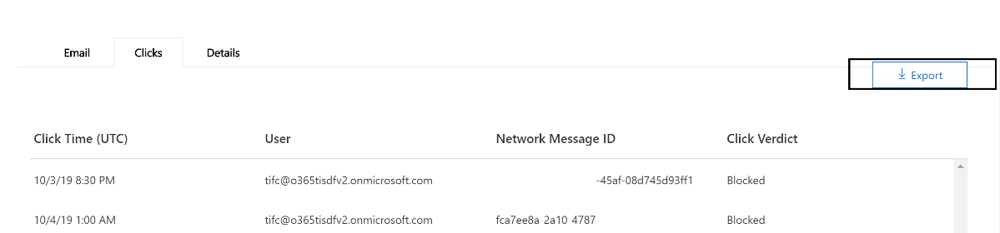

# Esplora minacce e rilevamenti in tempo reale

Se l'organizzazione dispone [di Microsoft Defender per Office 365](office-365-atp.md)e si dispone delle [autorizzazioni necessarie](#required-licenses-and-permissions), è possibile rilevare **esplorazioni** o **rilevamenti in tempo reale** (in precedenza i *report in tempo reale* , [vedere What ' s New](#new-features-in-threat-explorer-and-real-time-detections)!). Nel centro sicurezza & conformità, accedere a **gestione minacce**, quindi scegliere **Esplora risorse** _o_ **rilevamenti in tempo reale**.

|Con Microsoft Defender per Office 365 piano 2, è possibile visualizzare le informazioni seguenti:|Con Microsoft Defender per Office 365 piano 1, è possibile visualizzare le informazioni seguenti:|
|---|---|
|||
|

Con Esplora risorse (o rilevamenti in tempo reale), si dispone di un report potente che consente al team di operazioni di sicurezza di analizzare e rispondere alle minacce in modo efficace ed efficiente. Il report è simile all'immagine seguente:

Con questo rapporto, è possibile:

- [Vedere malware detected by Microsoft 365 Security features](#see-malware-detected-in-email-by-technology)
- [Visualizzare i dati relativi agli URL di phishing e fare clic su verdetto](#view-data-about-phishing-urls-and-click-verdict)
- [Avviare un processo di analisi e risposta automatizzato da una visualizzazione in Explorer](#start-automated-investigation-and-response) (solo Defender per Office 365 piano 2)
- ... [Esaminare messaggi di posta elettronica dannosi e altro ancora](#more-ways-to-use-explorer-or-real-time-detections)!

## Miglioramenti dell'esperienza in Esplora minacce e rilevamenti in tempo reale

### Tag in Esplora minacce

> [!NOTE]
> La funzionalità tag utente è in anteprima, non è disponibile per tutti, ed è soggetta a modifiche. Per informazioni sulla pianificazione dei rilasci, vedere la Guida di orientamento di Microsoft 365.

I tag utente sono identificatori per gruppi di utenti specifici in Microsoft Defender per Office 365. Per ulteriori informazioni sui tag, sulla gestione delle licenze e sulla configurazione dei tag, vedere [tag utente](user-tags.md).

In Esplora minacce, è possibile visualizzare le informazioni sui tag degli utenti nelle seguenti esperienze:

#### Visualizzazione della griglia di posta elettronica

La colonna tag visualizzata nella griglia di posta elettronica conterrebbe tutti i tag che sono stati applicati alle cassette postali del mittente o del destinatario. Per impostazione predefinita, i tag di sistema come gli account prioritari vengono visualizzati per primo.

> [!div class="mx-imgBorder"]
> 

#### Filtro

Sono ora disponibili tag come filtro in modo che sia possibile cercare solo tra gli account prioritari o gli scenari specifici dei tag utente (e persino escludere i risultati con alcuni tag come parte di questa esperienza). Combinando queste informazioni con gli altri filtri che vengono forniti, è possibile limitare l'ambito delle indagini

[ del filtro](../../media/tags-filter-normal.png#lightbox)

> [!div class="mx-imgBorder"]
> 

#### Riquadro a comparsa dettagli posta elettronica
Per visualizzare i singoli tag per il mittente e il destinatario, fare clic sull'oggetto. Apre il riquadro a comparsa Dettagli messaggio. Nella scheda Riepilogo i tag del mittente e del destinatario sono visualizzati separatamente, se sono presenti per un messaggio di posta elettronica.
Le informazioni sui singoli tag per il mittente e il destinatario, si estende anche a CSV esportato, dove è possibile visualizzare questi dettagli in 2 colonne separate.

> [!div class="mx-imgBorder"]
> 

Le informazioni sui tag vengono inoltre visualizzate nel riquadro a comparsa clic URL. Per accedere all'URL facendo clic su un riquadro a comparsa, è necessario accedere a phishing o a tutte le visualizzazioni di posta elettronica e quindi alla scheda URL o clic URL. facendo clic su un singolo riquadro a comparsa URL, vengono visualizzate ulteriori informazioni sui clic relativi a tale URL e i tag associati a tale clic.

> [!div class="mx-imgBorder"]
> 

## Miglioramenti all'esperienza di caccia alle minacce (imminente)

### Informazioni aggiornate sulle minacce per i messaggi di posta elettronica

Ci siamo concentrati sulla piattaforma e sui miglioramenti relativi alla qualità dei dati per aumentare l'accuratezza dei dati e la coerenza dei record. Questi set di aggiornamenti includono il consolidamento delle informazioni di pre-recapito e post-recapito (azione di esempio eseguita su un messaggio di posta elettronica come parte del processo ZAP) in un singolo record insieme a una ricchezza aggiunta come il verdetto di posta indesiderata, le minacce a livello di entità (ad esempio, l'URL era dannoso) e le posizioni

Dopo questi aggiornamenti, viene visualizzata una singola voce per ogni messaggio, indipendentemente dai diversi eventi successivi al recapito che hanno avuto luogo sul messaggio. Le azioni possono includere ZAP, la correzione manuale (che significa azione dell'amministratore), il recapito dinamico e così via.

Oltre a mostrare minacce di malware e phishing, è ora possibile visualizzare il verdetto di posta indesiderata associato a un messaggio di posta elettronica. All'interno del messaggio di posta elettronica, sarà possibile visualizzare tutte le minacce associate al messaggio di posta elettronica insieme alle tecnologie di rilevamento corrispondenti. Ogni messaggio di posta elettronica può avere 0, 1 o più minacce. Verranno visualizzate le minacce correnti nella sezione dettagli del riquadro a comparsa del messaggio di posta elettronica. Inoltre, per più minacce (ad esempio, un messaggio di posta elettronica con malware e phishing), il campo tecnologia di rilevamento darebbe la Threat-Detection mapping, il che significa che la tecnologia di rilevamento ha portato all'identificazione della minaccia.

L'insieme delle tecnologie di rilevamento è stato aggiornato per includere nuovi metodi di rilevamento, nonché le tecnologie di rilevamento della posta indesiderata e in tutte le diverse visualizzazioni di posta elettronica (malware, phishing, tutti i messaggi di posta elettronica), si avrà lo stesso insieme coerente di tecnologie di rilevamento per filtrare i risultati.

> [!NOTE]
> L'analisi del verdetto potrebbe non essere necessariamente legata alle entità. Ad esempio, un messaggio di posta elettronica potrebbe essere classificato come phishing o posta indesiderata, ma non ci sono URL che hanno un verdetto di phishing/spam stampato su di essi. Ciò è dovuto al fatto che i filtri valutano anche il contenuto e altri dettagli per un messaggio di posta elettronica, prima di assegnare un verdetto.

#### Minacce negli URL

Nella scheda riquadro a comparsa posta elettronica-> dettagli, è ora possibile visualizzare la minaccia specifica per un URL (la minaccia per un URL può essere malware, phishing, spam o None).

> [!div class="mx-imgBorder"]
> 

### Visualizzazione sequenza temporale aggiornata (imminente)

> [!div class="mx-imgBorder"]
> 

Oltre a identificare tutti gli eventi di recapito e post-recapito, la visualizzazione sequenza temporale fornisce anche informazioni sulla minaccia identificata in quel momento per un sottoinsieme di questi eventi. Sono inoltre disponibili ulteriori informazioni sulle azioni aggiuntive (ad esempio, ZAP, la correzione manuale) insieme al risultato di tale azione. La visualizzazione sequenza temporale contiene informazioni sul recapito originale e successivamente su tutti gli eventi successivi al recapito eseguiti su un messaggio di posta elettronica.

- Origine: può essere l'amministratore/sistema/utente in base all'origine dell'evento.
- Evento: include eventi di primo livello quali il recapito originale, la correzione manuale, lo ZAP, gli invii e il recapito dinamico.
- Azione: in questo modo viene illustrata l'azione specifica che è stata eseguita come parte di un'azione ZAP o admin (ad esempio, soft delete).
- Minacce: copre le minacce (malware, phishing, posta indesiderata) identificate in quel momento.
- Result/Details: vengono illustrate altre informazioni sul risultato dell'azione, se è stato eseguito come parte dell'azione ZAP/admin.

### Percorso di recapito originale e più recente

Oggi, il percorso di recapito in superficie all'interno della griglia e-mail e del riquadro a comparsa. In futuro, il campo percorso di recapito verrà rinominato nel percorso di recapito originale. Inoltre, è stato introdotto anche un altro campo denominato ultima posizione di recapito.

Il percorso di recapito originale darebbe maggiori informazioni sul luogo in cui è stato recapitato un messaggio di posta elettronica. Il percorso di recapito più recente dovrebbe includere il percorso in cui un messaggio di posta elettronica potrebbe essere atterrato dopo azioni del sistema come ZAP o azioni amministrative come **Move to Deleted Items**. Il percorso di recapito più recente ha lo scopo di informare gli amministratori dell'ultima posizione nota del messaggio dopo il recapito o di qualsiasi azione di sistema/amministratore. In base alla progettazione, non include alcuna azione relativa all'utente finale sul messaggio di posta elettronica. Ad esempio, se un utente elimina un messaggio o sposta il messaggio in Archive/PST, il percorso del messaggio "recapito" non verrà aggiornato. Tuttavia, se un'azione del sistema ha aggiornato la posizione (ad esempio, ZAP risultante in un messaggio di posta elettronica che si sposta in quarantena), è possibile visualizzare il percorso di recapito più recente in quarantena.

> [!div class="mx-imgBorder"]
> 

> [!NOTE]
> Esistono alcuni casi in cui il percorso di recapito e l'azione di recapito possono mostrare ' Unknown ' come valore:
>
> - Potrebbe essere visualizzato il percorso di recapito come recapitato e il percorso di recapito come sconosciuto. Questo accade quando il messaggio è stato recapitato, ma una regola di posta in arrivo ha spostato il messaggio in una cartella predefinita (bozza, archivio e così via) anziché nelle cartelle posta in arrivo o posta indesiderata.
>
> - Il percorso di recapito più recente può essere sconosciuto se si tenta di eseguire un'operazione di amministratore/sistema (ad esempio, ZAP, azione di amministratore), ma il messaggio non viene trovato. In genere, l'azione si verifica dopo lo spostamento o l'eliminazione del messaggio da parte dell'utente. In questi casi, verificare la colonna Result/Details nella visualizzazione sequenza temporale. Cercare il messaggio: il messaggio è stato spostato o eliminato dall'utente.

> [!div class="mx-imgBorder"]
> 

### Azioni aggiuntive

Altre azioni sono costituite dalle azioni che sono state applicate dopo il recapito del messaggio di posta elettronica e possono includere ZAP, la correzione manuale (azione intrapresa da un amministratore, ad esempio, soft delete), il recapito dinamico e rielaborati (un messaggio di posta elettronica è stato rilevato con effetto retroattivo come valido).

> [!NOTE]
>
> - Come parte di questa modifica, il valore rimosso da ZAP correntemente emerso nel filtro azione di recapito sta per essere eliminato. È possibile eseguire la ricerca di tutti i messaggi di posta elettronica con il tentativo ZAP tramite le azioni aggiuntive.
>
> - Saranno disponibili nuovi campi e valori per le tecnologie di rilevamento e altre azioni, in particolare per gli scenari di ZAP. Valutare le query salvate esistenti e le query registrate per assicurarsi che funzionino con i nuovi valori.

> [!div class="mx-imgBorder"]
> 

### Sostituzioni del sistema

Le sostituzioni di sistema sono un metodo di esecuzione di eccezioni per il percorso di recapito previsto di un messaggio, sovrascrivendo il percorso di recapito fornito dal sistema, in base alle minacce e agli altri rilevamenti identificati dallo stack di filtraggio. È possibile impostare le sostituzioni del sistema tramite il criterio tenant o utente per recapitare il messaggio come suggerito dal criterio. Gli override sono utili per identificare qualsiasi recapito involontario di messaggi dannosi a causa di interruzioni di configurazioni, ad esempio un criterio mittente sicuro molto ampio impostato da un utente. Questi valori di sostituzione possono essere:

- Consentito dai criteri utente: questo è il momento in cui un utente consente domini o mittenti creando criteri a livello di cassetta postale.
- Bloccati dai criteri utente: questo è il momento in cui un utente blocca domini o mittenti creando criteri a livello di cassetta postale.
- Consentito dai criteri org: quando i team di sicurezza dell'organizzazione hanno impostato i criteri o le regole del flusso di posta di Exchange (note anche come regole di trasporto) per consentire a mittenti e domini per gli utenti dell'organizzazione. Può trattarsi di un gruppo di utenti o dell'intera organizzazione.
- Bloccato dai criteri org: quando i team di sicurezza dell'organizzazione hanno impostato i criteri o le regole del flusso di posta per bloccare mittenti, domini, lingue dei messaggi o IP di origine per gli utenti dell'organizzazione. Può anche essere utilizzato per un gruppo di utenti o per l'intera organizzazione.
- Estensione di file bloccata da criteri org: questo è il momento in cui l'estensione di un tipo di file viene bloccata dai team di sicurezza di un'organizzazione tramite le impostazioni dei criteri antimalware. Questi valori verranno ora visualizzati nei dettagli della posta elettronica per facilitare le indagini. I team di secops possono inoltre filtrare le estensioni di file bloccate utilizzando la funzionalità di filtraggio RTF.

> [!div class="mx-imgBorder"]
> 

### Miglioramenti relativi all'utilizzo di URL e clic

Il set di miglioramenti incentrati sui dati relativi ai clic su URL e URL include:

- Visualizzazione di un URL con clic completo (compresi i parametri di query che fanno parte dell'URL) nella sezione clic nel riquadro a comparsa URL. Attualmente viene mostrato il dominio e il percorso dell'URL nella barra del titolo. Le informazioni vengono estese per visualizzare l'URL completo.

- Correzioni tra i filtri URL (URL e URL, dominio e percorso URL): sono stati apportati aggiornamenti per la ricerca di messaggi che contengono un verdetto URL/clic. Come parte di ciò, è stato abilitato il supporto per le ricerche agnostiche del protocollo (ovvero è possibile cercare direttamente un URL senza http). Per impostazione predefinita, la ricerca URL esegue il mapping a http, a meno che non sia specificato in modo esplicito. Ad esempio:

  1. Eseguire una ricerca con e senza il `http://` prefisso nei campi "URL", "URL domain" e "URL Domain and path". Questo comportamento è coerente e deve mostrare lo stesso risultato.

  1. Cercare il `https://` prefisso in "URL". Se non è presente, `http://` viene utilizzato il prefisso.

  1. `/` all'inizio e alla fine del "percorso URL", "dominio URL", i campi "URL Domain and path" vengono ignorati. `/` alla fine del campo "URL" viene ignorato.

### Livello di confidenza phishing

Il livello di sicurezza di phishing consente di identificare il grado di attendibilità, con cui un messaggio di posta elettronica è stato categorizzato come phishing. I due valori possibili sono High e Normal. Nelle fasi iniziali, questo filtro sarà disponibile solo nella visualizzazione phishing di Esplora minacce.

### Segnale URL ZAP

Utilizzato tipicamente per gli scenari di avviso di ZAP phishing in cui un messaggio di posta elettronica è stato identificato come phishing e rimosso dopo il recapito Viene utilizzato per connettere l'avviso con i risultati corrispondenti in Esplora risorse. Si tratta di uno dei IOCs per l'avviso.

Nell'ambito del miglioramento del processo di ricerca, sono stati apportati alcuni aggiornamenti a Threat Explorer e ai rilevamenti in tempo reale. Si tratta di miglioramenti ' Experience ', con l'obiettivo di rendere l'esperienza di caccia più coerente. Queste modifiche sono descritte di seguito:

- [Miglioramenti del fuso orario](#timezone-improvements)
- [Aggiornamento nel processo di aggiornamento](#update-in-the-refresh-process)
- [Drill-down del grafico da aggiungere ai filtri](#chart-drilldown-to-add-to-filters)
- [Negli aggiornamenti delle informazioni sui prodotti](#in-product-information-updates)

### Filtrare in base ai tag utente

È ora possibile ordinare e filtrare in base al sistema o ai tag utente personalizzati, per afferrare rapidamente l'ambito delle minacce. Per ulteriori informazioni, vedere [tag utente](user-tags.md) .

> [!IMPORTANT]
> Il filtro e l'ordinamento in base ai tag utente è attualmente in anteprima pubblica.
> Esso può essere sostanzialmente modificato prima che venga rilasciato commercialmente. Microsoft non fornisce garanzie, espresse o implicite, in relazione alle informazioni fornite in proposito.

### Miglioramenti del fuso orario

Verrà visualizzato il fuso orario per i record di posta elettronica all'interno del portale, nonché per i dati esportati. Il fuso orario sarà visibile tra le esperienze come la griglia di posta elettronica, i dettagli a comparsa, la sequenza temporale e i messaggi di posta elettronica simili, in modo che il fuso orario del set di risultati sia chiaro per l'utente.

> [!div class="mx-imgBorder"]
> 

### Aggiornamento nel processo di aggiornamento

Sono stati segnalati commenti e suggerimenti relativi alla confusione con l'aggiornamento automatico (ad esempio, per la data, non appena si modifica la data, la pagina viene aggiornata) e l'aggiornamento manuale (per altri filtri). Analogamente, la rimozione dei filtri porta all'aggiornamento automatico, in questo modo le situazioni in cui la modifica dei diversi filtri durante la modifica della query possono causare esperienze di ricerca incoerenti. Per risolvere questo passaggio, si passa a un meccanismo di filtraggio manuale.

Da un punto di vista dell'esperienza, l'utente può applicare e rimuovere i diversi filtri (dall'insieme di filtri e la data) e premere il pulsante Aggiorna per filtrare i risultati dopo aver terminato la query. Il pulsante Aggiorna è stato anche aggiornato per definirlo chiaramente sullo schermo. Sono state aggiornate anche le descrizioni comandi e la documentazione del prodotto in questa modifica.

> [!div class="mx-imgBorder"]
> 

### Drill-down del grafico da aggiungere ai filtri

Sarà ora possibile fare clic sui valori della legenda del grafico per aggiungere il valore come filtro. Tenere presente che sarà comunque necessario fare clic sul pulsante Aggiorna per filtrare i risultati come parte della modifica descritta in alto.

> [!div class="mx-imgBorder"]
> 

### Negli aggiornamenti delle informazioni sui prodotti

È inoltre possibile visualizzare ulteriori dettagli all'interno del prodotto. Ad esempio, il numero totale di risultati della ricerca all'interno della griglia (vedere di seguito), nonché i miglioramenti relativi alle etichette, ai messaggi di errore e alle descrizioni comandi, per fornire ulteriori informazioni sui filtri, l'esperienza di ricerca e il set di risultati.

> [!div class="mx-imgBorder"]
> 

## Funzionalità estese in Esplora minacce

### Utenti di destinazione principali

Oggi viene esposto l'elenco degli utenti di destinazione principali nella visualizzazione malware per i messaggi di posta elettronica (all'interno della sezione principali famiglie di malware). Si estenderà questa visualizzazione all'interno di phishing e tutte le visualizzazioni di posta elettronica, in cui sarà possibile visualizzare i primi cinque utenti mirati insieme al numero di tentativi per ogni utente per la visualizzazione corrispondente (ad esempio, per la visualizzazione di phishing, sarà possibile visualizzare il numero di tentativi di phishing).
È inoltre possibile esportare l'elenco di utenti di destinazione fino a un massimo di 3000, oltre al numero di tentativi di analisi offline per ogni visualizzazione di posta elettronica. Oltre a questo, selezionando No. di tentativi (ad esempio, 13 tentativi di seguito) aprirebbe una visualizzazione filtrata in Esplora minacce, in modo da poter guardare maggiori dettagli tra i messaggi di posta elettronica e le minacce per tale utente.

> [!div class="mx-imgBorder"]
> 

### Regole di trasporto di Exchange

Nell'ambito dell'arricchimento dei dati, è inoltre necessario essere in grado di visualizzare tutte le diverse regole di trasporto applicate a un messaggio. Queste informazioni saranno presenti all'interno della visualizzazione griglia di posta elettronica (per visualizzare questa opzione, selezionare le opzioni di colonna nella griglia e aggiungere la regola di trasporto di Exchange dalle opzioni di colonna nella griglia), nonché il riquadro a comparsa dettagli nel messaggio di posta elettronica.
È possibile visualizzare sia il GUID che il nome delle regole di trasporto che sono state applicate al messaggio. Inoltre, è possibile cercare i messaggi utilizzando il nome della regola di trasporto. Si tratta di una ricerca "contiene" che indica che è possibile effettuare ricerche anche utilizzando ricerche parziali.

#### Nota importante:

La disponibilità del nome e della ricerca di ETR dipenderà dal ruolo specifico che è stato assegnato all'utente. Per visualizzare i nomi e la ricerca di ETR, è necessario disporre di uno dei ruoli e delle autorizzazioni seguenti.  Se non si dispone di uno dei ruoli seguenti assegnati all'utente, non sarà possibile visualizzare i nomi delle regole di trasporto e cercare i messaggi utilizzando i nomi di ETR. Tuttavia, sarà possibile visualizzare l'etichetta di ETR e le informazioni sui GUID all'interno dei dettagli di posta elettronica. Le altre esperienze che riguardano la visualizzazione dei record nelle griglie di posta elettronica, l'comparsa della posta elettronica, i filtri e l'esportazione non sono interessati.

- EXO only-prevenzione della perdita di dati: All
- Solo EXO-O365SupportViewConfig: All
- AAD o EXO-Security admin: All
- AAD o EXO-Security Reader: tutti i
- Solo EXO-regole di trasporto: tutte
- Configurazione solo EXO-View-Only: All

All'interno della griglia di posta elettronica, del riquadro a comparsa dei dettagli e del CSV esportato, il ETRs viene presentato con un nome/GUID come illustrato di seguito.

> [!div class="mx-imgBorder"]
> 

### Connettori in ingresso

I connettori sono una raccolta di istruzioni che personalizzano la modalità di flusso della posta elettronica da e verso l'organizzazione Microsoft 365 o Office 365, con la possibilità di applicare eventuali restrizioni o controlli di sicurezza. In Esplora minacce è ora possibile visualizzare i connettori correlati a un messaggio di posta elettronica e cercare i messaggi di posta elettronica utilizzando i nomi dei connettori.
La ricerca dei connettori è "contiene" in natura, il che significa che le ricerche di parole chiave parziali dovrebbero funzionare anche.
All'interno della visualizzazione griglia principale, del riquadro a comparsa dei dettagli e del CSV esportato, i connettori vengono visualizzati nel formato nome/GUID, come illustrato di seguito:

> [!div class="mx-imgBorder"]
> 

## Nuove funzionalità in Esplora minacce e rilevamenti in tempo reale

Tre nuove funzionalità aggiunte in Esplora minacce e rilevamenti in tempo reale:

- [Anteprima della posta elettronica e scaricare il corpo della posta elettronica](#preview-email-header-and-download-email-body)
- [Sequenza temporale della posta elettronica](#email-timeline)
- [Esportare i dati di clic su URL](#export-url-click-data)

Queste nuove funzionalità sono descritte di seguito.

### Anteprima della posta elettronica e scaricare il corpo della posta elettronica

La possibilità di visualizzare in anteprima l'intestazione di un messaggio di posta elettronica e di scaricare il corpo della posta elettronica sono nuove funzionalità disponibili in Esplora minacce. Gli amministratori saranno in grado di analizzare le intestazioni o i messaggi di posta elettronica scaricati per individuare eventuali minacce. Poiché il download dei messaggi di posta elettronica può rischiare l'esposizione delle informazioni, questo processo è controllato dal controllo di accesso basato sui ruoli (RBAC). Un nuovo ruolo, l' *Anteprima*, deve essere aggiunto a un altro gruppo di ruoli, ad esempio operazioni di sicurezza o amministratore della sicurezza, per garantire la possibilità di scaricare i messaggi di posta elettronica e visualizzare le intestazioni di anteprima in tutte le visualizzazioni.

Ma Explorer (e rilevamenti in tempo reale) aggiunge anche nuovi campi creati per fornire un'immagine più completa della posizione in cui i messaggi di posta elettronica atterrano. Parte dell'obiettivo di questa modifica è facilitare la ricerca per gli addetti alle operazioni di sicurezza, ma il risultato della rete è la conoscenza del percorso dei messaggi di posta elettronica problematici.

Come è possibile eseguire questa operazione? Lo stato di recapito è ora suddiviso in due colonne:

- **Azione di recapito** -qual è lo stato di questo messaggio di posta elettronica?
- **Percorso di recapito** -dove è stato instradato il messaggio di posta elettronica come risultato?

Azione di recapito è l'azione intrapresa su un messaggio di posta elettronica a causa di criteri o rilevamenti esistenti. Ecco le possibili azioni che un messaggio di posta elettronica può eseguire:

|Consegnato|Junked|Bloccato|Sostituito|
|---|---|---|---|
|La posta elettronica è stata recapitata alla posta in arrivo o alla cartella di un utente e l'utente può accedervi direttamente.|La posta elettronica è stata inviata alla cartella posta indesiderata o alla cartella eliminata dell'utente e l'utente ha accesso ai messaggi di posta elettronica in tali cartelle.|Tutti i messaggi di posta elettronica in quarantena, che non sono riusciti o sono stati eliminati. Questo è completamente inaccessibile dall'utente.|Qualsiasi messaggio di posta elettronica in cui gli allegati dannosi vengono sostituiti dai file. txt che lo stato dell'allegato è dannoso.|

|Consegnato|Junked|Bloccato|Sostituito|
|---|---|---|---|
|La posta elettronica è stata recapitata alla posta in arrivo dell'utente o a un'altra cartella e l'utente può accedervi direttamente.|La posta elettronica è stata inviata alla cartella posta indesiderata o alla cartella eliminata dell'utente e l'utente ha accesso ai messaggi di posta elettronica in tali cartelle.|Tutti i messaggi di posta elettronica in quarantena, che non sono riusciti o sono stati eliminati e non sono accessibili dall'utente.|Tutti i messaggi di posta elettronica in cui gli allegati dannosi sono stati sostituiti da file txt che affermano che gli allegati sono pericolosi.|
|

Ecco cosa può essere visualizzato dall'utente e cosa non è possibile:

|Accessibile per gli utenti finali|Inaccessibile per gli utenti finali|
|---|---|
|Consegnato|Bloccato|
|Junked|Sostituito|

Il percorso di recapito consente di visualizzare i risultati dei criteri e i rilevamenti eseguiti dopo il recapito. È collegato a un'azione di recapito. Questo campo è stato aggiunto per fornire informazioni dettagliate sull'azione intrapresa quando viene trovata una posta elettronica problematica. Di seguito sono riportati i possibili valori del percorso di recapito:

- **Posta in arrivo o cartella**: la posta elettronica è in posta in arrivo o in una cartella (in base alle regole di posta elettronica).
- **On-Prem o External**: la cassetta postale non esiste sul cloud ma è in locale.
- **Cartella posta indesiderata**: l'indirizzo di posta elettronica si trova nella cartella Junk di un utente.
- **Cartella Posta eliminata**: il messaggio nella cartella elementi eliminati di un utente.
- **Quarantine**: l'indirizzo di posta elettronica in quarantena e non è incluso nella cassetta postale di un utente.
- **Errore**: il messaggio di posta elettronica non è riuscito a raggiungere la cassetta postale.
- **Eliminato**: il messaggio di posta elettronica viene perso da qualche parte nel flusso di posta.

### Sequenza temporale della posta elettronica

La **cronologia della posta elettronica** è un'altra funzionalità di Esplora risorse che consente di migliorare l'esperienza di ricerca per gli amministratori. La randomizzazione viene ridotta perché è necessario meno tempo per controllare posizioni diverse per cercare di comprendere l'evento. Quando più eventi si verificano in un messaggio di posta elettronica o vicino allo stesso tempo, gli eventi vengono visualizzati in una visualizzazione sequenza temporale. In effetti, alcuni eventi che si verificano dopo il recapito alla posta verranno acquisiti nella colonna ' Special Action '. La combinazione delle informazioni dalla sequenza temporale di quella posta con l'azione speciale intrapresa sul post-recapito della posta darà agli amministratori informazioni su come funzionano i propri criteri, in cui la posta è stata definitivamente instradata e, in alcuni casi, qual è stata la valutazione finale.

Per ulteriori informazioni sull'analisi dei messaggi di posta elettronica dannosi, vedere [indagare e correggere il messaggio di posta elettronica dannoso che è stato recapitato in Office 365](investigate-malicious-email-that-was-delivered.md).

### Esportare i dati di clic su URL

Sarà inoltre possibile esportare i report per i clic URL in Microsoft Excel per visualizzare sia l'ID del messaggio di rete, sia il loro verdetto di clic, in cui è possibile capire dove è stato creato il traffico dell'URL. Ecco come funziona. A partire da Threat Management sulla barra di avvio veloce di Office 365, fare clic su questa catena:

**Gestione risorse** \> **Visualizzazione phishing** \> **Clic su** \> URL **principali o clic** \> principali per gli URL **Fare clic su qualsiasi record per aprire il riquadro a comparsa URL**

Quando si fa clic su un URL nell'elenco, verrà visualizzato un nuovo pulsante Esporta nel riquadro di volo. Utilizzare questo pulsante per spostare i dati in un foglio di calcolo di Excel per semplificare la creazione di report.

È possibile accedere allo stesso percorso nel rapporto rilevamenti in tempo reale, come indicato di seguito:

**Gestione risorse** \> Rilevamenti in tempo **reale** \> **Visualizzazione phishing** \> **URL** \> **URL principali o clic principali** \> **Fare clic su qualsiasi record per aprire il riquadro a comparsa URL** \> **Passare alla scheda clic.**

> [!TIP]
> ID messaggio di rete mappare il clic di nuovo su mail specifiche quando si esegue una ricerca tramite Explorer o gli strumenti di terze parti associati tramite ID messaggio di rete. La ricerca nell'ID messaggio di rete fornirà agli amministratori la posta elettronica specifica associata a un risultato di clic. All'esportazione, l'identificazione correlata dell'ID messaggio di rete rende più rapida e più potente l'analisi.

> [!div class="mx-imgBorder"]
> 

## Vedere malware rilevato in posta elettronica dalla tecnologia

Si supponga di voler vedere malware rilevato nella posta elettronica, tramite la tecnologia Microsoft 365. A tale scopo, utilizzare la visualizzazione [posta elettronica > malware](threat-explorer-views.md#email--malware) di Esplora risorse (o rilevamenti in tempo reale).

1. Nel centro sicurezza & conformità ( [https://protection.office.com](https://protection.office.com) ), scegliere **gestione minacce**  >  **Explorer** (o **rilevamenti in tempo reale**). In questo esempio viene utilizzato Esplora.

2. Scegliere malware **tramite posta elettronica** dal menu **Visualizza**  >  **Malware**.

   > [!div class="mx-imgBorder"]
   > 

3. Fare clic su **mittente** e quindi scegliere tecnologia di rilevamento di **base**  >  **Detection technology**.

   Le tecnologie di rilevamento sono ora disponibili come filtri per il report.

   > [!div class="mx-imgBorder"]
   > 

4. Selezionare un'opzione e quindi fare clic sul pulsante **Aggiorna** per applicare il filtro.

   > [!div class="mx-imgBorder"]
   > 

Il rapporto viene aggiornato per visualizzare i risultati rilevati dal malware nella posta elettronica, utilizzando l'opzione di tecnologia selezionata. Da qui, è possibile eseguire un'ulteriore analisi.

## Visualizzare i dati relativi agli URL di phishing e fare clic su verdetto

Si supponga di voler visualizzare i tentativi di phishing tramite URL nella posta elettronica, incluso un elenco di URL consentiti, bloccati e ignorati. L'identificazione degli URL che sono stati cliccati richiede la configurazione di [collegamenti sicuri](atp-safe-links.md) . Assicurarsi di aver configurato i criteri per i [collegamenti sicuri](set-up-atp-safe-links-policies.md) per la protezione e la registrazione di un clic con i collegamenti sicuri per il tempo di clic.

Per esaminare gli URL di phishing nei messaggi e fare clic su URL nei messaggi di phishing, utilizzare la visualizzazione di [posta elettronica > phishing](threat-explorer-views.md#email--phish) di Esplora risorse (o rilevamenti in tempo reale).

1. Nel centro sicurezza & conformità ( [https://protection.office.com](https://protection.office.com) ), scegliere **gestione minacce**  >  **Explorer** (o **rilevamenti in tempo reale**). In questo esempio viene utilizzato Esplora.

2. Nel menu **Visualizza** scegliere **posta elettronica**  >  **phishing**.

   > [!div class="mx-imgBorder"]
   > 

3. Fare clic su **sender** e quindi scegliere **urls**  >  **Click verdict**.

4. Selezionare una o più opzioni, ad esempio **bloccate** e **bloccate**, e quindi fare clic sul pulsante **Aggiorna** che si trova nella stessa riga delle opzioni per applicare il filtro. (Non aggiornare la finestra del browser.)

   > [!div class="mx-imgBorder"]
   > 

   Il rapporto viene aggiornato per visualizzare due diverse tabelle URL nella scheda URL del rapporto:

   - Gli URL **principali** sono gli URL contenuti nei messaggi che sono stati filtrati fino a e l'azione di recapito della posta elettronica conta per ogni URL. Nella visualizzazione posta elettronica di phishing, in genere l'elenco conterrà URL legittimi. I pirati informatici includono una combinazione di URL buoni e cattivi nei messaggi per cercare di farli recapitare, ma renderà i collegamenti dannosi più interessanti per l'utente da fare clic su. La tabella degli URL è ordinata in base al numero totale di messaggi di posta elettronica (ma si noti che questa colonna è nascosta per semplificare la visualizzazione).

   - I **clic principali** sono gli URL con collegamenti sicuri che sono stati selezionati, ordinati in base al numero di clic totale (la colonna non viene visualizzata per semplificare la visualizzazione). Numeri totali per colonna indicano i collegamenti sicuri fare clic su conteggio verdetto per ogni URL selezionato. Nella visualizzazione posta elettronica di phishing, si tratta di URL più spesso sospetti o maligni, ma possono includere URL che non sono minacce, ma che sono presenti nei messaggi di phishing. Gli URL che fanno clic su collegamenti non spostati non verranno visualizzati qui.

   Le due tabelle degli URL visualizzano gli URL principali nei messaggi di posta elettronica di phishing tramite l'azione e la posizione di recapito e visualizzano gli URL che sono stati bloccati (o visitati nonostante un avviso), in modo da poter capire quali potenziali collegamenti non validi sono stati ricevuti dagli utenti e interagito con gli utenti. Da qui, è possibile eseguire un'ulteriore analisi. Ad esempio, al di sotto del grafico, è possibile visualizzare gli URL principali nei messaggi di posta elettronica bloccati nell'ambiente dell'organizzazione.

   > [!div class="mx-imgBorder"]
   > 

   Selezionare un URL per visualizzare informazioni più dettagliate.

   > [!NOTE]
   > Nella finestra di dialogo a comparsa URL, il filtro dei messaggi di posta elettronica viene rimosso per visualizzare la visualizzazione completa dell'esposizione dell'URL nell'ambiente in uso. In questo modo è possibile filtrare i messaggi di posta elettronica in Esplora per quelli che si sono preoccupati, individuare URL specifici che sono potenziali minacce e quindi espandere la propria comprensione dell'esposizione all'URL nell'ambiente (tramite la finestra di dialogo Dettagli URL) senza dover aggiungere filtri URL alla visualizzazione Esplora risorse.

### Interpretazione delle diverse sentenze di clic

All'interno di comparsa di posta elettronica o URL, clic principali e all'interno delle nostre esperienze di filtraggio, verranno visualizzati diversi valori di clic come parte dell'esperienza di caccia. Di seguito sono riportati i valori possibili di clic verdetti e la loro interpretazione:

- **None**: non è stato possibile acquisire il verdetto per l'URL. È possibile che l'utente abbia fatto clic su di esso tramite l'URL.
- **Consentito**: all'utente è stato consentito di passare all'URL.
- **Bloccato**: l'utente è stato bloccato dall'esplorazione all'URL.
- **Verdetto in sospeso**: l'utente è stato presentato con la pagina di detonazione in sospeso.
- **Bloccato sottoposto a override**: l'utente è stato bloccato dall'esplorazione all'URL. Tuttavia, l'utente ha scavalcato il blocco per passare all'URL.
- **Verdetto in sospeso bypassato**: l'utente è stato presentato con la pagina di detonazione; Tuttavia, l'utente ha ripercorso la pagina per passare all'URL.
- **Errore**: l'utente è stato presentato con la pagina di errore. Questo può anche significare che si è verificato un errore nell'acquisizione del verdetto.
- **Errore**: si è verificato l'eccezione sconosciuta durante l'acquisizione del verdetto. È possibile che l'utente abbia fatto clic su di esso tramite l'URL.

## Esaminare i messaggi di posta elettronica segnalati dagli utenti

Si supponga di voler visualizzare i messaggi di posta elettronica che gli utenti dell'organizzazione hanno segnalato come posta indesiderata, non indesiderata o phishing tramite il [componente aggiuntivo per Outlook e Outlook sul Web](enable-the-report-message-add-in.md). A tale scopo, utilizzare la visualizzazione [> invii di posta elettronica](threat-explorer-views.md#email--submissions) di Esplora risorse (o rilevamenti in tempo reale).

1. Nel centro sicurezza & conformità ( [https://protection.office.com](https://protection.office.com) ), scegliere **gestione minacce**  >  **Explorer** (o **rilevamenti in tempo reale**). In questo esempio viene utilizzato Esplora.

2. Scegliere **invii di posta elettronica** dal menu **Visualizza**  >  **Submissions**.

   > [!div class="mx-imgBorder"]
   > 

3. Fare clic su **mittente** e quindi scegliere tipo di report di **base**  >  **Report type**.

4. Selezionare un'opzione, ad esempio **phishing**, e quindi fare clic sul pulsante **Aggiorna** .

   > [!div class="mx-imgBorder"]
   > 

Il rapporto viene aggiornato per visualizzare i dati relativi ai messaggi di posta elettronica che gli utenti dell'organizzazione hanno segnalato come tentativo di phishing. È possibile utilizzare queste informazioni per eseguire un'ulteriore analisi e, se necessario, modificare i [criteri di anti-phishing in Microsoft Defender per Office 365](configure-atp-anti-phishing-policies.md).

## Avviare l'analisi e la risposta automatizzata

> [!NOTE]
> Le funzionalità di ricerca e risposta automatizzate sono disponibili in **Microsoft Defender per office 365 piano 2** e **Office 365 E5**.

(Nuovo!) L' [analisi e la risposta automatizzate](automated-investigation-response-office.md) sono in grado di salvare il team delle operazioni di sicurezza molto tempo ed energie nell'analisi e nell'attenuazione di attacchi cibernetici. Oltre a configurare gli avvisi che possono attivare un PlayBook per la sicurezza, è possibile avviare un processo di analisi e risposta automatizzato da una visualizzazione di Esplora risorse.

Per ulteriori informazioni, vedere [esempio: un amministratore della sicurezza attiva un'analisi da Esplora risorse](automated-investigation-response-office.md#example-a-security-administrator-triggers-an-investigation-from-threat-explorer).

## Altre modalità di utilizzo di Esplora risorse (o rilevamenti in tempo reale)

Oltre agli scenari descritti in questo articolo, sono disponibili molte altre opzioni per la creazione di report con Esplora risorse (o rilevamenti in tempo reale).

- [Identificare e analizzare i messaggi di posta elettronica dannosi recapitati](investigate-malicious-email-that-was-delivered.md)
- [Visualizzare i file dannosi rilevati in SharePoint Online, OneDrive e Microsoft Teams](malicious-files-detected-in-spo-odb-or-teams.md)
- [Ottenere una panoramica delle visualizzazioni in Esplora minacce (e rilevamenti in tempo reale)](threat-explorer-views.md)
- [Report dello stato di protezione dalle minacce](view-email-security-reports.md#threat-protection-status-report)
- [Indagine e reazione automatizzate in Microsoft Threat Protection](https://docs.microsoft.com/microsoft-365/security/mtp/mtp-autoir)

## Licenze e autorizzazioni obbligatorie

Per ottenere esplorazioni o rilevamenti in tempo reale, è necessario disporre di [Microsoft Defender per Office 365](office-365-atp.md) .

- Explorer è incluso in Defender per Office 365 piano 2.
- Il rapporto sui rilevamenti in tempo reale è incluso in Defender per Office 365 piano 1.
- Pianificare l'assegnazione delle licenze per tutti gli utenti che devono essere protetti da Defender per Office 365. (Esplora risorse o rilevamenti in tempo reale mostrano i dati di rilevamento per gli utenti con licenza).

Per visualizzare e utilizzare esplorazioni o rilevamenti in tempo reale, è necessario disporre delle autorizzazioni appropriate, ad esempio quelle concesse a un amministratore della sicurezza o a un lettore di sicurezza.

- Per il Centro sicurezza & conformità, è necessario che sia assegnato uno dei ruoli seguenti:

  - Gestione organizzazione
  - Amministratore della sicurezza (è possibile assegnarlo nell'interfaccia di amministrazione di Azure Active Directory ( [https://aad.portal.azure.com](https://aad.portal.azure.com) ))
  - Ruolo con autorizzazioni di lettura per la sicurezza

- Per Exchange Online, è necessario che sia assegnato uno dei ruoli seguenti nell'interfaccia di amministrazione di Exchange ( [https://outlook.office365.com/ecp](https://outlook.office365.com/ecp) ) o con i cmdlet di PowerShell (vedere [Exchange Online PowerShell](https://docs.microsoft.com/powershell/exchange/exchange-online-powershell)):

  - Gestione organizzazione
  - Gestione organizzazione in sola visualizzazione
  - Ruolo Destinatari di sola lettura
  - Gestione della conformità

Per ulteriori informazioni sui ruoli e sulle autorizzazioni, vedere le risorse seguenti:

- [Autorizzazioni nel Centro sicurezza e conformità](permissions-in-the-security-and-compliance-center.md)
- [Autorizzazioni funzionalità in Exchange Online](https://docs.microsoft.com/exchange/permissions-exo/feature-permissions)

## Alcune differenze tra Esplora minacce e rilevamenti in tempo reale

- Il rapporto sui **rilevamenti in tempo reale** è disponibile in Defender per Office 365 piano 1, mentre **Esplora minacce** è disponibile in Defender per Office 365 piano 2.
- Il rapporto sui **rilevamenti in tempo reale** consente di visualizzare i rilevamenti in tempo reale. **Threat Explorer** Anche questo consente di visualizzare ulteriori dettagli relativi a un determinato attacco.
- La visualizzazione di **tutti i messaggi di posta elettronica** è disponibile in **Esplora minacce** (e non è presente nel rapporto **rilevamenti in tempo reale** ).
- Altre funzionalità di filtro e le azioni disponibili sono incluse in **Esplora minacce**.

Per ulteriori informazioni, vedere [Descrizione del servizio Microsoft Defender per office 365: disponibilità delle funzionalità tra i piani di protezione per office 365](https://docs.microsoft.com/office365/servicedescriptions/office-365-advanced-threat-protection-service-description#feature-availability-across-advanced-threat-protection-atp-plans).
