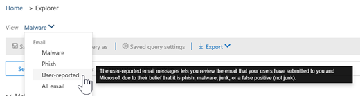

# Esplora minacce e rilevamenti in tempo reale

Se l'organizzazione dispone di [office 365 Advanced Threat Protection](office-365-atp.md) (Office 365 ATP) ed è necessario disporre [delle autorizzazioni necessarie](#required-licenses-and-permissions), sono disponibili **esplorazioni** o **rilevamenti in tempo reale** (in precedenza i *report in tempo reale* , [vedere What ' s New](#new-features-in-threat-explorer-and-real-time-detections)!). Nel centro sicurezza & conformità, accedere a **gestione minacce**, quindi scegliere **Esplora risorse** _o_ **rilevamenti in tempo reale**.

|||
|---|---|
|**Con ATP piano 2, è possibile vedere:**|**Con ATP piano 1, è possibile visualizzare le informazioni seguenti:**|
|||
|

Con Esplora risorse (o rilevamenti in tempo reale), si dispone di un report potente che consente al team di operazioni di sicurezza di analizzare e rispondere alle minacce in modo efficace ed efficiente. Il report è simile all'immagine seguente:

Con questo rapporto, è possibile:

- [Vedere malware detected by Microsoft 365 Security features](#see-malware-detected-in-email-by-technology)
- [Visualizzare i dati relativi agli URL di phishing e fare clic su verdetto](#view-data-about-phishing-urls-and-click-verdict)
- [Avviare un processo di analisi e risposta automatizzato da una visualizzazione in Explorer](#start-automated-investigation-and-response) (solo ATP piano 2)
- ... [Esaminare messaggi di posta elettronica dannosi e altro ancora](#more-ways-to-use-explorer-or-real-time-detections)!

## Nuove funzionalità in Esplora minacce e rilevamenti in tempo reale

Tre nuove funzionalità aggiunte in Esplora minacce e rilevamenti in tempo reale:

- [Anteprima della posta elettronica e scaricare il corpo della posta elettronica](#preview-email-header-and-download-email-body)
- [Sequenza temporale della posta elettronica](#email-timeline)
- [Esportare i dati di clic su URL](#export-url-click-data)

Queste nuove funzionalità sono descritte di seguito.

### Anteprima della posta elettronica e scaricare il corpo della posta elettronica

La possibilità di visualizzare in anteprima l'intestazione di un messaggio di posta elettronica e di scaricare il corpo della posta elettronica sono nuove funzionalità disponibili in Esplora minacce. Gli amministratori saranno in grado di analizzare le intestazioni o i messaggi di posta elettronica scaricati per individuare eventuali minacce. Poiché il download dei messaggi di posta elettronica può rischiare l'esposizione delle informazioni, questo processo è controllato dal controllo di accesso basato sui ruoli (RBAC). Un nuovo ruolo, l' *Anteprima*, deve essere aggiunto a un altro gruppo di ruoli, ad esempio operazioni di sicurezza o amministratore della sicurezza, per garantire la possibilità di scaricare i messaggi di posta elettronica e visualizzare le intestazioni di anteprima in tutte le visualizzazioni.

Ma Explorer (e rilevamenti in tempo reale) aggiunge anche nuovi campi creati per fornire un'immagine più completa della posizione in cui i messaggi di posta elettronica atterrano. Parte dell'obiettivo di questa modifica è facilitare la ricerca per gli addetti alle operazioni di sicurezza, ma il risultato della rete è la conoscenza del percorso dei messaggi di posta elettronica problematici.

Come è possibile eseguire questa operazione? Lo stato di recapito è ora suddiviso in due colonne:

- **Azione di recapito** -qual è lo stato di questo messaggio di posta elettronica?
- **Percorso di recapito** -dove è stato instradato il messaggio di posta elettronica come risultato?

Azione di recapito è l'azione intrapresa su un messaggio di posta elettronica a causa di criteri o rilevamenti esistenti. Ecco le possibili azioni che un messaggio di posta elettronica può eseguire:

|||||
|---|---|---|---|
|**Consegnato**|**Junked**|**Bloccati**|**Sostituito**|
|La posta elettronica è stata recapitata alla posta in arrivo dell'utente o a un'altra cartella e l'utente può accedervi direttamente.| La posta elettronica è stata inviata alla cartella posta indesiderata o alla cartella eliminata dell'utente e l'utente ha accesso ai messaggi di posta elettronica in tali cartelle.| Tutti i messaggi di posta elettronica in quarantena, che non sono riusciti o sono stati eliminati e non sono accessibili dall'utente.| Tutti i messaggi di posta elettronica in cui gli allegati dannosi sono stati sostituiti da file txt che affermano che gli allegati sono pericolosi.|
|

Ecco cosa può essere visualizzato dall'utente e cosa non è possibile:

|||
|---|---|
|**Accessibile per gli utenti finali**|**Inaccessibile per gli utenti finali**|
|Consegnato|Bloccati|
|Junked|Sostituito|
|

Il percorso di recapito consente di visualizzare i risultati dei criteri e i rilevamenti eseguiti dopo il recapito. È collegato a un'azione di recapito. Questo campo è stato aggiunto per fornire informazioni dettagliate sull'azione intrapresa quando viene trovata una posta elettronica problematica. Di seguito sono riportati i possibili valori del percorso di recapito:

- **Posta in arrivo o cartella**: la posta elettronica è in posta in arrivo o in una cartella (in base alle regole di posta elettronica).
- **On-Prem o External**: la cassetta postale non esiste sul cloud ma è in locale.
- **Cartella posta indesiderata**: l'indirizzo di posta elettronica si trova nella cartella Junk di un utente.
- **Cartella Posta eliminata**: il messaggio nella cartella elementi eliminati di un utente.
- **Quarantine**: l'indirizzo di posta elettronica in quarantena e non è incluso nella cassetta postale di un utente.
- **Errore**: il messaggio di posta elettronica non è riuscito a raggiungere la cassetta postale.
- **Eliminato**: il messaggio di posta elettronica viene perso da qualche parte nel flusso di posta.

### Sequenza temporale della posta elettronica

La **cronologia della posta elettronica** è un'altra funzionalità di Esplora risorse che consente di migliorare l'esperienza di ricerca per gli amministratori. La randomizzazione viene ridotta perché è necessario meno tempo per controllare posizioni diverse per cercare di comprendere l'evento. Quando più eventi si verificano in un messaggio di posta elettronica o vicino allo stesso tempo, gli eventi vengono visualizzati in una visualizzazione sequenza temporale. In effetti, alcuni eventi che si verificano dopo il recapito alla posta verranno acquisiti nella colonna ' Special Action '. La combinazione delle informazioni dalla sequenza temporale di quella posta con l'azione speciale intrapresa sul post-recapito della posta darà agli amministratori informazioni su come funzionano i propri criteri, in cui la posta è stata definitivamente instradata e, in alcuni casi, qual è stata la valutazione finale.

Per ulteriori informazioni sull'analisi dei messaggi di posta elettronica dannosi, vedere [indagare e correggere il messaggio di posta elettronica dannoso che è stato recapitato in Office 365](investigate-malicious-email-that-was-delivered.md).

### Esportare i dati di clic su URL

Sarà inoltre possibile esportare i report per i clic URL in Microsoft Excel per visualizzare sia l'ID del messaggio di rete, sia il loro verdetto di clic, in cui è possibile capire dove è stato creato il traffico dell'URL. Ecco come funziona. A partire da Threat Management sulla barra di avvio veloce di Office 365, fare clic su questa catena:

**Gestione risorse** \> **Visualizzazione phishing** \> **Clic su** \> URL **principali o clic** \> principali per gli URL **Fare clic su qualsiasi record per aprire il riquadro a comparsa URL**

Quando si fa clic su un URL nell'elenco, verrà visualizzato un nuovo pulsante Esporta nel riquadro di volo. Utilizzare questo pulsante per spostare i dati in un foglio di calcolo di Excel per semplificare la creazione di report.

È possibile accedere allo stesso percorso nel rapporto rilevamenti in tempo reale, come indicato di seguito:

**Gestione risorse** \> Rilevamenti in tempo **reale** \> **Visualizzazione phishing** \> **URL** \> **URL principali o clic principali** \> **Fare clic su qualsiasi record per aprire il riquadro a comparsa URL** \> **Passare alla scheda clic.**

> [!TIP]
> ID messaggio di rete mappare il clic di nuovo su mail specifiche quando si esegue una ricerca tramite Explorer o gli strumenti di terze parti associati tramite ID messaggio di rete. La ricerca nell'ID messaggio di rete fornirà agli amministratori la posta elettronica specifica associata a un risultato di clic. In caso di esportazione, l'identificazione correlata dell'ID messaggio di rete rende l'analisi più rapida e potente.

## Vedere malware rilevato in posta elettronica dalla tecnologia

Si supponga di voler vedere malware rilevato nella posta elettronica, tramite la tecnologia Microsoft 365. A tale scopo, utilizzare la visualizzazione [posta elettronica > malware](threat-explorer-views.md#email--malware) di Esplora risorse (o rilevamenti in tempo reale).

1. Nel centro sicurezza & conformità ( [https://protection.office.com](https://protection.office.com) ), scegliere **gestione minacce**  >  **Explorer** (o **rilevamenti in tempo reale**). In questo esempio viene utilizzato Esplora.

2. Scegliere malware **tramite posta elettronica**dal menu **Visualizza**  >  **Malware**.

   

3. Fare clic su **mittente**e quindi scegliere tecnologia di rilevamento di **base**  >  **Detection technology**.

   Le tecnologie di rilevamento sono ora disponibili come filtri per il report.

   

4. Selezionare un'opzione e quindi fare clic sul pulsante **Aggiorna** per applicare il filtro.

   

Il rapporto viene aggiornato per visualizzare i risultati rilevati dal malware nella posta elettronica, utilizzando l'opzione di tecnologia selezionata. Da qui, è possibile eseguire un'ulteriore analisi.

## Visualizzare i dati relativi agli URL di phishing e fare clic su verdetto

Si supponga di voler visualizzare i tentativi di phishing tramite URL nella posta elettronica, incluso un elenco di URL consentiti, bloccati e ignorati. L'identificazione degli URL che sono stati cliccati richiede la configurazione di [collegamenti sicuri ATP](atp-safe-links.md) . Assicurarsi di aver configurato i criteri per i [collegamenti sicuri di ATP](set-up-atp-safe-links-policies.md) per la protezione e la registrazione di un clic dei verdetti da ATP Safe Links.

Per esaminare gli URL di phishing nei messaggi e fare clic su URL nei messaggi di phishing, utilizzare la visualizzazione di [posta elettronica > phishing](threat-explorer-views.md#email--phish) di Esplora risorse (o rilevamenti in tempo reale).

1. Nel centro sicurezza & conformità ( [https://protection.office.com](https://protection.office.com) ), scegliere **gestione minacce**  >  **Explorer** (o **rilevamenti in tempo reale**). In questo esempio viene utilizzato Esplora.

2. Nel menu **Visualizza** scegliere **posta elettronica**  >  **phishing**.

   

3. Fare clic su **sender**e quindi scegliere **urls**  >  **Click verdict**.

4. Selezionare una o più opzioni, ad esempio **bloccate** e **bloccate**, e quindi fare clic sul pulsante **Aggiorna** che si trova nella stessa riga delle opzioni per applicare il filtro. (Non aggiornare la finestra del browser.)

   

    Il rapporto viene aggiornato per visualizzare due diverse tabelle URL nella scheda URL del rapporto:

   - Gli URL **principali** sono gli URL contenuti nei messaggi che sono stati filtrati fino a e l'azione di recapito della posta elettronica conta per ogni URL. Nella visualizzazione posta elettronica di phishing, in genere l'elenco conterrà URL legittimi. I pirati informatici includono una combinazione di URL buoni e cattivi nei messaggi per cercare di farli recapitare, ma renderà i collegamenti dannosi più interessanti per l'utente da fare clic su. La tabella degli URL è ordinata in base al numero totale di messaggi di posta elettronica (ma si noti che questa colonna è nascosta per semplificare la visualizzazione).

   - I **clic principali** sono gli URL con collegamenti sicuri che sono stati selezionati, ordinati in base al numero di clic totale (la colonna non viene visualizzata per semplificare la visualizzazione). Numeri totali per colonna indicano i collegamenti sicuri fare clic su conteggio verdetto per ogni URL selezionato. Nella visualizzazione posta elettronica di phishing, si tratta di URL più spesso sospetti o maligni, ma possono includere URL che non sono minacce, ma che sono presenti nei messaggi di phishing. Gli URL che fanno clic su collegamenti non spostati non verranno visualizzati qui.

   Le due tabelle degli URL visualizzano gli URL principali nei messaggi di posta elettronica di phishing tramite l'azione e la posizione di recapito e visualizzano gli URL che sono stati bloccati (o visitati nonostante un avviso), in modo da poter capire quali potenziali collegamenti non validi sono stati ricevuti dagli utenti e interagito con gli utenti. Da qui, è possibile eseguire un'ulteriore analisi. Ad esempio, al di sotto del grafico, è possibile visualizzare gli URL principali nei messaggi di posta elettronica bloccati nell'ambiente dell'organizzazione.

   

   Selezionare un URL per visualizzare informazioni più dettagliate.
   
   > [!NOTE]
   > Nella finestra di dialogo a comparsa URL, il filtro dei messaggi di posta elettronica viene rimosso per visualizzare la visualizzazione completa dell'esposizione dell'URL nell'ambiente in uso. In questo modo è possibile filtrare i messaggi di posta elettronica in Esplora per quelli che si sono preoccupati, individuare URL specifici che sono potenziali minacce e quindi espandere la propria comprensione dell'esposizione all'URL nell'ambiente (tramite la finestra di dialogo Dettagli URL) senza dover aggiungere filtri URL alla visualizzazione Esplora risorse.

## Esaminare i messaggi di posta elettronica segnalati dagli utenti

Si supponga di voler visualizzare i messaggi di posta elettronica che gli utenti dell'organizzazione hanno segnalato come posta indesiderata, non indesiderata o phishing tramite il [componente aggiuntivo per Outlook e Outlook sul Web](enable-the-report-message-add-in.md). A tale scopo, utilizzare la visualizzazione [> invii di posta elettronica](threat-explorer-views.md#email--submissions) di Esplora risorse (o rilevamenti in tempo reale).

1. Nel centro sicurezza & conformità ( [https://protection.office.com](https://protection.office.com) ), scegliere **gestione minacce**  >  **Explorer** (o **rilevamenti in tempo reale**). In questo esempio viene utilizzato Esplora.

2. Scegliere **invii di posta elettronica**dal menu **Visualizza**  >  **Submissions**.

   

3. Fare clic su **mittente**e quindi scegliere tipo di report di **base**  >  **Report type**.

4. Selezionare un'opzione, ad esempio **phishing**, e quindi fare clic sul pulsante **Aggiorna** .

   

Il rapporto viene aggiornato per visualizzare i dati relativi ai messaggi di posta elettronica che gli utenti dell'organizzazione hanno segnalato come tentativo di phishing. È possibile utilizzare queste informazioni per eseguire un'ulteriore analisi e, se necessario, regolare i [criteri di anti-phishing ATP](configure-atp-anti-phishing-policies.md).

## Avviare l'analisi e la risposta automatizzata

> [!NOTE]
> Le funzionalità di ricerca e risposta automatizzate sono disponibili in **office 365 ATP piano 2** e **Office 365 E5**.

(Nuovo!) L' [analisi e la risposta automatizzate](automated-investigation-response-office.md) sono in grado di salvare il team delle operazioni di sicurezza molto tempo ed energie nell'analisi e nell'attenuazione di attacchi cibernetici. Oltre a configurare gli avvisi che possono attivare un PlayBook per la sicurezza, è possibile avviare un processo di analisi e risposta automatizzato da una visualizzazione di Esplora risorse.

Per ulteriori informazioni, vedere [esempio: un amministratore della sicurezza attiva un'analisi da Esplora risorse](automated-investigation-response-office.md#example-a-security-administrator-triggers-an-investigation-from-threat-explorer).

## Altre modalità di utilizzo di Esplora risorse (o rilevamenti in tempo reale)

Oltre agli scenari descritti in questo articolo, sono disponibili molte altre opzioni per la creazione di report con Esplora risorse (o rilevamenti in tempo reale).

- [Identificare e analizzare i messaggi di posta elettronica dannosi recapitati](investigate-malicious-email-that-was-delivered.md)
- [Visualizzare i file dannosi rilevati in SharePoint Online, OneDrive e Microsoft Teams](malicious-files-detected-in-spo-odb-or-teams.md)
- [Ottenere una panoramica delle visualizzazioni in Esplora minacce (e rilevamenti in tempo reale)](threat-explorer-views.md)

## Licenze e autorizzazioni obbligatorie

È necessario disporre di [Office 365 ATP](office-365-atp.md) per ottenere rilevamenti di Esplora risorse o in tempo reale.

- Explorer è incluso in Office 365 ATP piano 2.
- Il rapporto sui rilevamenti in tempo reale è incluso in Office 365 ATP Plan 1.
- Pianificare l'assegnazione delle licenze per tutti gli utenti che devono essere protetti da Office 365 ATP. (Esplora risorse o rilevamenti in tempo reale mostrano i dati di rilevamento per gli utenti con licenza).

Per visualizzare e utilizzare esplorazioni o rilevamenti in tempo reale, è necessario disporre delle autorizzazioni appropriate, ad esempio quelle concesse a un amministratore della sicurezza o a un lettore di sicurezza.

- Per il &amp; Centro sicurezza e conformità, è necessario che sia assegnato uno dei ruoli seguenti:

  - Gestione organizzazione
  - Amministratore della sicurezza (è possibile assegnarlo nell'interfaccia di amministrazione di Azure Active Directory ( [https://aad.portal.azure.com](https://aad.portal.azure.com) ))
  - Ruolo con autorizzazioni di lettura per la sicurezza

- Per Exchange Online, è necessario che sia assegnato uno dei ruoli seguenti nell'interfaccia di amministrazione di Exchange ( [https://outlook.office365.com/ecp](https://outlook.office365.com/ecp) ) o con i cmdlet di PowerShell (vedere [Exchange Online PowerShell](https://docs.microsoft.com/powershell/exchange/exchange-online-powershell)):

  - Gestione organizzazione
  - Gestione organizzazione in sola visualizzazione
  - Ruolo Destinatari di sola lettura
  - Gestione della conformità

Per ulteriori informazioni sui ruoli e sulle autorizzazioni, vedere le risorse seguenti:

- [Autorizzazioni nel centro sicurezza e &amp; conformità](permissions-in-the-security-and-compliance-center.md)
- [Autorizzazioni funzionalità in Exchange Online](https://docs.microsoft.com/exchange/permissions-exo/feature-permissions)

## Alcune differenze tra Esplora minacce e rilevamenti in tempo reale

- Il rapporto sui **rilevamenti in tempo reale** è disponibile in Office 365 ATP Plan 1, mentre l' **esploratore di minacce** è disponibile in Office 365 ATP piano 2.
- Il rapporto sui **rilevamenti in tempo reale** consente di visualizzare i rilevamenti in tempo reale. **Threat Explorer** Anche questo consente di visualizzare ulteriori dettagli relativi a un determinato attacco.
- La visualizzazione di **tutti i messaggi di posta elettronica** è disponibile in **Esplora minacce** (e non è presente nel rapporto **rilevamenti in tempo reale** ).
- Altre funzionalità di filtro e le azioni disponibili sono incluse in **Esplora minacce**.

Per ulteriori informazioni, vedere [Descrizione del servizio ATP di Office 365: disponibilità delle funzionalità tra i piani di Advanced Threat Protection (ATP)](https://docs.microsoft.com/office365/servicedescriptions/office-365-advanced-threat-protection-service-description#feature-availability-across-advanced-threat-protection-atp-plans).
