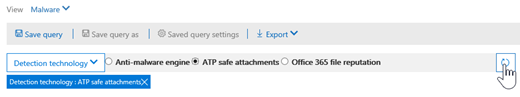

# Esplora minacce e rilevamenti in tempo reale

Se l'organizzazione dispone [di Microsoft Defender per Office 365](office-365-atp.md) e si dispone [delle autorizzazioni necessarie](#required-licenses-and-permissions), è possibile accedere a *Esplora risorse* o ai *rilevamenti in tempo reale*, che sono stati precedentemente *segnalati in tempo reale*. ([Vedere What ' s New).](#new-features-in-threat-explorer-and-real-time-detections) Nel centro sicurezza & conformità, accedere a **gestione minacce**, quindi selezionare **Esplora** _o_ **rilevamenti in tempo reale**.

|Con Microsoft Defender per Office 365 piano 2, è possibile visualizzare le informazioni seguenti:|Con Microsoft Defender per Office 365 piano 1, è possibile visualizzare le informazioni seguenti:|
|---|---|
|||
|

Esplora risorse o rilevamenti in tempo reale aiuta il team delle operazioni di sicurezza a studiare e rispondere alle minacce in modo efficiente. Il report è simile all'immagine seguente:

Con questo rapporto, è possibile:

- [Vedere malware detected by Microsoft 365 Security features](#see-malware-detected-in-email-by-technology)
- [Visualizzare l'URL di phishing e fare clic su dati verdetto](#view-phishing-url-and-click-verdict-data)
- [Avviare un processo di analisi e risposta automatizzato da una visualizzazione in Explorer](#start-automated-investigation-and-response) (solo Defender per Office 365 piano 2)
- [Esaminare messaggi di posta elettronica dannosi e altro ancora](#more-ways-to-use-explorer-and-real-time-detections)

## Miglioramenti apportati a Esplora minacce e rilevamenti in tempo reale

### Tag in Esplora minacce

> [!NOTE]
> La funzionalità tag utente è in *Anteprima*, non è disponibile per tutti, ed è soggetta a modifiche. Per informazioni sulla pianificazione dei rilasci, vedere la Guida di orientamento di Microsoft 365.

I tag utente identificano gruppi di utenti specifici in Microsoft Defender per Office 365. Per ulteriori informazioni sui tag, tra cui la gestione delle licenze e la configurazione, vedere [tag utente](user-tags.md).

In Esplora minacce, è possibile visualizzare le informazioni sui tag degli utenti nelle esperienze seguenti.

#### Visualizzazione della griglia di posta elettronica

La colonna **tag** della griglia di posta elettronica contiene tutti i tag applicati alle cassette postali del mittente o del destinatario. Per impostazione predefinita, i tag di sistema come gli account prioritari vengono visualizzati per primo.

> [!div class="mx-imgBorder"]
> 

#### Filtro

È possibile utilizzare i tag come filtro. Cerca solo tra gli account prioritari o gli scenari specifici di tag utente. È inoltre possibile escludere i risultati che dispongono di determinati tag. Combinare questa funzionalità con altri filtri per limitare l'ambito di indagine.

> [!div class="mx-imgBorder"]
> 

#### Riquadro a comparsa dettagli posta elettronica
Per visualizzare i singoli tag per il mittente e il destinatario, selezionare l'oggetto per aprire il riquadro a comparsa Dettagli messaggio. Nella scheda **Riepilogo** i tag del mittente e del destinatario sono visualizzati separatamente, se sono presenti per un messaggio di posta elettronica.
Le informazioni sui singoli tag per il mittente e il destinatario si estendono anche ai dati CSV esportati, in cui è possibile visualizzare questi dettagli in due colonne separate.

> [!div class="mx-imgBorder"]
> 

Le informazioni sui tag vengono inoltre visualizzate nel riquadro a comparsa clic URL. Per visualizzarlo, passare a phishing o a tutte le visualizzazioni di posta elettronica e quindi alla scheda **URL** o **clic URL** . Selezionare un singolo riquadro a comparsa URL per visualizzare ulteriori dettagli sui clic relativi a quell'URL, inclusi i tag associati a quel clic.

> [!div class="mx-imgBorder"]
> 

## Miglioramenti all'esperienza di caccia alle minacce (imminente)

### Informazioni aggiornate sulle minacce per i messaggi di posta elettronica

Ci siamo concentrati sui miglioramenti alla piattaforma e alla qualità dei dati per aumentare l'accuratezza dei dati e la coerenza dei record di posta elettronica. I miglioramenti includono il consolidamento delle informazioni di pre-recapito e post-recapito, ad esempio le azioni eseguite su un messaggio di posta elettronica come parte del processo ZAP, in un singolo record. Ulteriori dettagli come il verdetto di posta indesiderata, le minacce a livello di entità (ad esempio, l'URL è dannoso) e sono inclusi anche i percorsi di recapito più recenti.

Dopo questi aggiornamenti, viene visualizzata una singola voce per ogni messaggio, indipendentemente dai diversi eventi successivi al recapito che influiscono sul messaggio. Le azioni possono includere ZAP, la correzione manuale (che significa azione dell'amministratore), il recapito dinamico e così via.

Oltre a mostrare minacce antimalware e di phishing, viene visualizzato il verdetto di posta indesiderata associato a un messaggio di posta elettronica. All'interno del messaggio di posta elettronica, vedere tutti i pericoli associati al messaggio di posta elettronica insieme alle tecnologie di rilevamento corrispondenti. Un messaggio di posta elettronica può avere zero, una o più minacce. Verranno visualizzate le minacce correnti nella sezione **Dettagli** del riquadro a comparsa del messaggio di posta elettronica. Per più minacce (come malware e phishing), il campo **tecnologia di rilevamento** Visualizza il mapping di rilevamento delle minacce, che è la tecnologia di rilevamento che ha identificato la minaccia.

Il set di tecnologie di rilevamento include ora nuovi metodi di rilevamento, nonché tecnologie di rilevamento della posta indesiderata. È possibile utilizzare lo stesso insieme di tecnologie di rilevamento per filtrare i risultati tra le diverse visualizzazioni di posta elettronica (malware, phishing, tutti i messaggi di posta elettronica).

> [!NOTE]
> L'analisi del verdetto potrebbe non essere necessariamente legata alle entità. Ad esempio, un messaggio di posta elettronica potrebbe essere classificato come phishing o posta indesiderata, ma non ci sono URL contrassegnati con un verdetto di phishing/spam. Ciò è dovuto al fatto che i filtri valutano anche il contenuto e altri dettagli per un messaggio di posta elettronica prima di assegnare un verdetto.

#### Minacce negli URL

È ora possibile visualizzare la minaccia specifica per un URL nella scheda **Dettagli** riquadro a comparsa di posta elettronica. La minaccia può essere il *malware*, *phishing*, la *posta indesiderata* o *nessuno*.

> [!div class="mx-imgBorder"]
> 

### Visualizzazione sequenza temporale aggiornata (imminente)

> [!div class="mx-imgBorder"]
> 

La visualizzazione sequenza temporale identifica tutti gli eventi di recapito e post-recapito. Include informazioni sulla minaccia identificata in quel momento per un sottoinsieme di questi eventi. La visualizzazione sequenza temporale fornisce inoltre informazioni su eventuali azioni aggiuntive eseguite (ad esempio, la correzione di ZAP o manuale), insieme al risultato di tale azione. Le informazioni sulla visualizzazione sequenza temporale includono:

- **Origine:** Origine dell'evento. Può essere amministratore/sistema/utente.
- **Evento:** Include eventi di primo livello quali il recapito originale, la correzione manuale, lo ZAP, gli invii e il recapito dinamico.
- **Azione:** Azione specifica eseguita come parte dell'azione ZAP o admin, ad esempio soft delete.
- **Minacce:** Copre le minacce (malware, phishing, posta indesiderata) identificate in quel momento.
- **Result/Details:** Ulteriori informazioni sul risultato dell'azione, ad esempio se è stato eseguito come parte dell'azione ZAP/admin.

### Percorso di recapito originale e più recente

Attualmente, il percorso di recapito di superficie viene inviato nella griglia di posta elettronica e nel riquadro a comparsa. Il campo **percorso di recapito** è sempre rinominato **_posizione di recapito originale_* _. E stiamo introducendo un altro campo, il _*_percorso di recapito più recente_*_.

_ Il *percorso di recapito originale** fornirà ulteriori informazioni sul luogo in cui un messaggio di posta elettronica è stato inviato inizialmente. Il **percorso di recapito più recente** sarà quello in cui un messaggio di posta elettronica è atterrato dopo azioni del sistema come *zap* o azioni amministrative come *sposta negli elementi eliminati* Il percorso di recapito più recente ha lo scopo di informare gli amministratori dell'ultimo percorso conosciuto del messaggio dopo il recapito o di qualsiasi azione di sistema/amministratore. Non include alcuna azione dell'utente finale sul messaggio di posta elettronica. Ad esempio, se un utente ha eliminato un messaggio o ha spostato il messaggio in Archive/PST, la posizione del messaggio "recapito" non verrà aggiornata. Tuttavia, se un'azione del sistema ha aggiornato la posizione (ad esempio, ZAP ha provocato un messaggio di posta elettronica in quarantena), il **percorso di recapito più recente** verrebbe visualizzato come "quarantena".

> [!div class="mx-imgBorder"]
> 

> [!NOTE]
> Esistono alcuni casi in cui il **percorso di recapito** e l' **azione di recapito** possono essere visualizzati come "sconosciuti":
>
> - Se il messaggio è stato recapitato, è possibile che il **percorso di recapito** venga visualizzato come "recapitato" e **recapito** come "sconosciuto", ma una regola di posta in arrivo ha spostato il messaggio in una cartella predefinita, ad esempio Draft o Archive, anziché nella cartella posta in arrivo o posta indesiderata.
>
> - Il **percorso di recapito più recente** può essere sconosciuto se è stata tentata un'azione di amministratore/sistema (come ZAP), ma il messaggio non è stato trovato. In genere, l'azione si verifica dopo lo spostamento o l'eliminazione del messaggio da parte dell'utente. In questi casi, verificare la colonna **Result/Details** nella visualizzazione sequenza temporale. Cercare l'istruzione "Message moved or deleted by the user".

> [!div class="mx-imgBorder"]
> 

### Azioni aggiuntive

Le *azioni aggiuntive* sono state applicate dopo il recapito del messaggio di posta elettronica. Possono includere *zap*, la *correzione manuale* (azione intrapresa da un amministratore, ad esempio soft delete), il *recapito dinamico* e *rielaborati* (per un messaggio di posta elettronica che è stato rilevato con effetto retroattivo come valido).

> [!NOTE]
> - Come parte delle modifiche in sospeso, il valore "rimossi da ZAP" attualmente emerso nel filtro azione di recapito è in corso. È possibile eseguire la ricerca di tutti i messaggi di posta elettronica con il tentativo ZAP tramite **azioni aggiuntive**.
>
> - Saranno disponibili nuovi campi e valori per le **tecnologie di rilevamento** e **altre azioni** , in particolare per gli scenari di zap. È necessario valutare le query salvate esistenti e le query registrate per assicurarsi che funzionino con i nuovi valori.

> [!div class="mx-imgBorder"]

> 

### Sostituzioni del sistema

Le *sostituzioni del sistema* consentono di effettuare eccezioni al percorso di recapito previsto di un messaggio. È possibile ignorare il percorso di recapito fornito dal sistema, in base alle minacce e ad altri rilevamenti identificati dallo stack di filtro. È possibile impostare le sostituzioni del sistema tramite il criterio tenant o utente per recapitare il messaggio come suggerito dal criterio. Le sostituzioni possono identificare il recapito involontario di messaggi dannosi a causa di interruzioni di configurazioni, ad esempio un criterio mittente sicuro eccessivamente ampio impostato da un utente. Questi valori di sostituzione possono essere:

- Consentito dai criteri utente: un utente crea criteri a livello di cassetta postale per consentire domini o mittenti.
- Bloccati dai criteri utente: un utente crea criteri a livello di casella di posta per bloccare domini o mittenti.
- Consentito dai criteri org: i team di sicurezza dell'organizzazione impostare criteri o le regole del flusso di posta di Exchange (note anche come regole di trasporto) per consentire mittenti e domini per gli utenti dell'organizzazione. Può trattarsi di un gruppo di utenti o dell'intera organizzazione.
- Bloccato dai criteri org: i team di sicurezza dell'organizzazione hanno impostato i criteri o le regole del flusso di posta per bloccare mittenti, domini, lingue dei messaggi o IP di origine per gli utenti dell'organizzazione. Questo può essere applicato a un gruppo di utenti o all'intera organizzazione.
- Estensione file bloccata da criteri org: il team di sicurezza di un'organizzazione blocca un'estensione del nome di file tramite le impostazioni dei criteri antimalware. Questi valori verranno ora visualizzati nei dettagli della posta elettronica per facilitare le indagini. I team di secops possono anche utilizzare la funzionalità di filtro RTF per filtrare le estensioni di file bloccate.

> [!div class="mx-imgBorder"]
> 

### Miglioramenti per l'utilizzo di URL e clic

I miglioramenti sono:

- Visualizzare l'URL con clic completo (compresi i parametri di query che fanno parte dell'URL) nella sezione **clic** del riquadro a comparsa URL. Attualmente, il dominio e il percorso dell'URL vengono visualizzati sulla barra del titolo. Le informazioni vengono estese per visualizzare l'URL completo.

- Correzioni tra filtri URL (*URL* e *dominio* URL rispetto al *dominio e al percorso URL*): gli aggiornamenti influiscono sulla ricerca di messaggi che contengono un verdetto URL/clic. È stato abilitato il supporto per le ricerche indipendenti dal protocollo, quindi è possibile cercare un URL senza l'utilizzo `http` . Per impostazione predefinita, la ricerca URL esegue il mapping a http, a meno che non venga specificato esplicitamente un altro valore. Ad esempio:

   -  Eseguire una ricerca con e senza il `http://` prefisso nei campi **URL**, **dominio URL** e **dominio URL e filtro percorso** . Le ricerche devono mostrare gli stessi risultati.

   -  Cercare il `https://` prefisso in **URL**. Quando non viene specificato alcun valore, `http://` viene utilizzato il prefisso.

   - `/` viene ignorato all'inizio e alla fine del **percorso URL**, del **dominio URL**, del **dominio URL e** dei campi del percorso. `/` alla fine del campo **URL** viene ignorato.

### Livello di confidenza phishing

Il livello di sicurezza di phishing consente di identificare il grado di attendibilità con cui un messaggio di posta elettronica è stato categorizzato come "phishing". I due valori possibili sono *High* e *Normal*. Nelle fasi iniziali, questo filtro sarà disponibile solo nella visualizzazione phishing di Esplora minacce.

### Segnale URL ZAP

Lo ZAP URL Signal è in genere utilizzato per gli scenari di avviso di ZAP phishing in cui un messaggio di posta elettronica è stato identificato come phishing e rimosso dopo il recapito. Questo segnale collega l'avviso con i risultati corrispondenti in Esplora. Si tratta di uno dei IOCs per l'avviso.

Per migliorare il processo di caccia, sono stati aggiornati i rilevamenti di Esplora minacce e in tempo reale per rendere l'esperienza di caccia più coerente. Le modifiche sono descritte di seguito:

- [Miglioramenti del fuso orario](#timezone-improvements)
- [Aggiornamento nel processo di aggiornamento](#update-in-the-refresh-process)
- [Drill-down del grafico da aggiungere ai filtri](#chart-drilldown-to-add-to-filters)
- [Negli aggiornamenti delle informazioni sui prodotti](#in-product-information-updates)

### Filtrare in base ai tag utente

È ora possibile ordinare e filtrare i tag utente di sistema o personalizzati per afferrare rapidamente l'ambito delle minacce. Per ulteriori informazioni, vedere [tag utente](user-tags.md).

> [!IMPORTANT]
> Il filtro e l'ordinamento in base ai tag utente è attualmente in anteprima pubblica. Questa funzionalità può essere modificata in modo sostanziale prima che venga rilasciata commercialmente. Microsoft non fornisce garanzie, espresse o implicite, in relazione alle informazioni fornite in proposito.

### Miglioramenti del fuso orario

Verrà visualizzato il fuso orario per i record di posta elettronica nel portale e per i dati esportati. Sarà visibile attraverso esperienze come la griglia di posta elettronica, i dettagli a comparsa, la sequenza temporale della posta elettronica e i messaggi simili, in modo che il fuso orario per il set di risultati sia chiaro.

> [!div class="mx-imgBorder"]
> 

### Aggiornamento nel processo di aggiornamento

Alcuni utenti hanno commentato la confusione con l'aggiornamento automatico (ad esempio, non appena si modifica la data, la pagina viene aggiornata) e l'aggiornamento manuale (per altri filtri). Analogamente, la rimozione di filtri porta all'aggiornamento automatico. La modifica dei filtri durante la modifica della query può causare un'esperienza di ricerca incoerente. Per risolvere questi problemi, è possibile passare a un meccanismo di filtraggio manuale.

Da un punto di vista dell'esperienza, l'utente può applicare e rimuovere i diversi filtri (dal set di filtri e dalla data) e selezionare il pulsante Aggiorna per filtrare i risultati dopo aver definito la query. Anche il pulsante Aggiorna è stato enfatizzato sullo schermo. Sono state aggiornate anche le descrizioni comandi correlate e la documentazione del prodotto.

> [!div class="mx-imgBorder"]
> 

### Drill-down del grafico da aggiungere ai filtri

È ora possibile eseguire il grafico dei valori della legenda per aggiungerli come filtri. Selezionare il pulsante **Aggiorna** per filtrare i risultati.

> [!div class="mx-imgBorder"]
> 

### Aggiornamenti delle informazioni sul prodotto

Ulteriori informazioni sono ora disponibili all'interno del prodotto, ad esempio il numero totale di risultati della ricerca all'interno della griglia (vedere di seguito). Sono state migliorate le etichette, i messaggi di errore e le descrizioni comandi per fornire ulteriori informazioni sui filtri, l'esperienza di ricerca e il set di risultati.

> [!div class="mx-imgBorder"]
> 

## Funzionalità estese in Esplora minacce

### Utenti di destinazione principali

Oggi viene esposto l'elenco degli utenti di destinazione principali nella visualizzazione malware per i messaggi di posta elettronica, nella sezione **principali famiglie di malware** . Questa visualizzazione verrà estesa anche in phishing e in tutte le visualizzazioni di posta elettronica. È possibile visualizzare i primi cinque utenti mirati, insieme al numero di tentativi per ogni utente per la visualizzazione corrispondente. Ad esempio, per la visualizzazione phishing, viene visualizzato il numero di tentativi di phishing.

È possibile esportare l'elenco di utenti di destinazione, fino a un massimo di 3.000, insieme al numero di tentativi di analisi offline per ogni visualizzazione di posta elettronica. Inoltre, selezionando il numero di tentativi (ad esempio, 13 tentativi nell'immagine seguente) verrà aperta una visualizzazione filtrata in Esplora minacce, in modo che sia possibile visualizzare ulteriori dettagli tra i messaggi di posta elettronica e le minacce per tale utente.

> [!div class="mx-imgBorder"]
> 

### Regole di trasporto di Exchange

Nell'ambito dell'arricchimento dei dati, è possibile visualizzare tutte le diverse regole di trasporto di Exchange (ETR) applicate a un messaggio. Queste informazioni saranno disponibili nella visualizzazione griglia di posta elettronica. Per visualizzarlo, selezionare **Opzioni colonna** nella griglia e quindi **aggiungere la regola di trasporto di Exchange** dalle opzioni di colonna. Verrà inoltre visualizzato nel riquadro a comparsa **Dettagli** nel messaggio di posta elettronica.

È possibile visualizzare sia il GUID che il nome delle regole di trasporto che sono state applicate al messaggio. È possibile eseguire la ricerca dei messaggi utilizzando il nome della regola di trasporto. Questa è una ricerca "contiene", il che significa che è possibile eseguire anche ricerche parziali.

#### Nota importante:

La disponibilità di ricerca e il nome di ETR dipendono dal ruolo specifico assegnato all'utente. È necessario disporre di uno dei ruoli e delle autorizzazioni seguenti per visualizzare i nomi e la ricerca di ETR. Se non si dispone di uno di questi ruoli assegnati, non è possibile visualizzare i nomi delle regole di trasporto o cercare i messaggi utilizzando i nomi di ETR. Tuttavia, è possibile visualizzare l'etichetta di ETR e le informazioni sui GUID nei dettagli della posta elettronica. Altre esperienze di visualizzazione dei record nelle griglie di posta elettronica, comparsa di posta elettronica, filtri ed esportazione non sono intaccate.

- EXO only-prevenzione della perdita di dati: All
- Solo EXO-O365SupportViewConfig: All
- Microsoft Azure Active Directory o ESO-Security admin: All
- AAD o EXO-Security Reader: tutti i
- Solo EXO-regole di trasporto: tutte
- Configurazione solo EXO-View-Only: All

All'interno della griglia di posta elettronica, del riquadro a comparsa dei dettagli e del CSV esportato, il ETRs viene presentato con un nome/GUID come illustrato di seguito.

> [!div class="mx-imgBorder"]
> 

### Connettori in ingresso

I connettori sono una raccolta di istruzioni che personalizzano la modalità di flusso della posta elettronica da e verso l'organizzazione Microsoft 365 o Office 365. Consentono di applicare eventuali restrizioni o controlli di sicurezza. In Esplora minacce è ora possibile visualizzare i connettori correlati a un messaggio di posta elettronica e cercare messaggi di posta elettronica utilizzando i nomi dei connettori.

La ricerca dei connettori è "contiene" in natura, il che significa che le ricerche di parole chiave parziali dovrebbero funzionare anche. All'interno della visualizzazione griglia principale, del riquadro a comparsa dei dettagli e del CSV esportato, i connettori vengono visualizzati nel formato nome/GUID, come illustrato di seguito:

> [!div class="mx-imgBorder"]
> 

## Nuove funzionalità in Esplora minacce e rilevamenti in tempo reale

Sono disponibili tre nuove funzionalità in Esplora minacce e rilevamenti in tempo reale:

- [Anteprima della posta elettronica e scaricare il corpo della posta elettronica](#preview-email-header-and-download-email-body)
- [Sequenza temporale della posta elettronica](#email-timeline)
- [Esportare i dati di clic su URL](#export-url-click-data)

Queste nuove funzionalità sono descritte di seguito.

### Anteprima della posta elettronica e scaricare il corpo della posta elettronica

Ora è possibile visualizzare in anteprima l'intestazione di un messaggio di posta elettronica e scaricare il corpo di posta elettronica in Threat Explorer Admins in grado di analizzare le intestazioni o i messaggi di posta elettronica scaricati Poiché il download dei messaggi di posta elettronica può rischiare l'esposizione delle informazioni, questo processo è controllato dal controllo di accesso basato sui ruoli (RBAC). Un nuovo ruolo, l' *Anteprima*, deve essere aggiunto a un altro gruppo di ruoli, ad esempio operazioni di sicurezza o amministratore della sicurezza, per garantire la possibilità di scaricare i messaggi di posta elettronica e visualizzare le intestazioni di anteprima in tutte le visualizzazioni.

Gli esploratori e i rilevamenti in tempo reale riceveranno anche nuovi campi che forniscono un'immagine più completa del luogo in cui i messaggi di posta elettronica atterrano. Queste modifiche facilitano la ricerca per le operazioni di sicurezza. Tuttavia, il risultato principale è che è possibile conoscere la posizione dei messaggi di posta elettronica problematici.

Come è possibile eseguire questa operazione? Lo stato di recapito è ora suddiviso in due colonne:

- **Azione di recapito** -stato del messaggio di posta elettronica.
- **Percorso di recapito** in cui il messaggio di posta elettronica è stato instradato.

*Azione di recapito* è l'azione intrapresa su un messaggio di posta elettronica a causa di criteri o rilevamenti esistenti. Di seguito vengono descritte le azioni possibili per un messaggio di posta elettronica:

|Consegnato|Junked|Bloccato|Sostituito|
|---|---|---|---|
|Il messaggio di posta elettronica è stato recapitato nella posta in arrivo o nella cartella di un utente e l'utente può accedervi.|La posta elettronica è stata inviata alla cartella posta indesiderata o eliminata dell'utente e l'utente può accedervi.|Messaggi di posta elettronica in quarantena, che hanno avuto esito negativo o sono stati eliminati. Questi messaggi di posta elettronica sono inaccessibili all'utente.|La posta elettronica aveva allegati dannosi sostituiti da file. txt che affermano che l'allegato era dannoso.|

Di seguito è indicato l'utente che può e non è in grado di visualizzare:

|Accessibile per gli utenti finali|Inaccessibile per gli utenti finali|
|---|---|
|Consegnato|Bloccato|
|Junked|Sostituito|

Il **percorso di recapito** consente di visualizzare i risultati dei criteri e i rilevamenti eseguiti dopo il recapito. È collegato all'azione di *_recapito_* _. Questi sono i valori possibili:

- _Inbox o cartella *: il messaggio di posta elettronica si trova nella posta in arrivo o in una cartella (in base alle regole di posta elettronica).
- *On-Prem o External*: la cassetta postale non esiste sul cloud ma è in locale.
- *Cartella posta indesiderata*: la posta elettronica si trova nella cartella posta indesiderata di un utente.
- *Cartella Posta eliminata*: il messaggio nella cartella degli elementi eliminati di un utente.
- *Quarantena*: il messaggio di posta elettronica è in quarantena e non nella cassetta postale di un utente.
- *Errore*: il messaggio di posta elettronica non è riuscito a raggiungere la cassetta postale.
- *Dropped*: il messaggio di posta elettronica si è perso da qualche parte nel flusso di posta.

### Sequenza temporale della posta elettronica

La **cronologia della posta elettronica** è una nuova funzionalità di esplorazione che migliora l'esperienza di caccia per gli amministratori. Consente di ridurre il tempo impiegato per il controllo di diverse posizioni per cercare di comprendere l'evento. Quando più eventi si verificano durante o vicino alla stessa ora di arrivo di un messaggio di posta elettronica, tali eventi vengono visualizzati in una visualizzazione sequenza temporale. Alcuni eventi che si verificano nel post-recapito della posta elettronica vengono acquisiti nella colonna **azione speciale** . Gli amministratori possono combinare informazioni dalla sequenza temporale con le azioni speciali intraprese nel post-recapito della posta per comprendere come funzionano i propri criteri, in cui la posta è stata definitivamente instradata e, in alcuni casi, quale è stata la valutazione finale.

Per ulteriori informazioni, vedere [indagare e risolvere i messaggi di posta elettronica dannosi che sono stati recapitati in Office 365](investigate-malicious-email-that-was-delivered.md).

### Esportare i dati di clic su URL

Ora è possibile esportare i report per i clic URL in Microsoft Excel per visualizzare l' **ID messaggio di rete** e **fare clic su verdetto**, che consente di spiegare dove è stato originato il traffico dell'URL. Ecco come funziona: in Threat Management sulla barra di avvio veloce di Office 365, seguire questa catena:

**Gestione risorse** \> **Visualizzazione phishing** \> **Clic su** \> **Top URLs** o **URL Top clic** \> selezionare qualsiasi record per aprire il riquadro a comparsa URL.

Quando si seleziona un URL nell'elenco, verrà visualizzato un nuovo pulsante **Esporta** nel riquadro di volo. Utilizzare questo pulsante per spostare i dati in un foglio di calcolo di Excel per semplificare la creazione di report.

Seguire questo percorso per accedere allo stesso percorso nel rapporto rilevamenti in tempo reale:

**Gestione risorse** \> Rilevamenti in tempo **reale** \> **Visualizzazione phishing** \> **URL** \> **Top URLs** o **Top clic** \> selezionare qualsiasi record per aprire il riquadro a comparsa URL \> passare alla scheda **clic** .

> [!TIP]
> L'ID messaggio di rete mappa il clic di nuovo a messaggi specifici quando si esegue una ricerca sull'ID tramite Esplora risorse o su strumenti di terze parti associati. Tali ricerche identificano il messaggio di posta elettronica associato a un risultato di clic. L'ID del messaggio di rete correlato rende l'analisi più rapida e potente.

> [!div class="mx-imgBorder"]
> 

## Vedere malware rilevato in posta elettronica dalla tecnologia

Si supponga di voler vedere il malware rilevato nella posta elettronica ordinata dalla tecnologia Microsoft 365. A tale scopo, utilizzare la visualizzazione [posta elettronica > malware](threat-explorer-views.md#email--malware) di Esplora risorse (o rilevamenti in tempo reale).

1. Nel centro sicurezza & conformità ( <https://protection.office.com> ), scegliere **gestione minacce** \>  (o **rilevamenti in tempo reale**). In questo esempio viene utilizzato Esplora.

2. Scegliere malware **tramite posta elettronica** dal menu **Visualizza** \> .

   > [!div class="mx-imgBorder"]
   > 

3. Fare clic su **mittente** e quindi scegliere tecnologia di rilevamento di **base** \> .

   Le tecnologie di rilevamento sono ora disponibili come filtri per il report.

   > [!div class="mx-imgBorder"]
   > 

4. Scegliere un'opzione. Selezionare quindi il pulsante **Aggiorna** per applicare il filtro.

   > [!div class="mx-imgBorder"]
   > 

Il rapporto viene aggiornato per visualizzare i risultati rilevati dal malware nella posta elettronica, utilizzando l'opzione di tecnologia selezionata. Da qui, è possibile eseguire un'ulteriore analisi.

## Visualizzare l'URL di phishing e fare clic su dati verdetto

Si supponga di voler visualizzare i tentativi di phishing tramite URL nella posta elettronica, incluso un elenco di URL consentiti, bloccati e ignorati. Per identificare gli URL che sono stati cliccati, è necessario configurare i [collegamenti sicuri](atp-safe-links.md) . Assicurarsi di aver configurato i criteri per i [collegamenti sicuri](set-up-atp-safe-links-policies.md) per la protezione e la registrazione di un clic con i collegamenti sicuri per il tempo di clic.

Per esaminare gli URL di phishing nei messaggi e fare clic su URL nei messaggi di phishing, utilizzare la visualizzazione di [  >  **phishing** di **posta elettronica**](threat-explorer-views.md#email--phish) di Esplora risorse o rilevamenti in tempo reale.

1. Nel centro sicurezza & conformità ( <https://protection.office.com> ), scegliere **gestione minacce** \>  (o **rilevamenti in tempo reale**). In questo esempio viene utilizzato Esplora.

2. Nel menu **Visualizza** scegliere **posta elettronica** \> **phishing**.

   > [!div class="mx-imgBorder"]
   > 

3. Fare clic su **sender** e quindi scegliere **urls** \> .

4. Selezionare una o più opzioni, ad esempio **bloccate** e **bloccate**, e quindi selezionare il pulsante **Aggiorna** sulla stessa riga delle opzioni per applicare il filtro. (Non aggiornare la finestra del browser.)

   > [!div class="mx-imgBorder"]
   > 

   Il rapporto viene aggiornato per visualizzare due diverse tabelle URL nella scheda URL del rapporto:

   - Gli URL **principali** sono gli URL nei messaggi che sono stati filtrati e il numero di azioni per il recapito della posta elettronica per ogni URL. Nella visualizzazione posta elettronica di phishing, questo elenco in genere contiene URL legittimi. I pirati informatici includono una combinazione di URL buoni e cattivi nei messaggi per cercare di farli recapitare, ma i collegamenti dannosi hanno un aspetto più interessante. La tabella degli URL è ordinata in base al numero totale di messaggi di posta elettronica, ma questa colonna è nascosta per semplificare la visualizzazione.

   - I **clic principali** sono gli URL con collegamenti sicuri che sono stati selezionati, ordinati in base al numero totale di clic. Anche questa colonna non viene visualizzata per semplificare la visualizzazione. Numeri totali per colonna indicano i collegamenti sicuri fare clic su conteggio verdetto per ogni URL selezionato. Nella visualizzazione posta elettronica di phishing, si tratta di URL solitamente sospetti o dannosi. Tuttavia, la visualizzazione potrebbe includere URL che non sono minacce ma che sono presenti nei messaggi di phishing. Gli URL che fanno clic su collegamenti non spostati non vengono visualizzati qui.

   Le due tabelle URL mostrano gli URL principali nei messaggi di posta elettronica di phishing tramite l'azione di recapito e la posizione. Le tabelle mostrano gli URL che sono stati bloccati o visitati nonostante un avviso, in modo da poter vedere quali potenziali collegamenti negativi sono stati presentati agli utenti e che l'utente ha fatto clic su di esso. Da qui, è possibile eseguire un'ulteriore analisi. Al di sotto del grafico, ad esempio, è possibile visualizzare gli URL principali nei messaggi di posta elettronica bloccati nell'ambiente dell'organizzazione.

   > [!div class="mx-imgBorder"]
   > 

   Selezionare un URL per visualizzare informazioni più dettagliate.

   > [!NOTE]
   > Nella finestra di dialogo a comparsa URL, il filtro dei messaggi di posta elettronica viene rimosso per visualizzare la visualizzazione completa dell'esposizione dell'URL nell'ambiente in uso. In questo modo è possibile filtrare i messaggi di posta elettronica di cui si ha bisogno in Esplora risorse, individuare URL specifici che sono potenziali minacce e quindi espandere la conoscenza dell'esposizione all'URL nell'ambiente (tramite la finestra di dialogo Dettagli URL) senza dover aggiungere filtri URL alla visualizzazione Esplora risorse.

### Interpretazione dei verdetti di clic

All'interno di comparsa di posta elettronica o URL, clic principali e all'interno delle nostre esperienze di filtraggio, verranno visualizzati diversi valori del verdetto di clic:

- **None:** Impossibile acquisire il verdetto per l'URL. È possibile che l'utente abbia fatto clic su di esso tramite l'URL.
- **Consentito:** All'utente è stato consentito di passare all'URL.
- **Bloccato:** L'utente è stato bloccato dall'esplorazione all'URL.
- **Verdetto in sospeso:** L'utente è stato presentato con la pagina di detonazione in sospeso.
- **Sottoposto a override bloccato:** L'utente è stato bloccato dall'esplorazione diretta all'URL. Tuttavia, l'utente ha scavalcato il blocco per passare all'URL.
- **Verdetto in sospeso bypassato:** L'utente è stato presentato con la pagina di detonazione. Tuttavia, l'utente ha ripercorso il messaggio per accedere all'URL.
- **Errore:** L'utente è stato presentato con la pagina di errore oppure si è verificato un errore nell'acquisizione del verdetto.
- **Errore:** Si è verificata un'eccezione sconosciuta durante l'acquisizione del verdetto. È possibile che l'utente abbia fatto clic su di esso tramite l'URL.

## Esaminare i messaggi di posta elettronica segnalati dagli utenti

Si supponga di voler visualizzare i messaggi di posta elettronica che gli utenti dell'organizzazione hanno *segnalato come posta indesiderata*, *non indesiderata* o *phishing* tramite il [componente aggiuntivo del messaggio di report per Outlook e Outlook sul Web](enable-the-report-message-add-in.md). Per visualizzarli, utilizzare la visualizzazione [ **invii di posta elettronica**  > ](threat-explorer-views.md#email--submissions) di Esplora risorse (o rilevamenti in tempo reale).

1. Nel centro sicurezza & conformità ( <https://protection.office.com> ), scegliere **gestione minacce** \>  (o **rilevamenti in tempo reale**). In questo esempio viene utilizzato Esplora.

2. Scegliere **invii di posta elettronica** dal menu **Visualizza** \> .

   > [!div class="mx-imgBorder"]
   > 

3. Fare clic su **mittente** e quindi scegliere tipo di report di **base** \> .

4. Selezionare un'opzione, ad esempio **phishing**, e quindi selezionare il pulsante **Aggiorna** .

   > [!div class="mx-imgBorder"]
   > 

Il rapporto viene aggiornato per visualizzare i dati relativi ai messaggi di posta elettronica che gli utenti dell'organizzazione hanno segnalato come tentativo di phishing. È possibile utilizzare queste informazioni per eseguire un'ulteriore analisi e, se necessario, modificare i [criteri di anti-phishing in Microsoft Defender per Office 365](configure-atp-anti-phishing-policies.md).

## Avviare l'analisi e la risposta automatizzata

> [!NOTE]
> Le funzionalità di ricerca e risposta automatizzate sono disponibili in *Microsoft Defender per office 365 piano 2* e *Office 365 E5*.

L' [analisi e la risposta automatizzate](automated-investigation-response-office.md) sono in grado di salvare il tempo e lo sforzo del team per le operazioni di sicurezza per analizzare e attenuare attacchi cibernetici. Oltre a configurare gli avvisi che possono attivare un PlayBook per la sicurezza, è possibile avviare un processo di analisi e risposta automatizzato da una visualizzazione di Esplora risorse. Per ulteriori informazioni, vedere [esempio: un amministratore della sicurezza attiva un'analisi da Esplora risorse](automated-investigation-response-office.md#example-a-security-administrator-triggers-an-investigation-from-threat-explorer).

## Altre modalità di utilizzo di Esplora risorse e rilevamenti in tempo reale

Oltre agli scenari descritti in questo articolo, sono disponibili molte altre opzioni per la creazione di report con Esplora risorse (o rilevamenti in tempo reale). Fare inoltre riferimento ai seguenti articoli:

- [Identificare e analizzare i messaggi di posta elettronica dannosi recapitati](investigate-malicious-email-that-was-delivered.md)
- [Visualizzare i file dannosi rilevati in SharePoint Online, OneDrive e Microsoft Teams](malicious-files-detected-in-spo-odb-or-teams.md)
- [Ottenere una panoramica delle visualizzazioni in Esplora minacce (e rilevamenti in tempo reale)](threat-explorer-views.md)
- [Report dello stato di protezione dalle minacce](view-email-security-reports.md#threat-protection-status-report)
- [Indagine e reazione automatizzate in Microsoft Threat Protection](https://docs.microsoft.com/microsoft-365/security/mtp/mtp-autoir)

## Licenze e autorizzazioni obbligatorie

È necessario disporre di [Microsoft Defender per Office 365](office-365-atp.md) per l'utilizzo di Esplora risorse o rilevamenti in tempo reale.

- Explorer è incluso in Defender per Office 365 piano 2.
- Il rapporto sui rilevamenti in tempo reale è incluso in Defender per Office 365 piano 1.
- Pianificare l'assegnazione delle licenze per tutti gli utenti che devono essere protetti da Defender per Office 365. Gli esploratori e i rilevamenti in tempo reale mostrano i dati di rilevamento per gli utenti con licenza.

Per visualizzare e utilizzare esplorazioni o rilevamenti in tempo reale, è necessario disporre delle autorizzazioni appropriate, ad esempio quelle concesse a un amministratore della sicurezza o a un lettore di sicurezza.

- Per il Centro sicurezza & conformità, è necessario che sia assegnato uno dei ruoli seguenti:

  - Gestione organizzazione
  - Amministratore della sicurezza (è possibile assegnarlo nell'interfaccia di amministrazione di Azure Active Directory ( <https://aad.portal.azure.com> )
  - Ruolo con autorizzazioni di lettura per la sicurezza

- Per Exchange Online, è necessario che sia assegnato uno dei ruoli seguenti nell'interfaccia di amministrazione di Exchange ( <https://admin.protection.outlook.com/ecp/> ) o in [Exchange Online PowerShell](https://docs.microsoft.com/powershell/exchange/exchange-online-powershell):

  - Gestione organizzazione
  - Gestione organizzazione sola visualizzazione
  - Destinatari solo visualizzazione
  - Gestione della conformità

Per ulteriori informazioni sui ruoli e sulle autorizzazioni, vedere le risorse seguenti:

- [Autorizzazioni nel Centro sicurezza e conformità](permissions-in-the-security-and-compliance-center.md)
- [Autorizzazioni funzionalità in Exchange Online](https://docs.microsoft.com/exchange/permissions-exo/feature-permissions)

## Differenze tra Esplora minacce e rilevamenti in tempo reale

- Il rapporto sui *rilevamenti in tempo reale* è disponibile in Defender per Office 365 piano 1. *Threat Explorer* è disponibile in Defender per Office 365 piano 2.
- Il rapporto rilevamenti in tempo reale consente di visualizzare i rilevamenti in tempo reale. Anche questa operazione viene fornita da Esplora minacce, ma fornisce ulteriori dettagli per un determinato attacco.
- La visualizzazione di *tutti i messaggi di posta elettronica* è disponibile in Esplora minacce, ma non nel rapporto rilevamenti in tempo reale.
- Altre funzionalità di filtro e le azioni disponibili sono incluse in Esplora minacce. Per ulteriori informazioni, vedere [Descrizione del servizio Microsoft Defender per office 365: disponibilità delle funzionalità tra i piani di protezione per office 365](https://docs.microsoft.com/office365/servicedescriptions/office-365-advanced-threat-protection-service-description#feature-availability-across-advanced-threat-protection-atp-plans).
