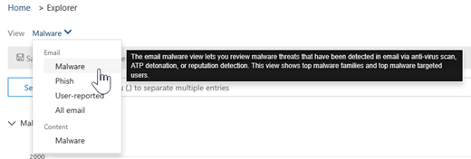

# Esplora minacce e rilevamenti in tempo realeThreat Explorer and Real-time detections

Se l'organizzazione dispone di [office 365 Advanced Threat Protection](office-365-atp.md) (Office 365 ATP) ed è necessario disporre [delle autorizzazioni necessarie](#required-licenses-and-permissions), sono disponibili **esplorazioni** o **rilevamenti in tempo reale** (in precedenza i *report in tempo reale* , [vedere What ' s New](#new-features-in-threat-explorer-and-real-time-detections)!).If your organization has [Office 365 Advanced Threat Protection](office-365-atp.md) (Office 365 ATP), and you have the [necessary permissions](#required-licenses-and-permissions), you have either **Explorer** or **Real-time detections** (formerly *Real-time reports* — [see what's new](#new-features-in-threat-explorer-and-real-time-detections)!). Nel centro sicurezza & conformità, accedere a **gestione minacce** , quindi scegliere **Esplora risorse** _o_ **rilevamenti in tempo reale** .In the Security & Compliance Center, go to **Threat management** , and then choose **Explorer** _or_ **Real-time detections** .

|Con ATP piano 2, è possibile vedere:With ATP Plan 2, you see:|Con ATP piano 1, è possibile visualizzare le informazioni seguenti:With ATP Plan 1, you see:|
|---|---|
|||
|

Con Esplora risorse (o rilevamenti in tempo reale), si dispone di un report potente che consente al team di operazioni di sicurezza di analizzare e rispondere alle minacce in modo efficace ed efficiente.With Explorer (or Real-time detections), you have a powerful report that enables your Security Operations team to investigate and respond to threats effectively and efficiently. Il report è simile all'immagine seguente:The report resembles the following image:

Con questo rapporto, è possibile:With this report, you can:

- [Vedere malware detected by Microsoft 365 Security featuresSee malware detected by Microsoft 365 security features](#see-malware-detected-in-email-by-technology)
- [Visualizzare i dati relativi agli URL di phishing e fare clic su verdettoView data about phishing URLs and click verdict](#view-data-about-phishing-urls-and-click-verdict)
- [Avviare un processo di analisi e risposta automatizzato da una visualizzazione in Explorer](#start-automated-investigation-and-response) (solo ATP piano 2)[Start an automated investigation and response process from a view in Explorer](#start-automated-investigation-and-response) (ATP Plan 2 only)
- ... [Esaminare messaggi di posta elettronica dannosi e altro ancora](#more-ways-to-use-explorer-or-real-time-detections)!... [Investigate malicious email, and more](#more-ways-to-use-explorer-or-real-time-detections)!

## Miglioramenti dell'esperienza in Esplora minacce e rilevamenti in tempo realeExperience Improvements to Threat Explorer and Real-time detections

## Tag in Esplora minacceTags in Threat Explorer

> [!NOTE]
> La funzionalità tag utente è in anteprima, non è disponibile per tutti, ed è soggetta a modifiche.The user tags feature is in Preview, isn't available to everyone, and is subject to change. Per informazioni sulla pianificazione dei rilasci, vedere la Guida di orientamento di Microsoft 365.For information about the release schedule, check out the Microsoft 365 roadmap.

I tag utente sono identificatori per gruppi di utenti specifici in Microsoft Defender per Office 365.User tags are identifiers for specific groups of users in Microsoft Defender for Office 365. Per ulteriori informazioni sui tag, sulla gestione delle licenze e sulla configurazione dei tag, leggi tutto qui: [tag utente in Office 365 ATP](user-tags.md).For more information around Tags, licensing and configuring Tags, read more here: [User tags in Office 365 ATP](user-tags.md).

In Esplora minacce, è possibile visualizzare le informazioni relative ai tag degli utenti nelle esperienze seguenti:Within Threat Explorer, you will be able to see information around User Tags in the following experiences:

#### Visualizzazione della griglia di posta elettronicaEmail Grid View

La colonna tag visualizzata nella griglia di posta elettronica conterrebbe tutti i tag che sono stati applicati alle cassette postali del mittente o del destinatario.The Tags column shown in the email grid would contain all the tags that have been applied to the sender or recipient mailboxes. Per impostazione predefinita, i tag di sistema come gli account prioritari vengono visualizzati per primo.By default, system tags like priority accounts are shown first.

> [!div class="mx-imgBorder"]
> 

#### FiltroFiltering
Sono ora disponibili tag come filtro in modo che sia possibile cercare solo tra gli account prioritari o gli scenari specifici dei tag utente (e persino escludere i risultati con alcuni tag come parte di questa esperienza).We now have Tags as a filter so you can hunt just across priority accounts, or specific User tags scenarios (and even exclude results with certain tags as part of this experience). Combinando queste informazioni con gli altri filtri che vengono forniti, è possibile limitare l'ambito delle indaginiCombining these with the multiple other filters that we provide, would help you to narrow down your scope of investigation

[ del filtro](../../media/tags-filter-normal.png#lightbox)

> [!div class="mx-imgBorder"]
> 

#### Riquadro a comparsa dettagli posta elettronicaEmail Detail Flyout
Per visualizzare i singoli tag per il mittente e il destinatario, fare clic sull'oggetto.To view the individual tags for sender and Recipient, click on the subject. Apre il riquadro a comparsa Dettagli messaggio.It opens the message details flyout. Nella scheda Riepilogo i tag del mittente e del destinatario sono visualizzati separatamente, se sono presenti per un messaggio di posta elettronica.In the summary tab, sender and recipient tags are shown separately, if they are present for an email.
Le informazioni sui singoli tag per il mittente e il destinatario, si estende anche a CSV esportato, dove è possibile visualizzare questi dettagli in 2 colonne separate.The information about individual tags for sender and Recipient, also extends to exported CSV, where you can see these details in 2 separate columns.

> [!div class="mx-imgBorder"]
> 

Le informazioni sui tag vengono inoltre visualizzate nel riquadro a comparsa clic URL.Tags information is also shown in URL clicks flyout. Per accedere all'URL facendo clic su un riquadro a comparsa, è necessario accedere a phishing o a tutte le visualizzazioni di posta elettronica e quindi alla scheda URL o clic URL. facendo clic su un singolo riquadro a comparsa URL, vengono visualizzate ulteriori informazioni sui clic relativi a tale URL e i tag associati a tale clic.To get to the URL clicks flyout, you would need to go to Phish or All Email view, and then to URLs or URL Clicks Tab. Clicking on an individual URL flyout would show more details about Clicks for that URL, and would have Tags associated with that click.

> [!div class="mx-imgBorder"]
> 

## Miglioramenti all'esperienza di caccia alle minacce (imminente)Improvements to Threat Hunting Experience (upcoming)

### Informazioni aggiornate sulle minacce per i messaggi di posta elettronicaUpdated Threat Information for Emails

Ci siamo concentrati sulla piattaforma e sui miglioramenti relativi alla qualità dei dati per aumentare l'accuratezza dei dati e la coerenza dei record.We have focused on platform and data quality improvements to increase data accuracy and consistency for email records. Questi set di aggiornamenti includono il consolidamento delle informazioni di pre-recapito e post-recapito (azione di esempio eseguita su un messaggio di posta elettronica come parte del processo ZAP) in un singolo record insieme a una ricchezza aggiunta come il verdetto di posta indesiderata, le minacce a livello di entità (ad esempio, l'URL era dannoso) e le posizioniThese set of updates includes consolidation of pre-delivery and post-delivery information (example action executed on an email as part of ZAP process) into a single record  along with added richness like Spam verdict, Entity level threats (e.g., which URL was malicious) and latest delivery locations.

Dopo questi aggiornamenti, viene visualizzata una singola voce per ogni messaggio, indipendentemente dai diversi eventi successivi al recapito che hanno avuto luogo sul messaggio.After these updates, you'll see a single entry for each message, regardless of the different post-delivery events that have taken place on the message. Le azioni possono includere ZAP, la correzione manuale (che significa azione dell'amministratore), il recapito dinamico e così via.Actions can include ZAP, Manual Remediation (which means admin action), Dynamic Delivery etc.

Oltre a mostrare minacce di malware e phishing, è ora possibile visualizzare il verdetto di posta indesiderata associato a un messaggio di posta elettronica.In addition to showing malware and phish threats, you'll now be able to see spam verdict associated with an email. All'interno del messaggio di posta elettronica, sarà possibile visualizzare tutte le minacce associate al messaggio di posta elettronica insieme alle tecnologie di rilevamento corrispondenti.Within the email, you will be able to see all the threats associated with the email along with the corresponding detection technologies. Ogni messaggio di posta elettronica può avere 0, 1 o più minacce.Each email can have 0, 1, or multiple threats. Verranno visualizzate le minacce correnti nella sezione dettagli del riquadro a comparsa del messaggio di posta elettronica.You'll see the current Threats in the Details section of the Email flyout. Inoltre, per più minacce (ad esempio, un messaggio di posta elettronica con malware e phishing), il campo tecnologia di rilevamento darebbe la Threat-Detection mapping, il che significa che la tecnologia di rilevamento ha portato all'identificazione della minaccia.Additionally, for multiple threats (e.g., an email having both Malware and Phish), Detection tech field would give the Threat-Detection mapping, meaning which detection tech led to the identification of the Threat.

L'insieme delle tecnologie di rilevamento è stato aggiornato per includere nuovi metodi di rilevamento, nonché le tecnologie di rilevamento della posta indesiderata e in tutte le diverse visualizzazioni di posta elettronica (malware, phishing, tutti i messaggi di posta elettronica), si avrà lo stesso insieme coerente di tecnologie di rilevamento per filtrare i risultati.The set of detection technologies has been updated to include new detection methods, as well as spam detection technologies, and across all the different email views (Malware, Phish, All Email), you'll have the same, consistent set of Detection technologies to filter the results.

> [!NOTE]
> L'analisi del verdetto potrebbe non essere necessariamente legata alle entità.Verdict analysis might not necessarily be tied to entities. Ad esempio, un messaggio di posta elettronica potrebbe essere classificato come phishing o posta indesiderata, ma non ci sono URL che hanno un verdetto di phishing/spam stampato su di essi.As an example, an email might be classified as Phish or Spam, but there are no URLs which have any Phish/Spam verdict stamped on them. Ciò è dovuto al fatto che i filtri valutano anche il contenuto e altri dettagli per un messaggio di posta elettronica, prima di assegnare un verdetto.This is because our filters also evaluate content and other details for an email, before assigning a verdict.

#### Minacce negli URLThreats in URLs

Nella scheda riquadro a comparsa posta elettronica-> dettagli, è ora possibile visualizzare la minaccia specifica per un URL (la minaccia per un URL può essere malware, phishing, spam o None).Within email flyout-> Details tab, you would now be able to see the specific threat for a URL (Threat for a URL can be Malware, Phish, Spam or None)

> [!div class="mx-imgBorder"]
> 

### Visualizzazione sequenza temporale aggiornata (imminente)Updated Timeline View (upcoming)

> [!div class="mx-imgBorder"]
> 

Oltre a identificare tutti gli eventi di recapito e post-recapito, la visualizzazione sequenza temporale fornisce anche informazioni sulla minaccia identificata in quel momento per un sottoinsieme di questi eventi.In addition to identifying all delivery and post-delivery events, timeline view also gives information about the Threat identified at that point of time for a subset of these events. Sono inoltre disponibili ulteriori informazioni sulle azioni aggiuntive (ad esempio, ZAP, la correzione manuale) insieme al risultato di tale azione.It also gives you more information about Additional Actions (e.g., ZAP, Manual Remediation) along with the Result of that action. La visualizzazione sequenza temporale contiene informazioni sul recapito originale e successivamente su tutti gli eventi successivi al recapito eseguiti su un messaggio di posta elettronica.Timeline view contains information about the Original delivery and subsequently any post-delivery events performed on an email.

-   Origine: può essere l'amministratore/sistema/utente in base all'origine dell'evento.Source: This can be Admin/System/user based on what was the source of the event.
-   Evento: include eventi di primo livello quali il recapito originale, la correzione manuale, lo ZAP, gli invii e il recapito dinamico.Event: This includes top-level events like Original Delivery, Manual Remediation, ZAP, Submissions, and Dynamic Delivery.
-   Azione: in questo modo viene illustrata l'azione specifica che è stata eseguita come parte di un'azione ZAP o admin (ad esempio, soft delete).Action: This covers the specific action that was taken either as part of ZAP or Admin Action (e.g., Soft Delete).
-   Minacce: copre le minacce (malware, phishing, posta indesiderata) identificate in quel momento.Threats: Covers the threats (Malware, Phish, Spam) identified at that point of time.
-   Result/Details: vengono illustrate altre informazioni sul risultato dell'azione, se è stato eseguito come parte dell'azione ZAP/admin.Result/Details: Covers more information about the Result of the Action, whether it was performed as part of ZAP/Admin Action.

### Percorso di recapito originale e più recenteOriginal and Latest Delivery location

Oggi, il percorso di recapito in superficie all'interno della griglia e-mail e del riquadro a comparsa.Today, we surface delivery Location within email grid and email flyout. In futuro, il campo percorso di recapito verrà rinominato nel percorso di recapito originale.Going forward, the Delivery Location field will be renamed to Original Delivery Location. Inoltre, è stato introdotto anche un altro campo denominato ultima posizione di recapito.Additionally, we're also introducing another field called Latest delivery location.

Il percorso di recapito originale darebbe maggiori informazioni sul luogo in cui è stato recapitato un messaggio di posta elettronica.The original delivery location would give more information about where an email was delivered initially. Il percorso di recapito più recente dovrebbe includere il percorso in cui un messaggio di posta elettronica potrebbe essere atterrato dopo azioni del sistema come ZAP o azioni amministrative come **Move to Deleted Items** .The latest delivery location would include location where an email may have landed after system actions like ZAP or admin actions like **Move to Deleted Items** . Il percorso di recapito più recente ha lo scopo di informare gli amministratori dell'ultima posizione nota del messaggio dopo il recapito o di qualsiasi azione di sistema/amministratore.Latest delivery location is intended to inform admins of the message's last known location post-delivery or any system/admin actions. In base alla progettazione, non include alcuna azione relativa all'utente finale sul messaggio di posta elettronica.By design, it doesn't include any end-user-related actions on the email. Ad esempio, se un utente elimina un messaggio o sposta il messaggio in Archive/PST, il percorso del messaggio "recapito" non verrà aggiornato.For example: if a user deletes a message or moves the message to archive/pst, the message "delivery" location will not be updated. Tuttavia, se un'azione del sistema ha aggiornato la posizione (ad esempio, ZAP risultante in un messaggio di posta elettronica che si sposta in quarantena), è possibile visualizzare il percorso di recapito più recente in quarantena.However, if a system action updated the location (e.g., ZAP resulting in an email moving to Quarantine), you would see the Latest delivery location as Quarantine.

> [!div class="mx-imgBorder"]
> 

> [!NOTE]
> Esistono alcuni casi in cui il percorso di recapito e l'azione di recapito possono mostrare ' Unknown ' come valore:There are few cases where Delivery Location and Delivery Action may show 'Unknown' as the value:
>
> - Potrebbe essere visualizzato il percorso di recapito come recapitato e il percorso di recapito come sconosciuto.You might see Delivery location as Delivered, and Delivery Location as Unknown. Questo accade quando il messaggio è stato recapitato, ma una regola di posta in arrivo ha spostato il messaggio in una cartella predefinita (bozza, archivio e così via) anziché nelle cartelle posta in arrivo o posta indesiderata.This happens when the message was delivered, but an Inbox rule moved the message to a default folder (Draft, Archive, etc.) instead of the Inbox or Junk Email folders.
>
> - Il percorso di recapito più recente può essere sconosciuto se si tenta di eseguire un'operazione di amministratore/sistema (ad esempio, ZAP, azione di amministratore), ma il messaggio non viene trovato.Latest Delivery Location can be unknown if an admin/system action (e.g., ZAP, Admin Action) is attempted, but the message isn't found. In genere, l'azione si verifica dopo lo spostamento o l'eliminazione del messaggio da parte dell'utente.Typically, the action happens after the user has moved or deleted the Message. In questi casi, verificare la colonna Result/Details nella visualizzazione sequenza temporale.In such cases, verify the Result/Details Column in timeline view. Cercare il messaggio: il messaggio è stato spostato o eliminato dall'utente.Look for the message: Message moved or deleted by the user.

> [!div class="mx-imgBorder"]
> 

### Azioni aggiuntiveAdditional Actions

Altre azioni sono costituite dalle azioni che sono state applicate dopo il recapito del messaggio di posta elettronica e possono includere ZAP, la correzione manuale (azione intrapresa da un amministratore, ad esempio, soft delete), il recapito dinamico e rielaborati (un messaggio di posta elettronica è stato rilevato con effetto retroattivo come valido).Additional Actions consist of the actions that were applied post the delivery of the Email, and can include ZAP, Manual Remediation (action taken by an Admin e.g., Soft Delete), Dynamic Delivery, and Reprocessed (an email was retroactively detected as good).

> [!NOTE]
>
> - Come parte di questa modifica, il valore rimosso da ZAP correntemente emerso nel filtro azione di recapito sta per essere eliminato.As part of this change, the Removed by ZAP value currently surfaced in the Delivery Action filter is going away. È possibile eseguire la ricerca di tutti i messaggi di posta elettronica con il tentativo ZAP tramite le azioni aggiuntive.You'll have a way to search for all email with the ZAP attempt through the Additional Actions.
>
> - Saranno disponibili nuovi campi e valori per le tecnologie di rilevamento e altre azioni, in particolare per gli scenari di ZAP.There will be new fields and values for Detection technologies and Additional actions (especially for ZAP scenarios). Valutare le query salvate esistenti e le query registrate per assicurarsi che funzionino con i nuovi valori.Evaluate your existing Saved Queries and Tracked queries to make sure they work with the new values.

> [!div class="mx-imgBorder"]
> 

### Sostituzioni del sistemaSystem overrides

Le sostituzioni di sistema sono un metodo di esecuzione di eccezioni per il percorso di recapito previsto di un messaggio, sovrascrivendo il percorso di recapito fornito dal sistema, in base alle minacce e agli altri rilevamenti identificati dallo stack di filtraggio.System overrides are a method of making exceptions to the intended delivery location of a message by overriding the delivery location provided by system (based on the threats and other detections identified by our filtering stack). È possibile impostare le sostituzioni del sistema tramite il criterio tenant o utente per recapitare il messaggio come suggerito dal criterio.System overrides can be set through tenant or user policy to deliver the message as suggested by the policy. Gli override sono utili per identificare qualsiasi recapito involontario di messaggi dannosi a causa di interruzioni di configurazioni, ad esempio un criterio mittente sicuro molto ampio impostato da un utente.Overrides are useful in identifying any unintentional delivery of malicious messages due to configurations gaps (for example, a very broad Safe Sender policy set by a user). Questi valori di sostituzione possono essere:These override values can be:

- Consentito dai criteri utente: questo è il momento in cui un utente consente domini o mittenti creando criteri a livello di cassetta postale.Allowed by user policy: This is when a user allows domains or senders by creating policies at the mailbox level.
- Bloccati dai criteri utente: questo è il momento in cui un utente blocca domini o mittenti creando criteri a livello di cassetta postale.Blocked by user policy: This is when a user blocks domains or senders by creating policies at the mailbox level.
- Consentito dai criteri org: quando i team di sicurezza dell'organizzazione hanno impostato i criteri o le regole del flusso di posta di Exchange (note anche come regole di trasporto) per consentire a mittenti e domini per gli utenti dell'organizzazione.Allowed by org policy: This is when the organization's security teams set policies or Exchange mail flow rules (also known as transport rules) to allow senders and domains for users in their organization. Può trattarsi di un gruppo di utenti o dell'intera organizzazione.This can be for a set of users or the entire organization.
- Bloccato dai criteri org: quando i team di sicurezza dell'organizzazione hanno impostato i criteri o le regole del flusso di posta per bloccare mittenti, domini, lingue dei messaggi o IP di origine per gli utenti dell'organizzazione.Blocked by org policy: This is when the organization's security teams set policies or mail flow rules to block senders, domains, message languages, or source IPs for users in their organization. Può anche essere utilizzato per un gruppo di utenti o per l'intera organizzazione.This can also be for a set of users or the entire organization.
- Estensione di file bloccata da criteri org: questo è il momento in cui l'estensione di un tipo di file viene bloccata dai team di sicurezza di un'organizzazione tramite le impostazioni dei criteri antimalware.File extension blocked by org policy: This is when a file type extension is blocked by the security teams of an organization through the anti-malware policy settings. Questi valori verranno ora visualizzati nei dettagli della posta elettronica per facilitare le indagini.These values will now be displayed in email details to help with investigations. I team di secops possono inoltre filtrare le estensioni di file bloccate utilizzando la funzionalità di filtraggio RTF.Secops teams can also filter on blocked file extensions using the rich filtering capability.

> [!div class="mx-imgBorder"]
> 

### Miglioramenti relativi all'utilizzo di URL e clicImprovements around URL and Clicks Experience

Il set di miglioramenti incentrati sui dati relativi ai clic su URL e URL include:The set of improvements focused towards URL and URL clicks data include:

 - Visualizzazione di un URL con clic completo (compresi i parametri di query che fanno parte dell'URL) nella sezione clic nel riquadro a comparsa URL.Showing full Clicked URL (including any query Parameters which are part of URL) within the Clicks Section in URL Flyout. Attualmente viene mostrato il dominio e il percorso dell'URL nella barra del titolo.Currently we show the URL domain and path in title bar. Le informazioni vengono estese per visualizzare l'URL completo.We're extending that information to show the full URL.

 - Correzioni tra i filtri URL (URL e URL, dominio e percorso URL): sono stati apportati aggiornamenti per la ricerca di messaggi che contengono un verdetto URL/clic.Fixes across URL filters (URL vs URL domain vs URL Domain and path): We've made updates around searching for messages that contain a URL/Click verdict. Come parte di ciò, è stato abilitato il supporto per le ricerche agnostiche del protocollo (ovvero è possibile cercare direttamente un URL senza http).As part of that, we've enabled support for protocol agnostic searches (meaning, you can directly search for a URL without http). Per impostazione predefinita, la ricerca URL esegue il mapping a http, a meno che non sia specificato in modo esplicito.By default, the URL search maps to http, unless explicitly specified. Ad esempio:For example:

   1. Eseguire una ricerca con e senza il `http://` prefisso nei campi "URL", "URL domain" e "URL Domain and path".Search with and without the `http://` prefix in "URL", "URL Domain", and "URL Domain and Path" filter fields. Questo comportamento è coerente e deve mostrare lo stesso risultato.This behavior is consistent, and should show the same result.

   1. Cercare il `https://` prefisso in "URL".Search for the `https://` prefix in "URL". Se non è presente, `http://` viene utilizzato il prefisso.When not present, the `http://` prefix is assumed.

   1. `/` all'inizio e alla fine del "percorso URL", "dominio URL", i campi "URL Domain and path" vengono ignorati.`/` in beginning and end of the "URL path", "URL Domain", "URL domain and path" fields is ignored. `/` alla fine del campo "URL" viene ignorato.`/` at the end of the "URL" field is ignored.

### Livello di confidenza phishingPhish Confidence Level

Il livello di sicurezza di phishing consente di identificare il grado di attendibilità, con cui un messaggio di posta elettronica è stato categorizzato come phishing.Phish confidence level helps to identify the degree of confidence, with which an email was categorized as Phish. I due valori possibili sono High e Normal.The two possible values are High and Normal. Nelle fasi iniziali, questo filtro sarà disponibile solo nella visualizzazione phishing di Esplora minacce.In the initial stages, this filter will be available only in the Phish view of Threat Explorer.

### Segnale URL ZAPZAP URL Signal

Utilizzato tipicamente per gli scenari di avviso di ZAP phishing in cui un messaggio di posta elettronica è stato identificato come phishing e rimosso dopo il recapitoTypically used for ZAP Phish Alert scenarios where an email was identified as Phish and removed after delivery. Viene utilizzato per connettere l'avviso con i risultati corrispondenti in Esplora risorse.This is used to connect the alert with the corresponding results in Explorer. Si tratta di uno dei IOCs per l'avviso.It is one of the IOCs for the alert.

Nell'ambito del miglioramento del processo di ricerca, sono stati apportati alcuni aggiornamenti a Threat Explorer e ai rilevamenti in tempo reale.As part of improving the hunting process, we have made a few updates to Threat Explorer and Real-time detections. Si tratta di miglioramenti ' Experience ', con l'obiettivo di rendere l'esperienza di caccia più coerente.These are ‘experience’ improvements, with the focus on making the hunting experience more consistent. Queste modifiche sono descritte di seguito:These changes are outlined below:

- [Miglioramenti del fuso orarioTimezone improvements](#timezone-improvements)
- [Aggiornamento nel processo di aggiornamentoUpdate in the Refresh process](#update-in-the-refresh-process)
- [Drill-down del grafico da aggiungere ai filtriChart drilldown to add to filters](#chart-drilldown-to-add-to-filters)
- [Negli aggiornamenti delle informazioni sui prodottiIn product information updates](#in-product-information-updates)

### Miglioramenti del fuso orarioTimezone improvements

Verrà visualizzato il fuso orario per i record di posta elettronica all'interno del portale, nonché per i dati esportati.You will see the timezone for the email records within the Portal, as well as for Exported data. Il fuso orario sarà visibile tra le esperienze come la griglia di posta elettronica, i dettagli a comparsa, la sequenza temporale e i messaggi di posta elettronica simili, in modo che il fuso orario del set di risultati sia chiaro per l'utente.The timezone will be visible across experiences like Email Grid, Details Flyout, Email Timeline, and Similar Emails, so that the timezone for the result set is clear to the user.

> [!div class="mx-imgBorder"]
> 

### Aggiornamento nel processo di aggiornamentoUpdate in the Refresh process

Sono stati segnalati commenti e suggerimenti relativi alla confusione con l'aggiornamento automatico (ad esempio, per la data, non appena si modifica la data, la pagina viene aggiornata) e l'aggiornamento manuale (per altri filtri).We have heard feedback around confusion with automatic refresh (e.g. for date, as soon as you change the date, the page would refresh) and manual refresh (for other filters). Analogamente, la rimozione dei filtri porta all'aggiornamento automatico, in questo modo le situazioni in cui la modifica dei diversi filtri durante la modifica della query possono causare esperienze di ricerca incoerenti.Similarly, removing filters leads to automatic refresh, this causes situations where changing the different filters while modifying the query can cause inconsistent search experiences. Per risolvere questo passaggio, si passa a un meccanismo di filtraggio manuale.To solve this, we are moving to a manual filtering mechanism.

Da un punto di vista dell'esperienza, l'utente può applicare e rimuovere i diversi filtri (dall'insieme di filtri e la data) e premere il pulsante Aggiorna per filtrare i risultati dopo aver terminato la query.From an experience standpoint, the user can apply and remove the different range of filters (from the filter set, and date), and press the refresh button to filter the results once they are done with defining the query. Il pulsante Aggiorna è stato anche aggiornato per definirlo chiaramente sullo schermo.The refresh button has also been updated to call it out clearly on the screen. Sono state aggiornate anche le descrizioni comandi e la documentazione del prodotto in questa modifica.We have also updated tooltips and in-product documentation around this change.

> [!div class="mx-imgBorder"]
> 

### Drill-down del grafico da aggiungere ai filtriChart drilldown to add to filters

Sarà ora possibile fare clic sui valori della legenda del grafico per aggiungere il valore come filtro.You will now be able to click on the chart legend values to add that value as a filter. Tenere presente che sarà comunque necessario fare clic sul pulsante Aggiorna per filtrare i risultati come parte della modifica descritta in alto.Note that you will still have to click on the refresh button to filter the results as part of the change described above.

> [!div class="mx-imgBorder"]
> 

### Negli aggiornamenti delle informazioni sui prodottiIn product information updates

È inoltre possibile visualizzare ulteriori dettagli all'interno del prodotto.You should also see additional details within the product. Ad esempio, il numero totale di risultati della ricerca all'interno della griglia (vedere di seguito), nonché i miglioramenti relativi alle etichette, ai messaggi di errore e alle descrizioni comandi, per fornire ulteriori informazioni sui filtri, l'esperienza di ricerca e il set di risultati.For example, the total number of search results within grid (see below), as well as improvements around labels, error messages and tooltips, to give more information around filters, search experience, and result set.

> [!div class="mx-imgBorder"]
> 

## Funzionalità estese in Esplora minacceExtended capabilities in Threat Explorer

### Utenti di destinazione principaliTop targeted users

Oggi viene esposto l'elenco degli utenti di destinazione principali nella visualizzazione malware per i messaggi di posta elettronica (all'interno della sezione principali famiglie di malware).Today we expose the list of the top targeted users in the Malware View for Emails (within the Top Malware Families section). Si estenderà questa visualizzazione all'interno di phishing e tutte le visualizzazioni di posta elettronica, in cui sarà possibile visualizzare i primi cinque utenti mirati insieme al numero di tentativi per ogni utente per la visualizzazione corrispondente (ad esempio, per la visualizzazione di phishing, sarà possibile visualizzare il numero di tentativi di phishing).We will be extending this view within Phish and All Email views as well, where you will be able to see the top five targeted users along with the number of attempts for each user for the corresponding view (for example, for Phish view you will be able to see the number of Phish attempts).
È inoltre possibile esportare l'elenco di utenti di destinazione fino a un massimo di 3000, oltre al numero di tentativi di analisi offline per ogni visualizzazione di posta elettronica.You will also be able to export the list of targeted users up to a limit of 3000 along with the number of attempts for offline analysis for each email view. Oltre a questo, selezionando No.In addition to that, selecting No. di tentativi (ad esempio, 13 tentativi di seguito) aprirebbe una visualizzazione filtrata in Esplora minacce, in modo da poter guardare maggiori dettagli tra i messaggi di posta elettronica e le minacce per tale utente.of attempts (for example, 13 attempts below) would open a filtered view in Threat Explorer, so that you can look at more details across emails and threats for that user.

> [!div class="mx-imgBorder"]
> 

### Regole di trasporto di ExchangeExchange transport rules
Nell'ambito dell'arricchimento dei dati, è inoltre necessario essere in grado di visualizzare tutte le diverse regole di trasporto applicate a un messaggio.As part of data enrichment, you should also be able to see all the different transport rules which were applied to a message. Queste informazioni saranno presenti all'interno della visualizzazione griglia di posta elettronica (per visualizzare questa opzione, selezionare le opzioni di colonna nella griglia e aggiungere la regola di trasporto di Exchange dalle opzioni di colonna nella griglia), nonché il riquadro a comparsa dettagli nel messaggio di posta elettronica.This information will be present within the Email grid view (to view this, select Column options in the grid and add Exchange Transport Rule from the Column options in the grid) as well as Details flyout in the email.
È possibile visualizzare sia il GUID che il nome delle regole di trasporto che sono state applicate al messaggio.You would be able to see both the GUID as well as the name of the transport rules which were applied to the message. Inoltre, è possibile cercare i messaggi utilizzando il nome della regola di trasporto.Additionally, you would be able to search for the messages using the name of the transport rule. Si tratta di una ricerca "contiene" che indica che è possibile effettuare ricerche anche utilizzando ricerche parziali.This would be a ‘Contains’ search which means you will be able to search using partial searches as well.

#### Nota importante:Important Note:
La disponibilità del nome e della ricerca di ETR dipenderà dal ruolo specifico che è stato assegnato all'utente.ETR search and name availability would depend on the specific role that has been assigned to you. Per visualizzare i nomi e la ricerca di ETR, è necessario disporre di uno dei ruoli e delle autorizzazioni seguenti.You will need to have one of the following roles/permissions in order to view the ETR names and search.  Se non si dispone di uno dei ruoli seguenti assegnati all'utente, non sarà possibile visualizzare i nomi delle regole di trasporto e cercare i messaggi utilizzando i nomi di ETR.If you do not have any of the following roles assigned to you, you will not be able to see the names of the transport rules, and search for the messages using the ETR names. Tuttavia, sarà possibile visualizzare l'etichetta di ETR e le informazioni sui GUID all'interno dei dettagli di posta elettronica.However, you will be able to see the ETR label and GUID information within the Email Details. Le altre esperienze che riguardano la visualizzazione dei record nelle griglie di posta elettronica, l'comparsa della posta elettronica, i filtri e l'esportazione non sono interessati.Your other experiences around viewing records in Email Grids, Email flyouts, Filters, and Export are not impacted.

- EXO only-prevenzione della perdita di dati: AllEXO Only - Data Loss Prevention: All
- Solo EXO-O365SupportViewConfig: AllEXO Only - O365SupportViewConfig: All
- AAD o EXO-Security admin: AllAAD or EXO - Security Admin: All
- AAD o EXO-Security Reader: tutti iAAD or EXO - Security Reader: All
- Solo EXO-regole di trasporto: tutteEXO Only - Transport Rules: All
- Configurazione solo EXO-View-Only: AllEXO Only - View-Only Configuration: All

All'interno della griglia di posta elettronica, del riquadro a comparsa dei dettagli e del CSV esportato, il ETRs viene presentato con un nome/GUID come illustrato di seguito.Within the email grid, Details flyout, and Exported CSV, the ETRs are presented with a Name/GUID as shown below.

> [!div class="mx-imgBorder"]
> 

### Connettori in ingressoInbound connectors

I connettori sono una raccolta di istruzioni che personalizzano la modalità di flusso della posta elettronica da e verso l'organizzazione Microsoft 365 o Office 365, con la possibilità di applicare eventuali restrizioni o controlli di sicurezza.Connectors are a collection of instructions that customize the way your email flows to and from your Microsoft 365 or Office 365 organization, with the ability to apply any security restriction or controls. In Esplora minacce è ora possibile visualizzare i connettori correlati a un messaggio di posta elettronica e cercare i messaggi di posta elettronica utilizzando i nomi dei connettori.Within Threat Explorer, you will now have the ability to view the connectors which are related to an email as well as search for emails using the connector names.
La ricerca dei connettori è "contiene" in natura, il che significa che le ricerche di parole chiave parziali dovrebbero funzionare anche.The search for connectors is ‘Contains’ in nature which means partial keyword searches should work as well.
All'interno della visualizzazione griglia principale, del riquadro a comparsa dei dettagli e del CSV esportato, i connettori vengono visualizzati nel formato nome/GUID, come illustrato di seguito:Within the Main grid view, the Details flyout, and the Exported CSV, the connectors are shown in the Name/GUID format as shown below:

> [!div class="mx-imgBorder"]
> 

## Nuove funzionalità in Esplora minacce e rilevamenti in tempo realeNew features in Threat Explorer and Real-time detections

Tre nuove funzionalità aggiunte in Esplora minacce e rilevamenti in tempo reale:Three new features added into Threat Explorer and Real-time detections:

- [Anteprima della posta elettronica e scaricare il corpo della posta elettronicaPreview email header and download email body](#preview-email-header-and-download-email-body)
- [Sequenza temporale della posta elettronicaEmail timeline](#email-timeline)
- [Esportare i dati di clic su URLExport URL click data](#export-url-click-data)

Queste nuove funzionalità sono descritte di seguito.These new features are outlined below.

### Anteprima della posta elettronica e scaricare il corpo della posta elettronicaPreview email header and download email body

La possibilità di visualizzare in anteprima l'intestazione di un messaggio di posta elettronica e di scaricare il corpo della posta elettronica sono nuove funzionalità disponibili in Esplora minacce.The ability to preview an email header and download the email body are new features available in Threat Explorer. Gli amministratori saranno in grado di analizzare le intestazioni o i messaggi di posta elettronica scaricati per individuare eventuali minacce.Admins will be able to analyze downloaded headers/email messages for threats. Poiché il download dei messaggi di posta elettronica può rischiare l'esposizione delle informazioni, questo processo è controllato dal controllo di accesso basato sui ruoli (RBAC).Because downloading email messages can risk the exposure of information, this process is controlled by roles-based access control (RBAC). Un nuovo ruolo, l' *Anteprima* , deve essere aggiunto a un altro gruppo di ruoli, ad esempio operazioni di sicurezza o amministratore della sicurezza, per garantire la possibilità di scaricare i messaggi di posta elettronica e visualizzare le intestazioni di anteprima in tutte le visualizzazioni.A new role, *Preview* , must be added to another role group (such as Security Operations or Security Administrator) to grant the ability to download mails and preview headers in all-email messages view.

Ma Explorer (e rilevamenti in tempo reale) aggiunge anche nuovi campi creati per fornire un'immagine più completa della posizione in cui i messaggi di posta elettronica atterrano.But Explorer (and Real-time detections) also adds fresh new fields designed to give you a more complete picture of where your email messages land. Parte dell'obiettivo di questa modifica è facilitare la ricerca per gli addetti alle operazioni di sicurezza, ma il risultato della rete è la conoscenza del percorso dei messaggi di posta elettronica problematici.Part of the goal of this change is to make hunting easier for Security Ops people, but the net result is knowing the location of problem email messages at a glance.

Come è possibile eseguire questa operazione?How is this done? Lo stato di recapito è ora suddiviso in due colonne:Delivery Status is now broken out into two columns:

- **Azione di recapito** -qual è lo stato di questo messaggio di posta elettronica?**Delivery Action** - What is the status of this email?
- **Percorso di recapito** -dove è stato instradato il messaggio di posta elettronica come risultato?**Delivery Location** - Where was this email routed as a result?

Azione di recapito è l'azione intrapresa su un messaggio di posta elettronica a causa di criteri o rilevamenti esistenti.Delivery Action is the action taken on an email due to existing policies or detections. Ecco le possibili azioni che un messaggio di posta elettronica può eseguire:Here are the possible actions an email can take:

|ConsegnatoDelivered|JunkedJunked|BloccatoBlocked|SostituitoReplaced|
|---|---|---|---|
|La posta elettronica è stata recapitata alla posta in arrivo o alla cartella di un utente e l'utente può accedervi direttamente.Email was delivered to Inbox or folder of a user and the user can directly access it.|La posta elettronica è stata inviata alla cartella posta indesiderata o alla cartella eliminata dell'utente e l'utente ha accesso ai messaggi di posta elettronica in tali cartelle.Email was sent to either user’s Junk folder or Deleted folder, and the user has access to emails in those folders.|Tutti i messaggi di posta elettronica in quarantena, che non sono riusciti o sono stati eliminati.Any emails that are quarantined, that  failed, or were dropped. Questo è completamente inaccessibile dall'utente.This is completely inaccessible by the user!|Qualsiasi messaggio di posta elettronica in cui gli allegati dannosi vengono sostituiti dai file. txt che lo stato dell'allegato è dannoso.Any email where malicious attachments are replaced by .txt files that state the attachment was malicious.|

|ConsegnatoDelivered|JunkedJunked|BloccatoBlocked|SostituitoReplaced|
|---|---|---|---|
|La posta elettronica è stata recapitata alla posta in arrivo dell'utente o a un'altra cartella e l'utente può accedervi direttamente.Email was delivered to the user's inbox or another folder, and the user can directly access it.|La posta elettronica è stata inviata alla cartella posta indesiderata o alla cartella eliminata dell'utente e l'utente ha accesso ai messaggi di posta elettronica in tali cartelle.Email was sent to either user's Junk folder or Deleted folder, and the user has access to email messages in those folders.|Tutti i messaggi di posta elettronica in quarantena, che non sono riusciti o sono stati eliminati e non sono accessibili dall'utente.Any email messages that are quarantined, that failed, or were dropped, and are not accessible by the user.|Tutti i messaggi di posta elettronica in cui gli allegati dannosi sono stati sostituiti da file txt che affermano che gli allegati sono pericolosi.Any email messages where malicious attachments were replaced by .txt files that state the attachments were malicious.|
|

Ecco cosa può essere visualizzato dall'utente e cosa non è possibile:And here is what the user can see, and what they can't:

|Accessibile per gli utenti finaliAccessible to end users|Inaccessibile per gli utenti finaliInaccessible to end users|
|---|---|
|ConsegnatoDelivered|BloccatoBlocked|
|JunkedJunked|SostituitoReplaced|

Il percorso di recapito consente di visualizzare i risultati dei criteri e i rilevamenti eseguiti dopo il recapito.Delivery location shows the results of policies and detections that run post-delivery. È collegato a un'azione di recapito.It's linked to a Delivery Action. Questo campo è stato aggiunto per fornire informazioni dettagliate sull'azione intrapresa quando viene trovata una posta elettronica problematica.This field was added to give insight into the action taken when a problem mail is found. Di seguito sono riportati i possibili valori del percorso di recapito:Here are the possible values of delivery location:

- **Posta in arrivo o cartella** : la posta elettronica è in posta in arrivo o in una cartella (in base alle regole di posta elettronica).**Inbox or folder** : The email is in inbox or a folder (according to your email rules).
- **On-Prem o External** : la cassetta postale non esiste sul cloud ma è in locale.**On-prem or external** : The mailbox doesn't exist on cloud but is on-premises.
- **Cartella posta indesiderata** : l'indirizzo di posta elettronica si trova nella cartella Junk di un utente.**Junk folder** : The email is in the Junk folder of a user.
- **Cartella Posta eliminata** : il messaggio nella cartella elementi eliminati di un utente.**Deleted items folder** : The email in the Deleted items folder of a user.
- **Quarantine** : l'indirizzo di posta elettronica in quarantena e non è incluso nella cassetta postale di un utente.**Quarantine** : The email in quarantine, and is not in a user's mailbox.
- **Errore** : il messaggio di posta elettronica non è riuscito a raggiungere la cassetta postale.**Failed** : The email failed to reach the mailbox.
- **Eliminato** : il messaggio di posta elettronica viene perso da qualche parte nel flusso di posta.**Dropped** : The email gets lost somewhere in the mail flow.

### Sequenza temporale della posta elettronicaEmail timeline

La **cronologia della posta elettronica** è un'altra funzionalità di Esplora risorse che consente di migliorare l'esperienza di ricerca per gli amministratori.The **Email Timeline** is another new Explorer feature aimed at making the hunting experience better for admins. La randomizzazione viene ridotta perché è necessario meno tempo per controllare posizioni diverse per cercare di comprendere l'evento.It cuts down on randomization because there is less time spent checking different locations to try to understand the event. Quando più eventi si verificano in un messaggio di posta elettronica o vicino allo stesso tempo, gli eventi vengono visualizzati in una visualizzazione sequenza temporale.When multiple events happen at, or close to, the same time on an email, those events will show up in a timeline view. In effetti, alcuni eventi che si verificano dopo il recapito alla posta verranno acquisiti nella colonna ' Special Action '.In fact, some events that happen post-delivery to your mail will be captured in the 'Special action' column. La combinazione delle informazioni dalla sequenza temporale di quella posta con l'azione speciale intrapresa sul post-recapito della posta darà agli amministratori informazioni su come funzionano i propri criteri, in cui la posta è stata definitivamente instradata e, in alcuni casi, qual è stata la valutazione finale.Combining the information from the timeline of that mail with the special action taken on the mail post-delivery will give admins insight into how their policies work, where the mail was finally routed, and, in some cases, what the final assessment was.

Per ulteriori informazioni sull'analisi dei messaggi di posta elettronica dannosi, vedere [indagare e correggere il messaggio di posta elettronica dannoso che è stato recapitato in Office 365](investigate-malicious-email-that-was-delivered.md).For more discussion about investigating malicious email messages, see [Investigate and remediate malicious email that was delivered in Office 365](investigate-malicious-email-that-was-delivered.md).

### Esportare i dati di clic su URLExport URL click data

Sarà inoltre possibile esportare i report per i clic URL in Microsoft Excel per visualizzare sia l'ID del messaggio di rete, sia il loro verdetto di clic, in cui è possibile capire dove è stato creato il traffico dell'URL.Also, you will now be able to export reports for URL clicks to Microsoft Excel in order to view both their Network Message ID, and their Click Verdict, making the task of understanding where your URL click traffic originated easier. Ecco come funziona.Here's how it works. A partire da Threat Management sulla barra di avvio veloce di Office 365, fare clic su questa catena:Starting in Threat Management on the Office 365 quick-launch, click through this chain:

**Gestione risorse** \> **Visualizzazione phishing** \> **Clic su** \> URL **principali o clic** \> principali per gli URL **Fare clic su qualsiasi record per aprire il riquadro a comparsa URL****Explorer** \> **View Phish** \> **Clicks** \> **Top URLs or URL Top Clicks** \> **Click on any record to open URL flyout**

Quando si fa clic su un URL nell'elenco, verrà visualizzato un nuovo pulsante Esporta nel riquadro di volo.When you click on a URL in the list, you'll see a new Export button on the fly-out panel. Utilizzare questo pulsante per spostare i dati in un foglio di calcolo di Excel per semplificare la creazione di report.Use this button to move data to an Excel spreadsheet for easier reporting.

È possibile accedere allo stesso percorso nel rapporto rilevamenti in tempo reale, come indicato di seguito:You can get to the same location in the Real-time detections report as follows:

**Gestione risorse** \> Rilevamenti in tempo **reale** \> **Visualizzazione phishing** \> **URL** \> **URL principali o clic principali** \> **Fare clic su qualsiasi record per aprire il riquadro a comparsa URL** \> **Passare alla scheda clic.****Explorer** \> **Real-time detections** \> **View Phish** \> **URLs** \> **Top URLs or Top Clicks** \> **Click on any record to open URL flyout** \> **Navigate to the Clicks Tab.**

> [!TIP]
> ID messaggio di rete mappare il clic di nuovo su mail specifiche quando si esegue una ricerca tramite Explorer o gli strumenti di terze parti associati tramite ID messaggio di rete.Network Message ID maps the click back to specific mails when you search through Explorer or associated third-party tools via Network Message ID. La ricerca nell'ID messaggio di rete fornirà agli amministratori la posta elettronica specifica associata a un risultato di clic.Searching through the Network Message ID will give admins the specific email associated with a click result. All'esportazione, l'identificazione correlata dell'ID messaggio di rete rende più rapida e più potente l'analisi.On export, having the correlating identification of Network Message ID makes for quicker and more powerful analysis.

> [!div class="mx-imgBorder"]
> 

## Vedere malware rilevato in posta elettronica dalla tecnologiaSee malware detected in email by technology

Si supponga di voler vedere malware rilevato nella posta elettronica, tramite la tecnologia Microsoft 365.Suppose you want to see malware detected in email, by Microsoft 365 technology. A tale scopo, utilizzare la visualizzazione [posta elettronica > malware](threat-explorer-views.md#email--malware) di Esplora risorse (o rilevamenti in tempo reale).To do this, use the [Email > Malware](threat-explorer-views.md#email--malware) view of Explorer (or Real-time detections).

1. Nel centro sicurezza & conformità ( [https://protection.office.com](https://protection.office.com) ), scegliere **gestione minacce**  >  **Explorer** (o **rilevamenti in tempo reale** ).In the Security & Compliance Center ( [https://protection.office.com](https://protection.office.com)), choose **Threat management** > **Explorer** (or **Real-time detections** ). In questo esempio viene utilizzato Esplora.(This example uses Explorer.)

2. Scegliere malware **tramite posta elettronica** dal menu **Visualizza**  >  **Malware** .In the **View** menu, choose **Email** > **Malware** .

   > [!div class="mx-imgBorder"]
   > 

3. Fare clic su **mittente** e quindi scegliere tecnologia di rilevamento di **base**  >  **Detection technology** .Click **Sender** , and then choose **Basic** > **Detection technology** .

   Le tecnologie di rilevamento sono ora disponibili come filtri per il report.Your detection technologies are now available as filters for the report.

   > [!div class="mx-imgBorder"]
   > 

4. Selezionare un'opzione e quindi fare clic sul pulsante **Aggiorna** per applicare il filtro.Select an option, and then click the **Refresh** button to apply that filter.

   > [!div class="mx-imgBorder"]
   > 

Il rapporto viene aggiornato per visualizzare i risultati rilevati dal malware nella posta elettronica, utilizzando l'opzione di tecnologia selezionata.The report refreshes to show the results malware detected in email, using the technology option you selected. Da qui, è possibile eseguire un'ulteriore analisi.From here, you can conduct further analysis.

## Visualizzare i dati relativi agli URL di phishing e fare clic su verdettoView data about phishing URLs and click verdict

Si supponga di voler visualizzare i tentativi di phishing tramite URL nella posta elettronica, incluso un elenco di URL consentiti, bloccati e ignorati.Suppose that you want to see phishing attempts through URLs in email, including a list of URLs that were allowed, blocked, and overridden. L'identificazione degli URL che sono stati cliccati richiede la configurazione di [collegamenti sicuri](atp-safe-links.md) .Identifying URLs that were clicked requires [Safe Links](atp-safe-links.md) to be configured. Assicurarsi di aver configurato i criteri per i [collegamenti sicuri](set-up-atp-safe-links-policies.md) per la protezione e la registrazione di un clic con i collegamenti sicuri per il tempo di clic.Make sure that you have set up [Safe Links policies](set-up-atp-safe-links-policies.md) for time-of-click protection and logging of click verdicts by Safe Links.

Per esaminare gli URL di phishing nei messaggi e fare clic su URL nei messaggi di phishing, utilizzare la visualizzazione di [posta elettronica > phishing](threat-explorer-views.md#email--phish) di Esplora risorse (o rilevamenti in tempo reale).To review phish URLs in messages and clicks on URLs in phish messages, use the [Email > Phish](threat-explorer-views.md#email--phish) view of Explorer (or Real-time detections).

1. Nel centro sicurezza & conformità ( [https://protection.office.com](https://protection.office.com) ), scegliere **gestione minacce**  >  **Explorer** (o **rilevamenti in tempo reale** ).In the Security & Compliance Center ( [https://protection.office.com](https://protection.office.com)), choose **Threat management** > **Explorer** (or **Real-time detections** ). In questo esempio viene utilizzato Esplora.(This example uses Explorer.)

2. Nel menu **Visualizza** scegliere **posta elettronica**  >  **phishing** .In the **View** menu, choose **Email** > **Phish** .

   > [!div class="mx-imgBorder"]
   > 

3. Fare clic su **sender** e quindi scegliere **urls**  >  **Click verdict** .Click **Sender** , and then choose **URLs** > **Click verdict** .

4. Selezionare una o più opzioni, ad esempio **bloccate** e **bloccate** , e quindi fare clic sul pulsante **Aggiorna** che si trova nella stessa riga delle opzioni per applicare il filtro.Select one or more options, such as **Blocked** and **Block overridden** , and then click the **Refresh** button that is on the same line as the options to apply that filter. (Non aggiornare la finestra del browser.)(Don't refresh your browser window.)

   > [!div class="mx-imgBorder"]
   > 

   Il rapporto viene aggiornato per visualizzare due diverse tabelle URL nella scheda URL del rapporto:The report refreshes to show two different URL tables on the URL tab under the report:

   - Gli URL **principali** sono gli URL contenuti nei messaggi che sono stati filtrati fino a e l'azione di recapito della posta elettronica conta per ogni URL.**Top URLs** are the URLs contained in the messages you have filtered down to, and the email delivery action counts for each URL. Nella visualizzazione posta elettronica di phishing, in genere l'elenco conterrà URL legittimi.In the phish email view, this list typically will contain legitimate URLs. I pirati informatici includono una combinazione di URL buoni e cattivi nei messaggi per cercare di farli recapitare, ma renderà i collegamenti dannosi più interessanti per l'utente da fare clic su.Attackers include a mix of good and bad URLs in their messages to try to get them delivered, but they will make the malicious links more interesting for the user to click. La tabella degli URL è ordinata in base al numero totale di messaggi di posta elettronica (ma si noti che questa colonna è nascosta per semplificare la visualizzazione).The table of URLs is sorted by total email count (but note that this column is hidden to simplify the view).

   - I **clic principali** sono gli URL con collegamenti sicuri che sono stati selezionati, ordinati in base al numero di clic totale (la colonna non viene visualizzata per semplificare la visualizzazione).**Top clicks** are the Safe Links wrapped URLs that were clicked, sorted by total click count (this column is also not shown to simplify the view). Numeri totali per colonna indicano i collegamenti sicuri fare clic su conteggio verdetto per ogni URL selezionato.Total counts by column indicate the Safe Links click verdict count for each clicked URL. Nella visualizzazione posta elettronica di phishing, si tratta di URL più spesso sospetti o maligni, ma possono includere URL che non sono minacce, ma che sono presenti nei messaggi di phishing.In the phish email view, these are more often suspicious or malicious URLs, but could include URLs that are not threats but are in phish messages. Gli URL che fanno clic su collegamenti non spostati non verranno visualizzati qui.URL clicks on unwrapped links will not show up here.

   Le due tabelle degli URL visualizzano gli URL principali nei messaggi di posta elettronica di phishing tramite l'azione e la posizione di recapito e visualizzano gli URL che sono stati bloccati (o visitati nonostante un avviso), in modo da poter capire quali potenziali collegamenti non validi sono stati ricevuti dagli utenti e interagito con gli utenti.The two URL tables show top URLs in phishing email messages by delivery action and location, and they show URL clicks that were blocked (or visited despite a warning) so that you can understand what potential bad links were received by users and interacted with by users. Da qui, è possibile eseguire un'ulteriore analisi.From here, you can conduct further analysis. Ad esempio, al di sotto del grafico, è possibile visualizzare gli URL principali nei messaggi di posta elettronica bloccati nell'ambiente dell'organizzazione.For example, below the chart, you can see the top URLs in email messages that were blocked in your organization's environment.

   > [!div class="mx-imgBorder"]
   > 

   Selezionare un URL per visualizzare informazioni più dettagliate.Select a URL to view more detailed information.

   > [!NOTE]
   > Nella finestra di dialogo a comparsa URL, il filtro dei messaggi di posta elettronica viene rimosso per visualizzare la visualizzazione completa dell'esposizione dell'URL nell'ambiente in uso.In the URL flyout dialog, the filtering on email messages is removed to show you the full view of the URL's exposure in your environment. In questo modo è possibile filtrare i messaggi di posta elettronica in Esplora per quelli che si sono preoccupati, individuare URL specifici che sono potenziali minacce e quindi espandere la propria comprensione dell'esposizione all'URL nell'ambiente (tramite la finestra di dialogo Dettagli URL) senza dover aggiungere filtri URL alla visualizzazione Esplora risorse.This lets you filter down email messages in Explorer to ones you are concerned about, find specific URLs that are potential threats, then expand your understanding of the URL exposure in your environment (via the URL details dialog) without having to add URL filters to the Explorer view itself.

### Interpretazione delle diverse sentenze di clicInterpretation of different click verdicts

All'interno di comparsa di posta elettronica o URL, clic principali e all'interno delle nostre esperienze di filtraggio, verranno visualizzati diversi valori di clic come parte dell'esperienza di caccia.Within the Email or URL flyouts, Top Clicks as well as within our filtering experiences, you will see different click values as part of your hunting experience. Di seguito sono riportati i valori possibili di clic verdetti e la loro interpretazione:Below are the possible values of Click Verdicts and their interpretation:

- **None** : non è stato possibile acquisire il verdetto per l'URL.**None** : We were unable to capture the verdict for the URL. È possibile che l'utente abbia fatto clic su di esso tramite l'URL.The user might have clicked through the URL.
- **Consentito** : all'utente è stato consentito di passare all'URL.**Allowed** : The user was allowed to navigate to the URL.
- **Bloccato** : l'utente è stato bloccato dall'esplorazione all'URL.**Blocked** : The User was blocked from navigating to the URL.
- **Verdetto in sospeso** : l'utente è stato presentato con la pagina di detonazione in sospeso.**Pending verdict** : The user was presented with the detonation pending page.
- **Bloccato sottoposto a override** : l'utente è stato bloccato dall'esplorazione all'URL. Tuttavia, l'utente ha scavalcato il blocco per passare all'URL.**Blocked overridden** : The user was blocked from navigating to the URL; however, the user overrode the block to navigate to the URL.
- **Verdetto in sospeso bypassato** : l'utente è stato presentato con la pagina di detonazione; Tuttavia, l'utente ha ripercorso la pagina per passare all'URL.**Pending verdict bypassed** : The user was presented with the detonation page; however, the user overrode the page to navigate to the URL.
- **Errore** : l'utente è stato presentato con la pagina di errore.**Error** : The user was presented with the error page. Questo può anche significare che si è verificato un errore nell'acquisizione del verdetto.This can also mean there was an error in capturing the verdict.
- **Errore** : si è verificato l'eccezione sconosciuta durante l'acquisizione del verdetto.**Failure** : There was unknown exception while capturing the verdict. È possibile che l'utente abbia fatto clic su di esso tramite l'URL.The user might have clicked through the URL.

## Esaminare i messaggi di posta elettronica segnalati dagli utentiReview email messages reported by users

Si supponga di voler visualizzare i messaggi di posta elettronica che gli utenti dell'organizzazione hanno segnalato come posta indesiderata, non indesiderata o phishing tramite il [componente aggiuntivo per Outlook e Outlook sul Web](enable-the-report-message-add-in.md).Suppose that you want to see email messages that users in your organization have reported as Junk, Not Junk, or Phishing by using the [Report Message add-in for Outlook and Outlook on the web](enable-the-report-message-add-in.md). A tale scopo, utilizzare la visualizzazione [> invii di posta elettronica](threat-explorer-views.md#email--submissions) di Esplora risorse (o rilevamenti in tempo reale).To do this, use the [Email > Submissions](threat-explorer-views.md#email--submissions) view of Explorer (or Real-time detections).

1. Nel centro sicurezza & conformità ( [https://protection.office.com](https://protection.office.com) ), scegliere **gestione minacce**  >  **Explorer** (o **rilevamenti in tempo reale** ).In the Security & Compliance Center ( [https://protection.office.com](https://protection.office.com)), choose **Threat management** > **Explorer** (or **Real-time detections** ). In questo esempio viene utilizzato Esplora.(This example uses Explorer.)

2. Scegliere **invii di posta elettronica** dal menu **Visualizza**  >  **Submissions** .In the **View** menu, choose **Email** > **Submissions** .

   > [!div class="mx-imgBorder"]
   > 

3. Fare clic su **mittente** e quindi scegliere tipo di report di **base**  >  **Report type** .Click **Sender** , and then choose **Basic** > **Report type** .

4. Selezionare un'opzione, ad esempio **phishing** , e quindi fare clic sul pulsante **Aggiorna** .Select an option, such as **Phish** , and then click the **Refresh** button.

   > [!div class="mx-imgBorder"]
   > 

Il rapporto viene aggiornato per visualizzare i dati relativi ai messaggi di posta elettronica che gli utenti dell'organizzazione hanno segnalato come tentativo di phishing.The report refreshes to show data about email messages that people in your organization have reported as a phishing attempt. È possibile utilizzare queste informazioni per eseguire un'ulteriore analisi e, se necessario, regolare i [criteri di anti-phishing ATP](configure-atp-anti-phishing-policies.md).You can use this information to conduct further analysis, and if necessary, adjust your [ATP anti-phishing policies](configure-atp-anti-phishing-policies.md).

## Avviare l'analisi e la risposta automatizzataStart automated investigation and response

> [!NOTE]
> Le funzionalità di ricerca e risposta automatizzate sono disponibili in **office 365 ATP piano 2** e **Office 365 E5** .Automated investigation and response capabilities are available in **Office 365 ATP Plan 2** and **Office 365 E5** .

(Nuovo!) L' [analisi e la risposta automatizzate](automated-investigation-response-office.md) sono in grado di salvare il team delle operazioni di sicurezza molto tempo ed energie nell'analisi e nell'attenuazione di attacchi cibernetici.(NEW!) [Automated investigation and response](automated-investigation-response-office.md) can save your security operations team much time and effort in investigating and mitigating cyberattacks. Oltre a configurare gli avvisi che possono attivare un PlayBook per la sicurezza, è possibile avviare un processo di analisi e risposta automatizzato da una visualizzazione di Esplora risorse.In addition to configuring alerts that can trigger a security playbook, you can start an automated investigation and response process from a view in Explorer.

Per ulteriori informazioni, vedere [esempio: un amministratore della sicurezza attiva un'analisi da Esplora risorse](automated-investigation-response-office.md#example-a-security-administrator-triggers-an-investigation-from-threat-explorer).For details on this, see [Example: A security administrator triggers an investigation from Explorer](automated-investigation-response-office.md#example-a-security-administrator-triggers-an-investigation-from-threat-explorer).

## Altre modalità di utilizzo di Esplora risorse (o rilevamenti in tempo reale)More ways to use Explorer (or Real-time detections)

Oltre agli scenari descritti in questo articolo, sono disponibili molte altre opzioni per la creazione di report con Esplora risorse (o rilevamenti in tempo reale).In addition to the scenarios outlined in this article, you have many more reporting options available with Explorer (or Real-time detections).

- [Identificare e analizzare i messaggi di posta elettronica dannosi recapitatiFind and investigate malicious email that was delivered](investigate-malicious-email-that-was-delivered.md)
- [Visualizzare i file dannosi rilevati in SharePoint Online, OneDrive e Microsoft TeamsView malicious files detected in SharePoint Online, OneDrive, and Microsoft Teams](malicious-files-detected-in-spo-odb-or-teams.md)
- [Ottenere una panoramica delle visualizzazioni in Esplora minacce (e rilevamenti in tempo reale)Get an overview of the views in Threat Explorer (and Real-time detections)](threat-explorer-views.md)
- [Report dello stato di protezione dalle minacceThreat protection status report](view-email-security-reports.md#threat-protection-status-report)
- [Indagine e reazione automatizzate in Microsoft Threat ProtectionAutomated investigation and response in Microsoft Threat Protection](https://docs.microsoft.com/microsoft-365/security/mtp/mtp-autoir)

## Licenze e autorizzazioni obbligatorieRequired licenses and permissions

È necessario disporre di [Office 365 ATP](office-365-atp.md) per ottenere rilevamenti di Esplora risorse o in tempo reale.You must have [Office 365 ATP](office-365-atp.md) to get Explorer or Real-time detections.

- Explorer è incluso in Office 365 ATP piano 2.Explorer is included in Office 365 ATP Plan 2.
- Il rapporto sui rilevamenti in tempo reale è incluso in Office 365 ATP Plan 1.The Real-time detections report is included in Office 365 ATP Plan 1.
- Pianificare l'assegnazione delle licenze per tutti gli utenti che devono essere protetti da Office 365 ATP.Plan to assign licenses for all users who should be protected by Office 365 ATP. (Esplora risorse o rilevamenti in tempo reale mostrano i dati di rilevamento per gli utenti con licenza).(Explorer or Real-time detections shows detection data for licensed users.)

Per visualizzare e utilizzare esplorazioni o rilevamenti in tempo reale, è necessario disporre delle autorizzazioni appropriate, ad esempio quelle concesse a un amministratore della sicurezza o a un lettore di sicurezza.To view and use Explorer or Real-time detections, you must have appropriate permissions, such as those granted to a security administrator or security reader.

- Per il &amp; Centro sicurezza e conformità, è necessario che sia assegnato uno dei ruoli seguenti:For the Security &amp; Compliance Center, you must have one of the following roles assigned:

  - Gestione organizzazioneOrganization Management
  - Amministratore della sicurezza (è possibile assegnarlo nell'interfaccia di amministrazione di Azure Active Directory ( [https://aad.portal.azure.com](https://aad.portal.azure.com) ))Security Administrator (this can be assigned in the Azure Active Directory admin center ([https://aad.portal.azure.com](https://aad.portal.azure.com)))
  - Ruolo con autorizzazioni di lettura per la sicurezzaSecurity Reader

- Per Exchange Online, è necessario che sia assegnato uno dei ruoli seguenti nell'interfaccia di amministrazione di Exchange ( [https://outlook.office365.com/ecp](https://outlook.office365.com/ecp) ) o con i cmdlet di PowerShell (vedere [Exchange Online PowerShell](https://docs.microsoft.com/powershell/exchange/exchange-online-powershell)):For Exchange Online, you must have one of the following roles assigned in either the Exchange admin center ([https://outlook.office365.com/ecp](https://outlook.office365.com/ecp)) or with PowerShell cmdlets (See [Exchange Online PowerShell](https://docs.microsoft.com/powershell/exchange/exchange-online-powershell)):

  - Gestione organizzazioneOrganization Management
  - Gestione organizzazione in sola visualizzazioneView-only Organization Management
  - Ruolo Destinatari di sola letturaView-Only Recipients role
  - Gestione della conformitàCompliance Management

Per ulteriori informazioni sui ruoli e sulle autorizzazioni, vedere le risorse seguenti:To learn more about roles and permissions, see the following resources:

- [Autorizzazioni nel centro sicurezza e &amp; conformitàPermissions in the Security &amp; Compliance Center](permissions-in-the-security-and-compliance-center.md)
- [Autorizzazioni funzionalità in Exchange OnlineFeature permissions in Exchange Online](https://docs.microsoft.com/exchange/permissions-exo/feature-permissions)

## Alcune differenze tra Esplora minacce e rilevamenti in tempo realeSome differences between Threat Explorer and Real-time detections

- Il rapporto sui **rilevamenti in tempo reale** è disponibile in Office 365 ATP Plan 1, mentre l' **esploratore di minacce** è disponibile in Office 365 ATP piano 2.The **Real-time detections** report is available in Office 365 ATP Plan 1, whereas **Threat Explorer** is available in Office 365 ATP Plan 2.
- Il rapporto sui **rilevamenti in tempo reale** consente di visualizzare i rilevamenti in tempo reale.The **Real-time detections** report allows you to view detections in real-time. **Threat Explorer** Anche questo consente di visualizzare ulteriori dettagli relativi a un determinato attacco.**Threat Explorer** does this as well, but also allows you to view additional details for a given attack.
- La visualizzazione di **tutti i messaggi di posta elettronica** è disponibile in **Esplora minacce** (e non è presente nel rapporto **rilevamenti in tempo reale** ).An **All email** view is available in **Threat Explorer** (and is not in the **Real-time detections** report).
- Altre funzionalità di filtro e le azioni disponibili sono incluse in **Esplora minacce** .More filtering capabilities and available actions are included in **Threat Explorer** .

Per ulteriori informazioni, vedere [Descrizione del servizio ATP di Office 365: disponibilità delle funzionalità tra i piani di Advanced Threat Protection (ATP)](https://docs.microsoft.com/office365/servicedescriptions/office-365-advanced-threat-protection-service-description#feature-availability-across-advanced-threat-protection-atp-plans).For more details, see [Office 365 ATP Service Description: Feature availability across Advanced Threat Protection (ATP) plans](https://docs.microsoft.com/office365/servicedescriptions/office-365-advanced-threat-protection-service-description#feature-availability-across-advanced-threat-protection-atp-plans).
