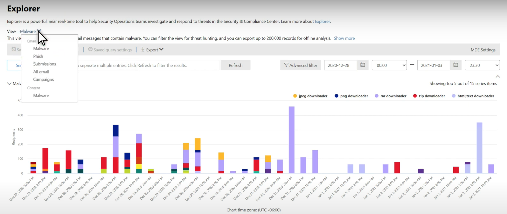
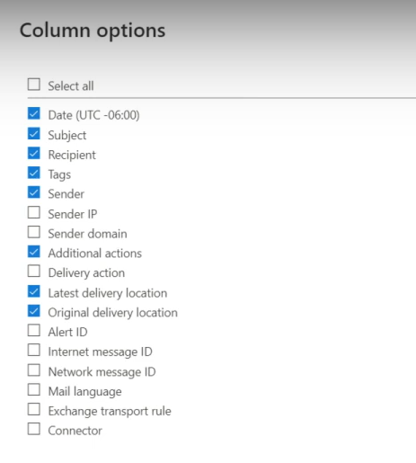

# Ricerca delle minacce in Threat Explorer per Microsoft Defender per Office 365

Contenuto dell'articolo:

- [Analisi di Threat Explorer](#threat-explorer-walk-through)
- [Analisi della posta elettronica](#email-investigation)
- [Correzione della posta elettronica](#email-remediation)
- [Miglioramenti all'esperienza di ricerca delle minacce](#improvements-to-threat-hunting-experience)

> [!NOTE]
> Questo articolo fa parte di una serie di **3** articoli su **Threat Explorer (Explorer),** sicurezza della posta elettronica e informazioni di base su **Explorer** e sui rilevamenti in tempo reale (ad esempio le differenze tra gli strumenti e le autorizzazioni necessarie per operare).  Gli altri due articoli di questa serie sono sicurezza della posta elettronica [con Threat Explorer](email-security-in-microsoft-defender.md) e Threat Explorer e nozioni di base sui [rilevamenti in tempo reale.](real-time-detections.md)

**Si applica a**
- [Microsoft Defender per Office 365 piano 1 e piano 2](defender-for-office-365.md)
- [Microsoft 365 Defender](../defender/microsoft-365-defender.md)

Se l'organizzazione dispone di [Microsoft Defender per Office 365](defender-for-office-365.md)e si dispone  delle autorizzazioni [,](#required-licenses-and-permissions)è possibile utilizzare **Esplora** risorse o rilevamenti in tempo reale per rilevare e correggere le minacce. 

Nel **Centro sicurezza & conformità** passare a **Gestione** delle minacce e quindi scegliere **Esplora risorse**  o **Rilevamenti in tempo reale.**

 

****

|Con Microsoft Defender per Office 365 Piano 2, viene visualizzato:|Con Microsoft Defender per Office 365 piano 1, viene visualizzato:|
|---|---|
|||
|

Con questi strumenti è possibile:

- Vedere malware rilevato dalle Microsoft 365 di sicurezza
- Visualizzare l'URL di phishing e fare clic su Dati verdetto
- Avviare un processo di indagine e risposta automatizzato da una visualizzazione in Esplora risorse
- Analizzare la posta elettronica dannosa e altro ancora

Per altre informazioni, vedi [Sicurezza della posta elettronica con Threat Explorer.](email-security-in-microsoft-defender.md) 

## Analisi di Threat Explorer

In Microsoft Defender per Office 365, sono disponibili due piani di sottoscrizione: Piano 1 e Piano 2. Gli strumenti di ricerca delle minacce gestiti manualmente esistono in entrambi i piani, con nomi diversi e con funzionalità diverse.

Defender per Office 365 Piano 1 usa i rilevamenti in tempo *reale,* che è un sottoinsieme dello strumento di ricerca *Threat Explorer* (denominato anche *Explorer)* nel Piano 2. In questa serie di articoli, la maggior parte degli esempi è stata creata usando l'intero Threat Explorer. Gli amministratori devono testare i passaggi nei rilevamenti in tempo reale per vedere dove si applicano.

Per aprire lo strumento Esplora risorse, passare **a Sicurezza &** Centro conformità Gestione minacce  >    >   (o **rilevamenti in tempo reale).** Per impostazione predefinita, arriverai nella pagina **Malware,** ma usa l'elenco a discesa **Visualizza** per acquisire familiarità con le opzioni. Se stai cercando Phish o stai scavando in una campagna di minacce, scegli queste visualizzazioni.

> [!div class="mx-imgBorder"]
> 

Una volta che un utente delle operazioni di sicurezza (Sec Ops) seleziona i dati che desidera visualizzare, se l'ambito  è ristretto come invii utente o una visualizzazione più ampia, come Tutti i messaggi di posta **elettronica,** può utilizzare il pulsante Mittente per filtrare ulteriormente. Ricordarsi di selezionare Aggiorna per completare le azioni di filtro.

> [!div class="mx-imgBorder"]
> 

La perfezione dello stato attivo in Esplora risorse o il rilevamento in tempo reale può essere pensata nei livelli. Il primo è **View.** Il secondo può essere pensato come uno *stato attivo filtrato.* Ad esempio, puoi ripercorrere i passaggi che hai fatto per trovare una minaccia registrando le tue decisioni come questa: Per trovare il problema in Esplora risorse, ho scelto la visualizzazione **Malware** con un filtro destinatario attivo. In questo modo è più semplice eseguire nuovamente i passaggi.

> [!TIP]
> Se Sec Ops usa **Tag** per contrassegnare gli account che considerano obiettivi di valore elevato, possono effettuare selezioni come Visualizzazione phish con lo stato attivo del filtro Tag (includere un intervallo di date se *usato).* Questo mostrerà loro eventuali tentativi di phishing indirizzati ai loro obiettivi utente di alto valore durante un intervallo di tempo (ad esempio date in cui determinati attacchi di phishing stanno avvenendo molto per il loro settore). 

I criteri di affinamento possono essere evasi in intervalli di date utilizzando i controlli dell'intervallo di date. Qui puoi vedere Esplora risorse nella visualizzazione **Malware,** con lo stato attivo del filtro **Tecnologia** di rilevamento. Ma è il pulsante **Filtro avanzato** che consente ai team sec ops di scavare in profondità. 

> [!div class="mx-imgBorder"]
> 

Se si **fa clic sul** filtro Avanzato, viene visualizzato un pannello che consente ai cacciatori sec ops di creare query in modo che includano o escludono le informazioni necessarie. Sia il grafico che la tabella nella pagina Esplora risorse rifletteranno i risultati. 

> [!div class="mx-imgBorder"]
> 

Utilizzare il **pulsante Opzioni** colonna per ottenere il tipo di informazioni sulla tabella più utili: 

> [!div class="mx-imgBorder"]
> 

> [!div class="mx-imgBorder"]
> 

Nello stesso ambiente, assicurati di testare le opzioni di visualizzazione. Gruppi di destinatari diversi reagiscono bene alle diverse presentazioni degli stessi dati. Per alcuni visualizzatori, la mappa **Email Origins** può mostrare che  una minaccia è diffusa o discreta più rapidamente rispetto all'opzione Visualizzazione campagna accanto ad essa. Sec Ops può usare questi display per fare al meglio punti che sottolineano la necessità di sicurezza e protezione o per un confronto successivo, per dimostrare l'efficacia delle loro azioni. 

> [!div class="mx-imgBorder"]
> 

> [!div class="mx-imgBorder"]
> 

### Analisi della posta elettronica

Quando viene visualizzato un messaggio di posta elettronica sospetto, fare clic sul nome per espandere il riquadro a comparsa a destra. In questo caso, è disponibile il banner che consente a Sec Ops di visualizzare la [pagina dell'entità di posta](mdo-email-entity-page.md) elettronica.

La pagina dell'entità di posta elettronica riunisce il contenuto disponibile **in** **Dettagli,** **Allegati,** Dispositivi, ma include dati più organizzati. Sono inclusi elementi come i risultati DMARC, la visualizzazione in testo normale dell'intestazione del messaggio di posta elettronica con un'opzione di copia, le informazioni di verdetto sugli allegati detonati in modo sicuro e i file eliminati da tali detonazioni (possono includere indirizzi IP contattati e screenshot di pagine o file). Anche gli URL e i loro verdetti sono elencati con dettagli simili segnalati. 

Quando si raggiunge questa fase, la pagina dell'entità di posta elettronica sarà fondamentale per il passaggio finale,*ovvero la correzione.* 

> [!div class="mx-imgBorder"]
> 

> [!TIP]
> Per ulteriori informazioni sulla pagina dell'entità di posta elettronica completa (visualizzata di seguito nella scheda **Analisi),** inclusi i risultati degli allegati detonati, i risultati degli URL inclusi e l'anteprima sicura della posta elettronica, fare clic [qui](mdo-email-entity-page.md).

> [!div class="mx-imgBorder"]
> 

### Correzione della posta elettronica

Una volta che una persona di Sec Ops determina che un messaggio di posta elettronica è una minaccia, il passaggio successivo di Explorer o rilevamento in tempo reale si occupa della minaccia e la correla. A tale scopo, tornare a Esplora minacce, selezionare la casella di controllo per l'e-mail del problema e usare il **pulsante** Azioni.

> [!div class="mx-imgBorder"]
> 

In questo caso, l'analista può eseguire azioni come segnalare la posta elettronica come Posta indesiderata, Phishing o Malware, contattare i destinatari o ulteriori indagini che possono includere l'attivazione di playbook di indagine e risposta automatizzata (o AIR) (se si dispone del Piano 2). Oppure, la posta può anche essere segnalata come pulita.

> [!div class="mx-imgBorder"]
> 

## Miglioramenti all'esperienza di ricerca delle minacce

### ID avviso

Quando ci si sposta da un avviso in Esplora minacce, **la visualizzazione** verrà filtrata in base **all'ID avviso.** Questo vale anche per il rilevamento in tempo reale. Vengono visualizzati i messaggi rilevanti per l'avviso specifico e un totale di posta elettronica (un conteggio). Sarà possibile vedere se un messaggio fa parte di un avviso e passare da tale messaggio all'avviso correlato.

Infine, l'ID avviso è incluso nell'URL, ad esempio: `https://protection.office.com/viewalerts?id=372c9b5b-a6c3-5847-fa00-08d8abb04ef1`

> [!div class="mx-imgBorder"]
> 

> [!div class="mx-imgBorder"]
> 

### Estensione del limite di conservazione e ricerca dei dati di Explorer (e rilevamento in tempo reale) per i tenant di prova 

Come parte di questa modifica, gli analisti saranno in grado di cercare e filtrare i dati di posta elettronica in 30 giorni (da sette giorni) in Threat Explorer e rilevamenti in tempo reale per i tenant di prova di Office P1 e P2. Questo non influisce sui tenant di produzione per i clienti P1 e P2 E5, dove il valore predefinito di conservazione è già 30 giorni.

### Limite di esportazione aggiornato 

Il numero di record email che possono essere esportati da Threat Explorer è ora 200.000 (era 9990). Il set di colonne che è possibile esportare rimane invariato. 

### Tag in Threat Explorer

> [!NOTE]
> La funzionalità tag utente è disponibile in Anteprima e potrebbe non essere disponibile per tutti gli utenti. Inoltre, le anteprime sono soggette a modifiche. Per informazioni sulla pianificazione dei rilasci, vedere la guida di orientamento Microsoft 365 rilascio.

I tag utente identificano gruppi specifici di utenti in Microsoft Defender per Office 365. Per ulteriori informazioni sui tag, incluse le licenze e la configurazione, vedere [Tag utente](user-tags.md).

In Esplora minacce puoi visualizzare le informazioni sui tag utente nelle esperienze seguenti.

#### Visualizzazione griglia posta elettronica

Quando gli analisti osservano la colonna **Tag** nella griglia della posta elettronica, vengono visualizzati tutti i tag applicati alle cassette postali del mittente o del destinatario. Per impostazione predefinita, i tag di sistema come *gli account di* priorità vengono visualizzati per primi.

> [!div class="mx-imgBorder"]
> 

#### Filtro

I tag possono essere utilizzati come filtri. Eseguire la ricerca solo tra account con priorità o utilizzare scenari specifici di tag utente in questo modo. È inoltre possibile escludere i risultati con determinati tag. Combina i tag con altri filtri e intervalli di date per restringere l'ambito di indagine. 

> [!div class="mx-imgBorder"]
> 

#### Riquadro a comparsa Dettagli posta elettronica

Per visualizzare i singoli tag per mittente e destinatario, selezionare un messaggio di posta elettronica per aprire il riquadro a comparsa dei dettagli del messaggio. Nella scheda **Riepilogo,** i tag mittente e destinatario vengono visualizzati separatamente. Le informazioni sui singoli tag per mittente e destinatario possono essere esportate come dati CSV. 

> [!div class="mx-imgBorder"]
> 

Le informazioni sui tag vengono visualizzate anche nel riquadro a comparsa dei clic sull'URL. Per visualizzarlo, passare alla visualizzazione Phish o All Email > **URL** o alla scheda **Url Clicks.** Seleziona un singolo riquadro a comparsa URL per visualizzare ulteriori dettagli sui clic per tale URL, inclusi gli eventuali tag associati a tale clic.

### Visualizzazione sequenza temporale aggiornata

> [!div class="mx-imgBorder"]
> 
>
Scopri di più guardando [questo video](https://www.youtube.com/watch?v=UoVzN0lYbfY&list=PL3ZTgFEc7LystRja2GnDeUFqk44k7-KXf&index=4).

## Funzionalità estese

### Utenti di destinazione principali

Principali famiglie di malware mostra **gli utenti di destinazione principali** nella sezione Malware. Gli utenti di destinazione principali verranno estesi anche tramite le visualizzazioni Phish e All Email. Gli analisti saranno in grado di visualizzare i cinque utenti più mirati, insieme al numero di tentativi per ogni utente in ogni visualizzazione. 

Operazioni di sicurezza Gli utenti possono esportare l'elenco degli utenti di destinazione, fino a un limite di 3.000, insieme al numero di tentativi effettuati, per l'analisi offline per ogni visualizzazione della posta elettronica. Inoltre, selezionando il numero di tentativi (ad esempio, 13 tentativi nell'immagine seguente) verrà aperta una visualizzazione filtrata in Esplora minacce, in modo da poter visualizzare ulteriori dettagli tra i messaggi di posta elettronica e le minacce per tale utente.  

> [!div class="mx-imgBorder"]
> 

### Exchange di trasporto

Il team delle operazioni di sicurezza sarà in grado di visualizzare tutte le regole di trasporto Exchange (o regole del flusso di posta) applicate a un messaggio nella visualizzazione Griglia posta elettronica. Selezionare **Opzioni colonna** nella griglia e quindi Exchange regola di **trasporto** dalle opzioni di colonna. L Exchange delle regole di trasporto è visibile anche nel riquadro **a** comparsa Dettagli nel messaggio di posta elettronica. 

Vengono visualizzati i nomi e i GUID delle regole di trasporto applicate al messaggio. Gli analisti potranno cercare i messaggi utilizzando il nome della regola di trasporto. Si tratta di una ricerca CONTAINS, che significa che è possibile eseguire anche ricerche parziali. 

> [!IMPORTANT]
> Exchange ricerca delle regole di trasporto e la disponibilità dei nomi dipendono dal ruolo specifico assegnato all'utente. Per visualizzare i nomi delle regole di trasporto e la ricerca, è necessario disporre di uno dei ruoli o delle autorizzazioni seguenti. Tuttavia, anche senza i ruoli o le autorizzazioni seguenti, un analista può visualizzare l'etichetta della regola di trasporto e le informazioni sul GUID nei dettagli della posta elettronica. Altre esperienze di visualizzazione dei record nelle griglie di posta elettronica, nei riquadri a comparsa di posta elettronica, nei filtri e nell'esportazione non sono interessate.
>
> - Exchange Online Solo - Prevenzione della perdita di dati: Tutti
> - Exchange Online Solo - O365SupportViewConfig: All
> - Microsoft Azure Active Directory o Exchange Online - Amministratore sicurezza: Tutti
> - Azure Active Directory o Exchange Online - Security Reader: All
> - Exchange Online Solo - Regole di trasporto: Tutte
> - Exchange Online Solo - View-Only configurazione: Tutti
>
> All'interno della griglia di posta elettronica, del riquadro a comparsa Dettagli e del file CSV esportato, gli ETF vengono presentati con un nome/GUID, come illustrato di seguito.
>
> > [!div class="mx-imgBorder"]
> > 

### Connettori in ingresso

I connettori sono una raccolta di istruzioni che personalizzano il flusso della posta elettronica da e verso l'Microsoft 365 o Office 365'organizzazione. Consentono di applicare eventuali restrizioni o controlli di sicurezza. In Esplora minacce, è possibile visualizzare i connettori correlati a un messaggio di posta elettronica e cercare i messaggi di posta elettronica utilizzando i nomi dei connettori. 

La ricerca di connettori è una query CONTAINS, il che significa che le ricerche con parole chiave parziali possono funzionare: 

> [!div class="mx-imgBorder"]
> 

## Licenze e autorizzazioni obbligatorie

Devi disporre di [Microsoft Defender per Office 365](defender-for-office-365.md) usare Explorer o rilevamenti in tempo reale.

- Explorer è incluso in Defender per Office 365 Piano 2.
- Il report rilevamenti in tempo reale è incluso in Defender per Office 365 piano 1.
- Pianificare l'assegnazione delle licenze per tutti gli utenti che devono essere protetti da Defender per Office 365. Explorer e i rilevamenti in tempo reale mostrano i dati di rilevamento per gli utenti con licenza.

Per visualizzare e usare Esplora risorse o rilevamenti in tempo reale, è necessario disporre di quanto segue:

- Per il Centro sicurezza & conformità:

  - Gestione dell'organizzazione
  - Amministratore della sicurezza (può essere assegnato nell'Azure Active Directory di amministrazione ( <https://aad.portal.azure.com> )
  - Ruolo con autorizzazioni di lettura per la sicurezza

- Per Exchange Online:

  - Gestione organizzazione
  - Gestione organizzazione sola visualizzazione
  - Destinatari solo visualizzazione
  - Gestione della conformità

Per ulteriori informazioni sui ruoli e sulle autorizzazioni, vedere le risorse seguenti:

- [Autorizzazioni nel Centro sicurezza e conformità](permissions-in-the-security-and-compliance-center.md)
- [Autorizzazioni funzionalità in Exchange Online](/exchange/permissions-exo/feature-permissions)
- [Exchange Online PowerShell](/powershell/exchange/exchange-online-powershell)

## Ulteriori informazioni

- [Identificare e analizzare i messaggi di posta elettronica dannosi recapitati](investigate-malicious-email-that-was-delivered.md) 
- [Visualizzare i file dannosi rilevati in SharePoint Online, OneDrive e Microsoft Teams](mdo-for-spo-odb-and-teams.md) 
- [Ottenere una panoramica delle visualizzazioni in Esplora minacce (e rilevamenti in tempo reale)](threat-explorer-views.md) 
- [Report dello stato di protezione dalle minacce](view-email-security-reports.md#threat-protection-status-report) 
- [Indagine e reazione automatizzate in Microsoft Threat Protection](automated-investigation-response-office.md) 
- [Analizzare i messaggi di posta elettronica con la pagina Entità di posta elettronica](mdo-email-entity-page.md)