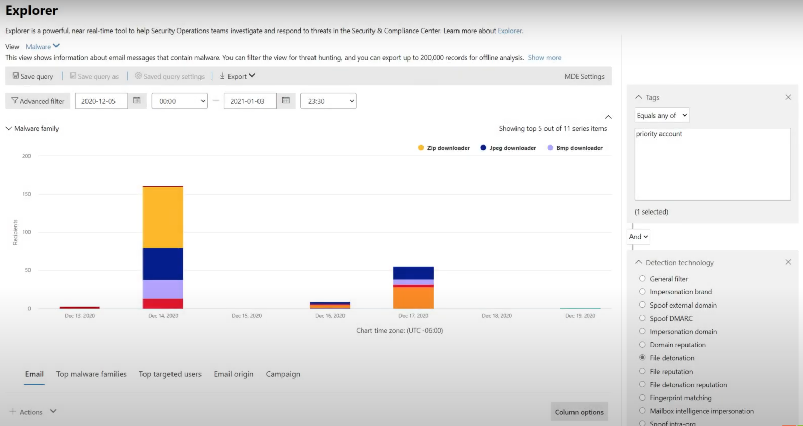
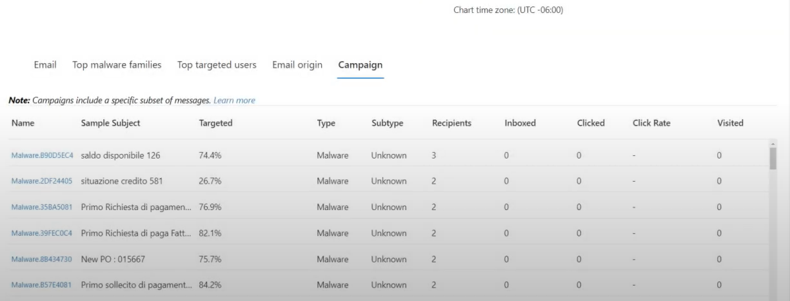

# Ricerca delle minacce in Threat Explorer per Microsoft Defender per Office 365Threat hunting in Threat Explorer for Microsoft Defender for Office 365

Contenuto dell'articolo:In this article:

- [Analisi di Threat ExplorerThreat Explorer walk-through](#threat-explorer-walk-through)
- [Analisi della posta elettronicaEmail investigation](#email-investigation)
- [Correzione della posta elettronicaEmail remediation](#email-remediation)
- [Miglioramenti all'esperienza di ricerca delle minacceImprovements to threat hunting experience](#improvements-to-threat-hunting-experience)

> [!NOTE]
> Questo articolo fa parte di una serie di **3** articoli su **Threat Explorer (Explorer),** sicurezza della posta elettronica e informazioni di base su **Explorer** e sui rilevamenti in tempo reale (ad esempio le differenze tra gli strumenti e le autorizzazioni necessarie per operare). This is part of a **3-article series** on **Threat Explorer (Explorer)**, **email security**, and **Explorer and Real-time detections basics** (such as differences between the tools, and permissions needed to operate them). Gli altri due articoli di questa serie sono sicurezza della posta elettronica [con Threat Explorer](email-security-in-microsoft-defender.md) e Threat Explorer e nozioni di base sui [rilevamenti in tempo reale.](real-time-detections.md)The other two articles in this series are [Email security with Threat Explorer](email-security-in-microsoft-defender.md) and [Threat Explorer and Real-time detections basics](real-time-detections.md).

**Si applica a****Applies to**
- [Microsoft Defender per Office 365 piano 1 e piano 2Microsoft Defender for Office 365 plan 1 and plan 2](defender-for-office-365.md)
- [Microsoft 365 DefenderMicrosoft 365 Defender](../defender/microsoft-365-defender.md)

Se l'organizzazione dispone di [Microsoft Defender per Office 365](defender-for-office-365.md)e si dispone  delle autorizzazioni [,](#required-licenses-and-permissions)è possibile utilizzare **Esplora** risorse o rilevamenti in tempo reale per rilevare e correggere le minacce.If your organization has [Microsoft Defender for Office 365](defender-for-office-365.md), and you have the [permissions](#required-licenses-and-permissions), you can use **Explorer** or **Real-time detections** to detect and remediate threats. 

Nel portale **Microsoft 365 Defender ,** passare a Posta elettronica **& collaborazione** e quindi scegliere **Esplora**.In the **Microsoft 365 Defender portal**, go to **Email & collaboration**, and then choose **Explorer**.

 

****

|Con Microsoft Defender per Office 365 Piano 2, viene visualizzato:With Microsoft Defender for Office 365 Plan 2, you see:|Con Microsoft Defender per Office 365 piano 1, viene visualizzato:With Microsoft Defender for Office 365 Plan 1, you see:|
|---|---|
|||
|

Con questi strumenti è possibile:With these tools, you can:

- Vedere malware rilevato dalle Microsoft 365 di sicurezzaSee malware detected by Microsoft 365 security features
- Visualizzare l'URL di phishing e fare clic su Dati verdettoView phishing URL and click verdict data
- Avviare un processo di indagine e risposta automatizzato da una visualizzazione in Esplora risorseStart an automated investigation and response process from a view in Explorer
- Analizzare la posta elettronica dannosa e altro ancoraInvestigate malicious email, and more

Per altre informazioni, vedi [Sicurezza della posta elettronica con Threat Explorer.](email-security-in-microsoft-defender.md)For more information, see [Email security with Threat Explorer](email-security-in-microsoft-defender.md). 

## Analisi di Threat ExplorerThreat Explorer walk-through

In Microsoft Defender per Office 365, sono disponibili due piani di sottoscrizione: Piano 1 e Piano 2.In Microsoft Defender for Office 365, there are two subscription plans—Plan 1 and Plan 2. Gli strumenti di ricerca delle minacce gestiti manualmente esistono in entrambi i piani, con nomi diversi e con funzionalità diverse.Manually operated Threat hunting tools exist in both plans, under different names and with different capabilities.

Defender per Office 365 Piano 1 usa i rilevamenti in tempo *reale,* che è un sottoinsieme dello strumento di ricerca *Threat Explorer* (denominato anche *Explorer)* nel Piano 2.Defender for Office 365 Plan 1 uses *Real-time detections*, which is a subset of the *Threat Explorer* (also called *Explorer*) hunting tool in Plan 2. In questa serie di articoli, la maggior parte degli esempi è stata creata usando l'intero Threat Explorer.In this series of articles, most of the examples were created using the full Threat Explorer. Gli amministratori devono testare i passaggi nei rilevamenti in tempo reale per vedere dove si applicano.Admins should test any steps in Real-time detections to see where they apply.

Per aprire lo strumento Esplora risorse, vai a **Microsoft 365 Defender portale** Email  >  **& collaboration**  >  **Explorer**.To open the Explorer tool, go to **Microsoft 365 Defender portal** > **Email & collaboration** > **Explorer**. Per impostazione predefinita, arriverai nella pagina **Malware,** ma usa l'elenco a discesa **Visualizza** per acquisire familiarità con le opzioni.By default, you’ll arrive on the **Malware** page, but use the **View** drop down to get familiar with your options. Se stai cercando Phish o stai scavando in una campagna di minacce, scegli queste visualizzazioni.If you’re hunting Phish, or digging into a threat campaign, choose those views.

> [!div class="mx-imgBorder"]
> 

Una volta che un utente delle operazioni di sicurezza (Sec Ops) seleziona i dati che desidera visualizzare, se l'ambito  è ristretto come invii utente o una visualizzazione più ampia, come Tutti i messaggi di posta **elettronica,** può utilizzare il pulsante Mittente per filtrare ulteriormente.Once a security operations (Sec Ops) person selects the data they want to see, whether the scope is narrow view like user **Submissions**, or a wider view, like **All email**, they can use the **Sender** button to further filter. Ricordarsi di selezionare Aggiorna per completare le azioni di filtro.Remember to select Refresh to complete your filtering actions.

> [!div class="mx-imgBorder"]
> 

La perfezione dello stato attivo in Esplora risorse o il rilevamento in tempo reale può essere pensata nei livelli.Refining focus in Explorer or Real-time detection can be thought of in layers. Il primo è **View.**The first is **View**. Il secondo può essere pensato come uno *stato attivo filtrato.*The second can be thought of as a *filtered focus*. Ad esempio, puoi ripercorrere i passaggi che hai fatto per trovare una minaccia registrando le tue decisioni come questa: Per trovare il problema in Esplora risorse, ho scelto la visualizzazione **Malware** con un filtro destinatario attivo.For example, you can retrace the steps you took in finding a threat by recording your decisions like this: To find the issue in Explorer, **I chose the Malware View with a Recipient filter focus**. In questo modo è più semplice eseguire nuovamente i passaggi.This makes retracing your steps easier.

> [!TIP]
> Se Sec Ops usa **Tag** per contrassegnare gli account che considerano obiettivi di valore elevato, possono effettuare selezioni come Visualizzazione phish con lo stato attivo del filtro Tag (includere un intervallo di date se *usato).*If Sec Ops uses **Tags** to mark accounts they consider high valued targets, they can make selections like *Phish View with a Tags filter focus (include a date range if used)*. Questo mostrerà loro eventuali tentativi di phishing indirizzati ai loro obiettivi utente di alto valore durante un intervallo di tempo (ad esempio date in cui determinati attacchi di phishing stanno avvenendo molto per il loro settore).This will show them any phishing attempts directed at their high value user targets during a time-range (like dates when certain phishing attacks are happening a lot for their industry). 

I criteri di affinamento possono essere evasi in intervalli di date utilizzando i controlli dell'intervallo di date.Refinements can be made on date ranges by using the date range controls. Qui puoi vedere Esplora risorse nella visualizzazione **Malware,** con lo stato attivo del filtro **Tecnologia** di rilevamento.Here you can see Explorer in **Malware** view, with a **Detection Technology** filter focus. Ma è il pulsante **Filtro avanzato** che consente ai team sec ops di scavare in profondità.But it’s the **Advanced filter** button that lets Sec Ops teams dig deep. 

> [!div class="mx-imgBorder"]
> 

Se si **fa clic sul** filtro Avanzato, viene visualizzato un pannello che consente ai cacciatori sec ops di creare query in modo che includano o escludono le informazioni necessarie.Clicking the **Advanced filter** pops a panel that will let Sec Ops hunters build queries themselves, letting them include or exclude the information they need to see. Sia il grafico che la tabella nella pagina Esplora risorse rifletteranno i risultati.Both the chart and table on the Explorer page will reflect their results. 

> [!div class="mx-imgBorder"]
> 

Utilizzare il **pulsante Opzioni** colonna per ottenere il tipo di informazioni sulla tabella più utili:Use the **Column options** button to get the kind of information on the table that would be most helpful: 

> [!div class="mx-imgBorder"]
> 

> [!div class="mx-imgBorder"]
> 

Nello stesso ambiente, assicurati di testare le opzioni di visualizzazione.In the same mien, make sure to test your display options. Gruppi di destinatari diversi reagiscono bene alle diverse presentazioni degli stessi dati.Different audiences will react well to different presentations of the same data. Per alcuni visualizzatori, la mappa **Email Origins** può mostrare che  una minaccia è diffusa o discreta più rapidamente rispetto all'opzione Visualizzazione campagna accanto ad essa.For some viewers, the **Email Origins** map can show that a threat is widespread or discreet more quickly than the **Campaign display** option right next to it. Sec Ops può usare questi display per fare al meglio punti che sottolineano la necessità di sicurezza e protezione o per un confronto successivo, per dimostrare l'efficacia delle loro azioni.Sec Ops can make use of these displays to best make points that underscore the need for security and protection, or for later comparison, to demonstrate the effectiveness of their actions. 

> [!div class="mx-imgBorder"]
> 

> [!div class="mx-imgBorder"]
> 

### Analisi della posta elettronicaEmail investigation

Quando viene visualizzato un messaggio di posta elettronica sospetto, fare clic sul nome per espandere il riquadro a comparsa a destra.When you see a suspicious email, click the name to expand the flyout on the right. In questo caso, è disponibile il banner che consente a Sec Ops di visualizzare la [pagina dell'entità di posta](mdo-email-entity-page.md) elettronica.Here, the banner that lets Sec Ops see the [email entity page](mdo-email-entity-page.md) is available.

La pagina dell'entità di posta elettronica riunisce il contenuto disponibile **in** **Dettagli,** **Allegati,** Dispositivi, ma include dati più organizzati.The email entity page pulls together contents that can be found under **Details**, **Attachments**, **Devices**, but includes more organized data. Sono inclusi elementi come i risultati DMARC, la visualizzazione in testo normale dell'intestazione del messaggio di posta elettronica con un'opzione di copia, le informazioni di verdetto sugli allegati detonati in modo sicuro e i file eliminati da tali detonazioni (possono includere indirizzi IP contattati e screenshot di pagine o file).This includes things like DMARC results, plain text display of the email header with a copy option, verdict information on attachments that were securely detonated, and files those detonations dropped (can include IP addresses that were contacted and screenshots of pages or files). Anche gli URL e i loro verdetti sono elencati con dettagli simili segnalati.URLs and their verdicts are also listed with similar details reported. 

Quando si raggiunge questa fase, la pagina dell'entità di posta elettronica sarà fondamentale per il passaggio finale,*ovvero la correzione.*When you reach this stage, the email entity page will be critical to the final step—*remediation*. 

> [!div class="mx-imgBorder"]
> 

> [!TIP]
> Per ulteriori informazioni sulla pagina dell'entità di posta elettronica completa (visualizzata di seguito nella scheda **Analisi),** inclusi i risultati degli allegati detonati, i risultati degli URL inclusi e l'anteprima sicura della posta elettronica, fare clic [qui](mdo-email-entity-page.md).To learn more about the rich email entity page (seen below on the **Analysis** tab), including the results of detonated Attachments, findings for included URLs, and safe Email preview, click [here](mdo-email-entity-page.md).

> [!div class="mx-imgBorder"]
> 

### Correzione della posta elettronicaEmail remediation

Una volta che una persona di Sec Ops determina che un messaggio di posta elettronica è una minaccia, il passaggio successivo di Explorer o rilevamento in tempo reale si occupa della minaccia e la correla.Once a Sec Ops person determines that an email is a threat, the next Explorer or Real-time detection step is dealing with the threat and remediating it. A tale scopo, tornare a Esplora minacce, selezionare la casella di controllo per l'e-mail del problema e usare il **pulsante** Azioni.This can be done by returning to Threat Explorer, selecting the checkbox for the problem email, and using the **Actions** button.

> [!div class="mx-imgBorder"]
> 

In questo caso, l'analista può eseguire azioni come segnalare la posta elettronica come Posta indesiderata, Phishing o Malware, contattare i destinatari o ulteriori indagini che possono includere l'attivazione di playbook di indagine e risposta automatizzata (o AIR) (se si dispone del Piano 2).Here, the analyst can take actions like reporting the mail as Spam, Phishing, or Malware, contacting recipients, or further investigations that can include triggering Automated Investigation and Response (or AIR) playbooks (if you have Plan 2). Oppure, la posta può anche essere segnalata come pulita.Or, the mail can also be reported as clean.

> [!div class="mx-imgBorder"]
> 

## Miglioramenti all'esperienza di ricerca delle minacceImprovements to threat hunting experience

### ID avvisoAlert ID

Quando ci si sposta da un avviso in Esplora minacce, **la visualizzazione** verrà filtrata in base **all'ID avviso.**When navigating from an alert into Threat Explorer, the **View** will be filtered by **Alert ID**. Questo vale anche per il rilevamento in tempo reale.This also applies in Real-time detection. Vengono visualizzati i messaggi rilevanti per l'avviso specifico e un totale di posta elettronica (un conteggio).Messages relevant to the specific alert, and an email total (a count) are shown. Sarà possibile vedere se un messaggio fa parte di un avviso e passare da tale messaggio all'avviso correlato.You will be able to see if a message was part of an alert, as well as navigate from that message to the related alert.

Infine, l'ID avviso è incluso nell'URL, ad esempio: `https://https://security.microsoft.com/viewalerts`Finally, alert ID is included in the URL, for example: `https://https://security.microsoft.com/viewalerts`

> [!div class="mx-imgBorder"]
> 

> [!div class="mx-imgBorder"]
> 

### Estensione del limite di conservazione e ricerca dei dati di Explorer (e rilevamento in tempo reale) per i tenant di provaExtending Explorer (and Real-time detections) data retention and search limit for trial tenants 

Come parte di questa modifica, gli analisti saranno in grado di cercare e filtrare i dati di posta elettronica in 30 giorni (da sette giorni) in Threat Explorer e rilevamenti in tempo reale per i tenant di prova di Office P1 e P2.As part of this change, analysts will be able to search for, and filter email data across 30 days (increased from seven days) in Threat Explorer and Real-time detections for both Defender for Office P1 and P2 trial tenants. Questo non influisce sui tenant di produzione per i clienti P1 e P2 E5, dove il valore predefinito di conservazione è già 30 giorni.This doesn’t impact any production tenants for both P1 and P2 E5 customers, where the retention default is already 30 days.

### Limite di esportazione aggiornatoUpdated Export limit 

Il numero di record email che possono essere esportati da Threat Explorer è ora 200.000 (era 9990).The number of Emails records that can be exported from Threat Explorer is now 200,000 (was 9990). Il set di colonne che è possibile esportare rimane invariato.The set of columns that can be exported is unchanged. 

### Tag in Threat ExplorerTags in Threat Explorer

> [!NOTE]
> La funzionalità tag utente è disponibile in Anteprima e potrebbe non essere disponibile per tutti gli utenti.The user tags feature is in Preview and may not be available to everyone. Inoltre, le anteprime sono soggette a modifiche.Also, Previews are subject to change. Per informazioni sulla pianificazione dei rilasci, vedere la guida di orientamento Microsoft 365 rilascio.For information about the release schedule, check out the Microsoft 365 roadmap.

I tag utente identificano gruppi specifici di utenti in Microsoft Defender per Office 365.User tags identify specific groups of users in Microsoft Defender for Office 365. Per ulteriori informazioni sui tag, incluse le licenze e la configurazione, vedere [Tag utente](user-tags.md).For more information about tags, including licensing and configuration, see [User tags](user-tags.md).

In Esplora minacce puoi visualizzare le informazioni sui tag utente nelle esperienze seguenti.In Threat Explorer, you can see information about user tags in the following experiences.

#### Visualizzazione griglia posta elettronicaEmail grid view

Quando gli analisti osservano la colonna **Tag** nella griglia della posta elettronica, vengono visualizzati tutti i tag applicati alle cassette postali del mittente o del destinatario.When analysts look at the **Tags** column the email grid, they are seeing all tags that have been applied to sender or recipient mailboxes. Per impostazione predefinita, i tag di sistema come *gli account di* priorità vengono visualizzati per primi.By default, system tags like *priority accounts* are shown first.

> [!div class="mx-imgBorder"]
> 

#### FiltroFiltering

I tag possono essere utilizzati come filtri.Tags can be used as filters. Eseguire la ricerca solo tra account con priorità o utilizzare scenari specifici di tag utente in questo modo.Hunt among priority accounts only, or use specific user tags scenarios this way. È inoltre possibile escludere i risultati con determinati tag.You can also exclude results that have certain tags. Combina i tag con altri filtri e intervalli di date per restringere l'ambito di indagine.Combine Tags with other filters and date ranges to narrow your scope of investigation. 

> [!div class="mx-imgBorder"]
> 

#### Riquadro a comparsa Dettagli posta elettronicaEmail detail flyout

Per visualizzare i singoli tag per mittente e destinatario, selezionare un messaggio di posta elettronica per aprire il riquadro a comparsa dei dettagli del messaggio.To view the individual tags for sender and recipient, select an email to open the message details flyout. Nella scheda **Riepilogo,** i tag mittente e destinatario vengono visualizzati separatamente.On the **Summary** tab, the sender and recipient tags are shown separately. Le informazioni sui singoli tag per mittente e destinatario possono essere esportate come dati CSV.The information about individual tags for sender and recipient can be exported as CSV data. 

> [!div class="mx-imgBorder"]
> 

Le informazioni sui tag vengono visualizzate anche nel riquadro a comparsa dei clic sull'URL.Tags information is also shown in the URL clicks flyout. Per visualizzarlo, passare alla visualizzazione Phish o All Email > **URL** o alla scheda **Url Clicks.** Seleziona un singolo riquadro a comparsa URL per visualizzare ulteriori dettagli sui clic per tale URL, inclusi gli eventuali tag associati a tale clic.To see it, go to Phish or All Email view > **URLs** or **URL Clicks** tab. Select an individual URL flyout to see additional details about clicks for that URL, including any Tags associated with that click.

### Visualizzazione sequenza temporale aggiornataUpdated Timeline View

> [!div class="mx-imgBorder"]
> 
>
Scopri di più guardando [questo video](https://www.youtube.com/watch?v=UoVzN0lYbfY&list=PL3ZTgFEc7LystRja2GnDeUFqk44k7-KXf&index=4).Learn more by watching [this video](https://www.youtube.com/watch?v=UoVzN0lYbfY&list=PL3ZTgFEc7LystRja2GnDeUFqk44k7-KXf&index=4).

## Funzionalità esteseExtended capabilities

### Utenti di destinazione principaliTop targeted users

Principali famiglie di malware mostra **gli utenti di destinazione principali** nella sezione Malware.Top Malware Families shows the **top targeted users** in the Malware section. Gli utenti di destinazione principali verranno estesi anche tramite le visualizzazioni Phish e All Email.Top targeted users will be extended through Phish and All Email views too. Gli analisti saranno in grado di visualizzare i cinque utenti più mirati, insieme al numero di tentativi per ogni utente in ogni visualizzazione.Analysts will be able to see the top-five targeted users, along with the number of attempts for each user in each view. 

Operazioni di sicurezza Gli utenti possono esportare l'elenco degli utenti di destinazione, fino a un limite di 3.000, insieme al numero di tentativi effettuati, per l'analisi offline per ogni visualizzazione della posta elettronica.Security operations people be able to export the list of targeted users, up to a limit of 3,000, along with the number of attempts made, for offline analysis for each email view. Inoltre, selezionando il numero di tentativi (ad esempio, 13 tentativi nell'immagine seguente) verrà aperta una visualizzazione filtrata in Esplora minacce, in modo da poter visualizzare ulteriori dettagli tra i messaggi di posta elettronica e le minacce per tale utente.Also, selecting the number of attempts (for example, 13 attempts in the image below) will open a filtered view in Threat Explorer, so you can see more details across emails, and threats for that user.  

> [!div class="mx-imgBorder"]
> 

### Exchange di trasportoExchange transport rules

Il team delle operazioni di sicurezza sarà in grado di visualizzare tutte le regole di trasporto Exchange (o regole del flusso di posta) applicate a un messaggio nella visualizzazione Griglia posta elettronica.The security operations team will be able to see all the Exchange transport rules (or Mail flow rules) applied to a message, in the Email grid view. Selezionare **Opzioni colonna** nella griglia e quindi Exchange regola di **trasporto** dalle opzioni di colonna.Select **Column options** in the grid and then **Add Exchange Transport Rule** from the column options. L Exchange delle regole di trasporto è visibile anche nel riquadro **a** comparsa Dettagli nel messaggio di posta elettronica.The Exchange transport rules option is also visible on the **Details** flyout in the email. 

Vengono visualizzati i nomi e i GUID delle regole di trasporto applicate al messaggio.Names and GUIDs of the transport rules applied to the message appear. Gli analisti potranno cercare i messaggi utilizzando il nome della regola di trasporto.Analysts will be able to search for messages by using the name of the transport rule. Si tratta di una ricerca CONTAINS, che significa che è possibile eseguire anche ricerche parziali.This is a CONTAINS search, which means you can do partial searches as well. 

> [!IMPORTANT]
> Exchange ricerca delle regole di trasporto e la disponibilità dei nomi dipendono dal ruolo specifico assegnato all'utente.Exchange transport rule search and name availability depend on the specific role assigned to you. Per visualizzare i nomi delle regole di trasporto e la ricerca, è necessario disporre di uno dei ruoli o delle autorizzazioni seguenti.You need to have one of the following roles or permissions to view the transport rule names and search. Tuttavia, anche senza i ruoli o le autorizzazioni seguenti, un analista può visualizzare l'etichetta della regola di trasporto e le informazioni sul GUID nei dettagli della posta elettronica.However, even without the roles or permissions below, an analyst may see the transport rule label and GUID information in the Email Details. Altre esperienze di visualizzazione dei record nelle griglie di posta elettronica, nei riquadri a comparsa di posta elettronica, nei filtri e nell'esportazione non sono interessate.Other record-viewing experiences in Email Grids, Email flyouts, Filters, and Export are not affected.
>
> - Exchange Online Solo - Prevenzione della perdita di dati: TuttiExchange Online Only - Data Loss Prevention: All
> - Exchange Online Solo - O365SupportViewConfig: AllExchange Online Only - O365SupportViewConfig: All
> - Microsoft Azure Active Directory o Exchange Online - Amministratore sicurezza: TuttiMicrosoft Azure Active Directory or Exchange Online - Security Admin: All
> - Azure Active Directory o Exchange Online - Security Reader: AllAzure Active Directory or Exchange Online - Security Reader: All
> - Exchange Online Solo - Regole di trasporto: TutteExchange Online Only - Transport Rules: All
> - Exchange Online Solo - View-Only configurazione: TuttiExchange Online Only - View-Only Configuration: All
>
> All'interno della griglia di posta elettronica, del riquadro a comparsa Dettagli e del file CSV esportato, gli ETF vengono presentati con un nome/GUID, come illustrato di seguito.Within the email grid, Details flyout, and Exported CSV, the ETRs are presented with a Name/GUID as shown below.
>
> > [!div class="mx-imgBorder"]
> > 

### Connettori in ingressoInbound connectors

I connettori sono una raccolta di istruzioni che personalizzano il flusso della posta elettronica da e verso l'Microsoft 365 o Office 365'organizzazione.Connectors are a collection of instructions that customize how your email flows to and from your Microsoft 365 or Office 365 organization. Consentono di applicare eventuali restrizioni o controlli di sicurezza.They enable you to apply any security restrictions or controls. In Esplora minacce, è possibile visualizzare i connettori correlati a un messaggio di posta elettronica e cercare i messaggi di posta elettronica utilizzando i nomi dei connettori.In Threat Explorer, you can view the connectors that are related to an email and search for emails using connector names. 

La ricerca di connettori è una query CONTAINS, il che significa che le ricerche con parole chiave parziali possono funzionare:The search for connectors is a CONTAINS query, which means partial keyword searches can work: 

> [!div class="mx-imgBorder"]
> 

## Licenze e autorizzazioni obbligatorieRequired licenses and permissions

Devi disporre di [Microsoft Defender per Office 365](defender-for-office-365.md) usare Explorer o rilevamenti in tempo reale.You must have [Microsoft Defender for Office 365](defender-for-office-365.md) to use Explorer or Real-time detections.

- Explorer è incluso in Defender per Office 365 Piano 2.Explorer is included in Defender for Office 365 Plan 2.
- Il report rilevamenti in tempo reale è incluso in Defender per Office 365 piano 1.The Real-time detections report is included in Defender for Office 365 Plan 1.
- Pianificare l'assegnazione delle licenze per tutti gli utenti che devono essere protetti da Defender per Office 365.Plan to assign licenses for all users who should be protected by Defender for Office 365. Explorer e i rilevamenti in tempo reale mostrano i dati di rilevamento per gli utenti con licenza.Explorer and Real-time detections show detection data for licensed users.

Per visualizzare e usare Esplora risorse o rilevamenti in tempo reale, è necessario disporre di quanto segue:To view and use Explorer or Real-time detections, you must have the following:

- Per il portale Microsoft 365 Defender:For the Microsoft 365 Defender portal:

  - Gestione dell'organizzazioneOrganization Management
  - Amministratore della sicurezza (può essere assegnato nell'Azure Active Directory di amministrazione ( <https://aad.portal.azure.com> )Security Administrator (this can be assigned in the Azure Active Directory admin center (<https://aad.portal.azure.com>)
  - Ruolo con autorizzazioni di lettura per la sicurezzaSecurity Reader

- Per Exchange Online:For Exchange Online:

  - Gestione organizzazioneOrganization Management
  - Gestione organizzazione sola visualizzazioneView-Only Organization Management
  - Destinatari solo visualizzazioneView-Only Recipients
  - Gestione della conformitàCompliance Management

Per ulteriori informazioni sui ruoli e sulle autorizzazioni, vedere le risorse seguenti:To learn more about roles and permissions, see the following resources:

- [Autorizzazioni nel portale di Microsoft 365 DefenderPermissions in the Microsoft 365 Defender portal](permissions-microsoft-365-security-center.md)
- [Autorizzazioni funzionalità in Exchange OnlineFeature permissions in Exchange Online](/exchange/permissions-exo/feature-permissions)
- [Exchange Online PowerShellExchange Online PowerShell](/powershell/exchange/exchange-online-powershell)

## Ulteriori informazioniMore information

- [Identificare e analizzare i messaggi di posta elettronica dannosi recapitatiFind and investigate malicious email that was delivered](investigate-malicious-email-that-was-delivered.md) 
- [Visualizzare i file dannosi rilevati in SharePoint Online, OneDrive e Microsoft TeamsView malicious files detected in SharePoint Online, OneDrive, and Microsoft Teams](mdo-for-spo-odb-and-teams.md) 
- [Ottenere una panoramica delle visualizzazioni in Esplora minacce (e rilevamenti in tempo reale)Get an overview of the views in Threat Explorer (and Real-time detections)](threat-explorer-views.md) 
- [Report dello stato di protezione dalle minacceThreat protection status report](view-email-security-reports.md#threat-protection-status-report) 
- [Indagine e reazione automatizzate in Microsoft Threat ProtectionAutomated investigation and response in Microsoft Threat Protection](automated-investigation-response-office.md) 
- [Analizzare i messaggi di posta elettronica con la pagina Entità di posta elettronicaInvestigate emails with the Email Entity Page](mdo-email-entity-page.md)