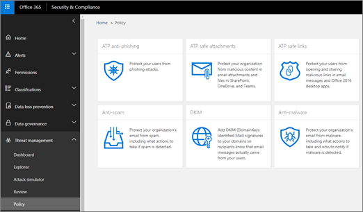

# Tracker delle minacce - Nuovi e degni di nota

[!INCLUDE [Microsoft 365 Defender rebranding](../includes/microsoft-defender-for-office.md)]

**Si applica a**
- [Microsoft Defender per Office 365 Piano 2](office-365-atp.md)
- [Microsoft 365 Defender](../mtp/microsoft-threat-protection.md)

[Le funzionalità office 365 Threat Investigation and Response](office-365-ti.md) consentono al team di sicurezza dell'organizzazione di individuare e intervenire contro le minacce alla cybersecurity. Le funzionalità di Analisi e risposta alle minacce di Office 365 includono funzionalità di Monitoraggio minacce, tra cui tracker degni di nota. Leggere questo articolo per una panoramica di queste nuove funzionalità e dei passaggi successivi.

> [!IMPORTANT]
> Office 365 Threat Intelligence è ora Microsoft Defender per Office 365 Piano 2, insieme ad altre funzionalità di protezione dalle minacce. Per altre informazioni, vedere i piani e i prezzi di Microsoft Defender per [Office 365](https://products.office.com/exchange/advance-threat-protection) e la descrizione del servizio [Microsoft Defender per Office 365.](https://docs.microsoft.com/office365/servicedescriptions/office-365-advanced-threat-protection-service-description)

## Che cosa sono i tracker delle minacce?

I tracker delle minacce sono widget informativi e visualizzazioni che forniscono informazioni su diversi problemi di cybersecurity che potrebbero influire sull'azienda. Ad esempio, è possibile visualizzare informazioni sulla tendenza delle campagne antimalware utilizzando i tracker delle minacce.

La maggior parte delle pagine del tracker include numeri di tendenza che vengono aggiornati periodicamente, widget che  consentono di comprendere quali sono i problemi più grandi o sono aumentati di più e un collegamento rapido nella colonna Azioni che consente di accedere a Esplora risorse, dove è possibile visualizzare informazioni più dettagliate.

I tracker sono solo alcune delle numerose funzionalità che si ottengono con [Microsoft Defender per Office 365 Piano 2.](office-365-ti.md) I tracker delle minacce [includono tracker di Noteworth,](#noteworthy-trackers) [tracker di tendenza,](#trending-trackers) [query tracciate](#tracked-queries)e [query salvate.](#saved-queries)

Per visualizzare e usare i tracker delle minacce per l'organizzazione, accedere al Centro sicurezza & conformità ( ) e scegliere Threat <https://protection.office.com> **Management** \> **Threat Tracker**.

> [!NOTE]
> Per usare i tracker delle minacce, è necessario essere un amministratore globale, un amministratore della sicurezza o un lettore di sicurezza. Vedere [Autorizzazioni nel Centro sicurezza & conformità.](permissions-in-the-security-and-compliance-center.md)

### Tracker degni di nota

I tracker degni di nota sono il luogo in cui si possono trovare minacce e rischi di grandi e più piccoli dimensioni che ci sembra opportuno conoscere. I tracker degni di nota consentono di scoprire se questi problemi esistono nell'ambiente Microsoft 365, oltre a un collegamento ad articoli (come questo) che forniscono maggiori dettagli su ciò che sta succedendo e su come incideranno sull'uso di Office 365 da parte dell'organizzazione. Sia che si tratta di una nuova grande minaccia (ad esempio Wannacry, Petya) o di una minaccia esistente che potrebbe creare nuove sfide (come l'altro elemento importante, Nemucod), è qui che è possibile trovare nuovi elementi importanti che l'utente e il team della sicurezza devono esaminare ed esaminare periodicamente.

In genere, i tracker degni di nota verranno pubblicati per appena un paio di settimane quando vengono identificate nuove minacce e si pensa che potrebbe essere necessaria la visibilità aggiuntiva fornita da questa funzionalità. Una volta superato il rischio maggiore per una minaccia, rimuoveremo tale elemento di notevole interesse. In questo modo, possiamo mantenere aggiornato l'elenco con altri nuovi elementi pertinenti.

### Tracker di tendenza

I tracker di tendenza (in precedenza denominati Campagne) evidenziano le nuove minacce ricevute nella posta elettronica dell'organizzazione nella settimana passata.

I tracker di tendenza offrono un'idea delle nuove minacce da esaminare per garantire che l'ambiente aziendale più ampio sia preparato agli attacchi.

### Query rilevate

Le query monitorate sfruttano le query salvate per valutare periodicamente le attività di Microsoft 365 nell'organizzazione. In questo modo è possibile ottenere tendenze per gli eventi, con altre informazioni nei prossimi mesi. Le query rilevate vengono eseguite automaticamente, fornendo informazioni aggiornate senza dover ricordare di eseguire di nuovo le query.

### Query salvate

Le query salvate sono disponibili anche nella sezione Tracker. È possibile utilizzare le query salvate per archiviare le ricerche comuni di Esplora risorse che si desidera ottenere più velocemente e ripetutamente, senza dover creare di nuovo la ricerca ogni volta.

È sempre possibile salvare una query di tracker degna di nota o una qualsiasi delle query di Explorer usando il pulsante Salva **query** nella parte superiore della pagina dell'elenco delle risorse. Tutti gli elementi salvati verranno visualizzati **nell'elenco Query** salvate nella pagina Tracker.

## Tracker ed Esplora risorse

Sia che si riveda la posta elettronica, il contenuto o le attività di Office (presto disponibile), Explorer e Trackers lavorano insieme per analizzare e tenere traccia dei rischi e delle minacce per la sicurezza. Tutti insieme, i tracker forniscono informazioni per proteggere gli utenti evidenziando i problemi nuovi, importanti e cercati di frequente, garantendo che l'azienda sia meglio protetta mentre si sposta nel cloud.

Tenere presente che è sempre possibile inviare commenti e suggerimenti su questa o altre funzionalità di sicurezza di Microsoft 365 facendo clic sul pulsante **Feedback** nell'angolo in basso a destra della panoramica del Centro sicurezza [& conformità.](https://support.microsoft.com/office/a5f2fd18-b029-4257-b5a8-ae83e7768c85)

## Tracker e Microsoft Defender per Office 365

Con la nostra minaccia importante, stiamo evidenziando le minacce malware avanzate rilevate [dagli allegati sicuri.](atp-safe-attachments.md) Se si è clienti di Office 365 Enterprise E5 e non si usa [Microsoft Defender per Office 365,](office-365-atp.md)è consigliabile che sia incluso nell'abbonamento. Defender per Office 365 offre valore anche se si dispone di altri strumenti di sicurezza che filtrano il flusso di posta elettronica con i servizi di Office 365. Tuttavia, le funzionalità di [protezione](atp-safe-links.md) da posta indesiderata e collegamenti sicuri funzionano al meglio quando la soluzione di sicurezza della posta elettronica principale è office 365.

Nel mondo odierno pieno di minacce, eseguire solo analisi antimalware tradizionali significa che non sei abbastanza protetto dagli attacchi. Gli utenti malintenzionati più sofisticati di oggi usano strumenti disponibili comunemente per creare nuovi attacchi offuscati o ritardati che non verranno riconosciuti dai motori antimalware basati su firma tradizionali. La funzionalità Allegati sicuri accetta gli allegati di posta elettronica e li detona in un ambiente virtuale per determinare se sono sicuri o dannosi. Questo processo di detonazione apre ogni file in un ambiente di computer virtuale, quindi controlla cosa accade dopo l'apertura del file. Sia che si tratta di un file PDF, compresso o di un documento di Office, il codice dannoso può essere nascosto in un file, attivando solo una volta che la vittima lo apre sul computer. Detonando e analizzando il file nel flusso di posta elettronica, le funzionalità di Defender per Office 365 rilevano queste minacce in base ai comportamenti, alla reputazione dei file e a una serie di regole euristiche.

Il nuovo filtro delle minacce di rilievo evidenzia gli elementi rilevati di recente tramite allegati sicuri. Questi rilevamenti rappresentano gli elementi che sono nuovi file dannosi, non trovati in precedenza da Microsoft 365 nel flusso di posta elettronica o nella posta elettronica di altri clienti. Presta attenzione agli elementi in Noteworthy Threat Tracker, vedi chi è stato preso di mira da loro ed esamina i dettagli della detonazione mostrati nella scheda Analisi avanzata (che si trova facendo clic sull'oggetto del messaggio di posta elettronica in Esplora risorse). Nota: questa scheda è disponibile solo nei messaggi di posta elettronica rilevati dalla funzionalità Allegati sicuri: questo strumento di monitoraggio di Noteworthy include tale filtro, ma puoi anche usare tale filtro per altre ricerche in Esplora risorse.

## Passaggi successivi

- Se l'organizzazione non dispone già di queste funzionalità di Office 365 Threat Investigation and Response, vedere Come ottenere le funzionalità di analisi e risposta alle minacce di [Office 365?](office-365-ti.md).

- Assicurarsi che al team di sicurezza siano assegnati i ruoli e le autorizzazioni corretti. È necessario essere un amministratore globale o disporre del ruolo Amministratore della sicurezza o Ricerca ed eliminazione nel Centro sicurezza & conformità. Vedere [Autorizzazioni nel Centro sicurezza & conformità.](permissions-in-the-security-and-compliance-center.md)

- Guardare i nuovi tracker da visualizzare nell'ambiente Microsoft 365. Se disponibile, i tracker sono disponibili [qui.](https://protection.office.com/) Passare a **Threat Management** \> **Threat Trackers**.

- Se non lo hai già fatto, scopri di più su e configura Microsoft Defender per [Office 365](office-365-atp.md) per l'organizzazione, inclusi Collegamenti [sicuri](atp-safe-links.md) e [Allegati sicuri.](atp-safe-attachments.md)
