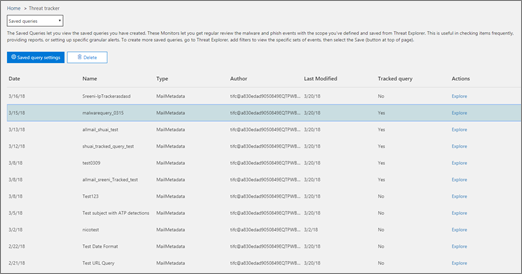

# Threat Trackers - New and Noteworthy

[!INCLUDE [Microsoft 365 Defender rebranding](../includes/microsoft-defender-for-office.md)]

**Si applica a**
- [Microsoft Defender per Office 365 Piano 2](defender-for-office-365.md)
- [Microsoft 365 Defender](../defender/microsoft-365-defender.md)

[Le funzionalità office 365 Threat Investigation and Response](office-365-ti.md) consentono al team di sicurezza dell'organizzazione di individuare e intervenire contro le minacce alla cybersecurity. Le funzionalità di indagine e risposta alle minacce di Office 365 includono funzionalità di Monitoraggio delle minacce, tra cui tracker degni di nota. Leggere questo articolo per ottenere una panoramica di queste nuove funzionalità e dei passaggi successivi.

> [!IMPORTANT]
> Office 365 Threat Intelligence è ora Microsoft Defender per Office 365 Piano 2, insieme a ulteriori funzionalità di protezione dalle minacce. Per ulteriori informazioni, vedere [Microsoft Defender for Office 365 plans and pricing](https://products.office.com/exchange/advance-threat-protection) e Microsoft Defender for Office [365 Service Description.](/office365/servicedescriptions/office-365-advanced-threat-protection-service-description)

## Che cos'è Threat Trackers?

Threat Trackers sono widget informativi e visualizzazioni che forniscono informazioni su diversi problemi di cybersecurity che potrebbero influire sulla tua azienda. Ad esempio, puoi visualizzare informazioni sulle tendenze delle campagne antimalware usando Threat Trackers.

La maggior parte delle pagine del tracker include numeri di tendenza che vengono aggiornati periodicamente, widget che  consentono di comprendere quali sono i problemi più grandi o sono aumentati di più e un collegamento rapido nella colonna Azioni che consente di accedere a Esplora risorse, dove è possibile visualizzare informazioni più dettagliate.

I tracker sono solo alcune delle numerose funzionalità avanzate disponibili con [Microsoft Defender per Office 365 Piano 2.](office-365-ti.md) I tracker delle minacce includono [tracker noteworth,](#noteworthy-trackers) [tracker di](#trending-trackers)tendenza, [query](#tracked-queries)tracciate e [query salvate.](#saved-queries)

Per visualizzare e usare i tracker delle minacce per l'organizzazione, passare al Centro sicurezza & conformità ( ) e scegliere Monitoraggio minacce <https://protection.office.com>  \> **di gestione delle minacce**.

> [!NOTE]
> Per usare Threat Trackers, devi essere un amministratore globale, un amministratore della sicurezza o un lettore di sicurezza. Vedere [Autorizzazioni nel Centro sicurezza & conformità](permissions-in-the-security-and-compliance-center.md).

### Tracker degni di nota

I tracker degni di nota sono il punto in cui troverai minacce e rischi di grandi e più piccoli che pensiamo che dovresti conoscere. I tracker degni di nota consentono di individuare se questi problemi sono presenti nell'ambiente Microsoft 365, oltre a collegamenti ad articoli (come questo) che forniscono ulteriori dettagli su ciò che accade e su come incideranno sull'uso di Office 365 da parte dell'organizzazione. Sia che si tratta di una nuova grande minaccia (ad esempio Wannacry, Petya) o di una minaccia esistente che potrebbe creare nuove sfide (come l'altro elemento di noteworthy - Nemucod) è qui che troverai nuovi elementi importanti che tu e il team di sicurezza dovresti esaminare ed esaminare periodicamente.

In genere, i tracker degni di nota verranno pubblicati solo per un paio di settimane quando vengono identificate nuove minacce e si pensa che potrebbe essere necessaria la visibilità aggiuntiva fornita da questa funzionalità. Una volta superato il rischio maggiore per una minaccia, rimuoveremo quell'elemento degna di nota. In questo modo, possiamo mantenere l'elenco aggiornato e aggiornato con altri nuovi elementi pertinenti.

### Tracker di tendenza

I tracker di tendenza (in precedenza denominati campagne) evidenziano le nuove minacce ricevute nella posta elettronica dell'organizzazione nell'ultima settimana.

I tracker di tendenza offrono un'idea delle nuove minacce da esaminare per garantire che l'ambiente aziendale più ampio sia preparato contro gli attacchi.

### Query rilevate

Le query rilevate sfruttano le query salvate per valutare periodicamente le attività di Microsoft 365 nell'organizzazione. In questo modo, verranno fornite le tendenze degli eventi, con altre informazioni che verranno fornite nei prossimi mesi. Le query rilevate vengono eseguite automaticamente, fornendo informazioni aggiornate senza dover ricordare di eseguire di nuovo le query.

### Query salvate

Le query salvate sono disponibili anche nella sezione Tracker. È possibile utilizzare le query salvate per archiviare le ricerche comuni di Esplora risorse che si desidera tornare più velocemente e ripetutamente, senza dover creare di nuovo la ricerca ogni volta.

Puoi sempre salvare una query di rilevamento degna di nota o una delle tue query di Explorer usando il pulsante Salva **query** nella parte superiore della pagina Esplora risorse. Tutti gli elementi salvati verranno visualizzati **nell'elenco Query** salvate nella pagina Tracker.

## Tracker ed Esplora risorse

Sia che si riveda la posta elettronica, il contenuto o le attività di Office (presto disponibile), Explorer e Trackers lavorano insieme per analizzare e tenere traccia dei rischi e delle minacce per la sicurezza. Tutti insieme, i tracker forniscono informazioni per proteggere gli utenti evidenziando nuovi problemi, importanti e ricercati di frequente, assicurando che l'azienda sia protetta meglio durante il suo spostamento nel cloud.

Tenere presente che è sempre possibile fornire commenti e suggerimenti su questa o altre funzionalità di sicurezza di Microsoft 365 facendo clic sul pulsante **Feedback** nell'angolo in basso a destra della panoramica del Centro sicurezza [& conformità.](https://support.microsoft.com/office/a5f2fd18-b029-4257-b5a8-ae83e7768c85)

## Tracker e Microsoft Defender per Office 365

Con la nostra minaccia degna di nota, stiamo evidenziando le minacce malware avanzate rilevate [dagli allegati sicuri.](safe-attachments.md) Se si è un cliente di Office 365 Enterprise E5 e non si usa [Microsoft Defender per Office 365,](defender-for-office-365.md)è consigliabile che sia incluso nell'abbonamento. Defender per Office 365 offre valore anche se si dispone di altri strumenti di sicurezza che filtrano il flusso di posta elettronica con i servizi di Office 365. Tuttavia, le funzionalità di [protezione](safe-links.md) da posta indesiderata e collegamenti sicuri funzionano meglio quando la soluzione di sicurezza della posta elettronica principale è office 365.

Nel mondo odierno pieno di minacce, eseguire solo analisi antimalware tradizionali significa che non sei abbastanza protetto dagli attacchi. Gli utenti malintenzionati più sofisticati usano strumenti comunemente disponibili per creare nuovi attacchi offuscati o ritardati che non verranno riconosciuti dai tradizionali motori antimalware basati su firma. La funzionalità Allegati sicuri accetta allegati di posta elettronica e li fa detonare in un ambiente virtuale per determinare se sono sicuri o dannosi. Questo processo di detonazione apre ogni file in un ambiente di computer virtuale, quindi osserva cosa accade dopo l'apertura del file. Sia che si tratta di un file PDF, compresso o di un documento di Office, il codice dannoso può essere nascosto in un file, attivando solo una volta che la vittima lo apre sul computer. Detonando e analizzando il file nel flusso di posta elettronica, le funzionalità di Defender per Office 365 individuano queste minacce in base ai comportamenti, alla reputazione dei file e a una serie di regole euristiche.

Il nuovo filtro delle minacce degne di nota evidenzia gli elementi rilevati di recente tramite allegati sicuri. Questi rilevamenti rappresentano gli elementi che sono nuovi file dannosi, non trovati in precedenza da Microsoft 365 nel flusso di posta elettronica o nella posta elettronica di altri clienti. Presta attenzione agli elementi in Noteworthy Threat Tracker, vedi chi è stato preso di mira da loro ed esamina i dettagli della detonazione mostrati nella scheda Analisi avanzata (che si trova facendo clic sull'oggetto del messaggio di posta elettronica in Esplora risorse). Nota questa scheda è disponibile solo nei messaggi di posta elettronica rilevati dalla funzionalità Allegati sicuri: questo strumento di monitoraggio degna di nota include tale filtro, ma puoi anche usare tale filtro per altre ricerche in Esplora risorse.

## Passaggi successivi

- Se l'organizzazione non dispone già di queste funzionalità di Office 365 Threat Investigation and Response, vedere [How do we get Office 365 Threat Investigation and Response capabilities?](office-365-ti.md).

- Assicurarsi che al team di sicurezza siano assegnati i ruoli e le autorizzazioni corretti. È necessario essere un amministratore globale o disporre del ruolo Amministratore sicurezza o Ricerca ed eliminazione nel Centro sicurezza & conformità. Vedere [Autorizzazioni nel Centro sicurezza & conformità](permissions-in-the-security-and-compliance-center.md).

- Guarda i nuovi tracker da visualizzare nell'ambiente Microsoft 365. Se disponibile, troverai i tracker [qui.](https://protection.office.com/) Vai a **Gestione delle minacce** Tracker delle \> **minacce**.

- Se non l'hai già fatto, scopri di più su e configura Microsoft  [Defender per Office 365](defender-for-office-365.md) per la tua organizzazione, inclusi collegamenti sicuri e [allegati sicuri.](safe-attachments.md)
