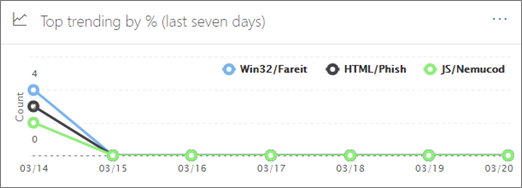

# Threat Trackers - New and NoteworthyThreat Trackers - New and Noteworthy

[!INCLUDE [Microsoft 365 Defender rebranding](../includes/microsoft-defender-for-office.md)]

**Si applica a****Applies to**
- [Microsoft Defender per Office 365 Piano 2Microsoft Defender for Office 365 plan 2](defender-for-office-365.md)
- [Microsoft 365 DefenderMicrosoft 365 Defender](../defender/microsoft-365-defender.md)

[Office 365 le funzionalità di indagine sulle](office-365-ti.md) minacce e di risposta consentono al team di sicurezza dell'organizzazione di individuare e intervenire contro le minacce alla cybersecurity.[Office 365 Threat Investigation and Response](office-365-ti.md) capabilities enable your organization's security team to discover and take action against cybersecurity threats. Office 365 Le funzionalità di indagine e risposta alle minacce includono le funzionalità di rilevamento delle minacce, inclusi i tracker degni di nota.Office 365 Threat Investigation and Response capabilities include Threat Tracker features, including Noteworthy trackers. Leggere questo articolo per ottenere una panoramica di queste nuove funzionalità e dei passaggi successivi.Read this article to get an overview of these new features and next steps.

> [!IMPORTANT]
> Office 365 Threat Intelligence è ora Microsoft Defender per Office 365 Piano 2, insieme ad altre funzionalità di protezione dalle minacce.Office 365 Threat Intelligence is now Microsoft Defender for Office 365 Plan 2, along with additional threat protection capabilities. Per altre informazioni, vedi [Microsoft Defender per Office 365 piani](https://products.office.com/exchange/advance-threat-protection) e prezzi e Microsoft Defender for Office 365 Service [Description.](/office365/servicedescriptions/office-365-advanced-threat-protection-service-description)To learn more, see [Microsoft Defender for Office 365 plans and pricing](https://products.office.com/exchange/advance-threat-protection) and the [Microsoft Defender for Office 365 Service Description](/office365/servicedescriptions/office-365-advanced-threat-protection-service-description).

## Che cos'è Threat Trackers?What are Threat Trackers?

Threat Trackers sono widget informativi e visualizzazioni che forniscono informazioni su diversi problemi di cybersecurity che potrebbero influire sulla tua azienda.Threat Trackers are informative widgets and views that provide you with intelligence on different cybersecurity issues that might impact your company. Ad esempio, puoi visualizzare informazioni sulle tendenze delle campagne antimalware usando Threat Trackers.For example, you can view information about trending malware campaigns using Threat Trackers.

La maggior parte delle pagine del tracker include numeri di tendenza che vengono aggiornati periodicamente, widget che  consentono di comprendere quali sono i problemi più grandi o sono aumentati di più e un collegamento rapido nella colonna Azioni che consente di accedere a Esplora risorse, dove è possibile visualizzare informazioni più dettagliate.Most tracker pages include trending numbers that are updated periodically, widgets to help you understand which issues are the biggest or have grown the most, and a quick link in the **Actions** column that takes you to Explorer, where you can view more detailed information.

I tracker sono solo alcune delle numerose funzionalità avanzate disponibili con Microsoft Defender per Office 365 [Piano 2.](office-365-ti.md)Trackers are just a few of the many great features you get with [Microsoft Defender for Office 365 Plan 2](office-365-ti.md). I tracker delle minacce includono [tracker noteworth,](#noteworthy-trackers) [tracker di](#trending-trackers)tendenza, [query](#tracked-queries)tracciate e [query salvate.](#saved-queries)Threat Trackers include [Noteworth trackers](#noteworthy-trackers), [Trending trackers](#trending-trackers), [Tracked queries](#tracked-queries), and [Saved queries](#saved-queries).

Per visualizzare e usare i tracker delle minacce per la tua organizzazione, vai al portale di Microsoft 365 Defender ( ) e scegli <https://security.microsoft.com> **Email & collaboration** \> **Threat tracker**.To view and use your Threat Trackers for your organization, go to the Microsoft 365 Defender portal (<https://security.microsoft.com>) and choose **Email & collaboration** \> **Threat tracker**.

> [!NOTE]
> Per usare Threat Trackers, devi essere un amministratore globale, un amministratore della sicurezza o un lettore di sicurezza.To use Threat Trackers, you must be a global administrator, security administrator, or security reader. Vedere [Autorizzazioni nel portale Microsoft 365 Defender](permissions-in-the-security-and-compliance-center.md).See [Permissions in the Microsoft 365 Defender portal](permissions-in-the-security-and-compliance-center.md).

### Tracker degni di notaNoteworthy trackers

I tracker degni di nota sono il punto in cui troverai minacce e rischi di grandi e più piccoli che pensiamo che dovresti conoscere.Noteworthy trackers are where you'll find big and smaller threats and risks that we think you should know about. I tracker degni di nota consentono di individuare se questi problemi sono presenti nell'ambiente di Microsoft 365, oltre a collegamenti ad articoli (come questo) che forniscono ulteriori dettagli su ciò che accade e su come inciderà sull'uso di Office 365 da parte dell'organizzazione.Noteworthy trackers help you find whether these issues exist in your Microsoft 365 environment, plus link to articles (like this one) that give you more details on what is happening, and how they'll impact your organization's use of Office 365. Sia che si tratta di una nuova grande minaccia (ad esempio Wannacry, Petya) o di una minaccia esistente che potrebbe creare nuove sfide (come l'altro elemento di noteworthy - Nemucod) è qui che troverai nuovi elementi importanti che tu e il team di sicurezza dovresti esaminare ed esaminare periodicamente.Whether it's a big new threat (e.g. Wannacry, Petya) or an existing threat that might create some new challenges (like our other inaugural Noteworthy item - Nemucod), this is where you'll find important new items you and your security team should review and examine periodically.

In genere, i tracker degni di nota verranno pubblicati solo per un paio di settimane quando vengono identificate nuove minacce e si pensa che potrebbe essere necessaria la visibilità aggiuntiva fornita da questa funzionalità.Typically Noteworthy trackers will be posted for just a couple of weeks when we identify new threats and think you might need the extra visibility that this feature provides. Una volta superato il rischio maggiore per una minaccia, rimuoveremo quell'elemento degna di nota.Once the biggest risk for a threat has passed, we'll remove that Noteworthy item. In questo modo, possiamo mantenere l'elenco aggiornato e aggiornato con altri nuovi elementi pertinenti.This way, we can keep the list fresh and up to date with other relevant new items.

### Tracker di tendenzaTrending trackers

I tracker di tendenza (in precedenza denominati campagne) evidenziano le nuove minacce ricevute nella posta elettronica dell'organizzazione nell'ultima settimana.Trending trackers (formerly called Campaigns) highlight new threats received in your organization's email in the past week.

I tracker di tendenza offrono un'idea delle nuove minacce da esaminare per garantire che l'ambiente aziendale più ampio sia preparato contro gli attacchi.Trending trackers give you an idea of new threats you should review to ensure your broader corporate environment is prepared against attacks.

### Query rilevateTracked queries

Le query rilevate sfruttano le query salvate per valutare periodicamente Microsoft 365 attività nell'organizzazione.Tracked queries leverage your saved queries to periodically assess Microsoft 365 activity in your organization. In questo modo, verranno fornite le tendenze degli eventi, con altre informazioni che verranno fornite nei prossimi mesi.This gives you event trending, with more to come in the coming months. Le query rilevate vengono eseguite automaticamente, fornendo informazioni aggiornate senza dover ricordare di eseguire di nuovo le query.Tracked queries run automatically, giving you up-to-date information without having to remember to re-run your queries.

### Query salvateSaved queries

Le query salvate sono disponibili anche nella sezione Tracker.Saved queries are also found in the Trackers section. È possibile utilizzare le query salvate per archiviare le ricerche comuni di Esplora risorse che si desidera tornare più velocemente e ripetutamente, senza dover creare di nuovo la ricerca ogni volta.You can use Saved queries to store the common Explorer searches that you want to get back to quicker and repeatedly, without having to re-create the search every time.

Puoi sempre salvare una query di rilevamento degna di nota o una delle tue query di Explorer usando il pulsante Salva **query** nella parte superiore della pagina Esplora risorse.You can always save a Noteworthy tracker query or any of your own Explorer queries using the **Save query** button at the top of the Explorer page. Tutti gli elementi salvati verranno visualizzati **nell'elenco Query** salvate nella pagina Tracker.Anything saved there will show up in the **Saved queries** list on the Tracker page.

## Tracker ed Esplora risorseTrackers and Explorer

Sia che si riveda la posta elettronica, il contenuto o le attività Office (presto disponibile), Explorer e Tracker lavorano insieme per analizzare e tenere traccia dei rischi e delle minacce per la sicurezza.Whether you're reviewing email, content, or Office activities (coming soon), Explorer and Trackers work together to help you investigate and track security risks and threats. Tutti insieme, i tracker forniscono informazioni per proteggere gli utenti evidenziando nuovi problemi, importanti e ricercati di frequente, assicurando che l'azienda sia protetta meglio durante il suo spostamento nel cloud.All together, Trackers provide you with information to protect your users by highlighting new, notable, and frequently searched issues - ensuring your business is better protected as it moves to the cloud.

Ricorda che puoi sempre fornire feedback su questa o altre funzionalità di sicurezza Microsoft 365 facendo clic sul **pulsante Feedback** nell'angolo in basso a destra.And remember that you can always provide us feedback on this or other Microsoft 365 security features by clicking on the **Feedback** button in the lower-right corner.

## Tracker e Microsoft Defender per Office 365Trackers and Microsoft Defender for Office 365

Con la nostra minaccia degna di nota, stiamo evidenziando le minacce malware avanzate rilevate [dagli allegati sicuri.](safe-attachments.md)With our inaugural Noteworthy threat, we're highlighting advanced malware threats detected by [Safe Attachments](safe-attachments.md). Se sei un cliente Office 365 Enterprise E5 e non stai usando [Microsoft Defender per Office 365](defender-for-office-365.md), dovresti essere - è incluso nell'abbonamento.If you're an Office 365 Enterprise E5 customer and you're not using [Microsoft Defender for Office 365](defender-for-office-365.md), you should be - it's included in your subscription. Defender for Office 365 offre valore anche se hai altri strumenti di sicurezza che filtrano il flusso di posta elettronica con i servizi Office 365 sicurezza.Defender for Office 365 provides value even if you have other security tools filtering email flow with your Office 365 services. Tuttavia, le funzionalità di [protezione](safe-links.md) da posta indesiderata e collegamenti sicuri funzionano meglio quando la soluzione di sicurezza della posta elettronica principale è Office 365.However, anti-spam and [Safe Links](safe-links.md) features work best when your main email security solution is through Office 365.

Nel mondo odierno pieno di minacce, eseguire solo analisi antimalware tradizionali significa che non sei abbastanza protetto dagli attacchi.In today's threat-riddled world, running only traditional anti-malware scans means you are not protected well enough against attacks. Gli utenti malintenzionati più sofisticati usano strumenti comunemente disponibili per creare nuovi attacchi offuscati o ritardati che non verranno riconosciuti dai tradizionali motori antimalware basati su firma.Today's more sophisticated attackers use commonly available tools to create new, obfuscated, or delayed attacks that won't be recognized by traditional signature-based anti-malware engines. La funzionalità Allegati sicuri accetta allegati di posta elettronica e li fa detonare in un ambiente virtuale per determinare se sono sicuri o dannosi.The Safe Attachments feature takes email attachments and detonates them in a virtual environment to determine whether they're safe or malicious. Questo processo di detonazione apre ogni file in un ambiente di computer virtuale, quindi osserva cosa accade dopo l'apertura del file.This detonation process opens each file in a virtual computer environment, then watches what happens after the file is opened. Sia che si tratta di un file PDF, compresso o di un documento Office, il codice dannoso può essere nascosto in un file, attivando solo una volta che la vittima lo apre sul computer.Whether it's a PDF, and compressed file, or an Office document, malicious code can be hidden in a file, activating only once the victim opens it on their computer. Detonando e analizzando il file nel flusso di posta elettronica, le funzionalità di Defender per Office 365 individuano queste minacce in base ai comportamenti, alla reputazione dei file e a una serie di regole euristiche.By detonating and analyzing the file in the email flow, Defender for Office 365 capabilities finds these threats based on behaviors, file reputation, and a number of heuristic rules.

Il nuovo filtro delle minacce degne di nota evidenzia gli elementi rilevati di recente tramite allegati sicuri.The new Noteworthy threat filter highlights items that were recently detected through Safe Attachments. Questi rilevamenti rappresentano gli elementi che sono nuovi file dannosi, non trovati in precedenza da Microsoft 365 nel flusso di posta elettronica o nella posta elettronica di altri clienti.These detections represent items that are new malicious files, not previously found by Microsoft 365 in either your email flow or other customers' email. Presta attenzione agli elementi in Noteworthy Threat Tracker, vedi chi è stato preso di mira da loro ed esamina i dettagli della detonazione mostrati nella scheda Analisi avanzata (che si trova facendo clic sull'oggetto del messaggio di posta elettronica in Esplora risorse).Pay attention to the items in the Noteworthy Threat Tracker, see who was targeted by them, and review the detonation details shown on the Advanced Analysis tab (found by clicking on the subject of the email in Explorer). Nota questa scheda è disponibile solo nei messaggi di posta elettronica rilevati dalla funzionalità Allegati sicuri: questo strumento di monitoraggio degna di nota include tale filtro, ma puoi anche usare tale filtro per altre ricerche in Esplora risorse.Note you'll only find this tab on emails detected by the Safe Attachments capability - this Noteworthy tracker includes that filter, but you can also use that filter for other searches in Explorer.

## Passaggi successiviNext steps

- Se l'organizzazione non dispone già di queste funzionalità Office 365 threat investigation e response, vedere [How do we get Office 365 Threat Investigation and Response capabilities?](office-365-ti.md).If your organization doesn't already have these Office 365 Threat Investigation and Response capabilities, see [How do we get Office 365 Threat Investigation and Response capabilities?](office-365-ti.md).

- Assicurarsi che al team di sicurezza siano assegnati i ruoli e le autorizzazioni corretti.Make sure that your security team has the correct roles and permissions assigned. È necessario essere un amministratore globale o disporre del ruolo Amministratore sicurezza o Ricerca ed eliminazione nel portale di Microsoft 365 Defender.You must be a global administrator, or have the Security Administrator or Search and Purge role assigned in the Microsoft 365 Defender portal. Vedere [Autorizzazioni nel portale Microsoft 365 Defender](permissions-in-the-security-and-compliance-center.md).See [Permissions in the Microsoft 365 Defender portal](permissions-in-the-security-and-compliance-center.md).

- Guarda i nuovi tracker da visualizzare nell'Microsoft 365 locale.Watch for the new Trackers to show up in your Microsoft 365 environment. Se disponibile, troverai i tracker [qui.](https://https://security.microsoft.com/)When available, you'll find your Trackers [here](https://https://security.microsoft.com/). Vai a **Email & collaboration** Threat \> **tracker**.Go to **Email & collaboration** \> **Threat tracker**.

- Se non l'hai già fatto, scopri di più su e configura Microsoft  [Defender](defender-for-office-365.md) per Office 365 per la tua organizzazione, inclusi collegamenti sicuri e [allegati sicuri.](safe-attachments.md)If you haven't already done so, learn more about and configure [Microsoft Defender for Office 365](defender-for-office-365.md) for your organization, including [Safe links](safe-links.md) and [Safe Attachments](safe-attachments.md).
