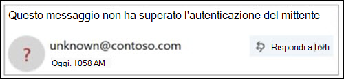

# Mittente non verificato

> [!NOTE]
> Questi aggiornamenti stanno per essere implementati e potrebbero non essere disponibili per tutti gli utenti. Questa funzionalità è supportata per gli utenti Desktop Enterprise Outlook.com e Enterprise Outlook Win32. Non è attualmente disponibile per gli utenti di Office 365 di consumer.

Per impedire ai messaggi di phishing di raggiungere la propria cassetta postale, Office 365 verifica che i mittenti siano quelli che dicono di essere e contrassegnare i messaggi sospetti come posta indesiderata.

> [!IMPORTANT]
> Quando un messaggio viene contrassegnato come truffa di phishing, in Outlook viene visualizzato un avviso nella parte superiore della pagina, ma è comunque possibile aprire qualsiasi collegamento del messaggio.

## Come è possibile identificare un messaggio sospetto nella cartella posta in arrivo?

Outlook Mostra gli indicatori quando il mittente di un messaggio non può essere identificato o la sua identità è diversa da quella visualizzata nell'indirizzo da.

## Viene visualizzato un'?' nell'immagine del mittente

Quando Office 365 non è in grado di verificare l'identità del mittente utilizzando tecniche di autenticazione della posta elettronica, nell'immagine del mittente viene visualizzato il messaggio "?".

Non tutti i messaggi che non sono in grado di eseguire l'autenticazione sono dannosi. Tuttavia, è necessario prestare particolare attenzione all'interazione con i messaggi che non eseguono l'autenticazione se non si riconosce il mittente. In alternativa, se si riconosce un mittente che in genere non ha un'?' nell'immagine del mittente, ma si inizia improvvisamente a vederlo, potrebbe essere un segno che il mittente viene falsificato.

## Come gestire i messaggi che ricevono il trattamento dei mittenti non verificati 

Se si è un cliente di Office 365, è possibile gestire questa funzionalità tramite il Centro sicurezza & conformità di Office 365.

- Nel centro sicurezza & conformità, gli amministratori globali o di sicurezza possono attivarla o disattivarla, tramite la protezione anti-spoofing in base ai criteri phishing. Inoltre, è possibile utilizzare il cmdlet **set-AntiPhishPolicy** in PowerShell di Exchange Online. Per informazioni dettagliate, vedere [protezione anti-phishing in Office 365](anti-phishing-protection.md) e [set-AntiPhishPolicy](https://docs.microsoft.com/powershell/module/exchange/advanced-threat-protection/set-antiphishpolicy).

    

- Se un amministratore ha identificato un falso positivo e un mittente non deve ricevere il trattamento del mittente non verificato, è possibile eseguire una delle operazioni seguenti per aggiungere il mittente all'elenco Consenti spoofing di informazioni spoof:

  - Aggiungere la coppia di domini tramite lo spoofing Intelligence Insight. Per informazioni dettagliate, vedere [procedura dettagliata: spoofing Intelligence Insight](walkthrough-spoof-intelligence-insight.md).

  - Aggiungere la coppia di domini tramite il cmdlet **set-PhishFilterPolicy** in PowerShell di Exchange Online. Per informazioni dettagliate, vedere [set-PhishFilterPolicy](https://docs.microsoft.com/powershell/module/exchange/advanced-threat-protection/set-phishfilterpolicy) e [set up Office 365 ATP anti-phishing and anti-phishing Policies](set-up-anti-phishing-policies.md).

Inoltre, non viene applicato il trattamento del mittente non verificato se il messaggio è stato recapitato alla posta in arrivo tramite le regole del flusso di posta (note anche come regole di trasporto) oppure l'elenco dei domini attendibili (criteri di protezione dalla posta indesiderata).

## Come gestire il tag ' via ' 

Se si è un cliente di Office 365, è possibile gestire questa funzionalità tramite il Centro sicurezza & conformità di Office 365, allo stesso modo in cui si gestisce il trattamento dei mittenti non verificati. Se si aggiunge il mittente all'elenco di consentiti spoofing Intelligence spoof, il trattamento ' via ' non verrà applicato.

## Domande frequenti

### Quali criteri utilizza Outlook.com e Outlook Win32 Desktop per aggiungere le proprietà'?' è via '?

Per '?' nell'immagine del mittente: Outlook.com richiede che il messaggio passi l'autenticazione SPF o DKIM e riceva un passaggio DMARC oppure un passaggio di autenticazione composita dall'intelligence spoof di Office 365. Per informazioni dettagliate, vedere [set up SPF in office 365 per impedire lo spoofing](set-up-spf-in-office-365-to-help-prevent-spoofing.md) e [utilizzare DKIM per convalidare la posta elettronica in uscita inviata dal dominio personalizzato in Office 365](use-dkim-to-validate-outbound-email.md).

Per il tag Via: se il dominio nell'indirizzo from è diverso dal dominio nella firma di DKIM o nella posta SMTP da, Outlook.com Visualizza il dominio in uno di questi due campi (preferendo la firma di DKIM).

### Come è possibile rimuovere il '?' senza utilizzare l'elenco di consentiti spoof di spoofing Intelligence?

Per il "?" nell'immagine del mittente: come mittente, è necessario autenticare il messaggio con SPF o DKIM.

Per il tag Via: come mittente, è necessario assicurarsi che il dominio nella firma di DKIM o la posta SMTP sia uguale a, o sia un sottodominio di, il dominio nell'indirizzo da.

### Le Outlook.com e il desktop di Outlook Win32 lo mostrano per ogni messaggio che non passa l'autenticazione?

Non necessariamente. Office 365 può avere altre proprietà all'interno del messaggio per autenticare il mittente.

## Argomenti correlati

[Proteggi il tuo account di posta elettronica di Outlook.com](https://support.office.com/article/a4f20fc5-4307-4ece-8231-6d4d4bd8a9ba)

[Gestione del phishing o dello spoofing in Outlook.com](https://support.office.com/article/0d882ea5-eedc-4bed-aebc-079ffa1105a3)

[Filtrare la posta indesiderata e la posta indesiderata in Outlook sul Web](https://support.office.com/article/db786e79-54e2-40cc-904f-d89d57b7f41d)
