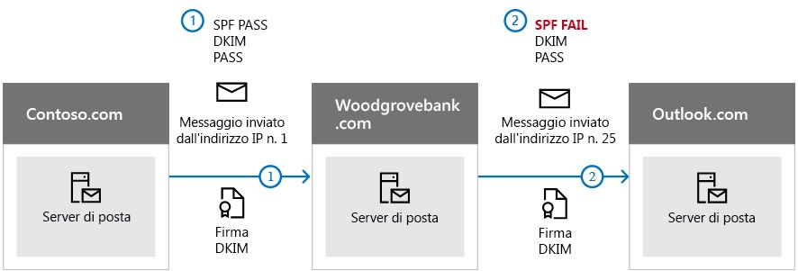

# <a name="use-dkim-to-validate-outbound-email-sent-from-your-custom-domain-in-office-365"></a><span data-ttu-id="2e362-103">Usare DKIM per convalidare la posta elettronica in uscita inviata dal dominio personalizzato in Office 365</span><span class="sxs-lookup"><span data-stu-id="2e362-103">Use DKIM to validate outbound email sent from your custom domain in Office 365</span></span>

 <span data-ttu-id="2e362-104">**Riepilogo:** in questo articolo viene descritto come usare DomainKeys Identified Mail (DKIM) insieme a Office 365 per essere certi che i sistemi di posta elettronica di destinazione ritengano attendibili i messaggi in uscita inviati dal dominio personalizzato.</span><span class="sxs-lookup"><span data-stu-id="2e362-104">**Summary:** This article describes how you use DomainKeys Identified Mail (DKIM) with Office 365 to ensure that destination email systems trust messages sent outbound from your custom domain.</span></span>
  
<span data-ttu-id="2e362-105">È necessario utilizzare DKIM in aggiunta a SPF e DMARC per impedire agli spoofer di inviare messaggi che sembrano provenire dal proprio dominio.</span><span class="sxs-lookup"><span data-stu-id="2e362-105">You should use DKIM in addition to SPF and DMARC to help prevent spoofers from sending messages that look like they are coming from your domain.</span></span> <span data-ttu-id="2e362-106">DKIM consente di aggiungere una firma digitale nell'intestazione dei messaggi di posta elettronica in uscita.</span><span class="sxs-lookup"><span data-stu-id="2e362-106">DKIM lets you add a digital signature to outbound email messages in the message header.</span></span> <span data-ttu-id="2e362-107">Non è complicato come sembra.</span><span class="sxs-lookup"><span data-stu-id="2e362-107">It may sound complicated, but it's really not.</span></span> <span data-ttu-id="2e362-108">Quando si configura DKIM, il dominio viene autorizzato ad associare (oppure firmare) il proprio nome ai messaggi di posta elettronica utilizzando l'autenticazione di crittografia.</span><span class="sxs-lookup"><span data-stu-id="2e362-108">When you configure DKIM, you authorize your domain to associate, or sign, its name to an email message by using cryptographic authentication.</span></span> <span data-ttu-id="2e362-109">I sistemi di posta elettronica che ricevono messaggi dal dominio dell'utente possono utilizzare questa firma digitale per stabilire la legittimità del messaggio ricevuto.</span><span class="sxs-lookup"><span data-stu-id="2e362-109">Email systems that receive email from your domain can use this digital signature to help determine if incoming email that they receive is legitimate.</span></span>
  
<span data-ttu-id="2e362-110">In sostanza, si utilizza una chiave privata per crittografare l'intestazione nel messaggio di posta elettronica in uscita dal proprio dominio.</span><span class="sxs-lookup"><span data-stu-id="2e362-110">Basically, you use a private key to encrypt the header in your domain's outgoing email.</span></span> <span data-ttu-id="2e362-111">Nei record DNS del dominio viene pubblicata una chiave pubblica utilizzata dai server di ricezione per decodificare la firma.</span><span class="sxs-lookup"><span data-stu-id="2e362-111">You publish a public key to your domain's DNS records that receiving servers can then use to decode the signature.</span></span> <span data-ttu-id="2e362-112">La chiave pubblica viene usata per verificare che i messaggi provengano realmente dall'utente e non da qualche operazione di *spoofing* in atto nel dominio.</span><span class="sxs-lookup"><span data-stu-id="2e362-112">They use the public key to verify that the messages are really coming from you and not coming from someone *spoofing* your domain.</span></span>
  
<span data-ttu-id="2e362-113">Office 365 configura automaticamente DKIM per i domini "onmicrosoft.com" iniziali.</span><span class="sxs-lookup"><span data-stu-id="2e362-113">Office 365 automatically sets up DKIM for its initial 'onmicrosoft.com' domains.</span></span> <span data-ttu-id="2e362-114">Questo vuol dire che non è necessario eseguire alcuna operazione per configurare DKIM per il nome di dominio iniziale (ad es.</span><span class="sxs-lookup"><span data-stu-id="2e362-114">That means you don't need to do anything to set up DKIM for any initial domain names (ex.</span></span> <span data-ttu-id="2e362-115">litware.onmicrosoft.com).</span><span class="sxs-lookup"><span data-stu-id="2e362-115">litware.onmicrosoft.com).</span></span> <span data-ttu-id="2e362-116">Per ulteriori informazioni sui domini, vedere [Domande frequenti sui domini](https://support.office.com/article/Domains-FAQ-1272bad0-4bd4-4796-8005-67d6fb3afc5a#bkmk_whydoihaveanonmicrosoft.comdomain).</span><span class="sxs-lookup"><span data-stu-id="2e362-116">For more information about domains, see [Domains FAQ](https://support.office.com/article/Domains-FAQ-1272bad0-4bd4-4796-8005-67d6fb3afc5a#bkmk_whydoihaveanonmicrosoft.comdomain).</span></span>

<span data-ttu-id="2e362-117">È possibile scegliere di non eseguire nessuna operazione su DKIM anche per il dominio personalizzato.</span><span class="sxs-lookup"><span data-stu-id="2e362-117">You can choose to do nothing about DKIM for your custom domain too.</span></span> <span data-ttu-id="2e362-118">Se non si configura DKIM per il dominio personalizzato, Office 365 crea una coppia di chiave pubblica e privata, abilita la firma DKIM e configura il criterio predefinito di Office 365 per il dominio personalizzato.</span><span class="sxs-lookup"><span data-stu-id="2e362-118">If you don't set up DKIM for your custom domain, Office 365 creates a private and public key pair, enables DKIM signing, and then configures the Office 365 default policy for your custom domain.</span></span> <span data-ttu-id="2e362-119">Sebbene questa configurazione sia sufficiente per la maggior parte dei clienti di Office 365, è necessario configurare manualmente la chiave DKIM per il dominio personalizzato nei casi seguenti:</span><span class="sxs-lookup"><span data-stu-id="2e362-119">While this is sufficient coverage for most Office 365 customers, you should manually configure DKIM for your custom domain in the following circumstances:</span></span>
  
- <span data-ttu-id="2e362-120">Sono disponibili più domini personalizzati in Office 365</span><span class="sxs-lookup"><span data-stu-id="2e362-120">You have more than one custom domain in Office 365</span></span>

- <span data-ttu-id="2e362-121">Si intende configurare anche DMARC (consigliato)</span><span class="sxs-lookup"><span data-stu-id="2e362-121">You're going to set up DMARC too (recommended)</span></span>

- <span data-ttu-id="2e362-122">Si desidera gestire la chiave privata</span><span class="sxs-lookup"><span data-stu-id="2e362-122">You want control over your private key</span></span>

- <span data-ttu-id="2e362-123">Si desidera personalizzare i record CNAME</span><span class="sxs-lookup"><span data-stu-id="2e362-123">You want to customize your CNAME records</span></span>

- <span data-ttu-id="2e362-124">Si configurano le chiavi DKIM per la posta elettronica creata da un dominio di terze parti, ad esempio, un mailer di massa di terze parti.</span><span class="sxs-lookup"><span data-stu-id="2e362-124">You want to set up DKIM keys for email originating out of a third-party domain, for example, if you use a third-party bulk mailer.</span></span>

<span data-ttu-id="2e362-125">Contenuto dell'articolo:</span><span class="sxs-lookup"><span data-stu-id="2e362-125">In this article:</span></span>
  
- [<span data-ttu-id="2e362-126">In che modo DKIM è più efficace di SPF per impedire lo spoofing dannoso in Office 365</span><span class="sxs-lookup"><span data-stu-id="2e362-126">How DKIM works better than SPF alone to prevent malicious spoofing in Office 365</span></span>](use-dkim-to-validate-outbound-email.md#HowDKIMWorks)

- [<span data-ttu-id="2e362-127">Aggiornare manualmente le chiavi a 1024 bit in chiavi di crittografia DKIM a 2048 bit</span><span class="sxs-lookup"><span data-stu-id="2e362-127">Manually upgrade your 1024-bit keys to 2048-bit DKIM encryption keys</span></span>](use-dkim-to-validate-outbound-email.md#1024to2048DKIM)

- [<span data-ttu-id="2e362-128">Operazioni necessarie per configurare manualmente DKIM in Office 365</span><span class="sxs-lookup"><span data-stu-id="2e362-128">Steps you need to do to manually set up DKIM in Office 365</span></span>](use-dkim-to-validate-outbound-email.md#SetUpDKIMO365)

- [<span data-ttu-id="2e362-129">Per configurare DKIM per più domini personalizzati in Office 365</span><span class="sxs-lookup"><span data-stu-id="2e362-129">To configure DKIM for more than one custom domain in Office 365</span></span>](use-dkim-to-validate-outbound-email.md#DKIMMultiDomain)

- [<span data-ttu-id="2e362-130">Disabilitazione del criterio di firma DKIM per un dominio personalizzato di Office 365</span><span class="sxs-lookup"><span data-stu-id="2e362-130">Disabling the DKIM signing policy for a custom domain in Office 365</span></span>](use-dkim-to-validate-outbound-email.md#DisableDKIMSigningPolicy)

- [<span data-ttu-id="2e362-131">Comportamento predefinito per DKIM e Office 365</span><span class="sxs-lookup"><span data-stu-id="2e362-131">Default behavior for DKIM and Office 365</span></span>](use-dkim-to-validate-outbound-email.md#DefaultDKIMbehavior)

- [<span data-ttu-id="2e362-132">Configurare DKIM in modo che un servizio di terze parti possa inviare la posta elettronica o effettuarne lo spoofing per conto del dominio personalizzato dell'utente</span><span class="sxs-lookup"><span data-stu-id="2e362-132">Set up DKIM so that a third-party service can send, or spoof, email on behalf of your custom domain</span></span>](use-dkim-to-validate-outbound-email.md#SetUp3rdPartyspoof)

- [<span data-ttu-id="2e362-133">Passaggi successivi: Dopo aver configurato DKIM per Office 365</span><span class="sxs-lookup"><span data-stu-id="2e362-133">Next steps: After you set up DKIM for Office 365</span></span>](use-dkim-to-validate-outbound-email.md#DKIMNextSteps)

> [!NOTE]
> <span data-ttu-id="2e362-134">Microsoft 365 supporta l'uso di chiavi DKIM a 1024 o 2048 bit.</span><span class="sxs-lookup"><span data-stu-id="2e362-134">Microsoft 365 supports the user of either 1024- or 2048-bit DKIM.</span></span> <span data-ttu-id="2e362-135">Se si usano chiavi a 1024 bit e si vuole passare ai 2048 bit, in questo articolo è illustrata la procedura di modifica (rotazione) della configurazione di firma DKIM.</span><span class="sxs-lookup"><span data-stu-id="2e362-135">If you're using 1024- and want to configure 2048-bit DKIM stay tuned for steps to rotate your DKIM signing configuration in this article.</span></span> <span data-ttu-id="2e362-136">Entro la fine del 2019, Microsoft supporterà le chiavi a 2048 bit per impostazione predefinita per tutti i clienti.</span><span class="sxs-lookup"><span data-stu-id="2e362-136">By the end of 2019, Microsoft will support 2048-bit keys by default, for all customers.</span></span> 

## <a name="how-dkim-works-better-than-spf-alone-to-prevent-malicious-spoofing-in-office-365"></a><span data-ttu-id="2e362-137">In che modo DKIM è più efficace di SPF per impedire lo spoofing dannoso in Office 365</span><span class="sxs-lookup"><span data-stu-id="2e362-137">How DKIM works better than SPF alone to prevent malicious spoofing in Office 365</span></span>
<span data-ttu-id="2e362-138"><a name="HowDKIMWorks"> </a></span><span class="sxs-lookup"><span data-stu-id="2e362-138"><a name="HowDKIMWorks"> </a></span></span>

<span data-ttu-id="2e362-p106">SPF consente di aggiungere informazioni alla busta del messaggio, ma DKIM esegue la crittografia di una firma all'interno dell'intestazione del messaggio. Quando si inoltra un messaggio, alcune parti della busta possono essere eliminate dal server di inoltro. Dal momento che la firma digitale rimane unita al messaggio di posta elettronica perché fa parte dell'intestazione, DKIM funziona anche quando un messaggio è stato inoltrato come mostrato nell'esempio seguente.</span><span class="sxs-lookup"><span data-stu-id="2e362-p106">SPF adds information to a message envelope but DKIM actually encrypts a signature within the message header. When you forward a message, portions of that message's envelope can be stripped away by the forwarding server. Since the digital signature stays with the email message because it's part of the email header, DKIM works even when a message has been forwarded as shown in the following example.</span></span>
  

  
<span data-ttu-id="2e362-p107">In questo esempio, se è stato pubblicato soltanto un record SPF TXT per il dominio, il server di posta del mittente avrebbe potuto contrassegnare la posta come indesiderata e generare un risultato falso positivo. L'aggiunta di DKIM in questo scenario riduce i rapporti spam falsi positivi. Dal momento che DKIM si affida alla crittografia della chiave pubblica per eseguire l'autenticazione e non soltanto agli indirizzi IP, la chiave DKIM è considerata come una forma di autenticazione più affidabile rispetto a SPF. È opportuno utilizzare sia SPF che DKIM e DMARC nella propria distribuzione.</span><span class="sxs-lookup"><span data-stu-id="2e362-p107">In this example, if you had only published an SPF TXT record for your domain, the recipient's mail server could have marked your email as spam and generated a false positive result. The addition of DKIM in this scenario reduces false positive spam reporting. Because DKIM relies on public key cryptography to authenticate and not just IP addresses, DKIM is considered a much stronger form of authentication than SPF. We recommend using both SPF and DKIM, as well as DMARC in your deployment.</span></span>
  
<span data-ttu-id="2e362-p108">In sostanza, DKIM utilizza una chiave privata per inserire una firma crittografata all'interno delle intestazioni dei messaggi. Il dominio di firma o dominio di uscita viene inserito come valore del campo **d=** nell'intestazione. Il dominio di verifica o dominio del destinatario utilizza il campo **d=** per cercare la chiave pubblica dal DNS ed esegue l'autenticazione del messaggio. Se il messaggio viene verificato, i controlli DKIM hanno esito positivo.</span><span class="sxs-lookup"><span data-stu-id="2e362-p108">The nitty gritty: DKIM uses a private key to insert an encrypted signature into the message headers. The signing domain, or outbound domain, is inserted as the value of the **d=** field in the header. The verifying domain, or recipient's domain, then use the **d=** field to look up the public key from DNS and authenticate the message. If the message is verified, the DKIM check passes.</span></span> 

## <a name="manually-upgrade-your-1024-bit-keys-to-2048-bit-dkim-encryption-keys"></a><span data-ttu-id="2e362-151">Aggiornare manualmente le chiavi a 1024 bit in chiavi di crittografia DKIM a 2048 bit</span><span class="sxs-lookup"><span data-stu-id="2e362-151">Manually upgrade your 1024-bit keys to 2048-bit DKIM encryption keys</span></span>
<span data-ttu-id="2e362-152"><a name="1024to2048DKIM"> </a></span><span class="sxs-lookup"><span data-stu-id="2e362-152"><a name="1024to2048DKIM"> </a></span></span>

<span data-ttu-id="2e362-153">Dal momento che sono supportate le chiavi di crittografia DKIM sia a 1024 che a 2048 bit, queste indicazioni sono per l'aggiornamento da 1024 bit a 2048.</span><span class="sxs-lookup"><span data-stu-id="2e362-153">Since both 1024 and 2048 bitness are supported for DKIM keys, these directions will tell you how to upgrade your 1024-bit key to 2048.</span></span> <span data-ttu-id="2e362-154">La procedure seguenti si riferiscono a due casi di utilizzo, scegliere quella più idonea alla configurazione in uso.</span><span class="sxs-lookup"><span data-stu-id="2e362-154">The steps below are for two use-cases, please choose the one that best fits your configuration.</span></span>

1. <span data-ttu-id="2e362-155">Quando **DKIM è già configurato**, per modificare (ruotare) il numero di bit procedere come indicato di seguito:</span><span class="sxs-lookup"><span data-stu-id="2e362-155">When you **already have DKIM configured**, you rotate bitness as follows:</span></span>
    1. <span data-ttu-id="2e362-156">[Connettersi ai carichi di lavoro di Office 365 tramite PowerShell](https://docs.microsoft.com/office365/enterprise/powershell/connect-to-all-office-365-services-in-a-single-windows-powershell-window).</span><span class="sxs-lookup"><span data-stu-id="2e362-156">[Connect to Office 365 workloads via PowerShell](https://docs.microsoft.com/office365/enterprise/powershell/connect-to-all-office-365-services-in-a-single-windows-powershell-window).</span></span> <span data-ttu-id="2e362-157">(Il cmdlet proviene da Exchange Online.)</span><span class="sxs-lookup"><span data-stu-id="2e362-157">(The cmdlet comes from Exchange Online.)</span></span>
    1. <span data-ttu-id="2e362-158">Eseguire quindi il cmdlet seguente:</span><span class="sxs-lookup"><span data-stu-id="2e362-158">And then execute the following cmdlet:</span></span>

<span data-ttu-id="2e362-159">&nbsp; &nbsp;&nbsp;&nbsp;&nbsp;&nbsp;&nbsp;&nbsp;&nbsp;`Rotate-DkimSigningConfig -KeySize 2048 -Identity {Guid of the existing Signing Config}`</span><span class="sxs-lookup"><span data-stu-id="2e362-159">&nbsp; &nbsp;&nbsp;&nbsp;&nbsp;&nbsp;&nbsp;&nbsp;&nbsp;`Rotate-DkimSigningConfig -KeySize 2048 -Identity {Guid of the existing Signing Config}`</span></span>

1. <span data-ttu-id="2e362-160">In alternativa, per una **nuova implementazione di DKIM**:</span><span class="sxs-lookup"><span data-stu-id="2e362-160">Or for a **new implementation of DKIM**:</span></span>
    1. <span data-ttu-id="2e362-161">[Connettersi ai carichi di lavoro di Office 365 tramite PowerShell](https://docs.microsoft.com/office365/enterprise/powershell/connect-to-all-office-365-services-in-a-single-windows-powershell-window).</span><span class="sxs-lookup"><span data-stu-id="2e362-161">[Connect to Office 365 workloads via PowerShell](https://docs.microsoft.com/office365/enterprise/powershell/connect-to-all-office-365-services-in-a-single-windows-powershell-window).</span></span> <span data-ttu-id="2e362-162">(Questo è un cmdlet di Exchange Online.)</span><span class="sxs-lookup"><span data-stu-id="2e362-162">(This is an Exchange Online cmdlet.)</span></span>
    1. <span data-ttu-id="2e362-163">Eseguire il cmdlet seguente:</span><span class="sxs-lookup"><span data-stu-id="2e362-163">Execute the following cmdlet:</span></span>

<span data-ttu-id="2e362-164">&nbsp; &nbsp;&nbsp;&nbsp;&nbsp;&nbsp;&nbsp;&nbsp;&nbsp; `New-DkimSigningConfig -DomainName {Domain for which config is to be created} -KeySize 2048 -Enabled $True`</span><span class="sxs-lookup"><span data-stu-id="2e362-164">&nbsp; &nbsp;&nbsp;&nbsp;&nbsp;&nbsp;&nbsp;&nbsp;&nbsp; `New-DkimSigningConfig -DomainName {Domain for which config is to be created} -KeySize 2048 -Enabled $True`</span></span>

<span data-ttu-id="2e362-165">Rimanere connessi a Office 365 per *verificare* la configurazione.</span><span class="sxs-lookup"><span data-stu-id="2e362-165">Stay connected to Office 365 to *verify* the configuration.</span></span>

2. <span data-ttu-id="2e362-166">Eseguire il cmdlet:</span><span class="sxs-lookup"><span data-stu-id="2e362-166">Execute the cmdlet:</span></span>

<span data-ttu-id="2e362-167">&nbsp; &nbsp;&nbsp;&nbsp;&nbsp;&nbsp;&nbsp;&nbsp;&nbsp; `Get-DkimSigningConfig | fl`</span><span class="sxs-lookup"><span data-stu-id="2e362-167">&nbsp; &nbsp;&nbsp;&nbsp;&nbsp;&nbsp;&nbsp;&nbsp;&nbsp; `Get-DkimSigningConfig | fl`</span></span>

> [!TIP]
><span data-ttu-id="2e362-168">Questa nuova chiave a 2048 bit verrà applicata in data RotateOnDate e, nel frattempo, i messaggi di posta elettronica verranno inviati con la chiave a 1024 bit.</span><span class="sxs-lookup"><span data-stu-id="2e362-168">This new 2048-bit key takes effect on the RotateOnDate, and will send emails with the 1024-bit key in the interim.</span></span> <span data-ttu-id="2e362-169">Dopo quattro giorni, ossia dopo l'applicazione della modifica al secondo selettore, è possibile eseguire di nuovo il test con la chiave a 2048 bit.</span><span class="sxs-lookup"><span data-stu-id="2e362-169">After four days, you can test again with the 2048-bit key (that is, once the rotation takes effect to the second selector).</span></span> 

<span data-ttu-id="2e362-170">Se si vuole ruotare il secondo selettore, le possibilità sono due. La prima è lasciare che sia il servizio Office 365 a ruotare il selettore ed eseguire l'aggiornamento ai 2048 bit nei 6 mesi successivi. La seconda è, dopo 4 giorni e dopo aver verificato che sia in uso la chiave a 2048 bit, ruotare manualmente il secondo selettore usando il cmdlet appropriato.</span><span class="sxs-lookup"><span data-stu-id="2e362-170">If you want to rotate to the second selector, your options are a) let the Office 365 service rotate the selector and upgrade to 2048-bitness within the next 6 months, or b) after 4 days and confirming that 2048-bitness is in use, manually rotate the second selector key by using the appropriate cmdlet listed above.</span></span>

## <a name="steps-you-need-to-do-to-manually-set-up-dkim-in-office-365"></a><span data-ttu-id="2e362-171">Operazioni necessarie per configurare manualmente DKIM in Office 365</span><span class="sxs-lookup"><span data-stu-id="2e362-171">Steps you need to do to manually set up DKIM in Office 365</span></span>
<span data-ttu-id="2e362-172"><a name="SetUpDKIMO365"> </a></span><span class="sxs-lookup"><span data-stu-id="2e362-172"><a name="SetUpDKIMO365"> </a></span></span>

<span data-ttu-id="2e362-173">Per configurare DKIM, eseguire la procedura seguente:</span><span class="sxs-lookup"><span data-stu-id="2e362-173">To configure DKIM, you will complete these steps:</span></span>
  
- [<span data-ttu-id="2e362-174">Pubblicare due record CNAME per il dominio personalizzato in DNS</span><span class="sxs-lookup"><span data-stu-id="2e362-174">Publish two CNAME records for your custom domain in DNS</span></span>](use-dkim-to-validate-outbound-email.md#Publish2CNAME)

- [<span data-ttu-id="2e362-175">Abilitare la firma DKIM per il dominio personalizzato in Office 365</span><span class="sxs-lookup"><span data-stu-id="2e362-175">Enable DKIM signing for your custom domain in Office 365</span></span>](use-dkim-to-validate-outbound-email.md#EnableDKIMinO365)

### <a name="publish-two-cname-records-for-your-custom-domain-in-dns"></a><span data-ttu-id="2e362-176">Pubblicare due record CNAME per il dominio personalizzato in DNS</span><span class="sxs-lookup"><span data-stu-id="2e362-176">Publish two CNAME records for your custom domain in DNS</span></span>
<span data-ttu-id="2e362-177"><a name="Publish2CNAME"> </a></span><span class="sxs-lookup"><span data-stu-id="2e362-177"><a name="Publish2CNAME"> </a></span></span>

<span data-ttu-id="2e362-178">Per ogni dominio al quale si intende aggiungere una firma DKIM in DNS è necessario pubblicare due record CNAME.</span><span class="sxs-lookup"><span data-stu-id="2e362-178">For each domain for which you want to add a DKIM signature in DNS, you need to publish two CNAME records.</span></span>

<span data-ttu-id="2e362-179">Eseguire i comandi indicati di seguito:</span><span class="sxs-lookup"><span data-stu-id="2e362-179">Run the following commands:</span></span>

```powershell
    New-DkimSigningConfig -DomainName <domain> -Enabled $false   
    Get-DkimSigningConfig -Identity <domain> | fl Selector1CNAME, Selector2CNAME
```

<span data-ttu-id="2e362-180">Creare record CNAME a cui viene fatto riferimento nell'output di Get-DkimSigningConfig</span><span class="sxs-lookup"><span data-stu-id="2e362-180">Create CNAMEs referenced in Get-DkimSigningConfig output</span></span>

```powershell
    Set-DkimSigningConfig -Identity <domain> -Enabled $true
```

<span data-ttu-id="2e362-181">I record CNAME nel DNS punteranno a record TXT DKIM già creati presenti nel DNS nei server DNS Microsoft per Office 365.</span><span class="sxs-lookup"><span data-stu-id="2e362-181">The CNAME records in your DNS will point to already created DKIM TXT records that exist in DNS on the Microsoft DNS servers for Office 365.</span></span>
  
<span data-ttu-id="2e362-p113">Office 365 esegue la rotazione automatica delle chiavi utilizzando due record indicati dall'utente. Se è stato eseguito il provisioning di domini personalizzati oltre al dominio iniziale in Office 365, è necessario pubblicare due record CNAME per ogni dominio aggiuntivo. Pertanto, se sono disponibili due domini, è necessario pubblicare altri due record CNAME e così via.</span><span class="sxs-lookup"><span data-stu-id="2e362-p113">Office 365 performs automatic key rotation using the two records that you establish. If you have provisioned custom domains in addition to the initial domain in Office 365, you must publish two CNAME records for each additional domain. So, if you have two domains, you must publish two additional CNAME records, and so on.</span></span>
  
<span data-ttu-id="2e362-185">Per i record CNAME, usare il formato seguente.</span><span class="sxs-lookup"><span data-stu-id="2e362-185">Use the following format for the CNAME records.</span></span>

> [!IMPORTANT]
> <span data-ttu-id="2e362-186">Per i clienti di GCC High, il _domainGuid_ viene calcolato in modo diverso.</span><span class="sxs-lookup"><span data-stu-id="2e362-186">If you are one of our GCC High customers, we calculate _domainGuid_ differently!</span></span> <span data-ttu-id="2e362-187">Per calcolare il _domainGuid_ non viene più cercato il record MX di _initialDomain_ ma viene calcolato direttamente dal dominio personalizzato.</span><span class="sxs-lookup"><span data-stu-id="2e362-187">Instead of looking up the MX record for your _initialDomain_ to calculate _domainGuid_, instead we calculate it directly from the customized domain.</span></span> <span data-ttu-id="2e362-188">Ad esempio, se il dominio personalizzato è "contoso.com" il domainGuid diventerà "contoso-com", ovvero i punti verranno sostituiti da un trattino.</span><span class="sxs-lookup"><span data-stu-id="2e362-188">For example, if your customized domain is "contoso.com" your domainGuid becomes "contoso-com", any periods are replaced with a dash.</span></span> <span data-ttu-id="2e362-189">Per questo motivo, indipendentemente dal record MX a cui punta initialDomain, si userà sempre il metodo riportato sopra per calcolare il domainGuid da usare nei record CNAME.</span><span class="sxs-lookup"><span data-stu-id="2e362-189">So, regardless of what MX record your initialDomain points to, you’ll always use the above method to calculate the domainGuid to use in your CNAME records.</span></span>

```text
Host name:          selector1._domainkey
Points to address or value: selector1-<domainGUID>._domainkey.<initialDomain> 
TTL:                3600

Host name:          selector2._domainkey
Points to address or value: selector2-<domainGUID>._domainkey.<initialDomain> 
TTL:                3600
```

<span data-ttu-id="2e362-190">Dove:</span><span class="sxs-lookup"><span data-stu-id="2e362-190">Where:</span></span>
  
- <span data-ttu-id="2e362-191">Per Office 365, i selettori saranno sempre "selector1" o "selector2".</span><span class="sxs-lookup"><span data-stu-id="2e362-191">For Office 365, the selectors will always be "selector1" or "selector2".</span></span>

- <span data-ttu-id="2e362-192">_domainGUID_ corrisponde al _domainGUID_ nel record MX personalizzato del dominio personalizzato visualizzato prima di mail.protection.outlook.com.</span><span class="sxs-lookup"><span data-stu-id="2e362-192">_domainGUID_ is the same as the _domainGUID_ in the customized MX record for your custom domain that appears before mail.protection.outlook.com.</span></span> <span data-ttu-id="2e362-193">Ad esempio, nel seguente record MX per il dominio contoso.com, il _domainGUID_ è contoso-com:</span><span class="sxs-lookup"><span data-stu-id="2e362-193">For example, in the following MX record for the domain contoso.com, the _domainGUID_ is contoso-com:</span></span> 
    
    ```text
    contoso.com.  3600  IN  MX   5 contoso-com.mail.protection.outlook.com
    ```

- <span data-ttu-id="2e362-194">_initialDomain_ è il dominio usato al momento dell'iscrizione a Office 365.</span><span class="sxs-lookup"><span data-stu-id="2e362-194">_initialDomain_ is the domain that you used when you signed up for Office 365.</span></span> <span data-ttu-id="2e362-195">I domini iniziali terminano sempre con onmicrosoft.com.</span><span class="sxs-lookup"><span data-stu-id="2e362-195">Initial domains always end in onmicrosoft.com.</span></span> <span data-ttu-id="2e362-196">Per informazioni su come determinare il dominio iniziale, vedere [Domande frequenti sui domini](https://support.office.com/article/1272bad0-4bd4-4796-8005-67d6fb3afc5a#bkmk_whydoihaveanonmicrosoft.comdomain).</span><span class="sxs-lookup"><span data-stu-id="2e362-196">For information about determining your initial domain, see [Domains FAQ](https://support.office.com/article/1272bad0-4bd4-4796-8005-67d6fb3afc5a#bkmk_whydoihaveanonmicrosoft.comdomain).</span></span>

<span data-ttu-id="2e362-197">Ad esempio, se si dispone di un dominio iniziale di cohovineyardandwinery.onmicrosoft.com e di due domini personalizzati cohovineyard.com e cohowinery.com, è necessario configurare due record CNAME per ogni dominio aggiuntivo, per un totale di quattro record CNAME.</span><span class="sxs-lookup"><span data-stu-id="2e362-197">For example, if you have an initial domain of cohovineyardandwinery.onmicrosoft.com, and two custom domains cohovineyard.com and cohowinery.com, you would need to set up two CNAME records for each additional domain, for a total of four CNAME records.</span></span>
  
```text
Host name:          selector1._domainkey
Points to address or value: selector1-cohovineyard-com._domainkey.cohovineyardandwinery.onmicrosoft.com
TTL:                3600

Host name:          selector2._domainkey
Points to address or value: selector2-cohovineyard-com._domainkey.cohovineyardandwinery.onmicrosoft.com
TTL:                3600

Host name:          selector1._domainkey
Points to address or value: selector1-cohowinery-com._domainkey.cohovineyardandwinery.onmicrosoft.com 
TTL:                3600

Host name:          selector2._domainkey
Points to address or value: selector2-cohowinery-com._domainkey.cohovineyardandwinery.onmicrosoft.com 
TTL:                3600
```

### <a name="enable-dkim-signing-for-your-custom-domain-in-office-365"></a><span data-ttu-id="2e362-198">Abilitare la firma DKIM per il dominio personalizzato in Office 365</span><span class="sxs-lookup"><span data-stu-id="2e362-198">Enable DKIM signing for your custom domain in Office 365</span></span>
<span data-ttu-id="2e362-199"><a name="EnableDKIMinO365"> </a></span><span class="sxs-lookup"><span data-stu-id="2e362-199"><a name="EnableDKIMinO365"> </a></span></span>

<span data-ttu-id="2e362-200">Dopo aver pubblicato i record CNAME in DNS, è possibile abilitare la firma DKIM tramite Office 365.</span><span class="sxs-lookup"><span data-stu-id="2e362-200">Once you have published the CNAME records in DNS, you are ready to enable DKIM signing through Office 365.</span></span> <span data-ttu-id="2e362-201">È possibile eseguire questa operazione tramite l'interfaccia di amministrazione di Microsoft 365 oppure con PowerShell.</span><span class="sxs-lookup"><span data-stu-id="2e362-201">You can do this either through the Microsoft 365 admin center or by using PowerShell.</span></span>
  
#### <a name="to-enable-dkim-signing-for-your-custom-domain-through-the-admin-center"></a><span data-ttu-id="2e362-202">Per abilitare la firma DKIM del dominio personalizzato tramite l'interfaccia di amministrazione</span><span class="sxs-lookup"><span data-stu-id="2e362-202">To enable DKIM signing for your custom domain through the admin center</span></span>

1. <span data-ttu-id="2e362-203">[Accedere a Office 365](https://support.office.microsoft.com/article/e9eb7d51-5430-4929-91ab-6157c5a050b4) con l'account aziendale o dell'istituto di istruzione.</span><span class="sxs-lookup"><span data-stu-id="2e362-203">[Sign in to Office 365](https://support.office.microsoft.com/article/e9eb7d51-5430-4929-91ab-6157c5a050b4) with your work or school account.</span></span> 

2. <span data-ttu-id="2e362-204">Selezionare l'icona di avvio delle app in alto a sinistra e scegliere **Amministratore**.</span><span class="sxs-lookup"><span data-stu-id="2e362-204">Select the app launcher icon in the upper-left and choose **Admin**.</span></span>

3. <span data-ttu-id="2e362-205">Nel riquadro di spostamento in basso a sinistra, espandere **Amministrazione** e scegliere **Exchange**.</span><span class="sxs-lookup"><span data-stu-id="2e362-205">In the lower-left navigation, expand **Admin** and choose **Exchange**.</span></span>

4. <span data-ttu-id="2e362-206">Accedere a **Protezione** \> **dkim**.</span><span class="sxs-lookup"><span data-stu-id="2e362-206">Go to **Protection** \> **dkim**.</span></span>

5. <span data-ttu-id="2e362-p118">Selezionare il dominio per il quale si desidera abilitare DKIM, quindi, in **Firma i messaggi per questo dominio con firme DKIM** scegliere **Abilita**. Ripetere questo passaggio per ogni dominio personalizzato.</span><span class="sxs-lookup"><span data-stu-id="2e362-p118">Select the domain for which you want to enable DKIM and then, for **Sign messages for this domain with DKIM signatures**, choose **Enable**. Repeat this step for each custom domain.</span></span>

#### <a name="to-enable-dkim-signing-for-your-custom-domain-by-using-powershell"></a><span data-ttu-id="2e362-209">Per abilitare la firma DKIM del dominio personalizzato usando PowerShell</span><span class="sxs-lookup"><span data-stu-id="2e362-209">To enable DKIM signing for your custom domain by using PowerShell</span></span>

1. <span data-ttu-id="2e362-210">[Connettersi a PowerShell per Exchange Online](https://technet.microsoft.com/library/jj984289.aspx).</span><span class="sxs-lookup"><span data-stu-id="2e362-210">[Connect to Exchange Online PowerShell](https://technet.microsoft.com/library/jj984289.aspx).</span></span>

2. <span data-ttu-id="2e362-211">Eseguire il comando riportato di seguito:</span><span class="sxs-lookup"><span data-stu-id="2e362-211">Run the following command:</span></span>

    ```powershell
    Set-DkimSigningConfig -Identity <domain> -Enabled $true
    ```

   <span data-ttu-id="2e362-212">Dove _domain_ è il nome del dominio personalizzato per cui si vuole abilitare la firma DKIM.</span><span class="sxs-lookup"><span data-stu-id="2e362-212">Where _domain_ is the name of the custom domain that you want to enable DKIM signing for.</span></span> 

   <span data-ttu-id="2e362-213">Ad esempio, per domain contoso.com:</span><span class="sxs-lookup"><span data-stu-id="2e362-213">For example, for the domain contoso.com:</span></span>

    ```powershell
    Set-DkimSigningConfig -Identity contoso.com -Enabled $true
    ```

#### <a name="to-confirm-dkim-signing-is-configured-properly-for-office-365"></a><span data-ttu-id="2e362-214">Per confermare che la firma DKIM sia configurata in modo corretto in Office 365</span><span class="sxs-lookup"><span data-stu-id="2e362-214">To Confirm DKIM signing is configured properly for Office 365</span></span>

<span data-ttu-id="2e362-p119">Attendere qualche minuto prima di effettuare i passaggi seguenti e confermare di aver configurato DKIM in modo corretto. In questo modo, le informazioni DKIM sul dominio possono essere distribuite nella rete.</span><span class="sxs-lookup"><span data-stu-id="2e362-p119">Wait a few minutes before you follow these steps to confirm that you have properly configured DKIM. This allows time for the DKIM information about the domain to be spread throughout the network.</span></span>
  
- <span data-ttu-id="2e362-217">Inviare un messaggio da un account incluso nel dominio Office 365 con DKIM abilitato a un altro account di posta elettronica, ad esempio, outlook.com o Hotmail.com.</span><span class="sxs-lookup"><span data-stu-id="2e362-217">Send a message from an account within your Office 365 DKIM-enabled domain to another email account such as outlook.com or Hotmail.com.</span></span>

- <span data-ttu-id="2e362-p120">Non utilizzare un account aol.com per effettuare test. AOL potrebbe ignorare il controllo DKIM se la verifica SPF ha esito positivo. In questo modo, il test verrebbe annullato.</span><span class="sxs-lookup"><span data-stu-id="2e362-p120">Do not use an aol.com account for testing purposes. AOL may skip the DKIM check if the SPF check passes. This will nullify your test.</span></span>

- <span data-ttu-id="2e362-p121">Aprire il messaggio e osservare l'intestazione. Le istruzioni per visualizzare l'intestazione del messaggio variano in base al client di messaggistica usato. Per istruzioni sulla visualizzazione delle intestazioni dei messaggi in Outlook, vedere [Visualizzare le intestazioni dei messaggi di posta elettronica](https://support.office.com/article/CD039382-DC6E-4264-AC74-C048563D212C).</span><span class="sxs-lookup"><span data-stu-id="2e362-p121">Open the message and look at the header. Instructions for viewing the header for the message will vary depending on your messaging client. For instructions on viewing message headers in Outlook, see [View e-mail message headers](https://support.office.com/article/CD039382-DC6E-4264-AC74-C048563D212C).</span></span>

  <span data-ttu-id="2e362-p122">Il messaggio con firma DKIM conterrà il nome host e il dominio definiti durante la pubblicazione delle voci CNAME. Il messaggio avrà un aspetto analogo a quello riportato nell'esempio:</span><span class="sxs-lookup"><span data-stu-id="2e362-p122">The DKIM-signed message will contain the host name and domain you defined when you published the CNAME entries. The message will look something like this example:</span></span>

  ```text
    From: Example User <example@contoso.com>
    DKIM-Signature: v=1; a=rsa-sha256; q=dns/txt; c=relaxed/relaxed;
        s=selector1; d=contoso.com; t=1429912795;
        h=From:To:Message-ID:Subject:MIME-Version:Content-Type;
        bh=<body hash>;
        b=<signed field>;
  ```

- <span data-ttu-id="2e362-p123">Cercare l'intestazione Authentication-Results. Anche se ogni servizio di ricezione utilizza un formato differente per indicare la posta in arrivo, il risultato deve includere **DKIM=pass** o **DKIM=OK**.</span><span class="sxs-lookup"><span data-stu-id="2e362-p123">Look for the Authentication-Results header. While each receiving service uses a slightly different format to stamp the incoming mail, the result should include something like **DKIM=pass** or **DKIM=OK**.</span></span>

## <a name="to-configure-dkim-for-more-than-one-custom-domain-in-office-365"></a><span data-ttu-id="2e362-228">Per configurare DKIM per più domini personalizzati in Office 365</span><span class="sxs-lookup"><span data-stu-id="2e362-228">To configure DKIM for more than one custom domain in Office 365</span></span>
<span data-ttu-id="2e362-229"><a name="DKIMMultiDomain"> </a></span><span class="sxs-lookup"><span data-stu-id="2e362-229"><a name="DKIMMultiDomain"> </a></span></span>

<span data-ttu-id="2e362-p124">Se in futuro si decide di aggiungere un altro dominio personalizzato e di abilitare DKIM, è necessario eseguire la procedura indicata in questo articolo per ogni dominio. In particolare, completare tutti i passaggi elencati in [Operazioni necessarie per configurare manualmente la chiave DKIM in Office 365](use-dkim-to-validate-outbound-email.md#SetUpDKIMO365).</span><span class="sxs-lookup"><span data-stu-id="2e362-p124">If at some point in the future you decide to add another custom domain and you want to enable DKIM for the new domain, you must complete the steps in this article for each domain. Specifically, complete all steps in [What you need to do to manually set up DKIM in Office 365](use-dkim-to-validate-outbound-email.md#SetUpDKIMO365).</span></span>
  
## <a name="disabling-the-dkim-signing-policy-for-a-custom-domain-in-office-365"></a><span data-ttu-id="2e362-232">Disabilitazione del criterio di firma DKIM per un dominio personalizzato di Office 365</span><span class="sxs-lookup"><span data-stu-id="2e362-232">Disabling the DKIM signing policy for a custom domain in Office 365</span></span>
<span data-ttu-id="2e362-233"><a name="DisableDKIMSigningPolicy"> </a></span><span class="sxs-lookup"><span data-stu-id="2e362-233"><a name="DisableDKIMSigningPolicy"> </a></span></span>

<span data-ttu-id="2e362-p125">La disabilitazione del criterio di firma non disattiva completamente DKIM. Dopo un periodo di tempo, Office 365 applicherà automaticamente il suo criterio predefinito al dominio. Per ulteriori informazioni vedere [Comportamento predefinito per DKIM e Office 365](use-dkim-to-validate-outbound-email.md#DefaultDKIMbehavior).</span><span class="sxs-lookup"><span data-stu-id="2e362-p125">Disabling the signing policy does not completely disable DKIM. After a period of time, Office 365 will automatically apply the default Office 365 policy for your domain. For more information, see [Default behavior for DKIM and Office 365](use-dkim-to-validate-outbound-email.md#DefaultDKIMbehavior).</span></span>
  
### <a name="to-disable-the-dkim-signing-policy-by-using-windows-powershell"></a><span data-ttu-id="2e362-237">Per disabilitare il criterio di firma DKIM usando Windows PowerShell</span><span class="sxs-lookup"><span data-stu-id="2e362-237">To disable the DKIM signing policy by using Windows PowerShell</span></span>

1. <span data-ttu-id="2e362-238">[Connettersi a PowerShell per Exchange Online](https://technet.microsoft.com/library/jj984289.aspx).</span><span class="sxs-lookup"><span data-stu-id="2e362-238">[Connect to Exchange Online PowerShell](https://technet.microsoft.com/library/jj984289.aspx).</span></span>

2. <span data-ttu-id="2e362-239">Eseguire uno dei comandi seguenti per ogni dominio per il quale si desidera disabilitare la firma DKIM.</span><span class="sxs-lookup"><span data-stu-id="2e362-239">Run one of the following commands for each domain for which you want to disable DKIM signing.</span></span>
    
    ```powershell
    $p = Get-DkimSigningConfig -Identity <domain>
    $p[0] | Set-DkimSigningConfig -Enabled $false
    ```
   
   <span data-ttu-id="2e362-240">Ad esempio:</span><span class="sxs-lookup"><span data-stu-id="2e362-240">For example:</span></span>
    
    ```powershell
    $p = Get-DkimSigningConfig -Identity contoso.com
    $p[0] | Set-DkimSigningConfig -Enabled $false
    ```

   <span data-ttu-id="2e362-241">Oppure</span><span class="sxs-lookup"><span data-stu-id="2e362-241">Or</span></span>
    
    ```powershell
    Set-DkimSigningConfig -Identity $p[<number>].Identity -Enabled $false
    ```

    <span data-ttu-id="2e362-242">Dove _number_ è l'indice del criterio.</span><span class="sxs-lookup"><span data-stu-id="2e362-242">Where _number_ is the index of the policy.</span></span> <span data-ttu-id="2e362-243">Ad esempio:</span><span class="sxs-lookup"><span data-stu-id="2e362-243">For example:</span></span>
    
    ```powershell
    Set-DkimSigningConfig -Identity $p[0].Identity -Enabled $false
    ```

## <a name="default-behavior-for-dkim-and-office-365"></a><span data-ttu-id="2e362-244">Comportamento predefinito per DKIM e Office 365</span><span class="sxs-lookup"><span data-stu-id="2e362-244">Default behavior for DKIM and Office 365</span></span>
<span data-ttu-id="2e362-245"><a name="DefaultDKIMbehavior"> </a></span><span class="sxs-lookup"><span data-stu-id="2e362-245"><a name="DefaultDKIMbehavior"> </a></span></span>

<span data-ttu-id="2e362-246">Se non si abilita DKIM, Office 365 crea automaticamente una chiave pubblica DKIM da 1024 bit per il dominio predefinito e la chiave privata associata, la quale viene archiviata nei datacenter Microsoft.</span><span class="sxs-lookup"><span data-stu-id="2e362-246">If you do not enable DKIM, Office 365 automatically creates a 1024-bit DKIM public key for your default domain and the associated private key which we store internally in our datacenter.</span></span> <span data-ttu-id="2e362-247">Per impostazione predefinita, Office 365 utilizza una configurazione di firma predefinita per i domini che non dispongono di un criterio.</span><span class="sxs-lookup"><span data-stu-id="2e362-247">By default, Office 365 uses a default signing configuration for domains that do not have a policy in place.</span></span> <span data-ttu-id="2e362-248">Ciò significa che se l'utente non configura DKIM, Office 365 utilizza il criterio predefinito e le chiavi create per abilitare DKIM nel dominio.</span><span class="sxs-lookup"><span data-stu-id="2e362-248">This means that if you do not set up DKIM yourself, Office 365 will use its default policy and keys it creates in order to enable DKIM for your domain.</span></span>
  
<span data-ttu-id="2e362-249">Inoltre, se si disabilita la firma DKIM dopo l'attivazione, Office 365 applica automaticamente (dopo un determinato periodo di tempo) il criterio predefinito di Office 365 per il dominio.</span><span class="sxs-lookup"><span data-stu-id="2e362-249">Also, if you disable DKIM signing after enabling it, after a period of time, Office 365 will automatically apply the Office 365 default policy for your domain.</span></span>
  
<span data-ttu-id="2e362-p128">Nell'esempio seguente, considerare che la chiave DKIM per fabrikam.com sia stata abilitata da Office 365 e non dall'amministratore del dominio. Questo errore indica che i record CNAME necessari non sono presenti nel sistema DNS. Le firme DKIM per i messaggi di posta elettronica provenienti dal dominio avranno un aspetto analogo al seguente:</span><span class="sxs-lookup"><span data-stu-id="2e362-p128">In the following example, suppose that DKIM for fabrikam.com was enabled by Office 365, not by the administrator of the domain. This means that the required CNAMEs do not exist in DNS. DKIM signatures for email from this domain will look something like this:</span></span>
  
```text
From: Second Example <second.example@fabrikam.com>
DKIM-Signature: v=1; a=rsa-sha256; q=dns/txt; c=relaxed/relaxed;
    s=selector1-fabrikam-com; d=contoso.onmicrosoft.com; t=1429912795;
    h=From:To:Message-ID:Subject:MIME-Version:Content-Type;
    bh=<body hash>;
    b=<signed field>;
```

<span data-ttu-id="2e362-p129">In questo caso, il nome host e il dominio includono i valori a cui dovrebbe puntare CNAME se la firma DKIM per fabrikam.com fosse stata abilitata dall'amministratore di dominio. Infine, ogni messaggio inviato da Office 365 sarà firmato con la chiave DKIM. Se la chiave DKIM è stata abilitata dall'utente, il dominio sarà identico a quello dell'indirizzo "Da:", in questo caso, fabrikam.com. In caso contrario, non verrà allineato e utilizzerà il dominio iniziale dell'organizzazione. Per informazioni su come determinare il dominio iniziale, vedere [Domande frequenti sui domini](https://support.office.com/article/1272bad0-4bd4-4796-8005-67d6fb3afc5a#bkmk_whydoihaveanonmicrosoft.comdomain).</span><span class="sxs-lookup"><span data-stu-id="2e362-p129">In this example, the host name and domain contain the values to which the CNAME would point if DKIM-signing for fabrikam.com had been enabled by the domain administrator. Eventually, every single message sent from Office 365 will be DKIM-signed. If you enable DKIM yourself, the domain will be the same as the domain in the From: address, in this case fabrikam.com. If you don't, it will not align and instead will use your organization's initial domain. For information about determining your initial domain, see [Domains FAQ](https://support.office.com/article/1272bad0-4bd4-4796-8005-67d6fb3afc5a#bkmk_whydoihaveanonmicrosoft.comdomain).</span></span>
  
## <a name="set-up-dkim-so-that-a-third-party-service-can-send-or-spoof-email-on-behalf-of-your-custom-domain"></a><span data-ttu-id="2e362-258">Configurare DKIM in modo che un servizio di terze parti possa inviare la posta elettronica o effettuarne lo spoofing per conto del dominio personalizzato dell'utente</span><span class="sxs-lookup"><span data-stu-id="2e362-258">Set up DKIM so that a third-party service can send, or spoof, email on behalf of your custom domain</span></span>
<span data-ttu-id="2e362-259"><a name="SetUp3rdPartyspoof"> </a></span><span class="sxs-lookup"><span data-stu-id="2e362-259"><a name="SetUp3rdPartyspoof"> </a></span></span>

<span data-ttu-id="2e362-p130">Alcuni provider di servizi di posta di massa o di software come servizio consentono di configurare le chiavi DKIM per la posta elettronica che viene creata dal servizio. Per configurare i record DNS necessari, l'utente e la terza parte devono essere coordinati. Nessuna organizzazione esegue questa operazione nello stesso modo. Al contrario, il processo dipende interamente dell'organizzazione.</span><span class="sxs-lookup"><span data-stu-id="2e362-p130">Some bulk email service providers, or software-as-a-service providers, let you set up DKIM keys for email that originates from their service. This requires coordination between yourself and the third-party in order to set up the necessary DNS records. No two organizations do it exactly the same way. Instead, the process depends entirely on the organization.</span></span>
  
<span data-ttu-id="2e362-264">Messaggio di esempio che mostra una chiave DKIM correttamente configurata per contoso.com e bulkemailprovider.com avrà l'aspetto seguente:</span><span class="sxs-lookup"><span data-stu-id="2e362-264">An example message showing a properly configured DKIM for contoso.com and bulkemailprovider.com might look like this:</span></span>
  
```text
Return-Path: <communication@bulkemailprovider.com>
 From: <sender@contoso.com>
 DKIM-Signature: s=s1024; d=contoso.com
 Subject: Here is a message from Bulk Email Provider's infrastructure, but with a DKIM signature authorized by contoso.com
```

<span data-ttu-id="2e362-265">In questo esempio, per raggiungere il risultato:</span><span class="sxs-lookup"><span data-stu-id="2e362-265">In this example, in order to achieve this result:</span></span>
  
1. <span data-ttu-id="2e362-266">Il provider di posta elettronica di massa ha fornito a Contoso una chiave DKIM pubblica.</span><span class="sxs-lookup"><span data-stu-id="2e362-266">Bulk Email Provider gave Contoso a public DKIM key.</span></span>

2. <span data-ttu-id="2e362-267">Contoso ha pubblicato la chiave DKIM nel suo record DNS.</span><span class="sxs-lookup"><span data-stu-id="2e362-267">Contoso published the DKIM key to its DNS record.</span></span>

3. <span data-ttu-id="2e362-p131">Durante l'invio della posta elettronica, il provider della posta elettronica inviata in blocco firma la chiave con quella privata corrispondente. In questo modo, il provider della posta elettronica inviata in blocco ha allegato la firma DKIM all'intestazione del messaggio.</span><span class="sxs-lookup"><span data-stu-id="2e362-p131">When sending email, Bulk Email Provider signs the key with the corresponding private key. By doing so, Bulk Email Provider attached the DKIM signature to the message header.</span></span>

4. <span data-ttu-id="2e362-p132">I sistemi di ricezione della posta elettronica eseguono un confronto tra il valore d=\<domain\> della chiave DKIM firmata e il dominio nell'indirizzo Da: (5322.From) del messaggio. In questo esempio, i valori corrispondono a:</span><span class="sxs-lookup"><span data-stu-id="2e362-p132">Receiving email systems perform a DKIM check by authenticating the DKIM-Signature d=\<domain\> value against the domain in the From: (5322.From) address of the message. In this example, the values match:</span></span>

    <span data-ttu-id="2e362-272">sender@**contoso.com**</span><span class="sxs-lookup"><span data-stu-id="2e362-272">sender@**contoso.com**</span></span>

    <span data-ttu-id="2e362-273">d=**contoso.com**</span><span class="sxs-lookup"><span data-stu-id="2e362-273">d=**contoso.com**</span></span>

## <a name="next-steps-after-you-set-up-dkim-for-office-365"></a><span data-ttu-id="2e362-274">Passaggi successivi: Dopo aver configurato DKIM per Office 365</span><span class="sxs-lookup"><span data-stu-id="2e362-274">Next steps: After you set up DKIM for Office 365</span></span>
<span data-ttu-id="2e362-275"><a name="DKIMNextSteps"> </a></span><span class="sxs-lookup"><span data-stu-id="2e362-275"><a name="DKIMNextSteps"> </a></span></span>

<span data-ttu-id="2e362-276">Sebbene la chiave DKIM sia stata realizzata per impedire lo spoofing, è più efficace se utilizzata con SPF e DMARC.</span><span class="sxs-lookup"><span data-stu-id="2e362-276">Although DKIM is designed to help prevent spoofing, DKIM works better with SPF and DMARC.</span></span> <span data-ttu-id="2e362-277">Dopo aver configurato DKIM, impostare SPF, se non è stato già fatto.</span><span class="sxs-lookup"><span data-stu-id="2e362-277">Once you have set up DKIM, if you have not already set up SPF you should do so.</span></span> <span data-ttu-id="2e362-278">Per una rapida introduzione a SPF e per le istruzioni di configurazione, vedere [Configurare SPF in Office 365 per prevenire lo spoofing](set-up-spf-in-office-365-to-help-prevent-spoofing.md).</span><span class="sxs-lookup"><span data-stu-id="2e362-278">For a quick introduction to SPF and to get it configured quickly, see [Set up SPF in Office 365 to help prevent spoofing](set-up-spf-in-office-365-to-help-prevent-spoofing.md).</span></span> <span data-ttu-id="2e362-279">Per informazioni più dettagliate su come Office 365 utilizza SPF oppure per risolvere i problemi o per eseguire distribuzioni non standard (ad esempio, le distribuzioni ibride), iniziare da [How Office 365 uses Sender Policy Framework (SPF) to prevent spoofing](how-office-365-uses-spf-to-prevent-spoofing.md).</span><span class="sxs-lookup"><span data-stu-id="2e362-279">For a more in-depth understanding of how Office 365 uses SPF, or for troubleshooting or non-standard deployments such as hybrid deployments, start with [How Office 365 uses Sender Policy Framework (SPF) to prevent spoofing](how-office-365-uses-spf-to-prevent-spoofing.md).</span></span> <span data-ttu-id="2e362-280">Successivamente, vedere [Utilizzare DMARC per convalidare la posta elettronica in Office 365](use-dmarc-to-validate-email.md).</span><span class="sxs-lookup"><span data-stu-id="2e362-280">Next, see [Use DMARC to validate email in Office 365](use-dmarc-to-validate-email.md).</span></span> <span data-ttu-id="2e362-281">[Intestazioni messaggi della protezione da posta indesiderata](anti-spam-message-headers.md) include i campi di intestazione e di sintassi usati da Office 365 per i controlli DKIM.</span><span class="sxs-lookup"><span data-stu-id="2e362-281">[Anti-spam message headers](anti-spam-message-headers.md) includes the syntax and header fields used by Office 365 for DKIM checks.</span></span>
