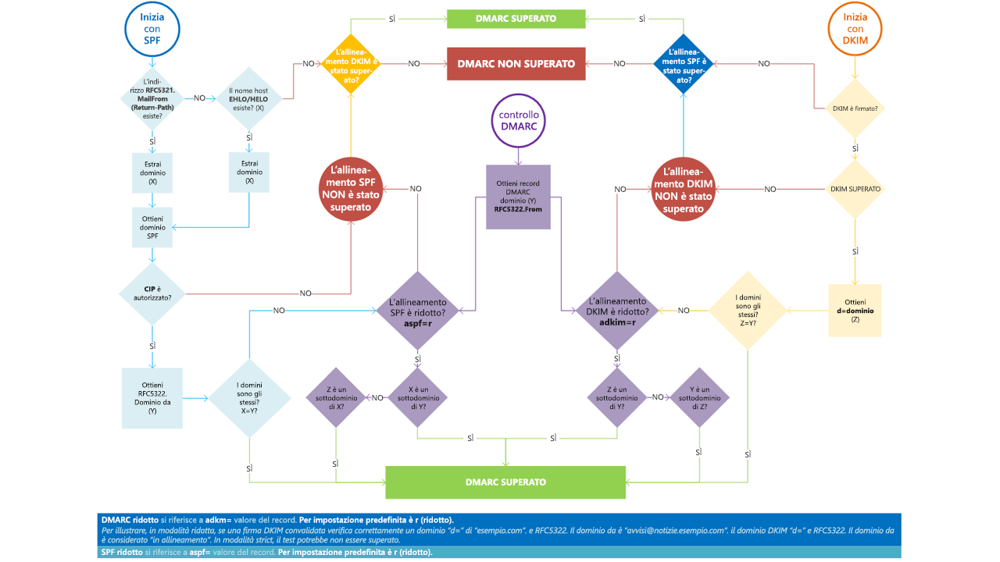

# <a name="use-dmarc-to-validate-email"></a>Usare DMARC per convalidare la posta elettronica

Autenticazione dei messaggi, la creazione di report e la conformità di un dominio ([DMARC](https://dmarc.org)) funziona con Sender Policy Framework (SPF) e DKIM (DomainKeys Identified Mail) per l'autenticazione dei mittenti di posta e garantire che i sistemi di posta elettronica di destinazione considerino attendibili i messaggi inviati dal dominio dell'utente. L'implementazione di DMARC con SPF e DKIM fornisce un'ulteriore protezione dallo spoofing e dal phishing. DMARC consente ai sistemi di posta di ricezione di determinare cosa fare con i messaggi inviati dal dominio che non supera i controlli SPF o DKIM.

> [!TIP]
> Vedere il catalogo [Microsoft Intelligent Security Association](https://www.microsoft.com/misapartnercatalog) per individuare i fornitori di terze parti che offrono la creazione di report DMARC per Microsoft 365.

## <a name="how-do-spf-and-dmarc-work-together-to-protect-email-in-microsoft-365"></a>In che modo SPF e DMARC collaborano per proteggere la posta elettronica in Microsoft 365?

 Un messaggio di posta elettronica potrebbe contenere più originatori o mittenti, indirizzi. Questi indirizzi sono utilizzati per scopi differenti. Ad esempio, si consideri quanto segue:

- **Indirizzo "Mail From" (Posta da)** Identifica il mittente e consente di specificare dove inviare notifiche di ritorno se si verificano problemi con la consegna del messaggio, ad esempio notifiche di mancato recapito. Ciò verrà visualizzato nella parte della busta di un messaggio di posta elettronica e, generalmente, non viene visualizzato dall'applicazione di posta elettronica. Ciò a volte viene chiamato indirizzo 5321.MailFrom o indirizzo reverse-path.

- **Indirizzo "From" (Da)** L'indirizzo visualizzato come indirizzo From dall'applicazione di posta elettronica. Questo indirizzo identifica l'autore del messaggio di posta elettronica. Vale a dire, la cassetta postale dell'utente o del sistema responsabile della creazione del messaggio. Questo a volte viene chiamato indirizzo 5322.From.

SPF Usa un record TXT DNS per fornire un elenco di indirizzi IP di invio autorizzati per un determinato dominio. Normalmente, i controlli SPF vengono eseguiti solo in base all'indirizzo 5321.MailFrom. Ciò significa che l'indirizzo 5322.From non è autenticato quando si usa SPF. Ciò consente uno scenario in cui un utente può ricevere un messaggio che supera un controllo SPF, ma presenta un indirizzo mittente 5322.From falsificato. Si consideri, ad esempio, la seguente trascrizione SMTP:

```console
S: Helo woodgrovebank.com
S: Mail from: phish@phishing.contoso.com
S: Rcpt to: astobes@tailspintoys.com
S: data
S: To: "Andrew Stobes" <astobes@tailspintoys.com>
S: From: "Woodgrove Bank Security" <security@woodgrovebank.com>
S: Subject: Woodgrove Bank - Action required
S:
S: Greetings User,
S:
S: We need to verify your banking details.
S: Please click the following link to verify that we have the right information for your account.
S:
S: https://short.url/woodgrovebank/updateaccount/12-121.aspx
S:
S: Thank you,
S: Woodgrove Bank
S: .
```

In questa trascrizione, gli indirizzi mittente sono i seguenti:

- Indirizzo Mail from (5321.MailFrom): phish@phishing.contoso.com

- Indirizzo From (5322.From): security@woodgrovebank.com

Se è stato configurato SPF, il server di ricezione esegue un controllo sull'indirizzo Mail from phish@phishing.contoso.com. Se il messaggio proviene da un'origine valida per il dominio phishing.contoso.com, allora supera il controllo SPF. Poiché il client di posta elettronica mostra solo l'indirizzo From, l'utente visualizza che il messaggio proviene da security@woodgrovebank.com. Solo con SPF, la validità di woodgrovebank.com non era mai stata autenticata.

Quando si utilizza DMARC, anche il server di ricezione esegue un controllo sull'indirizzo From. Nell'esempio precedente, se esiste un record TXT DMARC per woodgrovebank.com, allora il controllo sull'indirizzo From avrà esito negativo.

## <a name="what-is-a-dmarc-txt-record"></a>Che cos'è un record TXT DMARC?

Come i record DNS per SPF, il record per DMARC è un record di testo DNS che consente di prevenire spoofing e phishing. Viene pubblicato i record TXT DMARC in DNS. I record TXT DMARC consentono di convalidare l'origine dei messaggi di posta elettronica verificando l'indirizzo IP dell'autore della posta elettronica in base al proprietario del dominio del mittente. I record TXT DMARC identificano i server di posta elettronica in uscita autorizzati. I sistemi di posta elettronica di destinazione possono quindi verificare che l'origine dei messaggi ricevuti sia un server di posta elettronica in uscita autorizzato.

Il record TXT DMARC di Microsoft è simile al seguente:

```console
_dmarc.microsoft.com.   3600    IN      TXT     "v=DMARC1; p=none; pct=100; rua=mailto:d@rua.agari.com; ruf=mailto:d@ruf.agari.com; fo=1"
```

Microsoft invia i propri report DMARC a una terza parte:[Agari](https://agari.com). Agari raccoglie e analizza i report DMARC. Vedere il catalogo [Microsoft Intelligent Security Association](https://www.microsoft.com/misapartnercatalog) per individuare altri fornitori di terze parti che offrono la creazione di report DMARC per Microsoft 365.

## <a name="implement-dmarc-for-inbound-mail"></a>Implementare DMARC per la posta in ingresso

Non serve fare nulla per configurare DMARC per la posta ricevuta in Microsoft 365. Microsoft si occupa di tutto. Per sapere cosa succede alla posta che non supera i controlli DMARC, vedere [Come viene gestita la posta elettronica in ingresso che non supera il controllo DMARC in Microsoft 365](#how-microsoft-365-handles-inbound-email-that-fails-dmarc).

## <a name="implement-dmarc-for-outbound-mail-from-microsoft-365"></a>Implementare DMARC per la posta in uscita da Microsoft 365

Se si usa Microsoft 365, ma non si usa un dominio personalizzato, vale a dire, si usa onmicrosoft.com, non è necessario eseguire altre operazioni per configurare o implementare DMARC per l'organizzazione. SPF è già configurato e Microsoft 365 genera automaticamente una firma DKIM per la posta in uscita. Per altre informazioni sulla firma, vedere [Comportamento predefinito per DKIM e Microsoft 365](use-dkim-to-validate-outbound-email.md#DefaultDKIMbehavior).

 Se si ha un dominio personalizzato o si usano server Exchange locali oltre a Microsoft 365, è necessario implementare manualmente DMAR per la posta in uscita. L'implementazione DMARC per il dominio personalizzato include questa procedura:

- [Passaggio 1: identificare le origini valide della posta del dominio](#step-1-identify-valid-sources-of-mail-for-your-domain)

- [Passaggio 2: configurare SPF per il dominio](#step-2-set-up-spf-for-your-domain)

- [Passaggio 3: configurare DKIM per il dominio personalizzato](#step-3-set-up-dkim-for-your-custom-domain)

- [Passaggio 4: formare il record TXT DMARC del dominio](#step-4-form-the-dmarc-txt-record-for-your-domain)

### <a name="step-1-identify-valid-sources-of-mail-for-your-domain"></a>Passaggio 1: identificare le origini valide della posta del dominio

Se SPF è già stato configurato, allora questo esercizio è già stato completato. Tuttavia, per DMARC, occorre fare altre considerazioni. Quando si identificano origini di posta per il dominio, occorre rispondere a due domande:

- Quali indirizzi IP inviano messaggi da qualsiasi dominio?

- Per i messaggi inviati da terze parti per conto dell'utente, i domini 5321.MailFrom e 5322.From corrisponderanno?

### <a name="step-2-set-up-spf-for-your-domain"></a>Passaggio 2: configurare SPF per il dominio

Ora che si ha un elenco di mittenti validi, è possibile seguire la procedura per [Configurare SPF per prevenire lo spoofing](set-up-spf-in-office-365-to-help-prevent-spoofing.md).

Ad esempio, presupponendo che contoso.com invia un messaggio da Exchange Online, un server Exchange locale il cui indirizzo IP è 192.168.0.1 e un'applicazione Web il cui indirizzo IP è 192.168.100.100, il record TXT SPFsarà simile alla seguente:

```console
contoso.com  IN  TXT  " v=spf1 ip4:192.168.0.1 ip4:192.168.100.100 include:spf.protection.outlook.com -all"
```

Come procedura consigliata, assicurarsi che il record TXT SPF tenga in considerazione mittenti di terze parti.

### <a name="step-3-set-up-dkim-for-your-custom-domain"></a>Passaggio 3: configurare DKIM per il dominio personalizzato

Dopo aver configurato SPF, è necessario configurare DKIM. DKIM consente di aggiungere una firma digitale ai messaggi di posta elettronica nell'intestazione del messaggio. Se non si configura DKIM e si consente invece a Microsoft 365 di usare la configurazione DKIM predefinita per il dominio, DMARC potrebbe non riuscire. Questo perché la configurazione DKIM predefinita usa il dominio onmicrosoft.com iniziale come indirizzo 5322.From, non il dominio personalizzato. Ciò forza una mancata corrispondenza tra gli indirizzi 5321.MailFrom e 5322.From in tutta la posta elettronica inviata dal dominio.

Se si hanno mittenti di terze parti che inviano posta per conto dell'organizzazione e i messaggi che inviano presentano indirizzi 5321.MailFrom e 5322.From non corrispondenti, la verifica DMARC non riuscirà. Per evitare il problema, è necessario configurare DKIM per il dominio in modo specifico con tale mittente di terze parti. In questo modo Microsoft 365 potrà autenticare la posta elettronica dal servizio di terze parti. Questo consente anche ad altri, ad esempio, Yahoo, Gmail e Comcast, di verificare la posta elettronica loro inviata da terze parti come se provenisse dall'organizzazione. Ciò è utile perché genera fiducia nel dominio da parte dei clienti indipendentemente da dove si trova la loro cassetta postale e, contemporaneamente, Microsoft 365 non contrassegnerà un messaggio come posta indesiderata a causa dello spoofing perché supera i controlli di autenticazione del dominio.

Per istruzioni sulla configurazione di DKIM per il dominio e su come configurare DKIM per mittenti di terze parti affinché possano effettuare lo spoofing del dominio, vedere [Usare DKIM per convalidare la posta elettronica in uscita inviata dal dominio personalizzato](use-dkim-to-validate-outbound-email.md).

### <a name="step-4-form-the-dmarc-txt-record-for-your-domain"></a>Passaggio 4: formare il record TXT DMARC del dominio

Anche se sono disponibili altre opzioni di sintassi non menzionate qui, queste sono le opzioni più comunemente usate per Microsoft 365. Creare il record TXT DMARC per il dominio nel formato:

```console
_dmarc.domain  TTL  IN  TXT  "v=DMARC1; p=policy; pct=100"
```

dove:

- *domain* è il dominio da proteggere. Per impostazione predefinita, il record protegge la posta elettronica dal dominio e da tutti i sottodomini. Ad esempio, se si specifica \_dmarc.contoso.com, DMARC protegge la posta del dominio e da tutti i sottodomini, ad esempio housewares.contoso.com o plumbing.contoso.com.

- *TTL* deve essere sempre l'equivalente di un'ora. L'unità utilizzata per TTL, ore (1 ora), minuti (60 minuti) o secondi (3600 secondi) varia a seconda del registrar del dominio.

- *pct=100* indica che questa regola deve essere utilizzata per il 100% della posta elettronica.

- *policy* specifica quale criterio deve eseguire il server di ricezione se DMARC ha esito negativo. È possibile impostare il criterio su none, quarantine o reject.

Per informazioni sulle opzioni da usare, acquisire familiarità con i concetti illustrati in [Procedure consigliate per l'implementazione di DMARC in Microsoft 365](#best-practices-for-implementing-dmarc-in-microsoft-365).

Esempi:

- Criterio impostato su none

    ```console
    _dmarc.contoso.com 3600 IN  TXT  "v=DMARC1; p=none"
    ```

- Criterio impostato su quarantine

    ```console
    _dmarc.contoso.com 3600 IN  TXT  "v=DMARC1; p=quarantine"
    ```

- Criterio impostato su reject

    ```console
    _dmarc.contoso.com  3600 IN  TXT  "v=DMARC1; p=reject"
    ```

Dopo aver creato il record, è necessario aggiornare il record nel registrar del dominio. Per istruzioni sull'aggiunta del record TXT DMARC ai record DNS di Microsoft 365, vedere [Creare record DNS per Microsoft 365 quando si gestiscono i record DNS](https://docs.microsoft.com/microsoft-365/admin/get-help-with-domains/create-dns-records-at-any-dns-hosting-provider).

## <a name="best-practices-for-implementing-dmarc-in-microsoft-365"></a>Procedure consigliate per l'implementazione di DMARC in Microsoft 365

È possibile implementare DMARC gradualmente senza influire sul resto del flusso di posta. Creare e implementare un piano di implementazione che segue questi passaggi. Eseguire ognuna di queste operazioni prima con un sottodominio, poi con gli altri sottodomini e infine con il dominio di primo livello nell'organizzazione prima di passare al passaggio successivo.

1. Monitorare l'effetto dell'implementazione DMARC

    Iniziare con un semplice record in modalità monitoraggio per un sottodominio o dominio che richiede che i destinatari DMARC inviino statistiche sui messaggi visualizzati utilizzando tale dominio. Un record in modalità monitoraggio è un record TXT DMARC con i criteri impostati su none (p=none). Molte aziende pubblicano un record TXT DMARC con p=nessuno perché non sono sicuri su quanta posta elettronica potrebbero perdere pubblicando un criterio DMARC più restrittivo.

    È possibile farlo anche prima di aver implementato SPF o DKIM nell'infrastruttura di messaggistica. Tuttavia, non sarà possibile mettere in quarantena o rifiutare in modo efficace la posta tramite DMARCA finché non verranno implementati anche SPF e DKIM. Introducendo SPF e DKIM, i report generati tramite DMARC forniranno i numeri e le origini dei messaggi che superano i controlli e quelli che non li superano. È possibile individuare facilmente la quantità di traffico legittimo coperto o non coperto da questi e risolvere eventuali problemi. Si inizierà anche visualizzare il numero di messaggi fraudolenti inviati e da dove.

2. Richiedere che i sistemi di posta esterni mettano in quarantena la posta che non supera DMARC

    Quando si pensa che tutto o la maggior parte del traffico legittimo sia protetto da SPF e DKIM e si comprende l'impatto dell'implementazione DMARC, è possibile implementare un criterio di quarantena. Un criterio di quarantena è un record TXT DMARC il cui criterio è impostato su quarantine (p=quarantine). In questo modo viene, si chiede ai destinatari DMARC di mettere i messaggi dal dominio che non superano DMARC nell'equivalente locale di una cartella di posta indesiderata invece che nella Posta in arrivo dei clienti.

3. Richiedere che i sistemi di posta esterni non accettino messaggi che non superano DMARC

    Il passaggio finale consiste nell'implementare un criterio reject. Un criterio reject è un record TXT DMARC il cui criterio è impostato su reject (p=reject). Quando si esegue questa operazione, si chiede ai destinatari DMARC di non accettare messaggi che non superano i controlli DMARC.
    
4. Come si configura DMARC per il sottodominio?

DMARC viene implementato pubblicando un criterio come record TXT nel DNS ed è gerarchico (ad esempio, i criteri pubblicati per contoso.com verranno applicati a sub.domain.contonos.com, a meno che non vengano definiti in modo esplicito criteri diversi per il sottodominio). Questa operazione è utile perché le organizzazioni possono specificare un numero ridotto di record DMARC di livello elevato per una copertura più ampia. È consigliabile prestare attenzione a configurare i record di sottodomini DMARC espliciti quando non si vuole che i sottodomini ereditino il record DMARC del dominio di primo livello.

È anche possibile aggiungere un criterio di tipo jolly per DMARC quando i sottodomini non devono inviare messaggi di posta elettronica, aggiungendo il valore `sp=reject`. Ad esempio:

```console
_dmarc.contoso.com. TXT "v=DMARC1; p=reject; sp=reject; ruf=mailto:authfail@contoso.com; rua=mailto:aggrep@contoso.com"
```

## <a name="how-microsoft-365-handles-outbound-email-that-fails-dmarc"></a>Come viene gestita la posta elettronica in uscita che non supera il controllo DMARC in Microsoft 365

Se un messaggio è in uscita da Microsoft 365 e non supera DMARC e il criterio è stato impostato su p=quarantine o p=reject, il messaggio viene instradato attraverso il [Pool di recapito ad alto rischio per i messaggi in uscita](high-risk-delivery-pool-for-outbound-messages.md). Non viene eseguito override della posta elettronica in uscita.

Se si pubblica un criterio reject DMARC (p=reject), nessun altro cliente in Microsoft 365 può eseguire lo spoofing del dominio perché i messaggi non potranno superare SPF o DKIM per il dominio quando recapitano un messaggio in uscita attraverso il servizio. Tuttavia, se si pubblica un criterio reject di DMARC, ma non tutta la posta elettronica viene autenticata attraverso Microsoft 365, parte dei messaggi potrebbe essere contrassegnata come posta indesiderata per la posta elettronica in ingresso (come descritto sopra) oppure sarà rifiutata se non si pubblica SPF e si prova ad inoltrarla in uscita attraverso il servizio. Ciò accade, ad esempio, se si dimentica di includere alcuni degli indirizzi IP per server e app che inviano posta per conto del dominio quando si crea il record TXT DMARC.

## <a name="how-microsoft-365-handles-inbound-email-that-fails-dmarc"></a>Come viene gestita la posta elettronica in ingresso che non supera il controllo DMARC in Microsoft 365

Se il criterio DMARC del server di invio è `p=reject`, [Exchange Online Protection](exchange-online-protection-overview.md) EOP contrassegna il messaggio come spoof invece di rifiutarlo. In altre parole, per la posta elettronica in ingresso, Microsoft 365 tratta `p=reject` e `p=quarantine` allo stesso modo. Gli amministratori possono definire l'azione da eseguire per i messaggi classificati come spoof nei [criteri anti-phishing](set-up-anti-phishing-policies.md).

Microsoft 365 è configurato in questo modo perché alcuni messaggi di posta elettronica legittimi potrebbero non superare DMARC. Ad esempio, un messaggio potrebbe non superare DMARC se viene inviato a una lista di distribuzione che poi inoltre il messaggio a tutti i partecipanti della lista. Se Microsoft 365 rifiutasse questi messaggi, le persone potrebbero perdere posta elettronica legittima e non ci sarebbe modo di recuperarla. Al contrario, questi messaggi continueranno a non superare DMARC ma verranno contrassegnati come posta indesiderata e non rifiutati. Se si desidera, gli utenti possono comunque ricevere questi messaggi nella propria posta in arrivo attraverso i seguenti metodi:

- Gli utenti aggiungono mittenti sicuri singolarmente mediante il loro client di posta elettronica.

- Gli amministratori possono aggiornare la creazione di report di [spoof intelligence](learn-about-spoof-intelligence.md) per consentire lo spoofing.

- Gli amministratori creano una regola di flusso di posta di Exchange, nota anche come regola di trasporto, per tutti gli utenti che consentono messaggi di questi mittenti specifici.

Per altre informazioni, vedere [Creare elenchi di mittenti attendibili](create-safe-sender-lists-in-office-365.md).

## <a name="how-microsoft-365-utilizes-authenticated-received-chain-arc"></a>Come Microsoft 365 usa lo standard ARC (Authenticated Received Chain)

Tutte le cassette postali ospitate in Microsoft 365 otterranno ora i vantaggi di ARC con un migliore recapito dei messaggi e una maggiore protezione anti-spoofing. ARC conserva i risultati dell'autenticazione della posta elettronica di tutti gli intermediari partecipanti, o hop, quando un messaggio di posta elettronica viene instradato dal server di origine alla casella di posta del destinatario. Prima dello standard ARC, le modifiche apportate dagli intermediari nel routing della posta elettronica, come le regole di inoltro o le firme automatiche, potevano causare errori DMARC nel momento in cui il messaggio di posta elettronica raggiungeva la casella di posta del destinatario. Con ARC, la conservazione crittografica dei risultati dell'autenticazione permette a Microsoft 365 di verificare l'autenticità del mittente di un messaggio di posta elettronica.

Microsoft 365 attualmente usa ARC per verificare i risultati dell'autenticazione quando Microsoft è ARC Sealer, ma prevede di aggiungere in futuro il supporto di ARC Sealer di terze parti.

## <a name="troubleshooting-your-dmarc-implementation"></a>Risoluzione dei problemi relativi all'implementazione di DMARC

Se sono stati configurati i record MX del dominio in cui EOP non è la prima voce, gli errori DMARC non verranno applicati nel dominio.

Se si è clienti e il record MX principale del proprio dominio non punta a Exchange Online Protection, non si usufruirà dei vantaggi di DMARC. Ad esempio, DMARC non funzionerà se si punta il record MX al server di posta locale e si indirizza quindi la posta elettronica a EOP utilizzando un connettore. In questo scenario, il dominio di destinazione è uno dei domini accettati ma EOP non è il principale MX. Ad esempio, si supponga che contoso.com punti il relativo MX a se stesso e utilizzi EOP come un record MX secondario, il record MX di contoso.com avrà il seguente aspetto:

```console
contoso.com     3600   IN  MX  0  mail.contoso.com
contoso.com     3600   IN  MX  10 contoso-com.mail.protection.outlook.com
```

Tutta la posta elettronica, o gran parte, verrà prima indirizzata a mail.contoso.com poiché è l'MX principale e poi la posta verrà instradata a EOP. In alcuni casi, potrebbe non essere neanche necessario EOP come record MX, ma potrebbe essere semplicemente sufficiente collegare connettori per instradare la posta elettronica. EOP non deve necessariamente essere la prima voce per la convalida di DMARC. Garantisce solo la convalida, perché non è possibile essere certi che tutti i server locali o non Office 365 eseguano controlli di DMARC.  DMARC è idoneo per essere applicato al dominio di un cliente (non al server) durante la configurazione del record TXT DMARC, ma l'applicazione dipende dal server di ricezione.  Se si configura EOP come server di ricezione, EOP esegue l'applicazione di DMARC.



## <a name="for-more-information"></a>Ulteriori informazioni

Per ulteriori informazioni su DMARC le risorse che seguono possono essere di aiuto.

- [Intestazioni messaggi della protezione da posta indesiderata](anti-spam-message-headers.md) include la sintassi e i campi di intestazione usati da Microsoft 365 per i controlli DMARC.

- Seguire la [serie di formazione su DMARC](https://www.m3aawg.org/activities/training/dmarc-training-series) da M <sup>3</sup>AAWG (Messaging, Malware, Mobile Anti-Abuse Working Group).

- Utilizzare l'elenco di controllo in [dmarcian](https://space.dmarcian.com/deployment/).

- Passare direttamente all'origine in [DMARC.org](https://dmarc.org).

## <a name="see-also"></a>Vedere anche

[Uso di Sender Policy Framework (SPF) in Microsoft 365 per impedire lo spoofing](how-office-365-uses-spf-to-prevent-spoofing.md)

[Configurare SPF in Microsoft 365 per prevenire lo spoofing](set-up-spf-in-office-365-to-help-prevent-spoofing.md)

[Usare DKIM per convalidare la posta elettronica in uscita inviata dal dominio personalizzato in Microsoft 365](use-dkim-to-validate-outbound-email.md)
