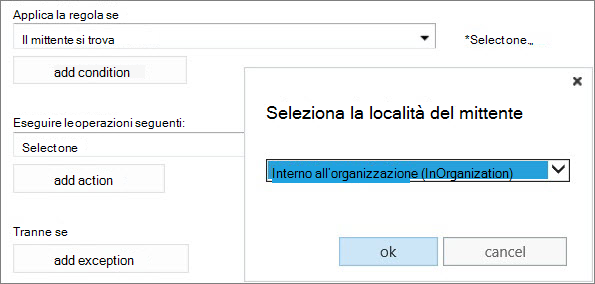

# Usare le regole del flusso di posta per impostare il livello di confidenza di posta indesiderata nei messaggi

È possibile creare una regola del flusso di posta (nota anche come regola di trasporto) che imposta il livello di probabilità di posta indesiderata (SCL) di un messaggio di posta elettronica. Il livello SCL è una misura del modo in cui un messaggio deve essere la posta indesiderata. Per posta indesiderata si intendono quei messaggi di posta elettronica non richiesti (e in genere non desiderati). Il servizio esegue un'azione diversa su un messaggio in base alla classificazione SCL. Ad esempio, si potrebbe voler bypassare il filtro del contenuto di posta indesiderata per i messaggi inviati da persone all'interno dell'organizzazione perché è attendibile che un messaggio inviato internamente da un collega non sia posta indesiderata. L'utilizzo delle regole del flusso di posta per impostare il valore SCL di un messaggio garantisce un maggiore controllo della gestione della posta indesiderata.

 **Che cosa è necessario sapere prima di iniziare**

- Tempo stimato per il completamento di questa procedura: 10 minuti.

- Devi disporre delle autorizzazioni per poter eseguire queste procedure.  Per sapere quali autorizzazioni sono necessarie, vedere "regole del flusso di posta" in [autorizzazioni funzionalità in Exchange Online](https://docs.microsoft.com/exchange/permissions-exo/feature-permissions) o [funzionalità Permissions in EOP](feature-permissions-in-eop.md).

- Per informazioni sui tasti di scelta rapida che possono essere applicati alle procedure descritte in questo argomento, vedere tasti [di scelta rapida per l'interfaccia di amministrazione di Exchange in Exchange Online](https://docs.microsoft.com/Exchange/accessibility/keyboard-shortcuts-in-admin-center).

### Per creare una regola del flusso di posta che consente di impostare il livello SCL di un messaggio

1. Nell'interfaccia di amministrazione di Exchange (EAC), scegliere **regole**del **flusso** \> di posta.

2. Fare ****icona Aggiungi e quindi selezionare **Crea una nuova regola**.

3. Specificare un nome per la regola.

4. Scegliere **altre opzioni**e quindi in **applica questa regola se**, specificare una condizione che attiverà l'azione che verrà impostata per questa regola (ovvero impostare il valore SCL).

   Ad esempio, è possibile impostare **il mittente** \> **come interno/esterno**e quindi nella finestra di dialogo **Seleziona percorso mittente** selezionare **all'interno dell'organizzazione**e quindi scegliere **OK**. 
   

5. In **Fai quanto segue**, selezionare **Modifica le proprietà del messaggio** \> **Imposta il livello di probabilità di posta indesiderata**.

6. Nella casella **specifica SCL** , selezionare uno dei seguenti valori e scegliere **OK**:

   - **Ignorare il filtro posta indesiderata**: imposta il livello SCL su-1, il che significa che il filtro contenuto non verrà eseguito.

   - **0-4**: il messaggio viene passato al filtro contenuto per ulteriori elaborazioni.

   - **5-6**: verrà applicata l'azione specificata per la **posta indesiderata** nei criteri di filtro del contenuto applicabili. Per impostazione predefinita, l'azione consiste nell'inviare il messaggio alla cartella posta indesiderata del destinatario.

   - **7-9**: verrà applicata l'azione specificata per la **posta indesiderata con attendibilità elevata** nei criteri di filtro del contenuto applicabili. Per impostazione predefinita, l'azione consiste nell'inviare il messaggio alla cartella posta indesiderata del destinatario.

   Per ulteriori informazioni sulla configurazione dei criteri di filtro del contenuto, vedere [configurare i criteri di filtro della posta indesiderata](configure-your-spam-filter-policies.md). Per ulteriori informazioni sui valori SCL del servizio, vedere [Livelli di sicurezza della protezione contro la posta indesiderata](spam-confidence-levels.md).

7. Specificare le proprietà aggiuntive per la regola e scegliere **Salva**.

   > [!TIP]
   > Per ulteriori informazioni sulle proprietà aggiuntive che è possibile selezionare o specificare per questa regola, vedere [utilizzo dell'interfaccia di amministrazione di Exchange per creare regole del flusso di posta](https://docs.microsoft.com/Exchange/policy-and-compliance/mail-flow-rules/mail-flow-rule-procedures#use-the-eac-to-create-mail-flow-rules).

## Come verificare se l'operazione ha avuto esito positivo

Per verificare la corretta esecuzione di questa procedura, inviare un messaggio di posta elettronica a un utente all'interno dell'organizzazione e verificare che l'azione eseguita sul messaggio sia come previsto. Se ad esempio si **imposta il livello di probabilità di posta indesiderata (SCL)** per **ignorare il filtro posta indesiderata**, il messaggio dovrà essere inviato alla cartella posta in arrivo del destinatario specificato. Tuttavia, se si **imposta il livello di probabilità di posta indesiderata (SCL)** su **9**e l'azione di **protezione da posta** indesiderata elevata per i criteri di filtro del contenuto applicabile consiste nello spostare il messaggio nella cartella posta indesiderata, il messaggio deve essere inviato alla cartella posta indesiderata del destinatario specificato.
