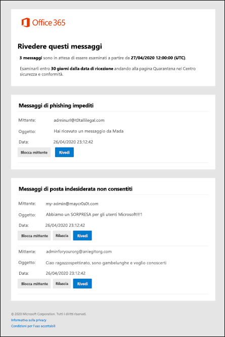

# Utilizzare le notifiche di posta indesiderata dell'utente per rilasciare e segnalare i messaggi in quarantenaUse user spam notifications to release and report quarantined messages

[!INCLUDE [Microsoft 365 Defender rebranding](../includes/microsoft-defender-for-office.md)]

**Si applica a****Applies to**
- [Exchange Online ProtectionExchange Online Protection](exchange-online-protection-overview.md)
- [Microsoft Defender per Office 365 piano 1 e piano 2Microsoft Defender for Office 365 plan 1 and plan 2](office-365-atp.md)
- [Microsoft 365 DefenderMicrosoft 365 Defender](../mtp/microsoft-threat-protection.md)

Nelle organizzazioni di Microsoft 365 con cassette postali in Exchange Online o nelle organizzazioni di Exchange Online Protection (EOP) autonomo senza cassette postali di Exchange Online, la quarantena contiene messaggi potenzialmente pericolosi o indesiderati.In Microsoft 365 organizations with mailboxes in Exchange Online or standalone Exchange Online Protection (EOP) organizations without Exchange Online mailboxes, quarantine holds potentially dangerous or unwanted messages. Per ulteriori informazioni, vedere [Quarantined messages in EOP.](quarantine-email-messages.md)For more information, see [Quarantined messages in EOP](quarantine-email-messages.md).

Per impostazione predefinita, le notifiche di posta indesiderata dell'utente finale sono disabilitate nei criteri di protezione da posta indesiderata.By default, end-user spam notifications are disabled in anti-spam policies. Quando un amministratore abilita le notifiche di posta indesiderata dell'utente [finale,](configure-your-spam-filter-policies.md#configure-end-user-spam-notifications)i destinatari (incluse le cassette postali condivise con il mapping automatico abilitato) riceveranno notifiche periodiche sui messaggi messi in quarantena come posta indesiderata, posta elettronica in blocco o phishing (a partire da aprile 2020).When an admin [enables end-user spam notifications](configure-your-spam-filter-policies.md#configure-end-user-spam-notifications), recipients (including shared mailboxes with automapping enabled) will receive periodic notifications about their messages that were quarantined as spam, bulk email, or (as of April 2020) phishing.

Per le cassette postali condivise, le notifiche di posta indesiderata dell'utente finale sono supportate solo per gli utenti a cui è stata concessa l'autorizzazione FullAccess per la cassetta postale condivisa.For shared mailboxes, end-user spam notifications are only supported for users who are granted FullAccess permission to the shared mailbox. Per ulteriori informazioni, vedere [Utilizzo dell'interfaccia di amministrazione di Exchange per modificare la delega delle cassette postali condivise.](https://docs.microsoft.com/Exchange/collaboration-exo/shared-mailboxes#use-the-eac-to-edit-shared-mailbox-delegation)For more information, see [Use the EAC to edit shared mailbox delegation](https://docs.microsoft.com/Exchange/collaboration-exo/shared-mailboxes#use-the-eac-to-edit-shared-mailbox-delegation).

La notifica di posta indesiderata dell'utente finale non è supportata per i gruppi.End User Spam notification is not supported for groups.

> [!NOTE]
> I messaggi messi in quarantena come phishing ad alta probabilità, malware o dalle regole del flusso di posta (note anche come regole di trasporto) sono disponibili solo per gli amministratori.Messages that were quarantined as high confidence phishing, malware, or by mail flow rules (also known as transport rules) are only available to admins. Per altre informazioni, vedere [Gestione dei messaggi e dei file in quarantena come amministratore in EOP](manage-quarantined-messages-and-files.md).For more information, see [Manage quarantined messages and files as an admin in EOP](manage-quarantined-messages-and-files.md).

Una notifica di posta indesiderata dell'utente finale contiene le informazioni seguenti per ogni messaggio in quarantena:An end-user spam notification contains the following information for each quarantined message:

- **Mittente:** il nome di invio e l'indirizzo di posta elettronica del messaggio in quarantena.**Sender**: The send name and email address of the quarantined message.

- **Oggetto:** il testo della riga dell'oggetto del messaggio in quarantena.**Subject**: The subject line text of the quarantined message.

- **Data**: data e ora (in formato UTC) in cui il messaggio è stato messo in quarantena.**Date**: The date and time (in UTC) that the message was quarantined.

- **Blocca mittente:** fare clic su questo collegamento per aggiungere il mittente all'elenco Mittenti bloccati.**Block Sender**: Click this link to add the sender to your Blocked Senders list. Per ulteriori informazioni, vedere [Bloccare un mittente di posta.](https://support.microsoft.com/office/b29fd867-cac9-40d8-aed1-659e06a706e4)For more information, see [Block a mail sender](https://support.microsoft.com/office/b29fd867-cac9-40d8-aed1-659e06a706e4).

- **Rilascio:** per i messaggi di posta indesiderata (non di phishing), è possibile rilasciare il messaggio qui senza andare in quarantena nel Centro sicurezza & conformità.**Release**: For spam (not phishing) messages, you can release the message here without going to Quarantine the Security & Compliance Center.

- **Revisione:** fare clic su questo collegamento per passare alla quarantena nel Centro sicurezza & conformità, dove è possibile (a seconda del motivo per cui il messaggio è stato messo in quarantena) visualizzare, rilasciare, eliminare o segnalare i messaggi in quarantena.**Review**: Click this link to go to Quarantine in the Security & Compliance Center, where you can (depending on why the message was quarantined) view, release, delete or report your quarantined messages. Per ulteriori informazioni, vedere [Trovare e rilasciare i messaggi in quarantena come utente in EOP.](find-and-release-quarantined-messages-as-a-user.md)For more information, see [Find and release quarantined messages as a user in EOP](find-and-release-quarantined-messages-as-a-user.md).

> [!NOTE]
> Un mittente bloccato può comunque inviare messaggi di posta elettronica.A blocked sender can still send you mail. Tutti i messaggi inviati da questo mittente alla cassetta postale verranno spostati immediatamente nella cartella Posta indesiderata.Any messages from this sender that make it to your mailbox will be immediately moved to the Junk Email folder. I messaggi futuri provenienti da questo mittente verranno inviati alla cartella Posta indesiderata o alla quarantena dell'utente finale.Future messages from this sender will go to your Junk Email folder or to the end-user quarantine. Se si desidera eliminare questi messaggi al momento dell'arrivo invece di mettere in stato di messa in sicurezza questi messaggi, utilizzare le regole del flusso di posta [(note](https://docs.microsoft.com/exchange/security-and-compliance/mail-flow-rules/mail-flow-rules) anche come regole di trasporto) per eliminare i messaggi all'arrivo.If you would like to delete these messages on arrival instead of quarantining them, use [mail flow Rules](https://docs.microsoft.com/exchange/security-and-compliance/mail-flow-rules/mail-flow-rules) (also known as transport rules) to delete the messages on arrival.
