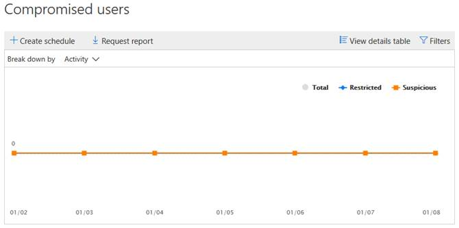
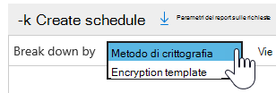
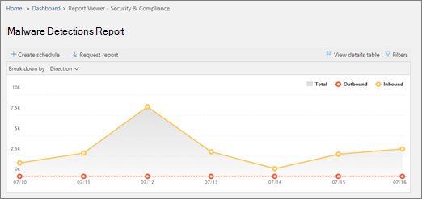
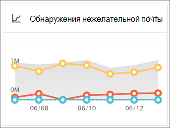
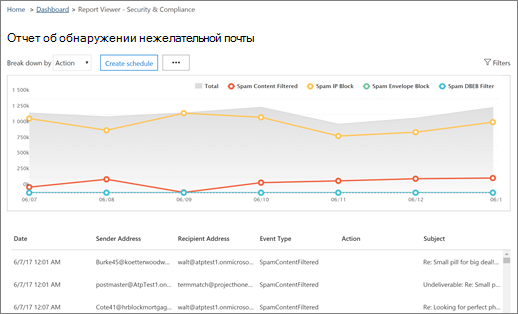
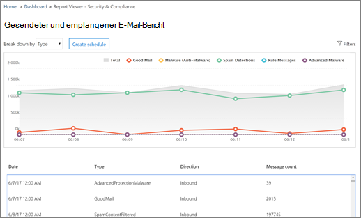

# Visualizzare i report sulla sicurezza della posta elettronica nel Centro sicurezza e conformità

Nel [Centro sicurezza & conformità](https://protection.office.com) è disponibile un'ampia gamma di report che consentono di visualizzare in che modo le funzionalità di sicurezza della posta elettronica, ad esempio la protezione da posta indesiderata, l'antimalware e la crittografia in Microsoft 365, proteggono l'organizzazione. Se si dispone delle [autorizzazioni necessarie](#what-permissions-are-needed-to-view-these-reports), è possibile visualizzare i report nel centro sicurezza & Compliance accedendo al **Reports** \> **Dashboard**report.

I rapporti di sicurezza della posta elettronica includono quanto segue:

- [Report di protezione dalle minacce URL](#url-threat-protection-report-new) (**nuovo!**)
- [Report utenti compromessi](#compromised-users-report)
- [Rapporto di crittografia](#encryption-report)
- [Report dello stato di protezione dalle minacce](#threat-protection-status-report)
- [Rapporto rilevamenti malware](#malware-detections-report)
- [Rapporto malware principale](#top-malware-report)
- [Report mittenti e destinatari principali](#top-senders-and-recipients-report)
- [Rapporto rilevamenti spoof](#spoof-detections-report)
- [Rapporto rilevamento posta indesiderata](#spam-detections-report)
- [Report di posta elettronica inviati e ricevuti](#sent-and-received-email-report)
- [Report dei messaggi segnalati dall'utente](#user-reported-messages-report)

## Report di protezione dalle minacce URL (**nuovo!**)

Il rapporto di protezione delle minacce URL è disponibile per tutti gli utenti con:

- Un componente aggiuntivo di Exchange Online Protection *e* Advanced Threat Protection (piano 1 *o* piano 2)
- Un abbonamento A Microsoft 365 E5

Si tratta di un report ' clic-Centric ' che include due visualizzazioni aggregate.

1. La prima visualizzazione è in base all' *azione di protezione clic su URL*, che si concentra sulla visualizzazione del numero di clic URL degli utenti all'interno del tenant e sul risultato del clic. Un clic qui indica che l'utente ha fatto clic sulla pagina blocca nel sito Web dannoso (può essere disabilitato dall'amministratore all'interno di un criterio collegamenti sicuri).

2. La seconda visualizzazione è *URL fare clic su applicazioni*, in cui viene visualizzato il numero di URL che è possibile fare clic nelle diverse applicazioni che supportano i collegamenti sicuri oggi, ad esempio in un client di posta elettronica o in Microsoft Word. I dati di entrambe le visualizzazioni aggregate vengono aggiornati una volta ogni 4 ore.

La tabella dei dettagli del rapporto di protezione da minacce URL fornisce una visualizzazione quasi in tempo reale di tutti i clic che si verificano all'interno del tenant e include informazioni investigative quali *nome utente*, *URL*, *ID del messaggio di rete* (se l'URL è stato selezionato da un indirizzo di posta elettronica) e altre informazioni utili per indagini e analisi.

Per impostazione predefinita, il rapporto mostra solo i dati sui clic da URL bloccati da collegamenti sicuri, ma è anche possibile visualizzare le informazioni su tutti i clic URL selezionando la casella di controllo URL *consentiti* nei filtri.

Questo report non includerà i dati dei clic degli utenti in cui è stato applicato il criterio collegamenti sicuri ha l'opzione non *registrare i clic utente* selezionati.

## Report utenti compromessi

Questo report, disponibile per tutti gli utenti con Exchange Online Protection, Visualizza il numero di account utente contrassegnati come membri sospetti o limitati, dati particolarmente utili come account immettere uno degli Stati che indicano che l'account utente potrebbe essere problematico o addirittura compromesso. Con uso frequente, il report utente compromesso può individuare picchi e persino tendenze, in account contrassegnati in Stati sospetti o con restrizioni, in cui è possibile che si verifichi un problema con la sicurezza e il benessere del tenant.

## Rapporto di crittografia

Il **rapporto di crittografia** Visualizza informazioni sui messaggi di posta elettronica crittografati, tramite i criteri dell'organizzazione o tramite i controlli dell'utente finale. Il team di sicurezza dell'organizzazione può utilizzare le informazioni contenute in questo report per identificare modelli e applicare o modificare in modo proattivo i criteri per i messaggi di posta elettronica sensibili.

Per visualizzare il report, nel centro sicurezza & conformità accedere a report **Reports** \> **Dashboard** \> **crittografia**dashboard report.

Quando il report viene aperto per la prima volta, verranno visualizzati i dati relativi ai metodi di crittografia utilizzati nei messaggi di posta elettronica per gli ultimi sette (7) giorni. È possibile modificare l'intervallo di date e i dettagli visualizzati nel rapporto facendo clic su **filtri** nell'angolo in alto a destra dello schermo.

È inoltre possibile utilizzare il menu **Suddividi** per visualizzare i dati in base al modello di crittografia (o al metodo).

È possibile utilizzare il menu **Visualizza dati in base** a per modificare la visualizzazione per visualizzare i conteggi dei messaggi crittografati nei primi cinque domini del destinatario.

Grazie alla flessibilità del nuovo rapporto di crittografia, è possibile visualizzare le tendenze e intraprendere le azioni appropriate. Ad esempio, se viene visualizzato un numero elevato di messaggi di posta elettronica crittografati dagli utenti, potrebbe essere necessario aggiungere un criterio di crittografia per automatizzare la crittografia per alcuni casi di utilizzo. Per ottenere assistenza, vedere [definire le regole del flusso di posta per crittografare i messaggi di posta elettronica in Microsoft 365](../../compliance/define-mail-flow-rules-to-encrypt-email.md). Come altro esempio, se si dispone di un numero di modelli di crittografia disponibili ma nessuno li utilizza, potrebbe essere necessario valutare se gli utenti devono essere allenati per tale caratteristica.

Utilizzare questo rapporto consente al team di conformità e sicurezza dell'organizzazione di monitorare la modalità di utilizzo della crittografia dei messaggi e se sono necessarie ulteriori azioni. Per ulteriori informazioni sulla crittografia, vedere la [crittografia della posta elettronica in Microsoft 365](../../compliance/email-encryption.md).

## Report dello stato di protezione dalle minacce

Il rapporto **sullo stato della protezione dalle minacce** è uno smart report che indica che la posta elettronica dannosa è stata rilevata e bloccata da Exchange Online Protection. Questo rapporto è utile per la visualizzazione di messaggi di posta elettronica identificati come malware o tentativi di phishing nel tempo (fino a 90 giorni) e consente agli amministratori della sicurezza di identificare le tendenze o determinare se i criteri devono essere adattati.

> [!NOTE]
> Un rapporto sullo stato della protezione dalle minacce è disponibile per i clienti che dispongono di [Office 365 ATP](https://docs.microsoft.com/microsoft-365/security/office-365-security/office-365-atp) o [Exchange Online Protection](exchange-online-protection-overview.md) (EOP); Tuttavia, le informazioni visualizzate nel rapporto sullo stato di protezione di minacce per i clienti ATP probabilmente conterranno dati diversi da quelli che potrebbero essere visualizzati dai clienti di EOP. Ad esempio, i clienti di EOP possono visualizzare informazioni sui malware rilevati tramite posta elettronica, ma non informazioni sui [file dannosi rilevati in SharePoint Online, OneDrive o Microsoft teams](https://docs.microsoft.com/microsoft-365/security/office-365-security/atp-for-spo-odb-and-teams), una funzionalità specifica del trifosfato di adenosina. (Ulteriori[informazioni sui rapporti ATP](https://docs.microsoft.com/microsoft-365/security/office-365-security/view-reports-for-atp)).

Per visualizzare questo report, nel [Centro sicurezza & conformità](https://protection.office.com)accedere a **segnala** \> **Dashboard** \> **lo stato di protezione delle minacce**del dashboard.

Quando si apre per la prima volta il rapporto sullo stato di protezione dalle minacce, il report Visualizza i dati per i sette giorni scorsi per impostazione predefinita. Tuttavia, è possibile fare clic su **filtri** e modificare l'intervallo di date fino a 90 giorni di dettaglio. Se si utilizza un abbonamento di valutazione, potrebbe essere limitato a 30 giorni di dati.

Questo report è utile per visualizzare l'efficacia e l'impatto delle funzionalità di [Exchange Online Protection](https://docs.microsoft.com/microsoft-365/security/office-365-security/eop-features)dell'organizzazione e per i trend a più lungo termine.

È anche possibile scegliere se visualizzare i dati per la posta elettronica identificati come messaggi dannosi, identificati come tentativi di phishing o come messaggi di posta elettronica identificati come contenenti malware.

## Rapporto rilevamenti malware

Il rapporto **rilevamento malware** indica il numero di messaggi in ingresso e in uscita che sono stati rilevati come contenenti malware per l'organizzazione.

Per visualizzare questo report, nel [Centro sicurezza & conformità](https://protection.office.com)accedere a report di **Reports** \> **Dashboard** \> **rilevamento malware**del dashboard.

Analogamente ad altri rapporti, come il [rapporto sullo stato della protezione dalle minacce](#threat-protection-status-report), il report Visualizza i dati per i sette giorni scorsi per impostazione predefinita. Tuttavia, è possibile scegliere **filtri** per modificare l'intervallo di date.

## Rapporto malware principale

Il rapporto **malware principale** Visualizza i vari tipi di malware rilevati da [Exchange Online](https://docs.microsoft.com/microsoft-365/security/office-365-security/eop-features).

Per visualizzare questo report, nel [Centro sicurezza & conformità](https://protection.office.com), accedere a **Reports** \> **Dashboard** \> **Top malware**.

Quando si posiziona il puntatore del mouse su un cuneo nel grafico a torta, è possibile visualizzare il nome di un tipo di malware e il numero di messaggi che sono stati rilevati come aventi quel malware.

Fare clic su (o toccare) il report per aprirlo in una nuova finestra del browser, in cui è possibile ottenere una visualizzazione più dettagliata del report.

Al di sotto del grafico, verrà visualizzato un elenco di malware rilevato e il numero di messaggi che sono stati rilevati con malware.

## Report mittenti e destinatari principali

Il report **mittenti e destinatari principali** è un grafico a torta che mostra i mittenti di posta elettronica principali.

Per visualizzare questo report, nel [Centro sicurezza & conformità](https://protection.office.com)accedere a **report** \> **Dashboard** \> **e destinatari principali**del dashboard.

Quando si posiziona il puntatore del mouse su un cuneo nel grafico a torta, è possibile visualizzare il numero di messaggi inviati o ricevuti.

Fare clic su (o toccare) il report per aprirlo in una nuova finestra del browser, in cui è possibile ottenere una visualizzazione più dettagliata del report.

Utilizzare l'elenco **Mostra dati per** scegliere se visualizzare i dati per i mittenti principali, i destinatari, gli utenti di posta indesiderata e i destinatari di malware. È inoltre possibile visualizzare gli utenti che hanno ricevuto malware rilevati da [Exchange Online Protection](exchange-online-protection-overview.md).

Al di sotto del grafico, si vedrà chi sono i mittenti di posta elettronica o i destinatari principali, insieme a un numero di messaggi inviati o ricevuti per il periodo di tempo specificato.

## Rapporto rilevamenti spoof

Il rapporto sui rilevamenti **spoof** indica il numero di messaggi di posta elettronica contraffatti individuati e di quelli che sono stati considerati "buoni" (la posta contraffatta è stata realizzata per motivi aziendali legittimi).

Per visualizzare questo report, nel [Centro sicurezza & conformità](https://protection.office.com)accedere a **report** di posta indesiderata del \> **Dashboard** \> **Spoof Mail**.

Quando si posiziona il puntatore del mouse su un giorno nel grafico, è possibile visualizzare il numero di messaggi di posta elettronica contraffatti.

Fare clic su (o toccare) il report per aprirlo in una nuova finestra del browser, in cui è possibile ottenere una visualizzazione più dettagliata del report. Per ulteriori informazioni sulla protezione anti-spoofing, vedere [protezione anti-spoofing in Microsoft 365](anti-spoofing-protection.md).

## Rapporto rilevamento posta indesiderata

Il rapporto sui **rilevamenti di posta indesiderata** consente di visualizzare tutti i contenuti di posta indesiderata bloccati I messaggi vengono conteggiati per ogni messaggio e non per destinatario. Ad esempio, se un messaggio di posta elettronica è stato inviato a 100 destinatari nell'organizzazione, viene conteggiato come un solo messaggio.

Per visualizzare questo report, nel [Centro sicurezza & conformità](https://protection.office.com)accedere a report di **Reports** \> rilevamento della **Dashboard** \> **posta indesiderata**del dashboard.

Quando si posiziona il puntatore del mouse su un giorno nel grafico, è possibile vedere quanti elementi sono stati bloccati quel giorno, così come gli elementi sono categorizzati. Ad esempio, è possibile visualizzare il numero di messaggi di posta indesiderata filtrati e il numero di elementi provenienti da un indirizzo IP (Internet Protocol) bloccato.

Fare clic su (o toccare) il report per aprirlo in una nuova finestra del browser, in cui è possibile ottenere una visualizzazione più dettagliata del report.

Al di sotto del grafico, verrà visualizzato un elenco di elementi di posta indesiderata che sono stati rilevati. Selezionare un elemento per visualizzare informazioni aggiuntive, ad esempio se l'elemento di posta indesiderata è in ingresso o in uscita, il relativo ID messaggio e il relativo destinatario. Per ulteriori informazioni sulla protezione da posta indesiderata, vedere [Office 365 posta elettronica protezione dalla posta indesiderata](https://docs.microsoft.com/microsoft-365/security/office-365-security/anti-spam-and-anti-malware-protection).

## Report di posta elettronica inviati e ricevuti

Il rapporto **messaggi di posta elettronica inviati e ricevuti** è un report Smart che contiene informazioni sulla posta elettronica in arrivo e in uscita, inclusi i rilevamenti di posta indesiderata, il malware e la posta elettronica identificata come "buona".

Per visualizzare il report, nel [Centro sicurezza & Compliance](https://protection.office.com)accedere al dashboard dei **report** \> **Dashboard** \> **inviati e ricevuti tramite posta elettronica**.

Quando si posiziona il puntatore del mouse su un giorno nel grafico, è possibile visualizzare il numero di messaggi in arrivo e il modo in cui i messaggi vengono categorizzati. Ad esempio, è possibile vedere quanti messaggi sono stati rilevati come contenenti malware e quante sono stati identificati come posta indesiderata.

Fare clic su (o toccare) il report per aprirlo in una nuova finestra del browser, in cui è possibile ottenere una visualizzazione più dettagliata del report.

È possibile utilizzare l'elenco a **discesa** per visualizzare le informazioni per tipo o per direzione (in ingresso e in uscita).

Al di sotto del grafico verrà visualizzato un elenco di categorie di posta elettronica, ad esempio **GoodMail**, **SpamContentFiltered**e così via. Selezionare una categoria per visualizzare altre informazioni, ad esempio le azioni che sono state intraprese per il malware, e se la posta elettronica è in ingresso o in uscita.

Per ulteriori informazioni sull'intelligence della posta elettronica, vedere [Mail Flow Intelligence in Microsoft 365](https://docs.microsoft.com/microsoft-365/security/office-365-security/mail-flow-intelligence-in-office-365).

## Report dei messaggi segnalati dall'utente

Il rapporto **messaggi segnalati dall'utente** Visualizza informazioni sui messaggi di posta elettronica segnalati dagli utenti come posta indesiderata, tentativi di phishing o una buona corrispondenza tramite il [componente aggiuntivo segnala messaggio](https://docs.microsoft.com/microsoft-365/security/office-365-security/enable-the-report-message-add-in).

I dettagli sono disponibili per ogni messaggio, incluso il motivo del recapito, una regola di protezione da posta indesiderata o un flusso di posta configurata per l'organizzazione. Per visualizzare i dettagli, selezionare un elemento nell'elenco User-Reports e quindi visualizzare le informazioni nelle schede **Riepilogo** e **Dettagli** .

Per visualizzare il report, nel [Centro sicurezza & Compliance](https://protection.office.com)eseguire una delle operazioni seguenti:

- Accedere a **Threat management** \> **Dashboard** \> **messaggi segnalati dall'utente**del dashboard di gestione delle minacce.

- Passare a **gestione minacce** \> **esaminare** \> **i messaggi segnalati dall'utente**.

> [!IMPORTANT]
> Affinché il rapporto messaggi segnalati dall'utente funzioni correttamente, **è necessario che la registrazione di controllo sia attivata** per l'ambiente Office 365. Questa operazione viene in genere fatta da una persona a cui è stato assegnato il ruolo registri di controllo in Exchange Online. Per ulteriori informazioni, vedere [attivazione o disattivazione della ricerca del registro di controllo di Microsoft 365](https://docs.microsoft.com/microsoft-365/compliance/turn-audit-log-search-on-or-off).

## Quali autorizzazioni sono necessarie per visualizzare i rapporti?

Per visualizzare e utilizzare i report descritti in questo articolo, **è necessario disporre di un ruolo appropriato assegnato per il Centro sicurezza & conformità e l'interfaccia di amministrazione di Exchange**.

- Per il Centro sicurezza & conformità, è necessario che sia assegnato uno dei ruoli seguenti:

  -Organization Management-Security Administrator (può essere assegnato nell'interfaccia di amministrazione di Azure Active Directory ( [https://aad.portal.azure.com](https://aad.portal.azure.com) )-Security Reader

- Per Exchange Online, è necessario che sia assegnato uno dei ruoli seguenti nell'interfaccia di amministrazione di Exchange ( [https://outlook.office365.com/ecp](https://outlook.office365.com/ecp) ) o con i cmdlet di PowerShell (vedere [Exchange Online PowerShell](https://docs.microsoft.com/powershell/exchange/exchange-online-powershell)):

  -Gestione organizzazione-solo visualizzazione organizzazione-ruolo destinatari di sola visualizzazione-gestione della conformità

Per altre informazioni, vedere le risorse seguenti:

- [Autorizzazioni nel Centro sicurezza e conformità](https://docs.microsoft.com/microsoft-365/security/office-365-security/permissions-in-the-security-and-compliance-center)
 
- [Autorizzazioni funzionalità in Exchange Online](https://docs.microsoft.com/exchange/permissions-exo/feature-permissions)

## Cosa succede se i rapporti non mostrano dati?

Se i dati non vengono visualizzati nei rapporti, verificare che i criteri siano configurati correttamente. Per ulteriori informazioni, vedere [protezione dalle minacce in Microsoft 365](https://docs.microsoft.com/microsoft-365/security/office-365-security/protect-against-threats).

## Argomenti correlati

[Protezione dalla posta indesiderata di Microsoft 365](https://docs.microsoft.com/microsoft-365/security/office-365-security/anti-spam-and-anti-malware-protection)

[Report e informazioni dettagliate nel centro sicurezza & Compliance](https://docs.microsoft.com/microsoft-365/security/office-365-security/reports-and-insights-in-security-and-compliance)
