# Visualizzare i report sulla sicurezza della posta elettronica nel Centro sicurezza e conformità

[!INCLUDE [Microsoft 365 Defender rebranding](../includes/microsoft-defender-for-office.md)]

**Si applica a**
- [Exchange Online Protection](exchange-online-protection-overview.md)
- [Microsoft Defender per Office 365 piano 1 e piano 2](defender-for-office-365.md)
- [Microsoft 365 Defender](../defender/microsoft-365-defender.md)

Nel Centro sicurezza e conformità è disponibile [un'ampia](https://protection.office.com) gamma di report che consentono di verificare in che modo le funzionalità di sicurezza della posta elettronica, ad esempio la protezione da posta indesiderata, antimalware e crittografia in Microsoft 365, proteggono l'organizzazione. & Se si dispone delle [autorizzazioni necessarie,](#what-permissions-are-needed-to-view-these-reports)è possibile visualizzare questi report nel Centro sicurezza & conformità andando a **Dashboard** \> **report.** Per passare direttamente al dashboard dei report, aprire <https://protection.office.com/insightdashboard> .

## Report utenti compromessi

> [!NOTE]
> Questo report è disponibile nelle organizzazioni Microsoft 365 con Exchange Online cassette postali. Non è disponibile nelle organizzazioni autonome Exchange Online Protection (EOP).

Il **report Utenti compromessi** mostra il numero di  account  utente contrassegnati come sospetti o con restrizioni negli ultimi 7 giorni. Gli account in uno di questi stati sono problematici o addirittura compromessi. Con un uso frequente, è possibile utilizzare il report per individuare picchi e persino tendenze in account sospetti o con restrizioni. Per ulteriori informazioni sugli utenti compromessi, vedere [Risposta a un account di posta elettronica compromesso.](responding-to-a-compromised-email-account.md)

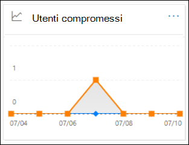

La visualizzazione aggregata mostra i dati degli ultimi 90 giorni e la visualizzazione dettagli mostra i dati degli ultimi 30 giorni.

Per visualizzare il report, aprire il [Centro sicurezza & conformità,](https://protection.office.com)passare **a** \> **Dashboard report** e selezionare **Utenti compromessi.** Per passare direttamente al report, aprire <https://protection.office.com/reportv2?id=CompromisedUsers> .

È possibile filtrare sia il grafico che la tabella dei dettagli facendo clic su **Filtri** e selezionando uno o più dei valori seguenti:

- **Data di inizio** e **Data fine**

- **Sospetto:** l'account utente ha inviato messaggi di posta elettronica sospetti ed è a rischio di essere limitato a inviare messaggi di posta elettronica.

- **Con restrizioni**: all'account utente è stato limitato l'invio di posta elettronica a causa di modelli altamente sospetti.

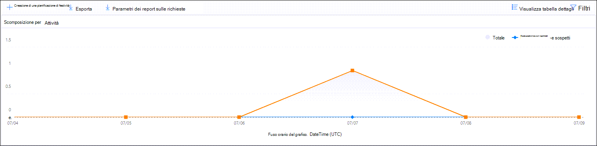

Se si fa **clic su Visualizza tabella dettagli**, è possibile visualizzare i dettagli seguenti:

- **Ora creazione**
- **ID utente**
- **Azione**

Per tornare alla visualizzazione report, fare clic su **Visualizza report.**

## Report crittografia

Il **report Crittografia** è disponibile in EOP (sottoscrizioni con cassette postali in Exchange Online o EOP autonomo senza Exchange Online cassette postali). Il team di sicurezza dell'organizzazione può utilizzare le informazioni contenute in questo report per identificare i modelli e applicare o modificare in modo proattivo i criteri per i messaggi di posta elettronica sensibili. Ad esempio:

- Se viene visualizzato un numero elevato di messaggi di posta elettronica crittografati dagli utenti, è possibile aggiungere un criterio di crittografia per automatizzare la crittografia per determinati casi di utilizzo. Per ulteriori informazioni, vedere [Define mail flow rules to encrypt email messages in Microsoft 365](../../compliance/define-mail-flow-rules-to-encrypt-email.md).

- Se sono disponibili diversi modelli di crittografia ma nessuno li utilizza, è possibile verificare se gli utenti necessitano di formazione delle funzionalità.

La visualizzazione aggregata consente il filtro per gli ultimi 90 giorni, mentre la visualizzazione dettagli consente il filtro per 10 giorni.

Per visualizzare il report, aprire il [Centro sicurezza & conformità,](https://protection.office.com)passare **a** \> **Dashboard report** e selezionare **Report di crittografia.** Per passare direttamente al report, aprire <https://protection.office.com/reportv2?id=EncryptionReport> .

Per ulteriori informazioni sulla crittografia, vedere [Crittografia della posta elettronica in Microsoft 365](../../compliance/email-encryption.md).

### Visualizzazione report per il report Crittografia

Nel grafico è possibile utilizzare i filtri seguenti:

- **Visualizzare i dati per: Rapporto crittografia** messaggi **e Suddivide per: Metodo** di crittografia : sono disponibili i metodi di crittografia seguenti:

  - **Crittografia per utente**
  - **Crittografia in base ai criteri**

  Se si fa **clic su Filtri**, è possibile modificare il grafico con i filtri seguenti:

  - **Data di inizio** e **Data fine**
  - Metodo di crittografia.
  - Modello di crittografia.

- **Visualizzare i dati per: Rapporto crittografia messaggi** **ed Suddivide per: Modello** di crittografia : sono disponibili i metodi di crittografia seguenti:

  - **Non inoltrare**
  - **Crittografa solo**
  - **OME precedente**
  - **Personalizzato**

  Se si fa **clic su Filtri**, è possibile modificare il grafico con i filtri seguenti:

  - **Data di inizio** e **Data fine**
  - Metodo di crittografia
  - Modello di crittografia

- **Visualizzare i dati per: Top 5 recipient domains**: Questa visualizzazione mostra un grafico a torta con i conteggi dei messaggi inviati per i primi 5 domini destinatario.

  Se si fa **clic su Filtri**, è possibile selezionare una data di inizio **e** una data **di fine.**

### Visualizzazione tabella dettagli per il report Crittografia

Se si fa **clic su Visualizza tabella** dettagli , le informazioni visualizzate dipendono dal grafico visualizzato:

- **Break down by: Encryption method** or **Break down by: Encryption template**: The following information is shown:

  - **Data**
  - **Indirizzo del mittente**
  - **Modello di crittografia**
  - **Metodo di crittografia**
  - **Indirizzo destinatario**
  - **Oggetto**

- **Visualizzare i dati per: Top 5 recipient domains**:

  - **Data**
  - **Dominio destinatario**
  - **Conteggio messaggi**

Se si fa **clic su Filtri** in una visualizzazione tabella dei dettagli, è possibile modificare i risultati con i filtri seguenti:

- **Data di inizio** e **Data fine**
- Metodo di crittografia
- Modello di crittografia

Per tornare alla visualizzazione report, fare clic su **Visualizza report.**

## Rapporto sullo stato del flusso di posta

Il **rapporto sullo stato del flusso di posta** contiene informazioni su malware, posta indesiderata, phishing e messaggi bloccati perimetrali. Per ulteriori dettagli, vedere [Mailflow status report](view-mail-flow-reports.md#mailflow-status-report).

## Rilevamenti di malware nel report di posta elettronica

Il **rapporto Rilevamenti malware nel** report di posta elettronica mostra informazioni sui rilevamenti di malware nei messaggi di posta elettronica in arrivo e in uscita (malware rilevato da Exchange Online Protection o EOP). Per ulteriori informazioni sulla protezione da malware in EOP, vedere [Protezione antimalware in EOP.](anti-malware-protection.md)

 Il filtro di visualizzazione aggregata consente 90 giorni, mentre il filtro della tabella dei dettagli consente solo 10 giorni.

Per visualizzare il report, aprire il [Centro sicurezza & conformità,](https://protection.office.com)passare a Dashboard report e  \>  selezionare **Rilevamenti malware nella posta elettronica.** Per passare direttamente al report, aprire <https://protection.office.com/reportv2?id=MalwareDetections> .

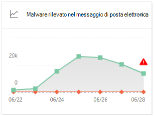

È possibile filtrare sia il grafico che la tabella dei dettagli facendo clic **su Filtri** e selezionando:

- **Data di inizio** e **Data fine**
- **In ingresso**
- **In uscita**

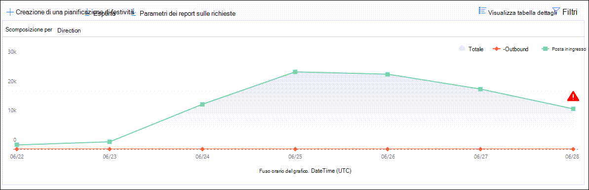

Se si fa **clic su Visualizza tabella dettagli**, è possibile visualizzare i dettagli seguenti:

- **Data**
- **Indirizzo del mittente**
- **Indirizzo destinatario**
- **ID messaggio**: Disponibile nel **campo di intestazione Message-ID** nell'intestazione del messaggio e deve essere univoco. Un valore di esempio è `<08f1e0f6806a47b4ac103961109ae6ef@server.domain>` (si notino le parentesi angolari).
- **Oggetto**
- **Filename**
- **Nome malware**

Per tornare alla visualizzazione report, fare clic su **Visualizza report.**

## Rapporto latenza della posta

Il **report Latenza della posta** contiene informazioni sulla latenza di recapito e detonazione della posta riscontrata all'interno dell'organizzazione. Per ulteriori informazioni, vedere [Mail latency report](view-reports-for-mdo.md#mail-latency-report).

## Rapporto di posta elettronica inviato e ricevuto

Il **report Posta inviata e** ricevuta contiene informazioni su malware, posta indesiderata, regole del flusso di posta (note anche come regole di trasporto) e rilevamenti di malware avanzati dopo l'ingresso della posta elettronica nel servizio. Per ulteriori informazioni, vedere Report di posta elettronica inviati [e ricevuti.](view-mail-flow-reports.md#sent-and-received-email-report)

## Report sui rilevamenti della posta indesiderata

Il **report Rilevamenti posta indesiderata** mostra i messaggi di posta elettronica di posta indesiderata bloccati da EOP. I messaggi vengono conteggiati singolarmente, non per destinatario. Ad esempio, se lo stesso messaggio di posta indesiderata è stato inviato a 100 destinatari nell'organizzazione, viene conteggiato come un unico messaggio.

La visualizzazione aggregata consente un filtro di 90 giorni, mentre la tabella dei dettagli consente un filtro di 10 giorni.

Per visualizzare il report, aprire [il Centro sicurezza & conformità,](https://protection.office.com)passare a Dashboard report  \>  e selezionare **Rilevamenti posta indesiderata.** Per passare direttamente al report, aprire <https://protection.office.com/reportv2?id=SpamDetections> .

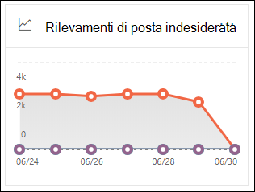

Per ulteriori informazioni sulla protezione da posta indesiderata, vedere Protezione da posta indesiderata [in EOP.](anti-spam-protection.md)

### Visualizzazione report per il report Rilevamenti posta indesiderata

Nella visualizzazione report sono disponibili i grafici seguenti:

- **Scomporsi per: Azione**: vengono visualizzati i tipi di evento seguenti:

  - **Contenuto di posta indesiderata filtrato**
  - **Blocco IP di posta indesiderata**
  - **Blocco busta di posta indesiderata**
  - **Filtro DBEB di posta indesiderata**: blocco perimetrale basato su directory (DBEB)

  Quando si passa il puntatore del mouse su un giorno (punto dati) nel grafico, è possibile vedere quanti elementi sono stati bloccati quel giorno, nonché come tali elementi vengono categorizzati.

  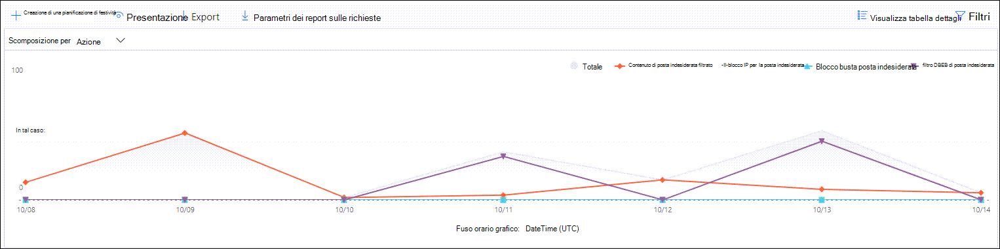

- **Scomporsi per: Direzione**: vengono visualizzate le seguenti indicazioni:

  - **In ingresso**
  - **In uscita**

  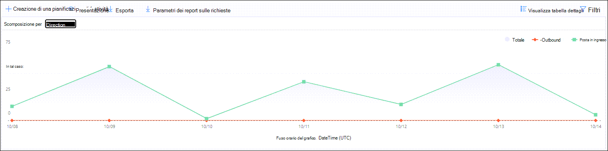

Se si fa **clic su Filtri** in una visualizzazione report, è possibile modificare i risultati con i filtri seguenti:

- **Data di inizio** e **Data fine**
- Valori di direzione
- Valori del tipo di evento

### Visualizzazione tabella dettagli per il report Rilevamenti posta indesiderata

Se si fa **clic su Visualizza tabella dettagli** in qualsiasi visualizzazione report, vengono visualizzate le informazioni seguenti:

- **Data**
- **Indirizzo del mittente**
- **Indirizzo destinatario**
- **Tipo evento**
- **Azione**
- **Oggetto**

Se si fa **clic su Filtri** in una tabella dei dettagli, è possibile modificare i risultati con i filtri seguenti:

- **Data di inizio** e **Data fine**
- Valori di direzione
- Valori del tipo di evento

Per tornare alla visualizzazione report, fare clic su **Visualizza report.**

## Report rilevamenti di spoofing

> [!NOTE]
> Il report dei rilevamenti di spoofing migliorato, come descritto in questo articolo, è in Anteprima, è soggetto a modifiche e non è disponibile in tutte le organizzazioni. La versione precedente del report mostrava solo **Posta buona** e Posta indesiderata rilevata come **posta indesiderata.**

Il **report Rilevamenti di** spoofing mostra informazioni sui messaggi bloccati o consentiti a causa dello spoofing. Per ulteriori informazioni sullo spoofing, vedere [Protezione anti-spoofing in EOP.](anti-spoofing-protection.md)

La visualizzazione aggregata del report consente 45 giorni di filtro, mentre la visualizzazione dettagli consente solo \* dieci giorni di filtro.

\* Infine, sarà possibile utilizzare fino a 90 giorni di filtro.

Per visualizzare il report, aprire il [Centro sicurezza & conformità,](https://protection.office.com)passare **a** \> **Dashboard report** e selezionare **Rilevamenti spoofing**. Per passare direttamente al report, aprire <https://protection.office.com/reportv2?id=SpoofMailReport> .

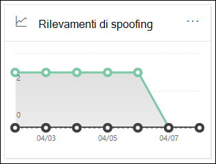

Quando si passa il mouse su un giorno (punto dati) nel grafico, è possibile vedere quanti messaggi falsificati sono stati rilevati e perché.

È possibile filtrare sia il grafico che la tabella dei dettagli facendo clic su **Filtri** e selezionando uno o più dei valori seguenti:

- **Data di inizio** e **Data fine**

- **Risultato**
  - **Pass**
  - **Fail**
  - **SoftPass**
  - **Nessuna**
  - **Altro**

- **Tipo spoof**: **interno** ed **esterno**

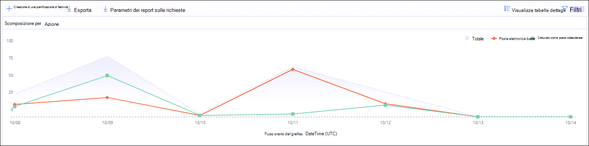

Se si fa **clic su Visualizza tabella dettagli**, è possibile visualizzare i dettagli seguenti:

- **Data**
- **Utente contraffatto**
- **Infrastruttura di invio**
- **Tipo spoofing**
- **Risultato**
- **Codice risultato**
- **SPF**
- **DKIM**
- **DMARC**
- **Conteggio messaggi**

Per tornare alla visualizzazione report, fare clic su **Visualizza report.**

Per ulteriori informazioni sui codici dei risultati dell'autenticazione composita, vedere Intestazioni dei messaggi di posta indesiderata [in Microsoft 365](anti-spam-message-headers.md).

## Report dello stato di protezione dalle minacce

La **relazione sullo stato di Protezione** dalle minacce è disponibile sia in EOP che in Microsoft Defender per Office 365; Tuttavia, i report contengono dati diversi. Ad esempio, i clienti EOP possono visualizzare le informazioni sul malware rilevato nella posta elettronica, ma non informazioni sui file dannosi rilevati dagli allegati sicuri per [SharePoint, OneDrive](mdo-for-spo-odb-and-teams.md)e Microsoft Teams .

Il report fornisce il conteggio dei messaggi di posta elettronica con contenuto dannoso, ad esempio file o indirizzi di siti Web (URL) bloccati dal motore antimalware, eliminazione automatica a zero ore [(ZAP)](zero-hour-auto-purge.md)e Defender per funzionalità di Office 365 come collegamenti [sicuri,](safe-links.md)allegati sicuri e [anti-phishing.](set-up-anti-phishing-policies.md) È possibile utilizzare queste informazioni per identificare le tendenze o determinare se i criteri dell'organizzazione devono essere rettificati.

**Nota:** è importante comprendere che se un messaggio viene inviato a cinque destinatari, viene conteggiato come cinque messaggi diversi e non un messaggio.

Per visualizzare il report, aprire [il Centro sicurezza & conformità,](https://protection.office.com)passare a Dashboard  \> **report** e selezionare **Stato di Protezione dalle minacce**. Per passare direttamente al report, aprire uno degli URL seguenti:

- Microsoft Defender per Office 365:<https://protection.office.com/reportv2?id=TPSAggregateReportATP>
- EOP: <https://protection.office.com/reportv2?id=TPSAggregateReport>

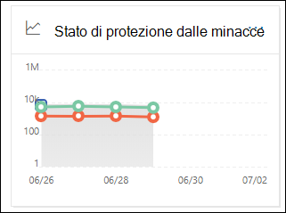

Per impostazione predefinita, il grafico mostra i dati degli ultimi 7 giorni. Se si fa **clic su Filtri**, è possibile selezionare un intervallo di date di 90 giorni (le sottoscrizioni di valutazione potrebbero essere limitate a 30 giorni). La visualizzazione della tabella dei dettagli consente il filtro per 30 giorni.

### Visualizzazione dei report per il rapporto sullo stato di Threat Protection

Sono disponibili le visualizzazioni seguenti:

- **Visualizzare i dati per: Panoramica**: vengono visualizzate le seguenti informazioni di rilevamento:

  - **Malware di posta elettronica**
  - **Phish di posta elettronica**
  - **Malware contenuto**

  

- **Visualizzare i dati per: Contenuto \> Malware**1: Vengono visualizzate le informazioni seguenti per Microsoft Defender per Office 365 organizzazioni:

  - **Motore antimalware:** file dannosi rilevati in Sharepoint, OneDrive e Microsoft Teams dal rilevamento di [virus incorporato in Microsoft 365](virus-detection-in-spo.md).
  - **Detonazione file:** file dannosi rilevati dagli allegati sicuri per [SharePoint, OneDrive e Microsoft Teams](mdo-for-spo-odb-and-teams.md).

  

- **Visualizza dati per: Sostituzione messaggio**: vengono visualizzate le seguenti informazioni sul motivo dell'override:

  - **Ignora locale**
  - **IP Allow**
  - **Regola del flusso di posta**
  - **Mittente consentito**
  - **Dominio consentito**
  - **ZAP non abilitato**
  - **Cartella Posta indesiderata non abilitata**
  - **Mittente sicuro utente**
  - **Dominio sicuro dall'utente**

  

- **Scomporsi per: Tecnologia di rilevamento** **e Visualizzazione dati per: E-mail \> Phish**: Vengono visualizzate le seguenti informazioni:

  - **Reputazione URL generata da ATP**1: reputazione url dannosa generata da Defender per Office 365 detonazioni in altri Microsoft 365 clienti.
  - **Filtro phish avanzato:** segnali di phishing basati sull'apprendimento automatico.
  - **Anti-spoof - Errore DMARC**: errore di autenticazione DMARC nei messaggi.
  - **Anti-spoofing - intra-org:** il mittente sta tentando di eseguire lo spoofing del dominio del destinatario.
  - **Anti-spoofing - dominio esterno:** il mittente sta tentando di eseguire lo spoofing di un altro dominio.
  - **Rappresentazione del marchio**: Rappresentazione di marchi noti in base ai mittenti.
  - **Rappresentazione di dominio**1: Rappresentazione dei domini che il cliente possiede o definisce.
  - **Reputazione URL EOP**: reputazione URL dannoso.
  - **Filtro phish generale**: Segnali di phishing basati sulle regole degli analisti.
  - **Altri**
  - **Phish ZAP**2: Eliminazione automatica a zero ore dei messaggi di phishing.
  - **Detonazione URL**1
  - **Rappresentazione utente**1: Rappresentazione degli utenti definiti dall'amministratore o appresi tramite l'intelligence delle cassette postali.

  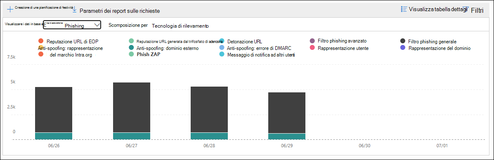

- **Scomporsi per: Tecnologia di rilevamento** e Visualizzazione dati per: Malware di posta elettronica : Vengono visualizzate le informazioni seguenti: **\>**

  - **Reputazione file generata da ATP**1:tutta la reputazione dei file dannosi generata da Defender per Office 365 detonazioni.
  - **Motore antimalware**1: Rilevamento da motori antimalware.
  - **Blocco del tipo di file dei** criteri antimalware: si tratta di messaggi di posta elettronica filtrati a causa del tipo di file dannoso identificato nel messaggio.
  - **Detonazione file**1: rilevamento tramite allegati sicuri.
  - **Reputazione di file dannosi**
  - **Malware ZAP**2
  - **Altri**

  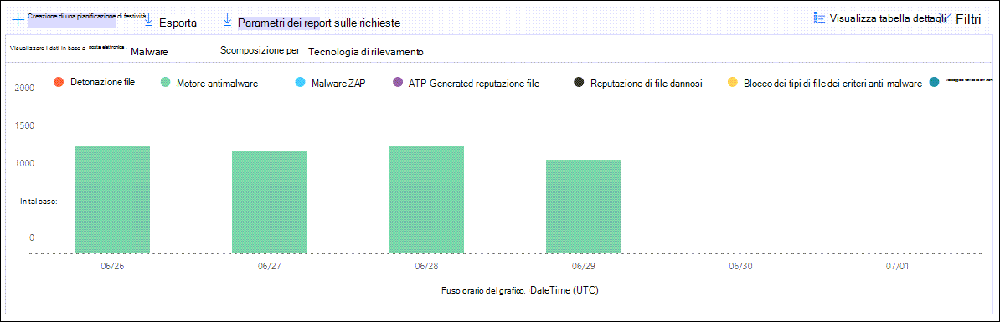

- **Scomporsi per: Tipo di criterio** e Visualizza dati **per: \> E-mail Phish** o Visualizza dati **per: Email \> Malware**: Vengono visualizzate le seguenti informazioni:

  - **Antimalware**
  - **Allegati sicuri**1
  - **Anti-phish**
  - **Protezione da posta indesiderata**
  - **Regola del flusso di** posta (nota anche come regola di trasporto)
  - **Altri**

  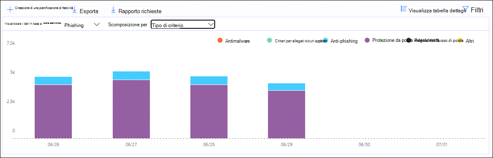

- **Break down by: Delivery status** and **View data by: Email \> Phish** or **View data by: Email \> Malware**: The following information is shown:

  - **Recapito non riuscito**
  - **Rilasciato**
  - **Inoltrato**
  - **Cassetta postale ospitata: cartella personalizzata**
  - **Cassetta postale ospitata: Elementi eliminati**
  - **Cassetta postale ospitata: Posta in arrivo**
  - **Cassetta postale ospitata: Posta indesiderata**
  - **Server locale: recapitato**
  - **Quarantena**

  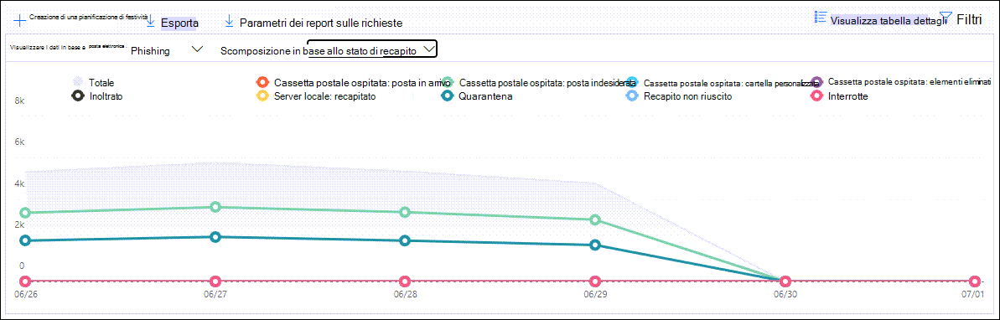

1 Defender per Office 365 solo

2 L'eliminazione automatica a zero ore (ZAP) non è disponibile in EOP autonomo (funziona solo in Exchange Online cassette postali).

Se si fa **clic su Filtri**, i filtri disponibili dipendono dal grafico che si stava esaminando:

- Per **Visualizza dati per: \> Malware** contenuto, è possibile modificare il report in base alla data di inizio **e** alla data **di fine** e al **valore di** rilevamento.

- Per **Visualizza dati per: Sostituzione messaggio**, è possibile modificare il report con i filtri seguenti:

  - **Data di inizio** e **Data fine**
  - **Motivo sostituzione**
  - **Tag**: filtra i risultati in base a utenti o gruppi a cui è stato applicato il tag utente specificato (inclusi gli account di priorità). Per ulteriori informazioni sui tag utente, vedere [Tag utente](user-tags.md).
  - **Dominio**

- Per tutte le altre visualizzazioni, è possibile modificare il report con i filtri seguenti:

  - **Data di inizio** e **Data fine**
  - **Rilevamento**
  - **Protetto da**: **ATP** o **EOP**
  - **Tag**: filtra i risultati in base a utenti o gruppi a cui è stato applicato il tag utente specificato (inclusi gli account di priorità). Per ulteriori informazioni sui tag utente, vedere [Tag utente](user-tags.md).
  - **Dominio**

### Visualizzazione tabella dettagli per il rapporto sullo stato di Threat Protection

Se si fa **clic su Visualizza tabella** dettagli , le informazioni visualizzate dipendono dal grafico visualizzato:

- **Visualizza dati per: Panoramica**: non **è disponibile** il pulsante Visualizza tabella dettagli.

- **Visualizzare i dati per: Contenuto \> Malware**:

  - **Data**
  - **Posizione**
  - **Diretto da**
  - **Nome malware**

  Se si fa **clic su** Filtri in questa visualizzazione, è possibile modificare il report in base alla data di **inizio** e alla data **di fine** e al **valore di** rilevamento.

- **Visualizzare i dati per: Sostituzione messaggio**:

  - **Data**
  - **Oggetto**
  - **Mittente**
  - **Destinatari**
  - **Rilevato da**
  - **Motivo sostituzione**
  - **Origine della compromissione**
  - **Tag**

  Se si fa **clic su** Filtri in questa visualizzazione, è possibile modificare il report con i filtri seguenti:

  - **Data di inizio** e **Data fine**
  - **Motivo sostituzione**
  - **Tag**: filtra i risultati in base a utenti o gruppi a cui è stato applicato il tag utente specificato (inclusi gli account di priorità). Per ulteriori informazioni sui tag utente, vedere [Tag utente](user-tags.md).
  - **Dominio**
  - **Destinatari** (si noti che questa proprietà filtrabile è disponibile solo nella visualizzazione tabella dei dettagli)

- Tutti gli altri grafici:

  - **Data**
  - **Oggetto**
  - **Mittente**
  - **Destinatari**
  - **Rilevato da**
  - **Stato recapito**
  - **Origine della compromissione**
  - **Tag**

  Se si fa **clic su Filtri**, è possibile modificare il report con i filtri seguenti:

  - **Data di inizio** e **Data fine**
  - **Rilevamento**
  - **Protetto da**: **Defender per Office 365** o **EOP**
  - **Tag**: filtra i risultati in base a utenti o gruppi a cui è stato applicato il tag utente specificato (inclusi gli account di priorità). Per ulteriori informazioni sui tag utente, vedere [Tag utente](user-tags.md).
  - **Dominio**
  - **Destinatari** (si noti che questa proprietà filtrabile è disponibile solo nella visualizzazione tabella dei dettagli)

## Report principale sul malware

Il **report Top malware** mostra i vari tipi di malware rilevati dalla protezione [antimalware in EOP.](anti-malware-protection.md)

Per visualizzare il report, aprire il [Centro sicurezza & conformità,](https://protection.office.com)passare **a** \> **Dashboard report** e selezionare **Malware principale.** Per passare direttamente al report, aprire <https://protection.office.com/reportv2?id=TopMalware> .

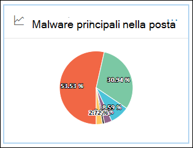

Quando si passa il mouse su un cuneo nel grafico a torta, è possibile visualizzare il nome di un tipo di malware e il numero di messaggi rilevati come malware.

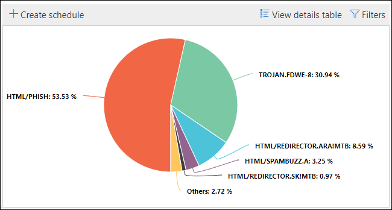

Se si fa **clic su Visualizza tabella dettagli**, è possibile visualizzare i dettagli seguenti:

- **Malware principale**
- **Numero**

Se si fa **clic su Filtri** nella visualizzazione report o nella visualizzazione tabella dei dettagli, è possibile specificare un intervallo di date con Data **inizio** e **Data fine.**

## Report di protezione dalle minacce URL

Il **report di protezione dalle minacce URL** è disponibile in Microsoft Defender per Office 365. Per ulteriori informazioni, vedere [Report di protezione dalle minacce URL](view-reports-for-mdo.md#url-threat-protection-report).

## Rapporto messaggi segnalati dall'utente

Il **rapporto** Messaggi segnalati dall'utente mostra informazioni sui messaggi di posta elettronica segnalati  dagli utenti come posta indesiderata, tentativi di phishing o buona posta utilizzando il componente aggiuntivo Segnala messaggio o Il componente aggiuntivo Segnala [phishing](enable-the-report-phish-add-in.md).

Sono disponibili dettagli per ogni messaggio, incluso il motivo del recapito, ad esempio un'eccezione del criterio di posta indesiderata o una regola del flusso di posta configurata per l'organizzazione. Per visualizzare i dettagli, selezionare un elemento nell'elenco dei report utente e quindi visualizzare le informazioni nelle **schede Riepilogo** **e** Dettagli.

Per visualizzare questo report, nel [Centro sicurezza & conformità](https://protection.office.com)eseguire una delle operazioni seguenti:

- Vai a **Dashboard di gestione delle** \> **minacce** Messaggi \> **segnalati dall'utente**.

- Passare a **Gestione delle minacce** \> **Esaminare** i messaggi segnalati \> **dall'utente**.

> [!IMPORTANT]
> Per il corretto funzionamento del rapporto Messaggi  segnalati dall'utente, è necessario che la registrazione di controllo sia attivata per l'Office 365 locale. Questa operazione viene in genere eseguita da un utente a cui è assegnato il ruolo Log di controllo in Exchange Online. Per ulteriori informazioni, vedere [Turn Microsoft 365 audit log search on or off](../../compliance/turn-audit-log-search-on-or-off.md).

## Quali autorizzazioni sono necessarie per visualizzare questi report?

Per visualizzare e utilizzare i report descritti in questo articolo, è necessario essere membri di uno dei gruppi di ruoli seguenti nel Centro sicurezza & conformità:

- **Gestione organizzazione**
- **Amministratore della sicurezza**
- **Lettore sicurezza**
- **Lettore globale**

Per altre informazioni, vedere [Autorizzazioni nel Centro sicurezza e conformità](permissions-in-the-security-and-compliance-center.md).

**Nota:** l'aggiunta di utenti al ruolo Azure Active Directory corrispondente nell'interfaccia di amministrazione di Microsoft 365 offre  agli utenti le autorizzazioni necessarie nel Centro sicurezza e conformità di & e le autorizzazioni per altre funzionalità di Microsoft 365. Per altre informazioni, vedere [Informazioni sui ruoli di amministratore](../../admin/add-users/about-admin-roles.md).

## Cosa succede se i report non mostrano dati?

Se i dati nei report non vengono visualizzati, verificare che i criteri siano configurati correttamente. Per ulteriori informazioni, vedere [Protezione dalle minacce.](protect-against-threats.md)

## Argomenti correlati

[Protezione da posta indesiderata e antimalware in EOP](anti-spam-and-anti-malware-protection.md)

[Report intelligenti e informazioni dettagliate nel Centro sicurezza e conformità](reports-and-insights-in-security-and-compliance.md)

[Visualizzare i report del flusso di posta nel Centro sicurezza & conformità](view-mail-flow-reports.md)

[Visualizzare i report per Defender per Office 365](view-reports-for-mdo.md)
