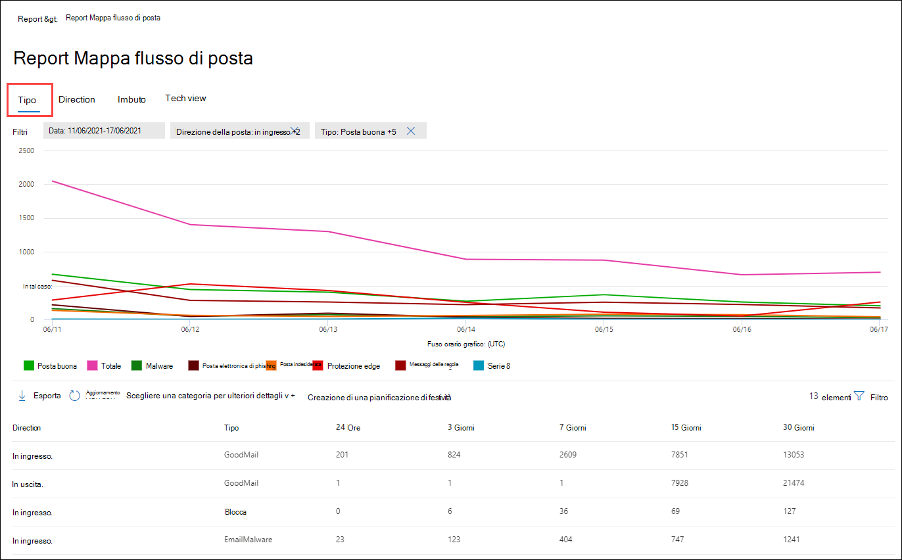
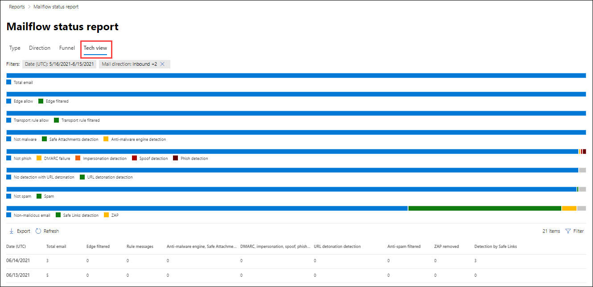

# Visualizzare i report di sicurezza della posta elettronica nel portale Microsoft 365 Defender posta elettronica

[!INCLUDE [Microsoft 365 Defender rebranding](../includes/microsoft-defender-for-office.md)]

**Si applica a**
- [Exchange Online Protection](exchange-online-protection-overview.md)
- [Microsoft Defender per Office 365 piano 1 e piano 2](defender-for-office-365.md)
- [Microsoft 365 Defender](../defender/microsoft-365-defender.md)

Nel portale di Microsoft 365 Defender è disponibile un'ampia gamma di report che consentono di verificare in che modo le funzionalità di sicurezza della posta elettronica, ad esempio la protezione da posta indesiderata, antimalware e crittografia in Microsoft 365, proteggono <https://security.microsoft.com> l'organizzazione. Se si dispone [delle](#what-permissions-are-needed-to-view-these-reports)autorizzazioni necessarie, è possibile visualizzare questi  report nel portale di Microsoft 365 Defender andando a Rapporti e-mail & \> **collaborazione** \> **E-mail**& rapporti di collaborazione . Per passare direttamente alla pagina Rapporti di **collaborazione &** e-mail, aprire <https://security.microsoft.com/emailandcollabreport> .

> [!NOTE]
>
> Alcuni dei report nella pagina Rapporti di **collaborazione &** e-mail richiedono Microsoft Defender per Office 365. Per informazioni su questi report, vedere [View Defender for Office 365 reports in the Microsoft 365 Defender portal.](view-reports-for-mdo.md)
>
> I report correlati al flusso di posta sono ora disponibili nell'interfaccia di amministrazione di Exchange (EAC). Per ulteriori informazioni su questi report, vedere [Mail flow reports in the new Exchange admin center](/exchange/monitoring/mail-flow-reports/mail-flow-reports).

## Report utenti compromessi

> [!NOTE]
> Questo report è disponibile nelle organizzazioni Microsoft 365 con Exchange Online cassette postali. Non è disponibile nelle organizzazioni autonome Exchange Online Protection (EOP).

Il **report Utenti compromessi** mostra il numero di  account  utente contrassegnati come sospetti o con restrizioni negli ultimi 7 giorni. Gli account in uno di questi stati sono problematici o addirittura compromessi. Con un uso frequente, è possibile utilizzare il report per individuare picchi e persino tendenze in account sospetti o con restrizioni. Per ulteriori informazioni sugli utenti compromessi, vedere [Risposta a un account di posta elettronica compromesso.](responding-to-a-compromised-email-account.md)

La visualizzazione aggregata mostra i dati degli ultimi 90 giorni e la visualizzazione dettagli mostra i dati degli ultimi 30 giorni.

Per visualizzare il report nel portale Microsoft 365 Defender, passare **a** Report e-mail & \> **collaborazione** \> **E-mail & rapporti di collaborazione**. Nella pagina **Rapporti di &** e-mail individuare Utenti **compromessi** e quindi fare clic **su Visualizza dettagli.** Per passare direttamente al report, aprire <https://security.microsoft.com/reports/CompromisedUsers> .

Nella pagina **Utenti compromessi** è possibile filtrare sia il grafico che la tabella dei dettagli facendo clic su **Filtro** e selezionando uno o più dei valori seguenti nel riquadro a comparsa visualizzato:

- **Date (UTC)**: **Data di inizio** e Data di **fine**.
- **Attività**:
  - **Sospetto:** l'account utente ha inviato messaggi di posta elettronica sospetti ed è a rischio di essere limitato a inviare messaggi di posta elettronica.
  - **Con restrizioni**: all'account utente è stato limitato l'invio di posta elettronica a causa di modelli altamente sospetti.

Al termine della configurazione dei filtri, fare clic **su Applica,** **Annulla** o **Cancella filtri.**

Nella tabella dei dettagli sotto il grafico è possibile visualizzare i dettagli seguenti:

- **Ora creazione**
- **ID utente**
- **Azione**

## Exchange delle regole di trasporto

Il **Exchange delle regole di trasporto** mostra l'effetto delle regole del flusso di posta (note anche come regole di trasporto) sui messaggi in arrivo e in uscita nell'organizzazione.

Per visualizzare il report nel portale Microsoft 365 Defender, passare **a** Report e-mail & \> **collaborazione** \> **E-mail & rapporti di collaborazione**. Nella pagina **Rapporti di &** e-mail individuare Exchange di **trasporto** e quindi fare clic su **Visualizza dettagli.** Per passare direttamente al report, aprire <https://security.microsoft.com/reports/ETRRuleReport> .

Nella pagina **Exchange report delle regole di** trasporto, i grafici e i dati disponibili sono descritti nelle sezioni seguenti.

### Suddivisione del grafico per direzione

Se si seleziona **Suddivisione grafico per direzione**, sono disponibili i grafici seguenti:

- **Visualizzare i dati Exchange regole di trasporto**:  Numero di messaggi **in** ingresso e in uscita interessati dalle regole del flusso di posta.
- **View data by DLP Exchange transport rules**: The number of **Inbound** and **Outbound** messages that were affected by data loss prevention (DLP) mail flow rules.

Nella tabella dei dettagli sotto il grafico vengono visualizzate le informazioni seguenti:

- **Data**
- **Criterio DLP** (**Visualizza i dati solo per Exchange DLP)**
- **Regola di trasporto**
- **Oggetto**
- **Indirizzo del mittente**
- **Indirizzo destinatario**
- **Gravità**
- **Direzione**

È possibile filtrare sia il grafico che la tabella dei dettagli facendo clic su **Filtro** e selezionando uno o più dei valori seguenti nel riquadro a comparsa visualizzato:

- **Data (UTC)** **Data di inizio e** Data **fine**
- **Direzione**: **In uscita** e **in ingresso**
- **Gravità**: **Gravità elevata,** **Gravità media** e **Gravità bassa**

Al termine della configurazione dei filtri, fare clic **su Applica,** **Annulla** o **Cancella filtri.**

### Suddivisione del grafico per gravità

Se si seleziona **Scomposizione grafico per gravità**, sono disponibili i grafici seguenti:

- **Visualizzare i dati Exchange regole di trasporto**: Numero di messaggi Di gravità elevata, Gravità media e  **Gravità** bassa.  Il livello di gravità viene impostato come azione nella regola **(** Controlla questa regola con livello di gravità o _SetAuditSeverity_). Per ulteriori informazioni, vedere [Mail flow rule actions in Exchange Online](/Exchange/security-and-compliance/mail-flow-rules/mail-flow-rule-actions).

- **Visualizzare i dati** da DLP Exchange di trasporto : Numero di messaggi  di gravità **elevata,** gravità media e gravità bassa interessati dalle regole del flusso di posta DLP.

Nella tabella dei dettagli sotto il grafico vengono visualizzate le informazioni seguenti:

- **Data**
- **Criterio DLP** (**Visualizza i dati solo per Exchange DLP)**
- **Regola di trasporto**
- **Oggetto**
- **Indirizzo del mittente**
- **Indirizzo destinatario**
- **Gravità**
- **Direzione**

È possibile filtrare sia il grafico che la tabella dei dettagli facendo clic su **Filtro** e selezionando uno o più dei valori seguenti nel riquadro a comparsa visualizzato:

- **Data (UTC)** **Data di inizio e** Data **fine**
- **Direzione**: **In uscita** e **in ingresso**
- **Gravità**: **Gravità elevata,** **Gravità media** e **Gravità bassa**

Al termine della configurazione dei filtri, fare clic **su Applica,** **Annulla** o **Cancella filtri.**

## Rapporto di inoltro

> [!NOTE]
> Il **report di inoltro** è ora disponibile nell'interfaccia di amministrazione di Exchange. Per ulteriori informazioni, vedere [Report messaggi inoltrati automaticamente nel nuovo interfaccia di amministrazione di Exchange.](/exchange/monitoring/mail-flow-reports/mfr-auto-forwarded-messages-report)

## Rapporto sullo stato del flusso di posta

Il **rapporto** sullo stato del flusso di posta è un report intelligente che mostra informazioni sulla posta elettronica in arrivo e in uscita, sui rilevamenti di posta indesiderata, sul malware, sulla posta elettronica identificata come "buona" e sulle informazioni sulla posta elettronica consentita o bloccata sul perimetro. Questo è l'unico report che contiene informazioni sulla protezione perimetrale e mostra la quantità di posta elettronica bloccata prima di essere consentita al servizio per la valutazione da parte di Exchange Online Protection (EOP). È importante comprendere che se un messaggio viene inviato a cinque destinatari, viene conteggiato come cinque messaggi diversi e non un messaggio.

Per visualizzare il report nel portale Microsoft 365 Defender, passare **a** Report e-mail & \> **collaborazione** \> **E-mail & rapporti di collaborazione**. Nella pagina **E-mail & rapporti di collaborazione,** trovare Riepilogo stato **flusso** di posta e quindi fare clic **su Visualizza dettagli**. Per passare direttamente al report, aprire <https://security.microsoft.com/reports/mailflowStatusReport> .

### Visualizzazione tipo per la relazione sullo stato del flusso di posta

Nella pagina **Relazione sullo stato del flusso di posta** la scheda **Tipo** è selezionata per impostazione predefinita. Per impostazione predefinita, questa visualizzazione contiene un grafico e una tabella dei dettagli configurata con i filtri seguenti:

- **Data (UTC)** Ultimi 7 giorni.
- **Direzione della posta**:
  - **In ingresso**
  - **In uscita**
  - **Intra-org:** questo conteggio è per i messaggi all'interno di un tenant, ad esempio mittente abc@domain.com invia al destinatario xyz@domain.com (conteggiato separatamente da **In ingresso** e **In uscita)**
- **Digitare**:
  - **Posta buona**
  - **Malware**
  - **Posta indesiderata**
  - **Protezione edge**
  - **Messaggi delle regole**
  - **Posta di phishing**
- **Domain**: **All**

Il grafico è organizzato in base ai **valori Type.**

È possibile modificare questi filtri facendo clic su **Filtro**.

Nella tabella dei dettagli sotto il grafico vengono visualizzate le informazioni seguenti:

- **Direzione**
- **Type**
- **24 ore**
- **3 giorni**
- **7 giorni**
- **15 giorni**
- **30 giorni**

Se si fa **clic su Scegli una categoria per ulteriori dettagli,** è possibile selezionare uno dei valori seguenti:

- **Posta elettronica di phishing**: questa selezione consente di visualizzare il [rapporto sullo stato di Protezione dalle minacce.](view-email-security-reports.md#threat-protection-status-report)
- **Malware nella posta elettronica**: questa selezione consente di visualizzare il [rapporto sullo stato di Protezione dalle minacce.](view-email-security-reports.md#threat-protection-status-report)
- **Rilevamenti di posta indesiderata:** questa selezione consente di accedere al [report Rilevamenti posta indesiderata.](view-email-security-reports.md#spam-detections-report)
- **Posta indesiderata bloccata** perimetrali : questa selezione consente di accedere al [report Rilevamenti posta indesiderata.](view-email-security-reports.md#spam-detections-report)

#### Esportare dalla visualizzazione Tipo

Per la visualizzazione dettagli, è possibile esportare i dati solo per un giorno. Pertanto, se si desidera esportare i dati per 7 giorni, è necessario eseguire 7 diverse azioni di esportazione.

Ogni file .csv esportato è limitato a 150.000 righe. Se i dati di quel giorno contengono più di 150.000 righe, verranno creati .csv file.

### Visualizzazione della direzione per la relazione sullo stato del flusso di posta

Se si fa clic **sulla scheda Direzione,** vengono utilizzati gli stessi filtri predefiniti della **visualizzazione** Tipo.

Il grafico è organizzato in base **ai valori di** Direzione.

È possibile modificare questi filtri facendo clic su **Filtro**. Vengono utilizzati gli stessi filtri **della** visualizzazione Tipo.

La tabella dei dettagli contiene le stesse informazioni della **visualizzazione Tipo.**

**L'opzione Scegliere una categoria per ulteriori dettagli** le selezioni e il comportamento disponibili sono gli stessi della visualizzazione **Tipo.**

#### Esportare dalla visualizzazione Direzione

Per la visualizzazione dettagli, è possibile esportare i dati solo per un giorno. Pertanto, se si desidera esportare i dati per 7 giorni, è necessario eseguire 7 diverse azioni di esportazione.

Ogni file .csv esportato è limitato a 150.000 righe. Se i dati di quel giorno contengono più di 150.000 righe, verranno creati .csv file.

### Visualizzazione imbuto per la relazione sullo stato del flusso di posta

La **visualizzazione Imbuto** mostra come le funzionalità di protezione dalle minacce di posta elettronica di Microsoft filtrano la posta elettronica in arrivo e in uscita nell'organizzazione. Fornisce informazioni dettagliate sul conteggio totale della posta elettronica e sul modo in cui le funzionalità di protezione dalle minacce configurate, tra cui protezione perimetrale, antimalware, anti-phishing, protezione da posta indesiderata e anti-spoofing influiscono su questo conteggio.

Se si fa clic sulla scheda **Imbuto,** per impostazione predefinita, questa visualizzazione contiene un grafico e una tabella dei dettagli configurata con i filtri seguenti:

- **Date**: Ultimi 7 giorni.

- **Direzione**:
  - **In ingresso**
  - **In uscita**
  - **Intra-org:** questo conteggio è per i messaggi inviati all'interno di un tenant; Ad esempio, il mittente abc@domain.com inviato al destinatario xyz@domain.com (conteggiato separatamente da Inbound e Outbound).

La visualizzazione aggregata e la tabella dei dettagli consentono 90 giorni di filtro.

È possibile modificare questi filtri facendo clic su **Filtro**. Vengono utilizzati gli stessi filtri **della** visualizzazione Tipo.

Questo grafico mostra il numero di messaggi di posta elettronica organizzati per:

- **Totale posta elettronica**
- **Posta elettronica dopo la protezione edge**
- **Regola di posta elettronica dopo il trasporto** (regola del flusso di posta)
- **Posta elettronica dopo antimalware, reputazione file, blocco del tipo di file**
- **Email after anti-phish, URL reputation, brand impersonation, anti-spoof**
- **Posta elettronica dopo la posta indesiderata, filtro posta in blocco**
- **Posta elettronica dopo la rappresentazione di utenti e domini**\*
- **Posta elettronica dopo la detonazione di file e URL**\*
- **Email detected as benign after post-delivery protection (URL click time protection)**

\*Defender solo per Office 365

Per visualizzare il messaggio di posta elettronica filtrato da EOP o Defender per Office 365 separatamente, fare clic sul valore nella legenda del grafico.

La tabella dei dettagli contiene le informazioni seguenti, visualizzate in ordine di data decrescente:

- **Data**
- **Totale posta elettronica**
- **Protezione edge**
- **Antimalware, reputazione file, blocco del tipo di file**:
  - **Reputazione file:** messaggi filtrati a causa dell'identificazione di un file allegato da parte di altri clienti Microsoft.
  - **Blocco del tipo di** file : Messaggi filtrati a causa del tipo di file dannoso identificato nel messaggio.
- **Anti-phish, reputazione URL, rappresentazione del marchio, anti-spoofing**:
  - **Reputazione URL**: Messaggi filtrati a causa dell'identificazione dell'URL da parte di altri clienti Microsoft.
  - **Rappresentazione del marchio**: messaggi filtrati a causa del messaggio proveniente da mittenti noti che rappresentano il marchio.
  - **Anti-spoof**: messaggi filtrati a causa del tentativo di spoofing di un dominio a cui appartiene il destinatario o di un dominio di cui il mittente non è proprietario.
- **Protezione da posta indesiderata, filtro posta in blocco**:
  - **Filtro posta in blocco**: Messaggi filtrati in base alla soglia del livello di reclamo in blocco (BCL) in un criterio di protezione da posta indesiderata.
- **Rappresentazione utente e dominio (Defender per Office 365)**:
  - **Rappresentazione utente**: messaggi filtrati a causa di un tentativo di rappresentazione di un utente (mittente del messaggio) definito nelle impostazioni di protezione della rappresentazione di un criterio anti-phishing.
  - **Rappresentazione di dominio**: messaggi filtrati a causa di un tentativo di rappresentare un dominio definito nelle impostazioni di protezione della rappresentazione di un criterio anti-phishing.
- **Detonazione di file e URL (Defender per Office 365)**:
  - **Detonazione file:** messaggi filtrati da un criterio Cassaforte allegati.
  - **Detonazione URL:** messaggio filtrato in base a un criterio Cassaforte collegamenti.
- **Protezione post-recapito e ZAP (ATP) o ZAP (EOP):** eliminazione automatica a zero ore (ZAP) per malware, posta indesiderata e phishing.

Se si seleziona una riga nella tabella dei dettagli, nel riquadro a comparsa viene visualizzata un'ulteriore suddivisione dei conteggi dei messaggi di posta elettronica.

#### Esportare dalla visualizzazione Imbuto

Dopo aver fatto **clic su** Esporta **in Opzioni,** è possibile selezionare uno dei valori seguenti:

- **Riepilogo (con i dati degli ultimi 90 giorni al massimo)**
- **Dettagli (con dati degli ultimi 30 giorni al massimo)**

In **Data** scegliere un intervallo e quindi fare clic su **Applica.** I dati per i filtri correnti verranno esportati in un .csv file.

Ogni file .csv esportato è limitato a 150.000 righe. Se i dati contengono più di 150.000 righe, verranno creati .csv file.

### Visualizzazione tecnica per la relazione sullo stato del flusso di posta

La **visualizzazione Tech** è simile alla visualizzazione **Imbuto,** fornendo dettagli più dettagliati per le funzionalità di protezione dalle minacce configurate. Dal grafico è possibile vedere come i messaggi vengono categorizzati nelle diverse fasi della protezione dalle minacce.

Se si fa clic **sulla scheda Visualizzazione tecnica,** per impostazione predefinita, questa visualizzazione contiene un grafico e una tabella dei dettagli configurata con i filtri seguenti:

- **Date**: Ultimi 7 giorni.

- **Direzione**:
  - **In ingresso**
  - **In uscita**
  - **Intra-org:** questo conteggio è per i messaggi all'interno di un tenant, ad esempio mittente abc@domain.com invia al destinatario xyz@domain.com (conteggiato separatamente da in ingresso e in uscita)

La visualizzazione aggregata e la tabella dei dettagli consentono 90 giorni di filtro.

È possibile modificare questi filtri facendo clic su **Filtro**. Vengono utilizzati gli stessi filtri **della** visualizzazione Tipo.

Questo grafico mostra i messaggi organizzati nelle categorie seguenti:

- **Totale posta elettronica**
- **Edge allow** e **Edge filtered**
- **Regola di trasporto consentita** **e regola di trasporto filtrata** (regole del flusso di posta)
- **Non malware,** **Cassaforte allegati e** rilevamento motore \* **antimalware**
- **Not phish,** **DMARC failure,** **Impersonation detection,** \* Spoof **detection** e **Phish detection**
- **Nessun rilevamento con detonazione URL e** **rilevamento detonazione URL**\*
- **Non posta indesiderata** e  **posta indesiderata**
- **Posta elettronica non dannosa,** **rilevamento Cassaforte** \* collegamenti e **ZAP**

\*Defender per Office 365

Quando si passa il mouse su una categoria nel grafico, è possibile visualizzare il numero di messaggi in tale categoria.

La tabella dei dettagli contiene le informazioni seguenti, visualizzate in ordine di data decrescente:

- **Data (UTC)**
- **Totale posta elettronica**
- **Edge filtrato**
- **Messaggi delle regole**: Messaggi filtrati a causa delle regole del flusso di posta (note anche come regole di trasporto).
- **Motore antimalware**, **Cassaforte allegati** \* :
- **DMARC, impersonation,** \* **spoof,** **phish filtered**:
  - **DMARC**: Messaggi filtrati a causa dell'errore del messaggio nel controllo di autenticazione DMARC.
- **Rilevamento detonazione URL**\*
- **Protezione da posta indesiderata filtrata**
- **ZAP rimosso**
- **Rilevamento da Cassaforte collegamenti**\*

\*Defender per Office 365

Se si seleziona una riga nella tabella dei dettagli, nel riquadro a comparsa viene visualizzata un'ulteriore suddivisione dei conteggi dei messaggi di posta elettronica.

#### Esportare da tech view

Facendo clic **su Esporta,** in **Opzioni** è possibile selezionare uno dei valori seguenti:

- **Riepilogo (con i dati degli ultimi 90 giorni al massimo)**
- **Dettagli (con dati degli ultimi 30 giorni al massimo)**

In **Data** scegliere un intervallo e quindi fare clic su **Applica.** I dati per i filtri correnti verranno esportati in un .csv file.

Ogni file .csv esportato è limitato a 150.000 righe. Se i dati contengono più di 150.000 righe, verranno creati .csv file.

## Report rilevamenti di malware

Il **report Rilevamenti malware** mostra informazioni sui rilevamenti di malware nei messaggi di posta elettronica in arrivo e in uscita (malware rilevato da Exchange Online Protection o EOP). Per ulteriori informazioni sulla protezione da malware in EOP, vedere [Protezione antimalware in EOP.](anti-malware-protection.md)

Il filtro di visualizzazione aggregata consente 90 giorni, mentre il filtro della tabella dei dettagli consente solo 10 giorni.

Per visualizzare il report nel portale Microsoft 365 Defender, passare **a** Report e-mail & \> **collaborazione** \> **E-mail & rapporti di collaborazione**. Nella pagina **Rapporti di collaborazione &** posta elettronica individuare Malware rilevato **nella** posta elettronica e quindi fare clic su **Visualizza dettagli.** Per passare direttamente al report, aprire <https://security.microsoft.com/reports/MalwareDetections> .

Nella pagina **report Rilevamenti malware** è possibile filtrare sia il grafico che la tabella dei dettagli facendo clic su **Filtro** e selezionando uno dei valori seguenti:

- **Data (UTC)** **Data di inizio e** Data **fine**
- **Direzione**: **In ingresso** e **In uscita**

Nella tabella dei dettagli sotto il grafico è possibile visualizzare i dettagli seguenti:

- **Data**
- **Indirizzo del mittente**
- **Indirizzo destinatario**
- **ID messaggio**: Disponibile nel **campo di intestazione Message-ID** nell'intestazione del messaggio e deve essere univoco. Un valore di esempio è `<08f1e0f6806a47b4ac103961109ae6ef@server.domain>` (si notino le parentesi angolari).
- **Oggetto**
- **Filename**
- **Nome malware**

## Rapporto latenza della posta

Il **report Latenza della posta** in Defender per Office 365 contiene informazioni sulla latenza di recapito e detonazione della posta riscontrata all'interno dell'organizzazione. Per ulteriori informazioni, vedere [Mail latency report](view-reports-for-mdo.md#mail-latency-report).

## Report sui rilevamenti della posta indesiderata

> [!NOTE]
> Il **rapporto Rilevamenti posta indesiderata** andrà infine via. Le stesse informazioni sono disponibili nella relazione [sullo stato di Threat Protection.](#threat-protection-status-report)

## Report rilevamenti di spoofing

> [!NOTE]
> Il report dei rilevamenti di spoofing migliorato, come descritto in questo articolo, è in Anteprima, è soggetto a modifiche e non è disponibile in tutte le organizzazioni. La versione precedente del report mostra solo **Posta buona** e Posta indesiderata rilevata come **posta indesiderata.**

Il **report Rilevamenti di** spoofing mostra informazioni sui messaggi bloccati o consentiti a causa dello spoofing. Per ulteriori informazioni sullo spoofing, vedere [Protezione anti-spoofing in EOP.](anti-spoofing-protection.md)

La visualizzazione aggregata del report consente 45 giorni di filtro, mentre la visualizzazione dettagli consente solo \* dieci giorni di filtro.

\* Infine, sarà possibile utilizzare fino a 90 giorni di filtro.

Per visualizzare il report nel portale Microsoft 365 Defender, passare **a** Report e-mail & \> **collaborazione** \> **E-mail & rapporti di collaborazione**. Nella pagina **Rapporti di collaborazione &** posta elettronica individuare **Rilevamenti spoofing** e quindi fare clic **su Visualizza dettagli.** Per passare direttamente al report, aprire <https://security.microsoft.com/reports/SpoofMailReportV2> .

Il grafico mostra le informazioni seguenti:

- **Pass**
- **Fail**
- **SoftPass**
- **Nessuna**
- **Altro**

Quando si passa il mouse su un giorno (punto dati) nel grafico, è possibile vedere quanti messaggi falsificati sono stati rilevati e perché.

Nella pagina **Spoofing mail report** è possibile filtrare sia il grafico che la tabella dei dettagli facendo clic su **Filtro** e selezionando uno o più dei valori seguenti:

- **Data (UTC)** **Data di inizio e** Data **fine**
- **Risultato**:
  - **Pass**
  - **Fail**
  - **SoftPass**
  - **Nessuna**
  - **Altro**
- **Tipo spoof**: **interno** ed **esterno**

Nella tabella dei dettagli sotto il grafico è possibile visualizzare i dettagli seguenti:

- **Data**
- **Utente contraffatto**
- **Infrastruttura di invio**
- **Tipo spoofing**
- **Risultato**
- **Codice risultato**
- **SPF**
- **DKIM**
- **DMARC**
- **Conteggio messaggi**

Per ulteriori informazioni sui codici dei risultati dell'autenticazione composita, vedere Intestazioni dei messaggi di posta indesiderata [in Microsoft 365](anti-spam-message-headers.md).

## Report Invii

Il **report Invii** mostra informazioni sugli elementi che gli amministratori hanno segnalato a Microsoft per l'analisi. Per ulteriori informazioni, vedere [Use Admin Submission to submit suspected spam, phish, URLs, and files to Microsoft](admin-submission.md).

Per visualizzare il report nel portale Microsoft 365 Defender, passare **a** Report e-mail & \> **collaborazione** \> **E-mail & rapporti di collaborazione**. Nella pagina **E-mail & rapporti di collaborazione,** trovare **Invii** e quindi fare clic **su Visualizza dettagli.** Per passare direttamente al report, aprire <https://security.microsoft.com/adminSubmissionReport> . Per passare agli [invii di amministratore](admin-submission.md)nel portale Microsoft 365 Defender, fare clic **su Vai a Invii.**

Il grafico mostra le informazioni seguenti:

- **In sospeso**
- **Operazione completata**

Nella pagina **Invii** è possibile filtrare sia il grafico che la tabella dei dettagli facendo clic su **Filtro** e selezionando uno o più dei valori seguenti:

- **Data riportata**: **Ora inizio** **e Ora fine**
- **Tipo invio**:
  - **Posta elettronica**
  - **URL**
  - **File**
- **ID invio**
- **ID messaggio di rete**
- **Mittente**
- **Nome**
- **Inviato da**
- **Motivo dell'invio:**
  - **Non indesiderato**
  - **Phishing**
  - **Malware**
  - **Posta indesiderata**
- **Stato nuova analisi**:
  - **In sospeso**
  - **Operazione completata**

La tabella dei dettagli sotto il grafico  mostra le stesse informazioni  e ha le stesse opzioni Raggruppa o Personalizza colonne della scheda Inviato per l'analisi in **Invio** di &  \> collaborazione. Per altre informazioni, vedi [Visualizzare gli invii di amministratori a Microsoft](admin-submission.md#view-admin-submissions-to-microsoft).

## Report dello stato di protezione dalle minacce

La **relazione sullo stato di Protezione** dalle minacce è disponibile sia in EOP che in Defender per Office 365; Tuttavia, i report contengono dati diversi. Ad esempio, i clienti di EOP possono visualizzare le informazioni sul malware rilevato nella posta elettronica, ma non informazioni sui file dannosi rilevati da allegati Cassaforte per [SharePoint, OneDrive](mdo-for-spo-odb-and-teams.md)e Microsoft Teams .

Il report fornisce il conteggio dei messaggi di posta elettronica con contenuto dannoso, ad esempio file o indirizzi di siti Web (URL) bloccati dal motore antimalware, eliminazione automatica a zero ore [(ZAP)](zero-hour-auto-purge.md)e Defender per funzionalità di Office 365 come collegamenti [di Cassaforte,](safe-links.md) [allegati Cassaforte](safe-attachments.md)e funzionalità di protezione dalla rappresentazione nei criteri [anti-phishing.](set-up-anti-phishing-policies.md#exclusive-settings-in-anti-phishing-policies-in-microsoft-defender-for-office-365) È possibile utilizzare queste informazioni per identificare le tendenze o determinare se i criteri dell'organizzazione devono essere rettificati.

**Nota:** è importante comprendere che se un messaggio viene inviato a cinque destinatari, viene conteggiato come cinque messaggi diversi e non un messaggio.

Per visualizzare il report nel portale Microsoft 365 Defender, passare **a** Report e-mail & \> **collaborazione** \> **E-mail & rapporti di collaborazione**. Nella pagina **Rapporti di collaborazione &** posta elettronica individuare Lo stato di Protezione dalle **minacce** e quindi fare clic su **Visualizza dettagli.** Per passare direttamente al report, aprire uno degli URL seguenti:

- Defender per Office 365:<https://security.microsoft.com/reports/TPSAggregateReportATP>
- EOP: <https://security.microsoft.com/reports/TPSAggregateReport>

Per impostazione predefinita, il grafico mostra i dati degli ultimi 7 giorni. Se si fa **clic su** Filtro nella pagina Rapporto sullo stato di **Threat Protection,** è possibile selezionare un intervallo di date di 90 giorni (le sottoscrizioni di valutazione potrebbero essere limitate a 30 giorni). La tabella dei dettagli consente il filtro per 30 giorni.

Le visualizzazioni disponibili sono descritte nelle sezioni seguenti.

### Visualizzare i dati per panoramica

Nella visualizzazione **Visualizza dati per panoramica** vengono visualizzate le seguenti informazioni di rilevamento nel grafico:

- **Malware di posta elettronica**
- **Phish di posta elettronica**
- **Malware contenuto**

Sotto il grafico non è disponibile alcuna tabella dei dettagli.

Se si fa **clic su Filtro**, sono disponibili i filtri seguenti:

- **Data (UTC)** **Data di inizio e** Data **fine**
- **Rilevamento**: **malware della posta** elettronica, **e-mail phish** o **malware contenuto**
- **Protetto da**: **MDO** (Defender per Office 365) o **EOP**
- **Tag**: filtra i risultati in base a utenti o gruppi a cui è stato applicato il tag utente specificato (inclusi gli account di priorità). Per ulteriori informazioni sui tag utente, vedere [Tag utente](user-tags.md).
- **Direzione**
- **Dominio**
- **Tipo di criterio**

Al termine della configurazione dei filtri, fare clic **su Applica,** **Annulla** o **Cancella filtri.**

### Visualizzare i dati tramite Analisi \> e-mail e scomposizione grafico per tecnologia di rilevamento

Nella visualizzazione **Visualizza dati per \> e-mail phish** e **grafico per** tecnologia di rilevamento, nel grafico vengono visualizzate le informazioni seguenti:

- **Reputazione url dannosa:** \* reputazione url dannoso generata da Defender per Office 365 detonazioni in altri Microsoft 365 clienti.
- **Filtro avanzato:** segnali di phishing basati sull'apprendimento automatico.
- **Filtro generale**: Segnali di phishing basati sulle regole degli analisti.
- **Spoofing all'interno dell'organizzazione:** il mittente sta tentando di eseguire lo spoofing del dominio del destinatario.
- **Spoofing del dominio esterno:** il mittente sta tentando di eseguire lo spoofing di un altro dominio.
- **Spoof DMARC:** errore di autenticazione DMARC nei messaggi.
- **Marchio di rappresentazione**: Rappresentazione di marchi noti in base ai mittenti.
- **Rilevamento dell'analisi mista**
- **Reputazione file**
- **Corrispondenza delle impronte digitali**
- **Reputazione detonazione URL**\*
- **Detonazione URL**\*
- **Utente di rappresentazione**\*
- **Dominio di rappresentazione** \* : Rappresentazione dei domini che il cliente possiede o definisce.
- **Rappresentazione dell'intelligence delle** \* cassette postali : Rappresentazione degli utenti definiti dall'amministratore o appresi tramite l'intelligence delle cassette postali.
- **Detonazione file**\*
- **Campagna**\*

Nella tabella dei dettagli sotto il grafico sono disponibili le informazioni seguenti:

- **Data**
- **Oggetto**
- **Mittente**
- **Destinatari**
- **Rilevato da**
- **Stato recapito**
- **Origine della compromissione**
- **Tag**

Se si fa **clic su Filtro**, sono disponibili i filtri seguenti:

- **Data (UTC)** **Data di inizio e** Data **fine**
- **Rilevamento**
- **Protetto da**: **MDO** (Defender per Office 365) o **EOP**
- **Direzione**
- **Tag**: filtra i risultati in base a utenti o gruppi a cui è stato applicato il tag utente specificato (inclusi gli account di priorità). Per ulteriori informazioni sui tag utente, vedere [Tag utente](user-tags.md).
- **Dominio**
- **Tipo di criterio**
- **Nome criterio** (solo tabella dei dettagli)
- **Destinatari**

Al termine della configurazione dei filtri, fare clic **su Applica,** **Annulla** o **Cancella filtri.**

### Visualizzare i dati tramite malware \> e-mail e scomposizione grafico per tecnologia di rilevamento

Nella visualizzazione **Visualizza dati per \> malware** e-mail e **grafico per** tecnologia di rilevamento, nel grafico vengono visualizzate le informazioni seguenti:

- **Detonazione file** \* : rilevamento da parte Cassaforte allegati.
- **Reputazione detonazione file:** tutta la reputazione dei file dannosi generata da Defender per Office 365 \* detonazioni.
- **Reputazione file**
- **Motore antimalware:** \* rilevamento da motori antimalware.
- **Blocco del tipo di file dei** criteri antimalware: si tratta di messaggi di posta elettronica filtrati a causa del tipo di file dannoso identificato nel messaggio.
- **REPUTAZIONE URL dannosa**
- **Detonazione URL**
- **Reputazione detonazione URL**
- **Campagna**

Nella tabella dei dettagli sotto il grafico sono disponibili le informazioni seguenti:

- **Data**
- **Oggetto**
- **Mittente**
- **Destinatari**
- **Rilevato da**
- **Stato recapito**
- **Origine della compromissione**
- **Tag**

Se si fa **clic su Filtro**, sono disponibili i filtri seguenti:

- **Data (UTC)** **Data di inizio e** Data **fine**
- **Rilevamento**
- **Protetto da**: **MDO** (Defender per Office 365) o **EOP**
- **Direzione**
- **Tag**: filtra i risultati in base a utenti o gruppi a cui è stato applicato il tag utente specificato (inclusi gli account di priorità). Per ulteriori informazioni sui tag utente, vedere [Tag utente](user-tags.md).
- **Dominio**
- **Tipo di criterio**
- **Nome criterio** (solo tabella dei dettagli)
- **Destinatari**

Al termine della configurazione dei filtri, fare clic **su Applica,** **Annulla** o **Cancella filtri.**

### Suddivisione del grafico per tipo di criteri e Visualizzazione dei dati tramite e-mail Phish o \> Visualizzazione dei dati tramite malware di posta \> elettronica

Nelle **visualizzazioni Scomposizione grafico** per tipo di criterio e Visualizza dati per posta elettronica **\> o** Visualizza dati tramite **\> malware** tramite posta elettronica, nei grafici vengono visualizzate le informazioni seguenti:

- **Antimalware**
- **Cassaforte Allegati**\*
- **Anti-phish**
- **Protezione da posta indesiderata**
- **Regola del flusso di** posta (nota anche come regola di trasporto)
- **Altri**

Nella tabella dei dettagli sotto il grafico sono disponibili le informazioni seguenti:

- **Data**
- **Oggetto**
- **Mittente**
- **Destinatari**
- **Rilevato da**
- **Stato recapito**
- **Origine della compromissione**
- **Tag**

Se si fa **clic su Filtro**, sono disponibili i filtri seguenti:

- **Data (UTC)** **Data di inizio e** Data **fine**
- **Rilevamento**
- **Protetto da**: **MDO** (Defender per Office 365) o **EOP**
- **Direzione**
- **Tag**: filtra i risultati in base a utenti o gruppi a cui è stato applicato il tag utente specificato (inclusi gli account di priorità). Per ulteriori informazioni sui tag utente, vedere [Tag utente](user-tags.md).
- **Dominio**
- **Tipo di criterio**
- **Nome criterio** (solo tabella dei dettagli)
- **Destinatari**

Al termine della configurazione dei filtri, fare clic **su Applica,** **Annulla** o **Cancella filtri.**

### Suddivisione del grafico per stato di recapito e Visualizzazione dei dati tramite e-mail Phish o \> Visualizzazione dei dati tramite malware di posta \> elettronica

Nelle **visualizzazioni Scomposizione grafico** per stato recapito e Visualizza dati per posta elettronica **\> o** Visualizza dati tramite **\> malware** tramite posta elettronica, nei grafici vengono visualizzate le informazioni seguenti:

- **Cassetta postale ospitata: Posta in arrivo**
- **Cassetta postale ospitata: Posta indesiderata**
- **Cassetta postale ospitata: cartella personalizzata**
- **Cassetta postale ospitata: Elementi eliminati**
- **Inoltrato**
- **Server locale: recapitato**
- **Quarantena**
- **Recapito non riuscito**
- **Rilasciato**

Nella tabella dei dettagli sotto il grafico sono disponibili le informazioni seguenti:

- **Data**
- **Oggetto**
- **Mittente**
- **Destinatari**
- **Rilevato da**
- **Stato recapito**
- **Origine della compromissione**
- **Tag**

Se si fa **clic su Filtro**, sono disponibili i filtri seguenti:

- **Data (UTC)** **Data di inizio e** Data **fine**
- **Rilevamento**
- **Protetto da**: **MDO** (Defender per Office 365) o **EOP**
- **Direzione**
- **Tag**: filtra i risultati in base a utenti o gruppi a cui è stato applicato il tag utente specificato (inclusi gli account di priorità). Per ulteriori informazioni sui tag utente, vedere [Tag utente](user-tags.md).
- **Dominio**
- **Tipo di criterio**
- **Nome criterio** (solo tabella dei dettagli)
- **Destinatari**

Al termine della configurazione dei filtri, fare clic **su Applica,** **Annulla** o **Cancella filtri.**

### Visualizzare i dati in base al malware contenuto \>

Nella visualizzazione **Visualizzazione dati per \> malware** contenuto, nel grafico per Microsoft Defender per Office 365 organizzazioni:

- **Motore antimalware:** file dannosi rilevati in Sharepoint, OneDrive e Microsoft Teams dal rilevamento di [virus incorporato in Microsoft 365](virus-detection-in-spo.md).
- **Detonazione file:** file dannosi rilevati da Cassaforte allegati per [SharePoint, OneDrive e Microsoft Teams](mdo-for-spo-odb-and-teams.md).

Nella tabella dei dettagli sotto il grafico sono disponibili le informazioni seguenti:

- **Data (UTC)** **Data di inizio e** Data **fine**
- **Posizione**
- **Rilevato da**
- **Nome malware**

Se si fa **clic su Filtro**, sono disponibili i filtri seguenti:

- **Data (UTC)** **Data di inizio e** Data **fine**
- **Rilevamento:** **motore antimalware o** **detonazione file**

Al termine della configurazione dei filtri, fare clic **su Applica,** **Annulla** o **Cancella filtri.**

### Visualizzare i dati per sostituzione di sistema

Nella visualizzazione **Visualizza dati per sostituzione di** sistema, nel grafico vengono visualizzate le seguenti informazioni sul motivo dell'override:

- **Ignora locale**
- **IP allow**
- **Exchange di trasporto della posta** elettronica (regola del flusso di posta)
- **Mittenti consentiti dall'organizzazione**
- **Domini consentiti dall'organizzazione**
- **ZAP non abilitato**
- **Cartella Posta indesiderata non abilitata**
- **Mittente Cassaforte utente**
- **Dominio Cassaforte utente**

Nella tabella dei dettagli sotto il grafico sono disponibili le informazioni seguenti:

- **Data**
- **Oggetto**
- **Mittente**
- **Destinatari**
- **Rilevato da**
- **Stato recapito**
- **Origine della compromissione**
- **Tag**

Se si fa **clic su Filtro**, sono disponibili i filtri seguenti:

- **Data (UTC)** **Data di inizio e** Data **fine**
- **Rilevamento**
- **Protetto da**: **MDO** (Defender per Office 365) o **EOP**
- **Direzione**
- **Tag**: filtra i risultati in base a utenti o gruppi a cui è stato applicato il tag utente specificato (inclusi gli account di priorità). Per ulteriori informazioni sui tag utente, vedere [Tag utente](user-tags.md).
- **Dominio**
- **Tipo di criterio**
- **Nome criterio** (solo tabella dei dettagli)
- **Destinatari**

Al termine della configurazione dei filtri, fare clic **su Applica,** **Annulla** o **Cancella filtri.**

\*Defender solo per Office 365

## Report principale sul malware

Il **report Top malware** mostra i vari tipi di malware rilevati dalla protezione [antimalware in EOP.](anti-malware-protection.md)

Per visualizzare il report nel portale Microsoft 365 Defender, passare **a** Report e-mail & \> **collaborazione** \> **E-mail & rapporti di collaborazione**. Nella pagina **E-mail & rapporti di collaborazione,** individuare **Malware** principale e quindi fare clic **su Visualizza dettagli**. Per passare direttamente al report, aprire <https://security.microsoft.com/reports/TopMalware> .

Quando si passa il mouse su un cuneo nel grafico a torta, è possibile visualizzare il nome di un tipo di malware e il numero di messaggi rilevati come malware.

Nella pagina **Report malware principale** viene visualizzata una versione più grande del grafico a torta nella pagina del report. La tabella dei dettagli sotto il grafico mostra le informazioni seguenti:

- **Malware principale**
- **Numero**

Se si fa **clic su Filtro**, è possibile specificare un intervallo di date con Data **inizio** e **Data fine**.

## Report di protezione dalle minacce URL

Il **report di protezione dalle minacce URL** è disponibile solo in Microsoft Defender per Office 365. Per ulteriori informazioni, vedere [Report di protezione dalle minacce URL](view-reports-for-mdo.md#url-threat-protection-report).

## Rapporto messaggi segnalati dall'utente

> [!IMPORTANT]
> Per il corretto funzionamento del rapporto **Messaggi segnalati** dall'utente, è necessario che la registrazione di controllo sia attivata per l'Microsoft 365 locale.  Questa operazione viene in genere eseguita da un utente a cui è assegnato il ruolo Log di controllo in Exchange Online. Per ulteriori informazioni, vedere [Turn Microsoft 365 audit log search on or off](../../compliance/turn-audit-log-search-on-or-off.md).

Il **report Messaggi segnalati** dall'utente mostra informazioni sui messaggi di posta elettronica  segnalati dagli utenti come posta indesiderata, tentativi di phishing o buona posta utilizzando il componente aggiuntivo Segnala messaggio o Segnala [phishing](enable-the-report-phish-add-in.md).

Per visualizzare il report nel portale Microsoft 365 Defender, passare **a** Report e-mail & \> **collaborazione** \> **E-mail & rapporti di collaborazione**. Nella pagina **Rapporti di collaborazione &** posta elettronica individuare Messaggi segnalati **dall'utente** e quindi fare clic su **Visualizza dettagli.** Per passare direttamente al report, aprire <https://security.microsoft.com/reports/userSubmissionReport> . Per passare agli [invii di amministratore](admin-submission.md)nel portale Microsoft 365 Defender, fare clic **su Vai a Invii.**

Nella pagina **Messaggi segnalati** dall'utente è possibile filtrare sia il grafico che la tabella dei dettagli facendo clic su **Filtro** e selezionando uno o più dei valori seguenti nel riquadro a comparsa visualizzato:

- **Data riportata**: **Ora inizio** **e Ora fine**
- **Segnalato da**
- **Oggetto e-mail**
- **ID segnalato messaggio**
- **ID messaggio di rete**
- **Mittente**
- **Motivo segnalato**
  - **Non indesiderato**
  - **Phishing**
  - **Posta indesiderata**
- **Simulazione phish**: **Sì** o **No**

Al termine della configurazione dei filtri, fare clic **su Applica,** **Annulla** o **Cancella filtri.**

Per raggruppare le voci, fare clic **su Gruppo** e selezionare uno dei valori seguenti nell'elenco a discesa:

- **Nessuna**
- **Motivo**
- **Mittente**
- **Segnalato da**
- **Risultato dell'analisi**
- **Simulazione phish**

Nella tabella dei dettagli sotto il grafico è possibile visualizzare i dettagli seguenti:

- **Oggetto e-mail**
- **Segnalato da**
- **Data riportata**
- **Mittente**
- **Motivo segnalato**
- **Risultato dell'analisi**
- **Tag**

Per inviare un messaggio a Microsoft per l'analisi, selezionare la voce del messaggio dalla tabella, fare clic su Invia a **Microsoft** per l'analisi e quindi selezionare uno dei valori seguenti nell'elenco a discesa:

- **Segnala pulito**
- **Segnalare phishing**
- **Segnalare malware**
- **Segnala posta indesiderata**'
- **Attivare l'indagine** (Defender per Office 365)

## Quali autorizzazioni sono necessarie per visualizzare questi report?

Per visualizzare e utilizzare i report descritti in questo articolo, è necessario essere membri di uno dei gruppi di ruoli seguenti nel portale di Microsoft 365 Defender:

- **Gestione organizzazione**
- **Amministratore della sicurezza**
- **Lettore sicurezza**
- **Lettore globale**

Per altre informazioni, vedere [Autorizzazioni nel portale di Microsoft 365 Defender](permissions-microsoft-365-security-center.md).

**Nota:** l'aggiunta di utenti al ruolo Azure Active Directory corrispondente nel interfaccia di amministrazione di Microsoft 365 offre agli utenti le  autorizzazioni necessarie nel portale di Microsoft 365 Defender e le autorizzazioni per altre funzionalità di Microsoft 365. Per altre informazioni, vedere [Informazioni sui ruoli di amministratore](../../admin/add-users/about-admin-roles.md).

## Cosa succede se i report non mostrano dati?

Se i dati nei report non vengono visualizzati, verificare che i criteri siano configurati correttamente. Per ulteriori informazioni, vedere [Protezione dalle minacce.](protect-against-threats.md)

## Argomenti correlati

[Protezione da posta indesiderata e antimalware in EOP](anti-spam-and-anti-malware-protection.md)

[Report e informazioni dettagliate intelligenti nel portale Microsoft 365 Defender dati](reports-and-insights-in-security-and-compliance.md)

[Visualizzare i report del flusso di posta nel portale Microsoft 365 Defender posta](view-mail-flow-reports.md)

[Visualizzare i report per Defender per Office 365](view-reports-for-mdo.md)
