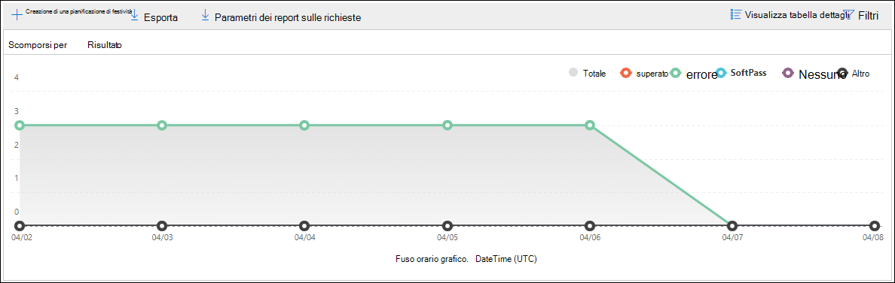
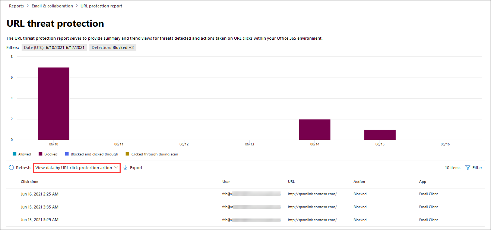

# Visualizzare i report sulla sicurezza della posta elettronica nel Centro sicurezza e conformitàView email security reports in the Security & Compliance Center

Nel [Centro sicurezza & conformità](https://protection.office.com) è disponibile un'ampia gamma di report che consentono di visualizzare in che modo le funzionalità di sicurezza della posta elettronica, ad esempio la protezione da posta indesiderata, l'antimalware e la crittografia in Microsoft 365, proteggono l'organizzazione.A variety of reports are available in the [Security & Compliance Center](https://protection.office.com) to help you see how email security features, such as anti-spam, anti-malware, and encryption features in Microsoft 365 are protecting your organization. Se si dispone delle [autorizzazioni necessarie](#what-permissions-are-needed-to-view-these-reports), è possibile visualizzare i report nel centro sicurezza & Compliance accedendo al **Reports** \> **Dashboard**report.If you have the [necessary permissions](#what-permissions-are-needed-to-view-these-reports), you can view these reports in the Security & Compliance Center by going to **Reports** \> **Dashboard**. Per accedere direttamente al dashboard dei report, aprire <https://protection.office.com/insightdashboard> .To go directly to the reports dashboard, open <https://protection.office.com/insightdashboard>.

## Report utenti compromessiCompromised users report

> [!NOTE]
> Questo report è disponibile nelle organizzazioni Microsoft 365 con le cassette postali di Exchange Online.This report is available in Microsoft 365 organizations with Exchange Online mailboxes. Non è disponibile in organizzazioni di Exchange Online Protection (EOP) indipendenti senza cassette postali di Exchange Online.It's not available in standalone Exchange Online Protection (EOP) organizations without Exchange Online mailboxes.

Nel rapporto **utenti compromessi** viene mostrato il numero di account utente contrassegnati come **sospetti** o **limitati** negli ultimi 7 giorni.The **Compromised users** report shows shows the number of user accounts that were marked as **Suspicious** or **Restricted** within the last 7 days. Gli account in uno di questi Stati sono problematici o addirittura compromessi.Accounts in either of these states are problematic or even compromised. Con uso frequente, è possibile utilizzare il report per individuare picchi e persino tendenze, in account sospetti o limitati.With frequent use, you can use the report to spot spikes, and even trends, in suspicious or restricted accounts. Per ulteriori informazioni sugli utenti compromessi, vedere [risposta a un account di posta elettronica compromesso](responding-to-a-compromised-email-account.md).For more information about compromised users, see [Responding to a compromised email account](responding-to-a-compromised-email-account.md).

La visualizzazione aggregazione Mostra i dati per gli ultimi 90 giorni e la visualizzazione dettagli Mostra i dati per gli ultimi 30 giorni.The aggregate view shows data for the last 90 days and the detail view shows data for the last 30 days.

Per visualizzare il report, aprire il [Centro sicurezza & conformità](https://protection.office.com), accedere al **Reports** \> **Dashboard** dei report e selezionare **utenti compromessi**.To view the report, open the [Security & Compliance Center](https://protection.office.com), go to **Reports** \> **Dashboard** and select **Compromised users**. Per passare direttamente al report, aprire <https://protection.office.com/reportv2?id=CompromisedUsers> .To go directly to the report, open <https://protection.office.com/reportv2?id=CompromisedUsers>.

È possibile filtrare sia il grafico che la tabella Details facendo clic su **filtri** e selezionando uno o più dei seguenti valori:You can filter both the chart and the details table by clicking **Filters** and selecting one or more of the following values:

- Data di **inizio** e **Data di fine****Start date** and **End date**

- **Sospetti**: l'account utente ha inviato messaggi di posta elettronica sospetti ed è a rischio di essere limitato dall'invio di messaggi di posta elettronica.**Suspicious**: The user account has sent suspicious email and is at risk of being restricted from sending email.

- **Limitato**: l'account utente è stato limitato dall'invio di messaggi di posta elettronica a causa di modelli estremamente sospetti.**Restricted**: The user account has been restricted from sending email due to highly suspicious patterns.

Se si fa clic su **Visualizza tabella dettagli**, è possibile visualizzare i dettagli seguenti:If you click **View details table**, you can see the following details:

- **Ora di creazione****Creation time**
- **ID utente****User ID**
- **Azione****Action**

Per tornare alla visualizzazione report, fare clic su **Visualizza report**.To go back to the report view, click **View report**.

## Rapporto di crittografiaEncryption report

Il **rapporto di crittografia** è disponibile in EOP (abbonamenti con cassette postali in Exchange Online o EOP autonomo senza cassette postali di Exchange Online).The **Encryption report** is available in EOP (subscriptions with mailboxes in Exchange Online or standalone EOP without Exchange Online mailboxes). Il team di sicurezza dell'organizzazione può utilizzare le informazioni contenute in questo report per identificare modelli e applicare o modificare in modo proattivo i criteri per i messaggi di posta elettronica sensibili.Your organization's security team can use information in this report to identify patterns and proactively apply or adjust policies for sensitive email messages. Ad esempio:For example:

- Se viene visualizzato un numero elevato di messaggi di posta elettronica crittografati dagli utenti, potrebbe essere necessario aggiungere un criterio di crittografia per automatizzare la crittografia per alcuni casi di utilizzo.If you see a high number of email messages encrypted by users, you might want to add an encryption policy to automate encryption for certain use cases. Per ulteriori informazioni, vedere [definire le regole del flusso di posta per crittografare i messaggi di posta elettronica in Microsoft 365](../../compliance/define-mail-flow-rules-to-encrypt-email.md).For more information, see [Define mail flow rules to encrypt email messages in Microsoft 365](../../compliance/define-mail-flow-rules-to-encrypt-email.md).

- Se si dispone di un numero di modelli di crittografia disponibili ma nessuno li utilizza, è possibile esaminare se gli utenti hanno bisogno di una formazione delle funzionalità.If you have a number of encryption templates available but no one is using them, you might explore whether users need feature training.

La visualizzazione aggregazione consente il filtro per gli ultimi 90 giorni, mentre la visualizzazione dettagli consente il filtraggio per 10 giorni.The aggregate view allows filtering for the last 90 days, while the detail view allows filtering for 10 days.

Per visualizzare il report, aprire il [Centro sicurezza & conformità](https://protection.office.com), accedere al **Reports** \> **Dashboard** dei report e selezionare **rapporto di crittografia**.To view the report, open the [Security & Compliance Center](https://protection.office.com), go to **Reports** \> **Dashboard** and select **Encryption report**. Per passare direttamente al report, aprire <https://protection.office.com/reportv2?id=EncryptionReport> .To go directly to the report, open <https://protection.office.com/reportv2?id=EncryptionReport>.

Per ulteriori informazioni sulla crittografia, vedere la [crittografia della posta elettronica in Microsoft 365](../../compliance/email-encryption.md).To learn more about encryption, see [Email encryption in Microsoft 365](../../compliance/email-encryption.md).

### Visualizzazione report per il rapporto di crittografiaReport view for the Encryption report

Nel grafico è possibile utilizzare i seguenti filtri:You can use the following filters on the chart:

- **Visualizzare i dati in base a: rapporto di crittografia dei messaggi** e **scomposizione in base a: metodo di**crittografia: sono disponibili i seguenti metodi di crittografia:**View data by: Message Encryption Report** and **Break down by: Encryption method**: The following encryption methods are available:

  - **Crittografia per utente****Encryption by user**
  - **Crittografia per criterio****Encryption by policy**

  Se si fa clic su **filtri**, è possibile modificare il grafico con i filtri seguenti:If you click **Filters**, you can modify the chart with the following filters:

  - Data di **inizio** e **Data di fine****Start date** and **End date**
  - Metodo di crittografia.Encryption method.
  - Modello di crittografia.Encryption template.

- **Visualizzare i dati in base a: rapporto di crittografia dei messaggi** e **scomposizione in base a: modello di crittografia**: sono disponibili i seguenti metodi di crittografia:**View data by: Message Encryption Report** and **Break down by: Encryption template**: The following encryption methods are available:

  - **Non inoltrare****Do not forward**
  - **Solo crittografia****Encrypt only**
  - **OME precedente****OME previous**
  - **Personalizzata****Custom**

  Se si fa clic su **filtri**, è possibile modificare il grafico con i filtri seguenti:If you click **Filters**, you can modify the chart with the following filters:

  - Data di **inizio** e **Data di fine****Start date** and **End date**
  - Metodo di crittografiaEncryption method
  - Modello di crittografiaEncryption template

- **Visualizzare i dati per: Top 5 Domains Recipient**: questa visualizzazione Mostra un grafico a torta con i conteggi dei messaggi inviati per i primi 5 domini dei destinatari.**View data by: Top 5 recipient domains**: This view shows a pie chart with sent message counts for the top 5 recipient domains.

  Se si fa clic su **filtri**, è possibile selezionare una data di **inizio** e una **Data di fine**.If you click **Filters**, you can select a **Start date** and **End date**.

### Visualizzazione della tabella dei dettagli per il rapporto di crittografiaDetails table view for the Encryption report

Se si fa clic su **Visualizza tabella dettagli**, le informazioni visualizzate dipendono dal grafico che si sta esaminando:If you click **View details table**, the information that's shown depends on the chart you were looking at:

- **Scomposizione per: metodo di crittografia** o **scomposizione in base a: modello di crittografia**: vengono visualizzate le informazioni seguenti:**Break down by: Encryption method** or **Break down by: Encryption template**: The following information is shown:

  - **Data****Date**
  - **Indirizzo del mittente****Sender address**
  - **Modello di crittografia****Encryption template**
  - **Metodo di crittografia****Encryption method**
  - **Indirizzo del destinatario****Recipient address**
  - **Oggetto****Subject**

- **Visualizzare i dati per: Top 5 Domains Recipient**:**View data by: Top 5 recipient domains**:

  - **Data****Date**
  - **Dominio del destinatario****Recipient domain**
  - **Numero di messaggi****Message count**
  
Se si fa clic su **filtri** in una visualizzazione tabella dettagli, è possibile modificare i risultati con i filtri seguenti:If you click **Filters** in a details table view, you can modify the results with the following filters:

- Data di **inizio** e **Data di fine****Start date** and **End date**
- Metodo di crittografiaEncryption method
- Modello di crittografiaEncryption template

Per tornare alla visualizzazione report, fare clic su **Visualizza report**.To go back to the report view, click **View report**.

## Rapporto sullo stato del flusso di postaMailflow status report

Il **rapporto di stato del flusso** di lavoro contiene informazioni su malware, posta indesiderata, phishing e messaggi bloccati Edge.The **Mailflow status report** contains information about malware, spam, phishing and edge blocked messages. Per ulteriori informazioni, vedere [rapporto sullo stato del flusso](view-mail-flow-reports.md#mailflow-status-report)di posta.For more details, see [Mailflow status report](view-mail-flow-reports.md#mailflow-status-report).

## Rilevamento di malware nel rapporto di posta elettronicaMalware detection in email report

I rilevamenti di **malware nel rapporto di posta elettronica** mostrano informazioni sui rilevamenti di malware nei messaggi di posta elettronica in arrivo e in uscita (malware rilevati da Exchange Online Protection o EOP).The **Malware detections in email** report shows information about malware detections in incoming and outgoing email messages (malware detected by Exchange Online Protection or EOP). Per ulteriori informazioni sulla protezione antimalware in EOP, vedere [anti-malware Protection in EOP](anti-malware-protection.md).For more information about malware protection in EOP, see [Anti-malware protection in EOP](anti-malware-protection.md).

 Il filtro visualizzazione aggregazione consente 90 giorni, mentre il filtro tabella Dettagli consente solo 10 giorni.The aggregate view filter allows for 90 days, while the details table filter only allows for 10 days.

Per visualizzare il report, aprire il [Centro sicurezza & conformità](https://protection.office.com), accedere al **Reports** \> **Dashboard** dei report e selezionare **rilevamenti di malware nel messaggio di posta elettronica**.To view the report, open the [Security & Compliance Center](https://protection.office.com), go to **Reports** \> **Dashboard** and select **Malware detections in email**. Per passare direttamente al report, aprire <https://protection.office.com/reportv2?id=MalwareDetections> .To go directly to the report, open <https://protection.office.com/reportv2?id=MalwareDetections>.

È possibile filtrare sia il grafico che la tabella Details facendo clic su **filtri** e selezionando:You can filter both the chart and the details table by clicking **Filters** and selecting:

- Data di **inizio** e **Data di fine****Start date** and **End date**
- **Inbound****Inbound**
- **In uscita****Outbound**

Se si fa clic su **Visualizza tabella dettagli**, è possibile visualizzare i dettagli seguenti:If you click **View details table**, you can see the following details:

- **Data****Date**
- **Indirizzo del mittente****Sender address**
- **Indirizzo del destinatario****Recipient address**
- **ID messaggio****Message ID**
- **Oggetto****Subject**
- **Filename****Filename**
- **Nome malware****Malware name**

Per tornare alla visualizzazione report, fare clic su **Visualizza report**.To go back to the report view, click **View report**.

## Report di posta elettronica inviati e ricevutiSent and received email report

Il rapporto **messaggi di posta elettronica inviati e ricevuti** contiene informazioni su malware, posta indesiderata, regole del flusso di posta (note anche come regole di trasporto) e rilevamenti di malware avanzati dopo che la posta elettronica entra nel servizio.The **Sent and received email** report contains information about malware, spam, mail flow rules (also known as transport rules), and advanced malware detections after email enters the service. Per ulteriori informazioni, vedere [report di posta elettronica inviata e ricevuta](view-mail-flow-reports.md#sent-and-received-email-report).For more information, see [Sent and received email report](view-mail-flow-reports.md#sent-and-received-email-report).

## Report sui rilevamenti della posta indesiderataSpam detections report

Il rapporto sui **rilevamenti di posta indesiderata** Visualizza messaggi di posta indesiderata bloccati da EOP.The **Spam detections** report shows spam email messages that were blocked by EOP. I messaggi vengono conteggiati singolarmente e non per destinatario.Messages are counted individually, not per recipient. Ad esempio, se lo stesso messaggio di posta indesiderata è stato inviato a 100 destinatari nell'organizzazione, viene conteggiato come un solo messaggio.For example, if the same spam message was sent to 100 recipients in your organization, it counts as one message.

La visualizzazione aggregazione consente il filtraggio di 90 giorni, mentre la tabella Details consente il filtraggio di 10 giorni.The aggregate view allows for 90 days filtering, while the details table allows for 10 days filtering.

Per visualizzare il report, aprire il [Centro sicurezza & conformità](https://protection.office.com), accedere al **Reports** \> **Dashboard** dei report e selezionare **rilevamenti di posta indesiderata**.To view the report, open the [Security & Compliance Center](https://protection.office.com), go to **Reports** \> **Dashboard** and select **Spam detections**. Per passare direttamente al report, aprire <https://protection.office.com/reportv2?id=SpamDetections> .To go directly to the report, open <https://protection.office.com/reportv2?id=SpamDetections>.

Per ulteriori informazioni sulla protezione da posta indesiderata, vedere [protezione da posta](anti-spam-protection.md)indesiderata in EOP.For more information about anti-spam protection, see [Anti-spam protection in EOP](anti-spam-protection.md).

### Visualizzazione report per il rapporto rilevamento posta indesiderataReport view for the Spam detections report

Nella visualizzazione report sono disponibili i grafici seguenti:The following charts are available in the report view:

- **Scomposizione per: azione**: vengono visualizzati i tipi di evento seguenti:**Break down by: Action**: The following event types are shown:

  - **Contenuto di posta indesiderata filtrato****Spam content filtered**
  - **Blocco IP di posta indesiderata****Spam IP block**
  - **Blocco busta posta indesiderata****Spam envelope block**
  - **Filtro per la posta indesiderata DBEB**: blocco Edge basato su directory (DBEB)**Spam DBEB filter**: Directory based edge blocking (DBEB)

  Quando si posiziona il puntatore del mouse su un giorno (punto dati) nel grafico, è possibile vedere quanti elementi sono stati bloccati in quel giorno, nonché come tali elementi sono categorizzati.When you hover over a day (data point) in the chart, you can see how many items were blocked that day, as well as how those items are categorized.

  

- **Scomposizione per: direzione**: vengono visualizzate le indicazioni seguenti:**Break down by:Direction**: The following directions are shown:

  - **Inbound****Inbound**
  - **In uscita****Outbound**

  

Se si fa clic su **filtri** in una visualizzazione report, è possibile modificare i risultati con i filtri seguenti:If you click **Filters** in a report view, you can modify the results with the following filters:

- Data di **inizio** e **Data di fine****Start date** and **End date**
- Valori di direzioneDirection values
- Valori del tipo di eventoEvent type values

### Visualizzazione tabella dettagli per il rapporto rilevamento posta indesiderataDetails table view for the Spam detections report

Se si fa clic su **Visualizza tabella dettagli** in qualsiasi visualizzazione report, vengono visualizzate le informazioni seguenti:If you click **View details table** in any report view, the following information is shown:

- **Data****Date**
- **Indirizzo del mittente****Sender address**
- **Indirizzo del destinatario****Recipient address**
- **Tipo evento****Event type**
- **Azione****Action**
- **Oggetto****Subject**

Se si fa clic su **filtri** in una tabella Details, è possibile modificare i risultati con i filtri seguenti:If you click **Filters** in a details table, you can modify the results with the following filters:

- Data di **inizio** e **Data di fine****Start date** and **End date**
- Valori di direzioneDirection values
- Valori del tipo di eventoEvent type values

Per tornare alla visualizzazione report, fare clic su **Visualizza report**.To go back to the report view, click **View report**.

## Rapporto rilevamenti spoofSpoof detections report

Il rapporto sui rilevamenti **spoof** indica il numero di messaggi di posta elettronica contraffatti individuati e di quelli che sono stati considerati "buoni" (la posta contraffatta è stata realizzata per motivi aziendali legittimi).The **Spoof detections** report shows how many spoof mail messages were detected, and of those, which ones were considered "good" (spoof mail done for legitimate business reasons). Per ulteriori informazioni sullo spoofing, vedere [protezione anti-spoofing in EOP](anti-spoofing-protection.md).For more information about spoofing, see [Anti-spoofing protection in EOP](anti-spoofing-protection.md).

La visualizzazione aggregazione del report consente 90 giorni di filtraggio, mentre la visualizzazione dettagli consente solo dieci giorni di filtraggio.The aggregate view of the report allows for 90 days of filtering, while the detail view only allows for ten days of filtering.

Per visualizzare il report, aprire il [Centro sicurezza & conformità](https://protection.office.com), accedere al **Reports** \> **Dashboard** dei report e selezionare **rilevamenti spoof**.To view the report, open the [Security & Compliance Center](https://protection.office.com), go to **Reports** \> **Dashboard** and select **Spoof detections**. Per passare direttamente al report, aprire <https://protection.office.com/reportv2?id=SpoofMailReport> .To go directly to the report, open <https://protection.office.com/reportv2?id=SpoofMailReport>.

Quando si posiziona il puntatore del mouse su un giorno (punto dati) nel grafico, è possibile visualizzare il numero di messaggi di posta elettronica contraffatti.When you hover over a day (data point) in the chart, you can see how many spoof mail messages came through.

È possibile filtrare sia il grafico che la tabella Details facendo clic su **filtri** e selezionando uno o più dei seguenti valori:You can filter both the chart and the details table by clicking **Filters** and selecting one or more of the following values:

- Data di **inizio** e **Data di fine****Start date** and **End date**

- **Posta elettronica buona****Good mail**

- **Catturato come posta indesiderata****Caught as spam**

Se si fa clic su **Visualizza tabella dettagli**, è possibile visualizzare i dettagli seguenti:If you click **View details table**, you can see the following details:

- **Data****Date**
- **Mittente falsificato****Spoofed sender**
- **Mittente vero****True sender**
- **Indirizzo IP mittente****Sender IP**
- **Azione****Action**
- **Numero di messaggi****Message count**

Per tornare alla visualizzazione report, fare clic su **Visualizza report**.To go back to the report view, click **View report**.

## Rapporto sullo stato della protezione dalle minacceThreat protection status report

Il rapporto **sullo stato della protezione dalle minacce** è disponibile sia in EOP che in Office 365 ATP. Tuttavia, i report contengono dati diversi.The **Threat protection status** report is available in both EOP and Office 365 ATP; however, the reports contain different data. Ad esempio, i clienti di EOP possono visualizzare informazioni sui malware rilevati tramite posta elettronica, ma non informazioni sui [file dannosi rilevati in SharePoint Online, OneDrive o Microsoft teams](atp-for-spo-odb-and-teams.md).For example, EOP customers can view information about malware detected in email, but not information about [malicious files detected in SharePoint Online, OneDrive, or Microsoft Teams](atp-for-spo-odb-and-teams.md). Per ulteriori informazioni sui report ATP di Office 365, vedere [View Reports for office 365 Advanced Threat Protection](view-reports-for-atp.md).For more information about Office 365 ATP reports, see [View reports for Office 365 Advanced Threat Protection](view-reports-for-atp.md).

Si tratta di un report Smart che indica che la posta elettronica dannosa è stata rilevata e bloccata e che consente agli amministratori di sicurezza di identificare le tendenze o determinare se i criteri dell'organizzazione devono essere rettificati.This is a smart report that shows malicious email that was detected and blocked, and it enables security admins to identify trends or determine whether organization policies need adjustment.

Per visualizzare il report, aprire il [Centro sicurezza & conformità](https://protection.office.com), accedere al **Reports** \> **Dashboard** dei report e selezionare **lo stato di protezione dalle minacce**.To view the report, open the [Security & Compliance Center](https://protection.office.com), go to **Reports** \> **Dashboard** and select **Threat protection status**. Per passare direttamente al report, aprire <https://protection.office.com/reportv2?id=ATPV2AggregateReport> .To go directly to the report, open <https://protection.office.com/reportv2?id=ATPV2AggregateReport>.

Per impostazione predefinita, il grafico Visualizza i dati negli ultimi 7 giorni.By default, the chart shows data for the past 7 days. Se si fa clic su **filtri**, è possibile selezionare un intervallo di date di 90 giorni (gli abbonamenti di valutazione potrebbero essere limitati a 30 giorni).If you click **Filters**, you can select a 90 day date range (trial subscriptions might be limited to 30 days). La visualizzazione tabella Dettagli consente di filtrare per 30 giorni.The details table view allows filtering for 30 days.

### Visualizzazione report per il rapporto sullo stato di protezione dalle minacceReport view for the Threat protection status report

Sono disponibili le visualizzazioni seguenti:The following views are available:

- **Visualizzare i dati in base a: Panoramica**: vengono visualizzate le informazioni di rilevamento seguenti:**View data by: Overview**: The following detection information is shown:

  - **Malware per la posta elettronica****Email malware**
  - **Phishing di posta elettronica****Email phish**
  - **Malware contenuto****Content malware**

  

- **Visualizzare i dati in base a: content \> Malware**1: vengono visualizzate le informazioni seguenti per le organizzazioni ATP di Office 365:**View data by: Content \> Malware**1: The following information is shown for Office 365 ATP organizations:

  - **Motore antimalware****Anti-malware engine**
  - **Detonazione file****File detonation**

  

- **Scomposizione per: tecnologia di rilevamento** e **visualizzazione dei dati in base a: e-mail \> phishing**: vengono visualizzate le informazioni seguenti:**Break down by: Detection technology** and **View data by: Email \> Phish**: The following information is shown:

  - **Reputazione URL generata dal trifosfato di adenosina**1**ATP-generated URL reputation**1
  - **Filtro phishing avanzato****Advanced phish filter**
  - **Anti-spoofing: errore di DMARC****Anti-spoof: DMARC failure**
  - **Anti-spoofing: intra-org****Anti-spoof: Intra-org**
  - **Anti-spoofing: dominio esterno****Anti-spoof: external domain**
  - **Rappresentazione del marchio****Brand impersonation**
  - **Rappresentazione del dominio**1**Domain impersonation**1
  - **Reputazione URL di EOP****EOP URL reputation**
  - **Filtro phishing generale****General phish filter**
  - **Altri****Others**
  - **Phishing zap**2**Phish ZAP**2
  - **Detonazione URL**1**URL detonation**1
  - **Rappresentazione utente**1**User impersonation**1

  

- **Scomposizione per: tecnologia di rilevamento** e **visualizzazione dei dati in base a: posta elettronica \> malware**: vengono visualizzate le informazioni seguenti:**Break down by: Detection technology** and **View data by: Email \> Malware**: The following information is shown:

  - **Reputazione del file generato dal trifosfato di adenosina**1**ATP-generated file reputation**1
  - **Motore anti-malware**1**Anti-malware engine**1
  - **Blocco dei tipi di file dei criteri anti-malware****Anti-malware policy file type block**
  - **Detonazione del file**1**File detonation**1
  - **Reputazione di file dannosi****Malicious file reputation**
  - **Malware zap**2**Malware ZAP**2
  - **Altri****Others**

  

- **Scomposizione per: tipo di criterio** e **visualizzazione dei dati in base a: posta elettronica \> phishing** o **visualizzazione dati per: posta elettronica \> malware**: vengono visualizzate le informazioni seguenti:**Break down by: Policy type** and **View data by: Email \> Phish** or **View data by: Email \> Malware**: The following information is shown:

  - **Anti-malware****Anti-malware**
  - **Allegato sicuro**1**Safe Attachment**1
  - **Anti-phishing****Anti-phish**
  - **Protezione da posta indesiderata****Anti-spam**
  - **Regola del flusso di posta** (nota anche come regola di trasporto)**Mail flow rule** (also known as a transport rule)
  - **Altri****Others**

  

- **Scomposizione per: stato di recapito** e **visualizzazione dei dati in base a: posta elettronica \> phishing** oppure **visualizzare i dati per: posta elettronica \> malware**: vengono visualizzate le informazioni seguenti:**Break down by: Delivery status** and **View data by: Email \> Phish** or **View data by: Email \> Malware**: The following information is shown:

  - **Recapito non riuscito****Delivery failed**
  - **Interrotte****Dropped**
  - **Inoltrato****Forwarded**
  - **Cassetta postale ospitata: cartella personalizzata****Hosted mailbox: Custom folder**
  - **Cassetta postale ospitata: elementi eliminati****Hosted mailbox: Deleted items**
  - **Cassetta postale ospitata: posta in arrivo****Hosted mailbox: Inbox**
  - **Cassetta postale ospitata: posta indesiderata****Hosted mailbox: Junk**
  - **Server locale: recapitato****On-premises server: Delivered**
  - **Quarantena****Quarantine**

  

1 Office 365 solo ATP1 Office 365 ATP only

2 zero-hour auto Purge (ZAP) non è disponibile in EOP autonomo (funziona solo nelle cassette postali di Exchange Online).2 Zero-hour auto purge (ZAP) isn't available in standalone EOP (it only works in Exchange Online mailboxes).

Se si fa clic su **filtri**, è possibile modificare il report con i filtri seguenti:If you click **Filters**, you can modify the report with the following filters:

- Data di **inizio** e **Data di fine****Start date** and **End date**
- Valore di rilevamentoDetection value
- **Protetto da** (solo Office 365 ATP): **ATP** o **EOP**.**Protected by** (Office 365 ATP only): **ATP** or **EOP**. Si noti che questa proprietà filtrabile non è disponibile in **Visualizza dati per: contenuto di \> malware**.Note that this filterable property isn't available in **View data by: Content \> Malware**.

### Visualizzazione della tabella dei dettagli per il rapporto sullo stato della protezione dalle minacceDetails table view for the Threat protection status report

Se si fa clic su **Visualizza tabella dettagli**, le informazioni visualizzate dipendono dal grafico che si sta esaminando:If you click **View details table**, the information that's shown depends on the chart you were looking at:

- **Visualizzare i dati in base a: content \> Malware**:**View data by: Content \> Malware**:

  - **Data****Date**
  - **Posizione****Location**
  - **Diretto da****Directed by**
  - **Nome malware****Malware name**

- **Visualizzazione dei dati per: Panoramica**: non è disponibile alcun pulsante **Visualizza dettagli tabella** .**View data by: Overview**: No **View details table** button is available.

- Tutti gli altri grafici:All other charts:

  - **Data****Date**
  - **Oggetto****Subject**
  - **Mittente****Sender**
  - **Destinatari****Recipients**
  - **Rilevato da****Detected by**
  - **Stato del recapito****Delivery status**
  - **Origine del compromesso****Source of compromise**

Se si fa clic su **filtri**, è possibile modificare il report con i filtri seguenti:If you click **Filters**, you can modify the report with the following filters:

- Data di **inizio** e **Data di fine****Start date** and **End date**
- Valore di rilevamentoDetection value
- **Protetto da** (solo Office 365 ATP): **ATP** o **EOP**.**Protected by** (Office 365 ATP only): **ATP** or **EOP**. Si noti che questa proprietà filtrabile non è disponibile in **Visualizza dati per: contenuto di \> malware**.Note that this filterable property isn't available in **View data by: Content \> Malware**.

## Rapporto malware principaleTop malware report

Il rapporto **malware principale** illustra i diversi tipi di malware rilevati dalla [protezione antimalware in EOP](anti-malware-protection.md).The **Top malware** report shows the various kinds of malware that was detected by [anti-malware protection in EOP](anti-malware-protection.md).

Per visualizzare il report, aprire il [Centro sicurezza & conformità](https://protection.office.com), accedere al **Reports** \> **Dashboard** dei report e selezionare **malware principale**.To view the report, open the [Security & Compliance Center](https://protection.office.com), go to **Reports** \> **Dashboard** and select **Top malware**. Per passare direttamente al report, aprire <https://protection.office.com/reportv2?id=TopMalware> .To go directly to the report, open <https://protection.office.com/reportv2?id=TopMalware>.

Quando si posiziona il puntatore del mouse su un cuneo nel grafico a torta, è possibile visualizzare il nome di un tipo di malware e il numero di messaggi che sono stati rilevati come aventi quel malware.When you hover over a wedge in the pie chart, you can see the name of a kind of malware and how many messages were detected as having that malware.

Se si fa clic su **Visualizza tabella dettagli**, è possibile visualizzare i dettagli seguenti:If you click **View details table**, you can see the following details:

- **Malware principale****Top malware**
- **Numero****Count**

Se si fa clic su **filtri** nella visualizzazione visualizzazione report o tabella dettagli, è possibile specificare un intervallo di date con data di **inizio** e **Data di fine**.If you click **Filters** in the report view or details table view, you can specify a date range with **Start date** and **End date**.

## Report sulla protezione dalle minacce URLURL threat protection report

> [!NOTE]
> Questo report è disponibile solo in Office 365 Advanced Threat Protection (ATP).This report is available only in Office 365 Advanced Threat Protection (ATP). Ad esempio, un abbonamento a Microsoft 365 E5 o un componente aggiuntivo ATP Plan 1 o ATP Plan 2.For example, a Microsoft 365 E5 subscription, or an ATP Plan 1 or ATP Plan 2 add-on.

Il **rapporto di protezione** da minacce URL fornisce le visualizzazioni di riepilogo e di tendenza per i rischi rilevati e le azioni eseguite nei clic URL come parte dei [collegamenti sicuri di ATP](atp-safe-links.md).The **URL threat protection report** provides summary and trend views for threats detected and actions taken on URL clicks as part of [ATP Safe Links](atp-safe-links.md). Questo report non displicherà i dati da parte degli utenti a cui è stato applicato il criterio collegamenti sicuri ha l'opzione non **registrare i clic utente** selezionati.This report will not have click data from users where the Safe Links policy applied has the **Do not track user clicks** option selected.

Per visualizzare il report, aprire il [Centro sicurezza & conformità](https://protection.office.com), accedere al **Reports** \> **Dashboard** dei report e selezionare **protezione URL**.To view the report, open the [Security & Compliance Center](https://protection.office.com), go to **Reports** \> **Dashboard** and select **URL protection**. Per passare direttamente al report, aprire <https://protection.office.com/reportv2?id=URLProtectionActionReport> .To go directly to the report, open <https://protection.office.com/reportv2?id=URLProtectionActionReport>.

### Visualizzazione report per il report di protezione dalle minacce URLReport view for the URL threat protection report

Il report di **protezione dalle minacce URL** contiene due visualizzazioni aggregate aggiornate ogni quattro ore che mostrano i dati per gli ultimi 90 giorni:The **URL threat protection** report has two aggregated views that are refreshed once every four hours that shows data for the last 90 days:

- **Azione di protezione clic su URL**: Visualizza il numero di clic URL degli utenti nell'organizzazione e i risultati del clic:**URL click protection action**: Shows the number of URL clicks by users in the organization and the results of the click:

  - **Bloccati****Blocked**
  - **Bloccato e selezionato tramite****Blocked and clicked through**
  - **Fare clic su di esso durante l'analisi****Clicked through during scan**

  Un clic indica che l'utente ha fatto clic sulla pagina blocca nel sito Web dannoso (gli amministratori possono disabilitare il clic nei criteri collegamenti sicuri).A click indicates that the user has clicked through the block page to the malicious website (admins can disable click through in Safe Links policies).

  Se si fa clic su **filtri**, è possibile modificare il report con i filtri seguenti:If you click **Filters**, you can modify the report with the following filters:

  - Data di **inizio** e **Data di fine****Start date** and **End date**
  - Le azioni di protezione clic disponibili, oltre al valore **consentito** per visualizzare le informazioni relative a tutti gli URL clic (non solo blocchi bloccati).The available click protection actions, plus the value **Allowed** to see information for all URL clicks (not just blocked clicks).

  

- **URL fare clic su applicazione**: consente di visualizzare il numero di clic URL per le applicazioni che supportano i collegamenti sicuri di Office 365 ATP:**URL click by application**: Shows the number of URL clicks by applications that support Office 365 ATP Safe Links:

  - **Client di posta elettronica****Email client**
  - **PowerPoint****PowerPoint**
  - **Word****Word**
  - **Excel****Excel**
  - **OneNote****OneNote**
  - **Visio****Visio**
  - **Teams****Teams**
  - **Altro****Other**

  Se si fa clic su **filtri**, è possibile modificare il report con i filtri seguenti:If you click **Filters**, you can modify the report with the following filters:

  - Data di **inizio** e **Data di fine****Start date** and **End date**
  - Le applicazioni disponibili.The available applications.

### Visualizzazione della tabella dei dettagli per il report sulla protezione dalle minacceDetails table view for the threat protection report

Se si fa clic su **Visualizza tabella dettagli**, il rapporto fornisce una visualizzazione quasi in tempo reale di tutti i clic che si verificano all'interno dell'organizzazione negli ultimi 7 giorni con i seguenti dettagli:If you click **View details table**, the report provides a near-real-time view of all clicks that happen within the organization for the last 7 days with the following details:

- **Fare clic su tempo****Click time**
- **Utente****User**
- **URL****URL**
- **Azione****Action**
- **App****App**

Se si fa clic su **filtri** nella visualizzazione tabella dettagli, è possibile filtrare in base agli stessi criteri della visualizzazione report, nonché ai **domini** o ai **destinatari** separati da virgole.If you click **Filters** in the details table view, you can filter by the same criteria as in the report view, and also by **Domains** or **Recipients** separated by commas.

Per tornare alla visualizzazione report, fare clic su **Visualizza report**.To get back to the reports view, click **View report**.

## Report dei messaggi segnalati dall'utenteUser-reported messages report

Il rapporto **messaggi segnalati dall'utente** Visualizza informazioni sui messaggi di posta elettronica segnalati dagli utenti come posta indesiderata, tentativi di phishing o una buona corrispondenza tramite il [componente aggiuntivo segnala messaggio](https://docs.microsoft.com/microsoft-365/security/office-365-security/enable-the-report-message-add-in).The **User-reported messages** report shows information about email messages that users have reported as junk, phishing attempts, or good mail by using the [Report Message add-in](https://docs.microsoft.com/microsoft-365/security/office-365-security/enable-the-report-message-add-in).

I dettagli sono disponibili per ogni messaggio, incluso il motivo del recapito, una regola di protezione da posta indesiderata o un flusso di posta configurata per l'organizzazione.Details are available for each message, including the delivery reason, such a spam policy exception or mail flow rule configured for your organization. Per visualizzare i dettagli, selezionare un elemento nell'elenco User-Reports e quindi visualizzare le informazioni nelle schede **Riepilogo** e **Dettagli** .To view details, select an item in the user-reports list, and then view the information on the **Summary** and **Details** tabs.

Per visualizzare il report, nel [Centro sicurezza & Compliance](https://protection.office.com)eseguire una delle operazioni seguenti:To view this report, in the [Security & Compliance Center](https://protection.office.com), do one of the following:

- Accedere a **Threat management** \> **Dashboard** \> **messaggi segnalati dall'utente**del dashboard di gestione delle minacce.Go to **Threat management** \> **Dashboard** \> **User-reported messages**.

- Passare a **gestione minacce** \> **esaminare** \> **i messaggi segnalati dall'utente**.Go to **Threat management** \> **Review** \> **User-reported messages**.

> [!IMPORTANT]
> Affinché il rapporto messaggi segnalati dall'utente funzioni correttamente, **è necessario che la registrazione di controllo sia attivata** per l'ambiente Office 365.In order for the User-reported messages report to work correctly, **audit logging must be turned on** for your Office 365 environment. Questa operazione viene in genere fatta da una persona a cui è stato assegnato il ruolo registri di controllo in Exchange Online.This is typically done by someone who has the Audit Logs role assigned in Exchange Online. Per ulteriori informazioni, vedere [attivazione o disattivazione della ricerca del registro di controllo di Microsoft 365](https://docs.microsoft.com/microsoft-365/compliance/turn-audit-log-search-on-or-off).For more information, see [Turn Microsoft 365 audit log search on or off](https://docs.microsoft.com/microsoft-365/compliance/turn-audit-log-search-on-or-off).

## Quali autorizzazioni sono necessarie per visualizzare i rapporti?What permissions are needed to view these reports?

Per visualizzare e utilizzare i report, è necessario essere membri del gruppo di ruoli specificato nel centro sicurezza & conformità **e** in Exchange Online.To view and use the reports, you need to be a member of the specified role group in the Security & Compliance Center **and** in Exchange Online.

- Nel centro sicurezza & conformità è necessario essere membri di uno dei gruppi di ruoli seguenti:In the Security & Compliance Center, you need to be a member of one of the following role groups:

  -Organization Management-Security Administrator (è possibile farlo anche nell'interfaccia di [amministrazione di Azure Active Directory](https://aad.portal.azure.com) -Security Reader-Organization Management -Security Administrator (you can also do this in the [Azure Active Directory admin center](https://aad.portal.azure.com) -Security Reader

  Per altre informazioni, vedere [Autorizzazioni nel Centro sicurezza e conformità](https://docs.microsoft.com/microsoft-365/security/office-365-security/permissions-in-the-security-and-compliance-center).For more information, see [Permissions in the Security & Compliance Center](https://docs.microsoft.com/microsoft-365/security/office-365-security/permissions-in-the-security-and-compliance-center).

- In Exchange Online, è necessario essere membri di uno dei gruppi di ruoli seguenti:In Exchange Online, you need to be a member of one of the following role groups:

  -Gestione organizzazione-solo visualizzazione organizzazione-destinatari di sola visualizzazione-gestione della conformità-Organization Management -View-only Organization Management -View-Only Recipients -Compliance Management

Per ulteriori informazioni, vedere [autorizzazioni in Exchange Online](https://docs.microsoft.com/Exchange/permissions-exo/permissions-exo) e [gestire i gruppi di ruoli in Exchange Online](https://docs.microsoft.com/Exchange/permissions-exo/role-groups).For more information, see [Permissions in Exchange Online](https://docs.microsoft.com/Exchange/permissions-exo/permissions-exo) and [Manage role groups in Exchange Online](https://docs.microsoft.com/Exchange/permissions-exo/role-groups).

## Cosa succede se i rapporti non mostrano dati?What if the reports aren't showing data?

Se i dati non vengono visualizzati nei rapporti, verificare che i criteri siano configurati correttamente.If you are not seeing data in your reports, double-check that your policies are set up correctly. Per ulteriori informazioni, vedere [protezione dalle minacce](protect-against-threats.md).To learn more, see [Protect against threats](protect-against-threats.md).

## Argomenti correlatiRelated topics

[Protezione da posta indesiderata e anti-malware in EOPAnti-spam and anti-malware protection in EOP](anti-spam-and-anti-malware-protection.md)

[Report intelligenti e informazioni dettagliate nel Centro sicurezza e conformitàSmart reports and insights in the Security & Compliance Center](reports-and-insights-in-security-and-compliance.md)
