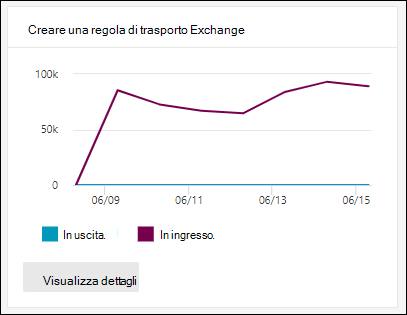

# Visualizzare i report di sicurezza della posta elettronica nel portale Microsoft 365 Defender posta elettronicaView email security reports in the Microsoft 365 Defender portal

[!INCLUDE [Microsoft 365 Defender rebranding](../includes/microsoft-defender-for-office.md)]

**Si applica a****Applies to**
- [Exchange Online ProtectionExchange Online Protection](exchange-online-protection-overview.md)
- [Microsoft Defender per Office 365 piano 1 e piano 2Microsoft Defender for Office 365 plan 1 and plan 2](defender-for-office-365.md)
- [Microsoft 365 DefenderMicrosoft 365 Defender](../defender/microsoft-365-defender.md)

Nel portale di Microsoft 365 Defender è disponibile un'ampia gamma di report che consentono di verificare in che modo le funzionalità di sicurezza della posta elettronica, ad esempio la protezione da posta indesiderata, antimalware e crittografia in Microsoft 365, proteggono <https://security.microsoft.com> l'organizzazione.A variety of reports are available in the Microsoft 365 Defender portal at <https://security.microsoft.com> to help you see how email security features, such as anti-spam, anti-malware, and encryption features in Microsoft 365 are protecting your organization. Se si dispone [delle](#what-permissions-are-needed-to-view-these-reports)autorizzazioni necessarie, è possibile visualizzare questi  report nel portale di Microsoft 365 Defender andando a Rapporti e-mail & \> **collaborazione** \> **E-mail**& rapporti di collaborazione .If you have the [necessary permissions](#what-permissions-are-needed-to-view-these-reports), you can view these reports in the Microsoft 365 Defender portal by going to **Reports** \> **Email & collaboration** \> **Email & collaboration reports**. Per passare direttamente alla pagina Rapporti di **collaborazione &** e-mail, aprire <https://security.microsoft.com/emailandcollabreport> .To go directly to the **Email & collaboration reports** page, open <https://security.microsoft.com/emailandcollabreport>.

> [!NOTE]
>
> Alcuni dei report nella pagina Rapporti di **collaborazione &** e-mail richiedono Microsoft Defender per Office 365.Some of the reports on the **Email & collaboration reports** page require Microsoft Defender for Office 365. Per informazioni su questi report, vedere [View Defender for Office 365 reports in the Microsoft 365 Defender portal.](view-reports-for-mdo.md)For information about these reports, see [View Defender for Office 365 reports in the Microsoft 365 Defender portal](view-reports-for-mdo.md).
>
> I report correlati al flusso di posta sono ora disponibili nell'interfaccia di amministrazione di Exchange (EAC).Reports that are related to mail flow are now in the Exchange admin center (EAC). Per ulteriori informazioni su questi report, vedere [Mail flow reports in the new Exchange admin center](/exchange/monitoring/mail-flow-reports/mail-flow-reports).For more information about these reports, see [Mail flow reports in the new Exchange admin center](/exchange/monitoring/mail-flow-reports/mail-flow-reports).

## Report utenti compromessiCompromised users report

> [!NOTE]
> Questo report è disponibile nelle organizzazioni Microsoft 365 con Exchange Online cassette postali.This report is available in Microsoft 365 organizations with Exchange Online mailboxes. Non è disponibile nelle organizzazioni autonome Exchange Online Protection (EOP).It's not available in standalone Exchange Online Protection (EOP) organizations.

Il **report Utenti compromessi** mostra il numero di  account  utente contrassegnati come sospetti o con restrizioni negli ultimi 7 giorni.The **Compromised users** report shows shows the number of user accounts that were marked as **Suspicious** or **Restricted** within the last 7 days. Gli account in uno di questi stati sono problematici o addirittura compromessi.Accounts in either of these states are problematic or even compromised. Con un uso frequente, è possibile utilizzare il report per individuare picchi e persino tendenze in account sospetti o con restrizioni.With frequent use, you can use the report to spot spikes, and even trends, in suspicious or restricted accounts. Per ulteriori informazioni sugli utenti compromessi, vedere [Risposta a un account di posta elettronica compromesso.](responding-to-a-compromised-email-account.md)For more information about compromised users, see [Responding to a compromised email account](responding-to-a-compromised-email-account.md).

La visualizzazione aggregata mostra i dati degli ultimi 90 giorni e la visualizzazione dettagli mostra i dati degli ultimi 30 giorni.The aggregate view shows data for the last 90 days and the detail view shows data for the last 30 days.

Per visualizzare il report nel portale Microsoft 365 Defender, passare **a** Report e-mail & \> **collaborazione** \> **E-mail & rapporti di collaborazione**.To view the report in the Microsoft 365 Defender portal, go to **Reports** \> **Email & collaboration** \> **Email & collaboration reports**. Nella pagina **Rapporti di &** e-mail individuare Utenti **compromessi** e quindi fare clic **su Visualizza dettagli.**On the **Email & collaboration reports** page, find **Compromised users** and then click **View details**. Per passare direttamente al report, aprire <https://security.microsoft.com/reports/CompromisedUsers> .To go directly to the report, open <https://security.microsoft.com/reports/CompromisedUsers>.

Nella pagina **Utenti compromessi** è possibile filtrare sia il grafico che la tabella dei dettagli facendo clic su **Filtro** e selezionando uno o più dei valori seguenti nel riquadro a comparsa visualizzato:On the **Compromised users** page, you can filter both the chart and the details table by clicking **Filter** and selecting one or more of the following values in the flyout that appears:

- **Date (UTC)**: **Data di inizio** e Data di **fine**.**Date (UTC)**: **Start date** and **End date**.
- **Attività**:**Activity**:
  - **Sospetto:** l'account utente ha inviato messaggi di posta elettronica sospetti ed è a rischio di essere limitato a inviare messaggi di posta elettronica.**Suspicious**: The user account has sent suspicious email and is at risk of being restricted from sending email.
  - **Con restrizioni**: all'account utente è stato limitato l'invio di posta elettronica a causa di modelli altamente sospetti.**Restricted**: The user account has been restricted from sending email due to highly suspicious patterns.

Al termine della configurazione dei filtri, fare clic **su Applica,** **Annulla** o **Cancella filtri.**When you're finished configuring the filters, click **Apply**, **Cancel**, or **Clear filters**.

Nella tabella dei dettagli sotto il grafico è possibile visualizzare i dettagli seguenti:In the details table below the graph, you can see the following details:

- **Ora creazione****Creation time**
- **ID utente****User ID**
- **Azione****Action**

## Exchange delle regole di trasportoExchange transport rule report

Il **Exchange delle regole di trasporto** mostra l'effetto delle regole del flusso di posta (note anche come regole di trasporto) sui messaggi in arrivo e in uscita nell'organizzazione.The **Exchange transport rule** report shows the effect of mail flow rules (also known as transport rules) on incoming and outgoing messages in your organization.

Per visualizzare il report nel portale Microsoft 365 Defender, passare **a** Report e-mail & \> **collaborazione** \> **E-mail & rapporti di collaborazione**.To view the report in the Microsoft 365 Defender portal, go to **Reports** \> **Email & collaboration** \> **Email & collaboration reports**. Nella pagina **Rapporti di &** e-mail individuare Exchange di **trasporto** e quindi fare clic su **Visualizza dettagli.**On the **Email & collaboration reports** page, find **Exchange transport rule** and then click **View details**. Per passare direttamente al report, aprire <https://security.microsoft.com/reports/ETRRuleReport> .To go directly to the report, open <https://security.microsoft.com/reports/ETRRuleReport>.

Nella pagina **Exchange report delle regole di** trasporto, i grafici e i dati disponibili sono descritti nelle sezioni seguenti.On the **Exchange transport rule report** page, the available charts and data are described in the following sections.

### Suddivisione del grafico per direzioneChart breakdown by Direction

Se si seleziona **Suddivisione grafico per direzione**, sono disponibili i grafici seguenti:If you select **Chart breakdown by Direction**, the follow charts are available:

- **Visualizzare i dati Exchange regole di trasporto**:  Numero di messaggi **in** ingresso e in uscita interessati dalle regole del flusso di posta.**View data by Exchange transport rules**: The number of **Inbound** and **Outbound** messages that were affected by mail flow rules.
- **View data by DLP Exchange transport rules**: The number of **Inbound** and **Outbound** messages that were affected by data loss prevention (DLP) mail flow rules.**View data by DLP Exchange transport rules**: The number of **Inbound** and **Outbound** messages that were affected by data loss prevention (DLP) mail flow rules.

Nella tabella dei dettagli sotto il grafico vengono visualizzate le informazioni seguenti:The following information is shown in the details table below the graph:

- **Data****Date**
- **Criterio DLP** (**Visualizza i dati solo per Exchange DLP)****DLP policy** (**View data by DLP Exchange transport rules** only)
- **Regola di trasporto****Transport rule**
- **Oggetto****Subject**
- **Indirizzo del mittente****Sender address**
- **Indirizzo destinatario****Recipient address**
- **Gravità****Severity**
- **Direzione****Direction**

È possibile filtrare sia il grafico che la tabella dei dettagli facendo clic su **Filtro** e selezionando uno o più dei valori seguenti nel riquadro a comparsa visualizzato:You can filter both the chart and the details table by clicking **Filter** and selecting one or more of the following values in the flyout that appears:

- **Data (UTC)** **Data di inizio e** Data **fine****Date (UTC)** **Start date** and **End date**
- **Direzione**: **In uscita** e **in ingresso****Direction**: **Outbound** and **Inbound**
- **Gravità**: **Gravità elevata,** **Gravità media** e **Gravità bassa****Severity**: **High severity**, **Medium severity**, and **Low severity**

Al termine della configurazione dei filtri, fare clic **su Applica,** **Annulla** o **Cancella filtri.**When you're finished configuring the filters, click **Apply**, **Cancel**, or **Clear filters**.

### Suddivisione del grafico per gravitàChart breakdown by Severity

Se si seleziona **Scomposizione grafico per gravità**, sono disponibili i grafici seguenti:If you select **Chart breakdown by Severity**, the follow charts are available:

- **Visualizzare i dati Exchange regole di trasporto**: Numero di messaggi Di gravità elevata, Gravità media e  **Gravità** bassa. **View data by Exchange transport rules**: The number of **High severity**, **Medium severity**, and **Low severity** messages. Il livello di gravità viene impostato come azione nella regola **(** Controlla questa regola con livello di gravità o _SetAuditSeverity_).You set the severity level as an action in the rule (**Audit this rule with severity level** or _SetAuditSeverity_). Per ulteriori informazioni, vedere [Mail flow rule actions in Exchange Online](/Exchange/security-and-compliance/mail-flow-rules/mail-flow-rule-actions).For more information, see [Mail flow rule actions in Exchange Online](/Exchange/security-and-compliance/mail-flow-rules/mail-flow-rule-actions).

- **Visualizzare i dati** da DLP Exchange di trasporto : Numero di messaggi  di gravità **elevata,** gravità media e gravità bassa interessati dalle regole del flusso di posta DLP.**View data by DLP Exchange transport rules**: The number of **High severity**, **Medium severity**, and **Low severity** messages that were affected by DLP mail flow rules.

Nella tabella dei dettagli sotto il grafico vengono visualizzate le informazioni seguenti:The following information is shown in the details table below the graph:

- **Data****Date**
- **Criterio DLP** (**Visualizza i dati solo per Exchange DLP)****DLP policy** (**View data by DLP Exchange transport rules** only)
- **Regola di trasporto****Transport rule**
- **Oggetto****Subject**
- **Indirizzo del mittente****Sender address**
- **Indirizzo destinatario****Recipient address**
- **Gravità****Severity**
- **Direzione****Direction**

È possibile filtrare sia il grafico che la tabella dei dettagli facendo clic su **Filtro** e selezionando uno o più dei valori seguenti nel riquadro a comparsa visualizzato:You can filter both the chart and the details table by clicking **Filter** and selecting one or more of the following values in the flyout that appears:

- **Data (UTC)** **Data di inizio e** Data **fine****Date (UTC)** **Start date** and **End date**
- **Direzione**: **In uscita** e **in ingresso****Direction**: **Outbound** and **Inbound**
- **Gravità**: **Gravità elevata,** **Gravità media** e **Gravità bassa****Severity**: **High severity**, **Medium severity**, and **Low severity**

Al termine della configurazione dei filtri, fare clic **su Applica,** **Annulla** o **Cancella filtri.**When you're finished configuring the filters, click **Apply**, **Cancel**, or **Clear filters**.

## Rapporto di inoltroForwarding report

> [!NOTE]
> Il **report di inoltro** è ora disponibile nell'interfaccia di amministrazione di Exchange.The **Forwarding report** is now available in the EAC. Per ulteriori informazioni, vedere [Report messaggi inoltrati automaticamente nel nuovo interfaccia di amministrazione di Exchange.](/exchange/monitoring/mail-flow-reports/mfr-auto-forwarded-messages-report)For more information, see [Auto forwarded messages report in the new EAC](/exchange/monitoring/mail-flow-reports/mfr-auto-forwarded-messages-report).

## Rapporto sullo stato del flusso di postaMailflow status report

Il **rapporto** sullo stato del flusso di posta è un report intelligente che mostra informazioni sulla posta elettronica in arrivo e in uscita, sui rilevamenti di posta indesiderata, sul malware, sulla posta elettronica identificata come "buona" e sulle informazioni sulla posta elettronica consentita o bloccata sul perimetro.The **Mailflow status report** is a smart report that shows information about incoming and outgoing email, spam detections, malware, email identified as "good", and information about email allowed or blocked on the edge. Questo è l'unico report che contiene informazioni sulla protezione perimetrale e mostra la quantità di posta elettronica bloccata prima di essere consentita al servizio per la valutazione da parte di Exchange Online Protection (EOP).This is the only report that contains edge protection information, and shows just how much email is blocked before being allowed into the service for evaluation by Exchange Online Protection (EOP). È importante comprendere che se un messaggio viene inviato a cinque destinatari, viene conteggiato come cinque messaggi diversi e non un messaggio.It's important to understand that if a message is sent to five recipients we count it as five different messages and not one message.

Per visualizzare il report nel portale Microsoft 365 Defender, passare **a** Report e-mail & \> **collaborazione** \> **E-mail & rapporti di collaborazione**.To view the report in the Microsoft 365 Defender portal, go to **Reports** \> **Email & collaboration** \> **Email & collaboration reports**. Nella pagina **E-mail & rapporti di collaborazione,** trovare Riepilogo stato **flusso** di posta e quindi fare clic **su Visualizza dettagli**.On the **Email & collaboration reports** page, find **Mailflow status summary** and then click **View details**. Per passare direttamente al report, aprire <https://security.microsoft.com/reports/mailflowStatusReport> .To go directly to the report, open <https://security.microsoft.com/reports/mailflowStatusReport>.

### Visualizzazione tipo per la relazione sullo stato del flusso di postaType view for the Mailflow status report

Nella pagina **Relazione sullo stato del flusso di posta** la scheda **Tipo** è selezionata per impostazione predefinita.On the **Mailflow status report** page, the **Type** tab is selected by default. Per impostazione predefinita, questa visualizzazione contiene un grafico e una tabella dei dettagli configurata con i filtri seguenti:By default, this view contains a chart and a details table that's configured with the following filters:

- **Data (UTC)** Ultimi 7 giorni.**Date (UTC)** The last 7 days.
- **Direzione della posta**:**Mail direction**:
  - **In ingresso****Inbound**
  - **In uscita****Outbound**
  - **Intra-org:** questo conteggio è per i messaggi all'interno di un tenant, ad esempio**Intra-org**: this count is for messages within a tenant i.e mittente abc@domain.com invia al destinatario xyz@domain.com (conteggiato separatamente da **In ingresso** e **In uscita)**sender abc@domain.com sends to recipient xyz@domain.com  (counted separately from **Inbound** and **Outbound**)
- **Digitare**:**Type**:
  - **Posta buona****Good mail**
  - **Malware****Malware**
  - **Posta indesiderata****Spam**
  - **Protezione edge****Edge protection**
  - **Messaggi delle regole****Rule messages**
  - **Posta di phishing****Phishing email**
- **Domain**: **All****Domain**: **All**

Il grafico è organizzato in base ai **valori Type.**The chart is organized by the **Type** values.

È possibile modificare questi filtri facendo clic su **Filtro**.You can change these filters by clicking **Filter**.

Nella tabella dei dettagli sotto il grafico vengono visualizzate le informazioni seguenti:The following information is shown in the details table below the graph:

- **Direzione****Direction**
- **Type****Type**
- **24 ore****24 hours**
- **3 giorni****3 days**
- **7 giorni****7 days**
- **15 giorni****15 days**
- **30 giorni****30 days**

Se si fa **clic su Scegli una categoria per ulteriori dettagli,** è possibile selezionare uno dei valori seguenti:If you click **Choose a category for more details**, you can select from the following values:

- **Posta elettronica di phishing**: questa selezione consente di visualizzare il [rapporto sullo stato di Protezione dalle minacce.](view-email-security-reports.md#threat-protection-status-report)**Phishing email**: This selection takes you to the [Threat protection status report](view-email-security-reports.md#threat-protection-status-report).
- **Malware nella posta elettronica**: questa selezione consente di visualizzare il [rapporto sullo stato di Protezione dalle minacce.](view-email-security-reports.md#threat-protection-status-report)**Malware in email**: This selection takes you to the [Threat protection status report](view-email-security-reports.md#threat-protection-status-report).
- **Rilevamenti di posta indesiderata:** questa selezione consente di accedere al [report Rilevamenti posta indesiderata.](view-email-security-reports.md#spam-detections-report)**Spam detections**: This selection takes you to the [Spam Detections report](view-email-security-reports.md#spam-detections-report).
- **Posta indesiderata bloccata** perimetrali : questa selezione consente di accedere al [report Rilevamenti posta indesiderata.](view-email-security-reports.md#spam-detections-report)**Edge blocked spam**: This selection takes you to the [Spam Detections report](view-email-security-reports.md#spam-detections-report).

#### Esportare dalla visualizzazione TipoExport from Type view

Per la visualizzazione dettagli, è possibile esportare i dati solo per un giorno.For the detail view, you can only export data for one day. Pertanto, se si desidera esportare i dati per 7 giorni, è necessario eseguire 7 diverse azioni di esportazione.So, if you want to export data for 7 days, you need to do 7 different export actions.

Ogni file .csv esportato è limitato a 150.000 righe.Each exported .csv file is limited to 150,000 rows. Se i dati di quel giorno contengono più di 150.000 righe, verranno creati .csv file.If the data for that day contains more than 150,000 rows, then multiple .csv files will be created.

### Visualizzazione della direzione per la relazione sullo stato del flusso di postaDirection view for the Mailflow status report

Se si fa clic **sulla scheda Direzione,** vengono utilizzati gli stessi filtri predefiniti della **visualizzazione** Tipo.If you click the **Direction** tab, the same default filters from the **Type** view are used.

Il grafico è organizzato in base **ai valori di** Direzione.The chart is organized by **Direction** values.

È possibile modificare questi filtri facendo clic su **Filtro**.You can change these filters by clicking **Filter**. Vengono utilizzati gli stessi filtri **della** visualizzazione Tipo.The same filters from the **Type** view are used.

La tabella dei dettagli contiene le stesse informazioni della **visualizzazione Tipo.**The details table contains same information from the **Type** view.

**L'opzione Scegliere una categoria per ulteriori dettagli** le selezioni e il comportamento disponibili sono gli stessi della visualizzazione **Tipo.**The **Choose a category for more details** available selections and behavior are the same as the **Type** view.

#### Esportare dalla visualizzazione DirezioneExport from Direction view

Per la visualizzazione dettagli, è possibile esportare i dati solo per un giorno.For the detail view, you can only export data for one day. Pertanto, se si desidera esportare i dati per 7 giorni, è necessario eseguire 7 diverse azioni di esportazione.So, if you want to export data for 7 days, you need to do 7 different export actions.

Ogni file .csv esportato è limitato a 150.000 righe.Each exported .csv file is limited to 150,000 rows. Se i dati di quel giorno contengono più di 150.000 righe, verranno creati .csv file.If the data for that day contains more than 150,000 rows, then multiple .csv files will be created.

### Visualizzazione imbuto per la relazione sullo stato del flusso di postaFunnel view for the Mailflow status report

La **visualizzazione Imbuto** mostra come le funzionalità di protezione dalle minacce di posta elettronica di Microsoft filtrano la posta elettronica in arrivo e in uscita nell'organizzazione.The **Funnel** view shows you how Microsoft's email threat protection features filter incoming and outgoing email in your organization. Fornisce informazioni dettagliate sul conteggio totale della posta elettronica e sul modo in cui le funzionalità di protezione dalle minacce configurate, tra cui protezione perimetrale, antimalware, anti-phishing, protezione da posta indesiderata e anti-spoofing influiscono su questo conteggio.It provides details on the total email count, and how the configured threat protection features, including edge protection, anti-malware, anti-phishing, anti-spam, and anti-spoofing affect this count.

Se si fa clic sulla scheda **Imbuto,** per impostazione predefinita, questa visualizzazione contiene un grafico e una tabella dei dettagli configurata con i filtri seguenti:If you click the **Funnel** tab, by default, this view contains a chart and a details table that's configured with the following filters:

- **Date**: Ultimi 7 giorni.**Date**: The last 7 days.

- **Direzione**:**Direction**:
  - **In ingresso****Inbound**
  - **In uscita****Outbound**
  - **Intra-org:** questo conteggio è per i messaggi inviati all'interno di un tenant; Ad esempio, il mittente abc@domain.com inviato al destinatario xyz@domain.com (conteggiato separatamente da Inbound e Outbound).**Intra-org**: This count is for messages sent within a tenant; i.e, sender abc@domain.com sends to recipient xyz@domain.com (counted separately from Inbound and Outbound).

La visualizzazione aggregata e la tabella dei dettagli consentono 90 giorni di filtro.The aggregate view and details table view allow for 90 days of filtering.

È possibile modificare questi filtri facendo clic su **Filtro**.You can change these filters by clicking **Filter**. Vengono utilizzati gli stessi filtri **della** visualizzazione Tipo.The same filters from the **Type** view are used.

Questo grafico mostra il numero di messaggi di posta elettronica organizzati per:This chart shows the email count organized by:

- **Totale posta elettronica****Total email**
- **Posta elettronica dopo la protezione edge****Email after edge protection**
- **Regola di posta elettronica dopo il trasporto** (regola del flusso di posta)**Email after transport rule** (mail flow rule)
- **Posta elettronica dopo antimalware, reputazione file, blocco del tipo di file****Email after anti-malware, file reputation, file type block**
- **Email after anti-phish, URL reputation, brand impersonation, anti-spoof****Email after anti-phish, URL reputation, brand impersonation, anti-spoof**
- **Posta elettronica dopo la posta indesiderata, filtro posta in blocco****Email after anti-spam, bulk mail filtering**
- **Posta elettronica dopo la rappresentazione di utenti e domini**\***Email after user and domain impersonation**\*
- **Posta elettronica dopo la detonazione di file e URL**\***Email after file and URL detonation**\*
- **Email detected as benign after post-delivery protection (URL click time protection)****Email detected as benign after post-delivery protection (URL click time protection)**

\*Defender solo per Office 365\* Defender for Office 365 only

Per visualizzare il messaggio di posta elettronica filtrato da EOP o Defender per Office 365 separatamente, fare clic sul valore nella legenda del grafico.To view the email filtered by EOP or Defender for Office 365 separately, click on the value in the chart legend.

La tabella dei dettagli contiene le informazioni seguenti, visualizzate in ordine di data decrescente:The details table contains the following information, shown in descending date order:

- **Data****Date**
- **Totale posta elettronica****Total email**
- **Protezione edge****Edge protection**
- **Antimalware, reputazione file, blocco del tipo di file**:**Anti-malware, file reputation, file type block**:
  - **Reputazione file:** messaggi filtrati a causa dell'identificazione di un file allegato da parte di altri clienti Microsoft.**File reputation**: Messages filtered due to identification of an attached file by other Microsoft customers.
  - **Blocco del tipo di** file : Messaggi filtrati a causa del tipo di file dannoso identificato nel messaggio.**File type block**: Messages filtered due to the type of malicious file identified in the message.
- **Anti-phish, reputazione URL, rappresentazione del marchio, anti-spoofing**:**Anti-phish, URL reputation, Brand impersonation, anti-spoof**:
  - **Reputazione URL**: Messaggi filtrati a causa dell'identificazione dell'URL da parte di altri clienti Microsoft.**URL reputation**: Messages filtered due to the identification of the URL by other Microsoft customers.
  - **Rappresentazione del marchio**: messaggi filtrati a causa del messaggio proveniente da mittenti noti che rappresentano il marchio.**Brand impersonation**: Messages filtered due to the message coming from well-known brand impersonating senders.
  - **Anti-spoof**: messaggi filtrati a causa del tentativo di spoofing di un dominio a cui appartiene il destinatario o di un dominio di cui il mittente non è proprietario.**Anti-spoof**: Messages filtered due to the message attempting to spoof a domain that the recipient belongs to, or a domain that the message sender doesn't own.
- **Protezione da posta indesiderata, filtro posta in blocco**:**Anti-spam, bulk mail filtering**:
  - **Filtro posta in blocco**: Messaggi filtrati in base alla soglia del livello di reclamo in blocco (BCL) in un criterio di protezione da posta indesiderata.**Bulk mail filtering**: Messages filtered based on the bulk complain level (BCL) threshold in an anti-spam policy.
- **Rappresentazione utente e dominio (Defender per Office 365)**:**User and domain impersonation (Defender for Office 365)**:
  - **Rappresentazione utente**: messaggi filtrati a causa di un tentativo di rappresentazione di un utente (mittente del messaggio) definito nelle impostazioni di protezione della rappresentazione di un criterio anti-phishing.**User impersonation**: Messages filtered due to an attempt to impersonate a user (message sender) that's defined in the impersonation protection settings of an anti-phishing policy.
  - **Rappresentazione di dominio**: messaggi filtrati a causa di un tentativo di rappresentare un dominio definito nelle impostazioni di protezione della rappresentazione di un criterio anti-phishing.**Domain impersonation**: Messages filtered due to an attempt to impersonate a domain that's defined in the impersonation protection settings of an anti-phishing policy.
- **Detonazione di file e URL (Defender per Office 365)**:**File and URL detonation (Defender for Office 365)**:
  - **Detonazione file:** messaggi filtrati da un criterio Cassaforte allegati.**File detonation**: Messages filtered by a Safe Attachments policy.
  - **Detonazione URL:** messaggio filtrato in base a un criterio Cassaforte collegamenti.**URL detonation**: Message filtered by a Safe Links policy.
- **Protezione post-recapito e ZAP (ATP) o ZAP (EOP):** eliminazione automatica a zero ore (ZAP) per malware, posta indesiderata e phishing.**Post-delivery protection and ZAP (ATP), or ZAP (EOP)**: Zero-hour auto purge (ZAP) for malware, spam, and phishing.

Se si seleziona una riga nella tabella dei dettagli, nel riquadro a comparsa viene visualizzata un'ulteriore suddivisione dei conteggi dei messaggi di posta elettronica.If you select a row in the details table, a further breakdown of the email counts are shown in the flyout.

#### Esportare dalla visualizzazione ImbutoExport from Funnel view

Dopo aver fatto **clic su** Esporta **in Opzioni,** è possibile selezionare uno dei valori seguenti:After you click **Export** under **Options**, you can select one of the following values:

- **Riepilogo (con i dati degli ultimi 90 giorni al massimo)****Summary (with data for last 90 days at most)**
- **Dettagli (con dati degli ultimi 30 giorni al massimo)****Details (with data for last 30 days at most)**

In **Data** scegliere un intervallo e quindi fare clic su **Applica.**Under **Date**, choose a range, and then click **Apply**. I dati per i filtri correnti verranno esportati in un .csv file.Data for the current filters will be exported to a .csv file.

Ogni file .csv esportato è limitato a 150.000 righe.Each exported .csv file is limited to 150,000 rows. Se i dati contengono più di 150.000 righe, verranno creati .csv file.If the data contains more than 150,000 rows, then multiple .csv files will be created.

### Visualizzazione tecnica per la relazione sullo stato del flusso di postaTech view for the Mailflow status report

La **visualizzazione Tech** è simile alla visualizzazione **Imbuto,** fornendo dettagli più dettagliati per le funzionalità di protezione dalle minacce configurate.The **Tech view** is similar to the **Funnel** view, providing more granular details for the configured threat protections features. Dal grafico è possibile vedere come i messaggi vengono categorizzati nelle diverse fasi della protezione dalle minacce.From the chart, you can see how messages are categorized at the different stages of threat protection.

Se si fa clic **sulla scheda Visualizzazione tecnica,** per impostazione predefinita, questa visualizzazione contiene un grafico e una tabella dei dettagli configurata con i filtri seguenti:If you click the **Tech view** tab, by default, this view contains a chart and a details table that's configured with the following filters:

- **Date**: Ultimi 7 giorni.**Date**: The last 7 days.

- **Direzione**:**Direction**:
  - **In ingresso****Inbound**
  - **In uscita****Outbound**
  - **Intra-org:** questo conteggio è per i messaggi all'interno di un tenant, ad esempio**Intra-org**: this count is for messages within a tenant i.e mittente abc@domain.com invia al destinatario xyz@domain.com (conteggiato separatamente da in ingresso e in uscita)sender abc@domain.com sends to recipient xyz@domain.com (counted separately from Inbound and Outbound)

La visualizzazione aggregata e la tabella dei dettagli consentono 90 giorni di filtro.The aggregate view and details table view allow for 90 days of filtering.

È possibile modificare questi filtri facendo clic su **Filtro**.You can change these filters by clicking **Filter**. Vengono utilizzati gli stessi filtri **della** visualizzazione Tipo.The same filters from the **Type** view are used.

Questo grafico mostra i messaggi organizzati nelle categorie seguenti:This chart shows messages organized into the following categories:

- **Totale posta elettronica****Total email**
- **Edge allow** e **Edge filtered****Edge allow** and **Edge filtered**
- **Regola di trasporto consentita** **e regola di trasporto filtrata** (regole del flusso di posta)**Transport rule allow** and **Transport rule filtered** (mail flow rules)
- **Non malware,** **Cassaforte allegati e** rilevamento motore \* **antimalware****Not malware**, **Safe Attachments detection**\*, and **Anti-malware engine detection**
- **Not phish,** **DMARC failure,** **Impersonation detection,** \* Spoof **detection** e **Phish detection****Not phish**, **DMARC failure**, **Impersonation detection**\*, **Spoof detection**, and **Phish detection**
- **Nessun rilevamento con detonazione URL e** **rilevamento detonazione URL**\***No detection with URL detonation** and **URL detonation detection**\*
- **Non posta indesiderata** e  **posta indesiderata****Not spam** and  **Spam**
- **Posta elettronica non dannosa,** **rilevamento Cassaforte** \* collegamenti e **ZAP****Non-malicious email**, **Safe Links detection**\*, and **ZAP**

\*Defender per Office 365\* Defender for Office 365

Quando si passa il mouse su una categoria nel grafico, è possibile visualizzare il numero di messaggi in tale categoria.When you hover over a category in the chart, you can see the number of messages in that category.

La tabella dei dettagli contiene le informazioni seguenti, visualizzate in ordine di data decrescente:The details table contains the following information, shown in descending date order:

- **Data (UTC)****Date (UTC)**
- **Totale posta elettronica****Total email**
- **Edge filtrato****Edge filtered**
- **Messaggi delle regole**: Messaggi filtrati a causa delle regole del flusso di posta (note anche come regole di trasporto).**Rule messages**: Messages filtered due to  mail flow rules (also known as transport rules).
- **Motore antimalware**, **Cassaforte allegati** \* :**Anti-malware engine**, **Safe Attachments**\*:
- **DMARC, impersonation,** \* **spoof,** **phish filtered**:**DMARC, impersonation**\*, **spoof**, **phish filtered**:
  - **DMARC**: Messaggi filtrati a causa dell'errore del messaggio nel controllo di autenticazione DMARC.**DMARC**: Messages filtered due to the message failing its DMARC authentication check.
- **Rilevamento detonazione URL**\***URL detonation detection**\*
- **Protezione da posta indesiderata filtrata****Anti-spam filtered**
- **ZAP rimosso****ZAP removed**
- **Rilevamento da Cassaforte collegamenti**\***Detection by Safe Links**\*

\*Defender per Office 365\* Defender for Office 365

Se si seleziona una riga nella tabella dei dettagli, nel riquadro a comparsa viene visualizzata un'ulteriore suddivisione dei conteggi dei messaggi di posta elettronica.If you select a row in the details table, a further breakdown of the email counts are shown in the flyout.

#### Esportare da tech viewExport from Tech view

Facendo clic **su Esporta,** in **Opzioni** è possibile selezionare uno dei valori seguenti:On clicking **Export**, under **Options** you can select one of the following values:

- **Riepilogo (con i dati degli ultimi 90 giorni al massimo)****Summary (with data for last 90 days at most)**
- **Dettagli (con dati degli ultimi 30 giorni al massimo)****Details (with data for last 30 days at most)**

In **Data** scegliere un intervallo e quindi fare clic su **Applica.**Under **Date**, choose a range, and then click **Apply**. I dati per i filtri correnti verranno esportati in un .csv file.Data for the current filters will be exported to a .csv file.

Ogni file .csv esportato è limitato a 150.000 righe.Each exported .csv file is limited to 150,000 rows. Se i dati contengono più di 150.000 righe, verranno creati .csv file.If the data contains more than 150,000 rows, then multiple .csv files will be created.

## Report rilevamenti di malwareMalware detections report

Il **report Rilevamenti malware** mostra informazioni sui rilevamenti di malware nei messaggi di posta elettronica in arrivo e in uscita (malware rilevato da Exchange Online Protection o EOP).The **Malware detections report** report shows information about malware detections in incoming and outgoing email messages (malware detected by Exchange Online Protection or EOP). Per ulteriori informazioni sulla protezione da malware in EOP, vedere [Protezione antimalware in EOP.](anti-malware-protection.md)For more information about malware protection in EOP, see [Anti-malware protection in EOP](anti-malware-protection.md).

Il filtro di visualizzazione aggregata consente 90 giorni, mentre il filtro della tabella dei dettagli consente solo 10 giorni.The aggregate view filter allows for 90 days, while the details table filter only allows for 10 days.

Per visualizzare il report nel portale Microsoft 365 Defender, passare **a** Report e-mail & \> **collaborazione** \> **E-mail & rapporti di collaborazione**.To view the report in the Microsoft 365 Defender portal, go to **Reports** \> **Email & collaboration** \> **Email & collaboration reports**. Nella pagina **Rapporti di collaborazione &** posta elettronica individuare Malware rilevato **nella** posta elettronica e quindi fare clic su **Visualizza dettagli.**On the **Email & collaboration reports** page, find **Malware detected in email** and then click **View details**. Per passare direttamente al report, aprire <https://security.microsoft.com/reports/MalwareDetections> .To go directly to the report, open <https://security.microsoft.com/reports/MalwareDetections>.

Nella pagina **report Rilevamenti malware** è possibile filtrare sia il grafico che la tabella dei dettagli facendo clic su **Filtro** e selezionando uno dei valori seguenti:On the **Malware detections report** page, you can filter both the chart and the details table by clicking **Filter** and selecting one of the following values:

- **Data (UTC)** **Data di inizio e** Data **fine****Date (UTC)** **Start date** and **End date**
- **Direzione**: **In ingresso** e **In uscita****Direction**: **Inbound** and **Outbound**

Nella tabella dei dettagli sotto il grafico è possibile visualizzare i dettagli seguenti:In the details table below the graph, you can see the following details:

- **Data****Date**
- **Indirizzo del mittente****Sender address**
- **Indirizzo destinatario****Recipient address**
- **ID messaggio**: Disponibile nel **campo di intestazione Message-ID** nell'intestazione del messaggio e deve essere univoco.**Message ID**: Available in the **Message-ID** header field in the message header and should be unique. Un valore di esempio è `<08f1e0f6806a47b4ac103961109ae6ef@server.domain>` (si notino le parentesi angolari).An example value is `<08f1e0f6806a47b4ac103961109ae6ef@server.domain>` (note the angle brackets).
- **Oggetto****Subject**
- **Filename****Filename**
- **Nome malware****Malware name**

## Rapporto latenza della postaMail latency report

Il **report Latenza della posta** in Defender per Office 365 contiene informazioni sulla latenza di recapito e detonazione della posta riscontrata all'interno dell'organizzazione.The **Mail latency report** in Defender for Office 365 contains information on the mail delivery and detonation latency experienced within your organization. Per ulteriori informazioni, vedere [Mail latency report](view-reports-for-mdo.md#mail-latency-report).For more information, see [Mail latency report](view-reports-for-mdo.md#mail-latency-report).

## Report sui rilevamenti della posta indesiderataSpam detections report

> [!NOTE]
> Il **rapporto Rilevamenti posta indesiderata** andrà infine via.The **Spam detections report** will eventually go away. Le stesse informazioni sono disponibili nella relazione [sullo stato di Threat Protection.](#threat-protection-status-report)The same information is available in the [Threat protection status report](#threat-protection-status-report).

## Report rilevamenti di spoofingSpoof detections report

> [!NOTE]
> Il report dei rilevamenti di spoofing migliorato, come descritto in questo articolo, è in Anteprima, è soggetto a modifiche e non è disponibile in tutte le organizzazioni.The improved Spoof detections report as described in this article is in Preview, is subject to change, and is not available in all organizations. La versione precedente del report mostra solo **Posta buona** e Posta indesiderata rilevata come **posta indesiderata.**The older version of the report shows only **Good mail** and **Caught as spam**.

Il **report Rilevamenti di** spoofing mostra informazioni sui messaggi bloccati o consentiti a causa dello spoofing.The **Spoof detections** report shows information about messages that were blocked or allowed due to spoofing. Per ulteriori informazioni sullo spoofing, vedere [Protezione anti-spoofing in EOP.](anti-spoofing-protection.md)For more information about spoofing, see [Anti-spoofing protection in EOP](anti-spoofing-protection.md).

La visualizzazione aggregata del report consente 45 giorni di filtro, mentre la visualizzazione dettagli consente solo \* dieci giorni di filtro.The aggregate view of the report allows for 45 days of filtering\*, while the detail view only allows for ten days of filtering.

\* Infine, sarà possibile utilizzare fino a 90 giorni di filtro.\* Eventually, you'll be able to use up to 90 days of filtering.

Per visualizzare il report nel portale Microsoft 365 Defender, passare **a** Report e-mail & \> **collaborazione** \> **E-mail & rapporti di collaborazione**.To view the report in the Microsoft 365 Defender portal, go to **Reports** \> **Email & collaboration** \> **Email & collaboration reports**. Nella pagina **Rapporti di collaborazione &** posta elettronica individuare **Rilevamenti spoofing** e quindi fare clic **su Visualizza dettagli.**On the **Email & collaboration reports** page, find **Spoof detections** and then click **View details**. Per passare direttamente al report, aprire <https://security.microsoft.com/reports/SpoofMailReportV2> .To go directly to the report, open <https://security.microsoft.com/reports/SpoofMailReportV2>.

Il grafico mostra le informazioni seguenti:The chart shows the following information:

- **Pass****Pass**
- **Fail****Fail**
- **SoftPass****SoftPass**
- **Nessuna****None**
- **Altro****Other**

Quando si passa il mouse su un giorno (punto dati) nel grafico, è possibile vedere quanti messaggi falsificati sono stati rilevati e perché.When you hover over a day (data point) in the chart, you can see how many spoofed messages were detected and why.

Nella pagina **Spoofing mail report** è possibile filtrare sia il grafico che la tabella dei dettagli facendo clic su **Filtro** e selezionando uno o più dei valori seguenti:On the **Spoof mail report** page, you can filter both the chart and the details table by clicking **Filter** and selecting one or more of the following values:

- **Data (UTC)** **Data di inizio e** Data **fine****Date (UTC)** **Start date** and **End date**
- **Risultato**:**Result**:
  - **Pass****Pass**
  - **Fail****Fail**
  - **SoftPass****SoftPass**
  - **Nessuna****None**
  - **Altro****Other**
- **Tipo spoof**: **interno** ed **esterno****Spoof type**: **Internal** and **External**

Nella tabella dei dettagli sotto il grafico è possibile visualizzare i dettagli seguenti:In the details table below the graph, you can see the following details:

- **Data****Date**
- **Utente contraffatto****Spoofed user**
- **Infrastruttura di invio****Sending infrastructure**
- **Tipo spoofing****Spoof type**
- **Risultato****Result**
- **Codice risultato****Result code**
- **SPF****SPF**
- **DKIM****DKIM**
- **DMARC****DMARC**
- **Conteggio messaggi****Message count**

Per ulteriori informazioni sui codici dei risultati dell'autenticazione composita, vedere Intestazioni dei messaggi di posta indesiderata [in Microsoft 365](anti-spam-message-headers.md).For more information about composite authentication result codes, see [Anti-spam message headers in Microsoft 365](anti-spam-message-headers.md).

## Report InviiSubmissions report

Il **report Invii** mostra informazioni sugli elementi che gli amministratori hanno segnalato a Microsoft per l'analisi.The **Submissions** report shows information about items that admins have reported to Microsoft for analysis. Per ulteriori informazioni, vedere [Use Admin Submission to submit suspected spam, phish, URLs, and files to Microsoft](admin-submission.md).For more information, see [Use Admin Submission to submit suspected spam, phish, URLs, and files to Microsoft](admin-submission.md).

Per visualizzare il report nel portale Microsoft 365 Defender, passare **a** Report e-mail & \> **collaborazione** \> **E-mail & rapporti di collaborazione**.To view the report in the Microsoft 365 Defender portal, go to **Reports** \> **Email & collaboration** \> **Email & collaboration reports**. Nella pagina **E-mail & rapporti di collaborazione,** trovare **Invii** e quindi fare clic **su Visualizza dettagli.**On the **Email & collaboration reports** page, find **Submissions** and then click **View details**. Per passare direttamente al report, aprire <https://security.microsoft.com/adminSubmissionReport> .To go directly to the report, open <https://security.microsoft.com/adminSubmissionReport>. Per passare agli [invii di amministratore](admin-submission.md)nel portale Microsoft 365 Defender, fare clic **su Vai a Invii.**To go to [admin submissions in the Microsoft 365 Defender portal](admin-submission.md), click **Go to Submissions**.

Il grafico mostra le informazioni seguenti:The chart shows the following information:

- **In sospeso****Pending**
- **Operazione completata****Completed**

Nella pagina **Invii** è possibile filtrare sia il grafico che la tabella dei dettagli facendo clic su **Filtro** e selezionando uno o più dei valori seguenti:On the **Submissions** page, you can filter both the chart and the details table by clicking **Filter** and selecting one or more of the following values:

- **Data riportata**: **Ora inizio** **e Ora fine****Date reported**: **Start time** and **End time**
- **Tipo invio**:**Submission type**:
  - **Posta elettronica****Email**
  - **URL****URL**
  - **File****File**
- **ID invio****Submission ID**
- **ID messaggio di rete****Network Message ID**
- **Mittente****Sender**
- **Nome****Name**
- **Inviato da****Submitted by**
- **Motivo dell'invio:****Reason for submitting**:
  - **Non indesiderato****Not junk**
  - **Phishing****Phish**
  - **Malware****Malware**
  - **Posta indesiderata****Spam**
- **Stato nuova analisi**:**Rescan status**:
  - **In sospeso****Pending**
  - **Operazione completata****Completed**

La tabella dei dettagli sotto il grafico  mostra le stesse informazioni  e ha le stesse opzioni Raggruppa o Personalizza colonne della scheda Inviato per l'analisi in **Invio** di &  \> collaborazione.The details table below the graph shows the same information and has the same **Group** or **Customize columns** options as on the **Submitted for analysis** tab at **Email & collaboration** \> **Submissions**. Per altre informazioni, vedi [Visualizzare gli invii di amministratori a Microsoft](admin-submission.md#view-admin-submissions-to-microsoft).For more information, see [View admin submissions to Microsoft](admin-submission.md#view-admin-submissions-to-microsoft).

## Report dello stato di protezione dalle minacceThreat protection status report

La **relazione sullo stato di Protezione** dalle minacce è disponibile sia in EOP che in Defender per Office 365; Tuttavia, i report contengono dati diversi.The **Threat protection status** report is available in both EOP and Defender for Office 365; however, the reports contain different data. Ad esempio, i clienti di EOP possono visualizzare le informazioni sul malware rilevato nella posta elettronica, ma non informazioni sui file dannosi rilevati da allegati Cassaforte per [SharePoint, OneDrive](mdo-for-spo-odb-and-teams.md)e Microsoft Teams .For example, EOP customers can view information about malware detected in email, but not information about malicious files detected by [Safe Attachments for SharePoint, OneDrive, and Microsoft Teams](mdo-for-spo-odb-and-teams.md).

Il report fornisce il conteggio dei messaggi di posta elettronica con contenuto dannoso, ad esempio file o indirizzi di siti Web (URL) bloccati dal motore antimalware, eliminazione automatica a zero ore [(ZAP)](zero-hour-auto-purge.md)e Defender per funzionalità di Office 365 come collegamenti [di Cassaforte,](safe-links.md) [allegati Cassaforte](safe-attachments.md)e funzionalità di protezione dalla rappresentazione nei criteri [anti-phishing.](set-up-anti-phishing-policies.md#exclusive-settings-in-anti-phishing-policies-in-microsoft-defender-for-office-365)The report provides the count of email messages with malicious content, such as files or website addresses (URLs) that were blocked by the anti-malware engine, [zero-hour auto purge (ZAP)](zero-hour-auto-purge.md), and Defender for Office 365 features like [Safe Links](safe-links.md), [Safe Attachments](safe-attachments.md), and [impersonation protection features in anti-phishing policies](set-up-anti-phishing-policies.md#exclusive-settings-in-anti-phishing-policies-in-microsoft-defender-for-office-365). È possibile utilizzare queste informazioni per identificare le tendenze o determinare se i criteri dell'organizzazione devono essere rettificati.You can use this information to identify trends or determine whether organization policies need adjustment.

**Nota:** è importante comprendere che se un messaggio viene inviato a cinque destinatari, viene conteggiato come cinque messaggi diversi e non un messaggio.**Note**: It's important to understand that if a message is sent to five recipients we count it as five different messages and not one message.

Per visualizzare il report nel portale Microsoft 365 Defender, passare **a** Report e-mail & \> **collaborazione** \> **E-mail & rapporti di collaborazione**.To view the report in the Microsoft 365 Defender portal, go to **Reports** \> **Email & collaboration** \> **Email & collaboration reports**. Nella pagina **Rapporti di collaborazione &** posta elettronica individuare Lo stato di Protezione dalle **minacce** e quindi fare clic su **Visualizza dettagli.**On the **Email & collaboration reports** page, find **Threat protection status** and then click **View details**. Per passare direttamente al report, aprire uno degli URL seguenti:To go directly to the report, open one of the following URLs:

- Defender per Office 365:<https://security.microsoft.com/reports/TPSAggregateReportATP>Defender for Office 365: <https://security.microsoft.com/reports/TPSAggregateReportATP>
- EOP: <https://security.microsoft.com/reports/TPSAggregateReport>EOP: <https://security.microsoft.com/reports/TPSAggregateReport>

Per impostazione predefinita, il grafico mostra i dati degli ultimi 7 giorni.By default, the chart shows data for the past 7 days. Se si fa **clic su** Filtro nella pagina Rapporto sullo stato di **Threat Protection,** è possibile selezionare un intervallo di date di 90 giorni (le sottoscrizioni di valutazione potrebbero essere limitate a 30 giorni).If you click **Filter** on the **Threat protection status report** page, you can select a 90 day date range (trial subscriptions might be limited to 30 days). La tabella dei dettagli consente il filtro per 30 giorni.The details table allows filtering for 30 days.

Le visualizzazioni disponibili sono descritte nelle sezioni seguenti.The available views are described in the following sections.

### Visualizzare i dati per panoramicaView data by Overview

Nella visualizzazione **Visualizza dati per panoramica** vengono visualizzate le seguenti informazioni di rilevamento nel grafico:In the **View data by Overview** view, the following detection information is shown in the chart:

- **Malware di posta elettronica****Email malware**
- **Phish di posta elettronica****Email phish**
- **Malware contenuto****Content malware**

Sotto il grafico non è disponibile alcuna tabella dei dettagli.No details table is available below the chart.

Se si fa **clic su Filtro**, sono disponibili i filtri seguenti:If you click **Filter**, the following filters are available:

- **Data (UTC)** **Data di inizio e** Data **fine****Date (UTC)** **Start date** and **End date**
- **Rilevamento**: **malware della posta** elettronica, **e-mail phish** o **malware contenuto****Detection**: **Email malware**, **Email phish**, or **Content malware**
- **Protetto da**: **MDO** (Defender per Office 365) o **EOP****Protected by**: **MDO** (Defender for Office 365) or **EOP**
- **Tag**: filtra i risultati in base a utenti o gruppi a cui è stato applicato il tag utente specificato (inclusi gli account di priorità).**Tag**: Filter the results by users or groups that have had the specified user tag applied (including priority accounts). Per ulteriori informazioni sui tag utente, vedere [Tag utente](user-tags.md).For more information about user tags, see [User tags](user-tags.md).
- **Direzione****Direction**
- **Dominio****Domain**
- **Tipo di criterio****Policy type**

Al termine della configurazione dei filtri, fare clic **su Applica,** **Annulla** o **Cancella filtri.**When you're finished configuring the filters, click **Apply**, **Cancel**, or **Clear filters**.

### Visualizzare i dati tramite Analisi \> e-mail e scomposizione grafico per tecnologia di rilevamentoView data by Email \> Phish and Chart breakdown by Detection Technology

Nella visualizzazione **Visualizza dati per \> e-mail phish** e **grafico per** tecnologia di rilevamento, nel grafico vengono visualizzate le informazioni seguenti:In the **View data by Email \> Phish** and **Chart breakdown by Detection Technology** view, the following information is shown in the chart:

- **Reputazione url dannosa:** \* reputazione url dannoso generata da Defender per Office 365 detonazioni in altri Microsoft 365 clienti.**URL malicious reputation**\*: Malicious URL reputation generated from Defender for Office 365 detonations in other Microsoft 365 customers.
- **Filtro avanzato:** segnali di phishing basati sull'apprendimento automatico.**Advanced filter**: Phishing signals based on machine learning.
- **Filtro generale**: Segnali di phishing basati sulle regole degli analisti.**General filter**: Phishing signals based on analyst rules.
- **Spoofing all'interno dell'organizzazione:** il mittente sta tentando di eseguire lo spoofing del dominio del destinatario.**Spoof intra-org**: Sender is trying to spoof the recipient domain.
- **Spoofing del dominio esterno:** il mittente sta tentando di eseguire lo spoofing di un altro dominio.**Spoof external domain**: Sender is trying to spoof some other domain.
- **Spoof DMARC:** errore di autenticazione DMARC nei messaggi.**Spoof DMARC**: DMARC authentication failure on messages.
- **Marchio di rappresentazione**: Rappresentazione di marchi noti in base ai mittenti.**Impersonation brand**: Impersonation of well-known brands based on senders.
- **Rilevamento dell'analisi mista****Mixed analysis detection**
- **Reputazione file****File reputation**
- **Corrispondenza delle impronte digitali****Fingerprint matching**
- **Reputazione detonazione URL**\***URL detonation reputation**\*
- **Detonazione URL**\***URL detonation**\*
- **Utente di rappresentazione**\***Impersonation user**\*
- **Dominio di rappresentazione** \* : Rappresentazione dei domini che il cliente possiede o definisce.**Impersonation domain**\*: Impersonation of domains that the customer owns or defines.
- **Rappresentazione dell'intelligence delle** \* cassette postali : Rappresentazione degli utenti definiti dall'amministratore o appresi tramite l'intelligence delle cassette postali.**Mailbox intelligence impersonation**\*: Impersonation of users defined by admin or learned through mailbox intelligence.
- **Detonazione file**\***File detonation**\*
- **Campagna**\***Campaign**\*

Nella tabella dei dettagli sotto il grafico sono disponibili le informazioni seguenti:In the details table below the chart, the following information is available:

- **Data****Date**
- **Oggetto****Subject**
- **Mittente****Sender**
- **Destinatari****Recipients**
- **Rilevato da****Detected by**
- **Stato recapito****Delivery Status**
- **Origine della compromissione****Source of Compromise**
- **Tag****Tags**

Se si fa **clic su Filtro**, sono disponibili i filtri seguenti:If you click **Filter**, the following filters are available:

- **Data (UTC)** **Data di inizio e** Data **fine****Date (UTC)** **Start date** and **End date**
- **Rilevamento****Detection**
- **Protetto da**: **MDO** (Defender per Office 365) o **EOP****Protected by**: **MDO** (Defender for Office 365) or **EOP**
- **Direzione****Direction**
- **Tag**: filtra i risultati in base a utenti o gruppi a cui è stato applicato il tag utente specificato (inclusi gli account di priorità).**Tag**: Filter the results by users or groups that have had the specified user tag applied (including priority accounts). Per ulteriori informazioni sui tag utente, vedere [Tag utente](user-tags.md).For more information about user tags, see [User tags](user-tags.md).
- **Dominio****Domain**
- **Tipo di criterio****Policy type**
- **Nome criterio** (solo tabella dei dettagli)**Policy name** (details table only)
- **Destinatari****Recipients**

Al termine della configurazione dei filtri, fare clic **su Applica,** **Annulla** o **Cancella filtri.**When you're finished configuring the filters, click **Apply**, **Cancel**, or **Clear filters**.

### Visualizzare i dati tramite malware \> e-mail e scomposizione grafico per tecnologia di rilevamentoView data by Email \> Malware and Chart breakdown by Detection Technology

Nella visualizzazione **Visualizza dati per \> malware** e-mail e **grafico per** tecnologia di rilevamento, nel grafico vengono visualizzate le informazioni seguenti:In the **View data by Email \> Malware** and **Chart breakdown by Detection Technology** view, the following information is shown in the chart:

- **Detonazione file** \* : rilevamento da parte Cassaforte allegati.**File detonation**\*: Detection by Safe Attachments.
- **Reputazione detonazione file:** tutta la reputazione dei file dannosi generata da Defender per Office 365 \* detonazioni.**File detonation reputation**\*: All malicious file reputation generated by Defender for Office 365 detonations.
- **Reputazione file****File reputation**
- **Motore antimalware:** \* rilevamento da motori antimalware.**Anti-malware engine**\*: Detection from anti-malware engines.
- **Blocco del tipo di file dei** criteri antimalware: si tratta di messaggi di posta elettronica filtrati a causa del tipo di file dannoso identificato nel messaggio.**Anti-malware policy file type block**: These are email messages filtered out due to the type of malicious file identified in the message.
- **REPUTAZIONE URL dannosa****URL malicious reputation**
- **Detonazione URL****URL detonation**
- **Reputazione detonazione URL****URL detonation reputation**
- **Campagna****Campaign**

Nella tabella dei dettagli sotto il grafico sono disponibili le informazioni seguenti:In the details table below the chart, the following information is available:

- **Data****Date**
- **Oggetto****Subject**
- **Mittente****Sender**
- **Destinatari****Recipients**
- **Rilevato da****Detected by**
- **Stato recapito****Delivery Status**
- **Origine della compromissione****Source of Compromise**
- **Tag****Tags**

Se si fa **clic su Filtro**, sono disponibili i filtri seguenti:If you click **Filter**, the following filters are available:

- **Data (UTC)** **Data di inizio e** Data **fine****Date (UTC)** **Start date** and **End date**
- **Rilevamento****Detection**
- **Protetto da**: **MDO** (Defender per Office 365) o **EOP****Protected by**: **MDO** (Defender for Office 365) or **EOP**
- **Direzione****Direction**
- **Tag**: filtra i risultati in base a utenti o gruppi a cui è stato applicato il tag utente specificato (inclusi gli account di priorità).**Tag**: Filter the results by users or groups that have had the specified user tag applied (including priority accounts). Per ulteriori informazioni sui tag utente, vedere [Tag utente](user-tags.md).For more information about user tags, see [User tags](user-tags.md).
- **Dominio****Domain**
- **Tipo di criterio****Policy type**
- **Nome criterio** (solo tabella dei dettagli)**Policy name** (details table only)
- **Destinatari****Recipients**

Al termine della configurazione dei filtri, fare clic **su Applica,** **Annulla** o **Cancella filtri.**When you're finished configuring the filters, click **Apply**, **Cancel**, or **Clear filters**.

### Suddivisione del grafico per tipo di criteri e Visualizzazione dei dati tramite e-mail Phish o \> Visualizzazione dei dati tramite malware di posta \> elettronicaChart breakdown by Policy type and View data by Email \> Phish or View data by Email \> Malware

Nelle **visualizzazioni Scomposizione grafico** per tipo di criterio e Visualizza dati per posta elettronica **\> o** Visualizza dati tramite **\> malware** tramite posta elettronica, nei grafici vengono visualizzate le informazioni seguenti:In the **Chart breakdown by Policy type** and **View data by Email \> Phish** or **View data by Email \> Malware** views, the following information is shown in the charts:

- **Antimalware****Anti-malware**
- **Cassaforte Allegati**\***Safe Attachments**\*
- **Anti-phish****Anti-phish**
- **Protezione da posta indesiderata****Anti-spam**
- **Regola del flusso di** posta (nota anche come regola di trasporto)**Mail flow rule** (also known as a transport rule)
- **Altri****Others**

Nella tabella dei dettagli sotto il grafico sono disponibili le informazioni seguenti:In the details table below the chart, the following information is available:

- **Data****Date**
- **Oggetto****Subject**
- **Mittente****Sender**
- **Destinatari****Recipients**
- **Rilevato da****Detected by**
- **Stato recapito****Delivery Status**
- **Origine della compromissione****Source of Compromise**
- **Tag****Tags**

Se si fa **clic su Filtro**, sono disponibili i filtri seguenti:If you click **Filter**, the following filters are available:

- **Data (UTC)** **Data di inizio e** Data **fine****Date (UTC)** **Start date** and **End date**
- **Rilevamento****Detection**
- **Protetto da**: **MDO** (Defender per Office 365) o **EOP****Protected by**: **MDO** (Defender for Office 365) or **EOP**
- **Direzione****Direction**
- **Tag**: filtra i risultati in base a utenti o gruppi a cui è stato applicato il tag utente specificato (inclusi gli account di priorità).**Tag**: Filter the results by users or groups that have had the specified user tag applied (including priority accounts). Per ulteriori informazioni sui tag utente, vedere [Tag utente](user-tags.md).For more information about user tags, see [User tags](user-tags.md).
- **Dominio****Domain**
- **Tipo di criterio****Policy type**
- **Nome criterio** (solo tabella dei dettagli)**Policy name** (details table only)
- **Destinatari****Recipients**

Al termine della configurazione dei filtri, fare clic **su Applica,** **Annulla** o **Cancella filtri.**When you're finished configuring the filters, click **Apply**, **Cancel**, or **Clear filters**.

### Suddivisione del grafico per stato di recapito e Visualizzazione dei dati tramite e-mail Phish o \> Visualizzazione dei dati tramite malware di posta \> elettronicaChart breakdown by Delivery status and View data by Email \> Phish or View data by Email \> Malware

Nelle **visualizzazioni Scomposizione grafico** per stato recapito e Visualizza dati per posta elettronica **\> o** Visualizza dati tramite **\> malware** tramite posta elettronica, nei grafici vengono visualizzate le informazioni seguenti:In the **Chart breakdown by Delivery status** and **View data by Email \> Phish** or **View data by Email \> Malware** views, the following information is shown in the charts:

- **Cassetta postale ospitata: Posta in arrivo****Hosted mailbox: Inbox**
- **Cassetta postale ospitata: Posta indesiderata****Hosted mailbox: Junk**
- **Cassetta postale ospitata: cartella personalizzata****Hosted mailbox: Custom folder**
- **Cassetta postale ospitata: Elementi eliminati****Hosted mailbox: Deleted items**
- **Inoltrato****Forwarded**
- **Server locale: recapitato****On-premises server: Delivered**
- **Quarantena****Quarantine**
- **Recapito non riuscito****Delivery failed**
- **Rilasciato****Dropped**

Nella tabella dei dettagli sotto il grafico sono disponibili le informazioni seguenti:In the details table below the chart, the following information is available:

- **Data****Date**
- **Oggetto****Subject**
- **Mittente****Sender**
- **Destinatari****Recipients**
- **Rilevato da****Detected by**
- **Stato recapito****Delivery Status**
- **Origine della compromissione****Source of Compromise**
- **Tag****Tags**

Se si fa **clic su Filtro**, sono disponibili i filtri seguenti:If you click **Filter**, the following filters are available:

- **Data (UTC)** **Data di inizio e** Data **fine****Date (UTC)** **Start date** and **End date**
- **Rilevamento****Detection**
- **Protetto da**: **MDO** (Defender per Office 365) o **EOP****Protected by**: **MDO** (Defender for Office 365) or **EOP**
- **Direzione****Direction**
- **Tag**: filtra i risultati in base a utenti o gruppi a cui è stato applicato il tag utente specificato (inclusi gli account di priorità).**Tag**: Filter the results by users or groups that have had the specified user tag applied (including priority accounts). Per ulteriori informazioni sui tag utente, vedere [Tag utente](user-tags.md).For more information about user tags, see [User tags](user-tags.md).
- **Dominio****Domain**
- **Tipo di criterio****Policy type**
- **Nome criterio** (solo tabella dei dettagli)**Policy name** (details table only)
- **Destinatari****Recipients**

Al termine della configurazione dei filtri, fare clic **su Applica,** **Annulla** o **Cancella filtri.**When you're finished configuring the filters, click **Apply**, **Cancel**, or **Clear filters**.

### Visualizzare i dati in base al malware contenuto \>View data by Content \> Malware

Nella visualizzazione **Visualizzazione dati per \> malware** contenuto, nel grafico per Microsoft Defender per Office 365 organizzazioni:In the **View data by Content \> Malware** view, the following information is shown in the chart for Microsoft Defender for Office 365 organizations:

- **Motore antimalware:** file dannosi rilevati in Sharepoint, OneDrive e Microsoft Teams dal rilevamento di [virus incorporato in Microsoft 365](virus-detection-in-spo.md).**Anti-malware engine**: Malicious files detected in Sharepoint, OneDrive, and Microsoft Teams by the [built-in virus detection in Microsoft 365](virus-detection-in-spo.md).
- **Detonazione file:** file dannosi rilevati da Cassaforte allegati per [SharePoint, OneDrive e Microsoft Teams](mdo-for-spo-odb-and-teams.md).**File detonation**: Malicious files detected by [Safe Attachments for SharePoint, OneDrive, and Microsoft Teams](mdo-for-spo-odb-and-teams.md).

Nella tabella dei dettagli sotto il grafico sono disponibili le informazioni seguenti:In the details table below the chart, the following information is available:

- **Data (UTC)** **Data di inizio e** Data **fine****Date (UTC)** **Start date** and **End date**
- **Posizione****Location**
- **Rilevato da****Detected by**
- **Nome malware****Malware name**

Se si fa **clic su Filtro**, sono disponibili i filtri seguenti:If you click **Filter**, the following filters are available:

- **Data (UTC)** **Data di inizio e** Data **fine****Date (UTC)** **Start date** and **End date**
- **Rilevamento:** **motore antimalware o** **detonazione file****Detection**: **Anti-malware engine** or **File detonation**

Al termine della configurazione dei filtri, fare clic **su Applica,** **Annulla** o **Cancella filtri.**When you're finished configuring the filters, click **Apply**, **Cancel**, or **Clear filters**.

### Visualizzare i dati per sostituzione di sistemaView data by System override

Nella visualizzazione **Visualizza dati per sostituzione di** sistema, nel grafico vengono visualizzate le seguenti informazioni sul motivo dell'override:In the **View data by System override** view, the following override reason information is shown in the chart:

- **Ignora locale****On-premises skip**
- **IP allow****IP allow**
- **Exchange di trasporto della posta** elettronica (regola del flusso di posta)**Exchange mail transport rule** (mail flow rule)
- **Mittenti consentiti dall'organizzazione****Organization allowed senders**
- **Domini consentiti dall'organizzazione****Organization allowed domains**
- **ZAP non abilitato****ZAP not enabled**
- **Cartella Posta indesiderata non abilitata****Junk Mail folder not enabled**
- **Mittente Cassaforte utente****User Safe Sender**
- **Dominio Cassaforte utente****User Safe Domain**

Nella tabella dei dettagli sotto il grafico sono disponibili le informazioni seguenti:In the details table below the chart, the following information is available:

- **Data****Date**
- **Oggetto****Subject**
- **Mittente****Sender**
- **Destinatari****Recipients**
- **Rilevato da****Detected by**
- **Stato recapito****Delivery Status**
- **Origine della compromissione****Source of Compromise**
- **Tag****Tags**

Se si fa **clic su Filtro**, sono disponibili i filtri seguenti:If you click **Filter**, the following filters are available:

- **Data (UTC)** **Data di inizio e** Data **fine****Date (UTC)** **Start date** and **End date**
- **Rilevamento****Detection**
- **Protetto da**: **MDO** (Defender per Office 365) o **EOP****Protected by**: **MDO** (Defender for Office 365) or **EOP**
- **Direzione****Direction**
- **Tag**: filtra i risultati in base a utenti o gruppi a cui è stato applicato il tag utente specificato (inclusi gli account di priorità).**Tag**: Filter the results by users or groups that have had the specified user tag applied (including priority accounts). Per ulteriori informazioni sui tag utente, vedere [Tag utente](user-tags.md).For more information about user tags, see [User tags](user-tags.md).
- **Dominio****Domain**
- **Tipo di criterio****Policy type**
- **Nome criterio** (solo tabella dei dettagli)**Policy name** (details table only)
- **Destinatari****Recipients**

Al termine della configurazione dei filtri, fare clic **su Applica,** **Annulla** o **Cancella filtri.**When you're finished configuring the filters, click **Apply**, **Cancel**, or **Clear filters**.

\*Defender solo per Office 365\* Defender for Office 365 only

## Report principale sul malwareTop malware report

Il **report Top malware** mostra i vari tipi di malware rilevati dalla protezione [antimalware in EOP.](anti-malware-protection.md)The **Top malware** report shows the various kinds of malware that was detected by [anti-malware protection in EOP](anti-malware-protection.md).

Per visualizzare il report nel portale Microsoft 365 Defender, passare **a** Report e-mail & \> **collaborazione** \> **E-mail & rapporti di collaborazione**.To view the report in the Microsoft 365 Defender portal, go to **Reports** \> **Email & collaboration** \> **Email & collaboration reports**. Nella pagina **E-mail & rapporti di collaborazione,** individuare **Malware** principale e quindi fare clic **su Visualizza dettagli**.On the **Email & collaboration reports** page, find **Top malware** and then click **View details**. Per passare direttamente al report, aprire <https://security.microsoft.com/reports/TopMalware> .To go directly to the report, open <https://security.microsoft.com/reports/TopMalware>.

Quando si passa il mouse su un cuneo nel grafico a torta, è possibile visualizzare il nome di un tipo di malware e il numero di messaggi rilevati come malware.When you hover over a wedge in the pie chart, you can see the name of a kind of malware and how many messages were detected as having that malware.

Nella pagina **Report malware principale** viene visualizzata una versione più grande del grafico a torta nella pagina del report. La tabella dei dettagli sotto il grafico mostra le informazioni seguenti:On the **Top malware report** page, a larger version of the pie chart is displayed on the report page.The details table below the chart shows the following information:

- **Malware principale****Top malware**
- **Numero****Count**

Se si fa **clic su Filtro**, è possibile specificare un intervallo di date con Data **inizio** e **Data fine**.If you click **Filter**, you can specify a date range with **Start date** and **End date**.

## Report di protezione dalle minacce URLURL threat protection report

Il **report di protezione dalle minacce URL** è disponibile solo in Microsoft Defender per Office 365.The **URL threat protection report** is available only in Microsoft Defender for Office 365. Per ulteriori informazioni, vedere [Report di protezione dalle minacce URL](view-reports-for-mdo.md#url-threat-protection-report).For more information, see [URL threat protection report](view-reports-for-mdo.md#url-threat-protection-report).

## Rapporto messaggi segnalati dall'utenteUser reported messages report

> [!IMPORTANT]
> Per il corretto funzionamento del rapporto **Messaggi segnalati** dall'utente, è necessario che la registrazione di controllo sia attivata per l'Microsoft 365 locale. In order for the **User reported messages** report to work correctly, **audit logging must be turned on** for your Microsoft 365 environment. Questa operazione viene in genere eseguita da un utente a cui è assegnato il ruolo Log di controllo in Exchange Online.This is typically done by someone who has the Audit Logs role assigned in Exchange Online. Per ulteriori informazioni, vedere [Turn Microsoft 365 audit log search on or off](../../compliance/turn-audit-log-search-on-or-off.md).For more information, see [Turn Microsoft 365 audit log search on or off](../../compliance/turn-audit-log-search-on-or-off.md).

Il **report Messaggi segnalati** dall'utente mostra informazioni sui messaggi di posta elettronica  segnalati dagli utenti come posta indesiderata, tentativi di phishing o buona posta utilizzando il componente aggiuntivo Segnala messaggio o Segnala [phishing](enable-the-report-phish-add-in.md).The **User reported messages** report shows information about email messages that users have reported as junk, phishing attempts, or good mail by using the [Report Message add-in](enable-the-report-message-add-in.md) or the [Report Phishing add-in](enable-the-report-phish-add-in.md).

Per visualizzare il report nel portale Microsoft 365 Defender, passare **a** Report e-mail & \> **collaborazione** \> **E-mail & rapporti di collaborazione**.To view the report in the Microsoft 365 Defender portal, go to **Reports** \> **Email & collaboration** \> **Email & collaboration reports**. Nella pagina **Rapporti di collaborazione &** posta elettronica individuare Messaggi segnalati **dall'utente** e quindi fare clic su **Visualizza dettagli.**On the **Email & collaboration reports** page, find **User reported messages** and then click **View details**. Per passare direttamente al report, aprire <https://security.microsoft.com/reports/userSubmissionReport> .To go directly to the report, open <https://security.microsoft.com/reports/userSubmissionReport>. Per passare agli [invii di amministratore](admin-submission.md)nel portale Microsoft 365 Defender, fare clic **su Vai a Invii.**To go to [admin submissions in the Microsoft 365 Defender portal](admin-submission.md), click **Go to Submissions**.

Nella pagina **Messaggi segnalati** dall'utente è possibile filtrare sia il grafico che la tabella dei dettagli facendo clic su **Filtro** e selezionando uno o più dei valori seguenti nel riquadro a comparsa visualizzato:On the **User reported messages** page, you can filter both the chart and the details table by clicking **Filter** and selecting one or more of the following values in the flyout that appears:

- **Data riportata**: **Ora inizio** **e Ora fine****Date reported**: **Start time** and **End time**
- **Segnalato da****Reported by**
- **Oggetto e-mail****Email subject**
- **ID segnalato messaggio****Message reported ID**
- **ID messaggio di rete****Network Message ID**
- **Mittente****Sender**
- **Motivo segnalato****Reported reason**
  - **Non indesiderato****Not junk**
  - **Phishing****Phish**
  - **Posta indesiderata****Spam**
- **Simulazione phish**: **Sì** o **No****Phish simulation**: **Yes** or **No**

Al termine della configurazione dei filtri, fare clic **su Applica,** **Annulla** o **Cancella filtri.**When you're finished configuring the filters, click **Apply**, **Cancel**, or **Clear filters**.

Per raggruppare le voci, fare clic **su Gruppo** e selezionare uno dei valori seguenti nell'elenco a discesa:To group the entries, click **Group** and select one of the following values from the drop down list:

- **Nessuna****None**
- **Motivo****Reason**
- **Mittente****Sender**
- **Segnalato da****Reported by**
- **Risultato dell'analisi****Rescan result**
- **Simulazione phish****Phish simulation**

Nella tabella dei dettagli sotto il grafico è possibile visualizzare i dettagli seguenti:In the details table below the graph, you can see the following details:

- **Oggetto e-mail****Email subject**
- **Segnalato da****Reported by**
- **Data riportata****Date reported**
- **Mittente****Sender**
- **Motivo segnalato****Reported reason**
- **Risultato dell'analisi****Rescan result**
- **Tag****Tags**

Per inviare un messaggio a Microsoft per l'analisi, selezionare la voce del messaggio dalla tabella, fare clic su Invia a **Microsoft** per l'analisi e quindi selezionare uno dei valori seguenti nell'elenco a discesa:To submit a message to Microsoft for analysis, select the message entry from the table, click **Submit to Microsoft for analysis** and then select one of the following values from the drop down list:

- **Segnala pulito****Report clean**
- **Segnalare phishing****Report phishing**
- **Segnalare malware****Report malware**
- **Segnala posta indesiderata**'**Report spam**'
- **Attivare l'indagine** (Defender per Office 365)**Trigger investigation** (Defender for Office 365)

## Quali autorizzazioni sono necessarie per visualizzare questi report?What permissions are needed to view these reports?

Per visualizzare e utilizzare i report descritti in questo articolo, è necessario essere membri di uno dei gruppi di ruoli seguenti nel portale di Microsoft 365 Defender:In order to view and use the reports described in this article, you need to be a member of one of the following role groups in the Microsoft 365 Defender portal:

- **Gestione organizzazione****Organization Management**
- **Amministratore della sicurezza****Security Administrator**
- **Lettore sicurezza****Security Reader**
- **Lettore globale****Global Reader**

Per altre informazioni, vedere [Autorizzazioni nel portale di Microsoft 365 Defender](permissions-microsoft-365-security-center.md).For more information, see [Permissions in the Microsoft 365 Defender portal](permissions-microsoft-365-security-center.md).

**Nota:** l'aggiunta di utenti al ruolo Azure Active Directory corrispondente nel interfaccia di amministrazione di Microsoft 365 offre agli utenti le  autorizzazioni necessarie nel portale di Microsoft 365 Defender e le autorizzazioni per altre funzionalità di Microsoft 365.**Note**: Adding users to the corresponding Azure Active Directory role in the Microsoft 365 admin center gives users the required permissions in the Microsoft 365 Defender portal _and_ permissions for other features in Microsoft 365. Per altre informazioni, vedere [Informazioni sui ruoli di amministratore](../../admin/add-users/about-admin-roles.md).For more information, see [About admin roles](../../admin/add-users/about-admin-roles.md).

## Cosa succede se i report non mostrano dati?What if the reports aren't showing data?

Se i dati nei report non vengono visualizzati, verificare che i criteri siano configurati correttamente.If you are not seeing data in your reports, double-check that your policies are set up correctly. Per ulteriori informazioni, vedere [Protezione dalle minacce.](protect-against-threats.md)To learn more, see [Protect against threats](protect-against-threats.md).

## Argomenti correlatiRelated topics

[Protezione da posta indesiderata e antimalware in EOPAnti-spam and anti-malware protection in EOP](anti-spam-and-anti-malware-protection.md)

[Report e informazioni dettagliate intelligenti nel portale Microsoft 365 Defender datiSmart reports and insights in the Microsoft 365 Defender portal](reports-and-insights-in-security-and-compliance.md)

[Visualizzare i report del flusso di posta nel portale Microsoft 365 Defender postaView mail flow reports in the Microsoft 365 Defender portal](view-mail-flow-reports.md)

[Visualizzare i report per Defender per Office 365View reports for Defender for Office 365](view-reports-for-mdo.md)
