# Visualizzare i report del flusso di posta nel dashboard report nel Centro sicurezza & conformitàView mail flow reports in the Reports dashboard in Security & Compliance Center

[!INCLUDE [Microsoft 365 Defender rebranding](../includes/microsoft-defender-for-office.md)]

**Si applica a****Applies to**
- [Exchange Online ProtectionExchange Online Protection](exchange-online-protection-overview.md)
- [Microsoft Defender per Office 365 piano 1 e piano 2Microsoft Defender for Office 365 plan 1 and plan 2](office-365-atp.md)
- [Microsoft 365 DefenderMicrosoft 365 Defender](../mtp/microsoft-threat-protection.md)

Oltre ai report del flusso di posta disponibili nel [dashboard](mail-flow-insights-v2.md) del flusso di posta nel Centro sicurezza & conformità, nel dashboard dei report sono disponibili diversi report aggiuntivi sul flusso di posta per monitorare l'organizzazione di Microsoft 365.In addition to the mail flow reports that are available in the [Mail flow dashboard](mail-flow-insights-v2.md) in the Security & Compliance Center, a variety of additional mail flow reports are available in the Reports dashboard to help you monitor your Microsoft 365 organization.

Se si dispone delle [autorizzazioni necessarie,](#what-permissions-are-needed-to-view-these-reports)è possibile visualizzare questi report nel Centro [sicurezza & conformità](https://protection.office.com) selezionando Dashboard  \> **report.**If you have the [necessary permissions](#what-permissions-are-needed-to-view-these-reports), you can view these reports in the [Security & Compliance Center](https://protection.office.com) by going to **Reports** \> **Dashboard**. Per passare direttamente al dashboard dei report, aprire <https://protection.office.com/insightdashboard> .To go directly to the Reports dashboard, open <https://protection.office.com/insightdashboard>.

## Rapporto connettoreConnector report

Il **rapporto Connettore** mostra l'attività del flusso di posta sui connettori [in](https://docs.microsoft.com/Exchange/mail-flow-best-practices/use-connectors-to-configure-mail-flow/use-connectors-to-configure-mail-flow) ingresso e in uscita configurati per l'organizzazione.The **Connector report** shows mail flow activity on the [inbound and outbound connectors](https://docs.microsoft.com/Exchange/mail-flow-best-practices/use-connectors-to-configure-mail-flow/use-connectors-to-configure-mail-flow) that are configured for your organization.

Per visualizzare il report, aprire il [Centro sicurezza & conformità,](https://protection.office.com)passare **al** \> **dashboard dei report** e selezionare il **report Connettore.**To view the report, open the [Security & Compliance Center](https://protection.office.com), go to **Reports** \> **Dashboard** and select **Connector report**. Per passare direttamente al report, aprire <https://protection.office.com/reportv2?id=ConnectorReport> .To go directly to the report, open <https://protection.office.com/reportv2?id=ConnectorReport>.

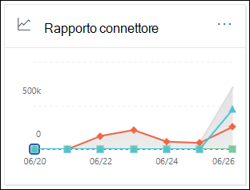

### Visualizzazione rapporto per il report connettoreReport view for the Connector report

Nella visualizzazione report sono disponibili i grafici seguenti:The following charts are available in report view:

- **Visualizzare i dati per: Flusso di posta**: questo grafico mostra il numero di messaggi in ingresso e in uscita organizzati per:**View data by: Mail flow**: This chart shows the number of inbound and outbound messages organized by:

  - **Totale****Total**
  - **Da Internet senza connettore****From the internet without a connector**
  - **A Internet senza connettore****To the internet without a connector**
  - Un connettore specifico configurato.A specific connector that you've configured.

  Per isolare i dati nel grafico, utilizzare il controllo Mostra **dati** per selezionare una di queste opzioni o **Tutto il flusso di posta.**To isolate the data in the chart, use the **Show data for** control to select one of these options or **All mail flow**.

  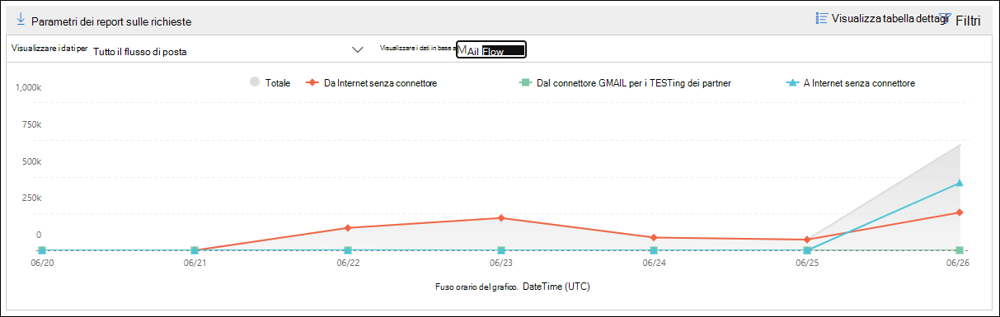

- **Visualizzare i dati in base all'utilizzo di TLS:** questo grafico mostra la percentuale di utilizzo della versione TLS (Transport Layer Security) per il flusso di posta.**View data by: TLS usage**: This chart shows the percentage of Transport Layer Security (TLS) version usage for mail flow.

  Per isolare i dati nel grafico, utilizzare il **controllo Mostra dati** per selezionare una delle opzioni seguenti:To isolate the data in the chart, use the **Show data for** control to select one of the following options:

  - **Tutto il flusso di posta****All mail flow**
  - **Da Internet senza connettore****From the internet without a connector**
  - **A Internet senza connettore****To the internet without a connector**
  - Un connettore specifico configurato.A specific connector that you've configured.

  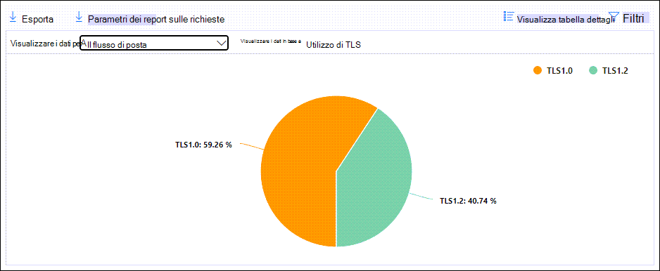

Se si fa **clic su Filtri** in una visualizzazione report, è possibile specificare un intervallo di date con Data di inizio **e** Data **di fine.**If you click **Filters** in a report view, you can specify a date range with **Start date** and **End date**.

### Visualizzazione della tabella dei dettagli per il report connettoreDetails table view for the Connector report

Se si fa **clic su Visualizza tabella dettagli** in una visualizzazione report, vengono visualizzate le informazioni seguenti:If you click **View details table** in a report view, the following information is shown:

- **Data****Date**
- **Direzione e nome del connettore****Connector direction and name**
- **Tipo di connettore****Connector type**
- **TLS forzato?**: Il **valore True** o **False.****Forced TLS?**: The value **True** or **False**.
- **Nessun TLS** (percentuale)**No TLS** (percentage)
- **TLS 1,0** (percentuale)**TLS 1.0** (percentage)
- **TLS 1.1** (percentuale)**TLS 1.1** (percentage)
- **TLS 1,2** (percentuale)**TLS 1.2** (percentage)
- **Volume**: numero di messaggi.**Volume**: The number of messages.

Se si fa **clic su Filtri** in una visualizzazione tabella dei dettagli, è possibile specificare un intervallo di date con Data di inizio **e** Data **di fine.**If you click **Filters** in a details table view, you can specify a date range with **Start date** and **End date**.

Per tornare alla visualizzazione report, fare clic su **Visualizza report.**To go back to the report view, click **View report**.

## Rapporto delle regole di trasporto di ExchangeExchange transport rule report

Il **rapporto sulle regole di trasporto** di Exchange mostra l'effetto delle regole del flusso di posta (note anche come regole di trasporto) sui messaggi in arrivo e in uscita nell'organizzazione.The **Exchange transport rule report** shows the effect of mail flow rules (also known as transport rules) on incoming and outgoing messages in your organization.

Per visualizzare il report, aprire il [Centro sicurezza & conformità,](https://protection.office.com)passare **al** \> **dashboard dei** report e selezionare la regola di trasporto **di Exchange.**To view the report, open the [Security & Compliance Center](https://protection.office.com), go to **Reports** \> **Dashboard** and select **Exchange Transport rule**. Per passare direttamente al report, aprire <https://protection.office.com/reportv2?id=ETRRuleReport> .To go directly to the report, open <https://protection.office.com/reportv2?id=ETRRuleReport>.

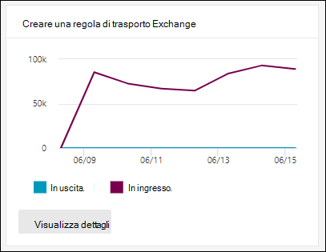

### Visualizzazione rapporto per il rapporto delle regole di trasporto di ExchangeReport view for the Exchange transport rule report

Nella visualizzazione report sono disponibili i grafici seguenti:The following charts are available in report view:

- **Visualizzare i dati per: regole di trasporto di Exchange** \> **Scomporsi per: Direzione:** questo grafico  mostra il numero di **messaggi in** ingresso e in uscita interessati dalle regole di trasporto.**View data by: Exchange transport rules** \> **Break down by: Direction**: This chart shows the number of **Inbound** and **Outbound** messages that were affected by transport rules.

- **Visualizzare i dati per: regole di trasporto di Exchange** \> **Scomporsi per: Gravità:** questo  grafico mostra il numero  di messaggi di gravità alta e media **e** bassa.**View data by: Exchange transport rules** \> **Break down by: Severity**: This chart shows the number of **High severity** and **Medium severity**, and **Low severity** messages. Il livello di gravità viene impostato come azione nella regola **(** Controlla questa regola con livello di gravità o _SetAuditSeverity_).You set the severity level as an action in the rule (**Audit this rule with severity level** or _SetAuditSeverity_). Per ulteriori informazioni, vedere Azioni delle regole [del flusso di posta in Exchange Online.](https://docs.microsoft.com//Exchange/security-and-compliance/mail-flow-rules/mail-flow-rule-actions)For more information, see [Mail flow rule actions in Exchange Online](https://docs.microsoft.com//Exchange/security-and-compliance/mail-flow-rules/mail-flow-rule-actions).

- **Visualizzare i dati da: regole di trasporto di Exchange DLP** \> **Scomporsi per: Direzione:** questo grafico  mostra il numero di messaggi **in** ingresso e in uscita interessati dalle regole di trasporto di prevenzione della perdita di dati (DLP).**View data by: DLP Exchange transport rules** \> **Break down by: Direction**: This chart shows the number of **Inbound** and **Outbound** messages that were affected by data loss prevention (DLP) transport rules. È possibile perfezionare ulteriormente il grafico selezionando una delle opzioni seguenti:You can further refine the chart by selecting on of the following options:

  - **Mostra dati per: Tutte le regole di trasporto DLP****Show data for: All DLP transport rules**
  - **Mostrare i dati per: utenti compromessi****Show data for: Compromised users**
  - **Mostra dati per: Basso volume di contenuto rilevato U.S. Patriot Act****Show data for: Low volume of content detected U.S. Patriot Act**

- **Visualizzare i dati da: regole di trasporto di Exchange DLP** \> **Scomporsi per: Direzione:** questa visualizzazione mostra il numero  di messaggi di gravità alta e media e di gravità bassa interessati dalle regole di trasporto DLP. **View data by: DLP Exchange transport rules** \> **Break down by: Direction**: This view shows the number of **High severity** and **Medium severity**, and **Low severity** messages that were affected by DLP transport rules. È possibile perfezionare ulteriormente il grafico selezionando una delle opzioni seguenti:You can further refine the chart by selecting on of the following options:

  - **Mostra dati per: Tutte le regole di trasporto DLP****Show data for: All DLP transport rules**
  - **Mostrare i dati per: utenti compromessi****Show data for: Compromised users**
  - **Mostra dati per: Basso volume di contenuto rilevato U.S. Patriot Act****Show data for: Low volume of content detected U.S. Patriot Act**

Se si fa **clic su Filtri** in una visualizzazione report, è possibile modificare i risultati con i filtri seguenti:If you click **Filters** in a report view, you can modify the results with the following filters::

- **Data di inizio** **e data di fine****Start date** and **End date**
- Valori di direzioneDirection values
- Valori di gravitàSeverity values

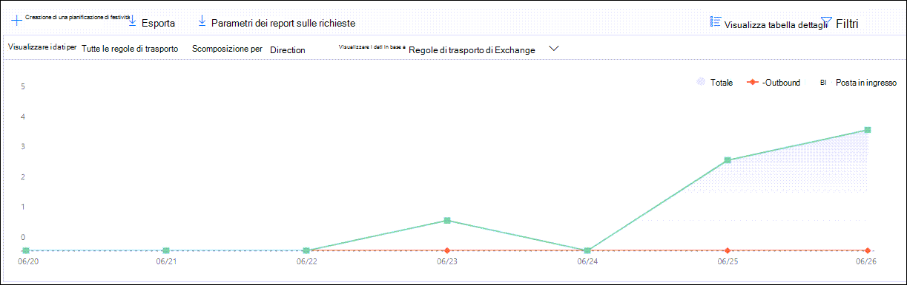

### Visualizzazione della tabella dei dettagli per il rapporto sulle regole di trasporto di ExchangeDetails table view for the Exchange transport rule report

Se si **fa clic su Visualizza tabella dettagli,** le informazioni visualizzate dipendono dal grafico visualizzato:If you click **View details table**, the information that's shown depends on the chart you were looking at:

- **Visualizzare i dati in base a: Regole di trasporto di Exchange:****View data by: Exchange Transport rules**:

  - **Data****Date**
  - **Regola di trasporto****Transport rule**
  - **Oggetto****Subject**
  - **Indirizzo del mittente****Sender address**
  - **Indirizzo destinatario****Recipient address**
  - **Gravità****Severity**
  - **Direzione****Direction**

- **Visualizzare i dati per: regole di trasporto dlp di Exchange:****View data by: DLP Exchange transport rules**:

  - **Data****Date**
  - **Criteri DLP****DLP policy**
  - **Regola di trasporto****Transport rule**
  - **Oggetto****Subject**
  - **Indirizzo del mittente****Sender address**
  - **Indirizzo destinatario****Recipient address**
  - **Gravità****Severity**
  - **Direzione****Direction**

Se si fa **clic su Filtri** in una visualizzazione tabella dei dettagli, è possibile modificare i risultati con i filtri seguenti:If you click **Filters** in a details table view, you can modify the results with the following filters:

- **Data di inizio** **e data di fine****Start date** and **End date**
- Valori di direzioneDirection values
- Valori di gravitàSeverity values

Per tornare alla visualizzazione report, fare clic su **Visualizza report.**To go back to the report view, click **View report**.

## Rapporto di inoltroForwarding report

Il **rapporto di inoltro** mostra i messaggi inoltrati automaticamente dall'organizzazione ai domini esterni dalle cassette postali di Exchange Online.The **Forwarding report** shows your organization's automatically forwarded messages to external domains from Exchange Online mailboxes. I messaggi inoltrati possono rappresentare un rischio per la sicurezza o la conformità e possono indicare un account compromesso.Forwarded messages can pose a security or compliance risk, and might indicate a compromised account.

Per visualizzare il report, aprire il [Centro sicurezza & conformità,](https://protection.office.com)passare al dashboard dei report  \>  e selezionare Report **di inoltro.**To view the report, open the [Security & Compliance Center](https://protection.office.com), go to **Reports** \> **Dashboard** and select **Forwarding report**. Per passare direttamente al report, aprire <https://protection.office.com/reportv2?id=MailFlowForwarding> .To go directly to the report, open <https://protection.office.com/reportv2?id=MailFlowForwarding>.

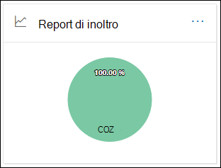

### Visualizzazione report per il report di inoltroReport view for the Forwarding report

Nella visualizzazione report sono disponibili i grafici seguenti:The following charts are available in the report view:

- **Mostra dati per: Metodi di inoltro**: Vengono visualizzati i metodi seguenti:**Show data for: Forwarding methods**: The following methods are shown:

  - **Regola di trasporto**: nota anche come [regole del flusso di posta.](https://docs.microsoft.com/Exchange/security-and-compliance/mail-flow-rules/mail-flow-rules)**Transport rule**: Also known as [mail flow rules](https://docs.microsoft.com/Exchange/security-and-compliance/mail-flow-rules/mail-flow-rules).
  - **Regola cassetta postale**: nota anche come [regole di Posta in arrivo.](https://support.microsoft.com/office/c24f5dea-9465-4df4-ad17-a50704d66c59)**Mailbox rule**: Also known as [Inbox rules](https://support.microsoft.com/office/c24f5dea-9465-4df4-ad17-a50704d66c59).

  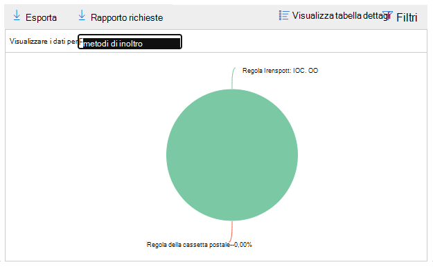

- **Mostra i dati per: Domini di inoltro**: questa visualizzazione mostra i domini dei destinatari che sono le destinazioni per l'inoltro.**Show data for: Forwarding domains**: This view shows the recipient domains that are the destinations for forwarding.

  

- **Mostra dati per: Server d'inoltro**: Vengono visualizzati i seguenti server d'inoltro:**Show data for: Forwarders**: The following forwarders are shown:

  - **Regola di trasporto****Transport rule**
  - La cassetta postale che contiene la regola di inoltro della posta in arrivo.The mailbox that contains the forwarding Inbox rule.

  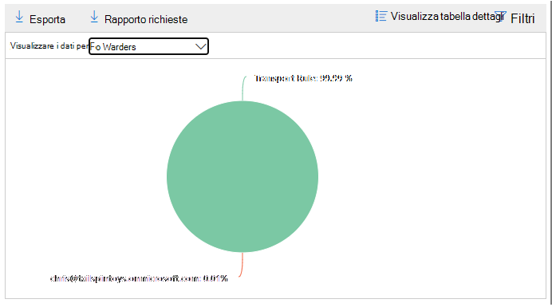

Se si fa **clic su Filtri** in una visualizzazione report, è possibile specificare un intervallo di date con Data di inizio **e** Data **di fine.**If you click **Filters** in a report view, you can specify a date range with **Start date** and **End date**.

### Visualizzazione tabella dettagli per il report di inoltroDetails table view for the Forwarding report

Se si fa **clic su Visualizza tabella dettagli** in una visualizzazione report, vengono visualizzate le informazioni seguenti:If you click **View details table** in a report view, the following information is shown:

- **Server d'inoltro**: il valore **della regola di trasporto** o della cassetta postale che contiene la regola di inoltro posta in arrivo.**Forwarders**: The value **Transport rule** or the mailbox that contains the forwarding Inbox rule.
- **Tipo di inoltro:** il valore **della regola cassetta postale o** della regola di **trasporto.****Forwarding type**: The value **Mailbox rule** or **Transport rule**.
- **Nome del destinatario****Recipient name**
- **Dominio destinatario****Recipient domain**
- **Dettagli:** si tratta del valore GUID della regola del flusso di posta o del valore RuleIdentity della regola di Posta in arrivo.**Details**: This is the GUID value of the mail flow rule, or the RuleIdentity value of the Inbox rule.
- **Numero****Count**
- **First forward date****First forward date**

Se si fa **clic su Filtri** in una visualizzazione tabella dei dettagli, è possibile specificare un intervallo di date con Data di inizio **e** Data **di fine.**If you click **Filters** in a details table view, you can specify a date range with **Start date** and **End date**.

Per tornare alla visualizzazione report, fare clic su **Visualizza report.**To go back to the reports view, click **View report**.

## Rapporto sullo stato del flusso di postaMailflow status report

La **relazione sullo stato del** flusso di posta è simile a quella inviata e ricevuta, con ulteriori informazioni sulla posta elettronica consentita o bloccata sul perimetro. The **Mailflow status report** is similar to the [Sent and received email report](#sent-and-received-email-report), with additional information about email allowed or blocked on the edge. Questo è l'unico report che contiene informazioni sulla protezione perimetrale e mostra la quantità di posta elettronica bloccata prima di essere consentita nel servizio per la valutazione da parte di Exchange Online Protection (EOP).This is the only report that contains edge protection information, and shows just how much email is blocked before being allowed into the service for evaluation by Exchange Online Protection (EOP). È importante comprendere che se un messaggio viene inviato a cinque destinatari, viene conteggiato come cinque messaggi diversi e non un messaggio.It's important to understand that if a message is sent to five recipients we count it as five different messages and not one message.
Per visualizzare il report, aprire il [Centro sicurezza & conformità,](https://protection.office.com)passare al dashboard dei report e selezionare Report sullo stato del flusso  \>  **di posta.**To view the report, open the [Security & Compliance Center](https://protection.office.com), go to **Reports** \> **Dashboard** and select **Mailflow status report**. Per passare direttamente alla relazione sullo stato **del flusso di posta,** aprire <https://protection.office.com/mailflowStatusReport> .To go directly to the **Mail flow status report**, open <https://protection.office.com/mailflowStatusReport>.

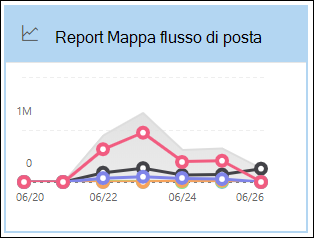

### Visualizzazione tipo per la relazione sullo stato del flusso di postaType view for the Mailflow status report

Quando si apre il report, la **scheda Tipo** è selezionata per impostazione predefinita.When you open the report, the **Type** tab is selected by default. Per impostazione predefinita, questa visualizzazione contiene un grafico e una tabella dati configurata con i filtri seguenti:By default, this view contains a chart and a data table that's configured with the following filters:

- **Data**: ultimi 7 giorni.**Date**: The last 7 days.
- **Direzione:****Direction**:

  - **In ingresso****Inbound**
  - **In uscita****Outbound**
  - **Intra-org:** questo conteggio è per i messaggi all'interno di un tenant, ad esempio**Intra-org**: this count is for messages within a tenant i.e mittente abc@domain.com inviati al destinatario xyz@domain.com (conteggiati separatamente da **in ingresso** e in **uscita)**sender abc@domain.com sends to recipient xyz@domain.com  (counted separately from **Inbound** and **Outbound**)

- **Digitare**:**Type**:

  - **Posta buona****Good mail**
  - **Malware****Malware**
  - **Posta indesiderata****Spam**
  - **Protezione edge****Edge protection**
  - **Messaggi delle regole****Rule messages**
  - **Posta di phishing****Phishing email**

Il grafico è organizzato in base ai **valori type.**The chart is organized by the **Type** values.

È possibile modificare questi filtri facendo clic **su Filtro** o su un valore nella legenda del grafico.You can change these filters by clicking **Filter** or by clicking a value in the chart legend.

La tabella dati contiene le informazioni seguenti:The data table contains the following information:

- **Direzione****Direction**
- **Type****Type**
- **24 ore****24 hours**
- **3 giorni****3 days**
- **7 giorni****7 days**
- **15 giorni****15 days**
- **30 giorni****30 days**

Se si fa **clic su Scegli una categoria per ulteriori dettagli,** è possibile selezionare uno dei valori seguenti:If you click **Choose a category for more details**, you can select from the following values:

- **Posta elettronica di phishing:** questa selezione consente di visualizzare il rapporto sullo stato [di Protezione dalle minacce.](view-email-security-reports.md#threat-protection-status-report)**Phishing email**: This selection takes you to the [Threat protection status report](view-email-security-reports.md#threat-protection-status-report).
- **Malware nella posta elettronica:** questa selezione consente di visualizzare il rapporto sullo stato [di Protezione dalle minacce.](view-email-security-reports.md#threat-protection-status-report)**Malware in email**: This selection takes you to the [Threat protection status report](view-email-security-reports.md#threat-protection-status-report).
- **Rilevamenti posta indesiderata:** questa selezione consente di accedere al [rapporto Rilevamenti posta indesiderata.](view-email-security-reports.md#spam-detections-report)**Spam detections**: This selection takes you to the [Spam Detections report](view-email-security-reports.md#spam-detections-report).
- **Posta indesiderata bloccata** di Edge: questa selezione consente di accedere al [rapporto Rilevamenti posta indesiderata.](view-email-security-reports.md#spam-detections-report)**Edge blocked spam**: This selection takes you to the [Spam Detections report](view-email-security-reports.md#spam-detections-report).

**Esporta**:**Export**:

Per la visualizzazione dettagli, è possibile esportare i dati solo per un giorno.For the detail view, you can only export data for one day. Pertanto, se si desidera esportare i dati per 7 giorni, è necessario eseguire 7 diverse azioni di esportazione.So, if you want to export data for 7 days, you need to do 7 different export actions.

Ogni file CSV esportato è limitato a 150.000 righe.Each exported .csv file is limited to 150,000 rows. Se i dati di quel giorno contengono più di 150.000 righe, verranno creati più file CSV.If the data for that day contains more than 150,000 rows, then multiple .csv files will be created.

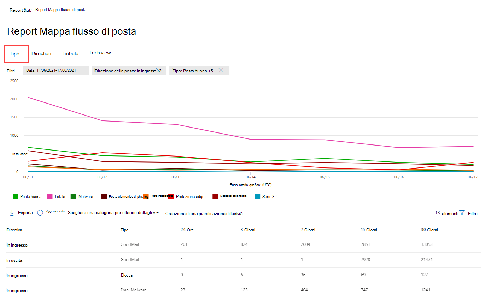

### Visualizzazione della direzione per la relazione sullo stato del flusso di postaDirection view for the Mailflow status report

Se si fa clic **sulla scheda Direzione,** vengono utilizzati gli stessi filtri predefiniti della **visualizzazione** Tipo.If you click the **Direction** tab, the same default filters from the **Type** view are used.

Il grafico è organizzato in base **ai valori di** direzione.The chart is organized by **Direction** values.

È possibile modificare questi filtri facendo clic **su Filtro** o su un valore nella legenda del grafico.You can change these filters by clicking **Filter** or by clicking a value in the chart legend. Vengono utilizzati gli stessi filtri **della visualizzazione** Tipo.The same filters from the **Type** view are used.

La tabella dati contiene le stesse informazioni della **visualizzazione Tipo.**The data table contains same information from the **Type** view.

**L'opzione Scegli una categoria per ulteriori** dettagli sulle selezioni e sul comportamento disponibili è la stessa della visualizzazione **Tipo.**The **Choose a category for more details** available selections and behavior are the same as the **Type** view.

**Esporta**:**Export**:

Per la visualizzazione dettagli, è possibile esportare i dati solo per un giorno.For the detail view, you can only export data for one day. Pertanto, se si desidera esportare i dati per 7 giorni, è necessario eseguire 7 diverse azioni di esportazione.So, if you want to export data for 7 days, you need to do 7 different export actions.

Ogni file CSV esportato è limitato a 150.000 righe.Each exported .csv file is limited to 150,000 rows. Se i dati di quel giorno contengono più di 150.000 righe, verranno creati più file CSV.If the data for that day contains more than 150,000 rows, then multiple .csv files will be created.

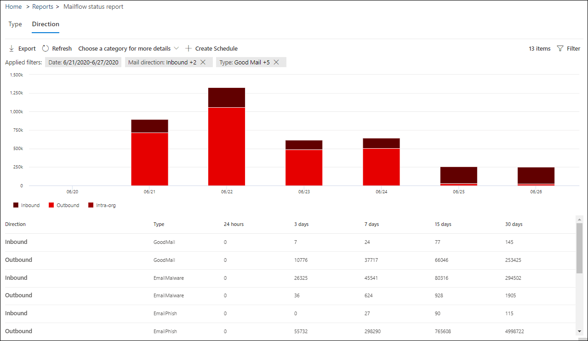

### Visualizzazione Imbuto per la relazione sullo stato del flusso di postaFunnel view for the Mailflow status report

La **visualizzazione Imbuto** mostra il modo in cui le funzionalità di protezione dalle minacce alla posta elettronica di Microsoft filtrano la posta elettronica in arrivo e in uscita nell'organizzazione.The **Funnel** view shows you how Microsoft's email threat protection features filter incoming and outgoing email in your organization. Fornisce informazioni dettagliate sul conteggio totale della posta elettronica e sul modo in cui le funzionalità di protezione dalle minacce configurate, tra cui la protezione perimetrale, l'antimalware, l'anti-phishing, la protezione da posta indesiderata e l'anti-spoofing influiscono su questo conteggio.It provides details on the total email count, and how the configured threat protection features, including edge protection, anti-malware, anti-phishing, anti-spam, and anti-spoofing affect this count.

Se si fa clic **sulla** scheda Imbuto, per impostazione predefinita questa visualizzazione contiene un grafico e una tabella dati configurata con i filtri seguenti:If you click the **Funnel** tab, by default, this view contains a chart and a data table that's configured with the following filters:

- **Data**: ultimi 7 giorni.**Date**: The last 7 days.

- **Direzione:****Direction**:

  - **In ingresso****Inbound**
  - **In uscita****Outbound**
  - **Intra-org:** questo conteggio è per i messaggi inviati all'interno di un tenant; Ad esempio, il mittente abc@domain.com invia al destinatario xyz@domain.com (conteggiato separatamente da in ingresso e in uscita).**Intra-org**: This count is for messages sent within a tenant; i.e, sender abc@domain.com sends to recipient xyz@domain.com (counted separately from Inbound and Outbound).

La visualizzazione aggregata e la visualizzazione tabella dati consentono 90 giorni di filtro.The aggregate view and data table view allow for 90 days of filtering.

Se si fa **clic su Filtro,** è possibile filtrare sia il grafico che la tabella dati.If you click **Filter**, you can filter both the chart and the data table.

Questo grafico mostra il numero di messaggi di posta elettronica organizzati per:This chart shows the email count organized by:

- **Totale messaggi di posta elettronica****Total email**
- **Posta elettronica dopo la protezione perimetrale****Email after edge protection**
- **Posta elettronica dopo antimalware, reputazione file, blocco del tipo di file****Email after anti-malware, file reputation, file type block**
- **Posta elettronica dopo anti-phish, reputazione URL, rappresentazione del marchio, anti-spoofing****Email after anti-phish, URL reputation, brand impersonation, anti-spoof**
- **Posta elettronica dopo la posta indesiderata, filtro posta in blocco****Email after anti-spam, bulk mail filtering**
- **Posta elettronica dopo la rappresentazione di utenti e domini**1**Email after user and domain impersonation**1
- **Posta elettronica dopo la detonazione di file e URL**1**Email after file and URL detonation**1
- **Email detected as benign after post-delivery protection (URL click time protection)****Email detected as benign after post-delivery protection (URL click time protection)**

1 Defender solo per Office 3651 Defender for Office 365 only

Per visualizzare separatamente la posta elettronica filtrata da EOP o Defender per Office 365, fare clic sul valore nella legenda del grafico.To view the email filtered by EOP or Defender for Office 365 separately, click on the value in the chart legend.

La tabella dati contiene le informazioni seguenti, visualizzate in ordine decrescente:The data table contains the following information, shown in descending date order:

- **Data****Date**
- **Totale messaggi di posta elettronica****Total email**
- **Protezione edge****Edge protection**
- **Antimalware, reputazione file, blocco del tipo di file:****Anti-malware, file reputation, file type block**:
  - **Reputazione file:** messaggi filtrati a causa dell'identificazione di un file allegato da parte di altri clienti Microsoft.**File reputation**: Messages filtered due to identification of an attached file by other Microsoft customers.
  - **Blocco del tipo di file:** messaggi filtrati a causa del tipo di file dannoso identificato nel messaggio.**File type block**: Messages filtered due to the type of malicious file identified in the message.
- **Anti-phish, reputazione URL, rappresentazione del marchio, anti-spoofing:****Anti-phish, URL reputation, Brand impersonation, anti-spoof**:
  - **Reputazione URL:** messaggi filtrati a causa dell'identificazione dell'URL da parte di altri clienti Microsoft.**URL reputation**: Messages filtered due to the identification of the URL by other Microsoft customers.
  - **Rappresentazione del marchio**: messaggi filtrati a causa del messaggio proveniente da mittenti noti che rappresentano il marchio.**Brand impersonation**: Messages filtered due to the message coming from well-known brand impersonating senders.
  - **Anti-spoofing**: messaggi filtrati a causa del messaggio che tenta di effettuare lo spoofing di un dominio a cui appartiene il destinatario o di un dominio di cui il mittente non è proprietario.**Anti-spoof**: Messages filtered due to the message attempting to spoof a domain that the recipient belongs to, or a domain that the message sender doesn't own.
- **Protezione da posta indesiderata, filtro posta inviata in blocco:****Anti-spam, bulk mail filtering**:
  - **Filtro posta inviata in blocco**: messaggi filtrati a causa di un tentativo di recapitare la posta inviata in blocco ai destinatari.**Bulk mail filtering**: Messages filtered due to an attempt to deliver bulk mail to its recipients.
- **Rappresentazione di utenti e domini (Defender per Office 365)**:**User and domain impersonation (Defender for Office 365)**:
  - **Rappresentazione utente**: messaggi filtrati a causa di un tentativo di imitare un utente (mittente del messaggio) definito nelle impostazioni di protezione della rappresentazione di un criterio anti-phishing.**User impersonation**: Messages filtered due to an attempt to impersonate a user (message sender) that's defined in the impersonation protection settings of an anti-phishing policy.
  - **Rappresentazione del dominio**: messaggi filtrati a causa di un tentativo di rappresentare un dominio definito nelle impostazioni di protezione della rappresentazione di un criterio anti-phishing.**Domain impersonation**: Messages filtered due to an attempt to impersonate a domain that's defined in the impersonation protection settings of an anti-phishing policy.
- **Detonazione di file e URL (Defender per Office 365)**:**File and URL detonation (Defender for Office 365)**:
  - **Detonazione file:** messaggi filtrati in base a un criterio Allegati sicuri.**File detonation**: Messages filtered by a Safe Attachments policy.
  - **Detonazione URL:** messaggio filtrato in base a un criterio Collegamenti sicuri.**URL detonation**: Message filtered by a Safe Links policy.
- **Protezione post-recapito e ZAP (ATP) o ZAP (EOP):** ZAP indica l'eliminazione automatica di zero ore.**Post-delivery protection and ZAP (ATP), or ZAP (EOP)**: ZAP indicates zero hour auto-purge.

Se si seleziona una riga nella tabella di dati, nel riquadro a comparsa viene visualizzata un'ulteriore suddivisione dei conteggi dei messaggi di posta elettronica.If you select a row in the data table, a further breakdown of the email counts are shown in the flyout.

**Esporta**:**Export**:

Dopo aver fatto **clic su Esporta** in **Opzioni,** è possibile selezionare uno dei valori seguenti:After you click **Export** under **Options**, you can select one of the following values:

- **Riepilogo (con i dati degli ultimi 90 giorni al massimo)****Summary (with data for last 90 days at most)**
- **Dettagli (con i dati degli ultimi 30 giorni al massimo)****Details (with data for last 30 days at most)**

In **Data** scegliere un intervallo e quindi fare clic su **Applica.**Under **Date**, choose a range, and then click **Apply**. I dati per i filtri correnti verranno esportati in un file CSV.Data for the current filters will be exported to a .csv file.

Ogni file CSV esportato è limitato a 150.000 righe.Each exported .csv file is limited to 150,000 rows. Se i dati contengono più di 150.000 righe, verranno creati più file CSV.If the data contains more than 150,000 rows, then multiple .csv files will be created.

 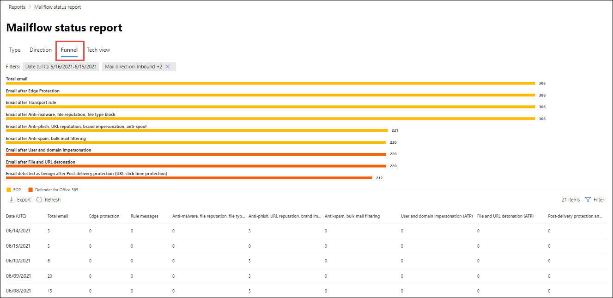

### Visualizzazione tecnica per la relazione sullo stato del flusso di postaTech view for the Mailflow status report

La **visualizzazione Tech è** simile alla visualizzazione **Imbuto,** fornendo dettagli più dettagliati per le funzionalità di protezione dalle minacce configurate.The **Tech view** is similar to the **Funnel** view, providing more granular details for the configured threat protections features. Dal grafico è possibile vedere in che modo i messaggi vengono categorizzati nelle diverse fasi della protezione dalle minacce.From the chart, you can see how messages are categorized at the different stages of threat protection.

Se si fa clic **sulla scheda Visualizzazione tecnica,** per impostazione predefinita questa visualizzazione contiene un grafico e una tabella dati configurata con i filtri seguenti:If you click the **Tech view** tab, by default, this view contains a chart and a data table that's configured with the following filters:

- **Data**: ultimi 7 giorni.**Date**: The last 7 days.

- **Direzione:****Direction**:

  - **In ingresso****Inbound**
  - **In uscita****Outbound**
  - **Intra-org:** questo conteggio è per i messaggi all'interno di un tenant, ad esempio**Intra-org**: this count is for messages within a tenant i.e mittente abc@domain.com inviati al destinatario xyz@domain.com (conteggiati separatamente da in ingresso e in uscita)sender abc@domain.com sends to recipient xyz@domain.com (counted separately from Inbound and Outbound)

La visualizzazione aggregata e la visualizzazione tabella dati consentono 90 giorni di filtro.The aggregate view and data table view allow for 90 days of filtering.

Se si fa **clic su Filtro,** è possibile filtrare sia il grafico che la tabella dati.If you click **Filter**, you can filter both the chart and the data table.

Questo grafico mostra i messaggi organizzati nelle categorie seguenti:This chart shows messages organized into the following categories:

- **Totale messaggi di posta elettronica****Total email**
- **Edge allow** e **Edge filtered****Edge allow** and **Edge filtered**
- **Non malware,** **rilevamento allegati sicuri,** \* rilevamento del motore **antimalware** e messaggi **delle regole****Not malware**, **Safe Attachments detection**\*, **Anti-malware engine detection**, and **Rule messages**
- **Not phish,** **DMARC failure,** **Impersonation detection,** **Spoof detection**, and **Phish detection****Not phish**, **DMARC failure**, **Impersonation detection**, **Spoof detection**, and **Phish detection**
- **Nessun rilevamento con detonazione URL e** **rilevamento detonazione URL**\***No detection with URL detonation** and **URL detonation detection**\*
- **Non posta indesiderata** e  **posta indesiderata****Not spam** and  **Spam**
- **Posta elettronica non dannosa,** **rilevamento collegamenti sicuri** e \* **ZAP****Non-malicious email**, **Safe Links detection**\*, and **ZAP**

\* Defender per Office 365\* Defender for Office 365

Quando si passa il mouse su una categoria nel grafico, è possibile visualizzare il numero di messaggi in tale categoria.When you hover over a category in the chart, you can see the number of messages in that category.

La tabella dati contiene le informazioni seguenti, visualizzate in ordine decrescente:The data table contains the following information, shown in descending date order:

- **Data****Date**
- **Totale messaggi di posta elettronica****Total email**
- **Edge filtrato****Edge filtered**
- **Motore antimalware, Allegati sicuri, regola filtrata:****Anti-malware engine, Safe Attachments, rule filtered**:
  - **Regola filtrata:** messaggi filtrati a causa delle regole del flusso di posta (note anche come regole di trasporto).**Rule filtered**: Messages filtered due to  mail flow rules (also known as transport rules).
- **DMARC, rappresentazione, spoofing, phish filtrato:****DMARC, impersonation, spoof, phish filtered**:
  - **DMARC**: messaggi filtrati a causa del mancato controllo dell'autenticazione DMARC da parte del messaggio.**DMARC**: Messages filtered due to the message failing its DMARC authentication check.
- **Rilevamento detonazione URL****URL detonation detection**
- **Protezione da posta indesiderata filtrata****Anti-spam filtered**
- **ZAP rimosso****ZAP removed**
- **Rilevamento tramite collegamenti sicuri****Detection by Safe Links**

Se si seleziona una riga nella tabella di dati, nel riquadro a comparsa viene visualizzata un'ulteriore suddivisione dei conteggi dei messaggi di posta elettronica.If you select a row in the data table, a further breakdown of the email counts are shown in the flyout.

**Esporta**:**Export**:

Facendo clic **su Esporta,** **in Opzioni** è possibile selezionare uno dei valori seguenti:On clicking **Export**, under **Options** you can select one of the following values:

- **Riepilogo (con i dati degli ultimi 90 giorni al massimo)****Summary (with data for last 90 days at most)**
- **Dettagli (con i dati degli ultimi 30 giorni al massimo)****Details (with data for last 30 days at most)**

In **Data** scegliere un intervallo e quindi fare clic su **Applica.**Under **Date**, choose a range, and then click **Apply**. I dati per i filtri correnti verranno esportati in un file CSV.Data for the current filters will be exported to a .csv file.

Ogni file CSV esportato è limitato a 150.000 righe.Each exported .csv file is limited to 150,000 rows. Se i dati contengono più di 150.000 righe, verranno creati più file CSV.If the data contains more than 150,000 rows, then multiple .csv files will be created.

 

## Rapporto di posta elettronica inviato e ricevutoSent and received email report

Il **rapporto posta elettronica** inviata e ricevuta è un report intelligente che mostra le informazioni sulla posta elettronica in arrivo e in uscita, inclusi i rilevamenti di posta indesiderata, il malware e la posta elettronica identificata come "buona".The **Sent and received email** report is a smart report that shows information about incoming and outgoing email, including spam detections, malware, and email identified as "good." La differenza tra questo rapporto e la relazione sullo stato [del](#mailflow-status-report) flusso di posta è che questo rapporto non include i dati sui messaggi bloccati dalla protezione perimetrale. È importante comprendere che se un messaggio viene inviato a cinque destinatari, viene conteggiato come un unico messaggio.The difference between this report and the [Mailflow status report](#mailflow-status-report) is: this report doesn't include data about messages blocked by edge protection.It's important to understand that if a message is sent to five recipients we count it as one message.

La visualizzazione aggregata e la visualizzazione dettagli del report consentono 90 giorni di filtro.The aggregate view and the detail view of the report allow for 90 days of filtering.

Per visualizzare il report, aprire il [Centro sicurezza & conformità,](https://protection.office.com)passare al dashboard dei report e selezionare Posta elettronica inviata  \>  **e ricevuta.**To view the report, open the [Security & Compliance Center](https://protection.office.com), go to **Reports** \> **Dashboard** and select **Sent and received email**. Per passare direttamente al report, aprire <https://protection.office.com/reportv2?id=SentAndReceivedMailATP> .To go directly to the report, open <https://protection.office.com/reportv2?id=SentAndReceivedMailATP>.

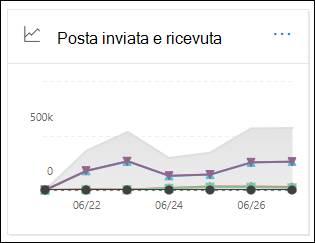

### Visualizzazione report per il rapporto di posta elettronica inviato e ricevutoReport view for the Sent and received email report

Nella visualizzazione report sono disponibili i grafici seguenti:The following charts are available in the report view:

- **Scomporsi per: Tipo**: il grafico mostra tutte le categorie disponibili:**Break down by: Type**: The chart shows all available categories:

  - **Totale****Total**
  - **Posta buona****Good mail**
  - **Malware (antimalware)** (EOP)**Malware (anti-malware)** (EOP)
  - **Rilevamenti di posta indesiderata****Spam detections**
  - **Messaggi delle regole****Rule messages**
  - **Malware avanzato** (Microsoft Defender per Office 365)**Advanced malware** (Microsoft Defender for Office 365)

  Quando si passa il puntatore del mouse su un giorno (punto dati) nel grafico, è possibile visualizzare i dettagli relativi a tale giorno.When you hover over a day (data point) in the chart, you can see details for that day.

  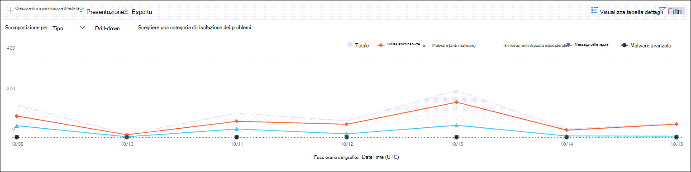

- **Scomporsi per: Direzione:** il grafico mostra **i dati totali,** **in ingresso** **e in** uscita.**Break down by: Direction**: The chart shows **Total**, **Inbound**, and **Outbound** data. Quando si passa il puntatore del mouse su un giorno (punto dati) nel grafico, è possibile visualizzare i dettagli relativi a tale giorno.When you hover over a day (data point) in the chart, you can see details for that day.

  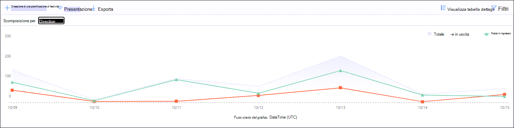

- **Drill-down per** \> **Malware (antimalware):** questa selezione consente di accedere ai rilevamenti [di malware nel report di posta elettronica.](view-email-security-reports.md#malware-detections-in-email-report)**Drill down by** \> **Malware (anti-malware)**: This selection takes you to the [Malware detections in email report](view-email-security-reports.md#malware-detections-in-email-report).

- **Drill-down per** \> **Rilevamenti posta indesiderata):** questa selezione consente di accedere al [rapporto Rilevamenti posta indesiderata.](view-email-security-reports.md#spam-detections-report)**Drill down by** \> **Spam detections)**: This selection takes you to the [Spam Detections report](view-email-security-reports.md#spam-detections-report).

Se si fa **clic su Filtri** in una visualizzazione report, è possibile modificare i risultati con i filtri seguenti:If you click **Filters** in a report view, you can modify the results with the following filters:

- **Data di inizio** **e data di fine****Start date** and **End date**
- Valori di direzioneDirection values
- Valori di tipoType values

Per tornare alla visualizzazione report, fare clic su **Visualizza report.**To go back to the report view, click **View report**.

### Visualizzazione della tabella dei dettagli per il rapporto di posta elettronica inviato e ricevutoDetails table view for the Sent and received email report

Se si fa **clic su Visualizza tabella** dettagli nella visualizzazione Scomposi **per: Direzione** o Scomposi **per: Direzione,** vengono visualizzate le informazioni seguenti:If you click **View details table** in the **Break down by: Direction** or **Break down by: Direction** view, the following information is shown:

- **Data (UTC)****Date (UTC)**
- **Type****Type**
- **Direzione****Direction**
- **Numero messaggi****Message count**

Se si fa **clic su Filtri** in una visualizzazione tabella dei dettagli, è possibile modificare i risultati con i filtri seguenti:If you click **Filters** in a details table view, you can modify the results with the following filters:

- **Data di inizio** **e data di fine****Start date** and **End date**
- Valori di direzioneDirection values
- Valori di tipoType values

Per tornare alla visualizzazione report, fare clic su **Visualizza report.**To go back to the report view, click **View report**.

## Rapporto Mittenti e destinatari principaliTop senders and recipients report

Il **rapporto Mittenti e destinatari** principali è un grafico a torta che mostra i mittenti e i destinatari di posta elettronica principali.The **Top senders and recipients** report is a pie chart showing your top email senders and recipients.

Per visualizzare il report, aprire il [Centro sicurezza & conformità,](https://protection.office.com)passare al dashboard dei report e selezionare  \>  **Mittenti e destinatari principali.**To view the report, open the [Security & Compliance Center](https://protection.office.com), go to **Reports** \> **Dashboard** and select **Top senders and recipients**. Per passare direttamente al report, aprire <https://protection.office.com/reportv2?id=TopSenderRecipientsATP> .To go directly to the report, open <https://protection.office.com/reportv2?id=TopSenderRecipientsATP>.

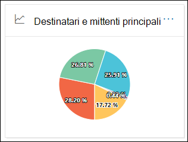

### Visualizzazione rapporto per il rapporto Mittenti principali e destinatariReport view for the Top senders and recipient report

Nella visualizzazione report sono disponibili i grafici seguenti:The following charts are available in the report view:

- **Visualizzare i dati per \> i mittenti di posta principali****Show data for \> Top mail senders**
- **Visualizzare i dati per \> i destinatari di posta principali****Show data for \> Top mail recipients**
- **Visualizzare i dati per \> i destinatari principali della posta indesiderata****Show data for \> Top spam recipients**
- **Mostra dati per \> Principali destinatari di malware** (EOP)**Show data for \> Top malware recipients** (EOP)
- **Visualizzare i dati \> per i principali destinatari di malware (Defender per Office 365)****Show data for \> Top malware recipients (Defender for Office 365)**

La composizione del grafico a torta cambia in base a queste selezioni.The composition of the pie chart changes based on these selections.

Quando si passa il mouse su un cuneo nel grafico a torta, è possibile visualizzare un conteggio dei messaggi inviati o ricevuti.When you hover over a wedge in the pie chart, you can see a count of messages sent or received.

Se si fa **clic su Filtri** in una visualizzazione report, è possibile specificare un intervallo di date con Data di inizio **e** Data **di fine.**If you click **Filters** in a report view, you can specify a date range with **Start date** and **End date**.

### Visualizzazione tabella dettagli per il rapporto Mittenti principali e destinatariDetails table view for the Top senders and recipient report

Se si **fa clic su Visualizza tabella dettagli,** le informazioni visualizzate dipendono dal grafico visualizzato:If you click **View details table**, the information that's shown depends on the chart you were looking at:

- **Visualizzare i dati per \> i mittenti di posta principali****Show data for \> Top mail senders**

  - **Principali mittenti di posta****Top mail senders**
  - **Numero****Count**

- **Visualizzare i dati per \> i destinatari di posta principali****Show data for \> Top mail recipients**

  - **Destinatari di posta elettronica principali****Top mail recipients**
  - **Numero****Count**

- **Visualizzare i dati per \> i destinatari principali della posta indesiderata****Show data for \> Top spam recipients**

  - **Destinatari di posta indesiderata principali****Top spam recipients**
  - **Numero****Count**

- **Mostra dati per \> Principali destinatari di malware** (EOP)**Show data for \> Top malware recipients** (EOP)

  - **Principali destinatari di malware****Top malware recipients**
  - **Numero****Count**

- **Visualizzare i dati \> per i principali destinatari di malware (Defender per Office 365)****Show data for \> Top malware recipients (Defender for Office 365)**

  - **Principali destinatari di malware (Defender per Office 365)****Top malware recipients (Defender for Office 365)**
  - **Numero****Count**

Se si fa **clic su Filtri** in una visualizzazione tabella dei dettagli, è possibile specificare un intervallo di date con Data di inizio **e** Data **di fine.**If you click **Filters** in a details table view, you can specify a date range with **Start date** and **End date**.

Per tornare alla visualizzazione report, fare clic su **Visualizza report.**To go back to the report view, click **View report**.

## Quali autorizzazioni sono necessarie per visualizzare questi report?What permissions are needed to view these reports?

Per visualizzare e utilizzare i report descritti in questo articolo, è necessario essere membri di uno dei gruppi di ruoli seguenti nel Centro sicurezza & conformità:In order to view and use the reports described in this article, you need to be a member of one of the following role groups in the Security & Compliance Center:

- **Gestione organizzazione****Organization Management**
- **Amministratore della sicurezza****Security Administrator**
- **Lettore di sicurezza****Security Reader**
- **Lettore globale****Global Reader**

Per altre informazioni, vedere [Autorizzazioni nel Centro sicurezza e conformità](permissions-in-the-security-and-compliance-center.md).For more information, see [Permissions in the Security & Compliance Center](permissions-in-the-security-and-compliance-center.md).

> [!NOTE]
> L'aggiunta di utenti al ruolo di Azure Active Directory corrispondente nell'interfaccia di amministrazione di Microsoft 365 fornisce agli utenti le autorizzazioni necessarie nel centro Sicurezza e conformità _e_ le autorizzazioni per altre funzionalità di Microsoft 365.Adding users to the corresponding Azure Active Directory role in the Microsoft 365 admin center gives users the required permissions in the Security & Compliance Center _and_ permissions for other features in Microsoft 365. Per altre informazioni, vedere [Informazioni sui ruoli di amministratore](../../admin/add-users/about-admin-roles.md).For more information, see [About admin roles](../../admin/add-users/about-admin-roles.md).

## Argomenti correlatiRelated topics

[Report intelligenti e informazioni dettagliate nel Centro sicurezza e conformitàSmart reports and insights in the Security & Compliance Center](reports-and-insights-in-security-and-compliance.md)

[Approfondimenti sul flusso di posta nel Centro sicurezza e conformitàMail flow insights in the Security & Compliance Center](mail-flow-insights-v2.md)

[Visualizzare i report sulla sicurezza della posta elettronica nel Centro sicurezza e conformitàView email security reports in the Security & Compliance Center](view-email-security-reports.md)

[Visualizzare i report per Microsoft Defender per Office 365View reports for Microsoft Defender for Office 365](view-reports-for-atp.md)
