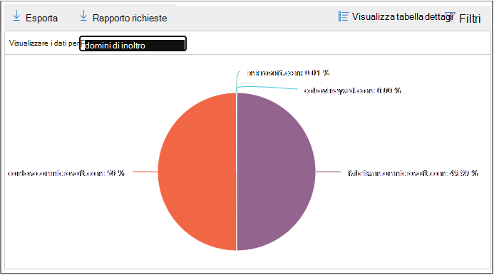

# Visualizzare i report sul flusso di posta nel dashboard report nel centro sicurezza & ComplianceView mail flow reports in the Reports dashboard in Security & Compliance Center

Oltre ai rapporti sul flusso di posta disponibili nel [Dashboard del flusso](mail-flow-insights-v2.md) di posta elettronica nel centro sicurezza & Compliance, nel dashboard report sono disponibili numerosi rapporti di flusso di posta aggiuntivi che consentono di monitorare l'organizzazione Microsoft 365.In addition to the mail flow reports that are available in the [Mail flow dashboard](mail-flow-insights-v2.md) in the Security & Compliance Center, a variety of additional mail flow reports are available in the Reports dashboard to help you monitor your Microsoft 365 organization.

Se si dispone delle [autorizzazioni necessarie](#what-permissions-are-needed-to-view-these-reports), è possibile visualizzare i report nel [Centro sicurezza & Compliance](https://office.protection.com) accedendo al **Reports** \> **Dashboard**report.If you have the [necessary permissions](#what-permissions-are-needed-to-view-these-reports), you can view these reports in the [Security & Compliance Center](https://office.protection.com) by going to **Reports** \> **Dashboard**. Per accedere direttamente al dashboard dei report, aprire <https://protection.office.com/insightdashboard> .To go directly to the Reports dashboard, open <https://protection.office.com/insightdashboard>.

## Rapporto connettoreConnector report

Il **rapporto connettore** consente di visualizzare l'attività del flusso di posta sui [connettori in ingresso e in uscita](https://docs.microsoft.com/Exchange/mail-flow-best-practices/use-connectors-to-configure-mail-flow/use-connectors-to-configure-mail-flow) configurati per l'organizzazione.The **Connector report** shows mail flow activity on the [inbound and outbound connectors](https://docs.microsoft.com/Exchange/mail-flow-best-practices/use-connectors-to-configure-mail-flow/use-connectors-to-configure-mail-flow) that are configured for your organization.

Per visualizzare il report, aprire il [Centro sicurezza & conformità](https://protection.office.com), accedere al **Reports** \> **Dashboard** dei report e selezionare il **report del connettore**.To view the report, open the [Security & Compliance Center](https://protection.office.com), go to **Reports** \> **Dashboard** and select **Connector report**. Per passare direttamente al report, aprire <https://protection.office.com/reportv2?id=ConnectorReport> .To go directly to the report, open <https://protection.office.com/reportv2?id=ConnectorReport>.

### Visualizzazione report per il report del connettoreReport view for the Connector report

Nella visualizzazione report sono disponibili i grafici seguenti:The following charts are available in report view:

- **Visualizzazione dei dati per: flusso di posta**: questo grafico mostra il numero di messaggi in ingresso e in uscita organizzati da:**View data by: Mail flow**: This chart shows the number of inbound and outbound messages organized by:

  - **Totale****Total**
  - **Da Internet senza connettore****From the internet without a connector**
  - **A Internet senza un connettore****To the internet without a connector**
  - Connettore specifico configurato.A specific connector that you've configured.

  Per isolare i dati nel grafico, utilizzare la casella di controllo **Mostra dati per** selezionare una di queste opzioni o **tutto il flusso di posta**.To isolate the data in the chart, use the **Show data for** control to select one of these options or **All mail flow**.

  

- **Visualizzare i dati in base a: utilizzo TLS**: questo grafico mostra la percentuale di utilizzo della versione TLS (Transport Layer Security) per il flusso di posta.**View data by: TLS usage**: This chart shows the percentage of Transport Layer Security (TLS) version usage for mail flow.

  Per isolare i dati nel grafico, utilizzare il controllo **Mostra dati per** selezionare una delle opzioni seguenti:To isolate the data in the chart, use the **Show data for** control to select one of the following options:

  - **Tutto il flusso di posta****All mail flow**
  - **Da Internet senza connettore****From the internet without a connector**
  - **A Internet senza un connettore****To the internet without a connector**
  - Connettore specifico configurato.A specific connector that you've configured.

  

Se si fa clic su **filtri** in una visualizzazione report, è possibile specificare un intervallo di date con data di **inizio** e **Data di fine**.If you click **Filters** in a report view, you can specify a date range with **Start date** and **End date**.

### Visualizzazione della tabella dei dettagli per il report del connettoreDetails table view for the Connector report

Se si fa clic su **Visualizza tabella dettagli** in una visualizzazione report, vengono visualizzate le informazioni seguenti:If you click **View details table** in a report view, the following information is shown:

- **Data****Date**
- **Direzione e nome del connettore****Connector direction and name**
- **Tipo di connettore****Connector type**
- **TLS forzato**: il valore **true** o **false**.**Forced TLS?**: The value **True** or **False**.
- **Nessun TLS** (percentuale)**No TLS** (percentage)
- **TLS 1,0** (percentuale)**TLS 1.0** (percentage)
- **TLS 1,1** (percentuale)**TLS 1.1** (percentage)
- **TLS 1,2** (percentuale)**TLS 1.2** (percentage)
- **Volume**: il numero di messaggi.**Volume**: The number of messages.

Se si fa clic su **filtri** in una visualizzazione tabella dettagli, è possibile specificare un intervallo di date con data di **inizio** e **Data di fine**.If you click **Filters** in a details table view, you can specify a date range with **Start date** and **End date**.

Per tornare alla visualizzazione report, fare clic su **Visualizza report**.To go back to the report view, click **View report**.

## Rapporto delle regole di trasporto di ExchangeExchange transport rule report

Il **rapporto della regola di trasporto di Exchange** indica l'effetto delle regole del flusso di posta (note anche come regole di trasporto) sui messaggi in arrivo e in uscita nell'organizzazione.The **Exchange transport rule report** shows the effect of mail flow rules (also known as transport rules) on incoming and outgoing messages in your organization.

Per visualizzare il report, aprire il [Centro sicurezza & conformità](https://protection.office.com), accedere al **Reports** \> **Dashboard** dei report e selezionare **regola di trasporto di Exchange**.To view the report, open the [Security & Compliance Center](https://protection.office.com), go to **Reports** \> **Dashboard** and select **Exchange Transport rule**. Per passare direttamente al report, aprire <https://protection.office.com/reportv2?id=ETRRuleReport> .To go directly to the report, open <https://protection.office.com/reportv2?id=ETRRuleReport>.

### Visualizzazione report per il rapporto delle regole di trasporto di ExchangeReport view for the Exchange transport rule report

Nella visualizzazione report sono disponibili i grafici seguenti:The following charts are available in report view:

- **Visualizzare i dati in base a: regole** \> di trasporto di Exchange **Scomposizione per: direzione**: questo grafico indica il numero di messaggi in **ingresso** e in **uscita** che sono stati interessati dalle regole di trasporto.**View data by: Exchange transport rules** \> **Break down by: Direction**: This chart shows the number of **Inbound** and **Outbound** messages that were affected by transport rules.

- **Visualizzare i dati in base a: regole** \> di trasporto di Exchange **Scomposizione in base a: gravità**: questo grafico Visualizza il numero di severità **elevata** e di gravità **media**e messaggi di **gravità insufficienti** .**View data by: Exchange transport rules** \> **Break down by: Severity**: This chart shows the number of **High severity** and **Medium severity**, and **Low severity** messages. È possibile impostare il livello di gravità come azione nella regola (**controllare questa regola con livello di gravità** o _SetAuditSeverity_).You set the severity level as an action in the rule (**Audit this rule with severity level** or _SetAuditSeverity_). Per ulteriori informazioni, vedere [azioni delle regole del flusso di posta in Exchange Online](https://docs.microsoft.com//Exchange/security-and-compliance/mail-flow-rules/mail-flow-rule-actions).For more information, see [Mail flow rule actions in Exchange Online](https://docs.microsoft.com//Exchange/security-and-compliance/mail-flow-rules/mail-flow-rule-actions).

- **Visualizzare i dati in base a: regole di trasporto di Exchange DLP** \> **Scomposizione per: Direction**: questo grafico indica il numero di messaggi in **ingresso** e in **uscita** che sono stati interessati dalle regole di trasporto di prevenzione della perdita di dati (DLP).**View data by: DLP Exchange transport rules** \> **Break down by: Direction**: This chart shows the number of **Inbound** and **Outbound** messages that were affected by data loss prevention (DLP) transport rules. È possibile affinare ulteriormente il grafico selezionando le opzioni seguenti:You can further refine the chart by selecting on of the following options:

  - **Mostra dati per: tutte le regole di trasporto DLP****Show data for: All DLP transport rules**
  - **Visualizzare i dati per: utenti compromessi****Show data for: Compromised users**
  - **Mostra dati per: basso volume di contenuto rilevato US Patriot Act****Show data for: Low volume of content detected U.S. Patriot Act**

- **Visualizzare i dati in base a: regole di trasporto di Exchange DLP** \> **Suddividi in base a: Direction**: questa visualizzazione Mostra il numero di gravità **elevata** e di gravità **media**e i messaggi a **bassa severità** che sono stati interessati dalle regole di trasporto DLP.**View data by: DLP Exchange transport rules** \> **Break down by: Direction**: This view shows the number of **High severity** and **Medium severity**, and **Low severity** messages that were affected by DLP transport rules. È possibile affinare ulteriormente il grafico selezionando le opzioni seguenti:You can further refine the chart by selecting on of the following options:

  - **Mostra dati per: tutte le regole di trasporto DLP****Show data for: All DLP transport rules**
  - **Visualizzare i dati per: utenti compromessi****Show data for: Compromised users**
  - **Mostra dati per: basso volume di contenuto rilevato US Patriot Act****Show data for: Low volume of content detected U.S. Patriot Act**

Se si fa clic su **filtri** in una visualizzazione report, è possibile modificare i risultati con i filtri seguenti:If you click **Filters** in a report view, you can modify the results with the following filters::

- Data di **inizio** e **Data di fine****Start date** and **End date**
- Valori di direzioneDirection values
- Valori di gravitàSeverity values

### Visualizzazione della tabella dei dettagli per il rapporto delle regole di trasporto di ExchangeDetails table view for the Exchange transport rule report

Se si fa clic su **Visualizza tabella dettagli**, le informazioni visualizzate dipendono dal grafico che si sta esaminando:If you click **View details table**, the information that's shown depends on the chart you were looking at:

- **Visualizzare i dati per: regole di trasporto di Exchange**:**View data by: Exchange Transport rules**:

  - **Data****Date**
  - **Regola di trasporto****Transport rule**
  - **Oggetto****Subject**
  - **Indirizzo del mittente****Sender address**
  - **Indirizzo del destinatario****Recipient address**
  - **Gravità****Severity**
  - **Direzione****Direction**

- **Visualizzare i dati in base a: regole di trasporto di Exchange DLP**:**View data by: DLP Exchange transport rules**:

  - **Data****Date**
  - **Criteri DLP****DLP policy**
  - **Regola di trasporto****Transport rule**
  - **Oggetto****Subject**
  - **Indirizzo del mittente****Sender address**
  - **Indirizzo del destinatario****Recipient address**
  - **Gravità****Severity**
  - **Direzione****Direction**

Se si fa clic su **filtri** in una visualizzazione tabella dettagli, è possibile modificare i risultati con i filtri seguenti:If you click **Filters** in a details table view, you can modify the results with the following filters:

- Data di **inizio** e **Data di fine****Start date** and **End date**
- Valori di direzioneDirection values
- Valori di gravitàSeverity values

Per tornare alla visualizzazione report, fare clic su **Visualizza report**.To go back to the report view, click **View report**.

## Report di inoltroForwarding report

Il **rapporto di inoltro** Visualizza i messaggi di inoltro automatico dell'organizzazione ai domini esterni dalle cassette postali di Exchange Online.The **Forwarding report** shows your organization's automatically forwarded messages to external domains from Exchange Online mailboxes. I messaggi inoltrati possono rappresentare un rischio per la sicurezza o la conformità e potrebbero indicare un account compromesso.Forwarded messages can pose a security or compliance risk, and might indicate a compromised account.

Per visualizzare il report, aprire il [Centro sicurezza & conformità](https://protection.office.com), accedere al **Reports** \> **Dashboard** dei report e selezionare **Inoltra rapporto**.To view the report, open the [Security & Compliance Center](https://protection.office.com), go to **Reports** \> **Dashboard** and select **Forwarding report**. Per passare direttamente al report, aprire <https://protection.office.com/reportv2?id=MailFlowForwarding> .To go directly to the report, open <https://protection.office.com/reportv2?id=MailFlowForwarding>.

### Visualizzazione report per il report di inoltroReport view for the Forwarding report

Nella visualizzazione report sono disponibili i grafici seguenti:The following charts are available in the report view:

- **Mostra dati per: metodi di inoltro**: vengono illustrati i metodi seguenti:**Show data for: Forwarding methods**: The following methods are shown:

  - **Regola di trasporto**: nota anche come [regole del flusso di posta](https://docs.microsoft.com/Exchange/security-and-compliance/mail-flow-rules/mail-flow-rules).**Transport rule**: Also known as [mail flow rules](https://docs.microsoft.com/Exchange/security-and-compliance/mail-flow-rules/mail-flow-rules).
  - **Regola della cassetta postale**: nota anche come [regole della posta in arrivo](https://support.microsoft.com/office/c24f5dea-9465-4df4-ad17-a50704d66c59).**Mailbox rule**: Also known as [Inbox rules](https://support.microsoft.com/office/c24f5dea-9465-4df4-ad17-a50704d66c59).

  

- **Visualizzare i dati per: inoltrare i domini**: questa visualizzazione Mostra i domini destinatario che rappresentano le destinazioni per l'inoltro.**Show data for: Forwarding domains**: This view shows the recipient domains that are the destinations for forwarding.

  

- **Mostra dati per: spedizionieri**: sono visualizzati i seguenti spedizionieri:**Show data for: Forwarders**: The following forwarders are shown:

  - **Regola di trasporto****Transport rule**
  - La cassetta postale che contiene la regola di posta in arrivo di inoltro.The mailbox that contains the forwarding Inbox rule.

  

Se si fa clic su **filtri** in una visualizzazione report, è possibile specificare un intervallo di date con data di **inizio** e **Data di fine**.If you click **Filters** in a report view, you can specify a date range with **Start date** and **End date**.

### Visualizzazione della tabella dei dettagli per il report di inoltroDetails table view for the Forwarding report

Se si fa clic su **Visualizza tabella dettagli** in una visualizzazione report, vengono visualizzate le informazioni seguenti:If you click **View details table** in a report view, the following information is shown:

- **Forwarders**: la **regola di trasporto** del valore o la cassetta postale che contiene la regola di posta in arrivo di inoltro.**Forwarders**: The value **Transport rule** or the mailbox that contains the forwarding Inbox rule.
- **Tipo di inoltro**: la regola della **cassetta postale** del valore o la **regola di trasporto**.**Forwarding type**: The value **Mailbox rule** or **Transport rule**.
- **Nome del destinatario****Recipient name**
- **Dominio del destinatario****Recipient domain**
- **Dettagli**: questo è il valore GUID della regola del flusso di posta oppure il valore RuleIdentity della regola di posta in arrivo.**Details**: This is the GUID value of the mail flow rule, or the RuleIdentity value of the Inbox rule.
- **Numero****Count**
- **Prima data di inoltro****First forward date**

Se si fa clic su **filtri** in una visualizzazione tabella dettagli, è possibile specificare un intervallo di date con data di **inizio** e **Data di fine**.If you click **Filters** in a details table view, you can specify a date range with **Start date** and **End date**.

Per tornare alla visualizzazione report, fare clic su **Visualizza report**.To go back to the reports view, click **View report**.

## Rapporto sullo stato del flusso di postaMailflow status report

La **relazione sullo stato del flusso** di posta è simile a quella [inviata e ricevuta](#sent-and-received-email-report), con ulteriori informazioni sulla posta elettronica consentita o bloccata sul server perimetrale.The **Mailflow status report** is similar to the [Sent and received email report](#sent-and-received-email-report), with additional information about email allowed or blocked on the edge. Questo è l'unico report che contiene informazioni sulla protezione dei dati perimetrali e visualizza la quantità di posta elettronica bloccata prima di essere consentita nel servizio per la valutazione da parte di Exchange Online Protection (EOP).This is the only report that contains edge protection information, and shows just how much email is blocked before being allowed into the service for evaluation by Exchange Online Protection (EOP). È importante comprendere che se un messaggio viene inviato a cinque destinatari, è necessario contarlo come cinque messaggi diversi e non con un solo messaggio.It's important to understand that if a message is sent to five recipients we count it as five different messages and not one message.
Per visualizzare il report, aprire il [Centro sicurezza & conformità](https://protection.office.com), accedere al **Reports** \> **Dashboard** dei report e selezionare **rapporto stato del flusso**di posta.To view the report, open the [Security & Compliance Center](https://protection.office.com), go to **Reports** \> **Dashboard** and select **Mailflow status report**. Per passare direttamente alla **relazione sullo stato del flusso di posta**, aprire <https://protection.office.com/mailflowStatusReport> .To go directly to the **Mail flow status report**, open <https://protection.office.com/mailflowStatusReport>.

### Visualizzazione dei tipi per il rapporto sullo stato del flusso di postaType view for the Mailflow status report

Quando si apre il report, la scheda **tipo** è selezionata per impostazione predefinita.When you open the report, the **Type** tab is selected by default. Per impostazione predefinita, questa visualizzazione contiene un grafico e una tabella dati configurata con i filtri seguenti:By default, this view contains a chart and a data table that's configured with the following filters:

- **Data**: gli ultimi 7 giorni.**Date**: The last 7 days.
- **Direzione**:**Direction**:

  - **Inbound****Inbound**
  - **In uscita****Outbound**
  - **Intra-org**: questo conteggio è per i messaggi all'interno di un tenant, ad esempio**Intra-org**: this count is for messages within a tenant i.e sender abc@domain.com invia al destinatario xyz@domain.com (conteggiato separatamente da in **ingresso** e in **uscita**)sender abc@domain.com sends to recipient xyz@domain.com  (counted separately from **Inbound** and **Outbound**)

- **Digitare**:**Type**:

  - **Posta elettronica buona****Good mail**
  - **Malware****Malware**
  - **Posta indesiderata****Spam**
  - **Protezione Edge****Edge protection**
  - **Messaggi delle regole****Rule messages**
  - **Posta di phishing****Phishing email**

Il grafico è organizzato in base ai valori del **tipo** .The chart is organized by the **Type** values.

È possibile modificare questi filtri facendo clic su **filtro** o facendo clic su un valore nella legenda del grafico.You can change these filters by clicking **Filter** or by clicking a value in the chart legend.

La tabella dati contiene le informazioni seguenti:The data table contains the following information:

- **Direzione****Direction**
- **Type****Type**
- **24 ore****24 hours**
- **3 giorni****3 days**
- **7 giorni****7 days**
- **15 giorni****15 days**
- **30 giorni****30 days**

Se si fa clic su **Scegli una categoria per maggiori dettagli**, è possibile selezionare uno dei seguenti valori:If you click **Choose a category for more details**, you can select from the following values:

- **Messaggio di posta elettronica di phishing**: questa opzione consente di eseguire il [rapporto sullo stato della protezione dalle minacce](view-email-security-reports.md#threat-protection-status-report).**Phishing email**: This selection takes you to the [Threat protection status report](view-email-security-reports.md#threat-protection-status-report).
- **Malware nella posta elettronica**: questa opzione consente di eseguire il [rapporto sullo stato della protezione dalle minacce](view-email-security-reports.md#threat-protection-status-report).**Malware in email**: This selection takes you to the [Threat protection status report](view-email-security-reports.md#threat-protection-status-report).
- **Rilevamenti di posta indesiderata**: questa selezione porta al [rapporto rilevamento posta indesiderata](view-email-security-reports.md#spam-detections-report).**Spam detections**: This selection takes you to the [Spam Detections report](view-email-security-reports.md#spam-detections-report).
- **Posta indesiderata bloccata da Edge**: questa selezione porta al [rapporto rilevamento posta indesiderata](view-email-security-reports.md#spam-detections-report).**Edge blocked spam**: This selection takes you to the [Spam Detections report](view-email-security-reports.md#spam-detections-report).

**Esporta**:**Export**:

Per la visualizzazione dettagli, è possibile esportare i dati solo per un giorno.For the detail view, you can only export data for one day. Pertanto, se si desidera esportare i dati per 7 giorni, è necessario eseguire 7 operazioni di esportazione diverse.So, if you want to export data for 7 days, you need to do 7 different export actions.

Ogni file CSV esportato è limitato a 150.000 righe.Each exported .csv file is limited to 150,000 rows. Se i dati di quel giorno contengono più di 150.000 righe, verranno creati più file CSV.If the data for that day contains more than 150,000 rows, then multiple .csv files will be created.

### Visualizzazione direzione per il report sullo stato del flusso di postaDirection view for the Mailflow status report

Se si fa clic sulla scheda **direzione** , vengono utilizzati gli stessi filtri predefiniti della visualizzazione **tipo** .If you click the **Direction** tab, the same default filters from the **Type** view are used.

Il grafico è organizzato in base ai valori della **direzione** .The chart is organized by **Direction** values.

È possibile modificare questi filtri facendo clic su **filtro** o facendo clic su un valore nella legenda del grafico.You can change these filters by clicking **Filter** or by clicking a value in the chart legend. Vengono utilizzati gli stessi filtri della visualizzazione **tipo** .The same filters from the **Type** view are used.

La tabella dati contiene le stesse informazioni dalla visualizzazione **tipo** .The data table contains same information from the **Type** view.

**Scegliere una categoria per ulteriori dettagli** le selezioni e il comportamento disponibili sono uguali alla visualizzazione dei **tipi** .The **Choose a category for more details** available selections and behavior are the same as the **Type** view.

**Esporta**:**Export**:

Per la visualizzazione dettagli, è possibile esportare i dati solo per un giorno.For the detail view, you can only export data for one day. Pertanto, se si desidera esportare i dati per 7 giorni, è necessario eseguire 7 operazioni di esportazione diverse.So, if you want to export data for 7 days, you need to do 7 different export actions.

Ogni file CSV esportato è limitato a 150.000 righe.Each exported .csv file is limited to 150,000 rows. Se i dati di quel giorno contengono più di 150.000 righe, verranno creati più file CSV.If the data for that day contains more than 150,000 rows, then multiple .csv files will be created.

### Visualizzazione imbuto per il report sullo stato del flusso di postaFunnel view for the Mailflow status report

La visualizzazione **imbuto** Mostra il modo in cui le funzionalità di protezione della posta elettronica di Microsoft filtrano i messaggi di posta elettronica in arrivo e in uscita nell'organizzazione.The **Funnel** view shows you how Microsoft's email threat protection features filter incoming and outgoing email in your organization. Fornisce informazioni dettagliate sul numero totale di messaggi di posta elettronica e su come le funzionalità di protezione delle minacce configurate, tra cui protezione Edge, antimalware, anti-phishing, antispam e anti-spoofing, influiscono su questo conteggio.It provides details on the total email count, and how the configured threat protection features, including edge protection, anti-malware, anti-phishing, anti-spam, and anti-spoofing affect this count.

Se si fa clic sulla scheda **imbuto** , per impostazione predefinita, questa visualizzazione contiene un grafico e una tabella dati configurata con i filtri seguenti:If you click the **Funnel** tab, by default, this view contains a chart and a data table that's configured with the following filters:

- **Data**: gli ultimi 7 giorni.**Date**: The last 7 days.

- **Direzione**:**Direction**:

  - **Inbound****Inbound**
  - **In uscita****Outbound**
  - **Intra-org**: questo conteggio è per i messaggi inviati all'interno di un tenant. vale a dire che il mittente abc@domain.com invia al destinatario xyz@domain.com (conteggiato separatamente da in ingresso e in uscita).**Intra-org**: This count is for messages sent within a tenant; i.e, sender abc@domain.com sends to recipient xyz@domain.com (counted separately from Inbound and Outbound).

La visualizzazione aggregazione e la vista tabella dati consentono 90 giorni di filtraggio.The aggregate view and data table view allow for 90 days of filtering.

Se si fa clic su **filtro**, è possibile filtrare sia il grafico che la tabella dati.If you click **Filter**, you can filter both the chart and the data table.

Questo grafico Visualizza il numero di messaggi di posta elettronica organizzati da:This chart shows the email count organized by:

- **Numero totale di messaggi di posta elettronica****Total email**
- **Posta elettronica dopo la protezione Edge****Email after edge protection**
- **Posta elettronica dopo antimalware, reputazione file, blocco di tipi di file****Email after anti-malware, file reputation, file type block**
- **Messaggi di posta elettronica dopo l'anti-phishing, la reputazione URL, la rappresentazione del marchio, l'anti-spoofing****Email after anti-phish, URL reputation, brand impersonation, anti-spoof**
- **Messaggi di posta elettronica dopo la protezione dalla posta indesiderata****Email after anti-spam, bulk mail filtering**
- **Messaggi di posta elettronica dopo la rappresentazione del dominio e dell'utente**1**Email after user and domain impersonation**1
- **Messaggio di posta elettronica dopo la detonazione di file e URL**1**Email after file and URL detonation**1
- **Messaggi di posta elettronica rilevati come benigni dopo la protezione dopo il recapito (URL click Time Protection)****Email detected as benign after post-delivery protection (URL click time protection)**

1 Office 365 solo ATP1 Office 365 ATP only

Per visualizzare l'indirizzo di posta elettronica filtrato da EOP o ATP separatamente, fare clic sul valore nella legenda del grafico.To view the email filtered by EOP or ATP separately, click on the value in the chart legend.

La tabella dati contiene le informazioni seguenti, visualizzate in ordine di data decrescente:The data table contains the following information, shown in descending date order:

- **Data****Date**
- **Numero totale di messaggi di posta elettronica****Total email**
- **Protezione Edge****Edge protection**
- **Anti-malware, reputazione dei file, blocco di tipi di file****Anti-malware, file reputation, file type block**
- **Anti-phishing, reputazione URL, rappresentazione di marca, anti-spoofing****Anti-phish, URL reputation, Brand impersonation, anti-spoof**
- **Filtro posta indesiderata, messaggi in blocco****Anti-spam, bulk mail filtering**
- **Rappresentazione di utenti e domini (ATP)****User and domain impersonation (ATP)**
- **Detonazione di file e URL (ATP)****File and URL detonation (ATP)**
- **Protezione dopo il recapito e ZAP (ATP) o ZAP (EOP)****Post-delivery protection and ZAP (ATP), or ZAP (EOP)**

Se si seleziona una riga nella tabella dati, nel riquadro a comparsa viene visualizzata un'ulteriore scomposizione dei conteggi della posta elettronica.If you select a row in the data table, a further breakdown of the email counts are shown in the flyout.

**Esporta**:**Export**:

Dopo aver fatto clic su **Esporta** in **Opzioni**, è possibile selezionare uno dei seguenti valori:After you click **Export** under **Options**, you can select one of the following values:

- **Riepilogo (con i dati per gli ultimi 90 giorni al massimo)****Summary (with data for last 90 days at most)**
- **Dettagli (con i dati per gli ultimi 30 giorni al massimo)****Details (with data for last 30 days at most)**

In **Data**scegliere un intervallo e quindi fare clic su **applica**.Under **Date**, choose a range, and then click **Apply**. I dati relativi ai filtri correnti verranno esportati in un file CSV.Data for the current filters will be exported to a .csv file.

Ogni file CSV esportato è limitato a 150.000 righe.Each exported .csv file is limited to 150,000 rows. Se i dati contengono più di 150.000 righe, verranno creati più file CSV.If the data contains more than 150,000 rows, then multiple .csv files will be created.

 

### Visualizzazione tecnologia per il report sullo stato del flusso di postaTech view for the Mailflow status report

La **visualizzazione Tech** è simile alla visualizzazione **imbuto** , fornendo dettagli più granulari per le funzionalità di protezione delle minacce configurate.The **Tech view** is similar to the **Funnel** view, providing more granular details for the configured threat protections features. Dal grafico, è possibile vedere in che modo i messaggi vengono categorizzati nelle diverse fasi della protezione dalle minacce.From the chart, you can see how messages are categorized at the different stages of threat protection.

Se si fa clic sulla scheda **Tech View** , per impostazione predefinita, questa visualizzazione contiene un grafico e una tabella dati configurata con i filtri seguenti:If you click the **Tech view** tab, by default, this view contains a chart and a data table that's configured with the following filters:

- **Data**: gli ultimi 7 giorni.**Date**: The last 7 days.

- **Direzione**:**Direction**:

  - **Inbound****Inbound**
  - **In uscita****Outbound**
  - **Intra-org**: questo conteggio è per i messaggi all'interno di un tenant, ad esempio**Intra-org**: this count is for messages within a tenant i.e sender abc@domain.com invia al destinatario xyz@domain.com (conteggiato separatamente da in ingresso e in uscita)sender abc@domain.com sends to recipient xyz@domain.com (counted separately from Inbound and Outbound)

La visualizzazione aggregazione e la vista tabella dati consentono 90 giorni di filtraggio.The aggregate view and data table view allow for 90 days of filtering.

Se si fa clic su **filtro**, è possibile filtrare sia il grafico che la tabella dati.If you click **Filter**, you can filter both the chart and the data table.

In questo grafico vengono visualizzati i messaggi organizzati nelle categorie seguenti:This chart shows messages organized into the following categories:

- **Numero totale di messaggi di posta elettronica****Total email**
- **Consenti Edge, filtro perimetrale****Edge allow, edge filtered**
- **Non malware, rilevamento degli allegati sicuri (ATP), rilevamento del motore antimalware, blocco di regole****Not malware, Safe attachments detection (ATP), Anti-malware engine detection, rule block**
- **Not phishing, DMARC failure, rappresentazione Detection, spoofing Detection, phishing detection****Not phish, DMARC failure, impersonation detection, spoof detection, phish detection**
- **Nessun rilevamento con detonazione URL, rilevamento di detonazione URL (ATP)****No detection with URL detonation, URL detonation detection (ATP)**
- **Non spam, posta indesiderata****Not spam, spam**
- **Posta elettronica non dannosa, rilevamento collegamenti sicuri (ATP), ZAP****Non-malicious email, safe links detection (ATP), ZAP**

Quando si posiziona il puntatore del mouse su una categoria del grafico, è possibile visualizzare il numero di messaggi in quella categoria.When you hover over a category in the chart, you can see the number of messages in that category.

La tabella dati contiene le informazioni seguenti, visualizzate in ordine di data decrescente:The data table contains the following information, shown in descending date order:

- **Data****Date**
- **Numero totale di messaggi di posta elettronica****Total email**
- **Filtro perimetrale****Edge filtered**
- **Motore antimalware, allegati sicuri, regola filtrata****Anti-malware engine, safe attachments, rule filtered**
- **DMARC, rappresentazione, spoofing, phishing filtrato****DMARC, impersonation, spoof, phish filtered**
- **Rilevamento di detonazione degli URL****URL detonation detection**
- **Filtro di protezione da posta indesiderata****Anti-spam filtered**
- **Rimozione di ZAP****ZAP removed**
- **Rilevamento tramite collegamenti sicuri****Detection by safe links**

Se si seleziona una riga nella tabella dati, nel riquadro a comparsa viene visualizzata un'ulteriore scomposizione dei conteggi della posta elettronica.If you select a row in the data table, a further breakdown of the email counts are shown in the flyout.

**Esporta**:**Export**:

Quando si fa clic su **Esporta**, in **Opzioni** è possibile selezionare uno dei seguenti valori:On clicking **Export**, under **Options** you can select one of the following values:

- **Riepilogo (con i dati per gli ultimi 90 giorni al massimo)****Summary (with data for last 90 days at most)**
- **Dettagli (con i dati per gli ultimi 30 giorni al massimo)****Details (with data for last 30 days at most)**

In **Data**scegliere un intervallo e quindi fare clic su **applica**.Under **Date**, choose a range, and then click **Apply**. I dati relativi ai filtri correnti verranno esportati in un file CSV.Data for the current filters will be exported to a .csv file.

Ogni file CSV esportato è limitato a 150.000 righe.Each exported .csv file is limited to 150,000 rows. Se i dati contengono più di 150.000 righe, verranno creati più file CSV.If the data contains more than 150,000 rows, then multiple .csv files will be created.

 

## Report di posta elettronica inviati e ricevutiSent and received email report

Il rapporto **messaggi di posta elettronica inviati e ricevuti** è un report Smart che contiene informazioni sulla posta elettronica in arrivo e in uscita, inclusi i rilevamenti di posta indesiderata, il malware e la posta elettronica identificata come "buona".The **Sent and received email** report is a smart report that shows information about incoming and outgoing email, including spam detections, malware, and email identified as "good." La differenza tra il report e il [rapporto sullo stato del flusso](#mailflow-status-report) di posta è: questo rapporto non include i dati relativi ai messaggi bloccati dalla protezione Edge.The difference between this report and the [Mailflow status report](#mailflow-status-report) is: this report doesn't include data about messages blocked by edge protection.

La visualizzazione aggregazione e la visualizzazione dettagli del rapporto consentono 90 giorni di filtraggio.The aggregate view and the detail view of the report allow for 90 days of filtering.

Per visualizzare il report, aprire il [Centro sicurezza & conformità](https://protection.office.com), accedere al **Reports** \> **Dashboard** dei report e selezionare **invio e ricezione della posta elettronica**.To view the report, open the [Security & Compliance Center](https://protection.office.com), go to **Reports** \> **Dashboard** and select **Sent and received email**. Per passare direttamente al report, aprire <https://protection.office.com/reportv2?id=SentAndReceivedMailATP> .To go directly to the report, open <https://protection.office.com/reportv2?id=SentAndReceivedMailATP>.

### Visualizzazione report per il report di posta elettronica inviato e ricevutoReport view for the Sent and received email report

Nella visualizzazione report sono disponibili i grafici seguenti:The following charts are available in the report view:

- **Scomposizione per: tipo**: il grafico Visualizza tutte le categorie disponibili:**Break down by: Type**: The chart shows all available categories:

  - **Totale****Total**
  - **Posta elettronica buona****Good mail**
  - **Malware (anti-malware)** (EOP)**Malware (anti-malware)** (EOP)
  - **Rilevamenti di posta indesiderata****Spam detections**
  - **Messaggi delle regole****Rule messages**
  - **Malware avanzato** (Office 365 ATP)**Advanced malware** (Office 365 ATP)

  Quando si posiziona il puntatore del mouse su un giorno (punto dati) nel grafico, è possibile visualizzare i dettagli relativi a quel giorno.When you hover over a day (data point) in the chart, you can see details for that day.

  

- **Suddividi in base a: Direction**: il grafico Visualizza i dati **totali**, in **ingresso**e in **uscita** .**Break down by: Direction**: The chart shows **Total**, **Inbound**, and **Outbound** data. Quando si posiziona il puntatore del mouse su un giorno (punto dati) nel grafico, è possibile visualizzare i dettagli relativi a quel giorno.When you hover over a day (data point) in the chart, you can see details for that day.

  

- **Drill-down** \> **Malware (anti-malware)**: questa selezione consente di rilevare i [rilevamenti di malware nel rapporto di posta elettronica](view-email-security-reports.md#malware-detections-in-email-report).**Drill down by** \> **Malware (anti-malware)**: This selection takes you to the [Malware detections in email report](view-email-security-reports.md#malware-detections-in-email-report).

- **Drill-down** \> **Rilevamenti di posta indesiderata)**: questa selezione porta al [rapporto rilevamento posta indesiderata](view-email-security-reports.md#spam-detections-report).**Drill down by** \> **Spam detections)**: This selection takes you to the [Spam Detections report](view-email-security-reports.md#spam-detections-report).

Se si fa clic su **filtri** in una visualizzazione report, è possibile modificare i risultati con i filtri seguenti:If you click **Filters** in a report view, you can modify the results with the following filters:

- Data di **inizio** e **Data di fine****Start date** and **End date**
- Valori di direzioneDirection values
- Valori dei tipiType values

Per tornare alla visualizzazione report, fare clic su **Visualizza report**.To go back to the report view, click **View report**.

### Visualizzazione della tabella dei dettagli per il report di posta elettronica inviato e ricevutoDetails table view for the Sent and received email report

Se si fa clic su **Visualizza tabella dettagli** nella visualizzazione **scomposizione per: direzione** o **scomposizione per: direzione** , vengono visualizzate le informazioni seguenti:If you click **View details table** in the **Break down by: Direction** or **Break down by: Direction** view, the following information is shown:

- **Data (UTC)****Date (UTC)**
- **Type****Type**
- **Direzione****Direction**
- **Numero di messaggi****Message count**

Se si fa clic su **filtri** in una visualizzazione tabella dettagli, è possibile modificare i risultati con i filtri seguenti:If you click **Filters** in a details table view, you can modify the results with the following filters:

- Data di **inizio** e **Data di fine****Start date** and **End date**
- Valori di direzioneDirection values
- Valori dei tipiType values

Per tornare alla visualizzazione report, fare clic su **Visualizza report**.To go back to the report view, click **View report**.

## Report mittenti e destinatari principaliTop senders and recipients report

Il report **mittenti e destinatari principali** è un grafico a torta che mostra i mittenti e i destinatari di posta elettronica principali.The **Top senders and recipients** report is a pie chart showing your top email senders and recipients.

Per visualizzare il report, aprire il [Centro sicurezza & conformità](https://protection.office.com), accedere al **Reports** \> **Dashboard** dei report e selezionare i **mittenti e i destinatari principali**.To view the report, open the [Security & Compliance Center](https://protection.office.com), go to **Reports** \> **Dashboard** and select **Top senders and recipients**. Per passare direttamente al report, aprire <https://protection.office.com/reportv2?id=TopSenderRecipientsATP> .To go directly to the report, open <https://protection.office.com/reportv2?id=TopSenderRecipientsATP>.

### Visualizzazione report per i principali mittenti e report dei destinatariReport view for the Top senders and recipient report

Nella visualizzazione report sono disponibili i grafici seguenti:The following charts are available in the report view:

- **Visualizzare i dati per i \> mittenti di posta principali****Show data for \> Top mail senders**
- **Visualizzare i dati per i \> destinatari di posta elettronica principali****Show data for \> Top mail recipients**
- **Visualizzare i dati per i \> destinatari di posta indesiderata principali****Show data for \> Top spam recipients**
- **Visualizzare i dati per \> Destinatari principali di malware** (EOP)**Show data for \> Top malware recipients** (EOP)
- **Visualizzare i dati per \> Top malware Recipients (ATP)** (Office 365 ATP)**Show data for \> Top malware recipients (ATP)** (Office 365 ATP)

La composizione del grafico a torta cambia in base a queste selezioni.The composition of the pie chart changes based on these selections.

Quando si posiziona il puntatore del mouse su un cuneo nel grafico a torta, è possibile visualizzare il numero di messaggi inviati o ricevuti.When you hover over a wedge in the pie chart, you can see a count of messages sent or received.

Se si fa clic su **filtri** in una visualizzazione report, è possibile specificare un intervallo di date con data di **inizio** e **Data di fine**.If you click **Filters** in a report view, you can specify a date range with **Start date** and **End date**.

### Visualizzazione della tabella Details per i mittenti principali e il report dei destinatariDetails table view for the Top senders and recipient report

Se si fa clic su **Visualizza tabella dettagli**, le informazioni visualizzate dipendono dal grafico che si sta esaminando:If you click **View details table**, the information that's shown depends on the chart you were looking at:

- **Visualizzare i dati per i \> mittenti di posta principali****Show data for \> Top mail senders**

  - **Mittenti di posta principali****Top mail senders**
  - **Numero****Count**

- **Visualizzare i dati per i \> destinatari di posta elettronica principali****Show data for \> Top mail recipients**

  - **Destinatari della posta principale****Top mail recipients**
  - **Numero****Count**

- **Visualizzare i dati per i \> destinatari di posta indesiderata principali****Show data for \> Top spam recipients**

  - **Destinatari principali di posta indesiderata****Top spam recipients**
  - **Numero****Count**

- **Visualizzare i dati per \> Destinatari principali di malware** (EOP)**Show data for \> Top malware recipients** (EOP)

  - **Destinatari principali di malware****Top malware recipients**
  - **Numero****Count**

- **Visualizzare i dati per \> Top malware Recipients (ATP)** (Office 365 ATP)**Show data for \> Top malware recipients (ATP)** (Office 365 ATP)

  - **Destinatari principali di malware (ATP)****Top malware recipients (ATP)**
  - **Numero****Count**

Se si fa clic su **filtri** in una visualizzazione tabella dettagli, è possibile specificare un intervallo di date con data di **inizio** e **Data di fine**.If you click **Filters** in a details table view, you can specify a date range with **Start date** and **End date**.

Per tornare alla visualizzazione report, fare clic su **Visualizza report**.To go back to the report view, click **View report**.

## Quali autorizzazioni sono necessarie per visualizzare i rapporti?What permissions are needed to view these reports?

Per visualizzare e utilizzare i report, è necessario essere membri del gruppo di ruoli specificato nel centro sicurezza & conformità **e** in Exchange Online.To view and use the reports, you need to be a member of the specified role group in the Security & Compliance Center **and** in Exchange Online.

- Nel centro sicurezza & conformità è necessario essere membri di uno dei gruppi di ruoli seguenti:In the Security & Compliance Center, you need to be a member of one of the following role groups:

  -Organization Management-Security Administrator (è possibile farlo anche nell'interfaccia di [amministrazione di Azure Active Directory](https://aad.portal.azure.com) -Security Reader-Organization Management -Security Administrator (you can also do this in the [Azure Active Directory admin center](https://aad.portal.azure.com) -Security Reader

  Per altre informazioni, vedere [Autorizzazioni nel Centro sicurezza e conformità](https://docs.microsoft.com/microsoft-365/security/office-365-security/permissions-in-the-security-and-compliance-center).For more information, see [Permissions in the Security & Compliance Center](https://docs.microsoft.com/microsoft-365/security/office-365-security/permissions-in-the-security-and-compliance-center).

- In Exchange Online, è necessario essere membri di uno dei gruppi di ruoli seguenti:In Exchange Online, you need to be a member of one of the following role groups:

  -Gestione organizzazione-solo visualizzazione organizzazione-destinatari di sola visualizzazione-gestione della conformità-Organization Management -View-only Organization Management -View-Only Recipients -Compliance Management

Per ulteriori informazioni, vedere [autorizzazioni in Exchange Online](https://docs.microsoft.com/Exchange/permissions-exo/permissions-exo) e [gestire i gruppi di ruoli in Exchange Online](https://docs.microsoft.com/Exchange/permissions-exo/role-groups).For more information, see [Permissions in Exchange Online](https://docs.microsoft.com/Exchange/permissions-exo/permissions-exo) and [Manage role groups in Exchange Online](https://docs.microsoft.com/Exchange/permissions-exo/role-groups).

## Argomenti correlatiRelated topics

[Report intelligenti e informazioni dettagliate nel Centro sicurezza e conformitàSmart reports and insights in the Security & Compliance Center](reports-and-insights-in-security-and-compliance.md)

[Approfondimenti sul flusso di posta nel Centro sicurezza e conformitàMail flow insights in the Security & Compliance Center](mail-flow-insights-v2.md)

[Visualizzare i report sulla sicurezza della posta elettronica nel Centro sicurezza e conformitàView email security reports in the Security & Compliance Center](view-email-security-reports.md)

[Visualizzare i report per Office 365 Advanced Threat ProtectionView reports for Office 365 Advanced Threat Protection](view-reports-for-atp.md)
