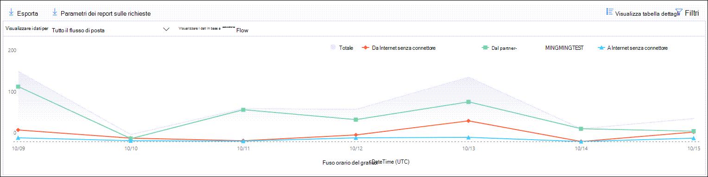

# Visualizzare i report sul flusso di posta nel dashboard report nel centro sicurezza & Compliance

Oltre ai rapporti sul flusso di posta disponibili nel [Dashboard del flusso](mail-flow-insights-v2.md) di posta elettronica nel centro sicurezza & Compliance, nel dashboard report sono disponibili numerosi rapporti di flusso di posta aggiuntivi che consentono di monitorare l'organizzazione Microsoft 365.

Se si dispone delle [autorizzazioni necessarie](#what-permissions-are-needed-to-view-these-reports), è possibile visualizzare i report nel [Centro sicurezza & Compliance](https://office.protection.com) accedendo al **Reports** \> **Dashboard**report. Per accedere direttamente al dashboard dei report, aprire <https://office.protection.office.com/insightdashboard> .

## Rapporto connettore

Il **rapporto connettore** consente di visualizzare l'attività del flusso di posta sui [connettori in ingresso e in uscita](https://docs.microsoft.com/Exchange/mail-flow-best-practices/use-connectors-to-configure-mail-flow/use-connectors-to-configure-mail-flow) configurati per l'organizzazione.

Per visualizzare il report, aprire il [Centro sicurezza & conformità](https://protection.office.com), accedere al **Reports** \> **Dashboard** dei report e selezionare il **report del connettore**. Per passare direttamente al report, aprire <https://protection.office.com/reportv2?id=ConnectorReport> .

### Visualizzazione report per il report del connettore

Nella visualizzazione report sono disponibili i grafici seguenti:

- **Visualizzazione dei dati per: flusso di posta**: questo grafico mostra il numero di messaggi in ingresso e in uscita organizzati da:

  - **Totale**
  - **Da Internet senza connettore**
  - **A Internet senza un connettore**
  - Connettore specifico configurato.
  
  Per isolare i dati nel grafico, utilizzare la casella di controllo **Mostra dati per** selezionare una di queste opzioni o **tutto il flusso di posta**.

  

- **Visualizzare i dati in base a: utilizzo TLS**: questo grafico mostra la percentuale di utilizzo della versione TLS (Transport Layer Security) per il flusso di posta.

  Per isolare i dati nel grafico, utilizzare il controllo **Mostra dati per** selezionare una delle opzioni seguenti:

  - **Tutto il flusso di posta**
  - **Da Internet senza connettore**
  - **A Internet senza un connettore**
  - Connettore specifico configurato.

  

Se si fa clic su **filtri** in una visualizzazione report, è possibile specificare un intervallo di date con data di **inizio** e **Data di fine**.

### Visualizzazione della tabella dei dettagli per il report del connettore

Se si fa clic su **Visualizza tabella dettagli** in una visualizzazione report, vengono visualizzate le informazioni seguenti:

- **Data**
- **Direzione e nome del connettore**
- **Tipo di connettore**
- **TLS forzato**: il valore **true** o **false**.
- **Nessun TLS** (percentuale)
- **TLS 1,0** (percentuale)
- **TLS 1,1** (percentuale)
- **TLS 1,2** (percentuale)
- **Volume**: il numero di messaggi.

Se si fa clic su **filtri** in una visualizzazione tabella dettagli, è possibile specificare un intervallo di date con data di **inizio** e **Data di fine**.

Per tornare alla visualizzazione report, fare clic su **Visualizza report**.

## Rapporto delle regole di trasporto di Exchange

Il **rapporto della regola di trasporto di Exchange** indica l'effetto delle regole del flusso di posta (note anche come regole di trasporto) sui messaggi in arrivo e in uscita nell'organizzazione.

Per visualizzare il report, aprire il [Centro sicurezza & conformità](https://protection.office.com), accedere al **Reports** \> **Dashboard** dei report e selezionare **regola di trasporto di Exchange**. Per passare direttamente al report, aprire <https://protection.office.com/reportv2?id=ETRRuleReport> .

### Visualizzazione report per il rapporto delle regole di trasporto di Exchange

Nella visualizzazione report sono disponibili i grafici seguenti:

- **Visualizzare i dati in base a: regole** \> di trasporto di Exchange **Scomposizione per: direzione**: questo grafico indica il numero di messaggi in **ingresso** e in **uscita** che sono stati interessati dalle regole di trasporto.

- **Visualizzare i dati in base a: regole** \> di trasporto di Exchange **Scomposizione in base a: gravità**: questo grafico Visualizza il numero di severità **elevata** e di gravità **media**e messaggi di **gravità insufficienti** . È possibile impostare il livello di gravità come azione nella regola (**controllare questa regola con livello di gravità** o _SetAuditSeverity_). Per ulteriori informazioni, vedere [azioni delle regole del flusso di posta in Exchange Online](https://docs.microsoft.com//Exchange/security-and-compliance/mail-flow-rules/mail-flow-rule-actions).

- **Visualizzare i dati in base a: regole di trasporto di Exchange DLP** \> **Scomposizione per: Direction**: questo grafico indica il numero di messaggi in **ingresso** e in **uscita** che sono stati interessati dalle regole di trasporto di prevenzione della perdita di dati (DLP). È possibile affinare ulteriormente il grafico selezionando le opzioni seguenti:

  - **Mostra dati per: tutte le regole di trasporto DLP**
  - **Visualizzare i dati per: utenti compromessi**
  - **Mostra dati per: basso volume di contenuto rilevato US Patriot Act**

- **Visualizzare i dati in base a: regole di trasporto di Exchange DLP** \> **Suddividi in base a: Direction**: questa visualizzazione Mostra il numero di gravità **elevata** e di gravità **media**e i messaggi a **bassa severità** che sono stati interessati dalle regole di trasporto DLP. È possibile affinare ulteriormente il grafico selezionando le opzioni seguenti:

  - **Mostra dati per: tutte le regole di trasporto DLP**
  - **Visualizzare i dati per: utenti compromessi**
  - **Mostra dati per: basso volume di contenuto rilevato US Patriot Act**

Se si fa clic su **filtri** in una visualizzazione report, è possibile modificare i risultati con i filtri seguenti:

- Data di **inizio** e **Data di fine**
- Valori di direzione
- Valori di gravità

### Visualizzazione della tabella dei dettagli per il rapporto delle regole di trasporto di Exchange

Se si fa clic su **Visualizza tabella dettagli**, le informazioni visualizzate dipendono dal grafico che si sta esaminando:

- **Visualizzare i dati per: regole di trasporto di Exchange**:

  - **Data**
  - **Regola di trasporto**
  - **Oggetto**
  - **Indirizzo del mittente**
  - **Indirizzo del destinatario**
  - **Gravità**
  - **Direzione**

- **Visualizzare i dati in base a: regole di trasporto di Exchange DLP**:

  - **Data**
  - **Criteri DLP**
  - **Regola di trasporto**
  - **Oggetto**
  - **Indirizzo del mittente**
  - **Indirizzo del destinatario**
  - **Gravità**
  - **Direzione**

Se si fa clic su **filtri** in una visualizzazione tabella dettagli, è possibile modificare i risultati con i filtri seguenti:

- Data di **inizio** e **Data di fine**
- Valori di direzione
- Valori di gravità

Per tornare alla visualizzazione report, fare clic su **Visualizza report**.

## Report di inoltro

Il **rapporto di inoltro** Visualizza i messaggi di inoltro automatico dell'organizzazione ai domini esterni dalle cassette postali di Exchange Online. I messaggi inoltrati possono rappresentare un rischio per la sicurezza o la conformità e potrebbero indicare un account compromesso.

Per visualizzare il report, aprire il [Centro sicurezza & conformità](https://protection.office.com), accedere al **Reports** \> **Dashboard** dei report e selezionare **Inoltra rapporto**. Per passare direttamente al report, aprire <https://protection.office.com/reportv2?id=MailFlowForwarding> .

### Visualizzazione report per il report di inoltro

Nella visualizzazione report sono disponibili i grafici seguenti:

- **Mostra dati per: metodi di inoltro**: vengono illustrati i metodi seguenti:

  - **Regola di trasporto**: nota anche come [regole del flusso di posta](https://docs.microsoft.com/Exchange/security-and-compliance/mail-flow-rules/mail-flow-rules).
  - **Regola della cassetta postale**: nota anche come [regole della posta in arrivo](https://support.microsoft.com/office/c24f5dea-9465-4df4-ad17-a50704d66c59).

  

- **Visualizzare i dati per: inoltrare i domini**: questa visualizzazione Mostra i domini destinatario che rappresentano le destinazioni per l'inoltro.

  

- **Mostra dati per: spedizionieri**: sono visualizzati i seguenti spedizionieri:

  - **Regola di trasporto**
  - La cassetta postale che contiene la regola di posta in arrivo di inoltro.

  

Se si fa clic su **filtri** in una visualizzazione report, è possibile specificare un intervallo di date con data di **inizio** e **Data di fine**.

### Visualizzazione della tabella dei dettagli per il report di inoltro

Se si fa clic su **Visualizza tabella dettagli** in una visualizzazione report, vengono visualizzate le informazioni seguenti:

- **Forwarders**: la **regola di trasporto** del valore o la cassetta postale che contiene la regola di posta in arrivo di inoltro.
- **Tipo di inoltro**: la regola della **cassetta postale** del valore o la **regola di trasporto**.
- **Nome del destinatario**
- **Dominio del destinatario**
- **Dettagli**: questo è il valore GUID della regola del flusso di posta oppure il valore RuleIdentity della regola di posta in arrivo.
- **Numero**
- **Prima data di inoltro**

Se si fa clic su **filtri** in una visualizzazione tabella dettagli, è possibile specificare un intervallo di date con data di **inizio** e **Data di fine**.

Per tornare alla visualizzazione report, fare clic su **Visualizza report**.

## Rapporto sullo stato del flusso di posta

La **relazione sullo stato del flusso** di posta è simile a quella [inviata e ricevuta](#sent-and-received-email-report), con ulteriori informazioni sulla posta elettronica consentita o bloccata sul server perimetrale. Questo è l'unico report che contiene informazioni sulla protezione dei dati perimetrali e visualizza la quantità di posta elettronica bloccata prima di essere consentita nel servizio per la valutazione da parte di Exchange Online Protection (EOP).

Per visualizzare il report, aprire il [Centro sicurezza & conformità](https://protection.office.com), accedere al **Reports** \> **Dashboard** dei report e selezionare **rapporto stato del flusso**di posta. Per passare direttamente alla **relazione sullo stato del flusso di posta**, aprire <https://protection.office.com/mailflowStatusReport> .

### Visualizzazione dei tipi per il rapporto sullo stato del flusso di posta

Quando si apre il report, la scheda **tipo** è selezionata per impostazione predefinita. Per impostazione predefinita, questa visualizzazione contiene un grafico e una tabella dati configurata con i filtri seguenti:

- **Data**: gli ultimi 7 giorni.
- **Direzione**:

  - **Inbound**
  - **In uscita**
  - **Intra-org** (conteggiati separatamente da in **ingresso** e in **uscita**)

- **Digitare**:

  - **Posta elettronica buona**
  - **Malware**
  - **Posta indesiderata**
  - **Protezione Edge**
  - **Messaggi delle regole**
  - **Posta di phishing**

Il grafico è organizzato in base ai valori del **tipo** .

È possibile modificare questi filtri facendo clic su **filtro** o facendo clic su un valore nella legenda del grafico.

La tabella dati contiene le informazioni seguenti:

- **Direzione**
- **Type**
- **24 ore**
- **3 giorni**
- **7 giorni**
- **15 giorni**
- **30 giorni**

Se si fa clic su **Scegli una categoria per maggiori dettagli**, è possibile selezionare uno dei seguenti valori:

- **Messaggio di posta elettronica di phishing**: questa opzione consente di eseguire il [rapporto sullo stato della protezione dalle minacce](view-email-security-reports.md#threat-protection-status-report).
- **Malware nella posta elettronica**: questa opzione consente di eseguire il [rapporto sullo stato della protezione dalle minacce](view-email-security-reports.md#threat-protection-status-report).
- **Rilevamenti di posta indesiderata**: questa selezione porta al [rapporto rilevamento posta indesiderata](view-email-security-reports.md#spam-detections-report).
- **Posta indesiderata bloccata da Edge**: questa selezione porta al [rapporto rilevamento posta indesiderata](view-email-security-reports.md#spam-detections-report).

**Esporta**:

Per la visualizzazione dettagli, è possibile esportare i dati solo per un giorno. Pertanto, se si desidera esportare i dati per 7 giorni, è necessario eseguire 7 operazioni di esportazione diverse.

Ogni file CSV esportato è limitato a 150.000 righe. Se i dati di quel giorno contengono più di 150.000 righe, verranno creati più file CSV.

### Visualizzazione direzione per il report sullo stato del flusso di posta

Se si fa clic sulla scheda **direzione** , vengono utilizzati gli stessi filtri predefiniti della visualizzazione **tipo** .

Il grafico è organizzato in base ai valori della **direzione** .

È possibile modificare questi filtri facendo clic su **filtro** o facendo clic su un valore nella legenda del grafico. Vengono utilizzati gli stessi filtri della visualizzazione **tipo** .

La tabella dati contiene le stesse informazioni dalla visualizzazione **tipo** .

**Scegliere una categoria per ulteriori dettagli** le selezioni e il comportamento disponibili sono uguali alla visualizzazione dei **tipi** .

**Esporta**:

Per la visualizzazione dettagli, è possibile esportare i dati solo per un giorno. Pertanto, se si desidera esportare i dati per 7 giorni, è necessario eseguire 7 operazioni di esportazione diverse.

Ogni file CSV esportato è limitato a 150.000 righe. Se i dati di quel giorno contengono più di 150.000 righe, verranno creati più file CSV.

## Report di posta elettronica inviati e ricevuti

Il rapporto **messaggi di posta elettronica inviati e ricevuti** è un report Smart che contiene informazioni sulla posta elettronica in arrivo e in uscita, inclusi i rilevamenti di posta indesiderata, il malware e la posta elettronica identificata come "buona". La differenza tra il report e il [rapporto sullo stato del flusso](#mailflow-status-report) di posta è: questo rapporto non include i dati relativi ai messaggi bloccati dalla protezione Edge.

La visualizzazione aggregazione e la visualizzazione dettagli del rapporto consentono 90 giorni di filtraggio.

Per visualizzare il report, aprire il [Centro sicurezza & conformità](https://protection.office.com), accedere al **Reports** \> **Dashboard** dei report e selezionare **invio e ricezione della posta elettronica**. Per passare direttamente al report, aprire <https://protection.office.com/reportv2?id=SentAndReceivedMailATP> .

### Visualizzazione report per il report di posta elettronica inviato e ricevuto

Nella visualizzazione report sono disponibili i grafici seguenti:

- **Scomposizione per: tipo**: il grafico Visualizza tutte le categorie disponibili:

  - **Totale**
  - **Posta elettronica buona**
  - **Malware (anti-malware)** (EOP)
  - **Rilevamenti di posta indesiderata**
  - **Messaggi delle regole**
  - **Malware avanzato** (Office 365 ATP)

  Quando si posiziona il puntatore del mouse su un giorno (punto dati) nel grafico, è possibile visualizzare i dettagli relativi a quel giorno.

  

- **Suddividi in base a: Direction**: il grafico Visualizza i dati **totali**, in **ingresso**e in **uscita** . Quando si posiziona il puntatore del mouse su un giorno (punto dati) nel grafico, è possibile visualizzare i dettagli relativi a quel giorno.

  

- **Drill-down** \> **Malware (anti-malware)**: questa selezione consente di rilevare i [rilevamenti di malware nel rapporto di posta elettronica](view-email-security-reports.md#malware-detections-in-email-report).

- **Drill-down** \> **Rilevamenti di posta indesiderata)**: questa selezione porta al [rapporto rilevamento posta indesiderata](view-email-security-reports.md#spam-detections-report).

Se si fa clic su **filtri** in una visualizzazione report, è possibile modificare i risultati con i filtri seguenti:

- Data di **inizio** e **Data di fine**
- Valori di direzione
- Valori dei tipi

Per tornare alla visualizzazione report, fare clic su **Visualizza report**.

### Visualizzazione della tabella dei dettagli per il report di posta elettronica inviato e ricevuto

Se si fa clic su **Visualizza tabella dettagli** nella visualizzazione **scomposizione per: direzione** o **scomposizione per: direzione** , vengono visualizzate le informazioni seguenti:

- **Data (UTC)**
- **Type**
- **Direzione**
- **Numero di messaggi**

Se si fa clic su **filtri** in una visualizzazione tabella dettagli, è possibile modificare i risultati con i filtri seguenti:

- Data di **inizio** e **Data di fine**
- Valori di direzione
- Valori dei tipi

Per tornare alla visualizzazione report, fare clic su **Visualizza report**.

## Report mittenti e destinatari principali

Il report **mittenti e destinatari principali** è un grafico a torta che mostra i mittenti e i destinatari di posta elettronica principali.

Per visualizzare il report, aprire il [Centro sicurezza & conformità](https://protection.office.com), accedere al **Reports** \> **Dashboard** dei report e selezionare i **mittenti e i destinatari principali**. Per passare direttamente al report, aprire <https://protection.office.com/reportv2?id=TopSenderRecipientsATP> .

### Visualizzazione report per i principali mittenti e report dei destinatari

Nella visualizzazione report sono disponibili i grafici seguenti:

- **Visualizzare i dati per i \> mittenti di posta principali**
- **Visualizzare i dati per i \> destinatari di posta elettronica principali**
- **Visualizzare i dati per i \> destinatari di posta indesiderata principali**
- **Visualizzare i dati per \> Destinatari principali di malware** (EOP)
- **Visualizzare i dati per \> Top malware Recipients (ATP)** (Office 365 ATP)

La composizione del grafico a torta cambia in base a queste selezioni.

Quando si posiziona il puntatore del mouse su un cuneo nel grafico a torta, è possibile visualizzare il numero di messaggi inviati o ricevuti.

Se si fa clic su **filtri** in una visualizzazione report, è possibile specificare un intervallo di date con data di **inizio** e **Data di fine**.

### Visualizzazione della tabella Details per i mittenti principali e il report dei destinatari

Se si fa clic su **Visualizza tabella dettagli**, le informazioni visualizzate dipendono dal grafico che si sta esaminando:

- **Visualizzare i dati per i \> mittenti di posta principali**

  - **Mittenti di posta principali**
  - **Numero**

- **Visualizzare i dati per i \> destinatari di posta elettronica principali**

  - **Destinatari della posta principale**
  - **Numero**

- **Visualizzare i dati per i \> destinatari di posta indesiderata principali**

  - **Destinatari principali di posta indesiderata**
  - **Numero**

- **Visualizzare i dati per \> Destinatari principali di malware** (EOP)

  - **Destinatari principali di malware**
  - **Numero**

- **Visualizzare i dati per \> Top malware Recipients (ATP)** (Office 365 ATP)

  - **Destinatari principali di malware (ATP)**
  - **Numero**

Se si fa clic su **filtri** in una visualizzazione tabella dettagli, è possibile specificare un intervallo di date con data di **inizio** e **Data di fine**.

Per tornare alla visualizzazione report, fare clic su **Visualizza report**.

## Quali autorizzazioni sono necessarie per visualizzare i rapporti?

Per visualizzare e utilizzare i report, è necessario essere membri del gruppo di ruoli specificato nel centro sicurezza & conformità **e** in Exchange Online.

- Nel centro sicurezza & conformità è necessario essere membri di uno dei gruppi di ruoli seguenti:

  -Organization Management-Security Administrator (è possibile farlo anche nell'interfaccia di [amministrazione di Azure Active Directory](https://aad.portal.azure.com) -Security Reader

  Per altre informazioni, vedere [Autorizzazioni nel Centro sicurezza e conformità](https://docs.microsoft.com/microsoft-365/security/office-365-security/permissions-in-the-security-and-compliance-center).

- In Exchange Online, è necessario essere membri di uno dei gruppi di ruoli seguenti:

  -Gestione organizzazione-solo visualizzazione organizzazione-destinatari di sola visualizzazione-gestione della conformità

Per ulteriori informazioni, vedere [autorizzazioni in Exchange Online](https://docs.microsoft.com/Exchange/permissions-exo/permissions-exo) e [gestire i gruppi di ruoli in Exchange Online](https://docs.microsoft.com/Exchange/permissions-exo/role-groups).

## Argomenti correlati

[Report intelligenti e informazioni dettagliate nel Centro sicurezza e conformità](reports-and-insights-in-security-and-compliance.md)

[Approfondimenti sul flusso di posta nel Centro sicurezza e conformità](mail-flow-insights-v2.md)

[Visualizzare i report sulla sicurezza della posta elettronica nel Centro sicurezza e conformità](view-email-security-reports.md)

[Visualizzare i report per Office 365 Advanced Threat Protection](view-reports-for-atp.md)
