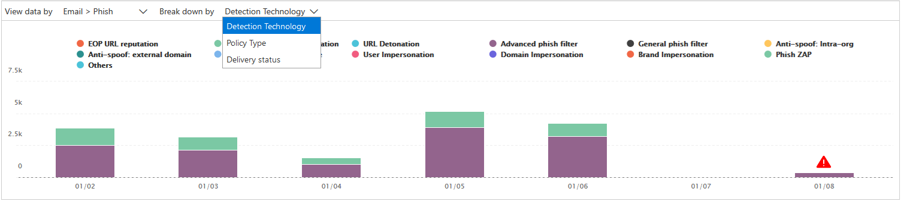

# Visualizzare i report per Office 365 Advanced Threat ProtectionView reports for Office 365 Advanced Threat Protection

Se l'organizzazione dispone di [Office 365 Advanced Threat Protection](office-365-atp.md) (ATP) ed è necessario disporre delle [autorizzazioni necessarie](#what-permissions-are-needed-to-view-the-atp-reports), è possibile utilizzare diversi rapporti ATP nel &amp; Centro sicurezza e conformità.If your organization has [Office 365 Advanced Threat Protection](office-365-atp.md) (ATP) and you have the [necessary permissions](#what-permissions-are-needed-to-view-the-atp-reports), you can use several ATP reports in the Security &amp; Compliance Center. (Andare al **Reports** \> **Dashboard**di report).(Go to **Reports** \> **Dashboard**.)

I report ATP includono quanto segue:ATP reports include the following:

- [Report dello stato di protezione dalle minacceThreat Protection Status report](#threat-protection-status-report)
- [Report dei tipi di file di ATPATP File Types report](#atp-file-types-report)
- [Report della gestione dei messaggi di ATPATP Message Disposition report](#atp-message-disposition-report)
- [rilevamenti o esploratori in tempo reale](threat-explorer.md) (a seconda che si disponga di Office 365 ATP piano 1 o 2)either [real-time detections or Explorer](threat-explorer.md) (depending on whether you have Office 365 ATP Plan 1 or 2)
- ... [e altro ancora](#additional-reports-to-view).... [and more](#additional-reports-to-view).

Leggere questo articolo per ottenere una panoramica dei rapporti ATP e su come usarli.Read this article to get an overview of ATP reports and how to use them.

## Report dello stato di protezione dalle minacceThreat Protection Status report

Il rapporto **sullo stato della protezione dalle minacce** è una singola visualizzazione che raggruppa informazioni su contenuto dannoso e messaggi di posta elettronica dannosi rilevati e bloccati da [Exchange Online Protection](exchange-online-protection-overview.md) (EOP) e [Office 365 ATP](office-365-atp.md).The **Threat Protection Status** report is a single view that brings together information about malicious content and malicious email detected and blocked by [Exchange Online Protection](exchange-online-protection-overview.md) (EOP) and [Office 365 ATP](office-365-atp.md). Questo report è utile per la visualizzazione di rilevamenti nel tempo (fino a 90 giorni) e consente agli amministratori della sicurezza di identificare le tendenze o determinare se i criteri devono essere adattati.This report is useful for viewing detections over time (up to 90 days), and it enables security administrators to identify trends or determine whether policies need adjustments.

Il rapporto fornisce un numero aggregato di messaggi di posta elettronica univoci con contenuti dannosi, ad esempio i file o gli indirizzi del sito Web (URL) bloccati dal motore antimalware, da [zero-hour auto Purge (ZAP)](zero-hour-auto-purge.md)e dalle caratteristiche ATP come i [collegamenti sicuri](atp-safe-links.md)di ATP, gli [allegati sicuri di ATP](atp-safe-attachments.md)e il servizio [antiphishing ATP](set-up-anti-phishing-policies.md).The report provides an aggregated count of unique email messages with malicious content, such as files or website addresses (URLs) that were blocked by the anti-malware engine, [zero-hour auto purge (ZAP)](zero-hour-auto-purge.md), and ATP features like [ATP Safe Links](atp-safe-links.md), [ATP Safe Attachments](atp-safe-attachments.md), and [ATP anti-phishing](set-up-anti-phishing-policies.md).

I filtri e i guasti delle informazioni consentono la categorizzazione più granulare delle informazioni contenute nel rapporto.Filters and breakdowns of the information allow for more granular categorizations of the information in this report. In particolare, è presente un menu ' Break Down by ' incluso per la **posta elettronica** \> **phishing** e le **visualizzazioni malware**per la **posta elettronica** \> .Specifically, there is a 'break down by' menu included for **Email** \> **Phish** and **Email** \> **Malware views**. I dati verranno suddivisi in:It will break down the data into:

|||
|---|---|
|In base al tipo di rilevamentoBy detection type|Quali criteri hanno consentito di intercettare tali minacce?What policy helped catch these threats?|
|Tramite la tecnologia di rilevamentoBy detection technology|La tecnologia Microsoft sottostante ha rilevato la minaccia?What underlying Microsoft technology caught the threat?|
|In base allo stato di recapitoBy delivery status|Che cosa è successo ai messaggi di posta elettronica rilevati come minacce?What happened to the email messages detected as threats?|
|

> [!TIP]
> Sia la > di posta elettronica phishing | Le visualizzazioni di malware presentano guasti granulari per le tecnologie di rilevamento mostrate, con categorie come la *reputazione dei file generati da ATP*, la *detonazione dei file*, la *detonazione degli URL*, l' *anti-spoofing: errore DMARC*, ad esempio, utili per individuare esattamente quale caratteristica ha portato la propria organizzazione a rilevare le minacce.Both the Email > Phish | Malware views have granular breakdowns for the detection technologies shown, with categories like *ATP-generated file reputation*, *File detonation*, *URL detonation*, *Anti-spoof: DMARC failure*, for example, helpful in pinpointing exactly which feature led your organization to catch threats.

Queste visualizzazioni offrono la possibilità di esportare, tramite un clic su un pulsante (in > di posta elettronica phishing, posta elettronica > malware e contenuto > visualizzazioni malware).These views give you the option to export, via a button click (in Email > Phish, Email > Malware, and Content > Malware views). I dati aggregati esportati nel computer possono essere aperti in Excel.The aggregated data exported to your computer can be opened in Excel.

Le visualizzazioni panoramica e messaggi di posta elettronica visualizzano le informazioni entro le ore successive all'elaborazione anziché entro 24 ore (demand re.The Overview and Emails views will display information within hours of processing rather than in 24 hours (demand re. velocità maggiore qui è stato un segnale chiaro)!increased speeds here has been a clear signal)!

> [!NOTE]
> Un rapporto sullo stato della protezione dalle minacce è disponibile per i clienti che dispongono di [Office 365 ATP](office-365-atp.md) o [Exchange Online Protection](exchange-online-protection-eop.md) (EOP); Tuttavia, le informazioni visualizzate nel rapporto sullo stato di protezione di minacce per i clienti ATP probabilmente conterranno dati diversi da quelli che potrebbero essere visualizzati dai clienti di EOP.A Threat Protection Status report is available to customers who have either [Office 365 ATP](office-365-atp.md) or [Exchange Online Protection](exchange-online-protection-eop.md) (EOP); however, the information that is displayed in the Threat Protection Status report for ATP customers will likely contain different data than what EOP customers might see. Ad esempio, il rapporto sullo stato della protezione dalle minacce per i clienti ATP conterrà informazioni sui [file dannosi rilevati in SharePoint Online, OneDrive o Microsoft teams](atp-for-spo-odb-and-teams.md).For example, the Threat Protection Status report for ATP customers will contain information about [malicious files detected in SharePoint Online, OneDrive, or Microsoft Teams](atp-for-spo-odb-and-teams.md). Tali informazioni sono specifiche di ATP, quindi i clienti che hanno EOP ma non ATP non vedranno tali dettagli nella loro relazione sullo stato di protezione dalle minacce.Such information is specific to ATP, so customers who have EOP but not ATP will not see those details in their Threat Protection Status report.

Per visualizzare il rapporto sullo stato di protezione dalle minacce, nel [Centro sicurezza &amp; e conformità](https://protection.office.com), accedere a **segnala** \> **Dashboard** \> **lo stato di protezione delle minacce**del dashboard.To view the Threat Protection Status report, in the [Security &amp; Compliance Center](https://protection.office.com), go to **Reports** \> **Dashboard** \> **Threat Protection Status**.

Per ottenere lo stato dettagliato per un giorno, posizionare il puntatore del mouse sul grafico.To get detailed status for a day, hover over the graph.

Per impostazione predefinita, il rapporto sullo stato della protezione dalle minacce Visualizza i dati negli ultimi sette giorni.By default, the Threat Protection Status report shows data for the past seven days. Tuttavia, è possibile scegliere **filtri** e modificare l'intervallo di date per visualizzare i dati fino a 90 giorni.However, you can choose **Filters** and change the date range to view data for up to 90 days. Se si utilizza un abbonamento di valutazione, potrebbe essere limitato a 30 giorni di dati.(If you are using a trial subscription, you might be limited to 30 days' of data.)

È inoltre possibile utilizzare il menu **Visualizza dati in base** a per modificare le informazioni visualizzate nel report.You can also use the **View data by** menu to change what information is displayed in the report.

## Rapporto sullo stato di protezione URLURL Protection Status report

Questo rapporto è basato sui dati raccolti e sui rischi rilevati, per clic (mentre la maggior parte dei rapporti correlati alla minaccia di posta elettronica sono per i dati del messaggio).This report is based data collected, and threats detected, per click (whereas most other email threat related reports are per message data). Questo report è stato creato per mostrare minacce provenienti da collegamenti ipertestuali nei messaggi di posta elettronica e nei documenti, per clic.This report is designed to show threats that come from hyperlinks in email messages and documents, per click. Sono disponibili due visualizzazioni:There are two views:

|||
|---|---|
|Azione di protezione dell'URL fare clic suURL click protection action|Vedere il numero di URL bloccati, bloccati ma ignorati con un clic da un utente, ignorati con un clic da un utente e consentiti.See the number of URLs blocked, blocked but overridden with a click-through by a user, overridden with a click-through by a user, and allowed.|
|URL fare clic su applicazioneURL click by application|Vedere l'applicazione da cui è stato fatto clic sull'URL.See the application from which the URL was clicked.|
|

Nella tabella Details, è possibile visualizzare ulteriori informazioni su informazioni sui tempi e sugli utenti di clic.In the details table, you'll be able to see more information regarding click time and user information. Infine, tenere presente che il rapporto sullo stato di protezione URL Mostra la caratteristica protezione dalla funzionalità collegamenti sicuri ATP, quindi solo i clienti che hanno abilitato i collegamenti sicuri di ATP vedranno i dati riportati in questo report.Finally, keep in mind the URL Protection Status report shows the protection from ATP Safe Links feature, so only customers who have enabled ATP Safe Links will see data reflected on this report.

> [!NOTE]
> Si tratta di un *report di tendenza di protezione*, in cui i dati rappresentano le tendenze di un DataSet più grande.This is a *protection trend report*, meaning data represents trends in a larger dataset. La creazione di report non è disponibile in tempo reale.Reporting isn't available in real time here. Per l'URL in tempo reale, fare clic su dati, continuare a utilizzare la traccia URL.For real time URL click data, please continue to use URL Trace.

## Report dei tipi di file di ATPATP File Types report

Il rapporto **tipi di file ATP** Visualizza il tipo di file rilevati come dannosi dagli [allegati sicuri di ATP](atp-safe-attachments.md).The **ATP File Types** report shows you the type of files detected as malicious by [ATP Safe Attachments](atp-safe-attachments.md).

Per visualizzare questo report, nel [Centro sicurezza &amp; e conformità](https://protection.office.com), accedere a **Reports** \> **Dashboard** \> **ATP types**.To view this report, in the [Security &amp; Compliance Center](https://protection.office.com), go to **Reports** \> **Dashboard** \> **ATP File Types**.

Quando si posiziona il puntatore del mouse su un determinato giorno, è possibile visualizzare la ripartizione dei tipi di file dannosi rilevati dagli [allegati sicuri ATP](atp-safe-attachments.md) e dalla [protezione anti-malware antispamming &amp; in Office 365](anti-spam-and-anti-malware-protection.md).When you hover over a particular day, you can see the breakdown of types of malicious files that were detected by [ATP Safe Attachments](atp-safe-attachments.md) and [anti-spam &amp; anti-malware protection in Office 365](anti-spam-and-anti-malware-protection.md).

## Report della gestione dei messaggi di ATPATP Message Disposition report

Il rapporto di **disposizione dei messaggi ATP** indica le azioni eseguite per i messaggi di posta elettronica rilevati come contenuti dannosi.The **ATP Message Disposition** report shows you the actions that were taken for email messages that were detected as having malicious content.

Per visualizzare questo report, nel [Centro sicurezza &amp; e conformità](https://protection.office.com), accedere a **disposizione dei messaggi**per il **Dashboard** \> dei **report** \> ATP.To view this report, in the [Security &amp; Compliance Center](https://protection.office.com), go to **Reports** \> **Dashboard** \> **ATP Message Disposition**.

Quando si posiziona il puntatore del mouse su una barra del grafico, è possibile vedere quali azioni sono state eseguite per il messaggio di posta elettronica rilevato per quel giorno.When you hover over a bar in the chart, you can see what actions were taken for detected email for that day.

## Report aggiuntivi da visualizzareAdditional reports to view

Oltre ai report ATP descritti in questo articolo, sono disponibili diversi altri report, come descritto nella tabella seguente:In addition to the ATP reports described in this article, several other reports are available, as described in the following table:

|||
|---|---|
|**Report (s)****Report(s)**|**Dettagli****Details**|
|**Esploratori** o **rilevamenti in tempo reale**: (i clienti di Office 365 trifosfato di adenosina piano 2 hanno Esplora risorse; I clienti di Office 365 ATP Plan 1 dispongono di rilevamenti in tempo reale.**Explorer** or **real-time detections**: (Office 365 ATP Plan 2 customers have Explorer; Office 365 ATP Plan 1 customers have real-time detections.)|[Esplora minacce (e rilevamenti in tempo reale)Threat Explorer (and real-time detections)](threat-explorer.md)|
|Report di **protezione della posta elettronica**, ad esempio un report mittenti e destinatari principali, un report di posta indesiderata e un report di rilevamenti di spam.**Email security reports**, such as a Top Senders and Recipients report, a Spoof Mail report, and a Spam Detections report.|[Visualizzare i report sulla sicurezza della posta &amp; elettronica nel centro sicurezza e conformitàView email security reports in the Security &amp; Compliance Center](view-email-security-reports.md)|
|**Traccia URL collegamenti sicuri ATP**: (si tratta di un report generato tramite PowerShell). Questo rapporto illustra i risultati delle azioni di collegamenti sicuri ATP negli ultimi sette (7) giorni.**ATP Safe Links URL trace**: (This is a report you generate by using PowerShell.) This report shows the results of ATP Safe Links actions over the past seven (7) days.|[Informazioni di riferimento sui cmdlet Get-UrlTraceGet-UrlTrace cmdlet reference](https://docs.microsoft.com/powershell/module/exchange/advanced-threat-protection/get-urltrace)|
|**Risultati di EOP e ATP**: (questo è un report personalizzato che viene generato tramite PowerShell).**EOP and ATP results**: (This is a custom report you generate by using PowerShell). Questo report contiene informazioni, ad esempio dominio, data, tipo di evento, direzione, azione e numero di messaggi.This report contains information, such as Domain, Date, Event Type, Direction, Action, and Message Count.|[Informazioni di riferimento sui cmdlet Get-MailTrafficATPReportGet-MailTrafficATPReport cmdlet reference](https://docs.microsoft.com/powershell/module/exchange/advanced-threat-protection/get-mailtrafficatpreport)|
|**Rilevamenti di EOP e ATP**: (questo è un report personalizzato che viene generato tramite PowerShell).**EOP and ATP detections**: (This is a custom report you generate by using PowerShell). Questo report contiene informazioni dettagliate su file o URL dannosi, tentativi di phishing, rappresentazione e altre potenziali minacce nei messaggi di posta elettronica o nei file.This report contains details about malicious files or URLs, phishing attempts, impersonation, and other potential threats in email or files.|[Informazioni di riferimento sui cmdlet Get-MailDetailATPReportGet-MailDetailATPReport cmdlet reference](https://docs.microsoft.com/powershell/module/exchange/advanced-threat-protection/get-maildetailatpreport)|
|

## Quali autorizzazioni sono necessarie per visualizzare i report ATP?What permissions are needed to view the ATP reports?

Per visualizzare e utilizzare i rapporti descritti in questo articolo, **è necessario disporre di un ruolo appropriato assegnato per il Centro sicurezza &amp; e l'interfaccia di amministrazione di Exchange**.In order to view and use the reports described in this article, **you must have an appropriate role assigned for both the Security &amp; Compliance Center and the Exchange admin center**.

- Per il centro &amp; sicurezza e conformità, è necessario che sia assegnato uno dei ruoli seguenti:For the Security &amp; Compliance Center, you must have one of the following roles assigned:

  - Gestione organizzazioneOrganization Management
  - Amministratore della sicurezza (è possibile assegnarlo nell'interfaccia di amministrazione di Azure Active[https://aad.portal.azure.com](https://aad.portal.azure.com)directory ())Security Administrator (this can be assigned in the Azure Active Directory admin center ([https://aad.portal.azure.com](https://aad.portal.azure.com)))
  - Operatore di sicurezza (che può essere assegnato nell'interfaccia di amministrazione di Azure Active[https://aad.portal.azure.com](https://aad.portal.azure.com)directory ())Security Operator (this can be assigned in the Azure Active Directory admin center ([https://aad.portal.azure.com](https://aad.portal.azure.com)))
  - Ruolo con autorizzazioni di lettura per la sicurezzaSecurity Reader

- Per Exchange Online, è necessario che sia assegnato uno dei ruoli seguenti nell'interfaccia di amministrazione di Exchange ([https://outlook.office365.com/ecp](https://outlook.office365.com/ecp)) o con i cmdlet di PowerShell (vedere [Exchange Online PowerShell](https://docs.microsoft.com/powershell/exchange/exchange-online/exchange-online-powershell)):For Exchange Online, you must have one of the following roles assigned in either the Exchange admin center ([https://outlook.office365.com/ecp](https://outlook.office365.com/ecp)) or with PowerShell cmdlets (See [Exchange Online PowerShell](https://docs.microsoft.com/powershell/exchange/exchange-online/exchange-online-powershell)):

  - Gestione organizzazioneOrganization Management
  - Gestione organizzazione in sola visualizzazioneView-only Organization Management
  - Ruolo Destinatari di sola letturaView-Only Recipients role
  - Gestione della conformitàCompliance Management

Per altre informazioni, vedere le risorse seguenti:To learn more, see the following resources:

- [Permissions in the Office 365 Security &amp; Compliance CenterPermissions in the Office 365 Security &amp; Compliance Center](permissions-in-the-security-and-compliance-center.md)

- [Autorizzazioni funzionalità in Exchange OnlineFeature permissions in Exchange Online](https://docs.microsoft.com/exchange/permissions-exo/feature-permissions)

## Cosa succede se i rapporti non mostrano dati?What if the reports aren't showing data?

Se i dati non vengono visualizzati nei rapporti ATP, verificare che i criteri siano configurati correttamente.If you are not seeing data in your ATP reports, double-check that your policies are set up correctly. L'organizzazione deve disporre di [criteri dei collegamenti sicuri ATP](set-up-atp-safe-links-policies.md) e di criteri per gli [allegati sicuri ATP](set-up-atp-safe-attachments-policies.md) definiti in modo che la protezione da ATP sia sul posto.Your organization must have [ATP Safe Links policies](set-up-atp-safe-links-policies.md) and [ATP Safe Attachments policies](set-up-atp-safe-attachments-policies.md) defined in order for ATP protection to be in place. Vedere anche [protezione da posta indesiderata e anti-malware in Office 365](anti-spam-and-anti-malware-protection.md).Also see [Anti-spam and anti-malware protection in Office 365](anti-spam-and-anti-malware-protection.md).

## Argomenti correlatiRelated topics

[Report e informazioni dettagliate nel centro sicurezza &amp; e conformità di Office 365Reports and insights in the Office 365 Security &amp; Compliance Center](reports-and-insights-in-security-and-compliance.md)

[Creare una pianificazione per un report nel centro sicurezza &amp; e conformitàCreate a schedule for a report in the Security &amp; Compliance Center](create-a-schedule-for-a-report.md)

[Configurare e scaricare un report personalizzato nel centro sicurezza &amp; e conformitàSet up and download a custom report in the Security &amp; Compliance Center](set-up-and-download-a-custom-report.md)

[Autorizzazioni ruolo (Azure Active DirectoryRole permissions (Azure Active Directory](https://docs.microsoft.com/azure/active-directory/users-groups-roles/directory-assign-admin-roles#role-permissions)
