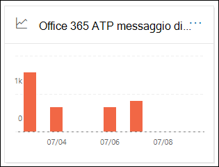

# Visualizzare i report di Defender per Office 365 nel dashboard dei report nel centro sicurezza & ComplianceView Defender for Office 365 reports in the Reports dashboard in the Security & Compliance Center

[!INCLUDE [Microsoft 365 Defender rebranding](../includes/microsoft-defender-for-office.md)]

Microsoft Defender per le organizzazioni di Office 365 (ad esempio, abbonamenti Microsoft 365 E5 o Microsoft Defender per Office 365 piano 1 o Microsoft Defender per Office 365 piano 2 componenti aggiuntivi) contengono una serie di rapporti relativi alla sicurezza.Microsoft Defender for Office 365 organizations (for example, Microsoft 365 E5 subscriptions or Microsoft Defender for Office 365 Plan 1 or Microsoft Defender for Office 365 Plan 2 add-ons) contain a variety of security-related reports. Se si dispone delle [autorizzazioni necessarie](#what-permissions-are-needed-to-view-the-defender-for-office-365-reports), è possibile visualizzare i report nel centro sicurezza & Compliance accedendo al  \> **Dashboard** report.If you have the [necessary permissions](#what-permissions-are-needed-to-view-the-defender-for-office-365-reports), you can view these reports in the Security & Compliance Center by going to **Reports** \> **Dashboard**. Per accedere direttamente al dashboard dei report, aprire <https://protection.office.com/insightdashboard> .To go directly to the Reports dashboard, open <https://protection.office.com/insightdashboard>.

## Report tipi di file per Defender per Office 365Defender for Office 365 file types report

Il report del **rapporto tipi di file di Defender per Office 365** Visualizza il tipo di file rilevati come dannosi per gli [allegati sicuri](atp-safe-attachments.md).The **Defender for Office 365 file types report** report shows you the type of files detected as malicious by [Safe Attachments](atp-safe-attachments.md).

 La visualizzazione aggregazione del report consente 90 giorni di filtraggio, mentre la visualizzazione dettagli consente solo 10 giorni di filtraggio.The aggregate view of the report allows for 90 days of filtering, while the detail view only allows for 10 days of filtering.

Per visualizzare il report, aprire il [Centro sicurezza & conformità](https://protection.office.com), accedere al  \> **Dashboard** dei report e selezionare **Defender per i tipi di file di Office 365**.To view the report, open the [Security & Compliance Center](https://protection.office.com), go to **Reports** \> **Dashboard** and select **Defender for Office 365 file types**. Per passare direttamente al report, aprire <https://protection.office.com/reportv2?id=ATPFileReport> .To go directly to the report, open <https://protection.office.com/reportv2?id=ATPFileReport>.

> [!NOTE]
> Le informazioni contenute in questo report sono disponibili anche nel [rapporto disposizione dei messaggi di Defender per Office 365](#defender-for-office-365-message-disposition-report).The information in this report is also available in the [Defender for Office 365 message disposition report](#defender-for-office-365-message-disposition-report).

### Visualizzazione report per il report dei tipi di file del difensore per Office 365Report view for the Defender for Office 365 file types report

Sono disponibili le visualizzazioni seguenti:The following views are available:

- **Visualizzare i dati per: file**: il grafico contiene le informazioni seguenti:**View data by: File**: The chart contains the following information:

  - **Allegati di Excel dannosi****Malicious Excel attachments**
  - **Allegati Flash dannosi****Malicious Flash attachments**
  - **Allegati PDF dannosi****Malicious PDF attachments**
  - **Allegati di PowerPoint dannosi****Malicious PowerPoint attachments**
  - **URL dannosi****Malicious URLs**
  - **Allegati di Word dannosi****Malicious Word attachments**
  - **Allegati eseguibili dannosi****Malicious executable attachments**
  - **Altri****Others**

  Quando si posiziona il puntatore del mouse su un determinato giorno (punto dati), è possibile visualizzare la ripartizione dei tipi di file dannosi rilevati dagli [allegati sicuri](atp-safe-attachments.md) e dalla [protezione antimalware in EOP](anti-malware-protection.md).When you hover over a particular day (data point), you can see the breakdown of types of malicious files that were detected by [Safe Attachments](atp-safe-attachments.md) and [anti-malware protection in EOP](anti-malware-protection.md).

  

  Se si fa clic su **filtri**, è possibile modificare il report con i filtri seguenti:If you click **Filters**, you can modify the report with the following filters:

  - Data di **inizio** e **Data di fine****Start date** and **End date**
  - Gli stessi valori del tipo di file che sono visibili nel grafico.The same file type values that are visible in the chart.

- **Visualizzazione dei dati per: messaggio**: il grafico contiene le informazioni seguenti:**View data by: Message**: The chart contains the following information:

  - **Blocca accesso****Block access**
  - **Messaggi sostituiti****Messages replaced**
  - **Messaggi monitorati****Messages monitored**
  - **Sostituito dal recapito dinamico della posta elettronica**: per ulteriori informazioni, vedere [Dynamic Delivery in Safe Attachment Policies](atp-safe-attachments.md#dynamic-delivery-in-safe-attachments-policies).**Replaced by Dynamic Email Delivery**: For more information, see [Dynamic Delivery in Safe Attachments policies](atp-safe-attachments.md#dynamic-delivery-in-safe-attachments-policies).

  

  Se si fa clic su **filtri**, è possibile modificare il report con i filtri seguenti:If you click **Filters**, you can modify the report with the following filters:

  - Data di **inizio** e **Data di fine****Start date** and **End date**
  - Gli stessi valori di disposizione del messaggio che sono disponibili nel grafico e i messaggi aggiuntivi che hanno **superato** il valore.The same message disposition values that are available in the chart, and the additional **Messages passed** value.

### Visualizzazione della tabella dei dettagli per il report sui tipi di file del Defender per Office 365Details table view for the Defender for Office 365 file types report

Se si fa clic su **Visualizza tabella dettagli**, il rapporto fornisce una visualizzazione quasi in tempo reale di tutti i clic che si verificano all'interno dell'organizzazione negli ultimi 10 giorni.If you click **View details table**, the report provides a near-real-time view of all clicks that happen within the organization for the last 10 days. Le informazioni visualizzate dipendono dal grafico che si sta esaminando:The information that's shown depends on the chart you were looking at:

- **Visualizzare i dati in base a: file**:**View data by: File**:

  - **Data****Date**
  - **Indirizzo del destinatario****Recipient address**
  - **Indirizzo del mittente****Sender address**
  - **ID messaggio**: disponibile nel campo di intestazione **Message-ID** nell'intestazione del messaggio e deve essere univoco.**Message ID**: Available in the **Message-ID** header field in the message header and should be unique. Un valore di esempio è `<08f1e0f6806a47b4ac103961109ae6ef@server.domain>` (si notino le parentesi angolari).An example value is `<08f1e0f6806a47b4ac103961109ae6ef@server.domain>` (note the angle brackets).
  - **File****File**

  Se si fa clic su **filtri**, è possibile modificare il report con i filtri seguenti:If you click **Filters**, you can modify the report with the following filters:

  - Data di **inizio** e **Data di fine****Start date** and **End date**
  - Gli stessi valori del tipo di file che sono visibili nel grafico.The same file type values that are visible in the chart.

- **Visualizzare i dati per: messaggio**:**View data by: Message**:

  - **Data****Date**
  - **Indirizzo del destinatario****Recipient address**
  - **Indirizzo del mittente****Sender address**
  - **ID messaggio****Message ID**
  - **File****File**
  - **Oggetto****Subject**

  Se si fa clic su **filtri**, è possibile modificare i risultati con i filtri seguenti:If you click **Filters**, you can modify the results with the following filters:

  - Data di **inizio** e **Data di fine****Start date** and **End date**
  - Gli stessi valori di disposizione del messaggio che sono disponibili nel grafico e i messaggi aggiuntivi che hanno **superato** il valore.The same message disposition values that are available in the chart, and the additional **Messages passed** value.

Per tornare alla visualizzazione report, fare clic su **Visualizza report**.To get back to the reports view, click **View report**.

## Report disposizione messaggi di Defender per Office 365Defender for Office 365 message disposition report

Il rapporto di **disposizione dei messaggi ATP** indica le azioni eseguite per i messaggi di posta elettronica rilevati come contenuti dannosi.The **ATP Message Disposition** report shows you the actions that were taken for email messages that were detected as having malicious content.

Per visualizzare il report, aprire il [Centro sicurezza & conformità](https://protection.office.com), accedere al  \> **Dashboard** dei report e selezionare **protezione per disposizione dei messaggi di Office 365**.To view the report, open the [Security & Compliance Center](https://protection.office.com), go to **Reports** \> **Dashboard** and select **Defender for Office 365 message disposition**. Per passare direttamente al report, aprire <https://protection.office.com/reportv2?id=ATPMessageReport> .To go directly to the report, open <https://protection.office.com/reportv2?id=ATPMessageReport>.

> [!NOTE]
> Le informazioni contenute in questo report sono disponibili anche nel [report dei tipi di file di Defender per Office 365](#defender-for-office-365-file-types-report).The information in this report is also available in the [Defender for Office 365 file types report](#defender-for-office-365-file-types-report).

### Visualizzazione report per il rapporto disposizione messaggi di protezione per Office 365Report view for the Defender for Office 365 message disposition report

Sono disponibili le visualizzazioni seguenti:The following views are available:

- **Visualizzazione dei dati per: messaggio**: il grafico contiene le informazioni seguenti:**View data by: Message**: The chart contains the following information:

  - **Blocca accesso****Block access**
  - **Messaggi sostituiti****Messages replaced**
  - **Messaggi monitorati****Messages monitored**
  - **Sostituito dal recapito dinamico della posta elettronica**: per ulteriori informazioni, vedere [Dynamic Delivery in Safe Attachment Policies](atp-safe-attachments.md#dynamic-delivery-in-safe-attachments-policies).**Replaced by Dynamic Email Delivery**: For more information, see [Dynamic Delivery in Safe Attachments policies](atp-safe-attachments.md#dynamic-delivery-in-safe-attachments-policies).

  

  Se si fa clic su **filtri**, è possibile modificare il report con i filtri seguenti:If you click **Filters**, you can modify the report with the following filters:

  - Data di **inizio** e **Data di fine****Start date** and **End date**
  - Gli stessi valori di disposizione del messaggio che sono disponibili nel grafico e i messaggi aggiuntivi che hanno **superato** il valore.The same message disposition values that are available in the chart, and the additional **Messages passed** value.

- **Visualizzare i dati per: file**: il grafico contiene le informazioni seguenti:**View data by: File**: The chart contains the following information:

  - **Allegati di Excel dannosi****Malicious Excel attachments**
  - **Allegati Flash dannosi****Malicious Flash attachments**
  - **Allegati PDF dannosi****Malicious PDF attachments**
  - **Allegati di PowerPoint dannosi****Malicious PowerPoint attachments**
  - **URL dannosi****Malicious URLs**
  - **Allegati di Word dannosi****Malicious Word attachments**
  - **Allegati eseguibili dannosi****Malicious executable attachments**
  - **Altri****Others**

  Quando si posiziona il puntatore del mouse su un determinato giorno (punto dati), è possibile visualizzare la ripartizione dei tipi di file dannosi rilevati dagli [allegati sicuri](atp-safe-attachments.md) e dalla [protezione antimalware in EOP](anti-malware-protection.md).When you hover over a particular day (data point), you can see the breakdown of types of malicious files that were detected by [Safe Attachments](atp-safe-attachments.md) and [anti-malware protection in EOP](anti-malware-protection.md).

  

  Se si fa clic su **filtri**, è possibile modificare il report con i filtri seguenti:If you click **Filters**, you can modify the report with the following filters:

  - Data di **inizio** e **Data di fine****Start date** and **End date**
  - Gli stessi valori del tipo di file che sono visibili nel grafico.The same file type values that are visible in the chart.

### Visualizzazione tabella dettagli per il rapporto disposizione messaggi di protezione per Office 365Details table view for the Defender for Office 365 message disposition report

Se si fa clic su **Visualizza tabella dettagli**, il rapporto fornisce una visualizzazione quasi in tempo reale di tutti i clic che si verificano all'interno dell'organizzazione negli ultimi 10 giorni.If you click **View details table**, the report provides a near-real-time view of all clicks that happen within the organization for the last 10 days. Le informazioni visualizzate dipendono dal grafico che si sta esaminando:The information that's shown depends on the chart you were looking at:

- **Visualizzare i dati per: messaggio**:**View data by: Message**:

  - **Data****Date**
  - **Indirizzo del destinatario****Recipient address**
  - **Indirizzo del mittente****Sender address**
  - **ID messaggio****Message ID**
  - **File****File**
  - **Oggetto****Subject**

  Se si fa clic su **filtri**, è possibile modificare i risultati con i filtri seguenti:If you click **Filters**, you can modify the results with the following filters:

  - Data di **inizio** e **Data di fine****Start date** and **End date**
  - Gli stessi valori di disposizione del messaggio che sono disponibili nel grafico e i messaggi aggiuntivi che hanno **superato** il valore.The same message disposition values that are available in the chart, and the additional **Messages passed** value.

- **Visualizzare i dati in base a: file**:**View data by: File**:

  - **Data****Date**
  - **Indirizzo del destinatario****Recipient address**
  - **Indirizzo del mittente****Sender address**
  - **ID messaggio****Message ID**
  - **File****File**

  Se si fa clic su **filtri**, è possibile modificare il report con i filtri seguenti:If you click **Filters**, you can modify the report with the following filters:

  - Data di **inizio** e **Data di fine****Start date** and **End date**
  - Gli stessi valori del tipo di file che sono visibili nel grafico.The same file type values that are visible in the chart.

Per tornare alla visualizzazione report, fare clic su **Visualizza report**.To get back to the reports view, click **View report**.

## Rapporto latenza postaMail latency report

Il **rapporto latenza posta** Mostra una visualizzazione aggregata del recapito della posta e della latenza di detonazione vissuti all'interno dell'organizzazione.The **Mail latency report** shows you an aggregate view of the mail delivery and detonation latency experienced within your organization. I tempi di recapito della posta nel servizio sono soggetti a numerosi fattori e il tempo di consegna assoluto in secondi non è spesso un buon indicatore del successo o di un problema.Mail delivery times in the service are affected by a number of factors, and the absolute delivery time in seconds is often not a good indicator of success or a problem. Un tempo di consegna lento in un giorno può essere considerato un tempo medio per il recapito in un altro giorno o viceversa.A slow delivery time on one day might be considered an average delivery time on another day, or vice-versa. Il **rapporto latenza posta** cerca di qualificare il recapito dei messaggi in base ai dati statistici relativi ai tempi di consegna osservati di altri messaggi:The **Mail latency report** tries to qualify message delivery based on statistical data about the observed delivery times of other messages:

- **cinquantesimo percentile**: questo è il mezzo per i tempi di consegna dei messaggi.**50th percentile**: This is the middle for message delivery times. Questo valore può essere considerato come un tempo medio per il recapito.You can consider this value as an average delivery time.
- **90 ° percentile**: indica una latenza elevata per il recapito dei messaggi.**90th percentile**: This indicates a high latency for message delivery. Solo il 10% dei messaggi richiede più tempo di quanto questo valore venga recapitato.Only 10% of messages took longer than this value to deliver.
- **99a percentile**: indica la latenza più alta per il recapito dei messaggi.**99th percentile**: This indicates the highest latency for message delivery.

La latenza della rete e del client non è inclusa.Client side and network latency are not included.

Per visualizzare il report, aprire il [Centro sicurezza & conformità](https://protection.office.com), accedere al  \> **Dashboard** report e selezionare **rapporto latenza posta**.To view the report, open the [Security & Compliance Center](https://protection.office.com), go to **Reports** \> **Dashboard** and select **Mail latency report**. Per passare direttamente al report, aprire <https://protection.office.com/mailLatencyReport?viewid=P50> .To go directly to the report, open <https://protection.office.com/mailLatencyReport?viewid=P50>.

### Visualizzazione report per il rapporto latenza postaReport view for the Mail latency report

Quando si apre il report, la scheda **cinquantesimo percentile** è selezionata per impostazione predefinita.When you open the report, the **50th percentiles** tab is selected by default.

Per impostazione predefinita, questa visualizzazione contiene un grafico configurato con i filtri seguenti:By default, this view contains a chart that's configured with the following filters:

- **Data**: gli ultimi 7 giorni**Date**: The last 7 days
- **Visualizzazione messaggio**:**Message View**:
  - Messaggi detonatiDetonated messages

In questo grafico vengono visualizzati i messaggi organizzati nelle categorie seguenti:This chart shows messages organized into the following categories:

- **Latenza del recapito della posta****Mail delivery latency**
- **Latenza di detonazione****Detonation latency**

Quando si posiziona il puntatore del mouse su una categoria del grafico, è possibile visualizzare una ripartizione della latenza in ogni categoria.When you hover over a category in the chart, you can see a breakdown of the latency in each category.

Se si fa clic su **filtro** nella visualizzazione report, è possibile modificare i risultati con i filtri seguenti:If you click **Filter** in the report view, you can modify the results with the following filters:

- Tutti i messaggiAll messages
- Messaggi che contengono allegati o URLMessages that contain attachments or URLs

Se si fa clic sulla scheda **90 percentile** o sulla scheda **99a percentile** , vengono utilizzati gli stessi filtri predefiniti della visualizzazione **cinquantesimo percentile** .If you click the **90th percentiles** tab or the **99th percentiles** tab, the same default filters from the **50th percentiles** view are used.

### Visualizzazione tabella dettagli per il rapporto latenza postaDetails table view for the Mail latency report

Nella visualizzazione tabella dei dettagli vengono visualizzate le informazioni seguenti:The following information is shown in the details table view:

- **Data****Date**
- **Percentili****Percentiles**
- **Numero di messaggi****Message count**
- **Latenza complessiva****Overall latency**

La precedente indica che il 14 novembre la latenza media vissuta per tutti i messaggi recapitati e detonati è stata di **108,033** secondi.The above shows that on November 14 the average latency experienced for all messages delivered and detonated was **108.033** seconds.

La tabella Details contiene le stesse informazioni in ogni scheda.The details table contains the same information on each tab.

## Report dello stato di protezione dalle minacceThreat protection status report

Il rapporto **sullo stato della protezione dalle minacce** è una singola visualizzazione che raggruppa informazioni su contenuto dannoso e messaggi di posta elettronica dannosi rilevati e bloccati da [Exchange Online Protection](exchange-online-protection-overview.md) (EOP) e Microsoft Defender per Office 365.The **Threat protection status** report is a single view that brings together information about malicious content and malicious email detected and blocked by [Exchange Online Protection](exchange-online-protection-overview.md) (EOP) and Microsoft Defender for Office 365. Per ulteriori informazioni, vedere [rapporto sullo stato della protezione dalle minacce](view-email-security-reports.md#threat-protection-status-report).For more information, see [Threat protection status report](view-email-security-reports.md#threat-protection-status-report).

## Report sulla protezione dalle minacce URLURL threat protection report

Il **rapporto di protezione** per gli URL fornisce visualizzazioni di riepilogo e di tendenza per le minacce rilevate e le azioni eseguite su clic URL come parte dei [collegamenti sicuri](atp-safe-links.md).The **URL threat protection report** provides summary and trend views for threats detected and actions taken on URL clicks as part of [Safe Links](atp-safe-links.md). Questo report non displicherà i dati da parte degli utenti a cui è stato applicato il criterio collegamenti sicuri ha l'opzione non **registrare i clic utente** selezionati.This report will not have click data from users where the Safe Links policy applied has the **Do not track user clicks** option selected.

Per visualizzare il report, aprire il [Centro sicurezza & conformità](https://protection.office.com), accedere al  \> **Dashboard** report e selezionare **rapporto protezione URL**.To view the report, open the [Security & Compliance Center](https://protection.office.com), go to **Reports** \> **Dashboard** and select **URL protection report**. Per passare direttamente al report, aprire <https://protection.office.com/reportv2?id=URLProtectionActionReport> .To go directly to the report, open <https://protection.office.com/reportv2?id=URLProtectionActionReport>.

> [!NOTE]
> Si tratta di un *report di tendenza di protezione*, in cui i dati rappresentano le tendenze di un DataSet più grande.This is a *protection trend report*, meaning data represents trends in a larger dataset. Di conseguenza, i dati nella visualizzazione aggregata non sono disponibili in tempo reale qui, ma i dati nella visualizzazione tabella dettagli sono, pertanto è possibile che si verifichi una leggera discrepanza tra le due visualizzazioni.As a result, the data in the aggregate view is not available in real time here, but the data in the details table view is, so you may see a slight discrepancy between the two views.

### Visualizzazione report per il report di protezione dalle minacce URLReport view for the URL threat protection report

Il report di **protezione dalle minacce URL** contiene due visualizzazioni aggregate aggiornate ogni quattro ore che mostrano i dati per gli ultimi 90 giorni:The **URL threat protection** report has two aggregated views that are refreshed once every four hours that shows data for the last 90 days:

- **Azione di protezione clic su URL**: Visualizza il numero di clic URL degli utenti nell'organizzazione e i risultati del clic:**URL click protection action**: Shows the number of URL clicks by users in the organization and the results of the click:

  - **Bloccato** (l'utente è stato bloccato dall'esplorazione all'URL)**Blocked** (the user was blocked from navigating to the URL)
  - **Bloccato e selezionato tramite****Blocked and clicked through**
  - **Fare clic su di esso durante l'analisi****Clicked through during scan**

  Un clic indica che l'utente ha fatto clic sulla pagina blocca nel sito Web dannoso (gli amministratori possono disabilitare il clic nei criteri collegamenti sicuri).A click indicates that the user has clicked through the block page to the malicious website (admins can disable click through in Safe Links policies).

  Se si fa clic su **filtri**, è possibile modificare il report con i filtri seguenti:If you click **Filters**, you can modify the report with the following filters:

  - Data di **inizio** e **Data di fine****Start date** and **End date**
  - Le azioni di protezione clic disponibili, oltre al valore **consentito** (è stato consentito all'utente di passare all'URL).The available click protection actions, plus the value **Allowed** (the user was allowed to navigate to the URL).

  

- **URL fare clic su applicazione**: consente di visualizzare il numero di clic URL da applicazioni che supportano collegamenti sicuri:**URL click by application**: Shows the number of URL clicks by applications that support Safe Links:

  - **Client di posta elettronica****Email client**
  - **PowerPoint****PowerPoint**
  - **Word****Word**
  - **Excel****Excel**
  - **OneNote****OneNote**
  - **Visio****Visio**
  - **Teams****Teams**
  - **Altro****Other**

  Se si fa clic su **filtri**, è possibile modificare il report con i filtri seguenti:If you click **Filters**, you can modify the report with the following filters:

  - Data di **inizio** e **Data di fine****Start date** and **End date**
  - Le applicazioni disponibili.The available applications.

### Visualizzazione della tabella dei dettagli per il report sulla protezione dalle minacce URLDetails table view for the URL threat protection report

Se si fa clic su **Visualizza tabella dettagli**, il rapporto fornisce una visualizzazione quasi in tempo reale di tutti i clic che si verificano all'interno dell'organizzazione negli ultimi 7 giorni con i seguenti dettagli:If you click **View details table**, the report provides a near-real-time view of all clicks that happen within the organization for the last 7 days with the following details:

- **Fare clic su tempo****Click time**
- **Utente****User**
- **URL****URL**
- **Azione****Action**
- **App****App**

Se si fa clic su **filtri** nella visualizzazione tabella dettagli, è possibile filtrare in base agli stessi criteri della visualizzazione report, nonché ai **domini** o ai **destinatari** separati da virgole.If you click **Filters** in the details table view, you can filter by the same criteria as in the report view, and also by **Domains** or **Recipients** separated by commas.

Per tornare alla visualizzazione report, fare clic su **Visualizza report**.To get back to the reports view, click **View report**.

## Report aggiuntivi da visualizzareAdditional reports to view

Oltre ai rapporti descritti in questo articolo, sono disponibili diversi altri report, come descritto nella tabella seguente:In addition to the reports described in this article, several other reports are available, as described in the following table:

****

|ReportReport|ArgomentoTopic|
|---|---|
|**Explorer** (Microsoft Defender per Office 365 piano 2) o **rilevamenti in tempo reale** (microsoft Defender per Office 365 piano 1)**Explorer** (Microsoft Defender for Office 365 Plan 2) or **real-time detections** (Microsoft Defender for Office 365 Plan 1)|[Esplora minacce (e rilevamenti in tempo reale)Threat Explorer (and real-time detections)](threat-explorer.md)|
|Report di **protezione della posta elettronica**, ad esempio il report mittenti e destinatari principali, il report di posta indesiderata e il rapporto rilevamenti di spam.**Email security reports**, such as the Top senders and recipients report, the Spoof mail report, and the Spam detections report.|[Visualizzare i report sulla sicurezza della posta elettronica nel Centro sicurezza e conformitàView email security reports in the Security & Compliance Center](view-email-security-reports.md)|
|**Rapporti sul flusso di posta**, ad esempio il rapporto di inoltro, il rapporto sullo stato del flusso di messaggi e il report mittenti e destinatari principali.**Mail flow reports**, such as the Forwarding report, the Mailflow status report, and the Top senders and recipients report.|[Visualizzare i report sul flusso di posta elettronica nel centro sicurezza & ComplianceView mail flow reports in the Security & Compliance Center](view-mail-flow-reports.md)|
|**Traccia URL per i collegamenti sicuri** (solo PowerShell).**URL trace for Safe Links** (PowerShell only). L'output di questo cmdlet consente di visualizzare i risultati delle azioni relative ai collegamenti sicuri negli ultimi sette giorni.The output of this cmdlet shows you the results of Safe Links actions over the past seven days.|[Get-UrlTraceGet-UrlTrace](https://docs.microsoft.com/powershell/module/exchange/get-urltrace)|
|**Risultati del traffico di posta elettronica per EOP e Microsoft Defender per Office 365** (solo PowerShell).**Mail traffic results for EOP and Microsoft Defender for Office 365** (PowerShell only). L'output di questo cmdlet contiene informazioni sul dominio, la data, il tipo di evento, la direzione, l'azione e il numero di messaggi.The output of this cmdlet contains information about Domain, Date, Event Type, Direction, Action, and Message Count.|[Get-MailTrafficATPReportGet-MailTrafficATPReport](https://docs.microsoft.com/powershell/module/exchange/get-mailtrafficatpreport)|
|**Report Dettagli posta per i rilevamenti di EOP e Defender per Office 365** (solo PowerShell).**Mail detail reports for EOP and Defender for Office 365 detections** (PowerShell only). L'output di questo cmdlet contiene informazioni dettagliate su file o URL dannosi, tentativi di phishing, rappresentazione e altre potenziali minacce nei messaggi di posta elettronica o nei file.The output of this cmdlet contains details about malicious files or URLs, phishing attempts, impersonation, and other potential threats in email or files.|[Get-MailDetailATPReportGet-MailDetailATPReport](https://docs.microsoft.com/powershell/module/exchange/get-maildetailatpreport)|
|

## Quali autorizzazioni sono necessarie per visualizzare i report del difensore per Office 365?What permissions are needed to view the Defender for Office 365 reports?

Per visualizzare e utilizzare i report descritti in questo articolo, è necessario essere membri di uno dei gruppi di ruoli seguenti nel centro sicurezza & Compliance:In order to view and use the reports described in this article, you need to be a member of one of the following role groups in the Security & Compliance Center:

- **Gestione organizzazione****Organization Management**
- **Amministratore della sicurezza****Security Administrator**
- **Lettore di sicurezza****Security Reader**
- **Lettore globale****Global Reader**

Per altre informazioni, vedere [Autorizzazioni nel Centro sicurezza e conformità](permissions-in-the-security-and-compliance-center.md).For more information, see [Permissions in the Security & Compliance Center](permissions-in-the-security-and-compliance-center.md).

**Nota**: l'aggiunta di utenti al ruolo di Azure Active Directory corrispondente nell'interfaccia di amministrazione di Microsoft 365 fornisce agli utenti le autorizzazioni necessarie nel centro sicurezza & Compliance _e_ le autorizzazioni per altre caratteristiche in Microsoft 365.**Note**: Adding users to the corresponding Azure Active Directory role in the Microsoft 365 admin center gives users the required permissions in the Security & Compliance Center _and_ permissions for other features in Microsoft 365. Per altre informazioni, vedere [Informazioni sui ruoli di amministratore](https://docs.microsoft.com/microsoft-365/admin/add-users/about-admin-roles).For more information, see [About admin roles](https://docs.microsoft.com/microsoft-365/admin/add-users/about-admin-roles).

## Cosa succede se i rapporti non mostrano dati?What if the reports aren't showing data?

Se i dati non vengono visualizzati nei report di Defender per Office 365, verificare che i criteri siano configurati correttamente.If you are not seeing data in your Defender for Office 365 reports, double-check that your policies are set up correctly. L'organizzazione deve disporre di criteri per i [collegamenti sicuri](set-up-atp-safe-links-policies.md) e di [criteri degli allegati sicuri](set-up-atp-safe-attachments-policies.md) definiti in modo che il difensore per la protezione di Office 365 sia sul posto.Your organization must have [Safe Links policies](set-up-atp-safe-links-policies.md) and [Safe Attachments policies](set-up-atp-safe-attachments-policies.md) defined in order for Defender for Office 365 protection to be in place. Vedere anche [protezione dalla posta indesiderata e anti-malware](anti-spam-and-anti-malware-protection.md).Also see [Anti-spam and anti-malware protection](anti-spam-and-anti-malware-protection.md).

## Argomenti correlatiRelated topics

[Report intelligenti e informazioni dettagliate nel Centro sicurezza e conformitàSmart reports and insights in the Security & Compliance Center](reports-and-insights-in-security-and-compliance.md)

[Autorizzazioni ruolo (Azure Active DirectoryRole permissions (Azure Active Directory](https://docs.microsoft.com/azure/active-directory/users-groups-roles/directory-assign-admin-roles#role-permissions)
