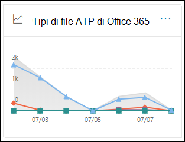

# Visualizzare i report per Office 365 Advanced Threat ProtectionView reports for Office 365 Advanced Threat Protection

[!INCLUDE [Microsoft 365 Defender rebranding](../includes/microsoft-defender-for-office.md)]

Le organizzazioni di Office 365 Advanced Threat Protection (ATP) (ad esempio, gli abbonamenti Microsoft 365 E5 o i componenti aggiuntivi ATP Plan 1 o ATP Plan 2) contengono una serie di report relativi alla sicurezza.Office 365 Advanced Threat Protection (ATP) organizations (for example, Microsoft 365 E5 subscriptions or ATP Plan 1 or ATP Plan 2 add-ons) contain a variety of security-related reports. Se si dispone delle [autorizzazioni necessarie](#what-permissions-are-needed-to-view-the-atp-reports), è possibile visualizzare i report nel centro sicurezza & Compliance accedendo al **Reports** \> **Dashboard**report.If you have the [necessary permissions](#what-permissions-are-needed-to-view-the-atp-reports), you can view these reports in the Security & Compliance Center by going to **Reports** \> **Dashboard**. Per accedere direttamente al dashboard dei report, aprire <https://protection.office.com/insightdashboard> .To go directly to the Reports dashboard, open <https://protection.office.com/insightdashboard>.

## Report sui tipi di file di protezione avanzata delle minacceAdvanced Threat Protection file types report

Il rapporto **report sui tipi di file di protezione avanzata delle minacce** indica il tipo di file che sono stati rilevati come dannosi dagli [allegati sicuri](atp-safe-attachments.md).The **Advanced Threat Protection file types report** report shows you the type of files detected as malicious by [Safe Attachments](atp-safe-attachments.md).

 La visualizzazione aggregazione del report consente 90 giorni di filtraggio, mentre la visualizzazione dettagli consente solo 10 giorni di filtraggio.The aggregate view of the report allows for 90 days of filtering, while the detail view only allows for 10 days of filtering.

Per visualizzare il report, aprire il [Centro sicurezza & conformità](https://protection.office.com), accedere al **Reports** \> **Dashboard** dei report e selezionare **tipi di file ATP di Office**.To view the report, open the [Security & Compliance Center](https://protection.office.com), go to **Reports** \> **Dashboard** and select **Office ATP file types**. Per passare direttamente al report, aprire <https://protection.office.com/reportv2?id=ATPFileReport> .To go directly to the report, open <https://protection.office.com/reportv2?id=ATPFileReport>.

> [!NOTE]
> Le informazioni contenute in questo report sono disponibili anche nel [report Advanced Threat Protection Message Disposition](#advanced-threat-protection-message-disposition-report).The information in this report is also available in the [Advanced Threat Protection message disposition report](#advanced-threat-protection-message-disposition-report).

### Visualizzazione report per il rapporto tipi di file di protezione avanzata dalle minacceReport view for the Advanced Threat Protection file types report

Sono disponibili le visualizzazioni seguenti:The following views are available:

- **Visualizzare i dati per: file**: il grafico contiene le informazioni seguenti:**View data by: File**: The chart contains the following information:

  - **Allegati di Excel dannosi****Malicious Excel attachments**
  - **Allegati Flash dannosi****Malicious Flash attachments**
  - **Allegati PDF dannosi****Malicious PDF attachments**
  - **Allegati di PowerPoint dannosi****Malicious PowerPoint attachments**
  - **URL dannosi****Malicious URLs**
  - **Allegati di Word dannosi****Malicious Word attachments**
  - **Allegati eseguibili dannosi****Malicious executable attachments**
  - **Altri****Others**

  Quando si posiziona il puntatore del mouse su un determinato giorno (punto dati), è possibile visualizzare la ripartizione dei tipi di file dannosi rilevati dagli [allegati sicuri](atp-safe-attachments.md) e dalla [protezione antimalware in EOP](anti-malware-protection.md).When you hover over a particular day (data point), you can see the breakdown of types of malicious files that were detected by [Safe Attachments](atp-safe-attachments.md) and [anti-malware protection in EOP](anti-malware-protection.md).

  

  Se si fa clic su **filtri**, è possibile modificare il report con i filtri seguenti:If you click **Filters**, you can modify the report with the following filters:

  - Data di **inizio** e **Data di fine****Start date** and **End date**
  - Gli stessi valori del tipo di file che sono visibili nel grafico.The same file type values that are visible in the chart.

- **Visualizzazione dei dati per: messaggio**: il grafico contiene le informazioni seguenti:**View data by: Message**: The chart contains the following information:

  - **Blocca accesso****Block access**
  - **Messaggi sostituiti****Messages replaced**
  - **Messaggi monitorati****Messages monitored**
  - **Sostituito dal recapito dinamico della posta elettronica**: per ulteriori informazioni, vedere [Dynamic Delivery in Safe Attachment Policies](atp-safe-attachments.md#dynamic-delivery-in-safe-attachments-policies).**Replaced by Dynamic Email Delivery**: For more information, see [Dynamic Delivery in Safe Attachments policies](atp-safe-attachments.md#dynamic-delivery-in-safe-attachments-policies).

  

  Se si fa clic su **filtri**, è possibile modificare il report con i filtri seguenti:If you click **Filters**, you can modify the report with the following filters:

  - Data di **inizio** e **Data di fine****Start date** and **End date**
  - Gli stessi valori di disposizione del messaggio che sono disponibili nel grafico e i messaggi aggiuntivi che hanno **superato** il valore.The same message disposition values that are available in the chart, and the additional **Messages passed** value.

### Visualizzazione tabella dettagli per il rapporto tipi di file di protezione avanzata dalle minacceDetails table view for the Advanced Threat Protection file types report

Se si fa clic su **Visualizza tabella dettagli**, il rapporto fornisce una visualizzazione quasi in tempo reale di tutti i clic che si verificano all'interno dell'organizzazione negli ultimi 10 giorni.If you click **View details table**, the report provides a near-real-time view of all clicks that happen within the organization for the last 10 days. Le informazioni visualizzate dipendono dal grafico che si sta esaminando:The information that's shown depends on the chart you were looking at:

- **Visualizzare i dati in base a: file**:**View data by: File**:

  - **Data****Date**
  - **Indirizzo del destinatario****Recipient address**
  - **Indirizzo del mittente****Sender address**
  - **ID messaggio**: disponibile nel campo di intestazione **Message-ID** nell'intestazione del messaggio e deve essere univoco.**Message ID**: Available in the **Message-ID** header field in the message header and should be unique. Un valore di esempio è `<08f1e0f6806a47b4ac103961109ae6ef@server.domain>` (si notino le parentesi angolari).An example value is `<08f1e0f6806a47b4ac103961109ae6ef@server.domain>` (note the angle brackets).
  - **File****File**

  Se si fa clic su **filtri**, è possibile modificare il report con i filtri seguenti:If you click **Filters**, you can modify the report with the following filters:

  - Data di **inizio** e **Data di fine****Start date** and **End date**
  - Gli stessi valori del tipo di file che sono visibili nel grafico.The same file type values that are visible in the chart.

- **Visualizzare i dati per: messaggio**:**View data by: Message**:

  - **Data****Date**
  - **Indirizzo del destinatario****Recipient address**
  - **Indirizzo del mittente****Sender address**
  - **ID messaggio****Message ID**
  - **File****File**
  - **Oggetto****Subject**

  Se si fa clic su **filtri**, è possibile modificare i risultati con i filtri seguenti:If you click **Filters**, you can modify the results with the following filters:

  - Data di **inizio** e **Data di fine****Start date** and **End date**
  - Gli stessi valori di disposizione del messaggio che sono disponibili nel grafico e i messaggi aggiuntivi che hanno **superato** il valore.The same message disposition values that are available in the chart, and the additional **Messages passed** value.

Per tornare alla visualizzazione report, fare clic su **Visualizza report**.To get back to the reports view, click **View report**.

## Report eliminazione messaggi di protezione avanzata delle minacceAdvanced Threat Protection message disposition report

Il rapporto di **disposizione dei messaggi ATP** indica le azioni eseguite per i messaggi di posta elettronica rilevati come contenuti dannosi.The **ATP Message Disposition** report shows you the actions that were taken for email messages that were detected as having malicious content.

Per visualizzare il report, aprire il [Centro sicurezza & conformità](https://protection.office.com), accedere al **Reports** \> **Dashboard** report e selezionare **disposizione dei messaggi ATP di Office**.To view the report, open the [Security & Compliance Center](https://protection.office.com), go to **Reports** \> **Dashboard** and select **Office ATP message disposition**. Per passare direttamente al report, aprire <https://protection.office.com/reportv2?id=ATPMessageReport> .To go directly to the report, open <https://protection.office.com/reportv2?id=ATPMessageReport>.

> [!NOTE]
> Le informazioni contenute in questo report sono disponibili anche nel [rapporto sui tipi di file di protezione avanzata dalle minacce](#advanced-threat-protection-file-types-report).The information in this report is also available in the [Advanced Threat Protection file types report](#advanced-threat-protection-file-types-report).

### Visualizzazione report per il rapporto di disposizione dei messaggi per la protezione avanzata dalle minacceReport view for the Advanced Threat Protection message disposition report

Sono disponibili le visualizzazioni seguenti:The following views are available:

- **Visualizzazione dei dati per: messaggio**: il grafico contiene le informazioni seguenti:**View data by: Message**: The chart contains the following information:

  - **Blocca accesso****Block access**
  - **Messaggi sostituiti****Messages replaced**
  - **Messaggi monitorati****Messages monitored**
  - **Sostituito dal recapito dinamico della posta elettronica**: per ulteriori informazioni, vedere [Dynamic Delivery in Safe Attachment Policies](atp-safe-attachments.md#dynamic-delivery-in-safe-attachments-policies).**Replaced by Dynamic Email Delivery**: For more information, see [Dynamic Delivery in Safe Attachments policies](atp-safe-attachments.md#dynamic-delivery-in-safe-attachments-policies).

  

  Se si fa clic su **filtri**, è possibile modificare il report con i filtri seguenti:If you click **Filters**, you can modify the report with the following filters:

  - Data di **inizio** e **Data di fine****Start date** and **End date**
  - Gli stessi valori di disposizione del messaggio che sono disponibili nel grafico e i messaggi aggiuntivi che hanno **superato** il valore.The same message disposition values that are available in the chart, and the additional **Messages passed** value.

- **Visualizzare i dati per: file**: il grafico contiene le informazioni seguenti:**View data by: File**: The chart contains the following information:

  - **Allegati di Excel dannosi****Malicious Excel attachments**
  - **Allegati Flash dannosi****Malicious Flash attachments**
  - **Allegati PDF dannosi****Malicious PDF attachments**
  - **Allegati di PowerPoint dannosi****Malicious PowerPoint attachments**
  - **URL dannosi****Malicious URLs**
  - **Allegati di Word dannosi****Malicious Word attachments**
  - **Allegati eseguibili dannosi****Malicious executable attachments**
  - **Altri****Others**

  Quando si posiziona il puntatore del mouse su un determinato giorno (punto dati), è possibile visualizzare la ripartizione dei tipi di file dannosi rilevati dagli [allegati sicuri](atp-safe-attachments.md) e dalla [protezione antimalware in EOP](anti-malware-protection.md).When you hover over a particular day (data point), you can see the breakdown of types of malicious files that were detected by [Safe Attachments](atp-safe-attachments.md) and [anti-malware protection in EOP](anti-malware-protection.md).

  

  Se si fa clic su **filtri**, è possibile modificare il report con i filtri seguenti:If you click **Filters**, you can modify the report with the following filters:

  - Data di **inizio** e **Data di fine****Start date** and **End date**
  - Gli stessi valori del tipo di file che sono visibili nel grafico.The same file type values that are visible in the chart.

### Visualizzazione della tabella Details per il rapporto disposizione dei messaggi per la protezione avanzata dalle minacceDetails table view for the Advanced Threat Protection message disposition report

Se si fa clic su **Visualizza tabella dettagli**, il rapporto fornisce una visualizzazione quasi in tempo reale di tutti i clic che si verificano all'interno dell'organizzazione negli ultimi 10 giorni.If you click **View details table**, the report provides a near-real-time view of all clicks that happen within the organization for the last 10 days. Le informazioni visualizzate dipendono dal grafico che si sta esaminando:The information that's shown depends on the chart you were looking at:

- **Visualizzare i dati per: messaggio**:**View data by: Message**:

  - **Data****Date**
  - **Indirizzo del destinatario****Recipient address**
  - **Indirizzo del mittente****Sender address**
  - **ID messaggio****Message ID**
  - **File****File**
  - **Oggetto****Subject**

  Se si fa clic su **filtri**, è possibile modificare i risultati con i filtri seguenti:If you click **Filters**, you can modify the results with the following filters:

  - Data di **inizio** e **Data di fine****Start date** and **End date**
  - Gli stessi valori di disposizione del messaggio che sono disponibili nel grafico e i messaggi aggiuntivi che hanno **superato** il valore.The same message disposition values that are available in the chart, and the additional **Messages passed** value.

- **Visualizzare i dati in base a: file**:**View data by: File**:

  - **Data****Date**
  - **Indirizzo del destinatario****Recipient address**
  - **Indirizzo del mittente****Sender address**
  - **ID messaggio****Message ID**
  - **File****File**

  Se si fa clic su **filtri**, è possibile modificare il report con i filtri seguenti:If you click **Filters**, you can modify the report with the following filters:

  - Data di **inizio** e **Data di fine****Start date** and **End date**
  - Gli stessi valori del tipo di file che sono visibili nel grafico.The same file type values that are visible in the chart.

Per tornare alla visualizzazione report, fare clic su **Visualizza report**.To get back to the reports view, click **View report**.

## Report dello stato di protezione dalle minacceThreat protection status report

Il rapporto **sullo stato della protezione dalle minacce** è una singola visualizzazione che raggruppa informazioni su contenuto dannoso e messaggi di posta elettronica dannosi rilevati e bloccati da [Exchange Online Protection](exchange-online-protection-overview.md) (EOP) e Office 365 ATP.The **Threat protection status** report is a single view that brings together information about malicious content and malicious email detected and blocked by [Exchange Online Protection](exchange-online-protection-overview.md) (EOP) and Office 365 ATP. Per ulteriori informazioni, vedere [rapporto sullo stato della protezione dalle minacce](view-email-security-reports.md#threat-protection-status-report).For more information, see [Threat protection status report](view-email-security-reports.md#threat-protection-status-report).

## Report sulla protezione dalle minacce URLURL threat protection report

Il **rapporto di protezione** per gli URL fornisce visualizzazioni di riepilogo e di tendenza per le minacce rilevate e le azioni eseguite su clic URL come parte dei [collegamenti sicuri](atp-safe-links.md).The **URL threat protection report** provides summary and trend views for threats detected and actions taken on URL clicks as part of [Safe Links](atp-safe-links.md). Questo report non displicherà i dati da parte degli utenti a cui è stato applicato il criterio collegamenti sicuri ha l'opzione non **registrare i clic utente** selezionati.This report will not have click data from users where the Safe Links policy applied has the **Do not track user clicks** option selected.

Per visualizzare il report, aprire il [Centro sicurezza & conformità](https://protection.office.com), accedere al **Reports** \> **Dashboard** report e selezionare **rapporto protezione URL**.To view the report, open the [Security & Compliance Center](https://protection.office.com), go to **Reports** \> **Dashboard** and select **URL protection report**. Per passare direttamente al report, aprire <https://protection.office.com/reportv2?id=URLProtectionActionReport> .To go directly to the report, open <https://protection.office.com/reportv2?id=URLProtectionActionReport>.

> [!NOTE]
> Si tratta di un *report di tendenza di protezione*, in cui i dati rappresentano le tendenze di un DataSet più grande.This is a *protection trend report*, meaning data represents trends in a larger dataset. Di conseguenza, i dati nella visualizzazione aggregata non sono disponibili in tempo reale qui, ma i dati nella visualizzazione tabella dettagli sono, pertanto è possibile che si verifichi una leggera discrepanza tra le due visualizzazioni.As a result, the data in the aggregate view is not available in real time here, but the data in the details table view is, so you may see a slight discrepancy between the two views.

### Visualizzazione report per il report di protezione dalle minacce URLReport view for the URL threat protection report

Il report di **protezione dalle minacce URL** contiene due visualizzazioni aggregate aggiornate ogni quattro ore che mostrano i dati per gli ultimi 90 giorni:The **URL threat protection** report has two aggregated views that are refreshed once every four hours that shows data for the last 90 days:

- **Azione di protezione clic su URL**: Visualizza il numero di clic URL degli utenti nell'organizzazione e i risultati del clic:**URL click protection action**: Shows the number of URL clicks by users in the organization and the results of the click:

  - **Bloccato** (l'utente è stato bloccato dall'esplorazione all'URL)**Blocked** (the user was blocked from navigating to the URL)
  - **Bloccato e selezionato tramite****Blocked and clicked through**
  - **Fare clic su di esso durante l'analisi****Clicked through during scan**

  Un clic indica che l'utente ha fatto clic sulla pagina blocca nel sito Web dannoso (gli amministratori possono disabilitare il clic nei criteri collegamenti sicuri).A click indicates that the user has clicked through the block page to the malicious website (admins can disable click through in Safe Links policies).

  Se si fa clic su **filtri**, è possibile modificare il report con i filtri seguenti:If you click **Filters**, you can modify the report with the following filters:

  - Data di **inizio** e **Data di fine****Start date** and **End date**
  - Le azioni di protezione clic disponibili, oltre al valore **consentito** (è stato consentito all'utente di passare all'URL).The available click protection actions, plus the value **Allowed** (the user was allowed to navigate to the URL).

  

- **URL fare clic su applicazione**: consente di visualizzare il numero di clic URL da applicazioni che supportano collegamenti sicuri:**URL click by application**: Shows the number of URL clicks by applications that support Safe Links:

  - **Client di posta elettronica****Email client**
  - **PowerPoint****PowerPoint**
  - **Word****Word**
  - **Excel****Excel**
  - **OneNote****OneNote**
  - **Visio****Visio**
  - **Teams****Teams**
  - **Altro****Other**

  Se si fa clic su **filtri**, è possibile modificare il report con i filtri seguenti:If you click **Filters**, you can modify the report with the following filters:

  - Data di **inizio** e **Data di fine****Start date** and **End date**
  - Le applicazioni disponibili.The available applications.

### Visualizzazione della tabella dei dettagli per il report sulla protezione dalle minacce URLDetails table view for the URL threat protection report

Se si fa clic su **Visualizza tabella dettagli**, il rapporto fornisce una visualizzazione quasi in tempo reale di tutti i clic che si verificano all'interno dell'organizzazione negli ultimi 7 giorni con i seguenti dettagli:If you click **View details table**, the report provides a near-real-time view of all clicks that happen within the organization for the last 7 days with the following details:

- **Fare clic su tempo****Click time**
- **Utente****User**
- **URL****URL**
- **Azione****Action**
- **App****App**

Se si fa clic su **filtri** nella visualizzazione tabella dettagli, è possibile filtrare in base agli stessi criteri della visualizzazione report, nonché ai **domini** o ai **destinatari** separati da virgole.If you click **Filters** in the details table view, you can filter by the same criteria as in the report view, and also by **Domains** or **Recipients** separated by commas.

Per tornare alla visualizzazione report, fare clic su **Visualizza report**.To get back to the reports view, click **View report**.

## Report aggiuntivi da visualizzareAdditional reports to view

Oltre ai report ATP descritti in questo argomento, sono disponibili diversi altri report, come descritto nella tabella seguente:In addition to the ATP reports described in this topic, several other reports are available, as described in the following table:

****

|ReportReport|ArgomentoTopic|
|---|---|
|**Explorer** (ATP piano 2) o **rilevamenti in tempo reale** (ATP piano 1)**Explorer** (ATP Plan 2) or **real-time detections** (ATP Plan 1)|[Esplora minacce (e rilevamenti in tempo reale)Threat Explorer (and real-time detections)](threat-explorer.md)|
|Report di **protezione della posta elettronica**, ad esempio il report mittenti e destinatari principali, il report di posta indesiderata e il rapporto rilevamenti di spam.**Email security reports**, such as the Top senders and recipients report, the Spoof mail report, and the Spam detections report.|[Visualizzare i report sulla sicurezza della posta elettronica nel Centro sicurezza e conformitàView email security reports in the Security & Compliance Center](view-email-security-reports.md)|
|**Rapporti sul flusso di posta**, ad esempio il rapporto di inoltro, il rapporto sullo stato del flusso di messaggi e il report mittenti e destinatari principali.**Mail flow reports**, such as the Forwarding report, the Mailflow status report, and the Top senders and recipients report.|[Visualizzare i report sul flusso di posta elettronica nel centro sicurezza & ComplianceView mail flow reports in the Security & Compliance Center](view-mail-flow-reports.md)|
|**Traccia URL per i collegamenti sicuri** (solo PowerShell).**URL trace for Safe Links** (PowerShell only). L'output di questo cmdlet consente di visualizzare i risultati delle azioni relative ai collegamenti sicuri negli ultimi sette giorni.The output of this cmdlet shows you the results of Safe Links actions over the past seven days.|[Get-UrlTraceGet-UrlTrace](https://docs.microsoft.com/powershell/module/exchange/get-urltrace)|
|**Risultati del traffico di posta elettronica per EOP e ATP** (solo PowerShell).**Mail traffic results for EOP and ATP** (PowerShell only). L'output di questo cmdlet contiene informazioni sul dominio, la data, il tipo di evento, la direzione, l'azione e il numero di messaggi.The output of this cmdlet contains information about Domain, Date, Event Type, Direction, Action, and Message Count.|[Get-MailTrafficATPReportGet-MailTrafficATPReport](https://docs.microsoft.com/powershell/module/exchange/get-mailtrafficatpreport)|
|**Report Dettagli posta per i rilevamenti di EOP e ATP** (solo PowerShell).**Mail detail reports for EOP and ATP detections** (PowerShell only). L'output di questo cmdlet contiene informazioni dettagliate su file o URL dannosi, tentativi di phishing, rappresentazione e altre potenziali minacce nei messaggi di posta elettronica o nei file.The output of this cmdlet contains details about malicious files or URLs, phishing attempts, impersonation, and other potential threats in email or files.|[Get-MailDetailATPReportGet-MailDetailATPReport](https://docs.microsoft.com/powershell/module/exchange/get-maildetailatpreport)|
|

## Quali autorizzazioni sono necessarie per visualizzare i report ATP?What permissions are needed to view the ATP reports?

Per visualizzare e utilizzare i report descritti in questo argomento, **è necessario che sia assegnato un ruolo appropriato per il &amp; Centro sicurezza e l'interfaccia di amministrazione di Exchange**.In order to view and use the reports described in this topic, **you must have an appropriate role assigned for both the Security &amp; Compliance Center and the Exchange admin center**.

- Per il Centro sicurezza & conformità, è necessario che sia assegnato uno dei ruoli seguenti:For the Security & Compliance Center, you must have one of the following roles assigned:

  - Gestione organizzazioneOrganization Management
  - Amministratore della sicurezza (è possibile assegnarlo nell'interfaccia di amministrazione di Azure Active Directory ( [https://aad.portal.azure.com](https://aad.portal.azure.com) ))Security Administrator (this can be assigned in the Azure Active Directory admin center ([https://aad.portal.azure.com](https://aad.portal.azure.com)))
  - Operatore di sicurezza (che può essere assegnato nell'interfaccia di amministrazione di Azure Active Directory ( [https://aad.portal.azure.com](https://aad.portal.azure.com) ))Security Operator (this can be assigned in the Azure Active Directory admin center ([https://aad.portal.azure.com](https://aad.portal.azure.com)))
  - Ruolo con autorizzazioni di lettura per la sicurezzaSecurity Reader

- Per Exchange Online, è necessario che sia assegnato uno dei ruoli seguenti nell'interfaccia di amministrazione di Exchange ( [https://outlook.office365.com/ecp](https://outlook.office365.com/ecp) ) o con i cmdlet di PowerShell (vedere [Exchange Online PowerShell](https://docs.microsoft.com/powershell/exchange/exchange-online-powershell)):For Exchange Online, you must have one of the following roles assigned in either the Exchange admin center ([https://outlook.office365.com/ecp](https://outlook.office365.com/ecp)) or with PowerShell cmdlets (See [Exchange Online PowerShell](https://docs.microsoft.com/powershell/exchange/exchange-online-powershell)):

  - Gestione organizzazioneOrganization Management
  - Gestione organizzazione in sola visualizzazioneView-only Organization Management
  - Ruolo Destinatari di sola letturaView-Only Recipients role
  - Gestione della conformitàCompliance Management

Per altre informazioni, vedere le risorse seguenti:To learn more, see the following resources:

- [Autorizzazioni nel Centro sicurezza e conformitàPermissions in the Security & Compliance Center](permissions-in-the-security-and-compliance-center.md)

- [Autorizzazioni funzionalità in Exchange OnlineFeature permissions in Exchange Online](https://docs.microsoft.com/exchange/permissions-exo/feature-permissions)

## Cosa succede se i rapporti non mostrano dati?What if the reports aren't showing data?

Se i dati non vengono visualizzati nei rapporti ATP, verificare che i criteri siano configurati correttamente.If you are not seeing data in your ATP reports, double-check that your policies are set up correctly. L'organizzazione deve disporre di criteri per i [collegamenti sicuri](set-up-atp-safe-links-policies.md) e di [criteri degli allegati sicuri](set-up-atp-safe-attachments-policies.md) definiti in modo che la protezione ATP sia sul posto.Your organization must have [Safe Links policies](set-up-atp-safe-links-policies.md) and [Safe Attachments policies](set-up-atp-safe-attachments-policies.md) defined in order for ATP protection to be in place. Vedere anche [protezione dalla posta indesiderata e anti-malware](anti-spam-and-anti-malware-protection.md).Also see [Anti-spam and anti-malware protection](anti-spam-and-anti-malware-protection.md).

## Argomenti correlatiRelated topics

[Report intelligenti e informazioni dettagliate nel Centro sicurezza e conformitàSmart reports and insights in the Security & Compliance Center](reports-and-insights-in-security-and-compliance.md)
  
[Autorizzazioni ruolo (Azure Active DirectoryRole permissions (Azure Active Directory](https://docs.microsoft.com/azure/active-directory/users-groups-roles/directory-assign-admin-roles#role-permissions)
