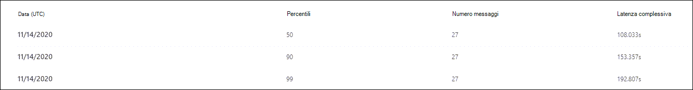

# Visualizzare i report di Defender per Office 365 nel dashboard Report nel Centro sicurezza & conformità

[!INCLUDE [Microsoft 365 Defender rebranding](../includes/microsoft-defender-for-office.md)]

**Si applica a**
- [Microsoft Defender per Office 365 piano 1 e piano 2](office-365-atp.md)
- [Microsoft 365 Defender](../mtp/microsoft-threat-protection.md)

Microsoft Defender per le organizzazioni di Office 365 (ad esempio, gli abbonamenti a Microsoft 365 E5 o Microsoft Defender per Office 365 Piano 1 o i componenti aggiuntivi Microsoft Defender per Office 365 Piano 2) contengono una serie di report relativi alla sicurezza. Se si dispone delle [autorizzazioni necessarie,](#what-permissions-are-needed-to-view-the-defender-for-office-365-reports)è possibile visualizzare questi report nel Centro sicurezza & conformità selezionando **Dashboard** \> **report.** Per passare direttamente al dashboard dei report, aprire <https://protection.office.com/insightdashboard> .

## Report tipi di file per Defender per Office 365

Il report dei tipi di file di Defender per **Office 365** mostra il tipo di file rilevati come dannosi dagli [allegati sicuri.](atp-safe-attachments.md)

 La visualizzazione aggregata del report consente 90 giorni di filtro, mentre la visualizzazione dettagli consente solo 10 giorni di filtro.

Per visualizzare il report, aprire il [Centro sicurezza & conformità,](https://protection.office.com)passare al dashboard dei report e selezionare Defender per i tipi di file di  \>  **Office 365.** Per passare direttamente al report, aprire <https://protection.office.com/reportv2?id=ATPFileReport> .

> [!NOTE]
> Le informazioni contenute in questo report sono disponibili anche nel report sull'eliminazione dei messaggi di [Defender per Office 365.](#defender-for-office-365-message-disposition-report)

### Report view for the Defender for Office 365 file types report

Sono disponibili le visualizzazioni seguenti:

- **Visualizza dati per: File**: il grafico contiene le informazioni seguenti:

  - **Allegati di Excel dannosi**
  - **Allegati Flash dannosi**
  - **Allegati PDF dannosi**
  - **Allegati di PowerPoint dannosi**
  - **URL dannosi**
  - **Allegati di Word dannosi**
  - **Allegati eseguibili dannosi**
  - **Altri**

  Quando si passa il mouse su un determinato giorno (punto dati), è  possibile visualizzare la suddivisione dei tipi di file dannosi rilevati da Allegati sicuri e protezione [antimalware in EOP.](anti-malware-protection.md)

  

  Se si fa **clic su Filtri,** è possibile modificare il report con i filtri seguenti:

  - **Data di inizio** **e data di fine**
  - Gli stessi valori del tipo di file visibili nel grafico.

- **Visualizza dati per: Messaggio**: Il grafico contiene le informazioni seguenti:

  - **Blocca accesso**
  - **Messaggi sostituiti**
  - **Messaggi monitorati**
  - **Sostituito da Recapito dinamico della** posta elettronica: per ulteriori informazioni, vedere Recapito dinamico nei criteri allegati [sicuri.](atp-safe-attachments.md#dynamic-delivery-in-safe-attachments-policies)

  

  Se si fa **clic su Filtri,** è possibile modificare il report con i filtri seguenti:

  - **Data di inizio** **e data di fine**
  - Gli stessi valori per l'eliminazione dei messaggi disponibili nel grafico e il valore **aggiunto Messaggi passati.**

### Visualizzazione della tabella dei dettagli per il report sui tipi di file di Defender per Office 365

Se si fa **clic** su Visualizza tabella dettagli, il report offre una visualizzazione quasi in tempo reale di tutti i clic che si verificano all'interno dell'organizzazione negli ultimi 10 giorni. Le informazioni visualizzate dipendono dal grafico che si stava osservando:

- **Visualizza dati per: File:**

  - **Data**
  - **Indirizzo destinatario**
  - **Indirizzo del mittente**
  - **ID messaggio:** disponibile nel campo **di intestazione Message-ID** nell'intestazione del messaggio e deve essere univoco. Un valore di esempio è `<08f1e0f6806a47b4ac103961109ae6ef@server.domain>` (si notino le parentesi uncinate).
  - **File**

  Se si fa **clic su Filtri,** è possibile modificare il report con i filtri seguenti:

  - **Data di inizio** **e data di fine**
  - Gli stessi valori del tipo di file visibili nel grafico.

- **Visualizzare i dati per: Messaggio:**

  - **Data**
  - **Indirizzo destinatario**
  - **Indirizzo del mittente**
  - **ID messaggio**
  - **File**
  - **Oggetto**

  Se si fa **clic su Filtri,** è possibile modificare i risultati con i filtri seguenti:

  - **Data di inizio** **e data di fine**
  - Gli stessi valori per l'eliminazione dei messaggi disponibili nel grafico e il valore **aggiunto Messaggi passati.**

Per tornare alla visualizzazione report, fare clic su **Visualizza report.**

## Report disposizione messaggi di Defender per Office 365

Il report di eliminazione dei messaggi **ATP** mostra le azioni intraprese per i messaggi di posta elettronica che sono stati rilevati come contenuti dannosi.

Per visualizzare il report, aprire il Centro [sicurezza & conformità,](https://protection.office.com)passare al dashboard dei report e selezionare Defender per l'eliminazione dei messaggi  \>  di **Office 365.** Per passare direttamente al report, aprire <https://protection.office.com/reportv2?id=ATPMessageReport> .

> [!NOTE]
> Le informazioni contenute in questo report sono disponibili anche nel report Sui tipi di file di [Defender per Office 365.](#defender-for-office-365-file-types-report)

### Report view for the Defender for Office 365 message disposition report

Sono disponibili le visualizzazioni seguenti:

- **Visualizza dati per: Messaggio**: Il grafico contiene le informazioni seguenti:

  - **Blocca accesso**
  - **Messaggi sostituiti**
  - **Messaggi monitorati**
  - **Sostituito da Recapito dinamico della** posta elettronica: per ulteriori informazioni, vedere Recapito dinamico nei criteri allegati [sicuri.](atp-safe-attachments.md#dynamic-delivery-in-safe-attachments-policies)

  

  Se si fa **clic su Filtri,** è possibile modificare il report con i filtri seguenti:

  - **Data di inizio** **e data di fine**
  - Gli stessi valori per l'eliminazione dei messaggi disponibili nel grafico e il valore **aggiunto Messaggi passati.**

- **Visualizza dati per: File**: il grafico contiene le informazioni seguenti:

  - **Allegati di Excel dannosi**
  - **Allegati Flash dannosi**
  - **Allegati PDF dannosi**
  - **Allegati di PowerPoint dannosi**
  - **URL dannosi**
  - **Allegati di Word dannosi**
  - **Allegati eseguibili dannosi**
  - **Altri**

  Quando si passa il mouse su un determinato giorno (punto dati), è  possibile visualizzare la suddivisione dei tipi di file dannosi rilevati da Allegati sicuri e protezione [antimalware in EOP.](anti-malware-protection.md)

  

  Se si fa **clic su Filtri,** è possibile modificare il report con i filtri seguenti:

  - **Data di inizio** **e data di fine**
  - Gli stessi valori del tipo di file visibili nel grafico.

### Visualizzazione della tabella dei dettagli per il report sull'eliminazione dei messaggi di Defender per Office 365

Se si fa **clic** su Visualizza tabella dettagli, il report offre una visualizzazione quasi in tempo reale di tutti i clic che si verificano all'interno dell'organizzazione negli ultimi 10 giorni. Le informazioni visualizzate dipendono dal grafico che si stava osservando:

- **Visualizzare i dati per: Messaggio:**

  - **Data**
  - **Indirizzo destinatario**
  - **Indirizzo del mittente**
  - **ID messaggio**
  - **File**
  - **Oggetto**

  Se si fa **clic su Filtri,** è possibile modificare i risultati con i filtri seguenti:

  - **Data di inizio** **e data di fine**
  - Gli stessi valori per l'eliminazione dei messaggi disponibili nel grafico e il valore **aggiunto Messaggi passati.**

- **Visualizza dati per: File:**

  - **Data**
  - **Indirizzo destinatario**
  - **Indirizzo del mittente**
  - **ID messaggio**
  - **File**

  Se si fa **clic su Filtri,** è possibile modificare il report con i filtri seguenti:

  - **Data di inizio** **e data di fine**
  - Gli stessi valori del tipo di file visibili nel grafico.

Per tornare alla visualizzazione report, fare clic su **Visualizza report.**

## Rapporto latenza posta

Il **report Latenza posta** mostra una visualizzazione aggregata della latenza di recapito e detonazione della posta presente nell'organizzazione. I tempi di recapito della posta nel servizio sono influenzati da diversi fattori e il tempo di recapito assoluto in secondi spesso non è un buon indicatore di esito positivo o di un problema. Un tempo di recapito lento in un giorno può essere considerato un tempo medio di recapito in un altro giorno o viceversa. Il **rapporto Latenza posta** tenta di qualificare il recapito dei messaggi in base ai dati statistici relativi ai tempi di recapito osservati di altri messaggi:

- **50° percentile:** questo è il centro per i tempi di recapito dei messaggi. È possibile considerare questo valore come un tempo medio di recapito.
- **90° percentile:** indica una latenza elevata per il recapito dei messaggi. Solo il 10% dei messaggi ha impiegato più tempo di questo valore per il recapito.
- **99° percentile:** indica la latenza massima per il recapito dei messaggi.

Il lato client e la latenza di rete non sono inclusi.

Per visualizzare il report, aprire il [Centro sicurezza & conformità,](https://protection.office.com)passare al dashboard dei report e selezionare  \>  **Report latenza della posta.** Per passare direttamente al report, aprire <https://protection.office.com/mailLatencyReport?viewid=P50> .

### Visualizzazione report per il report Latenza posta

Quando si apre il report, la **scheda 50° percentile è** selezionata per impostazione predefinita.

Per impostazione predefinita, questa visualizzazione contiene un grafico configurato con i filtri seguenti:

- **Data**: Ultimi 7 giorni
- **Visualizzazione messaggio:**
  - Messaggi detonati

Questo grafico mostra i messaggi organizzati nelle categorie seguenti:

- **Latenza recapito posta**
- **Latenza detonazione**

Quando si passa il mouse su una categoria nel grafico, è possibile visualizzare una suddivisione della latenza in ogni categoria.

Se si fa **clic su Filtro** nella visualizzazione report, è possibile modificare i risultati con i filtri seguenti:

- Tutti i messaggi
- Messaggi che contengono allegati o URL

Se si fa clic sulla scheda **90° percentile o** sulla scheda **99° percentile,** verranno utilizzati gli stessi filtri predefiniti della **visualizzazione 50° percentile.**

### Visualizzazione della tabella dei dettagli per il report Latenza posta

Nella visualizzazione della tabella dei dettagli vengono visualizzate le informazioni seguenti:

- **Data**
- **Percentili**
- **Numero messaggi**
- **Latenza complessiva**

Quanto sopra mostra che il 14 novembre la latenza media riscontrata per tutti i messaggi recapitati e detonati è stata **di 108,033** secondi.

La tabella dei dettagli contiene le stesse informazioni in ogni scheda.

## Report dello stato di protezione dalle minacce

Il **rapporto** sullo stato di Protezione dalle minacce è una singola visualizzazione che riunisce informazioni su contenuti dannosi e messaggi di posta elettronica dannosi rilevati e bloccati da [Exchange Online Protection](exchange-online-protection-overview.md) (EOP) e Microsoft Defender per Office 365. Per ulteriori informazioni, vedere [la relazione sullo stato di Protezione dalle minacce.](view-email-security-reports.md#threat-protection-status-report)

## Report di protezione dalle minacce URL

Il **report di protezione dalle minacce URL** fornisce visualizzazioni di riepilogo e tendenze per le minacce rilevate e le azioni eseguite sui clic su URL come parte di Collegamenti [sicuri.](atp-safe-links.md) Per questo report non saranno disponibili dati sui clic degli utenti a cui è stato applicato il criterio Collegamenti sicuri. L'opzione **Non tenere** traccia dei clic degli utenti è selezionata.

Per visualizzare il report, aprire il [Centro sicurezza & conformità,](https://protection.office.com)passare **al** \> **dashboard dei** report e selezionare il report **protezione URL.** Per passare direttamente al report, aprire <https://protection.office.com/reportv2?id=URLProtectionActionReport> .

> [!NOTE]
> Si tratta di un *report sulle tendenze di protezione,* che indica che i dati rappresentano le tendenze in un set di dati più grande. Di conseguenza, i dati nella visualizzazione aggregata non sono disponibili in tempo reale qui, ma i dati nella visualizzazione della tabella dei dettagli lo sono, quindi potresti vedere una leggera discrepanza tra le due visualizzazioni.

### Visualizzazione report per il report di protezione dalle minacce URL

Il **report di protezione dalle** minacce URL include due visualizzazioni aggregate che vengono aggiornate una volta ogni quattro ore e che mostrano i dati degli ultimi 90 giorni:

- **Azione di protezione da clic url**: mostra il numero di clic su URL da parte degli utenti dell'organizzazione e i risultati del clic:

  - **Bloccato** (all'utente è stato impedito di passare all'URL)
  - **Bloccato e su cui è stato fatto clic**
  - **Clicked through during scan**

  Un clic indica che l'utente ha fatto clic nella pagina di blocco nel sito Web dannoso (gli amministratori possono disabilitare il click-through nei criteri collegamenti sicuri).

  Se si fa **clic su Filtri,** è possibile modificare il report con i filtri seguenti:

  - **Data di inizio** **e data di fine**
  - Le azioni di protezione dei clic disponibili, oltre al valore **Consentito** (all'utente è stato consentito passare all'URL).

  

- **Url click by application**: mostra il numero di clic su URL da parte delle applicazioni che supportano collegamenti sicuri:

  - **Client di posta elettronica**
  - **PowerPoint**
  - **Word**
  - **Excel**
  - **OneNote**
  - **Visio**
  - **Teams**
  - **Altro**

  Se si fa **clic su Filtri,** è possibile modificare il report con i filtri seguenti:

  - **Data di inizio** **e data di fine**
  - Le applicazioni disponibili.

### Visualizzazione della tabella dei dettagli per il report di protezione dalle minacce URL

Se si **fa** clic su Visualizza tabella dettagli, il report offre una visualizzazione quasi in tempo reale di tutti i clic che si verificano nell'organizzazione negli ultimi 7 giorni con i dettagli seguenti:

- **Ora clic**
- **Utente**
- **URL**
- **Azione**
- **App**

Se si fa **clic** su Filtri nella visualizzazione della tabella dei dettagli, è  possibile  filtrare in base allo stesso criterio della visualizzazione report e in base ai domini o ai destinatari separati da virgole.

> [!NOTE]
> Il **filtro Domini** fa riferimento al dominio URL elencato nei risultati del rapporto. 

Per tornare alla visualizzazione report, fare clic su **Visualizza report.**

## Report aggiuntivi da visualizzare

Oltre ai report descritti in questo articolo, sono disponibili diversi altri report, come descritto nella tabella seguente:

****

|Report|Argomento|
|---|---|
|**Explorer** (Microsoft Defender per Office 365 Piano 2) o rilevamenti in tempo reale **(Microsoft** Defender per Office 365 Piano 1)|[Esplora minacce (e rilevamenti in tempo reale)](threat-explorer.md)|
|**Report di sicurezza della** posta elettronica, ad esempio il rapporto Mittenti e destinatari principali, il rapporto Spoofing e il report rilevamenti di posta indesiderata.|[Visualizzare i report sulla sicurezza della posta elettronica nel Centro sicurezza e conformità](view-email-security-reports.md)|
|**Rapporti del flusso di posta,** ad esempio il rapporto di inoltro, il rapporto sullo stato del flusso di posta e il rapporto Mittenti e destinatari principali.|[Visualizzare i report del flusso di posta nel Centro sicurezza & conformità](view-mail-flow-reports.md)|
|**Traccia URL per collegamenti sicuri** (solo PowerShell). L'output di questo cmdlet mostra i risultati delle azioni collegamenti sicuri degli ultimi sette giorni.|[Get-UrlTrace](https://docs.microsoft.com/powershell/module/exchange/get-urltrace)|
|**Risultati del traffico di posta per EOP e Microsoft Defender per Office 365** (solo PowerShell). L'output di questo cmdlet contiene informazioni su Domain, Date, Event Type, Direction, Action e Message Count.|[Get-MailTrafficATPReport](https://docs.microsoft.com/powershell/module/exchange/get-mailtrafficatpreport)|
|**Rapporti dettagli posta per e-mail e defender per i rilevamenti di Office 365** (solo PowerShell). L'output di questo cmdlet contiene informazioni dettagliate su file o URL dannosi, tentativi di phishing, rappresentazione e altre potenziali minacce nella posta elettronica o nei file.|[Get-MailDetailATPReport](https://docs.microsoft.com/powershell/module/exchange/get-maildetailatpreport)|
|

## Quali autorizzazioni sono necessarie per visualizzare i report di Defender per Office 365?

Per visualizzare e utilizzare i report descritti in questo articolo, è necessario essere membri di uno dei gruppi di ruoli seguenti nel Centro sicurezza & conformità:

- **Gestione organizzazione**
- **Amministratore della sicurezza**
- **Lettore di sicurezza**
- **Lettore globale**

Per altre informazioni, vedere [Autorizzazioni nel Centro sicurezza e conformità](permissions-in-the-security-and-compliance-center.md).

**Nota:** l'aggiunta di utenti al ruolo Azure Active Directory corrispondente nell'interfaccia di amministrazione di Microsoft  365 offre agli utenti le autorizzazioni necessarie nel Centro sicurezza & e conformità e le autorizzazioni per altre funzionalità di Microsoft 365. Per altre informazioni, vedere [Informazioni sui ruoli di amministratore](../../admin/add-users/about-admin-roles.md).

## Cosa succede se i report non mostrano dati?

Se i dati non vengono visualizzati nei report di Defender per Office 365, verificare che i criteri siano configurati correttamente. L'organizzazione deve disporre  [di](set-up-atp-safe-links-policies.md) criteri collegamenti sicuri e allegati sicuri definiti per la protezione di Defender per Office 365. Vedere anche [Protezione antispam e antimalware.](anti-spam-and-anti-malware-protection.md)

## Argomenti correlati

[Report intelligenti e informazioni dettagliate nel Centro sicurezza e conformità](reports-and-insights-in-security-and-compliance.md)

[Autorizzazioni per i ruoli (Azure Active Directory](https://docs.microsoft.com/azure/active-directory/users-groups-roles/directory-assign-admin-roles#role-permissions)
