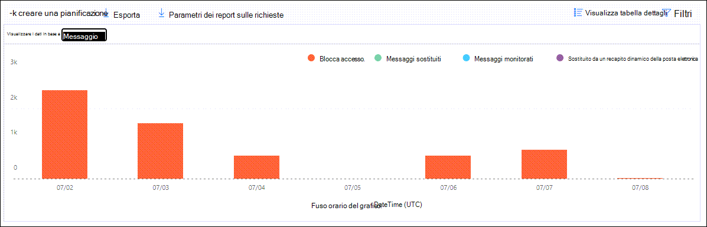

# Visualizzare i report di Defender per Office 365 nel dashboard Report nel Centro sicurezza & conformitàView Defender for Office 365 reports in the Reports dashboard in the Security & Compliance Center

[!INCLUDE [Microsoft 365 Defender rebranding](../includes/microsoft-defender-for-office.md)]

**Si applica a****Applies to**
- [Microsoft Defender per Office 365 piano 1 e piano 2Microsoft Defender for Office 365 plan 1 and plan 2](defender-for-office-365.md)
- [Microsoft 365 DefenderMicrosoft 365 Defender](../defender/microsoft-365-defender.md)

Microsoft Defender per le organizzazioni di Office 365 (ad esempio, abbonamenti a Microsoft 365 E5 o Microsoft Defender per Office 365 Piano 1 o Microsoft Defender per i componenti aggiuntivi Di Office 365 Piano 2) contengono un'ampia gamma di report relativi alla sicurezza.Microsoft Defender for Office 365 organizations (for example, Microsoft 365 E5 subscriptions or Microsoft Defender for Office 365 Plan 1 or Microsoft Defender for Office 365 Plan 2 add-ons) contain a variety of security-related reports. Se si dispone delle [autorizzazioni necessarie,](#what-permissions-are-needed-to-view-the-defender-for-office-365-reports)è possibile visualizzare questi report nel Centro sicurezza & conformità andando a **Dashboard** \> **report.**If you have the [necessary permissions](#what-permissions-are-needed-to-view-the-defender-for-office-365-reports), you can view these reports in the Security & Compliance Center by going to **Reports** \> **Dashboard**. Per passare direttamente al dashboard dei report, aprire <https://protection.office.com/insightdashboard> .To go directly to the Reports dashboard, open <https://protection.office.com/insightdashboard>.

## Report tipi di file per Defender per Office 365Defender for Office 365 file types report

Il **report Defender for Office 365 file types report** mostra il tipo di file rilevati come dannosi dagli allegati [sicuri.](safe-attachments.md)The **Defender for Office 365 file types report** report shows you the type of files detected as malicious by [Safe Attachments](safe-attachments.md).

 La visualizzazione aggregata del report consente 90 giorni di filtro, mentre la visualizzazione dettagli consente solo 10 giorni di filtro.The aggregate view of the report allows for 90 days of filtering, while the detail view only allows for 10 days of filtering.

Per visualizzare il report, aprire il Centro [sicurezza & conformità,](https://protection.office.com)passare a Dashboard report e selezionare Defender per i tipi di file di  \>  **Office 365.**To view the report, open the [Security & Compliance Center](https://protection.office.com), go to **Reports** \> **Dashboard** and select **Defender for Office 365 file types**. Per passare direttamente al report, aprire <https://protection.office.com/reportv2?id=ATPFileReport> .To go directly to the report, open <https://protection.office.com/reportv2?id=ATPFileReport>.

> [!NOTE]
> Le informazioni contenute in questo report sono disponibili anche nel report sull'eliminazione dei messaggi di [Defender per Office 365.](#defender-for-office-365-message-disposition-report)The information in this report is also available in the [Defender for Office 365 message disposition report](#defender-for-office-365-message-disposition-report).

### Visualizzazione dei report per il report Dei tipi di file di Defender per Office 365Report view for the Defender for Office 365 file types report

Sono disponibili le visualizzazioni seguenti:The following views are available:

- **Visualizza dati per: File**: Il grafico contiene le informazioni seguenti:**View data by: File**: The chart contains the following information:

  - **Allegati excel dannosi****Malicious Excel attachments**
  - **Allegati Flash dannosi****Malicious Flash attachments**
  - **Allegati PDF dannosi****Malicious PDF attachments**
  - **Allegati di PowerPoint dannosi****Malicious PowerPoint attachments**
  - **URL dannosi****Malicious URLs**
  - **Allegati di Word dannosi****Malicious Word attachments**
  - **Allegati eseguibili dannosi****Malicious executable attachments**
  - **Altri****Others**

  Quando si passa il mouse su un determinato giorno (punto dati), è  possibile visualizzare la suddivisione dei tipi di file dannosi rilevati dagli allegati sicuri e dalla protezione [antimalware in EOP.](anti-malware-protection.md)When you hover over a particular day (data point), you can see the breakdown of types of malicious files that were detected by [Safe Attachments](safe-attachments.md) and [anti-malware protection in EOP](anti-malware-protection.md).

  

  Se si fa **clic su Filtri**, è possibile modificare il report con i filtri seguenti:If you click **Filters**, you can modify the report with the following filters:

  - **Data di inizio** e **Data fine****Start date** and **End date**
  - Gli stessi valori del tipo di file visibili nel grafico.The same file type values that are visible in the chart.

- **Visualizza dati per: Messaggio**: Il grafico contiene le informazioni seguenti:**View data by: Message**: The chart contains the following information:

  - **Blocca accesso****Block access**
  - **Messaggi sostituiti****Messages replaced**
  - **Messaggi monitorati****Messages monitored**
  - **Sostituito da Recapito dinamico della** posta elettronica : per ulteriori informazioni, vedere Recapito dinamico nei criteri allegati [sicuri.](safe-attachments.md#dynamic-delivery-in-safe-attachments-policies)**Replaced by Dynamic Email Delivery**: For more information, see [Dynamic Delivery in Safe Attachments policies](safe-attachments.md#dynamic-delivery-in-safe-attachments-policies).

  

  Se si fa **clic su Filtri**, è possibile modificare il report con i filtri seguenti:If you click **Filters**, you can modify the report with the following filters:

  - **Data di inizio** e **Data fine****Start date** and **End date**
  - Gli stessi valori di eliminazione dei messaggi disponibili nel grafico e il valore **aggiuntivo Messaggi passati.**The same message disposition values that are available in the chart, and the additional **Messages passed** value.

### Visualizzazione tabella dei dettagli per il report Dei tipi di file di Defender per Office 365Details table view for the Defender for Office 365 file types report

Se si fa clic **su** Visualizza tabella dettagli , il report offre una visualizzazione quasi in tempo reale di tutti i clic che si verificano all'interno dell'organizzazione negli ultimi 10 giorni.If you click **View details table**, the report provides a near-real-time view of all clicks that happen within the organization for the last 10 days. Le informazioni visualizzate dipendono dal grafico visualizzato:The information that's shown depends on the chart you were looking at:

- **Visualizza dati per: File**:**View data by: File**:

  - **Data****Date**
  - **Indirizzo destinatario****Recipient address**
  - **Indirizzo del mittente****Sender address**
  - **ID messaggio**: Disponibile nel **campo di intestazione Message-ID** nell'intestazione del messaggio e deve essere univoco.**Message ID**: Available in the **Message-ID** header field in the message header and should be unique. Un valore di esempio è `<08f1e0f6806a47b4ac103961109ae6ef@server.domain>` (si notino le parentesi angolari).An example value is `<08f1e0f6806a47b4ac103961109ae6ef@server.domain>` (note the angle brackets).
  - **File****File**

  Se si fa **clic su Filtri**, è possibile modificare il report con i filtri seguenti:If you click **Filters**, you can modify the report with the following filters:

  - **Data di inizio** e **Data fine****Start date** and **End date**
  - Gli stessi valori del tipo di file visibili nel grafico.The same file type values that are visible in the chart.

- **Visualizza dati per: Messaggio**:**View data by: Message**:

  - **Data****Date**
  - **Indirizzo destinatario****Recipient address**
  - **Indirizzo del mittente****Sender address**
  - **ID messaggio****Message ID**
  - **File****File**
  - **Oggetto****Subject**

  Se si fa **clic su Filtri**, è possibile modificare i risultati con i filtri seguenti:If you click **Filters**, you can modify the results with the following filters:

  - **Data di inizio** e **Data fine****Start date** and **End date**
  - Gli stessi valori di eliminazione dei messaggi disponibili nel grafico e il valore **aggiuntivo Messaggi passati.**The same message disposition values that are available in the chart, and the additional **Messages passed** value.

Per tornare alla visualizzazione report, fare clic su **Visualizza report.**To get back to the reports view, click **View report**.

## Report disposizione messaggi di Defender per Office 365Defender for Office 365 message disposition report

Il **report Eliminazione messaggi ATP** mostra le azioni intraprese per i messaggi di posta elettronica che sono stati rilevati come contenuti dannosi.The **ATP Message Disposition** report shows you the actions that were taken for email messages that were detected as having malicious content.

Per visualizzare il report, aprire il Centro [sicurezza](https://protection.office.com)  & conformità, passare a Dashboard report e selezionare Defender per l'eliminazione dei messaggi \>  di **Office 365.**To view the report, open the [Security & Compliance Center](https://protection.office.com), go to **Reports** \> **Dashboard** and select **Defender for Office 365 message disposition**. Per passare direttamente al report, aprire <https://protection.office.com/reportv2?id=ATPMessageReport> .To go directly to the report, open <https://protection.office.com/reportv2?id=ATPMessageReport>.

> [!NOTE]
> Le informazioni contenute in questo report sono disponibili anche nel report Defender per i tipi di file di [Office 365.](#defender-for-office-365-file-types-report)The information in this report is also available in the [Defender for Office 365 file types report](#defender-for-office-365-file-types-report).

### Visualizzazione dei report per il report sull'eliminazione dei messaggi di Defender per Office 365Report view for the Defender for Office 365 message disposition report

Sono disponibili le visualizzazioni seguenti:The following views are available:

- **Visualizza dati per: Messaggio**: Il grafico contiene le informazioni seguenti:**View data by: Message**: The chart contains the following information:

  - **Blocca accesso****Block access**
  - **Messaggi sostituiti****Messages replaced**
  - **Messaggi monitorati****Messages monitored**
  - **Sostituito da Recapito dinamico della** posta elettronica : per ulteriori informazioni, vedere Recapito dinamico nei criteri allegati [sicuri.](safe-attachments.md#dynamic-delivery-in-safe-attachments-policies)**Replaced by Dynamic Email Delivery**: For more information, see [Dynamic Delivery in Safe Attachments policies](safe-attachments.md#dynamic-delivery-in-safe-attachments-policies).

  

  Se si fa **clic su Filtri**, è possibile modificare il report con i filtri seguenti:If you click **Filters**, you can modify the report with the following filters:

  - **Data di inizio** e **Data fine****Start date** and **End date**
  - Gli stessi valori di eliminazione dei messaggi disponibili nel grafico e il valore **aggiuntivo Messaggi passati.**The same message disposition values that are available in the chart, and the additional **Messages passed** value.

- **Visualizza dati per: File**: Il grafico contiene le informazioni seguenti:**View data by: File**: The chart contains the following information:

  - **Allegati excel dannosi****Malicious Excel attachments**
  - **Allegati Flash dannosi****Malicious Flash attachments**
  - **Allegati PDF dannosi****Malicious PDF attachments**
  - **Allegati di PowerPoint dannosi****Malicious PowerPoint attachments**
  - **URL dannosi****Malicious URLs**
  - **Allegati di Word dannosi****Malicious Word attachments**
  - **Allegati eseguibili dannosi****Malicious executable attachments**
  - **Altri****Others**

  Quando si passa il mouse su un determinato giorno (punto dati), è  possibile visualizzare la suddivisione dei tipi di file dannosi rilevati dagli allegati sicuri e dalla protezione [antimalware in EOP.](anti-malware-protection.md)When you hover over a particular day (data point), you can see the breakdown of types of malicious files that were detected by [Safe Attachments](safe-attachments.md) and [anti-malware protection in EOP](anti-malware-protection.md).

  

  Se si fa **clic su Filtri**, è possibile modificare il report con i filtri seguenti:If you click **Filters**, you can modify the report with the following filters:

  - **Data di inizio** e **Data fine****Start date** and **End date**
  - Gli stessi valori del tipo di file visibili nel grafico.The same file type values that are visible in the chart.

### Visualizzazione tabella dettagli per il report sull'eliminazione dei messaggi di Defender per Office 365Details table view for the Defender for Office 365 message disposition report

Se si fa clic **su** Visualizza tabella dettagli , il report offre una visualizzazione quasi in tempo reale di tutti i clic che si verificano all'interno dell'organizzazione negli ultimi 10 giorni.If you click **View details table**, the report provides a near-real-time view of all clicks that happen within the organization for the last 10 days. Le informazioni visualizzate dipendono dal grafico visualizzato:The information that's shown depends on the chart you were looking at:

- **Visualizza dati per: Messaggio**:**View data by: Message**:

  - **Data****Date**
  - **Indirizzo destinatario****Recipient address**
  - **Indirizzo del mittente****Sender address**
  - **ID messaggio****Message ID**
  - **File****File**
  - **Oggetto****Subject**

  Se si fa **clic su Filtri**, è possibile modificare i risultati con i filtri seguenti:If you click **Filters**, you can modify the results with the following filters:

  - **Data di inizio** e **Data fine****Start date** and **End date**
  - Gli stessi valori di eliminazione dei messaggi disponibili nel grafico e il valore **aggiuntivo Messaggi passati.**The same message disposition values that are available in the chart, and the additional **Messages passed** value.

- **Visualizza dati per: File**:**View data by: File**:

  - **Data****Date**
  - **Indirizzo destinatario****Recipient address**
  - **Indirizzo del mittente****Sender address**
  - **ID messaggio****Message ID**
  - **File****File**

  Se si fa **clic su Filtri**, è possibile modificare il report con i filtri seguenti:If you click **Filters**, you can modify the report with the following filters:

  - **Data di inizio** e **Data fine****Start date** and **End date**
  - Gli stessi valori del tipo di file visibili nel grafico.The same file type values that are visible in the chart.

Per tornare alla visualizzazione report, fare clic su **Visualizza report.**To get back to the reports view, click **View report**.

## Rapporto latenza della postaMail latency report

Il **report Latenza della posta** mostra una visualizzazione aggregata della latenza di recapito e detonazione della posta riscontrata all'interno dell'organizzazione.The **Mail latency report** shows you an aggregate view of the mail delivery and detonation latency experienced within your organization. I tempi di recapito della posta nel servizio sono influenzati da una serie di fattori e il tempo di recapito assoluto in secondi spesso non è un buon indicatore di esito positivo o di un problema.Mail delivery times in the service are affected by a number of factors, and the absolute delivery time in seconds is often not a good indicator of success or a problem. Un tempo di recapito lento in un giorno può essere considerato un tempo medio di recapito in un altro giorno o viceversa.A slow delivery time on one day might be considered an average delivery time on another day, or vice-versa. Il **rapporto Latenza posta** tenta di qualificare il recapito dei messaggi in base ai dati statistici relativi ai tempi di recapito osservati di altri messaggi:The **Mail latency report** tries to qualify message delivery based on statistical data about the observed delivery times of other messages:

- **50° percentile**: indica i tempi di recapito dei messaggi.**50th percentile**: This is the middle for message delivery times. È possibile considerare questo valore come un tempo medio di recapito.You can consider this value as an average delivery time.
- **90° percentile**: indica un'elevata latenza per il recapito dei messaggi.**90th percentile**: This indicates a high latency for message delivery. Solo il 10% dei messaggi ha impiegato più tempo di questo valore per il recapito.Only 10% of messages took longer than this value to deliver.
- **99° percentile:** indica la latenza massima per il recapito dei messaggi.**99th percentile**: This indicates the highest latency for message delivery.

Il lato client e la latenza di rete non sono inclusi.Client side and network latency are not included.

Per visualizzare il report, aprire il [Centro sicurezza & conformità,](https://protection.office.com)passare a Dashboard  \> **report** e selezionare Report **latenza della posta**.To view the report, open the [Security & Compliance Center](https://protection.office.com), go to **Reports** \> **Dashboard** and select **Mail latency report**. Per passare direttamente al report, aprire <https://protection.office.com/mailLatencyReport?viewid=P50> .To go directly to the report, open <https://protection.office.com/mailLatencyReport?viewid=P50>.

### Visualizzazione report per il report Latenza postaReport view for the Mail latency report

Quando si apre il report, la **scheda 50° percentile è** selezionata per impostazione predefinita.When you open the report, the **50th percentiles** tab is selected by default.

Per impostazione predefinita, questa visualizzazione contiene un grafico configurato con i filtri seguenti:By default, this view contains a chart that's configured with the following filters:

- **Date**: Ultimi 7 giorni**Date**: The last 7 days
- **Visualizzazione messaggio**:**Message View**:
  - Messaggi detonatiDetonated messages

Questo grafico mostra i messaggi organizzati nelle categorie seguenti:This chart shows messages organized into the following categories:

- **Latenza recapito posta****Mail delivery latency**
- **Latenza detonazione****Detonation latency**

Quando si passa il mouse su una categoria nel grafico, è possibile visualizzare una suddivisione della latenza in ogni categoria.When you hover over a category in the chart, you can see a breakdown of the latency in each category.

Se si fa **clic su Filtro** nella visualizzazione report, è possibile modificare i risultati con i filtri seguenti:If you click **Filter** in the report view, you can modify the results with the following filters:

- Tutti i messaggiAll messages
- Messaggi che contengono allegati o URLMessages that contain attachments or URLs

Se si fa clic sulla **scheda 90° percentile o** **sul 99° percentile,** verranno utilizzati gli stessi filtri predefiniti della **visualizzazione 50° percentile.**If you click the **90th percentiles** tab or the **99th percentiles** tab, the same default filters from the **50th percentiles** view are used.

### Visualizzazione tabella dettagli per il report Latenza postaDetails table view for the Mail latency report

Nella visualizzazione tabella dei dettagli vengono visualizzate le informazioni seguenti:The following information is shown in the details table view:

- **Data****Date**
- **Percentili****Percentiles**
- **Conteggio messaggi****Message count**
- **Latenza complessiva****Overall latency**

Quanto sopra mostra che il 14 novembre la latenza media riscontrata per tutti i messaggi recapitati e detonati è stata **di 108.033** secondi.The above shows that on November 14 the average latency experienced for all messages delivered and detonated was **108.033** seconds.

La tabella dei dettagli contiene le stesse informazioni in ogni scheda.The details table contains the same information on each tab.

## Report dello stato di protezione dalle minacceThreat protection status report

Il **rapporto sullo stato di** Protezione dalle minacce è un'unica visualizzazione che riunisce informazioni sul contenuto dannoso e sulla posta elettronica dannosa rilevata e bloccata da Exchange Online [Protection](exchange-online-protection-overview.md) (EOP) e Microsoft Defender per Office 365.The **Threat protection status** report is a single view that brings together information about malicious content and malicious email detected and blocked by [Exchange Online Protection](exchange-online-protection-overview.md) (EOP) and Microsoft Defender for Office 365. Per ulteriori informazioni, vedere [Rapporto sullo stato di Protezione dalle minacce](view-email-security-reports.md#threat-protection-status-report).For more information, see [Threat protection status report](view-email-security-reports.md#threat-protection-status-report).

## Report di protezione dalle minacce URLURL threat protection report

Il **report di protezione dalle minacce URL** fornisce visualizzazioni di riepilogo e tendenze per le minacce rilevate e le azioni eseguite sui clic sugli URL come parte di Collegamenti [sicuri.](safe-links.md)The **URL threat protection report** provides summary and trend views for threats detected and actions taken on URL clicks as part of [Safe Links](safe-links.md). A questo report non saranno applicati i dati dei clic degli utenti a cui è applicato il criterio Collegamenti sicuri. L'opzione Non tenere traccia **dei clic degli utenti** è selezionata.This report will not have click data from users where the Safe Links policy applied has the **Do not track user clicks** option selected.

Per visualizzare il report, aprire [il Centro sicurezza & conformità,](https://protection.office.com)passare a Dashboard  \> **report** e selezionare **Report protezione URL.**To view the report, open the [Security & Compliance Center](https://protection.office.com), go to **Reports** \> **Dashboard** and select **URL protection report**. Per passare direttamente al report, aprire <https://protection.office.com/reportv2?id=URLProtectionActionReport> .To go directly to the report, open <https://protection.office.com/reportv2?id=URLProtectionActionReport>.

> [!NOTE]
> Si tratta di un *report sulle tendenze di protezione,* ovvero i dati rappresentano le tendenze in un set di dati più grande.This is a *protection trend report*, meaning data represents trends in a larger dataset. Di conseguenza, i dati nella visualizzazione aggregata non sono disponibili in tempo reale qui, ma i dati nella visualizzazione della tabella dei dettagli sono, quindi potrebbe verificarsi una leggera discrepanza tra le due visualizzazioni.As a result, the data in the aggregate view is not available in real time here, but the data in the details table view is, so you may see a slight discrepancy between the two views.

### Visualizzazione report per il report di protezione dalle minacce URLReport view for the URL threat protection report

Il **report di protezione dalle** minacce URL include due visualizzazioni aggregate che vengono aggiornate una volta ogni quattro ore che mostra i dati degli ultimi 90 giorni:The **URL threat protection** report has two aggregated views that are refreshed once every four hours that shows data for the last 90 days:

- **Azione di protezione clic URL**: Mostra il numero di clic sull'URL da parte degli utenti nell'organizzazione e i risultati del clic:**URL click protection action**: Shows the number of URL clicks by users in the organization and the results of the click:

  - **Bloccato** (all'utente è stato impedito di passare all'URL)**Blocked** (the user was blocked from navigating to the URL)
  - **Bloccato e su cui è stato fatto clic** (l'utente ha scelto di continuare a passare all'URL)**Blocked and clicked through** (the user has chosen to continue navigating to the URL)
  - **Fatto clic durante l'analisi** (l'utente ha fatto clic sul collegamento prima del completamento dell'analisi)**Clicked through during scan** (the user has clicked on the link before the scan was complete)

  Un clic indica che l'utente ha fatto clic attraverso la pagina di blocco al sito Web dannoso (gli amministratori possono disabilitare il clic nei criteri collegamenti sicuri).A click indicates that the user has clicked through the block page to the malicious website (admins can disable click through in Safe Links policies).

  Se si fa **clic su Filtri**, è possibile modificare il report con i filtri seguenti:If you click **Filters**, you can modify the report with the following filters:

  - **Data di inizio** e **Data fine****Start date** and **End date**
  - Le azioni di protezione dei clic disponibili, oltre al valore **Consentito** (all'utente è stato consentito passare all'URL).The available click protection actions, plus the value **Allowed** (the user was allowed to navigate to the URL).

  

- **Url click by application**: Mostra il numero di clic sull'URL da parte delle applicazioni che supportano collegamenti sicuri:**URL click by application**: Shows the number of URL clicks by applications that support Safe Links:

  - **Client di posta elettronica****Email client**
  - **PowerPoint****PowerPoint**
  - **Word****Word**
  - **Excel****Excel**
  - **OneNote****OneNote**
  - **Visio****Visio**
  - **Teams****Teams**
  - **Altro****Other**

  Se si fa **clic su Filtri**, è possibile modificare il report con i filtri seguenti:If you click **Filters**, you can modify the report with the following filters:

  - **Data di inizio** e **Data fine****Start date** and **End date**
  - Applicazioni disponibili.The available applications.

### Visualizzazione tabella dettagli per il report di protezione dalle minacce URLDetails table view for the URL threat protection report

Se si **fa** clic su Visualizza tabella dettagli , il report offre una visualizzazione quasi in tempo reale di tutti i clic che si verificano nell'organizzazione negli ultimi 7 giorni con i dettagli seguenti:If you click **View details table**, the report provides a near-real-time view of all clicks that happen within the organization for the last 7 days with the following details:

- **Ora clic****Click time**
- **Utente****User**
- **URL****URL**
- **Azione****Action**
- **App****App**

Se si fa **clic su** Filtri nella visualizzazione tabella dei dettagli, è possibile  filtrare in base allo stesso criterio della visualizzazione report e anche in base ai domini o ai destinatari separati da virgole. If you click **Filters** in the details table view, you can filter by the same criteria as in the report view, and also by **Domains** or **Recipients** separated by commas.

> [!NOTE]
> Il **filtro Domini** fa riferimento al dominio URL elencato nei risultati del report.The **Domains** filter refers to the URL domain listed in the report results. 

Per tornare alla visualizzazione report, fare clic su **Visualizza report.**To get back to the reports view, click **View report**.

## Report aggiuntivi da visualizzareAdditional reports to view

Oltre ai report descritti in questo articolo, sono disponibili diversi altri report, come descritto nella tabella seguente:In addition to the reports described in this article, several other reports are available, as described in the following table:

****

|ReportReport|ArgomentoTopic|
|---|---|
|**Explorer** (Microsoft Defender per Office 365 Piano 2) o rilevamenti in tempo reale **(Microsoft** Defender per Office 365 Piano 1)**Explorer** (Microsoft Defender for Office 365 Plan 2) or **real-time detections** (Microsoft Defender for Office 365 Plan 1)|[Esplora minacce (e rilevamenti in tempo reale)Threat Explorer (and real-time detections)](threat-explorer.md)|
|**Report di sicurezza della** posta elettronica, ad esempio il report Mittenti e destinatari principali, il rapporto Spoofing della posta elettronica e il report Rilevamenti posta indesiderata.**Email security reports**, such as the Top senders and recipients report, the Spoof mail report, and the Spam detections report.|[Visualizzare i report sulla sicurezza della posta elettronica nel Centro sicurezza e conformitàView email security reports in the Security & Compliance Center](view-email-security-reports.md)|
|**Rapporti del flusso di** posta, ad esempio il rapporto inoltro, il rapporto sullo stato del flusso di posta e il rapporto Mittenti e destinatari principali.**Mail flow reports**, such as the Forwarding report, the Mailflow status report, and the Top senders and recipients report.|[Visualizzare i report del flusso di posta nel Centro sicurezza & conformitàView mail flow reports in the Security & Compliance Center](view-mail-flow-reports.md)|
|**Traccia URL per collegamenti sicuri** (solo PowerShell).**URL trace for Safe Links** (PowerShell only). L'output di questo cmdlet mostra i risultati delle azioni collegamenti sicuri degli ultimi sette giorni.The output of this cmdlet shows you the results of Safe Links actions over the past seven days.|[Get-UrlTraceGet-UrlTrace](/powershell/module/exchange/get-urltrace)|
|**Risultati del traffico di posta per EOP e Microsoft Defender per Office 365** (solo PowerShell).**Mail traffic results for EOP and Microsoft Defender for Office 365** (PowerShell only). L'output di questo cmdlet contiene informazioni su Domain, Date, Event Type, Direction, Action e Message Count.The output of this cmdlet contains information about Domain, Date, Event Type, Direction, Action, and Message Count.|[Get-MailTrafficATPReportGet-MailTrafficATPReport](/powershell/module/exchange/get-mailtrafficatpreport)|
|**Rapporti dettagli posta per i rilevamenti di EOP e Defender per Office 365** (solo PowerShell).**Mail detail reports for EOP and Defender for Office 365 detections** (PowerShell only). L'output di questo cmdlet contiene dettagli su file o URL dannosi, tentativi di phishing, rappresentazione e altre potenziali minacce nei messaggi di posta elettronica o nei file.The output of this cmdlet contains details about malicious files or URLs, phishing attempts, impersonation, and other potential threats in email or files.|[Get-MailDetailATPReportGet-MailDetailATPReport](/powershell/module/exchange/get-maildetailatpreport)|
|

## Quali autorizzazioni sono necessarie per visualizzare i report di Defender per Office 365?What permissions are needed to view the Defender for Office 365 reports?

Per visualizzare e utilizzare i report descritti in questo articolo, è necessario essere membri di uno dei gruppi di ruoli seguenti nel Centro sicurezza & conformità:In order to view and use the reports described in this article, you need to be a member of one of the following role groups in the Security & Compliance Center:

- **Gestione organizzazione****Organization Management**
- **Amministratore della sicurezza****Security Administrator**
- **Lettore sicurezza****Security Reader**
- **Ruolo con autorizzazioni di lettura globali****Global Reader**

Per altre informazioni, vedere [Autorizzazioni nel Centro sicurezza e conformità](permissions-in-the-security-and-compliance-center.md).For more information, see [Permissions in the Security & Compliance Center](permissions-in-the-security-and-compliance-center.md).

**Nota:** l'aggiunta di utenti al ruolo di Azure Active Directory corrispondente nell'interfaccia di amministrazione di  Microsoft 365 offre agli utenti le autorizzazioni necessarie nel Centro sicurezza e conformità di & e le autorizzazioni per altre funzionalità di Microsoft 365.**Note**: Adding users to the corresponding Azure Active Directory role in the Microsoft 365 admin center gives users the required permissions in the Security & Compliance Center _and_ permissions for other features in Microsoft 365. Per altre informazioni, vedere [Informazioni sui ruoli di amministratore](../../admin/add-users/about-admin-roles.md).For more information, see [About admin roles](../../admin/add-users/about-admin-roles.md).

## Cosa succede se i report non mostrano dati?What if the reports aren't showing data?

Se i dati nei report di Defender per Office 365 non vengono visualizzati, verificare che i criteri siano configurati correttamente.If you are not seeing data in your Defender for Office 365 reports, double-check that your policies are set up correctly. L'organizzazione deve disporre  [di](set-up-safe-links-policies.md) criteri collegamenti sicuri e allegati sicuri definiti per la protezione di Defender per Office 365.Your organization must have [Safe Links policies](set-up-safe-links-policies.md) and [Safe Attachments policies](set-up-safe-attachments-policies.md) defined in order for Defender for Office 365 protection to be in place. Vedere anche [Protezione da posta indesiderata e antimalware](anti-spam-and-anti-malware-protection.md).Also see [Anti-spam and anti-malware protection](anti-spam-and-anti-malware-protection.md).

## Argomenti correlatiRelated topics

[Report intelligenti e informazioni dettagliate nel Centro sicurezza e conformitàSmart reports and insights in the Security & Compliance Center](reports-and-insights-in-security-and-compliance.md)

[Autorizzazioni per i ruoli (Azure Active DirectoryRole permissions (Azure Active Directory](/azure/active-directory/users-groups-roles/directory-assign-admin-roles#role-permissions)
