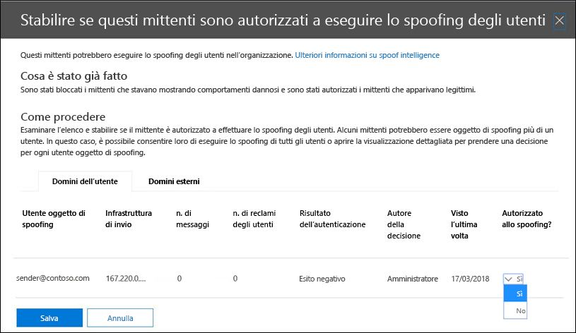
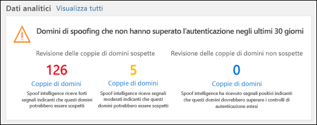
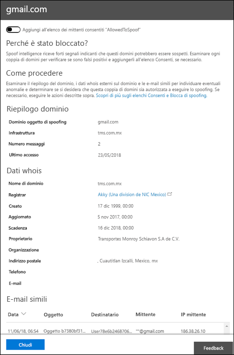

# <a name="manage-spoofed-senders-using-the-spoof-intelligence-policy-and-spoof-intelligence-insight-in-eop"></a>Gestire i mittenti contraffatti utilizzando i criteri di spoof intelligence e informazioni di spoof intelligence in EOP

[!INCLUDE [Microsoft 365 Defender rebranding](../includes/microsoft-defender-for-office.md)]

**Si applica a**
- [Microsoft Defender per Office 365 piano 1 e piano 2](defender-for-office-365.md)
- [Microsoft 365 Defender](../defender/microsoft-365-defender.md)

> [!NOTE]
> In questo articolo viene descritta la precedente esperienza di gestione dei mittenti falsificati che viene sostituita. Per ulteriori informazioni sulla nuova esperienza, vedere [Spoof intelligence insight in EOP](learn-about-spoof-intelligence.md)

Nelle organizzazioni Microsoft 365 con cassette postali in Exchange Online o in organizzazioni di Exchange Online Protection (EOP) autonome senza cassette postali di Exchange Online, i messaggi di posta elettronica in ingresso vengono automaticamente protetti da spoofing da EOP a partire da ottobre 2018. EOP usa **l'intelligence spoofing** come parte della difesa generale dell'organizzazione contro il phishing. Per ulteriori informazioni, vedere [Protezione anti-spoofing in EOP.](anti-spoofing-protection.md)

Il criterio di **spoof intelligence** predefinito (e solo) garantisce che i messaggi di posta elettronica falsificati inviati da mittenti legittimi non siano coinvolti nei filtri di posta indesiderata di EOP proteggendo gli utenti da attacchi di posta indesiderata o phishing. È inoltre possibile utilizzare le informazioni **di intelligence spoofing** per determinare rapidamente quali mittenti esterni stanno inviando legittimamente messaggi di posta elettronica non autenticati (messaggi provenienti da domini che non superano i controlli SPF, DKIM o DMARC).

È possibile gestire l'intelligence di spoofing nel Centro sicurezza & e conformità o in PowerShell (Exchange Online PowerShell per le organizzazioni Microsoft 365 con cassette postali in Exchange Online, PowerShell EOP autonomo per le organizzazioni senza cassette postali di Exchange Online).

## <a name="what-do-you-need-to-know-before-you-begin"></a>Che cosa è necessario sapere prima di iniziare

- Aprire il Centro sicurezza e conformità in <https://protection.office.com/>.
  - Per passare direttamente alla pagina **Impostazioni protezione da** posta indesiderata per il criterio di spoofing intelligence, utilizzare <https://protection.office.com/antispam> .
  - Per passare direttamente alla pagina **Dashboard di sicurezza** per le informazioni di spoofing intelligence, utilizzare <https://protection.office.com/searchandinvestigation/dashboard> .

- Per informazioni su come connettersi a PowerShell per Exchange Online, vedere [Connettersi a PowerShell per Exchange Online](/powershell/exchange/connect-to-exchange-online-powershell). Per connettersi a PowerShell di EOP autonomo, vedere [Connettersi a PowerShell per Exchange Online Protection](/powershell/exchange/connect-to-exchange-online-protection-powershell).

- Prima di eseguire le procedure descritte in questo articolo, occorre disporre delle autorizzazioni in **Exchange Online**:
  - Per modificare i criteri di spoof intelligence o abilitare o disabilitare l'intelligence spoofing, è necessario essere membri dei gruppi di ruoli **Gestione** organizzazione o **Amministratore** sicurezza.
  - Per l'accesso in sola lettura al criterio di spoof intelligence, è necessario essere membri dei gruppi di ruoli **Lettore** globale o **Lettore** di sicurezza.

  Per altre informazioni, vedere [Autorizzazioni in Exchange Online](/exchange/permissions-exo/permissions-exo).

  **Note**:

  - L'aggiunta di utenti al ruolo di Azure Active Directory corrispondente nell'interfaccia di amministrazione di Microsoft 365 fornisce agli utenti le autorizzazioni necessarie _e_ le autorizzazioni per altre funzionalità di Microsoft 365. Per altre informazioni, vedere [Informazioni sui ruoli di amministratore](../../admin/add-users/about-admin-roles.md).
  - Anche il gruppo di ruoli di **Gestione organizzazione sola visualizzazione** in [Exchange Online](/Exchange/permissions-exo/permissions-exo#role-groups) offre inoltre l'accesso di sola lettura a tale funzionalità.

- Le opzioni per spoof intelligence sono descritte in [Impostazioni spoofing nei criteri anti-phishing.](set-up-anti-phishing-policies.md#spoof-settings)

- È possibile abilitare, disabilitare e configurare le impostazioni di spoof intelligence nei criteri anti-phishing. Per istruzioni basate sull'abbonamento, vedere uno degli argomenti seguenti:

  - [Configurare i criteri anti-phishing in EOP](configure-anti-phishing-policies-eop.md).
  - [Configurare i criteri anti-phishing in Microsoft Defender per Office 365](configure-atp-anti-phishing-policies.md).

- Per le impostazioni consigliate per spoof intelligence, vedere [Impostazioni dei criteri anti-phishing EOP.](recommended-settings-for-eop-and-office365.md#eop-anti-phishing-policy-settings)

## <a name="manage-spoofed-senders"></a>Gestire mittenti contraffatti

Esistono due modi per consentire e bloccare i mittenti contraffatti:

- [Usare i criteri di spoof intelligence](#manage-spoofed-senders-in-the-spoof-intelligence-policy)
- [Usare le informazioni dettagliate di spoof intelligence](#manage-spoofed-senders-in-the-spoof-intelligence-insight)

### <a name="manage-spoofed-senders-in-the-spoof-intelligence-policy"></a>Gestire i mittenti falsificati nel criterio di spoof intelligence

1. Nel Centro sicurezza e conformità, andare a **Gestione delle minacce** \> **Criteri** \> **Filtro della posta indesiderata**.

2. Nella pagina **Impostazioni protezione da posta indesiderata** fare clic su Espandi icona per espandere Criteri di  **spoofing intelligence.**

   

3. Effettuare una delle seguenti selezioni:

   - **Rivedere i nuovi mittenti**
   - **Mostra mittenti già esaminati**

4. Nel riquadro a comparsa Decidi se questi mittenti sono autorizzati a **eseguire lo spoofing** dei tuoi utenti, seleziona una delle schede seguenti:

   - **Domini:** mittenti che effettuano spoofing degli utenti nei domini interni.
   - **Domini esterni:** mittenti che effettuano lo spoofing di utenti in domini esterni.

5. Fare  sull'icona Espandi nella colonna Consenti **spoofing?** . Scegliere **Sì** per consentire il mittente contraffatto oppure **No** per contrassegnare il messaggio come contraffatto. L'azione è controllata dal criterio anti-phishing predefinito o dai criteri anti-phishing personalizzati (il valore predefinito è Sposta il messaggio **nella cartella Posta indesiderata**). Per altre informazioni, vedere [Impostazioni di spoofing nei criteri anti-phishing](set-up-anti-phishing-policies.md#spoof-settings).

   

   Le colonne e i valori visualizzati sono illustrati nell'elenco seguente:

   - **Utente contraffatto:** account utente che viene contraffatto. Si tratta del mittente del messaggio nell'indirizzo mittente (noto anche come indirizzo) visualizzato `5322.From` nei client di posta elettronica. La validità di questo indirizzo non viene controllata da SPF.
     - Nella scheda **Domini,** il valore contiene un singolo indirizzo di posta elettronica oppure, se il server di posta elettronica di origine esegue lo spoofing di più account utente, contiene **più di un**.
     - Nella scheda **Domini esterni** il valore contiene il dominio dell'utente contraffatto, non l'indirizzo di posta elettronica completo.

   - **Infrastruttura di invio:** dominio trovato in una ricerca DNS inversa (record PTR) dell'indirizzo IP del server di posta elettronica di origine. Se l'indirizzo IP di origine non ha un record PTR, l'infrastruttura di invio viene identificata come \<source IP\> /24 (ad esempio, 192.168.100.100/24).

     Per ulteriori informazioni sulle origini dei messaggi e sui mittenti dei messaggi, vedere [Panoramica degli standard dei messaggi di posta elettronica.](how-office-365-validates-the-from-address.md#an-overview-of-email-message-standards)

   - **# di messaggi**: Numero di messaggi dall'infrastruttura di invio all'organizzazione che contengono il mittente o i mittenti contraffatti specificati negli ultimi 30 giorni.

   - **Numero di reclami degli** utenti: reclami da parte degli utenti nei confronti di questo mittente negli ultimi 30 giorni. I reclami sono in genere sotto forma di invii indesiderati a Microsoft.

   - **Risultato dell'autenticazione:** uno dei valori seguenti:
      - **Superato**: il mittente ha superato i controlli di autenticazione della posta elettronica del mittente (SPF o DKIM).
      - **Failed**: Il mittente non ha superato i controlli di autenticazione del mittente EOP.
      - **Sconosciuto:** il risultato di questi controlli non è noto.

   - **Decision set by**: Mostra chi ha determinato se l'infrastruttura di invio è autorizzata a effettuare lo spoofing dell'utente:
       - **Criteri di spoofing intelligence** (automatico)
       - **Amministratore** (manuale)

   - **Last seen**: Data dell'ultima ricezione di un messaggio dall'infrastruttura di invio contenente l'utente contraffatto.

   - **Consentito lo spoofing?**: I valori visualizzati qui sono:
     - **Sì:** i messaggi provenienti dalla combinazione di utenti contraffatti e infrastruttura di invio sono consentiti e non considerati messaggi di posta elettronica contraffatti.
     - **No**: i messaggi provenienti dalla combinazione di utenti contraffatti e infrastruttura di invio vengono contrassegnati come contraffatti. L'azione è controllata dal criterio anti-phishing predefinito o dai criteri anti-phishing personalizzati (il valore predefinito è Sposta il messaggio **nella cartella Posta indesiderata**). Per ulteriori informazioni, vedere la sezione successiva.

     - **Alcuni utenti** **(solo scheda Domini):** un'infrastruttura di invio sta effettuando lo spoofing di più utenti, in cui alcuni utenti contraffatti sono consentiti e altri no. Utilizzare la **scheda Dettagli** per visualizzare gli indirizzi specifici.

6. Nella parte inferiore della pagina fare clic su **Salva**.

#### <a name="use-powershell-to-manage-spoofed-senders"></a>Utilizzare PowerShell per gestire i mittenti contraffatti

Per visualizzare i mittenti consentiti e bloccati in spoof intelligence, utilizzare la sintassi seguente:

```powershell
Get-PhishFilterPolicy [-AllowedToSpoof <Yes | No | Partial>] [-ConfidenceLevel <Low | High>] [-DecisionBy <Admin | SpoofProtection>] [-Detailed] [-SpoofType <Internal | External>]
```

In questo esempio vengono restituite informazioni dettagliate su tutti i mittenti autorizzati a effettuare lo spoofing degli utenti nei domini.

```powershell
Get-PhishFilterPolicy -AllowedToSpoof Yes -Detailed -SpoofType Internal
```

Per informazioni dettagliate sulla sintassi e sui parametri, [vedere Get-PhishFilterPolicy](/powershell/module/exchange/get-phishfilterpolicy).

Per configurare i mittenti consentiti e bloccati in spoof intelligence, attenersi alla seguente procedura:

1. Acquisire l'elenco corrente dei mittenti contraffatti rilevati scrivendo l'output del cmdlet **Get-PhishFilterPolicy** in un file CSV eseguendo il comando seguente:

   ```powershell
   Get-PhishFilterPolicy -Detailed | Export-CSV "C:\My Documents\Spoofed Senders.csv"
   ```

2. Modificare il file CSV per aggiungere o modificare i valori seguenti:
   - **Mittente** (dominio nel record PTR del server di origine o nell'indirizzo IP/24)
   - **SpoofedUser**: Uno dei valori seguenti:
     - Indirizzo di posta elettronica dell'utente interno.
     - Dominio di posta elettronica dell'utente esterno.
     - Valore vuoto che indica se si desidera bloccare o consentire tutti i messaggi falsificati provenienti dal mittente **specificato,** indipendentemente dall'indirizzo di posta elettronica contraffatto.
   - **AllowedToSpoof** (Sì o No)
   - **SpoofType** (interno o esterno)

   Salvare il file, leggere il file e archiviare il contenuto come variabile denominata `$UpdateSpoofedSenders` eseguendo il comando seguente:

   ```powershell
   $UpdateSpoofedSenders = Get-Content -Raw "C:\My Documents\Spoofed Senders.csv"
   ```

3. Utilizzare la `$UpdateSpoofedSenders` variabile per configurare i criteri di spoof intelligence eseguendo il comando seguente:

   ```powershell
   Set-PhishFilterPolicy -Identity Default -SpoofAllowBlockList $UpdateSpoofedSenders
   ```

Per informazioni dettagliate sulla sintassi e sui parametri, [vedere Set-PhishFilterPolicy.](/powershell/module/exchange/set-phishfilterpolicy)

### <a name="manage-spoofed-senders-in-the-spoof-intelligence-insight"></a>Gestire i mittenti falsificati nell'analisi di spoof intelligence

1. Nel Centro sicurezza & conformità passare a **Dashboard di gestione delle** \> **minacce**.

2. Nella riga **Insights** cercare uno degli elementi seguenti:

   - **Domini contraffatti probabilmente negli ultimi sette** giorni: questa informazione indica che l'intelligence di spoofing è abilitata (è abilitata per impostazione predefinita).
   - **Abilita protezione da spoofing**: questa informazione indica che l'intelligence di spoofing è disabilitata e fare clic sull'analisi consente di abilitare l'intelligence di spoofing.

3. Le informazioni dettagliate nel dashboard mostrano informazioni come queste:

   

   Questa panoramica ha due modalità:

   - **Modalità di analisi:** se l'intelligence di spoofing è abilitata, le informazioni dettagliate mostrano quanti messaggi sono stati influenzati dalle funzionalità di spoof intelligence negli ultimi sette giorni.
   - **Cosa succede se la** modalità : se l'intelligence  di spoofing è disabilitata, le informazioni dettagliate mostrano quanti messaggi sarebbero stati influenzati dalle funzionalità di spoof intelligence negli ultimi sette giorni.

   In entrambi i casi, i domini contraffatti visualizzati nell'analisi sono suddivisi in due categorie: **domini** sospetti **e domini non sospetti.**

   - **Domini sospetti**:
     - **Spoofing** ad alta probabilità : in base ai modelli di invio cronologici e al punteggio di reputazione dei domini, è molto probabile che i domini siano contraffatti e che i messaggi provenienti da questi domini siano più dannosi.
     - **Spoofing** di probabilità moderato : in base ai modelli di invio cronologici e al punteggio di reputazione dei domini, siamo moderatamente sicuri che i domini siano contraffatti e che i messaggi inviati da questi domini siano legittimi. I falsi positivi sono più probabili in questa categoria rispetto allo spoofing ad alta probabilità.
   - **Domini non sospetti:** il dominio non ha superato l'autenticazione esplicita della posta elettronica [controlla SPF,](how-office-365-uses-spf-to-prevent-spoofing.md) [DKIM](use-dkim-to-validate-outbound-email.md)e [DMARC](use-dmarc-to-validate-email.md). Tuttavia, il dominio ha superato i controlli impliciti di autenticazione della posta elettronica ([autenticazione composita](email-validation-and-authentication.md#composite-authentication)). Di conseguenza, non è stata eseguita alcuna azione anti-spoofing sul messaggio.

#### <a name="view-detailed-information-about-suspicious-and-nonsuspicious-domains"></a>Visualizzare informazioni dettagliate sui domini sospetti e non sospetti

1. Nella pagina Spoof intelligence insight fare clic **su Domini sospetti** o Domini **non** sospetti per passare alla pagina Spoof **intelligence insight.** La **pagina Informazioni di spoofing** intelligence contiene le informazioni seguenti:

   - **Dominio contraffatto**: Dominio dell'utente contraffatto visualizzato  nella casella Da nei client di posta elettronica. Questo indirizzo è noto anche come `5322.From` indirizzo.
   - **Infrastruttura**: nota anche come infrastruttura _di invio._ Dominio trovato in una ricerca DNS inversa (record PTR) dell'indirizzo IP del server di posta elettronica di origine. Se l'indirizzo IP di origine non ha un record PTR, l'infrastruttura di invio viene identificata come \<source IP\> /24 (ad esempio, 192.168.100.100/24).
   - **Numero messaggi**: numero di messaggi dall'infrastruttura di invio all'organizzazione che contengono il dominio contraffatto specificato negli ultimi 7 giorni.
   - **Last seen**: Data dell'ultima ricezione di un messaggio dall'infrastruttura di invio contenente il dominio contraffatto.
   - **Tipo spoof**: questo valore è **External.**
   - **Consentito lo spoofing?**: I valori visualizzati qui sono:
     - **Sì:** i messaggi provenienti dalla combinazione del dominio dell'utente contraffatto e dell'infrastruttura di invio sono consentiti e non considerati messaggi di posta elettronica contraffatti.
     - **No**: i messaggi provenienti dalla combinazione del dominio dell'utente contraffatto e dell'infrastruttura di invio vengono contrassegnati come contraffatti. L'azione è controllata dal criterio anti-phishing predefinito o dai criteri anti-phishing personalizzati (il valore predefinito è Sposta il messaggio **nella cartella Posta indesiderata**).

2. Selezionare un elemento nell'elenco per visualizzare i dettagli sulla coppia dominio/infrastruttura di invio in un riquadro a comparsa. Le informazioni includono:
   - Perché l'abbiamo preso.
   - Cosa è necessario fare.
   - Riepilogo del dominio.
   - WhoIs i dati sul mittente.
   - Messaggi simili che abbiamo visto nel tenant dallo stesso mittente.

   Da qui puoi anche scegliere di aggiungere o rimuovere la coppia dominio/infrastruttura di invio **dall'elenco Consenti spoofing** dei mittenti consentiti. È sufficiente impostare l'interruttore di conseguenza.

   

## <a name="how-do-you-know-these-procedures-worked"></a>Come verificare se queste procedure hanno avuto esito positivo?

Per verificare di aver configurato l'intelligence di spoofing con i mittenti autorizzati e non autorizzati a effettuare lo spoofing, eseguire una delle operazioni seguenti:

- Nel Centro sicurezza & conformità, andare  a Gestione delle minacce Criteri Di protezione da posta indesiderata Espandere Criteri di spoofing intelligence selezionare Mostra mittenti già esaminati selezionare la scheda Domini o domini esterni e verificare il valore Consentito per \>  \>  \>  \> lo  \> **spoofing?**   per il mittente.

- In PowerShell, eseguire i comandi seguenti per visualizzare i mittenti consentiti e non autorizzati a effettuare lo spoofing:

  ```powershell
  Get-PhishFilterPolicy -AllowedToSpoof Yes -SpoofType Internal
  Get-PhishFilterPolicy -AllowedToSpoof No -SpoofType Internal
  Get-PhishFilterPolicy -AllowedToSpoof Yes -SpoofType External
  Get-PhishFilterPolicy -AllowedToSpoof No -SpoofType External
  ```

- In PowerShell, eseguire il comando seguente per esportare l'elenco di tutti i mittenti falsificati in un file CSV:

   ```powershell
   Get-PhishFilterPolicy -Detailed | Export-CSV "C:\My Documents\Spoofed Senders.csv"
   ```
