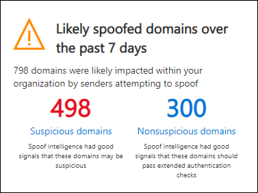

# Procedura dettagliata-spoofing Intelligence Insight in Microsoft Defender per Office 365Walkthrough - Spoof intelligence insight in Microsoft Defender for Office 365

[!INCLUDE [Microsoft 365 Defender rebranding](../includes/microsoft-defender-for-office.md)]

In Microsoft 365 organizzazioni con difensore per Office 365, è possibile utilizzare l'Insight Intelligence di spoofing per determinare rapidamente quali mittenti esterni stanno inviando legittimamente la posta elettronica non autenticata (messaggi provenienti da domini che non superano i controlli SPF, DKIM o DMARC).In Microsoft 365 organizations with Defender for Office 365, you can use the Spoof intelligence insight to quickly determine which external senders are legitimately sending you unauthenticated email (messages from domains that don't pass SPF, DKIM, or DMARC checks).

Consentendo ai mittenti esterni noti di inviare messaggi falsificati da posizioni note, è possibile ridurre i falsi positivi (buon messaggio di posta elettronica contrassegnato come cattivo).By allowing known external senders to send spoofed messages from known locations, you can reduce false positives (good email marked as bad). Monitorando i mittenti autorizzati falsificati, è possibile fornire un ulteriore livello di sicurezza per impedire l'arrivo di messaggi non sicuri nell'organizzazione.By monitoring the allowed spoofed senders, you provide an additional layer of security to prevent unsafe messages from arriving in your organization.

Per ulteriori informazioni sui report e sulle intuizioni, vedere [Reports and Insights in the Security & Compliance Center](reports-and-insights-in-security-and-compliance.md).For more information about reports and insights, see [Reports and insights in the Security & Compliance Center](reports-and-insights-in-security-and-compliance.md).

Questa procedura dettagliata è una delle numerose per il Centro sicurezza & Compliance.This walkthrough is one of several for the Security & Compliance Center. Per informazioni sull'esplorazione di report e approfondimenti, vedere le procedure dettagliate nella sezione [argomenti correlati](#related-topics) .To about navigating reports and insights, see the walkthroughs in the [Related topics](#related-topics) section.

## Che cosa è necessario sapere prima di iniziareWhat do you need to know before you begin?

- Aprire il Centro sicurezza e conformità in<https://protection.office.com/>.You open the Security & Compliance Center at <https://protection.office.com/>. Per accedere direttamente alla pagina del **dashboard di sicurezza** , utilizzare <https://protection.office.com/searchandinvestigation/dashboard> .To go directly to the **Security dashboard** page, use <https://protection.office.com/searchandinvestigation/dashboard>.

  È possibile visualizzare l'Insight di intelligence di spoofing da più di un dashboard nel centro sicurezza & Compliance.You can view the Spoof intelligence insight from more than one dashboard in the Security & Compliance Center. Indipendentemente dal dashboard che si sta esaminando, l'Insight fornisce gli stessi dettagli e consente di eseguire rapidamente le stesse attività.Regardless of which dashboard you're looking at, the insight provides the same details and allows you to quickly perform the same tasks.

- Prima di poter eseguire le procedure descritte in questo articolo, è necessario disporre delle autorizzazioni per il Centro sicurezza & Compliance:You need to be assigned permissions in the Security & Compliance Center before you can do the procedures in this article:
  - **Gestione organizzazione****Organization Management**
  - **Amministratore della sicurezza****Security Administrator**
  - **Lettore di sicurezza****Security Reader**
  - **Ruolo con autorizzazioni di lettura globali****Global Reader**

  **Nota**: l'aggiunta di utenti al ruolo di Azure Active Directory corrispondente nell'interfaccia di amministrazione di Microsoft 365 fornisce agli utenti le autorizzazioni necessarie nel centro sicurezza & Compliance _e_ le autorizzazioni per altre caratteristiche in Microsoft 365.**Note**: Adding users to the corresponding Azure Active Directory role in the Microsoft 365 admin center gives users the required permissions in the Security & Compliance Center _and_ permissions for other features in Microsoft 365. Per altre informazioni, vedere [Informazioni sui ruoli di amministratore](https://docs.microsoft.com/microsoft-365/admin/add-users/about-admin-roles).For more information, see [About admin roles](https://docs.microsoft.com/microsoft-365/admin/add-users/about-admin-roles).

- È possibile abilitare e disabilitare l'intelligence spoof nei criteri di anti-phishing in Microsoft Defender per Office 365.You enable and disable spoof intelligence in anti-phishing policies in Microsoft Defender for Office 365. L'intelligenza contraffatta è abilitata per impostazione predefinita.Spoof intelligence is enabled by default. Per ulteriori informazioni, vedere [Configure anti-phishing Policies in Microsoft Defender for Office 365](configure-atp-anti-phishing-policies.md).For more information, see [Configure anti-phishing policies in Microsoft Defender for Office 365](configure-atp-anti-phishing-policies.md).

- Per utilizzare l'intelligence spoof per monitorare e gestire i mittenti che inviano messaggi non autenticati, vedere [Configure Spoofing Intelligence in Microsoft 365](learn-about-spoof-intelligence.md).To use spoof intelligence to monitor and manage senders who are sending you unauthenticated messages, see [Configure spoof intelligence in Microsoft 365](learn-about-spoof-intelligence.md).

## Aprire lo spoofing Intelligence Insight nel centro sicurezza & ComplianceOpen the spoof intelligence insight in the Security & Compliance Center

1. Nel centro sicurezza & conformità, accedere a **Threat Management** \> **Dashboard.**In the Security & Compliance Center, go to **Threat Management** \> **Dashboard.**

2. Nella riga **Insights** cercare uno degli elementi seguenti:In the **Insights** row, look for one of the following items:

   - **Domini probabilmente contraffatti negli ultimi sette giorni**: questa intuizione indica che l'intelligence spoof è abilitata (è abilitata per impostazione predefinita).**Likely spoofed domains over the past seven days**: This insight indicates that spoof intelligence is enabled (it's enabled by default).
   - **Abilitare la protezione da spoofing**: questa intuizione indica che la falsificazione dell'intelligenza è disabilitata e facendo clic su Insight è possibile abilitare l'intelligence contraffatta.**Enable Spoof Protection**: This insight indicates that spoof intelligence is disabled, and clicking on the insight allows you to enable spoof intelligence.

3. L'Insight sul dashboard Visualizza informazioni di questo tipo:The insight on the dashboard shows you information like this:

   

   Questa intuizione ha due modalità:This insight has two modes:

   - **Modalità Insight**: se l'intelligence spoof è abilitata, l'Insight Visualizza il numero di messaggi che sono stati influenzati dalle funzionalità di intelligence spoof negli ultimi sette giorni.**Insight mode**: If spoof intelligence is enabled, the insight shows you how many messages were impacted by our spoof intelligence capabilities over the past seven days.
   - **Che cosa fare se la modalità**: se l'intelligence di spoofing è disabilitata, l'Insight mostrerà il numero *di messaggi che* sono stati influenzati dalle nostre funzionalità di intelligence spoof negli ultimi sette giorni.**What if mode**: If spoof intelligence is disabled, then the insight shows you how many messages *would* have been impacted by our spoof intelligence capabilities over the past seven days.

   In entrambi i casi, i domini falsificati visualizzati nell'Insight sono separati in due categorie: **domini sospetti** e **domini non sospetti**.Either way, the spoofed domains displayed in the insight are separated into two categories: **Suspicious domains** and **Non-suspicious domains**.

   - I **domini sospetti** includono:**Suspicious domains** include:

     - Spoof ad alta confidenza: sulla base dei modelli di invio storico e del Punteggio di reputazione dei domini, è estremamente sicuro che i domini siano spoofing e che i messaggi provenienti da questi domini abbiano maggiori probabilità di essere dannosi.High-confidence spoof: Based on the historical sending patterns and the reputation score of the domains, we're highly confident that the domains are spoofing, and messages from these domains are more likely to be malicious.

     - Falsificazione della confidenza moderata: in base ai modelli di invio cronologici e al Punteggio di reputazione dei domini, si è certi che i domini siano spoofing e che i messaggi inviati da questi domini siano legittimi.Moderate confidence spoof: Based on historical sending patterns and the reputation score of the domains, we're moderately confident that the domains are spoofing, and that messages sent from these domains are legitimate. I falsi positivi sono più probabili in questa categoria rispetto alla falsificazione con attendibilità elevata.False positives are more likely in this category than high-confidence spoof.

   **Domini non sospetti**: il dominio non è riuscito per l'autenticazione esplicita della posta elettronica controlli [SPF](how-office-365-uses-spf-to-prevent-spoofing.md), [DKIM](use-dkim-to-validate-outbound-email.md)e [DMARC](use-dmarc-to-validate-email.md)).**Non-suspicious domains**: The domain failed explicit email authentication checks [SPF](how-office-365-uses-spf-to-prevent-spoofing.md), [DKIM](use-dkim-to-validate-outbound-email.md), and [DMARC](use-dmarc-to-validate-email.md)). Tuttavia, il dominio ha superato i controlli di autenticazione della posta elettronica impliciti ([autenticazione composita](email-validation-and-authentication.md#composite-authentication)).However, the domain passed our implicit email authentication checks ([composite authentication](email-validation-and-authentication.md#composite-authentication)). Di conseguenza, non è stata eseguita alcuna azione antispoofing sul messaggio.As a result, no anti-spoofing action was taken on the message.

### Visualizzare informazioni dettagliate sui domini sospetti da spoofing Intelligence InsightView detailed information about suspicious domains from the Spoof intelligence insight

1. Nell'Insight Intelligence spoofing, fare clic su **domini sospetti** o su **domini non sospetti** per accedere alla pagina di **Insight Intelligence di spoofing** .On the Spoof intelligence insight, click **Suspicious domains** or **Non-suspicious domains** to go to the **Spoof intelligence insight** page. La pagina di **Insight Intelligence spoof** contiene le seguenti informazioni:The **Spoof Intelligence insight** page contains the following information:

   - **Dominio contraffatto**: il dominio dell'utente falsificato visualizzato nella casella **da** nei client di posta elettronica.**Spoofed domain**: The domain of the spoofed user that's displayed in the **From** box in email clients. Questo indirizzo è noto anche come `5322.From` indirizzo.This address is also known as the `5322.From` address.
   - **Infrastructure**: nota anche come _infrastruttura di invio_.**Infrastructure**: Also known as the _sending infrastructure_. Il dominio trovato in una ricerca DNS inversa (record PTR) dell'indirizzo IP del server di posta elettronica di origine.The domain found in a reverse DNS lookup (PTR record) of the source email server's IP address. Se l'indirizzo IP di origine non ha un record PTR, l'infrastruttura di invio viene identificata come \<source IP\> /24 (ad esempio, 192.168.100.100/24).If the source IP address has no PTR record, then the sending infrastructure is identified as \<source IP\>/24 (for example, 192.168.100.100/24).
   - **Conteggio messaggi**: il numero di messaggi dall'infrastruttura di invio all'organizzazione che contengono il dominio contraffatto specificato negli ultimi 7 giorni.**Message count**: The number of messages from the sending infrastructure to your organization that contain the specified spoofed domain within the last 7 days.
   - **Ultimo** aggiornamento: l'ultima data in cui un messaggio è stato ricevuto dall'infrastruttura di invio che contiene il dominio contraffatto.**Last seen**: The last date when a message was received from the sending infrastructure that contains the spoofed domain.
   - **Tipo di spoofing**: questo valore è **esterno**.**Spoof type**: This value is **External**.
   - **Consentita la falsificazione?**: i valori visualizzati qui sono:**Allowed to spoof?**: The values that you see here are:
     - **Yes**: i messaggi provenienti dalla combinazione del dominio dell'utente contraffatto e dell'infrastruttura di invio sono consentiti e non vengono considerati come posta elettronica contraffatta.**Yes**: Messages from the combination of spoofed user's domain and sending infrastructure are allowed and not treated as spoofed email.
     - **No**: i messaggi provenienti dalla combinazione del dominio dell'utente falsificato e dell'infrastruttura di invio sono contrassegnati come falsificati.**No**: Messages from the combination of spoofed user's domain and sending infrastructure are marked as spoofed. L'azione è controllata dal criterio anti-phishing predefinito o dai criteri di anti-phishing personalizzati (il valore predefinito è **spostamento messaggio nella cartella posta indesiderata**).The action is controlled by the default anti-phishing policy or custom anti-phishing policies (the default value is **Move message to Junk Email folder**).

     Per ulteriori informazioni, vedere [Configure anti-phishing Policies in Microsoft Defender for Office 365](configure-atp-anti-phishing-policies.md).For more information, see [Configure anti-phishing policies in Microsoft Defender for Office 365](configure-atp-anti-phishing-policies.md).

2. Selezionare un elemento nell'elenco per visualizzare i dettagli relativi alla coppia di infrastruttura di dominio/invio in un riquadro a comparsa.Select an item in the list to view details about the domain/sending infrastructure pair in a flyout. Le informazioni includono:The information includes:
   - Perché questo è stato rilevato.Why we caught this.
   - Cosa devi fare.What you need to do.
   - Riepilogo di un dominio.A domain summary.
   - Dati WhoIs sul mittente.WhoIs data about the sender.
   - Messaggi simili che sono stati visualizzati nel tenant dallo stesso mittente.Similar messages we have seen in your tenant from the same sender.

   Da qui, è anche possibile scegliere di aggiungere o rimuovere la coppia di domini/l'infrastruttura di invio dall'elenco dei mittenti consentiti **per spoofing** .From here, you can also choose to add or remove the domain/sending infrastructure pair from the **Allowed to spoof** sender allow list. È sufficiente impostare l'interruttore di conseguenza.Simply set the toggle accordingly.

   

### Aggiunta di un dominio all'elenco consentiti per la falsificazioneAdding a domain to the Allowed to spoof list

L'aggiunta di un dominio all'elenco consentiti per la falsificazione da spoofing Intelligence Insight consente solo la combinazione del dominio contraffatto *e* l'infrastruttura di invio.Adding a domain to the Allowed to spoof list from the spoof intelligence insight only allows the combination of the spoofed domain *and* the sending infrastructure. Non consente la posta elettronica dal dominio contraffatto da qualsiasi origine, né consente la posta elettronica dall'infrastruttura di invio per qualsiasi dominio.It does not allow email from the spoofed domain from any source, nor does it allow email from the sending infrastructure for any domain.

Ad esempio, il dominio seguente può essere consentito all'elenco dei messaggi consentiti per la falsificazione:For example, you allow the following domain to the Allowed to spoof list:

- **Dominio**: Gmail.com**Domain**: gmail.com
- **Infrastruttura**: TMS.MX.com**Infrastructure**: tms.mx.com

Solo la posta elettronica da quel dominio/coppia di infrastruttura di invio sarà consentita per la falsificazione.Only email from that domain/sending infrastructure pair will be allowed to spoof. Gli altri mittenti che tentano di falsificare gmail.com non sono consentiti.Other senders attempting to spoof gmail.com aren't allowed. I messaggi in altri domini di tms.mx.com vengono controllati da spoofing Intelligence.Messages in other domains from tms.mx.com are checked by spoof intelligence.

## Argomenti correlatiRelated topics

[Protezione anti-spoofing in Microsoft 365Anti-spoofing protection in Microsoft 365](anti-spoofing-protection.md)
