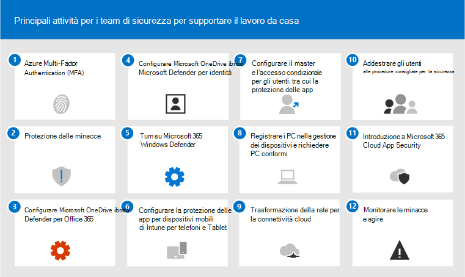
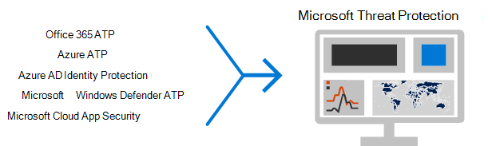

# Le 12 attività principali per i team di sicurezza per supportare il lavoro da casaTop 12 tasks for security teams to support working from home

Se sei come [Microsoft](https://www.microsoft.com/microsoft-365/blog/2020/03/10/staying-productive-while-working-remotely-with-microsoft-teams/) e improvvisamente ti trovi a supportare una forza lavoro principalmente basata su casa, vogliamo aiutarti a garantire che l'organizzazione funzioni nel modo più sicuro possibile.If you are like [Microsoft](https://www.microsoft.com/microsoft-365/blog/2020/03/10/staying-productive-while-working-remotely-with-microsoft-teams/) and suddenly find yourself supporting a primarily home-based workforce, we want to help you ensure your organization is working as securely as possible. In questo articolo vengono assegnate priorità alle attività per consentire ai team di sicurezza di implementare le funzionalità di sicurezza più importanti nel più breve tempo possibile.This article prioritizes tasks to help security teams implement the most important security capabilities as quickly as possible.

Se si è un'organizzazione di piccole o medie dimensioni che utilizza uno dei piani aziendali di Microsoft, vedere queste risorse:If you are a small or medium-size organization using one of Microsoft's business plans, see these resources instead:

- [10 modi principali per proteggere i piani di Office 365 e Microsoft 365 per le aziendeTop 10 ways to secure Office 365 and Microsoft 365 for business plans](../admin/security-and-compliance/secure-your-business-data.md)
- [Microsoft 365 for Campaigns](../campaigns/index.md) (include una configurazione di sicurezza consigliata per Microsoft 365 Business)[Microsoft 365 for Campaigns](../campaigns/index.md) (includes a recommended security configuration for Microsoft 365 Business)

Per i clienti che usano i piani aziendali, Microsoft consiglia di completare le attività elencate nella tabella seguente che si applicano al piano di servizio.For customers using our enterprise plans, Microsoft recommends you complete the tasks listed in the following table that apply to your service plan. Se invece di acquistare un piano aziendale di Microsoft 365, si combinano sottoscrizioni, tenere presente quanto segue:If, instead of purchasing a Microsoft 365 enterprise plan, you are combining subscriptions, note the following:

- Microsoft 365 E3 include Enterprise Mobility + Security (EMS) E3 e Azure AD P1Microsoft 365 E3 includes Enterprise Mobility + Security (EMS) E3 and Azure AD P1
- Microsoft 365 E5 include EMS E5 e Azure AD P2Microsoft 365 E5 includes EMS E5 and Azure AD P2

****

|PassaggioStep|AttivitàTask|Tutti i piani di Office 365 EnterpriseAll Office 365 Enterprise plans|Microsoft 365 E3Microsoft 365 E3|Microsoft 365 E5Microsoft 365 E5|
|---|---|---|---|---|
|11|[Abilitare Azure AD Multi-Factor Authentication (MFA)Enable Azure AD Multi-Factor Authentication (MFA)](#1-enable-azure-ad-multi-factor-authentication-mfa)||||
|2 2|[Protezione contro le minacceProtect against threats](#2-protect-against-threats)||||
|3 3|[Configurare Microsoft Defender per Office 365Configure Microsoft Defender for Office 365](#3-configure-microsoft-defender-for-office-365)||||
|4 4|[Configurare Microsoft Defender per l'identitàConfigure Microsoft Defender for Identity](#4-configure-microsoft-defender-for-identity)||||
|5 5|[Attivare Microsoft 365 DefenderTurn on Microsoft 365 Defender](#5-turn-on-microsoft-365-defender)||||
|6 6|[Configurare la protezione delle app per dispositivi mobili di Intune per telefoni e tabletConfigure Intune mobile app protection for phones and tablets](#6-configure-intune-mobile-app-protection-for-phones-and-tablets)||||
|7 7|[Configurare L'autenticazione a più fattori e l'accesso condizionale per gli utenti guest, inclusa la protezione delle app di IntuneConfigure MFA and conditional access for guests, including Intune app protection](#7-configure-mfa-and-conditional-access-for-guests-including-intune-mobile-app-protection)||||
|8 8|[Registrare i PC nella gestione dei dispositivi e richiedere PC conformiEnroll PCs into device management and require compliant PCs](#8-enroll-pcs-into-device-management-and-require-compliant-pcs)||||
|9 9|[Ottimizzare la rete per la connettività cloudOptimize your network for cloud connectivity](#9-optimize-your-network-for-cloud-connectivity)||||
|10  10|[Formare gli utentiTrain users](#10-train-users)||||
|11 11|[Introduzione a Microsoft Cloud App SecurityGet started with Microsoft Cloud App Security](#11-get-started-with-microsoft-cloud-app-security)||||
|12 12|[Monitorare le minacce ed eseguire azioniMonitor for threats and take action](#12-monitor-for-threats-and-take-action)||||
|

Prima di iniziare, controllare il [punteggio di protezione di Microsoft 365](./mtp/microsoft-secure-score.md) nel Centro sicurezza Microsoft 365.Before you begin, check your [Microsoft 365 Secure Score](./mtp/microsoft-secure-score.md) in the Microsoft 365 security center. Da un dashboard centralizzato, è possibile monitorare e migliorare la sicurezza per le identità, i dati, le app, i dispositivi e l'infrastruttura di Microsoft 365.From a centralized dashboard, you can monitor and improve the security for your Microsoft 365 identities, data, apps, devices, and infrastructure. Vengono forniti punti per la configurazione delle funzionalità di sicurezza consigliate, l'esecuzione di attività correlate alla sicurezza (ad esempio la visualizzazione di report) o la gestione di suggerimenti con un'applicazione o un software di terze parti.You are given points for configuring recommended security features, performing security-related tasks (such as viewing reports), or addressing recommendations with a third-party application or software. Le attività consigliate in questo articolo aumentano il punteggio.The recommended tasks in this article will raise your score.

## 1: abilitare Azure AD Multi-Factor Authentication (MFA)1: Enable Azure AD Multi-Factor Authentication (MFA)

L'unica cosa migliore che puoi fare per migliorare la sicurezza per i dipendenti che lavorano da casa è attivare la MFA.The single best thing you can do to improve security for employees working from home is to turn on MFA. Se non hai già processi in atto, consideralo come un progetto pilota di emergenza e assicurati di avere persone di supporto pronte ad aiutare i dipendenti che si bloccano.If you don't already have processes in place, treat this as an emergency pilot and make sure you have support folks ready to help employees who get stuck. Dato che probabilmente non puoi distribuire dispositivi di sicurezza hardware, usa la biometria di Windows Hello e le app di autenticazione degli smartphone come Microsoft Authenticator.As you probably can't distribute hardware security devices, use Windows Hello biometrics and smartphone authentication apps like Microsoft Authenticator.

In genere, Microsoft consiglia di concedere agli utenti 14 giorni per registrare il dispositivo per l'autenticazione a più fattori prima di richiedere l'autenticazione a più fattori.Normally, Microsoft recommends you give users 14 days to register their device for Multi-Factor Authentication before requiring MFA. Tuttavia, se la forza lavoro sta improvvisamente lavorando da casa, procedere e richiedere l'autenticazione a più fattori come priorità di sicurezza ed essere pronti ad aiutare gli utenti che ne hanno bisogno.However, if your workforce is suddenly working from home, go ahead and require MFA as a security priority and be prepared to help users who need it.

L'applicazione di questi criteri può richiedere solo pochi minuti, ma è necessario essere pronti a supportare gli utenti nei giorni successivi.Applying these policies will take only a few minutes, but be prepared to support your users over the next several days.

****

|PianoPlan|ConsiglioRecommendation|
|---|---|
|Piani di Microsoft 365 (senza Azure AD P1 o P2)Microsoft 365 plans (without Azure AD P1 or P2)|[Abilitare le impostazioni predefinite di sicurezza in Azure AD](/azure/active-directory/fundamentals/concept-fundamentals-security-defaults).[Enable Security defaults in Azure AD](/azure/active-directory/fundamentals/concept-fundamentals-security-defaults). Le impostazioni predefinite di sicurezza in Azure AD includono la MFA per utenti e amministratori.Security defaults in Azure AD include MFA for users and administrators.|
|Microsoft 365 E3 (con Azure AD P1)Microsoft 365 E3 (with Azure AD P1)|Usare i [criteri comuni di accesso condizionale](/azure/active-directory/conditional-access/concept-conditional-access-policy-common) per configurare i criteri seguenti:Use [Common Conditional Access policies](/azure/active-directory/conditional-access/concept-conditional-access-policy-common) to configure the following policies:  - [Richiedere la MFA per amministratori](/azure/active-directory/conditional-access/howto-conditional-access-policy-admin-mfa)- [Require MFA for administrators](/azure/active-directory/conditional-access/howto-conditional-access-policy-admin-mfa)  - [Richiedere la MFA per tutti gli utenti](/azure/active-directory/conditional-access/howto-conditional-access-policy-all-users-mfa)- [Require MFA for all users](/azure/active-directory/conditional-access/howto-conditional-access-policy-all-users-mfa)   - [Bloccare l'autenticazione legacy](/azure/active-directory/conditional-access/howto-conditional-access-policy-block-legacy)- [Block legacy authentication](/azure/active-directory/conditional-access/howto-conditional-access-policy-block-legacy)|
|Microsoft 365 E5 (con Azure AD P2)Microsoft 365 E5 (with Azure AD P2)|Sfruttando Azure AD Identity Protection, iniziare a implementare il [set raccomandato di accesso condizionale e criteri correlati](./office-365-security/identity-access-policies.md) di Microsoft creando questi due criteri:Taking advantage of Azure AD Identity Protection, begin to implement Microsoft's [recommended set of conditional access and related policies](./office-365-security/identity-access-policies.md) by creating these two policies:  - [Richiedere la MFA quando il rischio di accesso è considerato *medio* o *elevato*](./office-365-security/identity-access-policies.md#require-mfa-based-on-sign-in-risk)- [Require MFA when sign-in risk is medium or high](./office-365-security/identity-access-policies.md#require-mfa-based-on-sign-in-risk)  - [Bloccare i client che non supportano l'autenticazione moderna](./office-365-security/identity-access-policies.md#block-clients-that-dont-support-multi-factor)- [Block clients that don't support modern authentication](./office-365-security/identity-access-policies.md#block-clients-that-dont-support-multi-factor) - [Gli utenti a rischio elevato devono modificare la password](./office-365-security/identity-access-policies.md#high-risk-users-must-change-password)- [High risk users must change password](./office-365-security/identity-access-policies.md#high-risk-users-must-change-password)|
|

## 2: Proteggere dalle minacce2: Protect against threats

Tutti i piani di Microsoft 365 includono un'ampia gamma di funzionalità di protezione dalle minacce.All Microsoft 365 plans include a variety of threat protection features. La protezione avanzata per queste funzionalità richiede solo pochi minuti.Bumping up protection for these features takes just a few minutes.

- Protezione anti-malwareAnti-malware protection
- Protezione da URL e file dannosiProtection from malicious URLs and files
- Protezione anti-phishingAnti-phishing protection
- Protezione dalla posta indesiderataAnti-spam protection

Vedere [Protezione dalle minacce in Office 365](office-365-security/protect-against-threats.md) per indicazioni che è possibile usare come punto di partenza.See [Protect against threats in Office 365](office-365-security/protect-against-threats.md) for guidance you can use as a starting point.

## 3: Configurare Microsoft Defender per Office 3653: Configure Microsoft Defender for Office 365

Microsoft Defender per Office 365, incluso in Microsoft 365 E5 e Office 365 E5, protegge l'organizzazione dalle minacce dannose poste da messaggi di posta elettronica, collegamenti (URL) e strumenti di collaborazione.Microsoft Defender for Office 365, included with Microsoft 365 E5 and Office 365 E5, safeguards your organization against malicious threats posed by email messages, links (URLs) and collaboration tools. La configurazione può richiedere diverse ore.This can take several hours to configure.

Microsoft Defender per Office 365:Microsoft Defender for Office 365:

- Protegge l'organizzazione da minacce di posta elettronica sconosciute in tempo reale utilizzando sistemi intelligenti che controllano allegati e collegamenti alla ricerca di contenuti dannosi.Protects your organization from unknown email threats in real-time by using intelligent systems that inspect attachments and links for malicious content. Questi sistemi automatizzati includono una solida piattaforma di detonazione, euristica e modelli di machine learning.These automated systems include a robust detonation platform, heuristics, and machine learning models.
- Protegge l'organizzazione quando gli utenti collaborano e condividono file, identificando e bloccando file dannosi nei siti del team e nelle raccolte documenti.Protects your organization when users collaborate and share files, by identifying and blocking malicious files in team sites and document libraries.
- Applica modelli di machine learning e algoritmi avanzati di rilevamento della rappresentazione per evitare attacchi di phishing.Applies machine learning models and advanced impersonation-detection algorithms to avert phishing attacks.

Per una panoramica, incluso un riepilogo dei piani, vedere [Defender for Office 365](office-365-security/office-365-atp.md).For an overview, including a summary of plans, see [Defender for Office 365](office-365-security/office-365-atp.md).

L'amministratore globale può configurare queste protezioni:Your Global Administrator can configure these protections:

- [Configurare i criteri collegamenti sicuriSet up Safe Links policies](office-365-security/set-up-atp-safe-links-policies.md)
- [Configurare le impostazioni globali per i collegamenti sicuriConfigure global settings for Safe Links](office-365-security/configure-global-settings-for-safe-links.md)
- [Configurare i criteri allegati sicuriSet up Safe Attachments policies](office-365-security/set-up-atp-safe-attachments-policies.md)

È necessario collaborare con l'amministratore di Exchange Online e l'amministratore di SharePoint Online per configurare Defender per Office 365 per questi carichi di lavoro:You'll need to work with your Exchange Online administrator and SharePoint Online administrator to configure Defender for Office 365 for these workloads:

- [ATP per SharePoint, OneDrive e Microsoft TeamsATP for SharePoint, OneDrive, and Microsoft Teams](office-365-security/atp-for-spo-odb-and-teams.md)

## 4: Configurare Microsoft Defender per l'identità4: Configure Microsoft Defender for Identity

[Microsoft Defender per identità](/azure-advanced-threat-protection/what-is-atp) è una soluzione di sicurezza basata sul cloud che sfrutta i segnali di Active Directory locali per identificare, rilevare e analizzare minacce avanzate, identità compromesse ed azioni Insider dannose dirette all'organizzazione.[Microsoft Defender for Identity](/azure-advanced-threat-protection/what-is-atp) is a cloud-based security solution that leverages your on-premises Active Directory signals to identify, detect, and investigate advanced threats, compromised identities, and malicious insider actions directed at your organization. Concentrarsi su questo passaggio successivo perché protegge l'infrastruttura locale e cloud, non ha dipendenze o prerequisiti e può offrire vantaggi immediati.Focus on this next because it protects your on-prem and your cloud infrastructure, has no dependencies or prerequisites, and can provide immediate benefit.

- Vedi [Le guide introduttive a Microsoft Defender per l'identità](/azure-advanced-threat-protection/install-atp-step1) per ottenere rapidamente la configurazioneSee [Microsoft Defender for Identity Quickstarts](/azure-advanced-threat-protection/install-atp-step1) to get setup quickly
- Video: [Introduzione a Microsoft Defender for Identity](https://www.youtube.com/watch?reload=9&v=EGY2m8yU_KE)Watch [Video: Introduction to Microsoft Defender for Identity](https://www.youtube.com/watch?reload=9&v=EGY2m8yU_KE)
- Esaminare le [tre fasi della distribuzione di Microsoft Defender for Identity](/azure-advanced-threat-protection/what-is-atp#whats-next)Review the [three phases of Microsoft Defender for Identity deployment](/azure-advanced-threat-protection/what-is-atp#whats-next)

## 5: Attivare Microsoft 365 Defender5: Turn on Microsoft 365 Defender

Dopo aver configurato Microsoft Defender per Office 365 e Microsoft Defender for Identity, è possibile visualizzare i segnali combinati di queste funzionalità in un unico dashboard.Now that you have Microsoft Defender for Office 365 and Microsoft Defender for Identity configured, you can view the combined signals from these capabilities in one dashboard. [Microsoft 365 Defender](./mtp/microsoft-threat-protection.md) riunisce avvisi, eventi imprevisti, analisi e risposta automatizzate e ricerca avanzata tra i carichi di lavoro (Microsoft Defender for Identity, Defender per Office 365, Microsoft Defender for Endpoint e Microsoft Cloud App Security) in un singolo riquadro [in security.microsoft.com](https://security.microsoft.com).[Microsoft 365 Defender](./mtp/microsoft-threat-protection.md) brings together alerts, incidents, automated investigation and response, and advanced hunting across workloads (Microsoft Defender for Identity, Defender for Office 365, Microsoft  Defender for Endpoint, and Microsoft Cloud App Security) into a single pane at [security.microsoft.com](https://security.microsoft.com).

Dopo aver configurato uno o più dei servizi defender per Office 365, attivare MTP.After you have configured one or more of your Defender for Office 365 services, turn on MTP. Le nuove funzionalità vengono aggiunte continuamente a MTP; prendere in considerazione la possibilità di acconsentire esplicitamente alla ricezione delle funzionalità di anteprima.New features are added continually to MTP; consider opting in to receive preview features.

- [Ulteriori informazioni su MTPLearn more about MTP](./mtp/microsoft-threat-protection.md)
- [Attivare MTPTurn on MTP](./mtp/mtp-enable.md)
- [Acconsentire esplicitamente alle funzionalità di anteprimaOpt in for preview features](./mtp/preview.md)

## 6: Configurare la protezione delle app per dispositivi mobili di Intune per telefoni e tablet6: Configure Intune mobile app protection for phones and tablets

Microsoft Intune Mobile Application Management (MAM) consente di gestire e proteggere i dati dell'organizzazione su telefoni e tablet senza gestire questi dispositivi.Microsoft Intune Mobile Application Management (MAM) allows you to manage and protect your organization's data on phones and tablets without managing these devices. Tenere presente quanto segue:Here's how it works:

- Crei un criterio di protezione app (APP) che determina quali app in un dispositivo sono gestite e quali comportamenti sono consentiti (ad esempio, impedire la copia dei dati di un'app gestita in un'app non gestita).You create an App Protection Policy (APP) that determines which apps on a device are managed and what behaviors are allowed (such as preventing data from a managed app from being copied to an unmanaged app). Puoi creare un criterio per ogni piattaforma (iOS, Android).You create one policy for each platform (iOS, Android).
- Dopo aver creato i criteri di protezione delle app, applicali creando una regola di accesso condizionale in Azure AD per richiedere app approvate e protezione dei dati app.After creating the app protection policies, you enforce these by creating a conditional access rule in Azure AD to require approved apps and APP data protection.

I criteri di protezione app includono molte impostazioni.APP protection policies include many settings. Fortunatamente, non è necessario conoscere tutte le impostazioni e valutare le opzioni.Fortunately, you don't need to learn about every setting and weigh the options. Microsoft semplifica l'applicazione di una configurazione delle impostazioni consigliando i punti di partenza.Microsoft makes it easy to apply a configuration of settings by recommending starting points. Il [framework di protezione dei dati che usa](/mem/intune/apps/app-protection-framework) i criteri di protezione delle app include tre livelli tra cui puoi scegliere.The [Data protection framework using app protection policies](/mem/intune/apps/app-protection-framework) includes three levels you can choose from.

Ancora meglio, Microsoft coordina questo framework di protezione delle app con un set di accesso condizionale e criteri correlati che consigliamo a tutte le organizzazioni di usare come punto di partenza.Even better, Microsoft coordinates this app protection framework with a set of conditional access and related policies we recommend all organizations use as a starting point. Se hai implementato L'autenticazione a più fattori usando le linee guida di questo articolo, sei a metà strada!If you've implemented MFA using the guidance in this article, you're half way there!

Per configurare la protezione delle app per dispositivi mobili, usa le indicazioni in [Criteri comuni di identità e accesso ai dispositivi:](./office-365-security/identity-access-policies.md)To configure mobile app protection, use the guidance in [Common identity and device access policies](./office-365-security/identity-access-policies.md):

 1. Usa la [guida Applica criteri di protezione dei](./office-365-security/identity-access-policies.md#apply-app-data-protection-policies) dati APP per creare criteri per iOS e Android.Use the [Apply APP data protection policies](./office-365-security/identity-access-policies.md#apply-app-data-protection-policies) guidance to create policies for iOS and Android. Il livello 2 (protezione avanzata dei dati) è consigliato per la protezione di base.Level 2 (enhanced data protection) is recommended for baseline protection.
 2. Creare una regola di accesso condizionale in [Richiedi app approvate e protezione APP.](./office-365-security/identity-access-policies.md#require-approved-apps-and-app-protection)Create a conditional access rule to [Require approved apps and APP protection](./office-365-security/identity-access-policies.md#require-approved-apps-and-app-protection).

## 7: Configurare L'autenticazione a più fattori e l'accesso condizionale per gli utenti guest, inclusa la protezione delle app per dispositivi mobili di Intune7: Configure MFA and conditional access for guests, including Intune mobile app protection

Successivamente, è possibile continuare a collaborare e collaborare con gli utenti guest.Next, let's ensure you can continue to collaborate and work with guests. Se si usa il piano Microsoft 365 E3 e si è implementata l'autenticazione a più fattori per tutti gli utenti, si è impostato.If you're using the Microsoft 365 E3 plan and you implemented MFA for all users, you're set.

Se si usa il piano Microsoft 365 E5 e si sfrutta Azure Identity Protection per la MFA basata sui rischi, è necessario apportare un paio di modifiche (perché Azure AD Identity Protection non si estende ai guest):If you're using the Microsoft 365 E5 plan and you're taking advantage of Azure Identity Protection for risk-based MFA, you need to make a couple of adjustments (because Azure AD Identity protection doesn't extend to guests):

- Creare una nuova regola di accesso condizionale per richiedere L'autenticazione a più fattori sempre per gli utenti guest e esterni.Create a new conditional access rule to require MFA always for guests and external users.
- Aggiornare la regola di accesso condizionale MFA basata sui rischi per escludere utenti guest e utenti esterni.Update the risk-based MFA conditional access rule to exclude guests and external users.

Usa le indicazioni disponibili in Aggiornamento dei criteri comuni per consentire e proteggere l'accesso [guest](./office-365-security/identity-access-policies-guest-access.md) ed esterno per comprendere il funzionamento dell'accesso guest con Azure AD e aggiornare i criteri interessati.Use the guidance in [Updating the common policies to allow and protect guest and external access](./office-365-security/identity-access-policies-guest-access.md) to understand how guest access works with Azure AD and to update the affected policies.

I criteri di protezione delle app per dispositivi mobili di Intune creati, insieme alla regola di accesso condizionale per richiedere app approvate e protezione app, si applicano agli account guest e consentono di proteggere i dati dell'organizzazione.The Intune mobile app protection policies you created, together with the conditional access rule to require approved apps and APP protection, apply to guests accounts and will help protect your organization data.

> [!NOTE]
> Se hai già registrato i PC nella gestione dei dispositivi per richiedere PC conformi, dovrai anche escludere gli account guest dalla regola di accesso condizionale che impone la conformità dei dispositivi.If you've already enrolled PCs into device management to require compliant PCs, you'll also need to exclude guest accounts from the conditional access rule that enforces device compliance.

## 8: registrare i PC nella gestione dei dispositivi e richiedere PC conformi8: Enroll PCs into device management and require compliant PCs

Esistono diversi metodi per registrare i dispositivi della forza lavoro.There are several methods to enroll your workforce's devices. Ogni metodo dipende dalla proprietà del dispositivo (personale o aziendale), dal tipo di dispositivo (iOS, Windows, Android) e dai requisiti di gestione (reimpostazione, affinità, blocco).Each method depends on the device's ownership (personal or corporate), device type (iOS, Windows, Android), and management requirements (resets, affinity, locking). L'operazione può richiedere un po' di tempo. Vedere: [Registrare i dispositivi in Microsoft Intune](/mem/intune/enrollment/).This can take a bit of time to sort out. See: [Enroll devices in Microsoft Intune](/mem/intune/enrollment/).

Il modo più rapido per iniziare è configurare [la registrazione automatica per i dispositivi Windows 10.](/mem/intune/enrollment/quickstart-setup-auto-enrollment)The quickest way to get going is to [Set up automatic enrollment for Windows 10 devices](/mem/intune/enrollment/quickstart-setup-auto-enrollment).

Puoi anche trarre vantaggio da queste esercitazioni:You can also take advantage of these tutorials:

- [Usare Autopilot per registrare i dispositivi Windows in IntuneUse Autopilot to enroll Windows devices in Intune](/mem/intune/enrollment/tutorial-use-autopilot-enroll-devices)
- [Usare le funzionalità di registrazione dei dispositivi aziendali di Apple in Apple Business Manager (ABM) per registrare i dispositivi iOS/iPadOS in IntuneUse Apple's Corporate Device Enrollment features in Apple Business Manager (ABM) to enroll iOS/iPadOS devices in Intune](/mem/intune/enrollment/tutorial-use-device-enrollment-program-enroll-ios)

Dopo la registrazione dei dispositivi, usa le indicazioni in [Criteri di identità](./office-365-security/identity-access-policies.md) e accesso ai dispositivi comuni per creare questi criteri:After enrolling devices, use the guidance in [Common identity and device access policies](./office-365-security/identity-access-policies.md) to create these policies:

- [Definire i criteri di conformità dei](./office-365-security/identity-access-policies.md#define-device-compliance-policies) dispositivi: le impostazioni consigliate per Windows 10 includono la richiesta di protezione antivirus.[Define device-compliance policies](./office-365-security/identity-access-policies.md#define-device-compliance-policies) — The recommended settings for Windows 10 include requiring antivirus protection. Se hai Microsoft 365 E5, usa Microsoft Defender for Endpoint per monitorare l'integrità dei dispositivi dei dipendenti.If you have Microsoft 365 E5, use Microsoft Defender for Endpoint to monitor the health of employee devices. Assicurarsi che i criteri di conformità per altri sistemi operativi includano la protezione antivirus e il software di protezione end-point.Be sure compliance policies for other operating systems include antivirus protection and end-point protection software.
- [Richiedi PC conformi: questa](./office-365-security/identity-access-policies.md#require-compliant-pcs-but-not-compliant-phones-and-tablets) è la regola di accesso condizionale in Azure AD che applica i criteri di conformità dei dispositivi.[Require compliant PCs](./office-365-security/identity-access-policies.md#require-compliant-pcs-but-not-compliant-phones-and-tablets) — This is the conditional access rule in Azure AD that enforces the device compliance policies.

Solo un'organizzazione può gestire un dispositivo, quindi assicurati di escludere gli account guest dalla regola di accesso condizionale in Azure AD.Only one organization can manage a device, so be sure to exclude guest accounts from the conditional access rule in Azure AD. Se non si escludono utenti guest ed esterni dai criteri che richiedono la conformità dei dispositivi, questi criteri bloccheranno questi utenti.If you don't exclude guest and external users from policies that require device compliance, these policies will block these users. Per ulteriori informazioni, vedere [Aggiornamento dei criteri comuni per consentire e proteggere l'accesso guest ed esterno.](./office-365-security/identity-access-policies-guest-access.md)For more information, see [Updating the common policies to allow and protect guest and external access](./office-365-security/identity-access-policies-guest-access.md).

## 9: Ottimizzare la rete per la connettività cloud9: Optimize your network for cloud connectivity

Se si abilita rapidamente la maggior parte dei dipendenti a lavorare da casa, questo cambio improvviso di modelli di connettività può avere un impatto significativo sull'infrastruttura di rete aziendale.If you are rapidly enabling the bulk of your employees to work from from home, this sudden switch of connectivity patterns can have a significant impact on the corporate network infrastructure. Molte reti sono state ridimensionate e progettate prima dell'adozione dei servizi cloud.Many networks were scaled and designed before cloud services were adopted. In molti casi, le reti sono tolleranti per i lavoratori remoti, ma non sono state progettate per essere utilizzate in remoto da tutti gli utenti contemporaneamente.In many cases, networks are tolerant of remote workers, but were not designed to be used remotely by all users simultaneously.

Gli elementi di rete come i concentratori VPN, le apparecchiature di uscita della rete centrale (come proxy e dispositivi di prevenzione della perdita di dati), la larghezza di banda internet centrale, i circuiti MPLS di backhaul, la funzionalità NAT e così via vengono improvvisamente messi sotto pressione a causa del carico dell'intera azienda che li utilizza.Network elements such as VPN concentrators, central network egress equipment (such as proxies and data loss prevention devices), central internet bandwidth, backhaul MPLS circuits, NAT capability and so on are suddenly put under enormous strain due to the load of the entire business using them. Il risultato finale sono prestazioni e produttività scarse, insieme a un'esperienza utente scarsa per gli utenti che si adattano al lavoro da casa.The end result is poor performance and productivity coupled with a poor user experience for users who are adapting to working from home.

Alcune delle protezioni tradizionalmente fornite dal routing del traffico attraverso una rete aziendale sono fornite dalle app cloud a cui accedono gli utenti.Some of the protections that have traditionally been provided by routing traffic back through a corporate network are provided by the cloud apps your users are accessing. Se hai raggiunto questo passaggio in questo articolo, hai implementato un set di controlli di sicurezza cloud sofisticati per i dati e i servizi di Microsoft 365.If you've reached this step in this article, you've implemented a set of sophisticated cloud security controls for Microsoft 365 services and data. Con questi controlli in atto, potrebbe essere possibile instradare il traffico degli utenti remoti direttamente a Office 365.With these controls in place, you may be ready to route remote users' traffic directly to Office 365. Se è ancora necessario un collegamento VPN per l'accesso ad altre applicazioni, è possibile migliorare notevolmente le prestazioni e l'esperienza utente implementando lo split tunneling.If you still require a VPN link for access to other applications, you can greatly improve your performance and user experience by implementing split tunneling. Una volta raggiunto un accordo nell'organizzazione, questo può essere ottenuto entro un giorno da un team di rete ben coordinato.Once you achieve agreement in your organization, this can be accomplished within a day by a well-coordinated network team.

Per ulteriori informazioni, vedere queste risorse in Documenti:See these resources on Docs for more information:

- [Panoramica: ottimizzare la connettività per gli utenti remoti tramite split tunneling VPNOverview: Optimize connectivity for remote users using VPN split tunneling](/Office365/Enterprise/office-365-vpn-split-tunnel)
- [Implementazione dello split tunneling per VPN per Office 365Implementing VPN split tunneling for Office 365](/Office365/Enterprise/office-365-vpn-implement-split-tunnel)

Articoli di blog recenti su questo argomento:Recent blog articles on this topic:

- [Come ottimizzare rapidamente il traffico per il personale & ridurre il carico sull'infrastrutturaHow to quickly optimize traffic for remote staff & reduce the load on your infrastructure](https://techcommunity.microsoft.com/t5/office-365-blog/how-to-quickly-optimize-office-365-traffic-for-remote-staff-amp/ba-p/1214571#)
- [Modi alternativi per i professionisti della sicurezza e l'IT per ottenere controlli di sicurezza moderni negli scenari di lavoro remoto unici di oggiAlternative ways for security professionals and IT to achieve modern security controls in today's unique remote work scenarios](https://www.microsoft.com/security/blog/2020/03/26/alternative-security-professionals-it-achieve-modern-security-controls-todays-unique-remote-work-scenarios/)

## 10: Formare gli utenti10: Train users

Gli utenti della formazione possono risparmiare molto tempo e frustrazione agli utenti e al team delle operazioni di sicurezza.Training users can save your users and security operations team a lot of time and frustration. Gli utenti esperti hanno meno probabilità di aprire allegati o fare clic su collegamenti in messaggi di posta elettronica discutibili e sono più propensi a evitare siti Web sospetti.Savvy users are less likely to open attachments or click links in questionable email messages, and they are more likely to avoid suspicious websites.

Il manuale della campagna per la [cybersecurity](https://go.microsoft.com/fwlink/?linkid=2015598&amp;clcid=0x409) della scuola Kennedy di Harvard fornisce indicazioni eccellenti su come stabilire una forte cultura della consapevolezza della sicurezza all'interno dell'organizzazione, inclusa la formazione degli utenti per identificare gli attacchi di phishing.The Harvard Kennedy School [Cybersecurity Campaign Handbook](https://go.microsoft.com/fwlink/?linkid=2015598&amp;clcid=0x409) provides excellent guidance on establishing a strong culture of security awareness within your organization, including training users to identify phishing attacks.

Microsoft 365 fornisce le risorse seguenti per informare gli utenti dell'organizzazione:Microsoft 365 provides the following resources to help inform users in your organization:

****

|ConcettiConcept|RisorseResources|
|---|---|
|Microsoft 365Microsoft 365|[Percorsi di apprendimento personalizzabiliCustomizable learning pathways](/office365/customlearning/) 
Queste risorse possono aiutare a mettere insieme la formazione per gli utenti finali nell'organizzazioneThese resources can help you put together training for end users in your organization|
|Sicurezza Microsoft 365Microsoft 365 security|[Modulo di apprendimento: proteggere l'organizzazione con sicurezza intelligente integrata da Microsoft 365Learning module: Secure your organization with built-in, intelligent security from Microsoft 365](/learn/modules/security-with-microsoft-365) 
Questo modulo consente di descrivere il modo in cui le funzionalità di sicurezza di Microsoft 365 funzionano insieme e di illustrare i vantaggi di queste funzionalità di sicurezza.This module enables you to describe how Microsoft 365 security features work together and to articulate the benefits of these security features.|
|Autenticazione a più fattoriMulti-factor authentication|[Verifica in due passaggi: qual è la pagina di verifica aggiuntiva?Two-step verification: What is the additional verification page?](/azure/active-directory/user-help/multi-factor-authentication-end-user-first-time) 
Questo articolo consente agli utenti finali di comprendere cos'è l'autenticazione a più fattori e perché viene utilizzata nell'organizzazione.This article helps end users understand what multi-factor authentication is and why it's being used at your organization.|
|

Oltre a queste indicazioni, Microsoft consiglia agli utenti di eseguire le azioni descritte in questo articolo: Proteggere [l'account](https://support.office.com/article/066d6216-a56b-4f90-9af3-b3a1e9a327d6.aspx)e i dispositivi da hacker e malware.In addition to this guidance, Microsoft recommends that your users take the actions described in this article: [Protect your account and devices from hackers and malware](https://support.office.com/article/066d6216-a56b-4f90-9af3-b3a1e9a327d6.aspx). Queste azioni includono:These actions include:

- Utilizzo di password complesseUsing strong passwords
- Protezione dei dispositiviProtecting devices
- Abilitazione delle funzionalità di sicurezza nei PC Windows 10 e Mac (per dispositivi non gestiti)Enabling security features on Windows 10 and Mac PCs (for unmanaged devices)

Microsoft consiglia inoltre agli utenti di proteggere i propri account di posta elettronica personali seguendo le azioni consigliate negli articoli seguenti:Microsoft also recommends that users protect their personal email accounts by taking the actions recommended in the following articles:

- [Proteggere l'account Outlook.com di posta elettronicaHelp protect your Outlook.com email account](https://support.microsoft.com/office/a4f20fc5-4307-4ece-8231-6d4d4bd8a9ba)

- [Proteggere l'account Gmail con la verifica in due passaggiProtect your Gmail account with 2-step verification](https://go.microsoft.com/fwlink/p/?linkid=2015688)

## 11: Introduzione a Microsoft Cloud App Security11: Get started with Microsoft Cloud App Security

[Microsoft Cloud App Security](/cloud-app-security) offre visibilità avanzata, controllo sui viaggi dei dati e analisi sofisticate per identificare e contrastare le minacce informatiche in tutti i servizi cloud.[Microsoft Cloud App Security](/cloud-app-security) provides rich visibility, control over data travel, and sophisticated analytics to identify and combat cyberthreats across all your cloud services. Dopo aver iniziato a usare Cloud App Security, i criteri di rilevamento delle anomalie vengono abilitati automaticamente, ma Cloud App Security ha un periodo di apprendimento iniziale di sette giorni durante il quale non vengono generati tutti gli avvisi di rilevamento delle anomalie.Once you get started with Cloud App Security, anomaly detection policies are automatically enabled, but Cloud App Security has an initial learning period of seven days during which not all anomaly detection alerts are raised.

Introduzione a Cloud App Security.Get started with Cloud App Security now. Successivamente è possibile configurare controlli e monitoraggio più sofisticati.Later you can set up more sophisticated monitoring and controls.

- [Guida introduttiva: Introduzione a Cloud App SecurityQuickstart: Get started with Cloud App Security](/cloud-app-security/getting-started-with-cloud-app-security)
- [Ottenere analisi comportamentali istantanee e rilevamento di anomalieGet instantaneous behavioral analytics and anomaly detection](/cloud-app-security/anomaly-detection-policy)
- [Altre informazioni su Microsoft Cloud App SecurityLearn more about Microsoft Cloud App Security](/cloud-app-security/what-is-cloud-app-security)
- [Esaminare nuove funzionalità e funzionalitàReview new features and capabilities](/cloud-app-security/release-notes)
- [Vedere le istruzioni di configurazione di baseSee basic setup instructions](/cloud-app-security/general-setup)

## 12: Monitorare le minacce ed eseguire azioni12: Monitor for threats and take action

Microsoft 365 include diversi modi per monitorare lo stato ed eseguire le azioni appropriate.Microsoft 365 includes several ways to monitor status and take appropriate actions. Il punto di partenza migliore è il Centro sicurezza Microsoft 365 ( ), in cui è possibile visualizzare il punteggio Microsoft Secure Score dell'organizzazione ed eventuali avvisi o entità che richiedono [https://security.microsoft.com](https://security.microsoft.com) l'attenzione dell'utente.Your best starting point is the Microsoft 365 security center ([https://security.microsoft.com](https://security.microsoft.com)), where you can view your organization's [Microsoft Secure Score](./mtp/microsoft-secure-score.md), and any alerts or entities that require your attention.

- [Introduzione al Centro sicurezza Microsoft 365Get started with the Microsoft 365 security center](./mtp/overview-security-center.md)
- [Monitorare e visualizzare i reportMonitor and view reports](./mtp/overview-security-center.md)
- [Vedere i portali di sicurezza in Microsoft 365See the security portals in Microsoft 365](./mtp/portals.md)

## Passaggi successiviNext steps

Congratulazioni.Congratulations! Sono state implementate rapidamente alcune delle protezioni di sicurezza più importanti e l'organizzazione è molto più sicura.You have quickly implemented some of the most important security protections and your organization is much more secure. Ora sei pronto per andare ancora oltre con le funzionalità di protezione dalle minacce (tra cui Microsoft Defender for Endpoint), le funzionalità di classificazione e protezione dei dati e la protezione degli account amministrativi.Now you're ready to go even further with threat protection capabilities (including Microsoft Defender for Endpoint), data classification and protection capabilities, and securing administrative accounts. Per un set più approfondito e metodico di consigli sulla sicurezza per Microsoft 365, vedere [Microsoft 365 Security for Business Decision Makers (BDM)](Microsoft-365-security-for-bdm.md).For a deeper, methodical set of security recommendations for Microsoft 365, see [Microsoft 365 Security for Business Decision Makers (BDMs)](Microsoft-365-security-for-bdm.md).

Visitare anche il nuovo centro sicurezza microsoft [su docs.microsoft.com/security](/security).Also visit Microsoft's new security center on [docs.microsoft.com/security](/security).