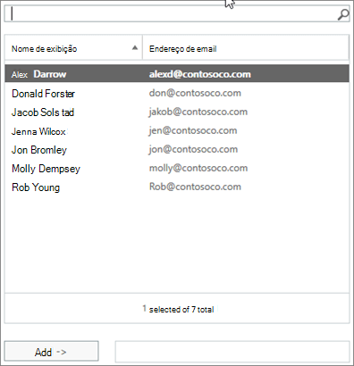

# Consenti ai membri di inviare come o inviare per conto di un gruppo

Un membro di un gruppo di Microsoft  365 a cui sono state concesse le autorizzazioni Invia come o Invia per conto di può inviare messaggi di posta elettronica come gruppo o per conto del gruppo.  Non è possibile concedere queste autorizzazioni agli utenti guest del gruppo.

In questo articolo viene illustrato come un amministratore globale o di Exchange può impostare queste autorizzazioni.
  
Ad esempio, se Megan Bowen fa parte del gruppo Formazione  **di** Microsoft 365 e dispone delle autorizzazioni Invia come  per il gruppo, se invia un messaggio di posta elettronica come gruppo, avrà l'aspetto del gruppo Formazione che ha inviato il messaggio di posta elettronica. 
  
**L'autorizzazione Invia per conto di** consente a un utente di inviare messaggi di posta elettronica per conto di un gruppo di Microsoft 365. Ad esempio, se Alex Wilber fa parte del gruppo **Marketing**  di Microsoft 365 e dispone delle autorizzazioni Invia per conto di e invia un messaggio di posta elettronica come gruppo, il messaggio di posta elettronica sembra essere stato inviato da **Alex Wilber** per conto di Marketing.

> [!IMPORTANT]
> È possibile configurare **Invia come** o Invia per **conto di** un determinato utente, ma non entrambi. Se si configurano entrambi, per impostazione predefinita verrà **utilizzato Invia come**.

> [!TIP]
> Vedere [Send email from or on behalf of a Microsoft 365 group](https://support.microsoft.com/office/0f4964af-aec6-484b-a65c-0434df8cdb6b) to learn how to use Outlook and Outlook on the Web to send email from a group.
    
## Consentire ai membri di inviare messaggi di posta elettronica come gruppo

In questa sezione viene illustrato come consentire agli utenti di inviare messaggi di posta elettronica come gruppo nell'interfaccia di amministrazione di [Exchange](https://go.microsoft.com/fwlink/p/?linkid=2059104) (EAC) in Exchange Online.
  
1. <a href="https://go.microsoft.com/fwlink/p/?linkid=2059104" target="_blank">Nell'interfaccia di amministrazione di Exchange,</a>accedere a **Destinatari** \> **Gruppi**.
    
2. Selezionare **Modifica**  di inviare come.   
    
3. Selezionare **delega gruppo**.
    
4. Nella sezione **Invia come** selezionare il segno per aggiungere gli utenti che si **+** desidera inviare come gruppo. 
    
    
  
5. Digitare per cercare o selezionare un utente dall'elenco. Selezionare **OK** e **Salva**.
    
    
  
## Consentire ai membri di inviare messaggi di posta elettronica per conto di un gruppo

In questa sezione viene illustrato come consentire agli utenti di inviare messaggi di posta elettronica per conto di un gruppo nell'interfaccia di amministrazione di Exchange (EAC) in Exchange Online.
  
1. <a href="https://go.microsoft.com/fwlink/p/?linkid=2059104" target="_blank">Nell'interfaccia di amministrazione di Exchange,</a>accedere a **Destinatari** \> **Gruppi**.
    
2. Selezionare **Modifica**  di inviare come. 
    
3. Selezionare **delega gruppo**.
    
4. Nella sezione Invia per conto di selezionare il segno per aggiungere gli utenti **+** che si desidera inviare come gruppo. 
    
    
  
5. Digitare per cercare o selezionare un utente dall'elenco. Selezionare **OK** e **Salva**.
    
    

## Articoli correlati

[Pianificazione dettagliata della governance della collaborazione](collaboration-governance-overview.md#collaboration-governance-planning-step-by-step)

[Creare il piano di governance della collaborazione](collaboration-governance-first.md)

[Altre informazioni sui gruppi di Microsoft 365](https://support.microsoft.com/office/b565caa1-5c40-40ef-9915-60fdb2d97fa2)

[Add-RecipientPermission](https://go.microsoft.com/fwlink/p/?LinkId=723960)

[Set-UnifiedGroup](https://go.microsoft.com/fwlink/p/?LinkId=616189)
