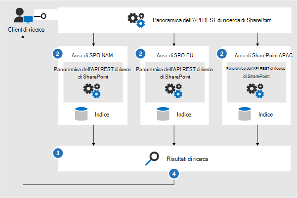

# Icone e modelli di architettura di Microsoft 365Microsoft 365 architecture icons and templates

La progettazione e l'architettura di nuove soluzioni è importante per i partner e i clienti.Helping our partners and customers design and architect new solutions is important. I diagrammi di architettura come quelli inclusi nelle nostre linee guida consentono di comunicare le decisioni di progettazione e le relazioni tra i componenti di un ambiente.Architecture diagrams like those included in our guidance can help communicate design decisions and the relationships between components in an environment. È possibile utilizzare un insieme di simboli e icone insieme ai modelli di Visio per creare i diagrammi di architettura prodotti e fornire questi strumenti per la creazione di un diagramma di architettura personalizzato per la soluzione successiva.We use a set of symbols and icons along with Visio templates to create the architecture diagrams we product and are providing these tools here to help you build a custom architecture diagram for your next solution.

È possibile visualizzare le icone, i simboli e i modelli in azione nei file scaricabili disponibili nelle pagine seguenti:You can see these icons, symbols, and templates in action in downloadable files available on the following pages:

- [Illustrazioni sulla produttivitàProductivity illustrations](productivity-illustrations.md)
- [Modelli di architettura cloud MicrosoftMicrosoft cloud architecture models](cloud-architecture-models.md)

## Termini e downloadTerms and download

Microsoft consente l'utilizzo di queste icone nei diagrammi architettonici, nei materiali didattici o nella documentazione.Microsoft permits the use of these icons in architectural diagrams, training materials, or documentation. È possibile copiare, distribuire e visualizzare le icone solo per l'utilizzo consentito, a meno che non venga concessa l'autorizzazione esplicita da parte di Microsoft.You may copy, distribute, and display the icons only for the permitted use unless granted explicit permission by Microsoft. Microsoft reserves all other rights.Microsoft reserves all other rights.

 > [!div class="button"]
 > [Scaricare le icone SVG e PNGDownload SVG and PNG icons](https://go.microsoft.com/fwlink/?linkid=869455)

 > [!div class="button"]
 > [Scaricare modelli e stencil di VisioDownload Visio templates and stencils](https://go.microsoft.com/fwlink/?linkid=2056186)

## Diagrammi dell'architettura di esempioExample architecture diagrams

È possibile utilizzare queste icone e modelli per creare diagrammi come gli esempi seguenti:You can use these icons and templates to create diagrams like the following examples:

1. Diagramma dell'architettura di ricerca di esempio per SharePoint:Example search architecture diagram for SharePoint:

    

2. Diagramma dell'architettura del ciclo di vita delle squadre:Teams retention lifecycle architecture diagram:

    
