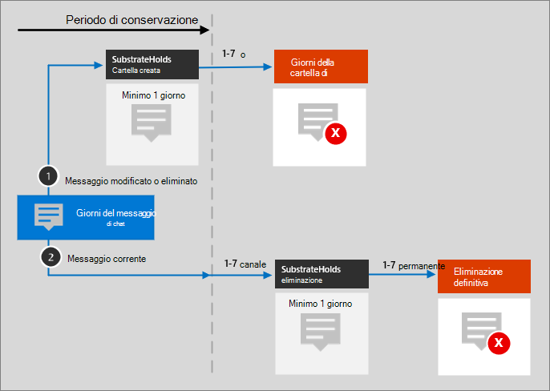

# Microsoft 365 icone e modelli dell'architetturaMicrosoft 365 architecture icons and templates

Aiutare i nostri partner e clienti a progettare e progettare nuove soluzioni è importante.Helping our partners and customers design and architect new solutions is important. Diagrammi dell'architettura come quelli inclusi nelle linee guida possono aiutare a comunicare le decisioni di progettazione e le relazioni tra i componenti in un ambiente.Architecture diagrams like those included in our guidance can help communicate design decisions and the relationships between components in an environment. Usiamo un set di simboli e icone insieme ai modelli di Visio per creare i diagrammi dell'architettura prodotti e stiamo fornendo questi strumenti qui per creare un diagramma dell'architettura personalizzato per la soluzione successiva.We use a set of symbols and icons along with Visio templates to create the architecture diagrams we product and are providing these tools here to help you build a custom architecture diagram for your next solution.

Queste icone, simboli e modelli sono in azione nei file scaricabili disponibili nelle pagine seguenti:You can see these icons, symbols, and templates in action in downloadable files available on the following pages:

- [Illustrazioni sulla produttivitàProductivity illustrations](productivity-illustrations.md)
- [Modelli di architettura cloud MicrosoftMicrosoft cloud architecture models](cloud-architecture-models.md)

## Condizioni e downloadTerms and download

Microsoft consente l'utilizzo di queste icone in diagrammi architettonici, materiali di formazione o documentazione.Microsoft permits the use of these icons in architectural diagrams, training materials, or documentation. È possibile copiare, distribuire e visualizzare le icone solo per l'utilizzo consentito, a meno che non venga concessa esplicitamente l'autorizzazione da Parte di Microsoft.You may copy, distribute, and display the icons only for the permitted use unless granted explicit permission by Microsoft. Microsoft reserves all other rights.Microsoft reserves all other rights.

 > [!div class="button"]
 > [Scaricare le icone SVG e PNGDownload SVG and PNG icons](https://go.microsoft.com/fwlink/?linkid=869455)

 > [!div class="button"]
 > [Scaricare Visio modelli e stencilDownload Visio templates and stencils](https://go.microsoft.com/fwlink/?linkid=2056186)

## Diagrammi di architettura di esempioExample architecture diagrams

È possibile utilizzare queste icone e modelli per creare diagrammi come gli esempi seguenti:You can use these icons and templates to create diagrams like the following examples:

1. Diagramma dell'architettura di ricerca di esempio per SharePoint:Example search architecture diagram for SharePoint:

    

2. Teams diagramma dell'architettura del ciclo di vita di conservazione:Teams retention lifecycle architecture diagram:

    
