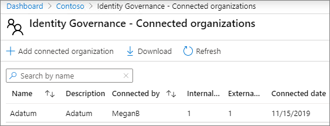

# Creare una Extranet B2B con guest gestiti.

È possibile utilizzare [Azure Active Directory Entitlement Management](https://docs.microsoft.com/azure/active-directory/governance/entitlement-management-overview) per creare una extranet B2B per collaborare con un'organizzazione partner che usa Azure Active Directory. In questo modo gli utenti possono registrarsi autonomamente nel sito Extranet o nel team e ricevere l'accesso tramite un flusso di lavoro di approvazione.

Con questo metodo di condivisione delle risorse per la collaborazione, l'organizzazione partner può aiutare a mantenere e approvare gli utenti guest, riducendo il carico sul reparto IT e consentendo ai più familiari con il contratto di collaborazione di gestire l'accesso degli utenti.

In questo articolo viene illustrata la procedura per creare un pacchetto di risorse (in questo caso, un sito o un team) che è possibile condividere con un'organizzazione partner tramite un modello di registrazione dell'accesso in modalità self-service. 

Prima di iniziare, creare il sito o il team che si desidera condividere con l'organizzazione partner e abilitarlo per la condivisione guest. Per [ulteriori informazioni, vedere](collaborate-in-site.md) Collaborare con gli utenti guest in un sito o Collaborare con gli utenti guest in un [team.](collaborate-as-team.md) È inoltre consigliabile consultare Creare un ambiente di condivisione [guest](create-secure-guest-sharing-environment.md) sicuro per informazioni sulle funzionalità di sicurezza e conformità che è possibile utilizzare per mantenere i criteri di governance quando si collabora con gli utenti guest.

## Requisiti di licenza

L'uso di questa funzionalità richiede una licenza di Azure AD Premium P2. 

I cloud specializzati, come Azure Germania e Azure Cina 21Vianet, non sono attualmente disponibili per l'uso.

## Dimostrazione video

In questo video vengono illustrate le procedure descritte in questo articolo.

> [!VIDEO https://www.microsoft.com/videoplayer/embed/RE4wKUj?autoplay=false]

## Connettere l'organizzazione partner

Per invitare guest da un'organizzazione partner, è necessario aggiungere il dominio del partner come organizzazione connessa in Azure Active Directory.

Per aggiungere un'organizzazione connessa
1. In [Azure Active Directory,](https://aad.portal.azure.com)fare clic **su Identity Governance.**
2. Fare **clic su Organizzazioni connesse.**
4. Fare **clic su Aggiungi organizzazione connessa.**
5. Digitare un nome e una descrizione per l'organizzazione e quindi fare clic su **Avanti: Directory + dominio.**
6. Fare **clic su Aggiungi directory + dominio.**
7. Digitare il dominio dell'organizzazione che si desidera connettere e quindi fare clic su **Aggiungi.**
8. Fare **clic su** Connetti e quindi su **Avanti: Sponsor.**
9. Aggiungere persone dell'organizzazione o dell'organizzazione a cui ci si connette a chi si desidera approvare l'accesso per gli utenti guest.
10. Fare **clic su Avanti: Rivedi + Crea.**
11. Rivedere le impostazioni scelte e quindi fare clic su **Crea.**

    

## Scegliere le risorse da condividere

Il primo passaggio per la selezione delle risorse da condividere con un'organizzazione partner consiste nel creare un catalogo in cui contenerle.

Per creare un catalogo
1. In [Azure Active Directory,](https://aad.portal.azure.com)fare clic **su Identity Governance.**
2. Fare **clic su Cataloghi.**
3. Fare **clic su Nuovo catalogo.**
4. Digitare un nome e una descrizione per il catalogo e assicurarsi che sia abilitato che abilitato per gli utenti **esterni** sia impostato su **Sì.** 
5. Fare clic su **Crea**.

   

Dopo aver creato il catalogo, aggiungere il sito o il team di SharePoint che si desidera condividere con l'organizzazione partner.

Per aggiungere risorse a un catalogo
1. In Azure AD Identity Governance, fare clic **su Cataloghi** e quindi sul catalogo in cui si desidera aggiungere risorse.
2. Fare **clic su** Risorse e quindi su Aggiungi **risorse.**
3. Selezionare i team o i siti di SharePoint che si desidera includere nella rete Extranet e quindi fare clic su **Aggiungi.**

   

Dopo aver definito le risorse che si desidera condividere, il passaggio successivo consiste nel creare un pacchetto di accesso, che definisce il tipo di accesso concesso agli utenti partner e il processo di approvazione per i nuovi utenti partner che richiedono l'accesso.

Per creare un pacchetto di accesso
1. In Azure AD Identity Governance, fare clic **su Cataloghi** e quindi sul catalogo in cui si desidera creare un pacchetto di accesso.
2. Fare **clic su Pacchetti di** Access e quindi su Nuovo pacchetto di **accesso.**
3. Digitare un nome e una descrizione per il pacchetto di accesso e quindi fare clic su **Avanti: Ruoli risorsa.**
4. Scegliere le risorse del catalogo che si desidera utilizzare per la rete Extranet.
5. Per ogni risorsa, nella **colonna Ruolo** scegliere il ruolo utente che si desidera concedere agli utenti guest che utilizzano la extranet.
6. Fare **clic su Avanti: Richieste.**
7. In **Utenti che possono richiedere l'accesso** scegliere Per gli utenti non presenti nella **directory.**
8. Verificare che **l'opzione Organizzazioni connesse** specifiche sia selezionata e quindi fare clic su Aggiungi **directory.**
9. Scegliere l'organizzazione connessa aggiunta in precedenza e quindi fare clic su **Seleziona**
10. In **Approvazione** scegliere **Sì** per **Richiedi approvazione.**
11. In **Primo responsabile approvazione** scegliere uno degli sponsor aggiunti in precedenza oppure scegliere un utente specifico.
12. Fare **clic su Aggiungi fallback** e selezionare un responsabile approvazione di fallback.
13. In **Abilita** scegliere **Sì.**
14. Fare **clic su Avanti: Ciclo di vita.**
15. Scegliere le impostazioni di scadenza e verifica di accesso che si desidera utilizzare e quindi fare clic su **Avanti: Revisione + Crea.**
16. Rivedere le impostazioni e quindi fare clic su **Crea.**

    

Se stai collaborando con un'organizzazione di grandi dimensioni, puoi nascondere il pacchetto di accesso. Se il pacchetto è nascosto, gli utenti dell'organizzazione partner non potranno vedere il pacchetto nel portale *Di accesso.* Al contrario, devono essere inviati un collegamento diretto per iscriversi al pacchetto. Nascondere il pacchetto di accesso può ridurre il numero di richieste di accesso inappropriato e può anche contribuire a mantenere organizzati i pacchetti di accesso disponibili nel portale dell'organizzazione partner.

Per impostare un pacchetto di accesso come nascosto
1. In Azure AD Identity Governance, fare clic **su Pacchetti di accesso** e quindi fare clic sul pacchetto di accesso.
2. Nella pagina **Panoramica** fare clic su **Modifica.**
3. In **Proprietà** scegliere **Sì** per **Nascosto** e quindi fare clic su **Salva.**

   

## Invitare utenti partner

Se si imposta il pacchetto di accesso su nascosto, è necessario inviare un collegamento diretto all'organizzazione partner in modo che possa richiedere l'accesso al sito o al team.

Per trovare il collegamento al portale di accesso
1. In Azure AD Identity Governance, fare clic **su Pacchetti di accesso** e quindi fare clic sul pacchetto di accesso.
2. Nella pagina **Panoramica** fare clic sul **collegamento Copia negli Appunti** per il collegamento al portale di My **Access.**

   

Dopo aver copiato il collegamento, è possibile condividerlo con il contatto nell'organizzazione partner e inviarlo agli utenti del team di collaborazione.

## Vedere anche

[Creare un ambiente di condivisione guest sicuro](create-secure-guest-sharing-environment.md)
