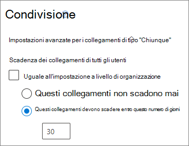
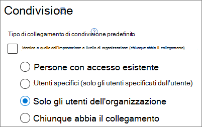
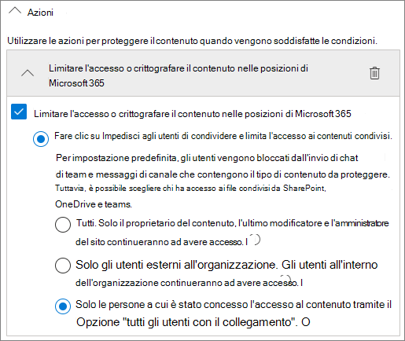

# Procedure consigliate per la condivisione di file e cartelle con utenti non autenticati

La condivisione non autenticata (collegamenti *Chiunque*) può essere comoda e utile in diversi scenari. I collegamenti *Chiunque* sono il modo più semplice per condividere: il collegamento può essere aperto senza autenticazione e passato ad altre persone.

In genere, non tutto il contenuto di un'organizzazione è adatto alla condivisione non autenticata. Questo articolo illustra le opzioni disponibili per la creazione di un ambiente in cui gli utenti possano condividere file e cartelle senza autenticazione e in cui siano implementate misure di sicurezza per proteggere il contenuto dell'organizzazione.

> [!NOTE]
> Affinché la condivisione non autenticata funzioni, è necessario abilitarla per l'organizzazione e per il singolo sito o team che si userà. Vedere [Collaborazione con persone esterne all'organizzazione](collaborate-with-people-outside-your-organization.md) per lo scenario da abilitare.

## Impostare una data di scadenza per i collegamenti Chiunque

Spesso i file vengono archiviati in siti, gruppi e team per lunghi periodi di tempo. A volte esistono criteri di conservazione dei dati che richiedono la conservazione dei file per anni. Se tali file vengono condivisi con persone non autenticate, potrebbero verificarsi accessi imprevisti o modifiche ai file in futuro. Per limitare questa possibilità, è possibile configurare una data di scadenza per i collegamenti *Chiunque*.

Quando un collegamento *Chiunque* scade, non può più essere utilizzato per accedere al contenuto.

Per impostare una data di scadenza per i collegamenti Chiunque nell’organizzazione

1. Aprire l'[interfaccia di amministrazione di SharePoint](https://admin.microsoft.com/sharepoint).
2. Nel riquadro di spostamento sinistro fare clic su **Condivisione**.
3. In **Scegliere le opzioni delle autorizzazioni e di scadenza per i collegamenti di tipo "Chiunque"**, selezionare la casella di controllo **Questi collegamenti devono scadere entro questo numero di giorni**. 
   
4. Digitare un numero di giorni nella casella, quindi fare clic su **Salva**.

Per impostare una data di scadenza per i collegamenti Chiunque su un sito specifico

1. Aprire l'[interfaccia di amministrazione di SharePoint](https://admin.microsoft.com/sharepoint).
2. Nel riquadro di spostamento a sinistra espandere **Siti** e quindi fare clic su **Siti attivi**.
3. Selezionare il sito che si desidera modificare e fare clic su **Condivisione**.
4. In **Impostazioni avanzate per collegamenti Chiunque**, in **Scadenza di collegamenti Chiunque**, deselezionare la casella di controllo **Uguale all’impostazione a livello di organizzazione**. 
   
5. Selezionare l’opzione **Questi collegamenti devono scadere entro questo numero di giorni** e digitare un numero di giorni nella casella.
6. Fare clic su **Salva**.

Tenere presente che dopo la scadenza di un collegamento *Chiunque*, è possibile condividere nuovamente il file o la cartella con un nuovo collegamento *Chiunque*.

È possibile impostare la scadenza dei collegamenti *Chiunque* per uno specifico OneDrive usando [Set-SPOSite](/powershell/module/sharepoint-online/set-sposite).

## Impostare le autorizzazioni per i collegamenti

Per impostazione predefinita, i collegamenti *Chiunque* per un file consentono di modificare il file, mentre i collegamenti *Chiunque* per una cartella consentono di modificare e visualizzare i file, nonché di caricare nuovi file nella cartella. È possibile impostare le autorizzazioni di sola visualizzazione per i file e le cartelle in modo indipendente.

Se si vuole consentire la condivisione senza autenticazione, ma si teme che il contenuto dell'organizzazione venga modificato da utenti non autenticati, è consigliabile impostare le autorizzazioni per i file e le cartelle su **Visualizzazione**.

Per impostare le autorizzazioni per i collegamenti Chiunque nell’organizzazione

1. Aprire l'[interfaccia di amministrazione di SharePoint](https://admin.microsoft.com/sharepoint).
2. Nel riquadro di spostamento sinistro fare clic su **Condivisione**.
3. In **Impostazioni avanzate per i collegamenti di tipo "Chiunque"** selezionare le autorizzazioni per i file e le cartelle da usare. 
   

Con i collegamenti *Chiunque* impostati su **Visualizzazione**, è comunque possibile condividere file e cartelle con utenti guest e assegnare loro le autorizzazioni di modifica utilizzando i collegamenti *Persone specifiche*. Questi collegamenti richiedono l'autenticazione come guest da parte delle persone esterne all'organizzazione e consentono di tenere traccia e controllare le attività di tali utenti sulle cartelle e sui file condivisi.

## Impostare il tipo di collegamento predefinito in modo che funzioni solo per le persone dell'organizzazione

Quando per l'organizzazione è abilitata la condivisione di tipo *Chiunque*, il collegamento di condivisione predefinito è generalmente impostato su **Chiunque**. Può essere comodo per gli utenti, ma può aumentare il rischio di condivisione non autenticata involontaria. Se un utente dimentica di cambiare il tipo di collegamento durante la condivisione di un documento sensibile, potrebbe accidentalmente creare un collegamento di condivisione che non richiede l'autenticazione.

È possibile ridurre questo rischio modificando l'impostazione predefinita per il collegamento su un collegamento che funziona solo per le persone interne all'organizzazione. Gli utenti che vogliono condividere con persone non autenticate dovranno selezionare specificamente tale opzione.

Per impostare il collegamento di condivisione di file e cartelle predefinito per l’organizzazione
1. Aprire l'[interfaccia di amministrazione di SharePoint](https://admin.microsoft.com/sharepoint).
2. Nel riquadro di spostamento sinistro fare clic su **Condivisione**.
3. In **Collegamenti di file e cartelle** selezionare **Solo gli utenti dell'organizzazione**.

   

4. Fare clic su **Salva**.

Per impostare il collegamento di condivisione di file e cartelle predefinito per un sito specifico
1. Aprire l'[interfaccia di amministrazione di SharePoint](https://admin.microsoft.com/sharepoint).
2. Nel riquadro di spostamento a sinistra espandere **Siti** e quindi fare clic su **Siti attivi**.
3. Selezionare il sito che si desidera modificare e fare clic su **Condivisione**.
4. In **Tipo di collegamento di condivisione predefinito**,  deselezionare la casella di controllo **Uguale all’impostazione a livello di organizzazione**.

   

5. Selezionare l’opzione **Solo gli utenti dell’organizzazione** e fare clic su **Salva**.

## Impedire la condivisione di contenuto riservato non autenticato

È possibile usare [prevenzione della perdita dei dati (DLP)](../compliance/data-loss-prevention-policies.md) per impedire la condivisione di contenuto riservato non autenticato. La prevenzione della perdita di dati può agire in base all'etichetta di riservatezza, all'etichetta di conservazione o alle informazioni sensibili di un file nel file stesso.

Per creare una regola DLP
1. Nell'interfaccia di amministrazione di Conformità Microsoft 365 passare alla pagina [Prevenzione della perdita dei dati](https://compliance.microsoft.com/datalossprevention).
2. Fare clic su **Crea criterio**.
3. Scegliere **Personalizzato** e quindi fare clic su **Avanti**.
4. Digitare un nome per il criterio, quindi fare clic su **Avanti**.
5. Nella pagina **Posizioni in cui applicare il criterio** disattivare tutte le impostazioni tranne **Siti di SharePoint** e **Account di OneDrive**, quindi fare clic su **Avanti**.
6. Nella pagina **Definire le impostazioni dei criteri** fare clic su **Avanti**.
7. Nella pagina **Personalizzare regole avanzate di prevenzione della perdita dei dati** fare clic su **Crea regola** e digitare un nome per la regola.
8. In **Condizioni** fare clic su **Aggiungi condizione** e scegliere **Il contenuto include**.
9. Fare clic su **Aggiungi** e scegliere il tipo di informazioni per cui si vuole impedire la condivisione non autenticata.

   

10. In **Azioni** fare clic su **Aggiungi azione** e scegliere **Limita l'accesso o crittografa il contenuto nelle posizioni di Microsoft 365**.
11. Selezionare la casella di controllo **Limita l’accesso o crittografa il contenuto nelle posizioni di Microsoft 365** e quindi scegliere l’opzione **Solo gli utenti a cui è stato concesso l'accesso al contenuto tramite l’opzione "Chiunque abbia il collegamento"**.

      

12. Fare clic su **Salva**, quindi su **Avanti**.
13. Scegliere le opzioni di test e fare clic su **Avanti**.
14. Fare clic su **Invia**, quindi su **Fatto**.

## Proteggere l'ambiente dai file dannosi

Se si consente agli utenti anonimi di caricare file, aumenta il rischio che venga caricato un file dannoso. In Microsoft 365 è possibile usare la funzionalità *Allegati Sicuri* in Defender per Office 365 per analizzare automaticamente i file caricati e mettere in quarantena i file che risultano non sicuri.

Per attivare gli allegati sicuri
1. Aprire la [pagina Allegati sicuri di ATP](https://protection.office.com/safeattachmentv2) nell’interfaccia di amministrazione del Centro sicurezza e conformità.
2. Fare clic su **Impostazioni globali**.
3. Attivare ATP per SharePoint, OneDrive e Microsoft Teams.

   

4. Facoltativamente, attivare anche Documenti protetti, quindi fare clic su **Salva**

Per altre informazioni vedere [ATP per SharePoint, OneDrive e Microsoft Teams](../security/office-365-security/atp-for-spo-odb-and-teams.md) e [Abilitare ATP per SharePoint, OneDrive e Microsoft Teams](../security/office-365-security/turn-on-atp-for-spo-odb-and-teams.md).

## Aggiungere informazioni sul copyright ai file

Se si usano le etichette di riservatezza nell'interfaccia di amministrazione di Conformità Microsoft 365, è possibile configurare le etichette in modo da aggiungere automaticamente una filigrana, un'intestazione o un piè di pagina ai documenti di Office dell'organizzazione. In questo modo, è possibile assicurarsi che i file condivisi contengano informazioni sul copyright o altre informazioni sulla proprietà.

Per aggiungere un piè di pagina a un file con etichetta

1. Aprire l'interfaccia di amministrazione di [Conformità Microsoft 365](https://compliance.microsoft.com).
2. Nel riquadro di spostamento sinistro, in **Soluzioni**, fare clic su **Protezione delle informazioni**.
3. Fare clic sull'etichetta che si vuole usare per aggiungere un piè di pagina e quindi fare clic su **Modifica etichetta**.
4. Fare clic su **Avanti** per accedere alla scheda **Contrassegno contenuti**, quindi **attivare** il contrassegno dei contenuti.
5. Selezionare la casella di controllo relativa al tipo di testo da aggiungere e quindi fare clic su **Personalizza testo**.
6. Digitare il testo da aggiungere ai documenti, selezionare le opzioni desiderate per il testo e quindi fare clic su **Salva**. 
   
7. Fare clic su **Avanti** per terminare la procedura guidata e quindi fare clic su **Salva etichetta**.

Quando è abilitato il contrassegno del contenuto per l'etichetta, il testo specificato verrà aggiunto ai documenti di Office quando un utente applica tale etichetta.

## Vedere anche

[Panoramica delle etichette di riservatezza](/Office365/SecurityCompliance/sensitivity-labels)

[Limitare l'esposizione accidentale ai file durante la condivisione con gli utenti guest](share-limit-accidental-exposure.md)

[Creare un ambiente di condivisione guest sicuro](create-secure-guest-sharing-environment.md)