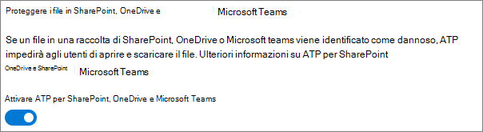

# Procedure consigliate per la condivisione di file e cartelle con utenti non autenticatiBest practices for sharing files and folders with unauthenticated users

La condivisione non autenticata (collegamenti *Chiunque* ) può essere comoda e utile in diversi scenari.Unauthenticated sharing ( *Anyone* links) can be convenient and is useful in various scenarios. I collegamenti *Chiunque* sono il modo più semplice per condividere: il collegamento può essere aperto senza autenticazione e passato ad altre persone.*Anyone* links are the easiest way to share: people can open the link without authentication and are free to pass it on to others.

In genere, non tutto il contenuto di un'organizzazione è adatto alla condivisione non autenticata.Usually, not all content in an organization is appropriate for unauthenticated sharing. Questo articolo illustra le opzioni disponibili per la creazione di un ambiente in cui gli utenti possano condividere file e cartelle senza autenticazione e in cui siano implementate misure di sicurezza per proteggere il contenuto dell'organizzazione.This article covers the options available to help you create an environment where your users can use unauthenticated sharing of files and folders, but where there are safeguards in place to help protect your organization's content.

> [!NOTE]
> Affinché la condivisione non autenticata funzioni, è necessario abilitarla per l'organizzazione e per il singolo sito o team che si userà.For unauthenticated sharing to work, you must enable it for your organization and for the individual site or team that you'll be using. Vedere [Collaborazione con persone esterne all'organizzazione](collaborate-with-people-outside-your-organization.md) per lo scenario da abilitare.See [Collaborating with people outside your organization](collaborate-with-people-outside-your-organization.md) for the scenario that you want to enable.

## Impostare una data di scadenza per i collegamenti ChiunqueSet an expiration date for Anyone links

Spesso i file vengono archiviati in siti, gruppi e team per lunghi periodi di tempo.Files are often stored in sites, groups, and teams for long periods of time. A volte esistono criteri di conservazione dei dati che richiedono la conservazione dei file per anni.Occasionally there are data retention policies that require files to be retained for years. Se tali file vengono condivisi con persone non autenticate, potrebbero verificarsi accessi imprevisti o modifiche ai file in futuro.If such files are shared with unauthenticated people, this could lead to unexpected access and changes to files in the future. Per limitare questa possibilità, è possibile configurare una data di scadenza per i collegamenti *Chiunque* .To mitigate this possibility, you can configure an expiration time for *Anyone* links.

Quando un collegamento *Chiunque* scade, non può più essere utilizzato per accedere al contenuto.Once an *Anyone* link expires, it can no longer be used to access content.

Per impostare una data di scadenza per i collegamenti Chiunque nell’organizzazioneTo set an expiration date for Anyone links across the organization

1. Aprire l'[interfaccia di amministrazione di SharePoint](https://admin.microsoft.com/sharepoint).Open the [SharePoint admin center](https://admin.microsoft.com/sharepoint).
2. Nel riquadro di spostamento sinistro fare clic su **Condivisione** .In the left navigation, click **Sharing** .
3. In **Scegliere le opzioni delle autorizzazioni e di scadenza per i collegamenti di tipo "Chiunque"** , selezionare la casella di controllo **Questi collegamenti devono scadere entro questo numero di giorni** .Under **Choose expiration and permissions options for Anyone links** , select the **These links must expire within this many days** check box. 
   
4. Digitare un numero di giorni nella casella, quindi fare clic su **Salva** .Type a number of days in the box, and then click **Save** .

Per impostare una data di scadenza per i collegamenti Chiunque su un sito specificoTo set an expiration date for Anyone links on a specific site

1. Aprire l'[interfaccia di amministrazione di SharePoint](https://admin.microsoft.com/sharepoint).Open the [SharePoint admin center](https://admin.microsoft.com/sharepoint).
2. Nel riquadro di spostamento a sinistra espandere **Siti** e quindi fare clic su **Siti attivi** .In the left navigation, expand **Sites** , and then click **Active sites** .
3. Selezionare il sito che si desidera modificare e fare clic su **Condivisione** .Select the site you want to change, and then click **Sharing** .
4. In **Impostazioni avanzate per collegamenti Chiunque** , in **Scadenza di collegamenti Chiunque** , deselezionare la casella di controllo **Uguale all’impostazione a livello di organizzazione** .Under **Advanced settings for Anyone links** , under **Expiration of Anyone links** , clear the **Same as organization-level setting** check box. 
   
5. Selezionare l’opzione **Questi collegamenti devono scadere entro questo numero di giorni** e digitare un numero di giorni nella casella.Select the **These links must expire within this many days** option, and type a number of days in the box.
6. Fare clic su **Salva** .Click **Save** .

Tenere presente che dopo la scadenza di un collegamento *Chiunque* , è possibile condividere nuovamente il file o la cartella con un nuovo collegamento *Chiunque* .Note that once an *Anyone* link expires, the file or folder can be re-shared with a new *Anyone* link.

È possibile impostare la scadenza dei collegamenti *Chiunque* per uno specifico OneDrive usando [Set-SPOSite](https://docs.microsoft.com/powershell/module/sharepoint-online/set-sposite).You can set *Anyone* link expiration for a specific OneDrive by using [Set-SPOSite](https://docs.microsoft.com/powershell/module/sharepoint-online/set-sposite).

## Impostare le autorizzazioni per i collegamentiSet link permissions

Per impostazione predefinita, i collegamenti *Chiunque* per un file consentono di modificare il file, mentre i collegamenti *Chiunque* per una cartella consentono di modificare e visualizzare i file, nonché di caricare nuovi file nella cartella.By default, *Anyone* links for a file allow people to edit the file, and *Anyone* links for a folder allow people to edit and view files, and upload new files to the folder. È possibile impostare le autorizzazioni di sola visualizzazione per i file e le cartelle in modo indipendente.You can change these permissions for files and for folders independently to view-only.

Se si vuole consentire la condivisione senza autenticazione, ma si teme che il contenuto dell'organizzazione venga modificato da utenti non autenticati, è consigliabile impostare le autorizzazioni per i file e le cartelle su **Visualizzazione** .If you want to allow unauthenticated sharing, but are concerned about unauthenticated people modifying your organization's content, consider setting the file and folder permissions to **View** .

Per impostare le autorizzazioni per i collegamenti Chiunque nell’organizzazioneTo set permissions for Anyone links across the organization

1. Aprire l'[interfaccia di amministrazione di SharePoint](https://admin.microsoft.com/sharepoint).Open the [SharePoint admin center](https://admin.microsoft.com/sharepoint).
2. Nel riquadro di spostamento sinistro fare clic su **Condivisione** .In the left navigation, click **Sharing** .
3. In **Impostazioni avanzate per i collegamenti di tipo "Chiunque"** selezionare le autorizzazioni per i file e le cartelle da usare.Under **Advanced settings for "Anyone" links** , select the file and folder permissions that you want to use. 
   

Con i collegamenti *Chiunque* impostati su **Visualizzazione** , è comunque possibile condividere file e cartelle con utenti guest e assegnare loro le autorizzazioni di modifica utilizzando i collegamenti *Persone specifiche* .With *Anyone* links set to **View** , users can still share files and folders with guests and give them edit permissions by using *Specific people* links. Questi collegamenti richiedono l'autenticazione come guest da parte delle persone esterne all'organizzazione e consentono di tenere traccia e controllare le attività di tali utenti sulle cartelle e sui file condivisi.These links require people outside your organization to authenticate as guests, and you can track and audit guest activity on files and folders shared with these links.

## Impostare il tipo di collegamento predefinito in modo che funzioni solo per le persone dell'organizzazioneSet default link type to only work for people in your organization

Quando per l'organizzazione è abilitata la condivisione di tipo *Chiunque* , il collegamento di condivisione predefinito è generalmente impostato su **Chiunque** .When *Anyone* sharing is enabled for your organization, the default sharing link is normally set to **Anyone** . Può essere comodo per gli utenti, ma può aumentare il rischio di condivisione non autenticata involontaria.While this can be convenient for users, it can increase the risk of unintentional unauthenticated sharing. Se un utente dimentica di cambiare il tipo di collegamento durante la condivisione di un documento sensibile, potrebbe accidentalmente creare un collegamento di condivisione che non richiede l'autenticazione.If a user forgets to change the link type while sharing a sensitive document, they might accidentally create a sharing link that doesn't require authentication.

È possibile ridurre questo rischio modificando l'impostazione predefinita per il collegamento su un collegamento che funziona solo per le persone interne all'organizzazione.You can mitigate this risk by changing the default link setting to a link that only works for people inside your organization. Gli utenti che vogliono condividere con persone non autenticate dovranno selezionare specificamente tale opzione.Users who want to share with unauthenticated people would then have to specifically select that option.

Per impostare il collegamento di condivisione di file e cartelle predefinito per l’organizzazioneTo set the default file and folder sharing link for the organization
1. Aprire l'[interfaccia di amministrazione di SharePoint](https://admin.microsoft.com/sharepoint).Open the [SharePoint admin center](https://admin.microsoft.com/sharepoint).
2. Nel riquadro di spostamento sinistro fare clic su **Condivisione** .In the left navigation, click **Sharing** .
3. In **Collegamenti di file e cartelle** selezionare **Solo gli utenti dell'organizzazione** .Under **File and folder links** , select **Only people in your organization** .

   

4. Fare clic su **Salva** .Click **Save**

Per impostare il collegamento di condivisione di file e cartelle predefinito per un sito specificoTo set the default file and folder sharing link for a specific site
1. Aprire l'[interfaccia di amministrazione di SharePoint](https://admin.microsoft.com/sharepoint).Open the [SharePoint admin center](https://admin.microsoft.com/sharepoint).
2. Nel riquadro di spostamento a sinistra espandere **Siti** e quindi fare clic su **Siti attivi** .In the left navigation, expand **Sites** , and then click **Active sites** .
3. Selezionare il sito che si desidera modificare e fare clic su **Condivisione** .Select the site you want to change, and then click **Sharing** .
4. In **Tipo di collegamento di condivisione predefinito** ,  deselezionare la casella di controllo **Uguale all’impostazione a livello di organizzazione** .Under **Default sharing link type** ,  clear the **Same as organization-level setting** check box.

   

5. Selezionare l’opzione **Solo gli utenti dell’organizzazione** e fare clic su **Salva** .Select the **Only people in your organization** option and click **Save** .

## Impedire la condivisione di contenuto riservato non autenticatoPrevent unauthenticated sharing of sensitive content

È possibile usare [prevenzione della perdita dei dati (DLP)](https://docs.microsoft.com/microsoft-365/compliance/data-loss-prevention-policies) per impedire la condivisione di contenuto riservato non autenticato.You can use [data loss prevention (DLP)](https://docs.microsoft.com/microsoft-365/compliance/data-loss-prevention-policies) to prevent unauthenticated sharing of sensitive content. La prevenzione della perdita di dati può agire in base all'etichetta di riservatezza, all'etichetta di conservazione o alle informazioni sensibili di un file nel file stesso.Data loss prevention can take action based on a file's sensitivity label, retention label, or sensitive information in the file itself.

Per creare una regola DLPTo create a DLP rule
1. Nell'interfaccia di amministrazione di Conformità Microsoft 365 passare alla pagina [Prevenzione della perdita dei dati](https://compliance.microsoft.com/datalossprevention).In the Microsoft 365 compliance admin center, go to the [Data loss prevention page](https://compliance.microsoft.com/datalossprevention).
2. Fare clic su **Crea criterio** .Click **Create policy** .
3. Scegliere **Personalizzato** e quindi fare clic su **Avanti** .Choose **Custom** and click **Next** .
4. Digitare un nome per il criterio, quindi fare clic su **Avanti** .Type a name for the policy and click **Next** .
5. Nella pagina **Posizioni in cui applicare il criterio** disattivare tutte le impostazioni tranne **Siti di SharePoint** e **Account di OneDrive** , quindi fare clic su **Avanti** .On the **Locations to apply the policy** page turn off all settings except **SharePoint sites** and **OneDrive accounts** , and then click **Next** .
6. Nella pagina **Definire le impostazioni dei criteri** fare clic su **Avanti** .On the **Define policy settings** page, click **Next** .
7. Nella pagina **Personalizzare regole avanzate di prevenzione della perdita dei dati** fare clic su **Crea regola** e digitare un nome per la regola.On the **Customize advanced DLP rules** page, click **Create rule** and type a name for the rule.
8. In **Condizioni** fare clic su **Aggiungi condizione** e scegliere **Il contenuto include** .Under **Conditions** , click **Add condition** , and choose **Content contains** .
9. Fare clic su **Aggiungi** e scegliere il tipo di informazioni per cui si vuole impedire la condivisione non autenticata.Click **Add** and choose the type of information for which you want to prevent unauthenticated sharing.

   

10. In **Azioni** fare clic su **Aggiungi azione** e scegliere **Limita l'accesso o crittografa il contenuto nelle posizioni di Microsoft 365** .Under **Actions** click **Add an action** and choose **Restrict access or encrypt the content in Microsoft 365 locations** .
11. Selezionare la casella di controllo **Limita l’accesso o crittografa il contenuto nelle posizioni di Microsoft 365** e quindi scegliere l’opzione **Solo gli utenti a cui è stato concesso l'accesso al contenuto tramite l’opzione "Chiunque abbia il collegamento"** .Select the **Restrict access or encrypt the content in Microsoft 365 locations** check box and then choose the **Only people who were given access to the content through the "Anyone withe the link" options** option.

      

12. Fare clic su **Salva** , quindi su **Avanti** .Click **Save** and then click **Next** .
13. Scegliere le opzioni di test e fare clic su **Avanti** .Choose your test options and click **Next** .
14. Fare clic su **Invia** , quindi su **Fatto** .Click **Submit** , and then click **Done** .

## Proteggere l'ambiente dai file dannosiProtect against malicious files

Se si consente agli utenti anonimi di caricare file, aumenta il rischio che venga caricato un file dannoso.When you allow anonymous users to upload files, you're at an increased risk of someone uploading a malicious file. In Microsoft 365 è possibile usare la funzionalità *Allegati Sicuri* in Advanced Threat Protection per analizzare automaticamente i file caricati e mettere in quarantena i file che risultano non sicuri.In Microsoft 365, you can use the *Safe Attachments* feature in Advanced Threat Protection to automatically scan uploaded files and quarantine files that are found to be unsafe.

Per attivare gli allegati sicuriTo turn on safe attachments
1. Aprire la [pagina Allegati sicuri di ATP](https://protection.office.com/safeattachmentv2) nell’interfaccia di amministrazione del Centro sicurezza e conformità.Open the [ATP Safe Attachments page](https://protection.office.com/safeattachmentv2) in the Security and Compliance admin center.
2. Fare clic su **Impostazioni globali** .Click **Global settings** .
3. Attivare ATP per SharePoint, OneDrive e Microsoft Teams.Turn on ATP for SharePoint, OneDrive, and Microsoft Teams.

   

4. Facoltativamente, attivare anche Documenti protetti, quindi fare clic su **Salva**Optionally turn on Safe Documents as well, and then click **Save**

Per altre informazioni vedere [ATP per SharePoint, OneDrive e Microsoft Teams](https://docs.microsoft.com/microsoft-365/security/office-365-security/atp-for-spo-odb-and-teams) e [Abilitare ATP per SharePoint, OneDrive e Microsoft Teams](https://docs.microsoft.com/microsoft-365/security/office-365-security/turn-on-atp-for-spo-odb-and-teams).See [ATP for SharePoint, OneDrive, and Microsoft Teams](https://docs.microsoft.com/microsoft-365/security/office-365-security/atp-for-spo-odb-and-teams) and [Turn on ATP for SharePoint, OneDrive, and Microsoft Teams](https://docs.microsoft.com/microsoft-365/security/office-365-security/turn-on-atp-for-spo-odb-and-teams) for additional guidance.

## Aggiungere informazioni sul copyright ai fileAdd copyright information to your files

Se si usano le etichette di riservatezza nell'interfaccia di amministrazione di Conformità Microsoft 365, è possibile configurare le etichette in modo da aggiungere automaticamente una filigrana, un'intestazione o un piè di pagina ai documenti di Office dell'organizzazione.If you use sensitivity labels in the Microsoft 365 Compliance admin center, you can configure your labels to add a watermark or a header or footer automatically to your organization's Office documents. In questo modo, è possibile assicurarsi che i file condivisi contengano informazioni sul copyright o altre informazioni sulla proprietà.In this way, you can make sure that shared files contain copyright or other ownership information.

Per aggiungere un piè di pagina a un file con etichettaTo add a footer to a labeled file

1. Aprire l'interfaccia di amministrazione di [Conformità Microsoft 365](https://compliance.microsoft.com).Open the [Microsoft 365 compliance admin center](https://compliance.microsoft.com).
2. Nel riquadro di spostamento sinistro, in **Soluzioni** , fare clic su **Protezione delle informazioni** .In the left navigation, under **Solutions** , click **Information protection** .
3. Fare clic sull'etichetta che si vuole usare per aggiungere un piè di pagina e quindi fare clic su **Modifica etichetta** .Click the label that you want to have add a footer, and then click **Edit label** .
4. Fare clic su **Avanti** per accedere alla scheda **Contrassegno contenuti** , quindi **attivare** il contrassegno dei contenuti.Click **Next** to reach the **Content marking** tab, and then turn **On** content marking.
5. Selezionare la casella di controllo relativa al tipo di testo da aggiungere e quindi fare clic su **Personalizza testo** .Select the check box for the type of text you want to add, and then click **Customize text** .
6. Digitare il testo da aggiungere ai documenti, selezionare le opzioni desiderate per il testo e quindi fare clic su **Salva** .Type the text that you want added to your documents, select the text options that you want, and then click **Save** . 
   
7. Fare clic su **Avanti** per terminare la procedura guidata e quindi fare clic su **Salva etichetta** .Click **Next** to reach the end of the wizard, and then click **Save label** .

Quando è abilitato il contrassegno del contenuto per l'etichetta, il testo specificato verrà aggiunto ai documenti di Office quando un utente applica tale etichetta.With content marking enabled for the label, the text you specified will be added to Office documents when a user applies that label.

## Vedere ancheSee Also

[Panoramica delle etichette di riservatezzaOverview of sensitivity labels](https://docs.microsoft.com/Office365/SecurityCompliance/sensitivity-labels)

[Limitare l'esposizione accidentale ai file durante la condivisione con gli utenti guestLimit accidental exposure to files when sharing with guests](share-limit-accidental-exposure.md)

[Creare un ambiente di condivisione guest sicuroCreate a secure guest sharing environment](create-secure-guest-sharing-environment.md)
