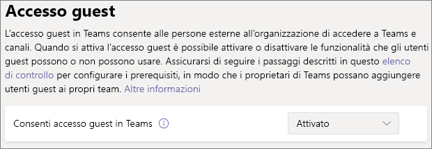
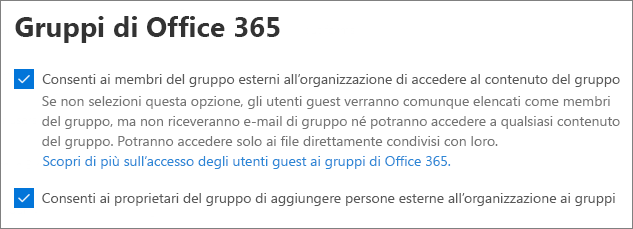

# Collaborazione con gli utenti guest in un teamCollaborate with guests in a team

Se occorre collaborare con utenti guest a documenti e attività e comunicare, è consigliabile usare Microsoft Teams.If you need to collaborate with guests across documents, tasks, and conversations, we recommend using Microsoft Teams. Teams offre tutte le funzionalità di collaborazione disponibili in Office e SharePoint con una chat persistente e un set personalizzabile ed estendibile di strumenti di collaborazione in un'esperienza utente unificata.Teams provides all of the collaboration features available in Office and SharePoint with persistent chat and a customizable and extensible set of collaboration tools in a unified user experience.

Questo articolo illustra la procedura di configurazione di Microsoft 365 necessaria per consentire a un team di collaborare con utenti guest.In this article, we'll walk through the Microsoft 365 configuration steps necessary to set up a team for collaboration with guests. Dopo aver configurato l'accesso agli utenti guest, è possibile invitarli ai team seguendo la procedura descritta in [Aggiungere utenti guest a un team in Teams](https://support.microsoft.com/office/fccb4fa6-f864-4508-bdde-256e7384a14f).Once you have configured guest access, you can invite guests to teams by following the steps in [Add guests to a team in Teams](https://support.microsoft.com/office/fccb4fa6-f864-4508-bdde-256e7384a14f).

## Dimostrazione videoVideo demonstration

Il video mostra la procedura di configurazione descritta in questo documento.This video shows the configuration steps described in this document. 

> [!VIDEO https://www.microsoft.com/videoplayer/embed/RE44NTr?autoplay=false]

## Impostazioni di collaborazione esterna di AzureAzure External collaboration settings

La condivisione in Microsoft 365 è regolata al livello più alto dalle [impostazioni di collaborazione esterna B2B in Azure Active Directory](/azure/active-directory/external-identities/delegate-invitations).Sharing in Microsoft 365 is governed at its highest level by the [B2B external collaboration settings in Azure Active Directory](/azure/active-directory/external-identities/delegate-invitations). Se in Azure AD la condivisione con gli utenti guest è disabilitata o limitata, questa impostazione sovrascrive tutte le impostazioni di condivisione configurate in Microsoft 365.If guest sharing is disabled or restricted in Azure AD, this setting overrides any sharing settings that you configure in Microsoft 365.

Controllare le impostazioni di collaborazione esterna B2B per assicurarsi che la condivisione con gli utenti guest non sia bloccata.Check the B2B external collaboration settings settings to ensure that sharing with guests is not blocked.

Per configurare le impostazioni di collaborazione esterna.To set external collaboration settings

1. Accedere ad Azure Active Directory su [https://aad.portal.azure.com](https://aad.portal.azure.com).Log in to Azure Active Directory at [https://aad.portal.azure.com](https://aad.portal.azure.com).
2. Nel riquadro di spostamento a sinistra, fare clic su **Azure Active Directory**.In the left navigation pane, click **Azure Active Directory**.
3. Fare clic su **Identità esterne**.Click **External identities**.
4. Nella schermata **Attività iniziali**, nel riquadro di spostamento a sinistra, fare clic su **Impostazioni di collaborazione esterna**.On the **Get started** screen, in the left navigation pane, click **External collaboration settings**.
5. Verificare che le opzioni **Amministratori e utenti con il ruolo di guest possono invitare** e **I membri possono invitare** siano entrambe impostate su **Sì**.Ensure that **Admins and users in the guest inviter role can invite** and **Members can invite** are both set to **Yes**.
6. Se si apportano modifiche, fare clic su **Salva**.If you made changes, click **Save**.

Prendere nota delle impostazioni nella sezione **Restrizioni di collaborazione**.Note the settings in the **Collaboration restrictions** section. Verificare che i domini degli utenti guest con cui si desidera collaborare non siano bloccati.Make sure that the domains of the guests that you want to collaborate with aren't blocked.

Se si lavora con utenti guest da più organizzazioni, è possibile limitare la possibilità di accesso ai dati della directory.If you work with guests from multiple organizations, you may want to restrict their ability to access directory data. In questo modo, non potranno vedere gli altri utenti guest nella directory.This will prevent them from seeing who else is a guest in the directory. A questo scopo in **Restrizioni di accesso degli utenti guest**, selezionare **Gli utenti guest hanno accesso limitato alle proprietà e all'iscrizione delle impostazioni degli oggetti della directory** oppure **L'accesso degli utenti guest è limitato alle proprietà e alle iscrizioni dei propri oggetti della directory**.To do this, under **Guest user access restrictions**, select **Guest users have limited access to properties and membership of directory objects settings** or **Guest user access is restricted to properties and memberships of their own directory objects**.

## Impostazioni di accesso degli utenti guestTeams guest access settings

Teams ha un interruttore principale Attivato/Disattivato per l'accesso degli utenti guest e una varietà di impostazioni disponibili per controllare le operazioni che gli utenti guest possono eseguire in un team.Teams has a master on/off switch for guest access and a variety of settings available to control what guests can do in a team. L'interruttore principale **Consenti accesso ospite in Teams** deve essere **Attivato** perché l'accesso guest funzioni in Teams.The master switch, **Allow guest access in Teams** must be **On** for guest access to work in Teams.

Verificare che l'accesso guest sia abilitato in Teams e apportare eventuali modifiche alle impostazioni in base alle esigenze aziendali.Check to ensure that guest access is enabled in Teams and make any adjustment to the guest settings based on your business needs. Tenere presente che le impostazioni influiscono su tutti i team.Keep in mind that these settings affect all teams.

Per configurare le impostazioni di accesso guest di TeamsTo set Teams guest access settings

1. Accedere all'interfaccia di amministrazione di Microsoft 365 all'indirizzo [https://admin.microsoft.com](https://admin.microsoft.com).Log in to the Microsoft 365 admin center at [https://admin.microsoft.com](https://admin.microsoft.com).
2. Nel riquadro di spostamento a sinistra, fare clic su **Mostra tutto**.In the left navigation pane, click **Show all**.
3. In **Interfacce di amministrazione**, fare clic su **Teams**.Under **Admin centers**, click **Teams**.
4. Nell'interfaccia di amministrazione di Teams espandere **Impostazioni a livello di organizzazione** nel riquadro di spostamento a sinistra e fare clic su **Accesso guest**.In the Teams admin center, in the left navigation pane, expand **Org-wide settings** and click **Guest access**.
5. Assicurarsi che l'opzione **Consenti accesso ospite in Teams** sia \*\*\*\* abilitata.Ensure that **Allow guest access in Teams** is set to **On**.
6. Apportare le modifiche desiderate alle impostazioni guest aggiuntive e quindi fare clic su **Salva**.Make any desired changes to the additional guest settings, and then click **Save**.

Dopo aver attivato l'accesso guest in Teams, è possibile controllare in modo facoltativo l'accesso guest a singoli team e relativi siti di SharePoint associati usando etichette di riservatezza.Once Teams guest access is turned on, you can optionally control guest access to individual teams and their associated SharePoint sites using sensitivity labels. Per altre informazioni, vedere [Usare le etichette di riservatezza per proteggere i contenuti in Microsoft Teams, Gruppi di Microsoft 365 e nei siti di SharePoint](../compliance/sensitivity-labels-teams-groups-sites.md).For more information, see [Use sensitivity labels to protect content in Microsoft Teams, Microsoft 365 groups, and SharePoint sites](../compliance/sensitivity-labels-teams-groups-sites.md).

> [!NOTE]
> Dopo l'attivazione, potrebbero essere necessarie fino a 24 ore prima che le impostazioni guest di Teams diventino effettive.It may take up to twenty-four hours for the Teams guest settings to become active after you turn it on.

## Impostazioni guest di Gruppi di Microsoft 365Microsoft 365 Groups guest settings

Teams usa Gruppi di Microsoft 365 per l'iscrizione al team.Teams uses Microsoft 365 Groups for team membership. Per il funzionamento dell'accesso degli utenti guest in Teams, è necessario che le impostazioni guest di Gruppi di Microsoft 365 siano attivate.The Microsoft 365 Groups guest settings must be turned on in order for guest access in Teams to work.

Per configurare le impostazioni guest di Gruppi di Microsoft 365To set Microsoft 365 Groups guest settings

1. Nel riquadro di spostamento a sinistra dell'interfaccia di amministrazione di Microsoft 365, espandere **Impostazioni**.In the Microsoft 365 admin center, in the left navigation pane, expand **Settings**.
2. Fare clic su **Impostazioni organizzazione**.Click **Org settings**.
3. Nell'elenco, fare clic su **Gruppi di Microsoft 365**.In the list, click **Microsoft 365 Groups**.
4. Verificare che le caselle di controllo **Consenti ai proprietari del gruppo di aggiungere persone esterne all'organizzazione ai Gruppi di Microsoft 365 come utenti guest** e **Consenti ai membri del gruppo guest di accedere ai contenuti del gruppo** siano entrambe selezionate.Ensure that the **Let group owners add people outside your organization to Microsoft 365 Groups as guests** and **Let guest group members access group content** check boxes are both checked.
5. Se si apportano modifiche, fare clic su **Salva modifiche**.If you made changes, click **Save changes**.

## Impostazioni di condivisione a livello di organizzazione in SharePointSharePoint organization level sharing settings

I contenuti dei team, ad esempio file, cartelle ed elenchi, sono tutti archiviati in SharePoint.Teams content such as files, folders, and lists are all stored in SharePoint. Per consentire ai guest di accedere a questi elementi in Teams, le impostazioni di condivisione a livello di organizzazione in SharePoint devono consentire la condivisione con gli utenti guest.In order for guests to have access to these items in Teams, the SharePoint organization-level sharing settings must allow for sharing with guests.

Le impostazioni a livello di organizzazione determinano quali impostazioni sono disponibili per i singoli siti, tra cui i siti associati ai team.The organization-level settings determine what settings are available for individual sites, including sites associated with teams. Le impostazioni del sito non possono essere più permissive delle impostazioni a livello di organizzazione.Site settings cannot be more permissive than the organization-level settings.

Se si vuole consentire la condivisione di file e cartelle con utenti non autenticati, scegliere **Chiunque**.If you want to allow file and folder sharing with unauthenticated people, choose **Anyone**. Per assicurarsi che tutti gli utenti guest siano autenticati, scegliere **Utenti guest nuovi ed esistenti**.If you want to ensure that all guests have to authenticate, choose **New and existing guests**. Scegliere l'impostazione più permissiva necessaria a tutti i siti dell'organizzazione.Choose the most permissive setting that will be needed by any site in your organization.

Per configurare le impostazioni di condivisione a livello di organizzazione in SharePointTo set SharePoint organization-level sharing settings

1. Nel riquadro di spostamento a sinistra dell'interfaccia di amministrazione di Microsoft 365, in **Interfacce di amministrazione**, fare clic su **SharePoint**.In the Microsoft 365 admin center, in the left navigation pane, under **Admin centers**, click **SharePoint**.
2. Nel riquadro di spostamento a sinistra dell'interfaccia di amministrazione di SharePoint, espandere **Criteri** poi fare clic su **Condivisione**.In the SharePoint admin center, in the left navigation pane, expand **Policies** and then click **Sharing**.
3. Assicurarsi che la condivisione esterna per SharePoint sia impostata su **Chiunque** oppure **Utenti guest nuovi ed esistenti**.Ensure that external sharing for SharePoint is set to **Anyone** or **New and existing guests**.
4. Se si apportano modifiche, fare clic su **Salva**.If you made changes, click **Save**.

## Impostazioni dei collegamenti predefiniti a livello di organizzazione di SharePointSharePoint organization-level default link settings

Le impostazioni predefinite per i collegamenti a file e cartelle determinano le opzioni di collegamento visualizzate dagli utenti per impostazione predefinita durante la condivisione di un file o una cartella.The default file and folder link settings determine the link option that will be shown to users by default when they share a file or folder. Se si desidera, gli utenti possono modificare il tipo di collegamento in una delle altre opzioni prima della condivisione.Users can change the link type to one of the other options before sharing, if desired.

Tenere presente che questa impostazione influisce su tutti i team e i siti di SharePoint dell'organizzazione.Keep in mind that this setting affects all teams and SharePoint sites in your organization.

Scegliere uno dei tipi di collegamento seguenti, selezionato per impostazione predefinita, quando gli utenti condividono file e cartelle:Choose any one of the following link-types which will be selected by default when users share files and folders:

- **Chiunque abbia il collegamento**: scegliere questa opzione se si prevede di eseguire molte condivisioni non autenticate di file e cartelle.**Anyone with the link** - Choose this option if you expect to do a lot of unauthenticated sharing of files and folders. Se si desidera autorizzare *Chiunque* abbia il collegamento, ma si è preoccupati in caso di condivisione accidentale non autenticata, considerare una delle altre opzioni come predefinite.If you want to allow *Anyone* links but are concerned about accidental unauthenticated sharing, consider one of the other options as the default. Questo tipo di collegamento è disponibile solo se è stata abilitata la condivisione **Chiunque**.This link type is only available if you've enabled **Anyone** sharing.
- **Solo gli utenti dell'organizzazione**: scegliere questa opzione se si prevede che la maggior parte delle condivisioni di file e cartelle sia con persone interne all'organizzazione.**Only people in your organization** - Choose this option if you expect most file and folder sharing to be with people inside your organization.
- **Utenti specifici**: valutare questa opzione se si prevede di condividere molti file e cartelle con utenti guest.**Specific people** - Consider this option if you expect to do a lot of file and folder sharing with guests. Questo tipo di collegamento funziona con gli utenti guest e richiede l'autenticazione degli utenti.This type of link works with guests and requires them to authenticate.
 

Per configurare le impostazioni dei collegamenti predefiniti a livello di organizzazione in SharePointTo set the SharePoint organization-level default link settings

1. Passare alla pagina Condivisione nell'interfaccia di amministrazione di SharePoint.Navigate to the Sharing page in the SharePoint admin center.
2. In **Collegamenti a file e cartelle**, selezionare il collegamento di condivisione predefinito che si desidera usare.Under **File and folder links**, select the default sharing link that you want to use.
3. Se si apportano modifiche, fare clic su **Salva**.If you made changes, click **Save**.

## Creazione di un teamCreate a team

Il passaggio successivo consiste nel creare il team che si prevede di usare per collaborare con gli utenti guest.The next step is to create the team that you plan to use for collaborating with guests.

Per creare un teamTo create a team
1. In Teams, nella scheda **Teams**, fare clic su **Partecipa o crea un team** nella parte inferiore del riquadro a sinistra.In Teams, on the **Teams** tab, click **Join or create a team** at the bottom of the left pane.
2. Fare clic su **Crea team**.Click **Create a team**.
3. Fare clic su **Creare un team da zero**.Click **Build a team from scratch**.
4. Scegliere **Privato** o **Pubblico**.Choose **Private** or **Public**.
5. Digitare un nome e una descrizione per il team e fare clic su **Crea**.Type a name and description for the team, and then click **Create**.
6. Fare clic **Ignora**.Click **Skip**.

In seguito verranno invitato gli utenti.We'll invite users later. È quindi importante controllare le impostazioni di condivisione a livello di sito per il sito di SharePoint associato al team.Next, it's important to check the site-level sharing settings for the SharePoint site that is associated with the team.

## Impostazioni di condivisione a livello di sito di SharePointSharePoint site-level sharing settings

Controllare le impostazioni di condivisione a livello di sito per assicurarsi che consentano il tipo di accesso desiderato per il team.Check the site-level sharing settings to make sure that they allow the type of access that you want for this team. Ad esempio, se si configurano le impostazioni a livello di organizzazione su **Chiunque**, ma si vuole che tutti gli utenti guest siano autenticati per accedere al team, verificare che le impostazioni di condivisione a livello di sito siano impostate su **Utenti guest nuovi ed esistenti**.For example, if you set the organization-level settings to **Anyone**, but you want all guests to authenticate for this team, then make sure the site-level sharing settings are set to **New and existing guests**.

Per configurare le impostazioni di condivisione a livello di sitoTo set site-level sharing settings
1. Nel riquadro di spostamento a sinistra dell'interfaccia di amministrazione di SharePoint, espandere **Siti** e fare clic su **Siti attivi**.In the SharePoint admin center, in the left navigation pane, expand **Sites** and click **Active sites**.
2. Selezionare il sito del team appena creato.Select the site for the team that you just created.
3. Fare clic su ... e scegliere **Condivisione**.Click ... and choose **Sharing**.
4. Verificare che la condivisione sia impostata su **Chiunque** o **Utenti guest nuovi ed esistenti**.Ensure that sharing is set to **Anyone** or **New and existing guests**.
5. Se si apportano modifiche, fare clic su **Salva**.If you made changes, click **Save**.

## Invitare utentiInvite users

Le impostazioni di condivisione guest sono ora configurate, quindi è possibile iniziare ad aggiungere gli utenti interni e quelli guest al team.Guest sharing settings are now configured, so you can start adding internal users and guests to your team. 

Per invitare utenti interni a un teamTo invite internal users to a team
1. Nel team, fare clic su **Altre opzioni** (**\*\*\***) e quindi su **Aggiungi membri**.In the team, click **More options** (**\*\*\***), and then click **Add member**.
2. Digitare il nome dell'utente da invitare.Type the name of the person who you want to invite.
3. Fare clic su **Aggiungi**, quindi fare clic su **Chiudi**.Click **Add**, and then click **Close**.

Per invitare utenti guest in un teamTo invite guests to a team
1. Nel team, fare clic su **Altre opzioni** (**\*\*\***) e quindi su **Aggiungi membri**.In the team, click **More options** (**\*\*\***), and then click **Add member**.
2. Digitare l'indirizzo di posta elettronica dell'utente guest che si vuole invitare.Type the email address of the guest whom you want to invite.
3. Fare clic su **Modifica le informazioni relative agli utenti guest**.Click **Edit guest information**.
4. Digitare il nome completo dell'utente guest e fare clic sul segno di spunta.Type the guest's full name and click the check mark.
5. Fare clic su **Aggiungi**, quindi fare clic su **Chiudi**.Click **Add**, and then click **Close**.

## Vedere ancheSee also

[Procedure consigliate per la condivisione di file e cartelle con utenti non autenticatiBest practices for sharing files and folders with unauthenticated users](best-practices-anonymous-sharing.md)

[Limitare l'esposizione accidentale ai file durante la condivisione con gli utenti guestLimit accidental exposure to files when sharing with guests](share-limit-accidental-exposure.md)

[Creare un ambiente di condivisione guest sicuroCreate a secure guest sharing environment](create-secure-guest-sharing-environment.md)

[Creare una Extranet B2B con guest gestiti](b2b-extranet.md).[Create a B2B extranet with managed guests](b2b-extranet.md)

[Integrazione di SharePoint e OneDrive con Azure AD B2BSharePoint and OneDrive integration with Azure AD B2B](/sharepoint/sharepoint-azureb2b-integration-preview)

[Le opzioni di condivisione sono disattivate quando si condivide da SharePoint o OneDriveSharing options are greyed out when sharing from SharePoint or OneDrive](/sharepoint/troubleshoot/administration/sharing-options-grayed-out-when-sharing-from-sharepoint-online-or-onedrive)