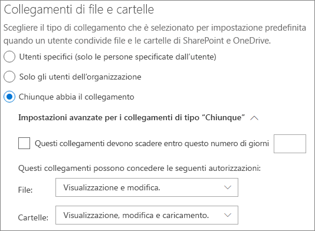
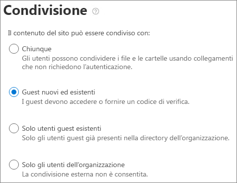

# Collaborazione con gli utenti guest in un team

Se occorre collaborare con utenti guest a documenti e attività e comunicare, è consigliabile usare Microsoft Teams. Teams offre tutte le funzionalità di collaborazione disponibili in Office e SharePoint con una chat persistente e un set personalizzabile ed estendibile di strumenti di collaborazione in un'esperienza utente unificata.

Questo articolo illustra la procedura di configurazione di Microsoft 365 necessaria per consentire a un team di collaborare con utenti guest. Dopo aver configurato l'accesso agli utenti guest, è possibile invitarli ai team seguendo la procedura descritta in [Aggiungere utenti guest a un team in Teams](https://support.microsoft.com/office/fccb4fa6-f864-4508-bdde-256e7384a14f).

## Dimostrazione video

Il video mostra la procedura di configurazione descritta in questo documento. 

> [!VIDEO https://www.microsoft.com/videoplayer/embed/RE44NTr?autoplay=false]

## Impostazioni di collaborazione esterna di Azure

La condivisione in Microsoft 365 è regolata al livello più alto dalle [impostazioni di collaborazione esterna B2B in Azure Active Directory](/azure/active-directory/external-identities/delegate-invitations). Se in Azure AD la condivisione con gli utenti guest è disabilitata o limitata, questa impostazione sovrascrive tutte le impostazioni di condivisione configurate in Microsoft 365.

Controllare le impostazioni di collaborazione esterna B2B per assicurarsi che la condivisione con gli utenti guest non sia bloccata.

Per configurare le impostazioni di collaborazione esterna.

1. Accedere ad Azure Active Directory su [https://aad.portal.azure.com](https://aad.portal.azure.com).
2. Nel riquadro di spostamento a sinistra, fare clic su **Azure Active Directory**.
3. Fare clic su **Identità esterne**.
4. Nella schermata **Attività iniziali**, nel riquadro di spostamento a sinistra, fare clic su **Impostazioni di collaborazione esterna**.
5. Verificare che le opzioni **Amministratori e utenti con il ruolo di guest possono invitare** e **I membri possono invitare** siano entrambe impostate su **Sì**.
6. Se si apportano modifiche, fare clic su **Salva**.

Prendere nota delle impostazioni nella sezione **Restrizioni di collaborazione**. Verificare che i domini degli utenti guest con cui si desidera collaborare non siano bloccati.

Se si lavora con utenti guest da più organizzazioni, è possibile limitare la possibilità di accesso ai dati della directory. In questo modo, non potranno vedere gli altri utenti guest nella directory. A questo scopo in **Restrizioni di accesso degli utenti guest**, selezionare **Gli utenti guest hanno accesso limitato alle proprietà e all'iscrizione delle impostazioni degli oggetti della directory** oppure **L'accesso degli utenti guest è limitato alle proprietà e alle iscrizioni dei propri oggetti della directory**.

## Impostazioni di accesso degli utenti guest

Teams ha un interruttore principale Attivato/Disattivato per l'accesso degli utenti guest e una varietà di impostazioni disponibili per controllare le operazioni che gli utenti guest possono eseguire in un team. L'interruttore principale **Consenti accesso ospite in Teams** deve essere **Attivato** perché l'accesso guest funzioni in Teams.

Verificare che l'accesso guest sia abilitato in Teams e apportare eventuali modifiche alle impostazioni in base alle esigenze aziendali. Tenere presente che le impostazioni influiscono su tutti i team.

Per configurare le impostazioni di accesso guest di Teams

1. Accedere all'interfaccia di amministrazione di Microsoft 365 all'indirizzo [https://admin.microsoft.com](https://admin.microsoft.com).
2. Nel riquadro di spostamento a sinistra, fare clic su **Mostra tutto**.
3. In **Interfacce di amministrazione**, fare clic su **Teams**.
4. Nell'interfaccia di amministrazione di Teams espandere **Impostazioni a livello di organizzazione** nel riquadro di spostamento a sinistra e fare clic su **Accesso guest**.
5. Assicurarsi che l'opzione **Consenti accesso ospite in Teams** sia **** abilitata.
6. Apportare le modifiche desiderate alle impostazioni guest aggiuntive e quindi fare clic su **Salva**.

Dopo aver attivato l'accesso guest in Teams, è possibile controllare in modo facoltativo l'accesso guest a singoli team e relativi siti di SharePoint associati usando etichette di riservatezza. Per altre informazioni, vedere [Usare le etichette di riservatezza per proteggere i contenuti in Microsoft Teams, Gruppi di Microsoft 365 e nei siti di SharePoint](../compliance/sensitivity-labels-teams-groups-sites.md).

> [!NOTE]
> Dopo l'attivazione, potrebbero essere necessarie fino a 24 ore prima che le impostazioni guest di Teams diventino effettive.

## Impostazioni guest di Gruppi di Microsoft 365

Teams usa Gruppi di Microsoft 365 per l'iscrizione al team. Per il funzionamento dell'accesso degli utenti guest in Teams, è necessario che le impostazioni guest di Gruppi di Microsoft 365 siano attivate.

Per configurare le impostazioni guest di Gruppi di Microsoft 365

1. Nel riquadro di spostamento a sinistra dell'interfaccia di amministrazione di Microsoft 365, espandere **Impostazioni**.
2. Fare clic su **Impostazioni organizzazione**.
3. Nell'elenco, fare clic su **Gruppi di Microsoft 365**.
4. Verificare che le caselle di controllo **Consenti ai proprietari del gruppo di aggiungere persone esterne all'organizzazione ai Gruppi di Microsoft 365 come utenti guest** e **Consenti ai membri del gruppo guest di accedere ai contenuti del gruppo** siano entrambe selezionate.
5. Se si apportano modifiche, fare clic su **Salva modifiche**.

## Impostazioni di condivisione a livello di organizzazione in SharePoint

I contenuti dei team, ad esempio file, cartelle ed elenchi, sono tutti archiviati in SharePoint. Per consentire ai guest di accedere a questi elementi in Teams, le impostazioni di condivisione a livello di organizzazione in SharePoint devono consentire la condivisione con gli utenti guest.

Le impostazioni a livello di organizzazione determinano quali impostazioni sono disponibili per i singoli siti, tra cui i siti associati ai team. Le impostazioni del sito non possono essere più permissive delle impostazioni a livello di organizzazione.

Se si vuole consentire la condivisione di file e cartelle con utenti non autenticati, scegliere **Chiunque**. Per assicurarsi che tutti gli utenti guest siano autenticati, scegliere **Utenti guest nuovi ed esistenti**. Scegliere l'impostazione più permissiva necessaria a tutti i siti dell'organizzazione.

Per configurare le impostazioni di condivisione a livello di organizzazione in SharePoint

1. Nel riquadro di spostamento a sinistra dell'interfaccia di amministrazione di Microsoft 365, in **Interfacce di amministrazione**, fare clic su **SharePoint**.
2. Nel riquadro di spostamento a sinistra dell'interfaccia di amministrazione di SharePoint, espandere **Criteri** poi fare clic su **Condivisione**.
3. Assicurarsi che la condivisione esterna per SharePoint sia impostata su **Chiunque** oppure **Utenti guest nuovi ed esistenti**.
4. Se si apportano modifiche, fare clic su **Salva**.

## Impostazioni dei collegamenti predefiniti a livello di organizzazione di SharePoint

Le impostazioni predefinite per i collegamenti a file e cartelle determinano le opzioni di collegamento visualizzate dagli utenti per impostazione predefinita durante la condivisione di un file o una cartella. Se si desidera, gli utenti possono modificare il tipo di collegamento in una delle altre opzioni prima della condivisione.

Tenere presente che questa impostazione influisce su tutti i team e i siti di SharePoint dell'organizzazione.

Scegliere uno dei tipi di collegamento seguenti, selezionato per impostazione predefinita, quando gli utenti condividono file e cartelle:

- **Chiunque abbia il collegamento**: scegliere questa opzione se si prevede di eseguire molte condivisioni non autenticate di file e cartelle. Se si desidera autorizzare *Chiunque* abbia il collegamento, ma si è preoccupati in caso di condivisione accidentale non autenticata, considerare una delle altre opzioni come predefinite. Questo tipo di collegamento è disponibile solo se è stata abilitata la condivisione **Chiunque**.
- **Solo gli utenti dell'organizzazione**: scegliere questa opzione se si prevede che la maggior parte delle condivisioni di file e cartelle sia con persone interne all'organizzazione.
- **Utenti specifici**: valutare questa opzione se si prevede di condividere molti file e cartelle con utenti guest. Questo tipo di collegamento funziona con gli utenti guest e richiede l'autenticazione degli utenti.
 

Per configurare le impostazioni dei collegamenti predefiniti a livello di organizzazione in SharePoint

1. Passare alla pagina Condivisione nell'interfaccia di amministrazione di SharePoint.
2. In **Collegamenti a file e cartelle**, selezionare il collegamento di condivisione predefinito che si desidera usare.
3. Se si apportano modifiche, fare clic su **Salva**.

## Creazione di un team

Il passaggio successivo consiste nel creare il team che si prevede di usare per collaborare con gli utenti guest.

Per creare un team
1. In Teams, nella scheda **Teams**, fare clic su **Partecipa o crea un team** nella parte inferiore del riquadro a sinistra.
2. Fare clic su **Crea team**.
3. Fare clic su **Creare un team da zero**.
4. Scegliere **Privato** o **Pubblico**.
5. Digitare un nome e una descrizione per il team e fare clic su **Crea**.
6. Fare clic **Ignora**.

In seguito verranno invitato gli utenti. È quindi importante controllare le impostazioni di condivisione a livello di sito per il sito di SharePoint associato al team.

## Impostazioni di condivisione a livello di sito di SharePoint

Controllare le impostazioni di condivisione a livello di sito per assicurarsi che consentano il tipo di accesso desiderato per il team. Ad esempio, se si configurano le impostazioni a livello di organizzazione su **Chiunque**, ma si vuole che tutti gli utenti guest siano autenticati per accedere al team, verificare che le impostazioni di condivisione a livello di sito siano impostate su **Utenti guest nuovi ed esistenti**.

Per configurare le impostazioni di condivisione a livello di sito
1. Nel riquadro di spostamento a sinistra dell'interfaccia di amministrazione di SharePoint, espandere **Siti** e fare clic su **Siti attivi**.
2. Selezionare il sito del team appena creato.
3. Fare clic su ... e scegliere **Condivisione**.
4. Verificare che la condivisione sia impostata su **Chiunque** o **Utenti guest nuovi ed esistenti**.
5. Se si apportano modifiche, fare clic su **Salva**.

## Invitare utenti

Le impostazioni di condivisione guest sono ora configurate, quindi è possibile iniziare ad aggiungere gli utenti interni e quelli guest al team. 

Per invitare utenti interni a un team
1. Nel team, fare clic su **Altre opzioni** (**\*\*\***) e quindi su **Aggiungi membri**.
2. Digitare il nome dell'utente da invitare.
3. Fare clic su **Aggiungi**, quindi fare clic su **Chiudi**.

Per invitare utenti guest in un team
1. Nel team, fare clic su **Altre opzioni** (**\*\*\***) e quindi su **Aggiungi membri**.
2. Digitare l'indirizzo di posta elettronica dell'utente guest che si vuole invitare.
3. Fare clic su **Modifica le informazioni relative agli utenti guest**.
4. Digitare il nome completo dell'utente guest e fare clic sul segno di spunta.
5. Fare clic su **Aggiungi**, quindi fare clic su **Chiudi**.

## Vedere anche

[Procedure consigliate per la condivisione di file e cartelle con utenti non autenticati](best-practices-anonymous-sharing.md)

[Limitare l'esposizione accidentale ai file durante la condivisione con gli utenti guest](share-limit-accidental-exposure.md)

[Creare un ambiente di condivisione guest sicuro](create-secure-guest-sharing-environment.md)

[Creare una Extranet B2B con guest gestiti](b2b-extranet.md).

[Integrazione di SharePoint e OneDrive con Azure AD B2B](/sharepoint/sharepoint-azureb2b-integration-preview)

[Le opzioni di condivisione sono disattivate quando si condivide da SharePoint o OneDrive](/sharepoint/troubleshoot/administration/sharing-options-grayed-out-when-sharing-from-sharepoint-online-or-onedrive)