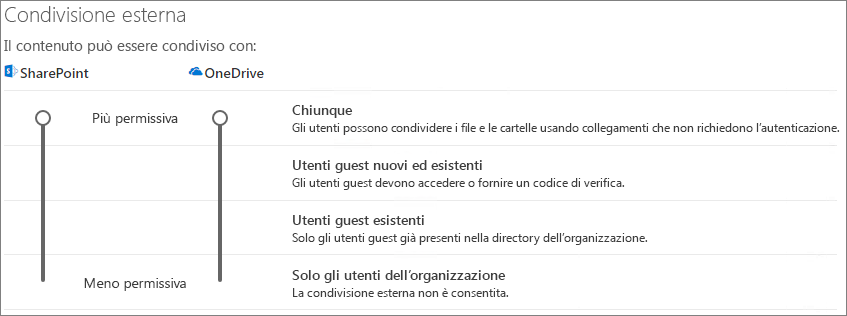

# Collaborare con gli utenti guest a un sito

Se è necessario collaborare con utenti guest tra documenti, dati ed elenchi, è possibile utilizzare un sito di SharePoint. I siti di SharePoint moderni sono connessi ai gruppi di Microsoft 365 e possono gestire l'appartenenza al sito e fornire ulteriori strumenti di collaborazione, ad esempio una cassetta postale condivisa e un calendario.

In questo articolo verranno descritti i passaggi di configurazione di Microsoft 365 necessari per configurare un sito di SharePoint per la collaborazione con gli utenti guest.

## Dimostrazione video

In questo video vengono illustrati i passaggi di configurazione descritti in questo documento. 

> [!VIDEO https://www.microsoft.com/videoplayer/embed/RE44Llg?autoplay=false]

## Impostazioni di collaborazione esterna di Azure

La condivisione in Microsoft 365 è regolata al livello più alto dalle impostazioni di collaborazione esterna [B2B in Azure Active Directory.](https://docs.microsoft.com/azure/active-directory/external-identities/delegate-invitations) Se la condivisione guest è disabilitata o limitata in Azure AD, questa impostazione sostituisce tutte le impostazioni di condivisione configurate in Microsoft 365.

Controllare le impostazioni di collaborazione esterna B2B per assicurarsi che la condivisione con gli utenti guest non sia bloccata.

Per impostare le impostazioni di collaborazione esterna

1. Accedere ad Azure Active Directory all'indirizzo [https://aad.portal.azure.com](https://aad.portal.azure.com) .
2. Nel riquadro di spostamento sinistro fare clic su **Azure Active Directory.**
3. Fare **clic su Identità esterne.**
4. Nel riquadro **di spostamento sinistro** della schermata Introduzione fare clic su Impostazioni collaborazione **esterna.**
5. Verificare che **gli amministratori e gli utenti** nel  ruolo di mittente dell'invito guest possano invitare e che i membri possano invitare siano entrambi impostati su **Sì.**
6. Se si apportano modifiche, fare clic su **Salva**.

Prendere nota delle impostazioni nella **sezione Restrizioni di** collaborazione. Assicurarsi che i domini dei guest con cui si vuole collaborare non siano bloccati.

Se si lavora con utenti guest di più organizzazioni, è possibile limitare la possibilità di accedere ai dati della directory. Ciò impedirà loro di vedere chi altro è un guest nella directory. A tale scopo, in Restrizioni di accesso degli utenti **guest,** selezionare Gli utenti guest hanno accesso limitato alle proprietà e l'appartenenza alle impostazioni degli oggetti **directory** o l'accesso degli utenti Guest è limitato alle proprietà e alle appartenenze dei propri oggetti **directory.**

## Impostazioni guest dei gruppi di Microsoft 365

I siti di SharePoint moderni usano i gruppi di Microsoft 365 per controllare l'accesso al sito. Le impostazioni guest dei gruppi di Microsoft 365 devono essere attivate per consentire il funzionamento dell'accesso guest nei siti di SharePoint.

Per configurare le impostazioni guest dei gruppi di Microsoft 365

1. Nel riquadro di spostamento sinistro dell'interfaccia di amministrazione di Microsoft 365 espandere **Impostazioni.**
2. Fare **clic su Impostazioni organizzazione.**
3. Nell'elenco fare clic su **Gruppi di Microsoft 365.**
4. Verificare che le caselle di controllo Consenti ai proprietari del gruppo di aggiungere persone esterne all'organizzazione ai gruppi di **Microsoft 365** come guest e che le caselle di controllo Consenti ai membri del gruppo **guest** di accedere al contenuto del gruppo siano entrambe selezionate.
5. Se sono state apportate modifiche, fare clic **su Salva modifiche.**

## Impostazioni di condivisione a livello di organizzazione di SharePoint

Per consentire agli utenti guest di accedere ai siti di SharePoint, le impostazioni di condivisione a livello di organizzazione di SharePoint devono consentire la condivisione con gli utenti guest.

Le impostazioni a livello di organizzazione determinano le impostazioni che saranno disponibili per i singoli siti. Le impostazioni del sito non possono essere più permissive delle impostazioni a livello di organizzazione.

Se si desidera consentire la condivisione di file e cartelle non autenticati, scegliere **Chiunque.** Se si desidera assicurarsi che tutte le persone esterne all'organizzazione devono eseguire l'autenticazione, scegliere Utenti guest **nuovi ed esistenti.** Scegliere l'impostazione più permissiva che sarà necessaria a qualsiasi sito dell'organizzazione.

Per configurare le impostazioni di condivisione a livello di organizzazione di SharePoint

1. Nell'interfaccia di amministrazione di Microsoft 365, nel riquadro di spostamento sinistro, in **Interfaccia di amministrazione,** fare clic su **SharePoint.**
2. Nel riquadro di spostamento sinistro dell'interfaccia di amministrazione di SharePoint fare **clic** su Condivisione in **Criteri.**
3. Verificare che la condivisione esterna per SharePoint sia impostata su **Chiunque** o Utenti guest nuovi **ed esistenti.**
4. Se si apportano modifiche, fare clic su **Salva**.

## Creare un sito

Il passaggio successivo consiste nel creare il sito che si prevede di utilizzare per la collaborazione con gli utenti guest.

Per creare un sito
1. Nell'interfaccia di amministrazione di SharePoint, in **Siti** fare clic su **Siti attivi**.
2. Fare clic su **Crea**.
3. Fare clic **su Sito del team.**
4. Digitare un nome di sito e un nome per il proprietario del gruppo (proprietario del sito).
5. In **Impostazioni avanzate** scegliere se si desidera che il sito sia pubblico o privato.
6. Fare clic su **Avanti**.
7. Fare clic su **Fine**.

Inviteremo gli utenti in un secondo momento. Successivamente, è importante controllare le impostazioni di condivisione a livello di sito per questo sito.

## Impostazioni di condivisione a livello di sito di SharePoint

Controllare le impostazioni di condivisione a livello di sito per assicurarsi che consentano il tipo di accesso desiderato per il sito. Ad esempio, se si impostano le impostazioni a livello di organizzazione su **Chiunque**, ma si desidera che tutti gli utenti guest eseercitino l'autenticazione per il sito, verificare che le impostazioni di condivisione a livello di sito siano impostate su Utenti guest nuovi ed **esistenti.**

Si noti che il sito non può essere condiviso con utenti non autenticati **(impostazione** Chiunque), ma è possibile usare singoli file e cartelle.

È inoltre possibile utilizzare [le etichette di riservatezza per controllare le impostazioni di condivisione esterna per i siti di SharePoint.](https://docs.microsoft.com/microsoft-365/compliance/sensitivity-labels-teams-groups-sites)

Per configurare le impostazioni di condivisione a livello di sito
1. Nella parte sinistra dell'interfaccia di amministrazione di SharePoint, espandere **Siti** e fare clic su **Siti attivi**.
2. Selezionare il sito che si desidera condividere.
3. Fare clic su ..., quindi su **Condivisione.**
4. Verificare che la condivisione sia impostata **su Chiunque o** Utenti guest nuovi ed **esistenti.**
5. Se si apportano modifiche, fare clic su **Salva**.

## Invitare utenti

Le impostazioni di condivisione guest sono ora configurate, quindi è possibile iniziare ad aggiungere utenti interni e guest al sito. L'accesso al sito viene controllato tramite il gruppo di Microsoft 365 associato, quindi aggiungeremo gli utenti.

Per invitare utenti interni a un gruppo
1. Passare al sito in cui si desidera aggiungere gli utenti.
2. Fare **clic sul** collegamento Membri in alto a destra che indica il numero di membri.
3. Fare clic su **Aggiungi membri**.
4. Digitare i nomi o gli indirizzi di posta elettronica degli utenti che si desidera invitare nel sito e quindi fare clic su **Salva.**

Gli utenti guest non possono essere aggiunti dal sito. È necessario aggiungerli utilizzando Outlook sul Web. Pertanto, come prerequisito per aggiungere e invitare guest a un gruppo, fare clic sull'URL del sito nella colonna **URL**  per passare alla pagina specifica del sito. Da questa pagina, fare clic **sull'icona di avvio** delle app e selezionare **Outlook.** Questa è la schermata da cui è possibile invitare utenti guest in un gruppo, per la quale la procedura è descritta di seguito.

Per invitare utenti guest a un gruppo
1. In **Gruppi** fare clic sul gruppo a cui si desidera invitare utenti guest.
2. Aprire la scheda contatto del gruppo, fare clic **sul** collegamento Membri in alto a destra (il collegamento che indica il numero di membri).
3. Fare **clic su Aggiungi membri.**
4. Digitare gli indirizzi di posta elettronica dei guest che si desidera invitare e quindi fare clic su **Aggiungi.**
5. Fare clic su **Chiudi**.
Si noti che  è necessario fare clic su Chiudi solo se non si è proprietari del gruppo e, di conseguenza, non è consentito aggiungere il guest al gruppo. In questi casi, la richiesta di aggiungere il guest al gruppo viene trasferita al proprietario del gruppo per l'approvazione.

## Vedere anche

[Procedure consigliate per la condivisione di file e cartelle con utenti non autenticati](best-practices-anonymous-sharing.md)

[Limitare l'esposizione accidentale ai file durante la condivisione con gli utenti guest](share-limit-accidental-exposure.md)

[Creare un ambiente di condivisione guest sicuro](create-secure-guest-sharing-environment.md)

[Creare una Extranet B2B con guest gestiti](b2b-extranet.md).

[Integrazione di SharePoint e OneDrive con Azure AD B2B](https://docs.microsoft.com/sharepoint/sharepoint-azureb2b-integration-preview)
