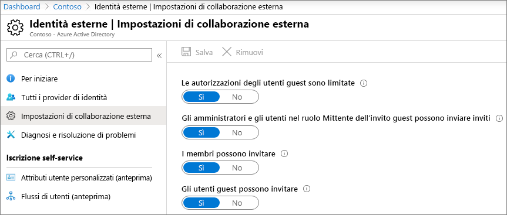
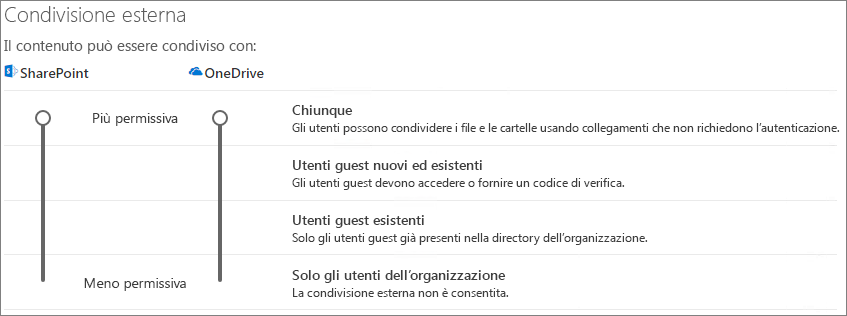
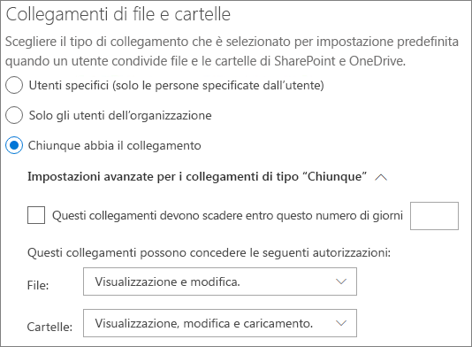
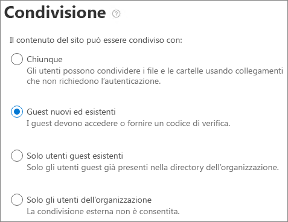

# Collaborare con gli utenti guest a un documento

Se è necessario collaborare con utenti esterni all'organizzazione per documenti in SharePoint o OneDrive, è possibile inviare un collegamento di condivisione al documento. In questo articolo verranno illustrati i passaggi di configurazione di Microsoft 365 necessari per configurare i collegamenti di condivisione per SharePoint e OneDrive per le esigenze dell'organizzazione.

## Dimostrazione video

In questo video vengono illustrati i passaggi di configurazione descritti in questo documento. 

> [!VIDEO https://www.microsoft.com/videoplayer/embed/RE450Vt?autoplay=false]

## Impostazioni delle relazioni organizzative di Azure

La condivisione in Microsoft 365 è regolata al livello più alto dalle [impostazioni delle relazioni organizzative in Azure Active Directory](https://docs.microsoft.com/azure/active-directory/external-identities/delegate-invitations). Se la condivisione degli ospiti è disabilitata o limitata in Azure Active Directory, questa impostazione sostituisce tutte le impostazioni di condivisione configurate in Microsoft 365.

Controllare le impostazioni delle relazioni organizzative per garantire che la condivisione con gli ospiti non sia bloccata.

Per impostare le impostazioni delle relazioni organizzative

Per impostare le impostazioni di collaborazione esterna

1. Accedere a Azure Active Directory all'indirizzo [https://aad.portal.azure.com](https://aad.portal.azure.com) .
2. Nel riquadro di spostamento a sinistra, fare clic su **Azure Active Directory**.
3. Fare clic su **identità esterne**.
4. Nella schermata **inizia** , nel riquadro di spostamento a sinistra, fare clic su **impostazioni di collaborazione esterna**.
5. Verificare che **gli amministratori e gli utenti del ruolo invitato ospite possano invitare** e che **i membri possano invitare** siano entrambi impostati su **Sì**.
6. Se si apportano modifiche, fare clic su **Salva**.

Prendere nota delle impostazioni nella sezione **vincoli di collaborazione** . Verificare che i domini degli utenti con cui si desidera collaborare non siano bloccati.

Se si lavora con clienti provenienti da più organizzazioni, è possibile che si desideri limitare la possibilità di accedere ai dati della directory. Ciò impedirà loro di vedere chi altro è un ospite nella directory. Per eseguire questa operazione, in **restrizioni di accesso degli utenti Guest**, selezionare **Guest gli utenti hanno accesso limitato alle proprietà e l'appartenenza delle impostazioni degli oggetti directory** o **l'accesso degli utenti Guest è limitato alle proprietà e alle appartenenze dei propri oggetti directory**.

## Impostazioni di condivisione a livello di organizzazione di SharePoint

Affinché gli utenti esterni all'organizzazione abbiano accesso a un documento in SharePoint o OneDrive, le impostazioni di condivisione a livello di organizzazione di SharePoint e OneDrive devono consentire la condivisione con utenti esterni all'organizzazione.

Le impostazioni a livello di organizzazione per SharePoint determinano le impostazioni che saranno disponibili per i singoli siti di SharePoint. Le impostazioni del sito non possono essere più permissive rispetto alle impostazioni a livello di organizzazione. L'impostazione a livello di organizzazione per OneDrive determina il livello di condivisione che sarà disponibile nelle raccolte OneDrive degli utenti.

Per SharePoint e OneDrive, se si desidera consentire la condivisione di file e cartelle non autenticata, scegliere **nessuno**. Se si desidera garantire che gli utenti esterni all'organizzazione debbano eseguire l'autenticazione, scegliere **clienti nuovi ed esistenti**. Collegamenti *chiunque* è il modo più semplice per condividere: gli utenti esterni all'organizzazione possono aprire il collegamento senza l'autenticazione e sono liberi di passarlo ad altri utenti.

Per SharePoint, scegliere l'impostazione più permissiva che sarà necessaria per qualsiasi sito dell'organizzazione.

Per impostare le impostazioni di condivisione a livello di organizzazione di SharePoint

1. Nell'interfaccia di amministrazione di Microsoft 365, nel riquadro di spostamento a sinistra, in interfaccia di **Amministrazione**, fare clic su **SharePoint**.
2. Nell'interfaccia di amministrazione di SharePoint, nel riquadro di spostamento a sinistra, in **criteri** fare clic su **condivisione**.
3. Verificare che la condivisione esterna per SharePoint o OneDrive sia impostata su chiunque o su un **utente** **nuovo o esistente**. Si noti che l'impostazione di OneDrive non può essere più permissiva dell'impostazione di SharePoint.
4. Se si apportano modifiche, fare clic su **Salva**.

## Impostazioni di collegamento predefinite a livello di organizzazione di SharePoint

Le impostazioni predefinite per il collegamento di file e cartelle determinano l'opzione di collegamento che verrà visualizzata agli utenti per impostazione predefinita quando condividono un file o una cartella. Gli utenti possono modificare il tipo di collegamento in una delle altre opzioni prima di condividerlo, se necessario.

Tenere presente che questa impostazione influisce sui siti di SharePoint nell'organizzazione, nonché OneDrive.

Scegliere un collegamento tra i tipi seguenti, che vengono quindi selezionati per impostazione predefinita quando gli utenti condividono file e cartelle:

- **Tutti gli utenti con il collegamento** : scegliere questa opzione se si prevede di eseguire molte condivisione di file e cartelle non autenticate. Se si desidera consentire collegamenti a *tutti gli utenti* , ma si è preoccupati per la condivisione accidentale non autenticata, prendere in considerazione una delle altre opzioni come impostazione predefinita. Questo tipo di collegamento è disponibile solo se è stata abilitata la condivisione di **utenti** .
- **Solo persone nell'organizzazione** : scegliere questa opzione se si prevede che la maggior parte della condivisione di file e cartelle sia con le persone all'interno dell'organizzazione.
- **Persone specifiche** : considerare questa opzione se si prevede di eseguire un sacco di condivisione di file e cartelle con gli utenti. Questo tipo di collegamento è compatibile con gli utenti e richiede l'autenticazione.
 

Per impostare le impostazioni dei collegamenti predefiniti a livello di organizzazione di SharePoint e OneDrive

1. Passare alla pagina condivisione nell'interfaccia di amministrazione di SharePoint.
2. In **collegamenti a file e cartelle** selezionare il collegamento di condivisione predefinito che si desidera utilizzare.
3. Se si apportano modifiche, fare clic su **Salva**.

Per impostare l'autorizzazione per il collegamento di condivisione, in **scegliere l'autorizzazione selezionata per impostazione predefinita per i collegamenti di condivisione.**

1. Fare clic su **Visualizza** se non si desidera che gli utenti non autenticati modifichino le modifiche apportate ai file e alle cartelle.
2. Selezionare **modifica** se si desidera consentire agli utenti non autenticati di apportare modifiche ai file e alle cartelle.

Si noti che le due opzioni di premessa precedenti possono essere applicate non solo per gli utenti esterni, ma anche per gli utenti interni. L'opzione di autorizzazione scelta è determinata dalla propria discrezione.

Per impostare le autorizzazioni per i collegamenti che consentono la condivisione con tutti gli utenti

1. In **questi collegamenti è possibile assegnare le autorizzazioni seguenti:** riquadro secondario, 
    1. Nell'elenco a discesa **file** , 
        1. Selezionare **Visualizza e modifica** se si desidera consentire agli utenti non autenticati di apportare modifiche ai file.
        2. Fare clic su **Visualizza** se non si desidera che gli utenti non autenticati apportano modifiche ai file.
    2. Nell'elenco a discesa **cartelle** ,
        1. Selezionare **Visualizza, modifica e carica** se si desidera consentire agli utenti non autenticati di apportare modifiche alle cartelle.
        2. Fare clic su **Visualizza** se non si desidera che gli utenti non autenticati modifichino le cartelle.

## Impostazioni di condivisione a livello di sito di SharePoint

Se si condividono file e cartelle contenuti in un sito di SharePoint, è necessario controllare anche le impostazioni di condivisione a livello di sito per il sito.

Per impostare le impostazioni di condivisione a livello di sito

1. Nell'interfaccia di amministrazione di SharePoint, nel riquadro di spostamento a sinistra, espandere **siti** e fare clic su **siti attivi**.
2. Selezionare il sito in cui si desidera condividere file e cartelle con gli utenti.
3. Scorrere a destra sulla riga (in cui è presente il sito selezionato) e fare clic in qualsiasi punto della colonna **condivisione esterna** .
4. Dalla pagina che viene visualizzata, fare clic su scheda **criteri** .
5. Nel riquadro **condivisione esterna** fare clic su **modifica**.
6. Verificare che la condivisione sia impostata su **tutti gli utenti** o **gli ospiti nuovi e esistenti**.
7. Se si apportano modifiche, fare clic su **Salva**.

## Invitare utenti

Le impostazioni di condivisione Guest sono ora configurate; in questo modo gli utenti possono condividere file e cartelle con utenti esterni all'organizzazione. Per ulteriori informazioni, vedere [condivisione di file e cartelle di OneDrive](https://support.office.com/article/9fcc2f7d-de0c-4cec-93b0-a82024800c07) e [condivisione di file o cartelle di SharePoint](https://support.office.com/article/1fe37332-0f9a-4719-970e-d2578da4941c) .

## Vedere anche

[Procedure consigliate per la condivisione di file e cartelle con utenti non autenticati](best-practices-anonymous-sharing.md)

[Limitare l'esposizione accidentale ai file durante la condivisione con gli utenti guest](share-limit-accidental-exposure.md)

[Integrazione di SharePoint e OneDrive con Azure AD B2B](https://docs.microsoft.com/sharepoint/sharepoint-azureb2b-integration-preview)
