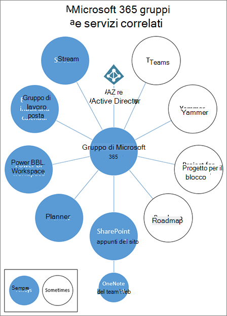
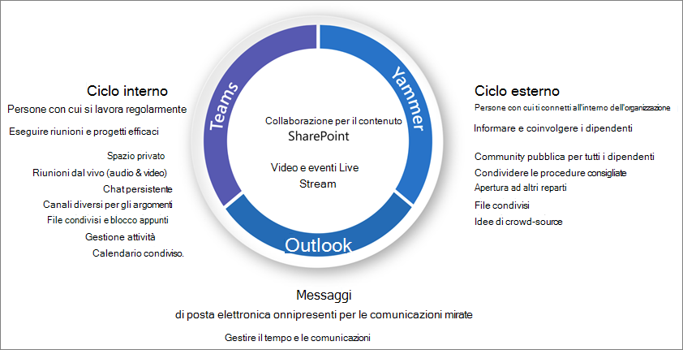

# Che cos'è la governance di collaborazione?What is collaboration governance?

La governance della collaborazione è la modalità di gestione dell'accesso degli utenti alle risorse, la conformità con gli standard aziendali e la sicurezza dei dati.Collaboration governance is how you manage users' access to resources, compliance with your business standards, and ensure the security of your data.

Le organizzazioni oggi utilizzano un set di strumenti diversificato.Organizations today are using a diverse tool set. C'è il team di sviluppatori che utilizza Team Chat, i dirigenti che inviano messaggi di posta elettronica e l'intera organizzazione che si connette a Enterprise Social.There's the team of developers using team chat, the executives sending email, and the entire organization connecting over enterprise social. Gli strumenti di collaborazione multipli sono in uso perché ogni gruppo è univoco e ha le proprie esigenze funzionali e lo stile di lavoro.Multiple collaboration tools are in use because every group is unique and has their own functional needs and work style. Alcuni utilizzeranno solo messaggi di posta elettronica, mentre altri vivranno principalmente in chat.Some will use only email while others will live primarily in chat. 

Se gli utenti avvertono che gli strumenti forniti da IT non soddisfano le proprie esigenze, è probabile che scaricheranno l'app consumer preferita che supporta gli scenari.If users feel the IT-provided tools do not fit their needs, they will likely download their favorite consumer app which supports their scenarios. Sebbene questo processo consenta agli utenti di iniziare rapidamente, comporta una frustrante esperienza utente all'interno dell'organizzazione con più accessi, difficoltà di condivisione e nessun singolo luogo per la visualizzazione del contenuto.Although this process allows users to get started quickly, it leads to a frustrating user experience across the organization with multiple logins, difficulty sharing, and no single place to view content. Questo concetto è denominato "Shadow IT" e rappresenta un rischio significativo per le organizzazioni.This concept is referred to as “Shadow IT” and poses a significant risk to organizations. Riduce la possibilità di gestire in modo uniforme l'accesso degli utenti, garantire la sicurezza e le esigenze di conformità dei servizi.It reduces the ability to uniformly manage user access, ensure security, and service compliance needs.

Servizi quali Microsoft 365 groups, teams e Yammer Empower Users e riduce il rischio di Shadow IT fornendo gli strumenti necessari per collaborare.Services such as Microsoft 365 groups, Teams, and Yammer empower users and reduces the risk of shadow IT by providing the tools needed to collaborate. Microsoft 365 è dotato di un insieme completo di strumenti per implementare tutte le funzionalità di governance che l'organizzazione potrebbe richiedere.Microsoft 365 has a rich set of tools to implement any governance capabilities your organization might require. 

Questa serie di articoli consente di comprendere in che modo i gruppi, i team e le impostazioni di SharePoint interagiscono, quali sono le funzionalità di governance disponibili e come creare e implementare un piano di governance per le funzionalità di collaborazione in Microsoft 365.This series of articles will help you understand how groups, teams, and SharePoint settings interact, what governance capabilities are available, and how to create and implement a governance plan for the collaboration features in Microsoft 365.

## Che cosa sono i gruppi di Microsoft 365?What are Microsoft 365 groups?

I gruppi di Microsoft 365 consentono di scegliere un insieme di persone con cui si desidera collaborare e di configurare facilmente una raccolta di risorse per la condivisione di tali utenti.Microsoft 365 groups lets you choose a set of people with whom you wish to collaborate, and easily set up a collection of resources for those people to share. L'aggiunta di membri al gruppo concede automaticamente le autorizzazioni necessarie a tutte le risorse fornite dal gruppo.Adding members to the group automatically grants the needed permissions to all assets provided by the group. Entrambe le squadre e Yammer utilizzano i gruppi di Microsoft 365 per gestire la propria appartenenza.Both Teams and Yammer use Microsoft 365 groups to manage their membership.

I gruppi di Microsoft 365 includono una serie di risorse collegate che gli utenti possono utilizzare per la comunicazione e la collaborazione.Microsoft 365 groups include a suite of linked resources that users can use for communication and collaboration. I gruppi includono sempre un sito di SharePoint, un pianificatore, un'area di lavoro di Power BI, una cassetta postale e un calendario e Stream.Groups always include a SharePoint site, Planner, a Power BI workspace, a mailbox and calendar, and Stream. A seconda della modalità di creazione del gruppo, è possibile aggiungere altri servizi, ad esempio teams, Yammer e Project.Depending on how you create the group, you can optionally add other services such as Teams, Yammer, and Project.

|RisorsaResource|DescrizioneDescription|
|:------|:----------|
|[CalendarioCalendar](https://support.office.com/article/schedule-a-meeting-on-a-group-calendar-in-outlook-0cf1ad68-1034-4306-b367-d75e9818376a)|Per la pianificazione di eventi relativi al gruppoFor scheduling events related to the group|
|[Posta in arrivoInbox](https://support.office.com/article/have-a-group-conversation-in-outlook-a0482e24-a769-4e39-a5ba-a7c56e828b22)|Per le conversazioni tramite posta elettronica tra i membri del gruppo.For email conversations between group members. La posta in arrivo ha un indirizzo di posta elettronica e può essere impostata in modo da accettare i messaggi provenienti da utenti esterni al gruppo e persino all'esterno dell'organizzazione, analogamente a una lista di distribuzione tradizionale.This inbox has an email address and can be set to accept messages from people outside the group and even outside your organization, much like a traditional distribution list.|
|[Blocco appunti di OneNoteOneNote notebook](https://support.office.com/article/get-started-with-onenote-e768fafa-8f9b-4eac-8600-65aa10b2fe97)|Per la raccolta di idee, ricerche e informazioniFor gathering ideas, research, and information|
|[PlannerPlanner](https://support.office.com/article/microsoft-planner-help-4a9a13c6-3adf-4a60-a6fc-15c0b15e16fc)|Per l'assegnazione e la gestione delle attività di progetto tra i membri del gruppoFor assigning and managing project tasks among your group members|
|[Area di lavoro Power BIPower BI Workspace](https://docs.microsoft.com/power-bi/collaborate-share/service-new-workspaces)|Uno spazio di collaborazione dati con dashboard e reportA data collaboration space with dashboards and reports|
|[Progetto e guida di orientamentoProject and Roadmap](https://support.microsoft.com/project)|Strumenti di gestione dei progetti basati sul WebWeb-based project management tools|
|[Sito del team di SharePointSharePoint team site](https://support.office.com/article/what-is-a-sharepoint-team-site-75545757-36c3-46a7-beed-0aaa74f0401e)|Archivio centrale per informazioni, collegamenti e contenuti relativi al gruppoA central repository for information, links and content relating to your group|
|[StreamStream](https://support.microsoft.com/microsoft-stream)|Un servizio di streaming videoA video streaming service|
|[TeamsTeams](https://support.microsoft.com/teams)|Un'area di lavoro basata su chat in Microsoft 365A chat-based workspace in Microsoft 365|
|[Gruppo YammerYammer group](https://support.office.com/article/Learn-about-Office-365-groups-b565caa1-5c40-40ef-9915-60fdb2d97fa2)|Un luogo comune per avere conversazioni e condividere informazioniA common place to have conversations and share information|

I gruppi Microsoft 365 includono una vasta gamma di controlli di governance, tra cui un criterio di scadenza, convenzioni di denominazione e un criterio di parole bloccate, che consentono di gestire i gruppi nell'organizzazione.Microsoft 365 Groups includes a variety of governance controls, including an expiration policy, naming conventions, and a blocked words policy, to help you manage groups in your organization. Poiché i gruppi controllano l'appartenenza e l'accesso a questo gruppo di risorse, la gestione dei gruppi è una parte fondamentale della collaborazione di governance in Microsoft 365.Because groups control membership and access to this suite of resources, managing groups is a key part of governing collaboration in Microsoft 365.

## Definire una strategia di collaborazione per la propria organizzazioneDefine a collaboration strategy for your organization

Sono disponibili più posizioni per collaborare e avere conversazioni all'interno di Microsoft 365.There are multiple places to collaborate and have conversations within Microsoft 365. La comprensione del punto in cui gli utenti possono avviare conversazioni può aiutare a definire una strategia per la comunicazione.Understanding where users can start conversations can help you define a strategy for communication.

Sono disponibili tre metodi di comunicazione principali supportati da Microsoft 365:There are three main communication methods supported by Microsoft 365:

- Outlook: collaborazione tramite posta elettronica con un gruppo condiviso posta in arrivo e calendarioOutlook: collaboration through email with a shared group inbox and calendar
- Microsoft teams: un'area di lavoro basata su Chat persistente in cui è possibile avere conversazioni informali e in tempo reale su una serie di argomenti, organizzati da sottogruppi specificiMicrosoft Teams: a persistent-chat-based workspace where you can have informal, real-time, conversations around a variety of topics, organized by specific sub-groups
- Yammer: Enterprise Social Experience for CollaborationYammer: enterprise social experience for collaboration

- Teams: area di lavoro basata su chat (collaborazione ad alta velocità) – ciclo internoTeams: chat-based workspace (high velocity collaboration) – inner loop
  - Creato per la collaborazione con le persone con cui gli utenti lavorano ogni giornoBuilt for collaboration with the people your users work with every day
  - Inserisce informazioni a portata di mano degli utenti in una singola esperienzaPuts information at the fingertips of users in a single experience
  - Aggiungere schede, connettori e botAdd tabs, connectors and bots
  - Chat dal vivo, conferenze audio/video, riunioni registrateLive chat, audio/video conferencing, recorded meetings

- Yammer: Connect across the org (Enterprise Social) – ciclo esternoYammer: connect across the org (enterprise social) – outer loop
  - Community of practice-gruppi interfunzionali di persone che condividono un interesse o un'esperienza comune ma non lavorano necessariamente insieme in base alla giornata.Communities of practice - Cross-functional groups of people who share a common interest or expertise but are not necessarily working together on a day-to-day basis
  - Connessione di leadership, community di apprendimento, community basate sui ruoliLeadership connection, learning communities, role-based communities

- Cassetta postale e calendario (collaborazione basata su posta elettronica)Mailbox and calendar (email-based collaboration)
  - Utilizzato per le comunicazioni mirate con un gruppo di personeUsed for targeted communication with a group of people
  - Calendario condiviso per le riunioni con altri membri del gruppoShared calendar for meetings with other group members
 
Quando si determina il modo in cui si desidera utilizzare le funzionalità di collaborazione in Microsoft 365, considerare questi metodi di comunicazione e che è probabile che gli utenti utilizzino in scenari diversi.As you determine how you want to use collaboration features in Microsoft 365, consider these methods of communication and which your users are likely to use in different scenarios.

> [!NOTE]
> Quando viene creato un nuovo gruppo di Office 365 tramite Yammer o teams, il gruppo non è visibile in Outlook o nella rubrica perché la comunicazione principale tra gli utenti avviene nei rispettivi client.When a new Office 365 Group is created via Yammer or Teams, the group isn't visible in Outlook or the address book because the primary communication between those users happens in their respective clients. I gruppi di Yammer non possono essere connessi a teams.Yammer groups cannot be connected to Teams.

## Procedure consigliateBest practices

Quando si avvia il processo di pianificazione della governance, tenere presente le procedure consigliate seguenti:As you start your governance planning process, keep these best practices in mind:

- **Comunicare con gli utenti** : identificare i più grandi utenti delle funzionalità di collaborazione e incontrarli per comprendere i requisiti aziendali principali e gli scenari di utilizzo dei casi.**Talk to your users** - identify your biggest users of collaboration features and meet with them to understand their core business requirements and use case scenarios.

- **Bilancia rischi e vantaggi** -esaminare le esigenze aziendali, normative, legali e di conformità e pianificare una soluzione ottimizzata per tutti i risultati.**Balance risks and benefits** - review your business, regulatory, legal, and compliance needs and plan a solution that optimizes for all outcomes.

- **Adattarsi alle diverse organizzazioni e ai diversi tipi di contenuto e scenari** : considerare le diverse esigenze per i diversi gruppi o reparti e diversi tipi di contenuto, ad esempio il contenuto della rete Intranet rispetto al contenuto di OneDrive di un utente.**Adapt to different organizations and different types of content and scenarios** - consider the different needs for different groups or departments and different types of content such as intranet content versus a user's OneDrive content.

- **Allinea alle priorità aziendali** -gli obiettivi aziendali consentiranno di definire il tempo e l'energia necessari per investire nella governance.**Align to business priorities** - business goals will help you define how much time and energy you need to invest in governance.

- **Incorporare le decisioni di governance direttamente nelle soluzioni create** : molte decisioni di governance possono essere implementate attivando o disattivando le funzionalità in Microsoft 365.**Embed governance decisions directly in the solutions you create** - many governance decisions can be implemented by turning on or off features in Microsoft 365.

- **Rafforzare le** soluzioni di formazione adeguate, ad esempio i [percorsi di apprendimento di Microsoft 365](https://docs.microsoft.com/office365/customlearning) , per garantire che le aspettative specifiche dell'organizzazione siano rinforzate con la formazione fornita da Microsoft.**Reinforce with training** - adapt solutions such as [Microsoft 365 learning pathways](https://docs.microsoft.com/office365/customlearning) to ensure that your organization-specific expectations are reinforced with Microsoft-provided training.

- **Avere una strategia per la comunicazione dei criteri di governance e linee guida nell'organizzazione** : creare un centro di adozione di Microsoft 365 in un sito di comunicazione di SharePoint per comunicare i criteri e le procedure.**Have a strategy for communicating governance policies and guidelines in your organization** - create a Microsoft 365 Adoption Center in a SharePoint communication site to communicate policies and procedures.

- **Definire i ruoli e le responsabilità** : identificare il team di base per la governance e collaborare con le decisioni di governance fondamentali relative al provisioning e ai nomi e all'accesso esterno e quindi utilizzare le decisioni restanti.**Define roles and responsibilities** - identify your governance core team and work through key governance decisions about provisioning and naming and external access first, and then work through the remaining decisions.

- **Rivisitare le proprie decisioni come modifiche aziendali e tecnologiche** : si riuniscono periodicamente per esaminare nuove funzionalità e nuove aspettative aziendali.**Revisit your decisions as business and technology changes** - meet periodically to review new capabilities and new business expectations.

Per informazioni più approfondite su queste procedure, leggere [creare il piano di governance di collaborazione](collaboration-governance-first.md).For a closer look at these practices, read [Create your collaboration governance plan](collaboration-governance-first.md).

## Gestione delle modifiche e degli effetti degli utenti finaliEnd user impact and change management

Poiché i gruppi e i team possono essere creati in diversi modi, è consigliabile addestrare gli utenti a utilizzare il metodo più adatto alla propria organizzazione:Because groups and teams can be created in several ways, we recommend training your users to use the method that fits your organization the best:

- Se l'organizzazione esegue la maggior parte della propria comunicazione tramite posta elettronica, indicare agli utenti di creare gruppi in Outlook.If your organization does most of its communication using email, instruct your users to create groups in Outlook.
- Se l'organizzazione usa fortemente SharePoint o sta eseguendo la migrazione da SharePoint locale, è necessario indicare agli utenti di creare siti del team di SharePoint per la collaborazione.If your organization heavily uses SharePoint or is migrating from SharePoint on-premises, instruct your users to create SharePoint team sites for collaboration.
- Se l'organizzazione ha distribuito Team, indicare agli utenti di creare un team quando è necessario disporre di uno spazio di collaborazione.If your organization has deployed Teams, instruct your users to create a team when they need need a collaboration space.

In questo modo si evita confusione se gli utenti non hanno familiarità con la relazione tra i gruppi e i servizi correlati.This helps avoid confusion if users are unfamiliar with how groups relate to their related services. Per ulteriori informazioni su come comunicare con gli utenti sui gruppi, vedere [explaining Microsoft 365 groups to your users](../admin/create-groups/explain-groups-knowledge-worker.md).For more information about how to talk to your users about groups, see [Explaining Microsoft 365 Groups to your users](../admin/create-groups/explain-groups-knowledge-worker.md).

## Funzionalità di governance e requisiti di licenzaKey governance capabilities and licensing requirements

Le funzionalità di governance per la collaborazione in Microsoft 365 includono funzionalità di Microsoft 365, teams, SharePoint e Azure Active Directory.Governance capabilities for collaboration in Microsoft 365 include features in Microsoft 365, Teams, SharePoint, and Azure Active Directory.

| Capacità o funzionalitàCapability or feature | DescrizioneDescription | LicenzeLicensing |
|:----------------------|:------------|:----------|
|Condivisione di team e sitiTeam and site sharing|Controllare se Team, gruppi e siti possono essere condivisi con utenti esterni all'organizzazione.Control if teams, groups, and sites can be shared with people outside your organization.|Microsoft 365 E5 o E3Microsoft 365 E5 or E3|
|Consenti/blocca dominioDomain allow/block|Limitare la condivisione con utenti esterni all'organizzazione a utenti provenienti da domini specifici.Restrict sharing with people outside your organization to people from specific domains.|Microsoft 365 E5 o E3Microsoft 365 E5 or E3|
|Creazione siti in modalità self-serviceSelf-service site creation|Consentire o impedire agli utenti di creare i propri siti di SharePoint.Allow or prevent users from creating their own SharePoint sites.|Microsoft 365 E5 o E3Microsoft 365 E5 or E3|
|Condivisione di file e siti con restrizioniRestricted site and file sharing|Limitare la condivisione di siti, file e cartelle ai membri di un gruppo di sicurezza specifico.Restrict site, file, and folder sharing to members of a specific security group.|Microsoft 365 E5 o E3Microsoft 365 E5 or E3|
|Creazione di gruppi con restrizioniRestricted group creation|Limitare la creazione di team e gruppi ai membri di un gruppo di sicurezza specifico.Restrict team and group creation to members of a specific security group.|Microsoft 365 E5 o E3 con le licenze di Azure ad Premium o Azure AD Basic EDUMicrosoft 365 E5 or E3 with Azure AD Premium or Azure AD Basic EDU licenses|
|Criteri di denominazione dei gruppiGroup naming policy|Applicare prefissi o suffissi per i nomi di gruppi e team.Enforce prefixes or suffixes on group and team names.|Microsoft 365 E5 o E3 con le licenze di Azure ad Premium o Azure AD Basic EDUMicrosoft 365 E5 or E3 with Azure AD Premium or Azure AD Basic EDU licenses|
|Criteri di scadenza del gruppoGroup expiration policy|Impostare i gruppi inattivi e i team in modo che scadano e vengano eliminati dopo un determinato periodo di tempo.Set inactive groups and teams to expire and be deleted after a specified period of time.|Microsoft 365 E5 o E3 con licenze Premium di Azure ADMicrosoft 365 E5 or E3 with Azure AD Premium licenses|
|Accesso guest per gruppoPer-group guest access|Consentire o impedire la condivisione di team e gruppi con utenti esterni all'organizzazione in base ai singoli gruppi.Allow or prevent team and group sharing with people outside your organization on a per-group basis.|Microsoft 365 E5 o E3Microsoft 365 E5 or E3|

## Creare il piano di governanceCreate your governance plan

Seguire questi passaggi di base per creare il piano di governance:Follow these basic steps to create your governance plan:

1. Prendere in considerazione gli obiettivi e i processi aziendali chiave: [creare un piano di governance](collaboration-governance-first.md) per soddisfare le esigenze della propria azienda.Consider key business goals and processes - [create your governance plan](collaboration-governance-first.md) to meet the needs of your business.
2. Comprendere le impostazioni nei servizi: le impostazioni in [gruppi e SharePoint](groups-sharepoint-governance.md) interagiscono tra loro, come [le impostazioni di gruppi, SharePoint e teams](groups-sharepoint-teams-governance.md) e [altri servizi](groups-services-interactions.md).Understand settings in services - [settings in groups and SharePoint](groups-sharepoint-governance.md) interact with each other, as do [settings in groups, SharePoint and Teams](groups-sharepoint-teams-governance.md) and [other services](groups-services-interactions.md). Assicurarsi di comprendere queste interazioni quando si pianifica la strategia di governance.Be sure to understand these interactions as you plan your governance strategy.
3. Pianificare la gestione dell'accesso utente-pianificare [il livello di accesso che si desidera concedere agli utenti in gruppi, SharePoint e team](groups-teams-access-governance.md).Plan to manage user access - plan [the level of access you want to grant users in groups, SharePoint, and Teams](groups-teams-access-governance.md).
4. Pianificare la gestione delle impostazioni di conformità-esaminare le [Opzioni di conformità disponibili per i gruppi di Microsoft 365, i team e la collaborazione di SharePoint](groups-teams-compliance-governance.md).Plan to manage compliance settings - review the available [compliance options for Microsoft 365 groups, Teams, and SharePoint collaboration](groups-teams-compliance-governance.md).
5. Pianificare la gestione delle comunicazioni-esaminare le [Opzioni di governance delle comunicazioni disponibili per gli scenari di collaborazione](groups-teams-communication-governance.md).Plan to manage communications - review the available [communications governance options for collaboration scenarios](groups-teams-communication-governance.md).
6. Pianificare la governance dell'organizzazione e del ciclo di vita: scegliere [i criteri che si desidera utilizzare per la creazione di gruppi e team, la denominazione, la scadenza e l'archiviazione](plan-organization-lifecycle-governance.md).Plan for organization and lifecycle governance - choose [the policies you want to use for group and team creation, naming, expiration, and archiving](plan-organization-lifecycle-governance.md). Comprendere inoltre le [Opzioni relative alla fine del ciclo di vita per gruppi, team e Yammer](end-life-cycle-groups-teams-sites-yammer.md)Also, understand the [end of lifecycle options for groups, teams, and Yammer](end-life-cycle-groups-teams-sites-yammer.md)

## Formazione per gli amministratoriTraining for administrators

Questi moduli di formazione di Microsoft Learn consentono di imparare le funzionalità di collaborazione in teams e SharePoint.These training modules from Microsoft Learn can help you learn the collaboration features in Teams and SharePoint.

#### TeamsTeams

|FormazioneTraining:|Gestione della collaborazione in team con Microsoft TeamsManage team collaboration with Microsoft Teams|
|:---|:---|
||Gestione della collaborazione in team con Microsoft Teams descrive caratteristiche e funzionalità di Microsoft Teams, l'hub centrale per la collaborazione in team di Microsoft 365.Manage team collaboration with Microsoft Teams introduces you to the features and capabilities of Microsoft Teams, the central hub for team collaboration in Microsoft 365. Viene spiegato in che modo usare Teams per facilitare il lavoro in team e la comunicazione all'interno dell'organizzazione, in locale e in remoto, su un'ampia gamma di dispositivi, dai PC fissi ai tablet o telefoni, sfruttando al contempo tutte le interessanti funzionalità delle applicazioni di Office 365.You’ll learn how you can use Teams to facilitate teamwork and communication within your organization, both on and off premises, on a wide range of devices—from desktops to tablets to phones—while taking advantage of all the rich functionality of Office 365 applications. Si potrà acquisire una panoramica del modo in cui Teams offre un ambiente completo e flessibile per la collaborazione tra applicazioni e dispositivi.You’ll gain an understanding of how Teams provides a comprehensive and flexible environment for collaboration across applications and devices. Questo percorso di apprendimento può essere utile per prepararsi per la certificazione Microsoft 365 Certified: Teams Administrator Associate.This learning path can help you prepare for the Microsoft 365 Certified: Teams Administrator Associate certification.  2 hr 17 min-percorso di apprendimento-5 moduli2 hr 17 min - Learning Path - 5 Modules|

> [!div class="nextstepaction"]
> [Avviare >Start >](https://docs.microsoft.com/learn/modules/m365-teams-collab-prepare-deployment/introduction/)

#### SharePointSharePoint

|FormazioneTraining:|Collaborare con SharePoint in Microsoft 365Collaborate with SharePoint in Microsoft 365|
|:---|:---|
||Gestire il contenuto condiviso con Microsoft SharePoint introduce alle funzionalità e caratteristiche di SharePoint e al suo funzionamento con Microsoft 365.Manage shared content with Microsoft SharePoint introduces you to the features and capabilities of SharePoint, and how it works with Microsoft 365. Verranno apprese informazioni riguardanti i diversi tipi di siti di SharePoint, inclusi i siti hub, nonché la protezione delle informazioni, la creazione di report e il monitoraggio.You'll learn about the different types of SharePoint sites, including hub sites, as well as information protection, reporting, and monitoring. Verranno inoltre apprese informazioni su come utilizzare la condivisione di file e cartelle di SharePoint per ottimizzare la collaborazione, su come condividere i file esternamente e come gestire i siti di SharePoint nell'interfaccia di amministrazione di SharePoint.You'll also learn how to use SharePoint file and folder sharing to optimize collaboration, how to share files externally, and how to manage SharePoint sites in the SharePoint admin center. Questo percorso di apprendimento può essere utile per prepararsi per la certificazione Microsoft 365 Certified: Teamwork Administrator Associate.This learning path can help you prepare for the Microsoft 365 Certified: Teamwork Administrator Associate certification.  1 hr 14 min-percorso di apprendimento-4 moduli1 hr 14 min - Learning Path - 4 Modules|

> [!div class="nextstepaction"]
> [Avviare >Start >](https://docs.microsoft.com/learn/modules/m365-teams-sharepoint-plan-sharepoint/introduction/)

## Formazione per gli utenti finaliTraining for end users

Questi moduli di formazione consentono agli utenti di utilizzare Team, gruppi e SharePoint per la collaborazione in Microsoft 365.These training modules can help your users use Teams, groups, and SharePoint for collaboration in Microsoft 365.

|TeamsTeams|SharePointSharePoint|
|:---|:---|
| **[Configurare e personalizzare il team](https://support.microsoft.com/office/702a2977-e662-4038-bef5-bdf8ee47b17b)****[Set up and customize your team](https://support.microsoft.com/office/702a2977-e662-4038-bef5-bdf8ee47b17b)**| **[Condivisione e sincronizzazione](https://support.microsoft.com/office/98cb2ff2-c27e-42ea-b055-c2d895f8a5de)****[Share and sync](https://support.microsoft.com/office/98cb2ff2-c27e-42ea-b055-c2d895f8a5de)**|
| **[Caricare e trovare file](https://support.microsoft.com/office/57b669db-678e-424e-b0a0-15d19215cb12)****[Upload and find files](https://support.microsoft.com/office/57b669db-678e-424e-b0a0-15d19215cb12)**||
| **[Collaborare in Teams and Channels](https://support.microsoft.com/office/c3d63c10-77d5-4204-a566-53ddcf723b46)****[Collaborate in teams and channels](https://support.microsoft.com/office/c3d63c10-77d5-4204-a566-53ddcf723b46)**|||

## IllustrazioniIllustrations

Queste illustrazioni consentono di comprendere in che modo i gruppi e i team interagiscono con altri servizi in Microsoft 365 e quali funzionalità di governance e conformità sono disponibili per facilitare la gestione di questi servizi nell'organizzazione.These illustrations will help you understand how groups and teams interact with other services in Microsoft 365 and what governance and compliance features are available to help you manage these services in your organization.

### Gruppi in Microsoft 365 per architetti ITGroups in Microsoft 365 for IT Architects
Cosa devono sapere gli architetti IT sui gruppi di Microsoft 365What IT architects need to know about groups in Microsoft 365

|**Elemento****Item**|**Descrizione****Description**|
|:-----|:-----|
|   [PDF](https://github.com/MicrosoftDocs/microsoft-365-docs/raw/public/microsoft-365/downloads/msft-m365-groups.pdf) \| [Visio](https://github.com/MicrosoftDocs/OfficeDocs-Enterprise/raw/live/Enterprise/downloads/msft-m365-groups.vsdx)[PDF](https://github.com/MicrosoftDocs/microsoft-365-docs/raw/public/microsoft-365/downloads/msft-m365-groups.pdf) \| [Visio](https://github.com/MicrosoftDocs/OfficeDocs-Enterprise/raw/live/Enterprise/downloads/msft-m365-groups.vsdx)   Aggiornato nel giugno 2019Updated June 2019|Queste immagini mostrano dettagliatamente i diversi gruppi, come questi vengono creati e gestiti, e alcuni consigli di governance.These illustrations detail the different types of groups, how these are created and managed, and a few governance recommendations.|

### Microsoft Teams e servizi di produttività correlati in Microsoft 365 per architetti ITMicrosoft Teams and related productivity services in Microsoft 365 for IT architects
L'architettura logica dei servizi di produttività in Microsoft 365, con Microsoft Teams.The logical architecture of productivity services in Microsoft 365, leading with Microsoft Teams.

|**Elemento****Item**|**Descrizione****Description**|
|:-----|:-----|
|   [PDF](https://github.com/MicrosoftDocs/microsoft-365-docs/raw/public/microsoft-365/downloads/msft-m365-teams-logical-architecture.pdf) \| [Visio](https://github.com/MicrosoftDocs/OfficeDocs-Enterprise/raw/live/Enterprise/downloads/msft-m365-teams-logical-architecture.vsdx)[PDF](https://github.com/MicrosoftDocs/microsoft-365-docs/raw/public/microsoft-365/downloads/msft-m365-teams-logical-architecture.pdf) \| [Visio](https://github.com/MicrosoftDocs/OfficeDocs-Enterprise/raw/live/Enterprise/downloads/msft-m365-teams-logical-architecture.vsdx)   Aggiornato nell'aprile 2019Updated April 2019   |Microsoft offre una serie di servizi di produttività che interagiscono tra loro per offrire esperienze di collaborazione con governance dei dati, sicurezza e conformità integrate.Microsoft provides a suite of productivity services that work together to provide collaboration experiences with data governance, security, and compliance capabilities.    Questa serie di immagini consente di visualizzare l'architettura logica di servizi di produttività per enterprise architect, con Microsoft Teams.This series of illustrations provides a view into the logical architecture of productivity services for enterprise architects, leading with Microsoft Teams.|

### Microsoft 365 protezione delle informazioni e funzionalità di conformitàMicrosoft 365 information protection and compliance capabilities

Microsoft 365 include una vasta gamma di funzionalità di protezione delle informazioni e conformità.Microsoft 365 includes a broad set of information protection and compliance capabilities. Insieme agli strumenti di produttività di Microsoft, queste funzionalità sono progettate per consentire alle organizzazioni di collaborare in tempo reale, aderendo ai severi Framework di conformità normativi.Together with Microsoft’s productivity tools, these capabilities are designed to help organizations collaborate in real time while adhering to stringent regulatory compliance frameworks. 

Questo set di illustrazioni utilizza uno dei settori più regolamentati, i servizi finanziari, per dimostrare in che modo queste funzionalità possono essere applicate per soddisfare i comuni requisiti normativi.This set of illustrations uses one of the most regulated industries, financial services, to demonstrate how these capabilities can be applied to address common regulatory requirements. È possibile adattare queste illustrazioni per il proprio utilizzo.Feel free to adapt these illustrations for your own use. 

| ElementoItem | DescrizioneDescription |
|:-----|:-----|
|   Italiano: [scaricare come](https://download.microsoft.com/download/3/a/6/3a6ab1a3-feb0-4ee2-8e77-62415a772e53/m365-compliance-illustrations.pdf) \| [Download PDF come Visio](https://download.microsoft.com/download/3/a/6/3a6ab1a3-feb0-4ee2-8e77-62415a772e53/m365-compliance-illustrations.vsdx)  English: [Download as a PDF](https://download.microsoft.com/download/3/a/6/3a6ab1a3-feb0-4ee2-8e77-62415a772e53/m365-compliance-illustrations.pdf)  \| [Download as a Visio](https://download.microsoft.com/download/3/a/6/3a6ab1a3-feb0-4ee2-8e77-62415a772e53/m365-compliance-illustrations.vsdx)   Giapponese: [scaricare come](https://download.microsoft.com/download/6/f/1/6f1a7d0e-dd8e-442e-b073-8e94327ae4f8/m365-compliance-illustrations.pdf) \| [Download PDF come Visio](https://download.microsoft.com/download/6/f/1/6f1a7d0e-dd8e-442e-b073-8e94327ae4f8/m365-compliance-illustrations.vsdx)  Japanese: [Download as a PDF](https://download.microsoft.com/download/6/f/1/6f1a7d0e-dd8e-442e-b073-8e94327ae4f8/m365-compliance-illustrations.pdf)  \| [Download as a Visio](https://download.microsoft.com/download/6/f/1/6f1a7d0e-dd8e-442e-b073-8e94327ae4f8/m365-compliance-illustrations.vsdx)   Aggiornato il 2020 novembreUpdated November 2020|IncludeIncludes: <ul><li>  Microsoft Information Protection e prevenzione della perdita di datiMicrosoft information protection and data loss prevention</li><li>Criteri di conservazione ed etichette di conservazione.Retention policies and retention labels </li><li>Barriere informativeInformation barriers</li><li>Conformità delle comunicazioniCommunication compliance</li><li>Rischio InsiderInsider risk</li><li>Ingestione dei dati di terze partiThird-party data ingestion</li>|

## Sessioni conferenzaConference sessions

Per ulteriori informazioni sulla governance per i gruppi e i team di Microsoft 365, vedere le sessioni di conferenza.Watch these conference sessions to learn more about governance for Microsoft 365 Groups and Teams.

**Aspetti fondamentali****Fundamentals**

Informazioni sui principi fondamentali e le nuove innovazioni nei gruppi di Microsoft 365, tra cui la gestione e la governance in scala, procedure consigliate per l'utilizzo e l'adozione di guida e self-service.Learn the fundamentals and new innovations in Microsoft 365 Groups, including management and governance at scale, best practices for driving usage and adoption, and self-service.

- [Abbraccia i gruppi di Microsoft 365Embrace Microsoft 365 Groups](https://www.youtube.com/watch?v=dAamBF1gb7M)

**Governance****Governance**

Informazioni su come configurare i gruppi del ciclo di vita di scadenza, i criteri di denominazione, le etichette di classificazione, la collaborazione con gli utenti esterni e la gestione delle autorizzazioni per la creazione del gruppo.Learn how to set up your groups expiry lifecycle, naming policies, classification labels, collaboration with external guests, and manage group creation permissions.

- [Trasformare la collaborazione e la lotta Shadow IT con i gruppi di Office 365Transform collaboration and fight shadow IT with Office 365 groups](https://www.youtube.com/watch?v=Bhf_bKx3lAg)

**Esempio di cliente****Customer example**

Vedere un esempio dietro le quinte del modo in cui Microsoft 365 groups, SharePoint, teams e Yammer collaborano per fornire una piattaforma di collaborazione globale.See a behind-the-scenes example of how Microsoft 365 Groups, SharePoint, Teams, and Yammer work together to provide a global collaboration platform.

- [Trovare la propria collaborazione Sweet spot con i gruppi di Office 365, SharePoint, teams e YammerFinding your collaboration sweet spot with Office 365 Groups, SharePoint, Teams, and Yammer](https://www.youtube.com/watch?v=Rx9eVwqXeQk)
