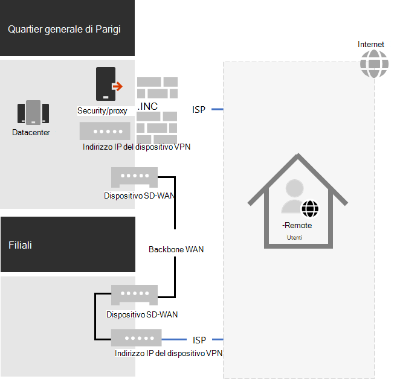
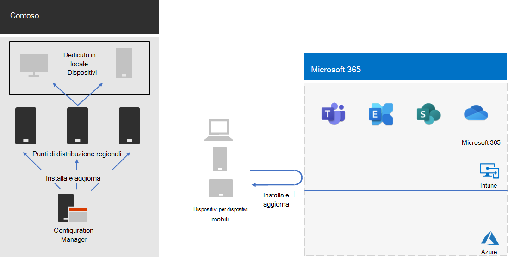

# Risposta e supporto di Contoso COVID-19 per il lavoro remoto e onsiteContoso's COVID-19 response and support for remote and onsite work

Contoso aveva sempre supportato i propri dipendenti remoti, che accedevano alle risorse locali tramite un server VPN centrale nella sede di Parigi.Contoso had always supported its remote workers, who accessed on-premises resources through a central VPN server in the Paris headquarters. Contoso aveva emesso tutti i dipendenti remoti un computer portatile gestito.Contoso had issued all remote workers a managed laptop. I lavoratori locali avevano una combinazione di computer desktop e laptop.On-premises workers had a mixture of desktop computers and laptops.

## Risposta di Contoso a COVID-19Contoso’s response to COVID-19

Con l'insorgenza della pandemia di COVID-19, tutti gli addetti sono stati all'improvviso operatori remoti.With the onset of the COVID-19 pandemic, suddenly all but essential workers were remote workers. Contoso ha risposto spostando la propria forza lavoro in modo da funzionare da casa e condurre le attività primarie tramite l'accesso remoto alle risorse locali e online utilizzando i servizi cloud di Microsoft 365.Contoso responded by shifting its workforce to work from home and conduct its primary activities through remote access to on-premises resources and online using Microsoft 365 cloud services.

Contoso disponeva di server VPN di accesso remoto nell'ufficio della sede di Parigi per supportare il 25% della sua forza lavoro già remota, ma è stato spostato rapidamente per aumentare la capacità di accesso remoto a supporto del 90% del personale.Contoso had remote access VPN servers in the Paris headquarters office to support the 25% of its already remote workforce, but quickly moved to scale up it's remote access capacity to support 90% of its workforce. Contoso ha distribuito i server VPN di accesso remoto in ogni ufficio satellite in modo che i dipendenti remoti utilizzino un punto di ingresso vicino a livello regionale per l'accesso alla rete Intranet contoso.Contoso deployed remote access VPN servers in each satellite office so that remote workers would use a regionally close entry point for access to the Contoso intranet.

Contoso ha inoltre aggiornato la configurazione dei client VPN installati su laptop, tablet e smartphone per il tunneling suddiviso in modo che il traffico per l'insieme di endpoint di Office 365 non sia stato ignorato dalla connessione VPN ed è stato inviato direttamente su Internet.Contoso also updated the configuration of VPN clients installed on laptops, tablets, and smart phones for split tunneling so that traffic for the Optimize set of Office 365 endpoints bypassed the VPN connection and was sent directly over the internet. Per ulteriori informazioni, vedere [ottimizzare la connettività di Office 365 per gli utenti remoti tramite il tunneling Split VPN](../enterprise/microsoft-365-vpn-split-tunnel.md).For more information, see [Optimize Office 365 connectivity for remote users using VPN split tunneling](../enterprise/microsoft-365-vpn-split-tunnel.md).

Ecco la configurazione risultante con i dispositivi VPN installati nella sede di Parigi e in ciascuno degli uffici satellite.Here is the resulting configuration with VPN devices installed in the Paris headquarters and each of the satellite offices. 

Un lavoratore remoto con il client VPN installato utilizza il DNS per trovare l'ufficio più vicino regionalmente e si connette al dispositivo VPN installato.A remote worker with the installed VPN client uses DNS to find the regionally closest office and connects to the VPN device installed there. Con split tunneling, il traffico verso Microsoft 365 Optimize endpoint viene inviato direttamente al percorso di rete Microsoft 365 più vicino a livello regionale.With split tunneling, traffic to Microsoft 365 Optimize endpoints gets sent directly to the regionally closest Microsoft 365 network location. Tutti gli altri traffici vengono inviati tramite la connessione VPN al dispositivo VPN.All other traffic gets sent over the VPN connection to the VPN device.

## Supporto di Contoso per il lavoro remoto e onsiteContoso’s support for remote and onsite work

Dopo aver apportato le modifiche iniziali per supportare principalmente i lavoratori remoti durante le operazioni di blocco regionali, Contoso ha apportato modifiche all'infrastruttura per il supporto di attività remote e onsite in cui un lavoratore potrebbe essere:After the initial changes were made to support mostly remote workers during regional lockdowns, Contoso made infrastructure changes to support remote and onsite work in which a worker could be:

- Sempre a distanza.Always remote.
- Sempre onsite.Always onsite.
- Una combinazione di onsite e remote.A combination of onsite and remote.

Le funzionalità di identità, sicurezza e conformità di Microsoft 365 sono progettate per la relazione di trust zero e per funzionare indipendentemente dalla posizione dell'utente e del dispositivo in uso.Microsoft 365 identity, security, and compliance features are designed for Zero Trust and to work regardless of the location of the user and their device. Per ulteriori informazioni, vedere [zero Trust](https://www.microsoft.com/security/business/zero-trust).For more information, see [Zero Trust](https://www.microsoft.com/security/business/zero-trust).

Tuttavia, la gestione delle nuove installazioni e degli aggiornamenti del software dipende dalla posizione del dispositivo perché il software da installare potrebbe provenire da un'origine locale o da una rete Internet.However, managing new installs and updates of software is dependent on the location of the device because the software to install could come from an on-premises or an internet source. Gli architetti IT di Contoso hanno creato la nuova infrastruttura di installazione e aggiornamento in base alla posizione del dispositivo anziché al lavoratore.Contoso IT architects designed their new installs and updates infrastructure based on the location of the device, rather than the worker.

Sono stati designati due tipi di dispositivi: dedicate in locale e in roaming.They designated two types of devices: dedicated on-premises and roaming.

### Dedicato in localeDedicated on-premises

Un dispositivo locale dedicato è un computer desktop o server che non lascia mai la rete Intranet Contoso e non dispone di un client VPN installato.A dedicated on-premises device is a desktop or server computer that never leaves the Contoso intranet and does not have a VPN client installed. Questi dispositivi locali continuano a usare Microsoft endpoint Configuration Manager e i relativi punti di distribuzione per le installazioni e gli aggiornamenti di Windows 10, Microsoft 365 Apps for Enterprise e del browser perimetrale.These on-premises devices continue to use Microsoft Endpoint Configuration Manager and its distribution points for installs and updates of Windows 10, Microsoft 365 Apps for enterprise, and the Edge browser.

### RoamingRoaming

Un dispositivo di roaming può lasciare la rete Intranet Contoso e include i computer portatili rilasciati a numerosi impiegati e a tutti i lavoratori remoti e ad altri dispositivi di proprietà dell'organizzazione, ad esempio smartphone e tablet con il client VPN contoso installato.A roaming device can leave the Contoso intranet and includes laptops issued to many office workers and all remote workers and other organization-owned devices such as smart phones and tablets with the Contoso VPN client installed. 

Poiché questi dispositivi possono essere connessi a Internet in qualsiasi momento, usano Intune o altri servizi basati su cloud per installazioni e aggiornamenti di Windows 10, Microsoft 365 Apps for Enterprise e Edge.Because these devices can be connected to the Internet at any given time, they use Intune or other cloud-based services for installs and updates of Windows 10, Microsoft 365 Apps for enterprise, and Edge. Non utilizzano i punti di distribuzione di gestione configurazione locali esistenti.They do not use the existing on-premises Configuration Manager distribution points.

Questo significa che alcune delle installazioni e degli aggiornamenti per il dispositivo di roaming verranno eseguite su Internet mentre sono in locale e connesse alla rete Intranet.This means some of the installs and updates for roaming device will be done over the internet while they are on-premises and connected to the intranet. Ma contoso IT Architects ha deciso che la semplicità di configurazione era più importante dell'ottimizzazione della larghezza di banda Intranet su Internet, soprattutto quando la maggior parte dei worker remoti raramente sono connessi alla rete Intranet.But Contoso IT architects decided that simplicity of configuration was more important than optimization of intranet bandwidth to the internet, especially when most remote workers are seldom connected to the intranet.

Di seguito viene visualizzata l'infrastruttura risultante.Here is the resulting infrastructure.

Il comportamento di installazione e aggiornamento viene determinato rendendo gli account computer dei dispositivi membri di uno di questi gruppi:Install and update behavior is determined by making the computer accounts of devices a member of one of these groups:

- OnPremDevicesOnPremDevices

  Il client Configuration Manager sul dispositivo utilizza i punti di distribuzione per le installazioni e gli aggiornamenti.The Configuration Manager client on the device uses distribution points for installs and updates.

- RoamingDevicesRoamingDevices

  Intune e altre impostazioni del dispositivo specificano l'utilizzo della rete Microsoft 365 per le installazioni e gli aggiornamenti.Intune and other settings on the device specify the use of the Microsoft 365 network for installs and updates.

## Nuovo processo di onboardingNew onboarding process

Per un nuovo dispositivo locale dedicato emesso a un nuovo lavoratore o per un nuovo server in un datacenter, quando il lavoratore accede, il client di Configuration Manager basato sull'appartenenza del dispositivo nel gruppo OnPremDevices Scarica e installa gli aggiornamenti più recenti per Windows 10, Microsoft 365 Apps for Enterprise e Edge dai punti di distribuzione di Configuration Manager locali.For a new dedicated on-premises device issued to a new worker or for a new server in a datacenter, when the worker signs in, the Configuration Manager client based on the device's membership in the OnPremDevices group downloads and installs the latest updates for Windows 10, Microsoft 365 Apps for enterprise, and Edge from on-premises Configuration Manager distribution points. Al termine dell'operazione, il dispositivo locale dedicato è pronto per l'uso e utilizza questi punti di distribuzione per gli aggiornamenti in corso.When complete, the dedicated on-premises device is ready for use and uses these distribution points for ongoing updates.

Per un nuovo dispositivo remoto rilasciato a un nuovo lavoratore, quando il lavoratore accede, il dispositivo, in base alla sua appartenenza al gruppo RoamingDevices, contatta il servizio cloud di Intune e altri servizi e download e installa gli aggiornamenti più recenti per Windows 10, Microsoft 365 Apps for Enterprise e Edge.For a new remote device issued to a new worker, when the worker signs in, the device, based on its membership in the RoamingDevices group, contacts the Intune cloud service and other services and downloads and installs the latest updates for Windows 10, Microsoft 365 Apps for enterprise, and Edge. Al termine dell'operazione, il dispositivo remoto è pronto per l'uso e utilizza il client VPN installato per l'accesso alle risorse locali e la rete Microsoft 365 per gli aggiornamenti in corso.When complete, the remote device is ready for use and uses the installed VPN client for access to on-premises resources and the Microsoft 365 network for ongoing updates.

## Passaggio successivoNext step

[Autorizzare gli utenti remoti](empower-people-to-work-remotely.md) nell'organizzazione.[Empower the remote workers](empower-people-to-work-remotely.md) in your organization.
