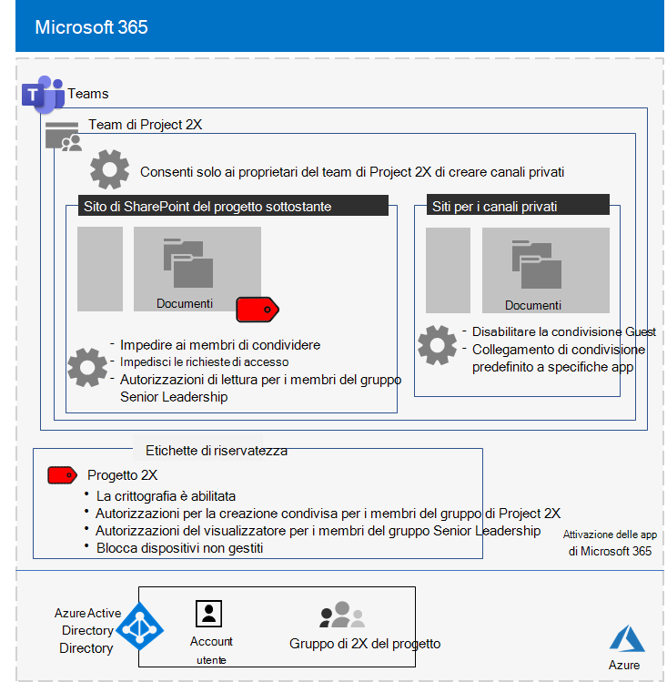
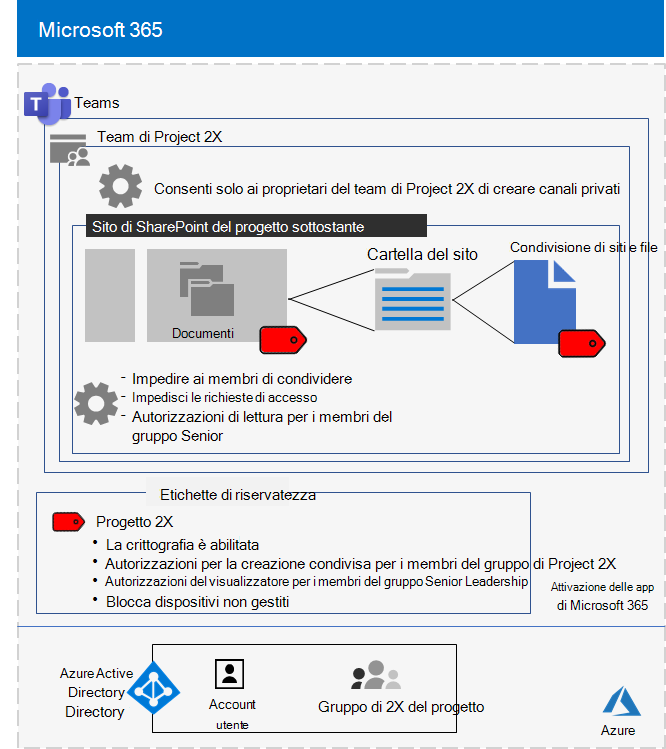

# Team isolato per un progetto Top-Secret di Contoso Corporation

Dopo un Executive fuori sede, il CEO di Contoso ha ordinato lo sviluppo di una nuova famiglia di prodotti e servizi che potrebbe raddoppiare gli utili di Contoso nei prossimi cinque anni. Il progetto Top-Secret per sviluppare il piano aziendale, ingegneristico e di mercato è stato denominato **Project 2x** e il personale chiave in tutta la società sono stati reclutati. 

Le sequenze temporali per la ricerca e lo sviluppo sono state rigorose, il che significa che la collaborazione deve essere efficiente e fornire riunioni sicure, conversazioni e archiviazione dei file.

I risultati finali risultanti per Project 2X sono stati piani aziendali, specifiche di prodotti e di ingegneria e materiali di marketing e pianificazioni in formato Word, Excel e PowerPoint. 

A causa della loro natura sensibile, l'accesso a questi file è stato:

- Limitato ai membri del team di Project 2X.
- Crittografati e protetti con le autorizzazioni per consentire l'accesso solo ai membri del team di Project 2X, anche se i file sono stati distribuiti all'esterno delle cartelle protette.

Il personale IT di Contoso ha utilizzato un [team con isolamento di sicurezza](secure-teams-security-isolation.md) per Project 2x e questi passaggi.

## Passaggio 1: creazione di un team privato

In primo luogo, per proteggere l'accesso al sito di SharePoint sottostante per il team, gli amministratori IT di Contoso hanno configurato i [criteri di accesso di SharePoint consigliati](../enterprise/sharepoint-file-access-policies.md).

Successivamente, un amministratore IT di Contoso ha creato un nuovo team privato denominato Project 2X e aggiunto gli account utente del personale di Project 2X come membri.

Per informazioni dettagliate sulla configurazione, vedere [creare un team privato](secure-teams-security-isolation.md#create-a-private-team).

## Passaggio 2: creazione di un'etichetta di riservatezza per il team di Project 2X

Gli amministratori di Contoso hanno creato una nuova etichetta di riservatezza denominata **Project 2x** che:

- Richiede la crittografia.
- Consente le autorizzazioni di creazione condivisa per il gruppo Project 2X Microsoft 365.

I file nella sezione **Documents** del progetto sottostante 2x sito di SharePoint sono stati protetti da:

- Le autorizzazioni per il sito, che consentono l'accesso solo ai membri del gruppo Project 2X Microsoft 365.
- L'etichetta di riservatezza del progetto 2X, con la crittografia e le autorizzazioni che viaggiano con il file se sono state spostate o copiate dal sito.

Per informazioni dettagliate sulla configurazione, vedere [Create a Sensitivity label](secure-teams-security-isolation.md#create-a-sensitivity-label).

## Passaggio 3: configurazione del sito di SharePoint sottostante

In primo luogo, per proteggere l'accesso al sito di SharePoint sottostante per il team, gli amministratori IT di Contoso hanno configurato i [criteri di accesso di SharePoint consigliati](../enterprise/sharepoint-file-access-policies.md).

Successivamente, sono state configurate le impostazioni di autorizzazione aggiuntive per il sito per impedire che Project 2X condivida l'accesso al sito. Per informazioni dettagliate sulla configurazione, vedere [impostazioni di SharePoint per un team con isolamento della sicurezza](secure-teams-security-isolation.md#sharepoint-settings).

Ecco la configurazione risultante del team di Project 2X.

 ## Passaggio 4: formazione dei membri del team di Project 2X

Il personale di sicurezza Contoso ha preparato i membri del team del progetto 2X in un corso obbligatorio che ha eseguito i seguenti controlli:

- Come accedere al nuovo team di Project 2X, utilizzare riunioni e chat e come collaborare ai file del team.
- Come creare nuovi file nel team e caricare nuovi file creati localmente.
- Dimostrazione del modo in cui il criterio DLP blocca la condivisione esterna dei file.
- Come assegnare etichette ai file con l'etichetta di sensitivity di Project 2X.
- Dimostrazione del modo in cui l'etichetta del progetto 2X protegge un file anche quando lascia il team.

Il risultato finale è un ambiente sicuro in cui i membri del team di Project 2X hanno collaborato in un ambiente sicuro per chat, riunioni e file.

Di seguito è riportato un esempio di un file archiviato nel sito del progetto 2X sottostante con l'etichetta di riservatezza del progetto 2X assegnata.

In una coppia di istanze, Project 2X membri del team hanno scaricato i file protetti dall'etichetta Project 2X su un'unità locale per il lavoro offline. Tuttavia, dopo che sono state richieste le credenziali per l'apertura, si sono accorti del loro errore e li hanno eliminati.

A causa dell'ambiente di collaborazione dei team e delle funzionalità di sicurezza di Microsoft 365, i dettagli di Project 2X sono stati mantenuti segreti per tutta la durata del progetto. Contoso ha annunciato i propri piani ed è in fase di implementazione dei nuovi prodotti e servizi per la gioia dei suoi clienti e investitori e per il disappunto dei suoi concorrenti.

## Passaggio successivo

[Distribuire un team con isolamento di sicurezza](secure-teams-security-isolation.md) nell'organizzazione.

