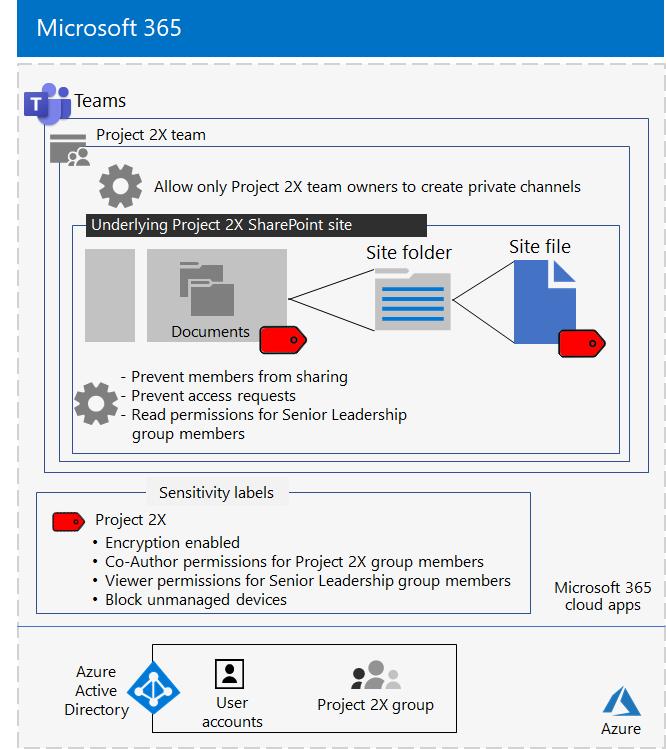

# Team isolato per un progetto top secret di Contoso Corporation

Dopo un fuori sede, il CEO di Contoso ha ordinato lo sviluppo di una nuova famiglia di prodotti e servizi che potrebbero raddoppiare i profitti di Contoso nei prossimi cinque anni. Il progetto top secret per sviluppare il piano aziendale, di progettazione e di mercato è stato denominato **Project 2X** e sono stati assunti personale chiave in tutta l'azienda. 

Le tempistiche per la ricerca e lo sviluppo erano rigide, il che significava che la collaborazione doveva essere efficiente e garantire riunioni sicure, conversazioni in corso e archiviazione di file.

I risultati finali risultanti per Project 2X sono i piani aziendali, le specifiche di prodotto e progettazione, i materiali e le pianificazioni di marketing sotto forma di file di Word, Excel e PowerPoint. 

A causa della loro natura sensibile, l'accesso a questi file era:

- Limitato ai membri del team di Project 2X e ai dirigenti senior.
- Crittografato e protetto con autorizzazioni per consentire l'accesso solo ai membri del team di Project 2X e ai dirigenti senior, anche se i file sono stati distribuiti all'esterno delle cartelle protette.

Il personale IT di Contoso ha utilizzato [un team con isolamento di sicurezza](secure-teams-security-isolation.md) per Project 2X e questi passaggi.

## Passaggio 1: Creare un team privato

Innanzitutto, per proteggere l'accesso al sito di SharePoint sottostante per il team, gli amministratori IT di Contoso hanno configurato i criteri di [accesso di SharePoint consigliati.](../security/office-365-security/sharepoint-file-access-policies.md)

Successivamente, un amministratore IT di Contoso ha creato un nuovo team privato denominato Project 2X e ha aggiunto gli account utente del personale di Project 2X come membri. Il team è stato inoltre configurato in modo che solo i proprietari del team di Project 2X possano creare canali privati.

Per informazioni dettagliate sulla configurazione, vedere [Creare un team privato.](secure-teams-security-isolation.md#create-a-private-team)

## Passaggio 2: Creare un'etichetta di riservatezza per il team di Project 2X

Gli amministratori di Contoso hanno creato una nuova etichetta di riservatezza denominata **Project 2X** che:

- Crittografia abilitata.
- Autorizzazioni Co-Author autorizzazioni per il gruppo di Microsoft 365 di Project 2X.
- Autorizzazioni visualizzatore consentite per il gruppo Senior Leadership.
- Accesso bloccato ai dispositivi non gestiti.

I file nella **sezione Documenti** del sito di SharePoint di Project 2X sottostante sono stati protetti da:

- Le autorizzazioni del sito, che consentono solo le autorizzazioni complete per i membri del gruppo di Microsoft 365 di Project 2X e le autorizzazioni di lettura per il gruppo Senior Leadership.
- Etichetta di riservatezza di Project 2X, con crittografia e autorizzazioni che viaggiano con il file se viene spostato o copiato dal sito.

Per informazioni dettagliate sulla configurazione, vedere [Creare un'etichetta di riservatezza.](secure-teams-security-isolation.md#create-a-sensitivity-label)

## Passaggio 3: Configurare il sito di SharePoint sottostante

Innanzitutto, per proteggere l'accesso al sito di SharePoint sottostante per il team, gli amministratori IT di Contoso hanno configurato i criteri di [accesso di SharePoint consigliati.](../security/office-365-security/sharepoint-file-access-policies.md)

Successivamente, hanno configurato impostazioni di autorizzazione aggiuntive per il sito:

- Per impedire ai membri del gruppo di Project 2X di condividere l'accesso al sito. Per informazioni dettagliate sulla configurazione, vedere [Impostazioni di SharePoint per un team con isolamento di sicurezza.](secure-teams-security-isolation.md#sharepoint-settings)
- Per le autorizzazioni di lettura per il gruppo Senior Leadership.

Successivamente, hanno configurato impostazioni di autorizzazione aggiuntive per il sito per impedire ai membri del gruppo di Project 2X di condividere l'accesso al sito. 

Durante la creazione dei canali privati per Project 2X, il proprietario del gruppo ha disabilitato la condivisione guest e ha impostato il collegamento di condivisione predefinito sul **valore Persone** specifiche.

Ecco la configurazione risultante del team di Project 2X con isolamento di sicurezza.

 ## Passaggio 4: formazione dei membri del team di Project 2X

Il personale di sicurezza di Contoso ha formato i membri del team di Project 2X in un corso obbligatorio che li ha formati attraverso:

- Come accedere al nuovo team di Project 2X, usare riunioni e chat e come collaborare ai file del team.
- Come creare nuovi file nel team e caricare nuovi file creati localmente.
- Come etichettare i file con l'etichetta di riservatezza Project 2X.
- Dimostrazione di come l'etichetta Project 2X protegge un file anche quando lascia il team.

Il risultato finale è stato un ambiente sicuro in cui i membri del team di Project 2X hanno collaborato in un ambiente sicuro per chat, riunioni e file.

Ecco un esempio di un file archiviato nel sito di Project 2X sottostante a cui è assegnata l'etichetta di riservatezza Project 2X.

In un paio di casi, i membri del team di Project 2X scaricano i file protetti dall'etichetta Project 2X in un'unità locale per il lavoro offline. 

Tuttavia, dopo aver richiesto le credenziali all'apertura, si sono resi conto dell'errore e le hanno eliminate.

A causa dell'ambiente di collaborazione di Teams e delle funzionalità di sicurezza di Microsoft 365, i dettagli di Project 2X sono stati mantenuti segreti per tutta la durata del progetto. Contoso ha annunciato i propri piani ed è in corso l'implementazione dei nuovi prodotti e servizi per la soddisfazione dei clienti e degli investitori e per il disappunto dei suoi concorrenti.

## Passaggio successivo

[Distribuire un team con isolamento di sicurezza](secure-teams-security-isolation.md) nell'organizzazione.

