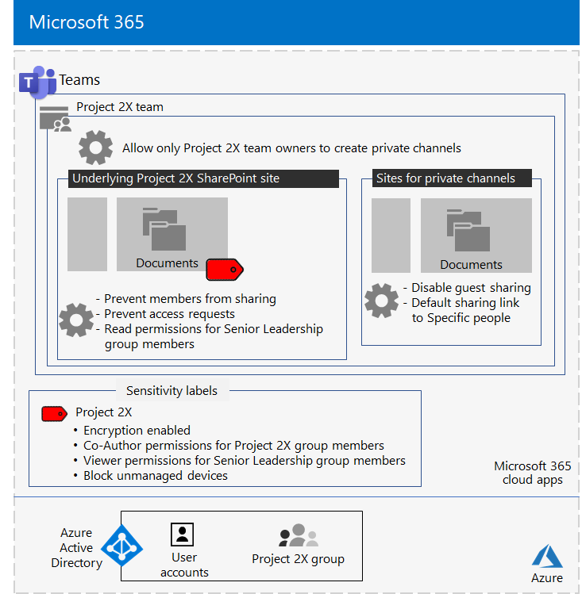

# Team isolato per un progetto Top-Secret di Contoso CorporationIsolated team for a top-secret project of the Contoso Corporation

Dopo un Executive fuori sede, il CEO di Contoso ha ordinato lo sviluppo di una nuova famiglia di prodotti e servizi che potrebbe raddoppiare gli utili di Contoso nei prossimi cinque anni.After an executive offsite, Contoso’s CEO ordered the development of a new suite of products and services that could double Contoso’s profits in the next five years. Il progetto Top-Secret per sviluppare il piano aziendale, ingegneristico e di mercato è stato denominato **Project 2x** e il personale chiave in tutta la società sono stati reclutati.The top-secret project to develop the business, engineering, and market plan was named **Project 2X** and key staff across the company were recruited. 

Le sequenze temporali per la ricerca e lo sviluppo sono state rigorose, il che significa che la collaborazione deve essere efficiente e fornire riunioni sicure, conversazioni e archiviazione dei file.The timelines for research and development were tight, which meant that collaboration had to be efficient and provide for secure meetings, ongoing conversations, and file storage.

I risultati finali risultanti per Project 2X sono stati piani aziendali, specifiche di prodotti e di ingegneria e materiali di marketing e pianificazioni in formato Word, Excel e PowerPoint.The resulting deliverables for Project 2X were business plans, product and engineering specifications, and marketing materials and schedules in the form of Word, Excel, and PowerPoint files. 

A causa della loro natura sensibile, l'accesso a questi file è stato:Due to their sensitive nature, access to these files were:

- Limitato ai membri del team di Project 2X e ai dirigenti.Restricted to Project 2X team members and senior leadership.
- Crittografati e protetti con le autorizzazioni per consentire l'accesso solo ai membri del team di Project 2X e ai dirigenti, anche se i file sono stati distribuiti all'esterno delle cartelle protette.Encrypted and protected with permissions to allow access only to Project 2X team members and senior leadership, even if the files were distributed outside of their secured folders.

Il personale IT di Contoso ha utilizzato un [team con isolamento di sicurezza](secure-teams-security-isolation.md) per Project 2x e questi passaggi.Contoso IT staff used a [team with security isolation](secure-teams-security-isolation.md) for Project 2X and these steps.

## Passaggio 1: creazione di un team privatoStep 1: Created a private team

In primo luogo, per proteggere l'accesso al sito di SharePoint sottostante per il team, gli amministratori IT di Contoso hanno configurato i [criteri di accesso di SharePoint consigliati](../security/office-365-security/sharepoint-file-access-policies.md).First, to protect access to the underlying SharePoint site for the team, Contoso IT administrators configured the [recommended SharePoint access policies](../security/office-365-security/sharepoint-file-access-policies.md).

Successivamente, un amministratore IT di Contoso ha creato un nuovo team privato denominato Project 2X e aggiunto gli account utente del personale di Project 2X come membri.Next, a Contoso IT administrator created a new private team named Project 2X and added the user accounts of Project 2X staff as members. Sono inoltre stati configurati il team in modo che solo i proprietari del team di Project 2X possano creare canali privati.They also configured the team so that only Project 2X team owners can create private channels.

Per informazioni dettagliate sulla configurazione, vedere [creare un team privato](secure-teams-security-isolation.md#create-a-private-team).For the configuration details, see [Create a private team](secure-teams-security-isolation.md#create-a-private-team).

## Passaggio 2: creazione di un'etichetta di riservatezza per il team di Project 2XStep 2: Created a sensitivity label for the Project 2X team

Gli amministratori di Contoso hanno creato una nuova etichetta di riservatezza denominata **Project 2x** che:Contoso admins created a new sensitivity label named **Project 2X** that:

- Crittografia abilitata.Enabled encryption.
- Autorizzazioni Co-Author consentite per il gruppo Project 2X Microsoft 365.Allowed Co-Author permissions for the Project 2X Microsoft 365 group.
- Autorizzazioni del Visualizzatore consentite per il gruppo di leadership senior.Allowed Viewer permissions for the Senior Leadership group.
- Accesso bloccato ai dispositivi non gestiti.Blocked access to unmanaged devices.

I file nella sezione **Documents** del progetto sottostante 2x sito di SharePoint sono stati protetti da:Files in the **Documents** section of the underlying Project 2X SharePoint site were protected by:

- Le autorizzazioni per il sito, che consentono solo autorizzazioni complete ai membri del gruppo Project 2X Microsoft 365 e autorizzazioni di lettura per il gruppo Senior Leadership.The site permissions, which only allow full permissions to members of the Project 2X Microsoft 365 group and read permissions to the Senior Leadership group.
- L'etichetta di riservatezza del progetto 2X, con la crittografia e le autorizzazioni che viaggiano con il file se sono state spostate o copiate dal sito.The Project 2X sensitivity label, with encryption and permissions that travel with the file if it is moved or copied from the site.

Per informazioni dettagliate sulla configurazione, vedere [Create a Sensitivity label](secure-teams-security-isolation.md#create-a-sensitivity-label).For the configuration details, see [Create a sensitivity label](secure-teams-security-isolation.md#create-a-sensitivity-label).

## Passaggio 3: configurazione del sito di SharePoint sottostanteStep 3: Configured the underlying SharePoint site

In primo luogo, per proteggere l'accesso al sito di SharePoint sottostante per il team, gli amministratori IT di Contoso hanno configurato i [criteri di accesso di SharePoint consigliati](../security/office-365-security/sharepoint-file-access-policies.md).First, to protect access to the underlying SharePoint site for the team, Contoso IT administrators configured the [recommended SharePoint access policies](../security/office-365-security/sharepoint-file-access-policies.md).

Successivamente, sono state configurate le impostazioni di autorizzazione aggiuntive per il sito:Next, they configured additional permission settings for the site:

- Per impedire ai membri del gruppo di Project 2X di condividere l'accesso al sito.To prevent Project 2X group members from sharing access to the site. Per informazioni dettagliate sulla configurazione, vedere [impostazioni di SharePoint per un team con isolamento della sicurezza](secure-teams-security-isolation.md#sharepoint-settings).For the configuration details, see [SharePoint settings for a team with security isolation](secure-teams-security-isolation.md#sharepoint-settings).
- Per le autorizzazioni di lettura per il gruppo Senior Leadership.For Read permissions for the Senior Leadership group.

Successivamente, sono state configurate le impostazioni di autorizzazione aggiuntive per il sito per impedire ai membri del gruppo di Project 2X di condividere l'accesso al sito.Next, they configured additional permission settings for the site to prevent Project 2X group members from sharing access to the site. 

Poiché i canali privati per il progetto 2X sono stati creati, il proprietario del gruppo ha disabilitato la condivisione Guest e ha impostato il collegamento di condivisione predefinito sul valore **specifico people** .As private channels for the Project 2X were created, the group owner disabled guest sharing and set the default sharing link to the **Specific people** value.

Ecco la configurazione risultante del team di Project 2X con isolamento della sicurezza.Here is the resulting configuration of the Project 2X team with security isolation.

 ## Passaggio 4: formazione dei membri del team di Project 2XStep 4: Trained Project 2X team members

Il personale di sicurezza Contoso ha preparato i membri del team del progetto 2X in un corso obbligatorio che ha eseguito i seguenti controlli:Contoso security staff trained the Project 2X team members in a mandatory course that stepped them through:

- Come accedere al nuovo team di Project 2X, utilizzare riunioni e chat e come collaborare ai file del team.How to access the new Project 2X team, use meetings and chats, and how to collaborate on team files.
- Come creare nuovi file nel team e caricare nuovi file creati localmente.How to create new files in the team and upload new files created locally.
- Come assegnare etichette ai file con l'etichetta di sensitivity di Project 2X.How to label files with the Project 2X sensitivity label.
- Dimostrazione del modo in cui l'etichetta del progetto 2X protegge un file anche quando lascia il team.A demonstration of how the Project 2X  label protects a file even when it leaves the team.

Il risultato finale è un ambiente sicuro in cui i membri del team di Project 2X hanno collaborato in un ambiente sicuro per chat, riunioni e file.The end result was a secure environment in which Project 2X team members collaborated in a secure environment for chats, meetings, and files.

Di seguito è riportato un esempio di un file archiviato nel sito del progetto 2X sottostante con l'etichetta di riservatezza del progetto 2X assegnata.Here is an example of a file stored in the underlying Project 2X site with the Project 2X sensitivity label assigned.

In una coppia di istanze, Project 2X membri del team hanno scaricato i file protetti dall'etichetta Project 2X su un'unità locale per il lavoro offline.In a couple of instances, Project 2X team members downloaded files protected by the Project 2X label to a local drive for offline work. 

Tuttavia, dopo che sono state richieste le credenziali per l'apertura, si sono accorti del loro errore e li hanno eliminati.However, after being prompted for credentials when opening them, they realized their mistake and deleted them.

A causa dell'ambiente di collaborazione dei team e delle funzionalità di sicurezza di Microsoft 365, i dettagli di Project 2X sono stati mantenuti segreti per tutta la durata del progetto.Because of the collaboration environment of Teams and the security features of Microsoft 365, the details of Project 2X were kept secret for the duration of the project. Contoso ha annunciato i propri piani ed è in fase di implementazione dei nuovi prodotti e servizi per la gioia dei suoi clienti e investitori e per il disappunto dei suoi concorrenti.Contoso announced its plans and is in the process of rolling out the new products and services to the delight of its customers and investors and the chagrin of its competitors.

## Passaggio successivoNext step

[Distribuire un team con isolamento di sicurezza](secure-teams-security-isolation.md) nell'organizzazione.[Deploy a team with security isolation](secure-teams-security-isolation.md) in your organization.

